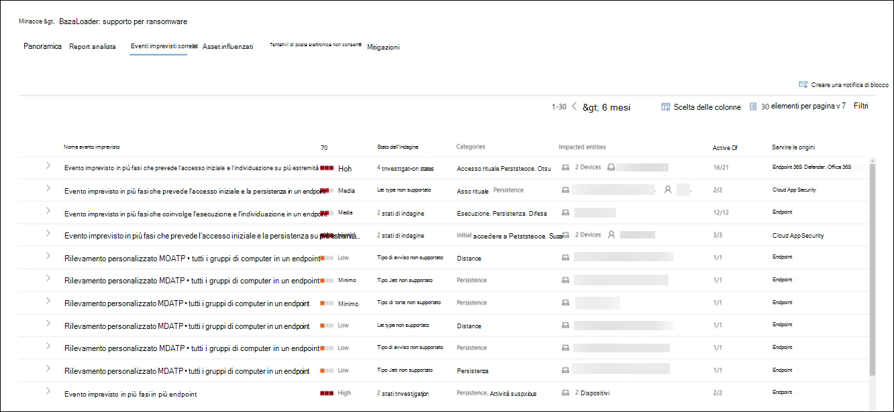
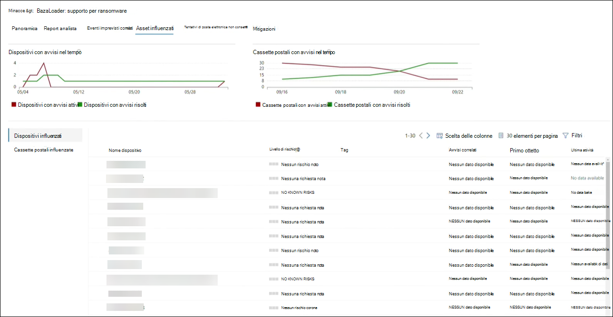
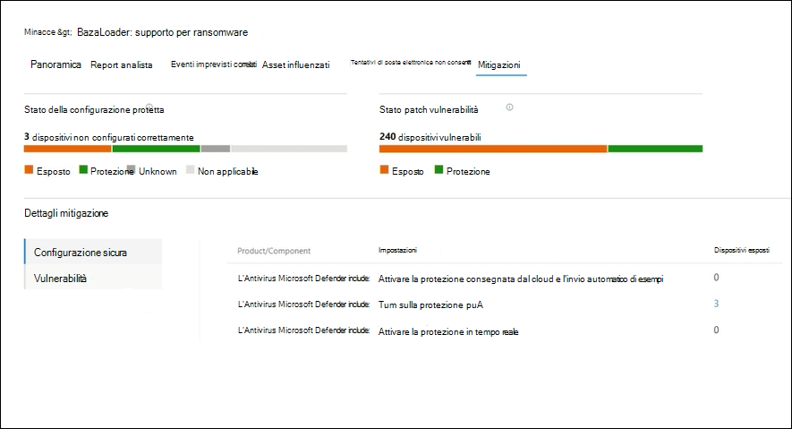

# Tenere traccia e rispondere alle minacce emergenti con l'analisi delle minacce 

[!INCLUDE [Microsoft 365 Defender rebranding](../includes/microsoft-defender.md)]

**Si applica a:**
- Microsoft 365 Defender

> Vuoi provare Microsoft 365 Defender? È possibile [valutarlo in un ambiente lab o](https://aka.ms/mtp-trial-lab) eseguire il progetto pilota in [produzione.](https://aka.ms/m365d-pilotplaybook)
>

[!INCLUDE [Prerelease](../includes/prerelease.md)]

L'analisi delle minacce è la soluzione di intelligence per le minacce nel prodotto di esperti ricercatori di sicurezza Microsoft, progettata per aiutare i team di sicurezza a essere il più efficienti possibile affrontando le minacce emergenti, tra cui:

- Attori delle minacce attive e le loro campagne
- Tecniche di attacco popolari e nuove
- Vulnerabilità critiche
- Superfici di attacco comuni
- Malware diffuso

Guarda questo breve video per saperne di più su come l'analisi delle minacce può aiutarti a tenere traccia delle minacce più recenti e a fermarle.

>[!VIDEO https://www.microsoft.com/en-us/videoplayer/embed/RWwJfU]

È possibile accedere all'analisi delle minacce dal lato superiore sinistro della barra di spostamento del portale di sicurezza di Microsoft 365 o da una scheda del dashboard dedicata che mostra le minacce principali nell'organizzazione. Ottenere visibilità sulle campagne attive o in corso e sapere cosa fare tramite l'analisi delle minacce può aiutare il team delle operazioni di sicurezza a prendere decisioni informate. 

_Dove accedere all'analisi delle minacce_

Con gli avversari più sofisticati e le nuove minacce che emergono spesso e prevalentemente, è fondamentale essere in grado di:

- Identificare e reagire alle minacce emergenti 
- Informazioni se si è attualmente sotto attacco
- Valutare l'impatto della minaccia per le risorse
- Esaminare la resilienza o l'esposizione alle minacce
- Identificare le azioni di mitigazione, ripristino o prevenzione che è possibile eseguire per arrestare o contenere le minacce

Ogni report fornisce un'analisi di una minaccia monitorata e indicazioni dettagliate su come difendersi da tale minaccia. Incorpora inoltre i dati della rete, che indicano se la minaccia è attiva e se sono presenti protezioni applicabili.

## Visualizzare il dashboard di analisi delle minacce

Il dashboard di analisi delle minacce ([security.microsoft.com/threatanalytics3](https://security.microsoft.com/threatanalytics3)) evidenzia i report più rilevanti per l'organizzazione. Riepiloga le minacce nelle sezioni seguenti:

- **Minacce più** recenti: elenca i report sulle minacce pubblicati o aggiornati più di recente, insieme al numero di avvisi attivi e risolti.
- **Minacce ad alto impatto:** elenca le minacce che hanno il maggiore impatto sull'organizzazione. In questa sezione vengono elencate per prime le minacce con il maggior numero di avvisi attivi e risolti.
- **Riepilogo delle** minacce: fornisce l'impatto complessivo di tutte le minacce rilevate mostrando il numero di minacce con avvisi attivi e risolti.

Selezionare una minaccia dal dashboard per visualizzare il report per tale minaccia.

_Dashboard di analisi delle minacce. Puoi anche fare clic sull'icona Cerca per trovare una parola chiave correlata al report di analisi delle minacce che vuoi leggere._ 

## Visualizzare un report di analisi delle minacce

Ogni report di analisi delle minacce fornisce informazioni in diverse sezioni: 

- [**Panoramica**](#overview-quickly-understand-the-threat-assess-its-impact-and-review-defenses) 
- [**Report analista**](#analyst-report-get-expert-insight-from-microsoft-security-researchers)
- [**Eventi imprevisti correlati**](#related-incidents-view-and-manage-related-incidents)
- [**Asset influenzati**](#impacted-assets-get-list-of-impacted-devices-and-mailboxes)
- [**Tentativi di posta elettronica non consentiti**](#prevented-email-attempts-view-blocked-or-junked-threat-emails)
- [**Mitigazioni**](#mitigations-review-list-of-mitigations-and-the-status-of-your-devices)

### Panoramica: comprendere rapidamente la minaccia, valutarne l'impatto ed esaminare le difese

La **sezione Panoramica** offre un'anteprima del report dettagliato degli analisti. Fornisce inoltre grafici che evidenziano l'impatto della minaccia per l'organizzazione e l'esposizione tramite dispositivi non configurati correttamente e senzapatch.

_Sezione Panoramica di un report di analisi delle minacce_

#### Valutare l'impatto sull'organizzazione
Ogni report include grafici progettati per fornire informazioni sull'impatto organizzativo di una minaccia:
- **Eventi imprevisti correlati:** offre una panoramica dell'impatto della minaccia rilevata per l'organizzazione con i dati seguenti:
  - Numero di avvisi attivi e numero di eventi imprevisti attivi a cui sono associati
  - Gravità degli eventi imprevisti attivi
- **Avvisi nel tempo:** mostra il numero di avvisi **attivi** **e risolti** correlati nel tempo. Il numero di avvisi risolti indica la velocità con cui l'organizzazione risponde agli avvisi associati a una minaccia. Idealmente, il grafico dovrebbe mostrare gli avvisi risolti entro pochi giorni.
- **Asset influenzati:** mostra il numero di dispositivi distinti e account di posta elettronica (cassette postali) che attualmente hanno almeno un avviso attivo associato alla minaccia rilevata. Gli avvisi vengono attivati per le cassette postali che hanno ricevuto messaggi di posta elettronica di minaccia. Esaminare i criteri a livello di organizzazione e utente per le sostituzioni che causano il recapito dei messaggi di posta elettronica di minaccia.
- **Tentativi di posta elettronica** non consentiti: indica il numero di messaggi di posta elettronica degli ultimi sette giorni bloccati prima del recapito o recapitati nella cartella posta indesiderata.

#### Esaminare la resilienza e la postura della sicurezza
Ogni report include grafici che forniscono una panoramica della resilienza dell'organizzazione rispetto a una determinata minaccia:
- **Stato configurazione sicura:** indica il numero di dispositivi con impostazioni di sicurezza non configurate correttamente. Applicare le impostazioni di sicurezza consigliate per attenuare la minaccia. I dispositivi sono **considerati sicuri** se hanno applicato _tutte_ le impostazioni rilevate.
- **Stato patch vulnerabilità:** mostra il numero di dispositivi vulnerabili. Applicare aggiornamenti della sicurezza o patch per risolvere le vulnerabilità sfruttate dalla minaccia.

### Report degli analisti: ottenere informazioni approfondite dai ricercatori di sicurezza Microsoft
Nella sezione **Report analista** leggere la descrizione dettagliata dell'esperto. La maggior parte dei report fornisce descrizioni dettagliate delle catene di attacco, tra cui tattiche e tecniche mappate al framework CK di MITRE ATT&, elenchi esaustivi di suggerimenti e potenti indicazioni per la ricerca di [minacce.](advanced-hunting-overview.md)

[Ulteriori informazioni sul report degli analisti](threat-analytics-analyst-reports.md)

### Eventi imprevisti correlati: visualizzare e gestire gli eventi imprevisti correlati
La **scheda Eventi imprevisti** correlati fornisce l'elenco di tutti gli eventi imprevisti correlati alla minaccia rilevata. È possibile assegnare eventi imprevisti o gestire gli avvisi collegati a ogni evento imprevisto. 

_Sezione Eventi imprevisti correlati di un report di analisi delle minacce_

### Asset influenzati: ottenere l'elenco dei dispositivi e delle cassette postali influenzati
Un asset viene considerato interessato se è interessato da un avviso attivo e non risolto. Nella **scheda Asset influenzati** sono elencati i seguenti tipi di asset influenzati:
- **Dispositivi influenzati:** endpoint con avvisi di Microsoft Defender for Endpoint irrisolti. Questi avvisi vengono in genere generati da avvistamenti di indicatori di minaccia e attività noti.
- **Cassette postali influenzate:** cassette postali che hanno ricevuto messaggi di posta elettronica che hanno attivato gli avvisi di Microsoft Defender per Office 365. Sebbene la maggior parte dei messaggi che attivano avvisi sia in genere bloccata, i criteri a livello di utente o di organizzazione possono ignorare i filtri.

_Sezione Asset influenzati di un report di analisi delle minacce_

### Tentativi di posta elettronica non consentiti: visualizzare i messaggi di posta elettronica di minacce bloccate o indesiderate
Microsoft Defender per Office 365 in genere blocca i messaggi di posta elettronica con indicatori di minaccia noti, inclusi collegamenti o allegati dannosi. In alcuni casi, i meccanismi di filtro proattivi che controllano la presenza di contenuti sospetti invieranno invece messaggi di posta elettronica di minacce alla cartella posta indesiderata. In entrambi i casi, le probabilità che la minaccia che avvia il codice malware sul dispositivo sia ridotta.

Nella **scheda Tentativi di posta elettronica** non consentiti sono elencati tutti i messaggi di posta elettronica che sono stati bloccati prima del recapito o inviati alla cartella posta indesiderata da Microsoft Defender per Office 365. 

_Sezione Tentativi di posta elettronica non consentiti di un report di analisi delle minacce_

### Mitigazioni: esaminare l'elenco delle mitigazioni e lo stato dei dispositivi
Nella sezione **Mitigazioni** esaminare l'elenco di suggerimenti specifici che consentono di aumentare la resilienza dell'organizzazione contro la minaccia. L'elenco delle mitigazioni rilevate include:

- **Aggiornamenti della sicurezza:** distribuzione degli aggiornamenti della sicurezza software supportati per le vulnerabilità riscontrate nei dispositivi onboarded
- **Configurazioni di sicurezza supportate**
  - Protezione basata sul cloud  
  - Protezione delle applicazioni potenzialmente indesiderate
  - Protezione in tempo reale
 
Le informazioni di mitigazione contenute in questa sezione incorporano i dati della gestione delle minacce e delle [vulnerabilità,](https://docs.microsoft.com/windows/security/threat-protection/microsoft-defender-atp/next-gen-threat-and-vuln-mgt)che forniscono inoltre informazioni dettagliate di drill-down da vari collegamenti nel report.

 

_Sezione Mitigazioni di un report di analisi delle minacce_

## Ulteriori dettagli e limitazioni del report
>[!NOTE]
>Come parte dell'esperienza di sicurezza unificata, l'analisi delle minacce è ora disponibile non solo per Microsoft Defender for Endpoint, ma anche per i titolari della licenza di Microsoft Defender per Office E5.
>Se non si utilizza il portale di sicurezza di Microsoft 365 (Microsoft 365 Defender), è anche possibile visualizzare i dettagli del report (senza i dati di Microsoft Defender per Office) nel portale di Microsoft Defender Security Center (Microsoft Defender for Endpoint). 

Per accedere al report di analisi delle minacce sono necessari determinati ruoli e autorizzazioni. Per informazioni dettagliate, vedere Ruoli personalizzati nel controllo dell'accesso basato sui ruoli [per Microsoft 365 Defender.](custom-roles.md)
  - Per visualizzare gli avvisi, gli eventi imprevisti o i dati degli asset a impatto, devi disporre delle autorizzazioni per i dati degli avvisi di Microsoft Defender per Office o Microsoft Defender for Endpoint o entrambi.
  - Per visualizzare i tentativi di posta elettronica non consentiti, è necessario disporre delle autorizzazioni per i dati di ricerca di Microsoft Defender per Office. 
  - Per visualizzare le mitigazioni, è necessario disporre delle autorizzazioni per i dati di gestione delle minacce e delle vulnerabilità in Microsoft Defender per Endpoint.

Quando si esaminano i dati di analisi delle minacce, tenere presente i fattori seguenti:
- I grafici riflettono solo le mitigazioni rilevate. Controllare la panoramica del report per ulteriori mitigazioni che non vengono visualizzate nei grafici.
- Le mitigazioni non garantiscono resilienza completa. Le mitigazioni fornite riflettono le migliori azioni possibili necessarie per migliorare la resilienza.
- I dispositivi vengono conteggiati come "non disponibili" se non hanno trasmesso dati al servizio.
- Le statistiche relative all'antivirus si basano sulle impostazioni di Microsoft Defender Antivirus. I dispositivi con soluzioni antivirus di terze parti possono apparire come "esposti".

## Argomenti correlati
- [Trovare in modo proattivo le minacce con la ricerca avanzata](advanced-hunting-overview.md) 
- [Informazioni sulla sezione relativa al report degli analisti](threat-analytics-analyst-reports.md)
- [Valutare e risolvere i punti deboli e le esposizioni della sicurezza](https://docs.microsoft.com/windows/security/threat-protection/microsoft-defender-atp/next-gen-threat-and-vuln-mgt)
