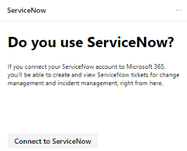

# Gestire i ticket tramite ServiceNow

Microsoft 365 Security Center è in fase di miglioramento grazie alla possibilità di creare e registrare in modo nativo i ticket in ServiceNow. Gli amministratori della sicurezza possono inviare un'azione di miglioramento di [Microsoft Secure Score](microsoft-secure-score.md) direttamente a ServiceNow e creare un ticket. È possibile creare sia la gestione degli incidenti che i ticket di gestione delle modifiche.

## Prerequisiti

Accedere al centro sicurezza Microsoft 365 e a un'istanza di ServiceNow con:  

* Kingston o versione superiore
* Dispongono di credenziali di amministratore HI
* Disporre di privilegi di amministratore per l'istanza del fornitore di destinazione

ServiceNow consiglia agli utenti di mantenere le impostazioni predefinite nell'istanza di ServiceNow. L'utilizzo di personalizzazioni potrebbe causare errori durante il completamento dell'elenco di controllo di installazione e l'integrazione con Microsoft 365 Security Center.

## Scambio di dati

Quando si connette Microsoft 365 Security Center a ServiceNow, Microsoft riceve i dati aggiuntivi seguenti:

* Nome dell'istanza di ServiceNow
* ID client di ServiceNow
* Segreto client di ServiceNow
* Token di aggiornamento & di accesso di ServiceNow

Quando si crea un ticket ServiceNow dal centro sicurezza Microsoft 365, vengono inviati i dati seguenti a ServiceNow:

* ID utente che avvia la creazione del ticket
* Nome attività
* Descrizione attività
* Priority
* Data di scadenza
* Origine raccomandazione (raccomandazione utente o suggerimento Microsoft)
* Categoria di raccomandazione (dispositivi, dati, app, identità, infrastruttura)

## Connettere il Centro sicurezza di Microsoft 365 a ServiceNow

Passare alla Home page del Centro sicurezza Microsoft 365 per visualizzare la scheda di connessione ServiceNow.

Selezionare "Connetti a ServiceNow" per accedere alla pagina di installazione di ServiceNow. Seguire le istruzioni per autorizzare l'app del connettore Microsoft 365.

> [!NOTE]
> Prima di autorizzare la connessione tra Microsoft 365 Security Center e ServiceNow, assicurarsi di utilizzare l'account di accesso e la password dell'utente di integrazione creati nei passaggi di installazione. Non utilizzare le credenziali personali.

Dopo aver seguito le istruzioni e aver autorizzato la connessione, visualizzare lo stato della connessione sia nella pagina connessione al centro sicurezza Microsoft 365 che nell'app ServiceNow di ticketing Connector di Microsoft 365. Ora è tutto pronto per iniziare a creare attività.

## Creare un'attività e condividerla con ServiceNow

Una volta configurata l'integrazione, creare attività di ServiceNow in base a specifiche azioni di miglioramento del Punteggio Microsoft sicuro. Andare a qualsiasi azione di miglioramento in Secure score nel portale Microsoft 365 Security Center e selezionare l'icona "Condividi". Una delle opzioni di menu a discesa è ServiceNow.

Viene generata un'attività in cui è possibile impostare la priorità e modificare il nome, la descrizione o la data di scadenza. Una volta che tutti i campi richiesti sono stati riempiti, inviare l'attività a ServiceNow.

L'attività è visibile in ServiceNow come richiesta di modifica della sicurezza e della configurazione di Microsoft 365.

## Registrare i ticket

Dopo aver creato i ticket di gestione dei cambiamenti di ServiceNow e gestione degli incidenti, vengono visualizzati nelle schede nella Home page del Centro sicurezza Microsoft 365. Da queste schede, è possibile creare un ticket, visualizzare tutti i ticket o gestire la configurazione di ServiceNow.

  

Per eseguire il provisioning o la gestione dell'integrazione di ServiceNow nel centro sicurezza Microsoft 365, selezionare **Gestisci configurazione ServiceNow** su una delle schede. Da qui, rimuovere la connessione ServiceNow corrente e personalizzare i nomi degli Stati dei ticket.

Con i ticket di ServiceNow visibili nel centro sicurezza Microsoft 365, le attività vengono riportate in un luogo in cui possono essere monitorate e applicate insieme agli altri elementi del dashboard di sicurezza.

## Risoluzione dei problemi

### Viene visualizzato un messaggio di errore nel primo passaggio dell'elenco di controllo per l'installazione (OAuth Creation)

**Messaggio di errore**: l'operazione di lettura su' oauth_entity ' dall'ambito ' x_mioms_m365ticket ' è stata rifiutata a causa del criterio di accesso cross-scope della tabella

L'app presuppone che qualsiasi amministratore nell'istanza di ServiceNow possa creare e leggere le entità OAuth. Questo errore potrebbe essere causato da una personalizzazione dell'istanza di ServiceNow, che limita gli utenti autorizzati a creare/leggere le entità OAuth.

**ServiceNow consiglia agli utenti di mantenere la funzionalità predefinita.**

Impostare le configurazioni di tabella "registri applicazioni" su predefinita:

* Label = registri applicazioni
* Name = oauth_entity
* Accessibile da = tutti gli ambiti dell'applicazione
* È possibile selezionare la casella di controllo Leggi =

### Come convalidare l'entità OAuth creata per Microsoft 365 Security & Compliance Connector

Andare alla tabella registri applicazioni (menu > System OAuth > Application Registry) in ServiceNow e individuare l'entità OAuth creata dall'utente (nome assegnato).

### Come convalidare l'utente di integrazione creato con l'elenco di controllo di installazione per Microsoft 365 Security & Compliance Connector

Andare alla tabella users (menu > User Administration > Users) in ServiceNow e trovare l'utente di integrazione creato da voi (nome che è stato assegnato).

Prima di autorizzare la connessione tra Microsoft 365 Security Center e ServiceNow, assicurarsi di utilizzare l'account di accesso e la password dell'utente di integrazione creati nei passaggi di installazione. Non utilizzare le credenziali personali.

### L'installazione è stata completata ma non è possibile visualizzare i ticket e non condividerli

Se i passaggi di installazione e installazione sono stati completati, ma non vengono visualizzate le schede di ServiceNow nella Home page e non è possibile condividere ServiceNow da Microsoft Secure score, controllare lo stato della pagina di provisioning in https://security.microsoft.com/ticketProvisioning. Selezionare **Salva** e torna alla Home page. Le schede devono essere visualizzate.

### L'azienda dispone di accesso Single Sign-on che impedisce la connessione a ServiceNow tramite il Centro sicurezza di Microsoft 365

Se l'azienda ha abilitato il servizio Single Sign-on e viene visualizzato un errore o un account di accesso non riuscito, seguire una delle due soluzioni.

#### Accesso a ServiceNow come utente di integrazione

1. Tornare alla pagina autorizzazione in ServiceNow.
2. Selezionare il collegamento **not you** nell'angolo in alto a destra.
3. Accedere a ServiceNow come utente di integrazione creato in precedenza nell'elenco di controllo di installazione.  
4. Selezionare **Consenti** nella pagina ServiceNow in cui viene chiesto se il connettore di sicurezza + conformità è in grado di connettersi all'account di ServiceNow.
5. Procedere con la procedura di installazione.

#### Creare un utente di amministrazione della sicurezza

1. Creare un utente con privilegi di amministratore della sicurezza in Azure Active Directory. L'utente deve avere lo stesso nome e l'indirizzo di posta elettronica dell'utente di integrazione creato dall'elenco di controllo dell'installazione. È possibile rimuovere il ruolo di amministratore della sicurezza dopo aver completato il login e la connessione.
2. Accedere al centro sicurezza Microsoft 365 come utente e seguire la procedura di installazione.
