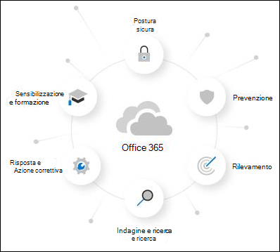

# Informazioni sulla versione di valutazione di Microsoft Defender per Office 365About the Microsoft Defender for Office 365 trial

Microsoft Defender per Office 365 protegge l'organizzazione da minacce dannose poste da messaggi di posta elettronica, collegamenti (URL) e strumenti di collaborazione.Microsoft Defender for Office 365 safeguards your organization against malicious threats that are posed by email messages, links (URLs), and collaboration tools. Defender per Office 365 include:Defender for Office 365 includes:

- **Criteri di protezione dalle minacce**: consente di definire i criteri di protezione dalle minacce per impostare il livello di protezione appropriato per l'organizzazione.**Threat protection policies**: Define threat-protection policies to set the appropriate level of protection for your organization.
- **Report**: visualizzare report in tempo reale per monitorare le prestazioni di Defender per Office 365 nell'organizzazione.**Reports**: View real-time reports to monitor Defender for Office 365 performance in your organization.
- **Funzionalità di analisi e risposta alle minacce**: consente di usare strumenti all'avanguardia per analizzare, comprendere, simulare e prevenire minacce.**Threat investigation and response capabilities**: Use leading-edge tools to investigate, understand, simulate, and prevent threats.
- **Funzionalità di analisi e risposta automatizzate**: consente di risparmiare tempo e fatica nell'analisi e nell'attenuazione delle minacce.**Automated investigation and response capabilities**: Save time and effort investigating and mitigating threats.

Una versione di valutazione di Microsoft Defender per Office 365 è il modo più semplice per provare le funzionalità di Defender per Office 365 e la configurazione richiede solo un paio di clic.A Microsoft Defender for Office 365 trial is the easiest way to try the capabilities of Defender for Office 365, and setting it up only takes a couple of clicks. Al termine della configurazione di valutazione, tutte le funzionalità di Defender per Office 365 Piano 1 e Piano 2 sono disponibili nell'organizzazione per un massimo di 90 giorni.After the trial setup is complete, all Defender for Office 365 Plan 1 and Plan 2 capabilities are available in the organization for up to 90 days.

> [!NOTE]
> La configurazione automatica descritta in questo articolo è attualmente in Anteprima pubblica e potrebbe non essere disponibile nella posizione dell'utente.The automated configuration that's described in this article is currently in Public Preview and might not be available in your location.

## Termini e condizioniTerms and conditions

La versione di valutazione di Defender per Office 365 è disponibile per 90 giorni e può essere avviata per tutti gli utenti.The Defender for Office 365 trial is available for 90 days and can be initiated for all of your users. Per ulteriori informazioni, vedere Condizioni di valutazione di [Microsoft Defender per Office 365 & Condizioni](defender-for-office-365-trial-terms-and-conditions.md).For more information, see [Microsoft Defender for Office 365 Trial Terms & Conditions](defender-for-office-365-trial-terms-and-conditions.md).

## Configurare una versione di valutazione di Defender per Office 365Set up a Defender for Office 365 trial

Una versione di valutazione consente alle organizzazioni di configurare e configurare facilmente le funzionalità di Defender per Office 365.A trial allows organizations to easily set up and configure the Defender for Office 365 capabilities. Durante l'installazione, i criteri esclusivi di Defender per Office 365 (in [particolare,](safe-attachments.md)Allegati [sicuri,](safe-links.md)Collegamenti sicuri e protezione dalla rappresentazione nei criteri di protezione da posta [indesiderata)](set-up-anti-phishing-policies.md#impersonation-settings-in-anti-phishing-policies-in-microsoft-defender-for-office-365)vengono applicati utilizzando il modello Standard per i criteri di sicurezza [predefiniti.](preset-security-policies.md)During setup, policies that are exclusive to Defender for Office 365 (specifically, [Safe Attachments](safe-attachments.md), [Safe Links](safe-links.md), and [impersonation protection in anti-spam policies](set-up-anti-phishing-policies.md#impersonation-settings-in-anti-phishing-policies-in-microsoft-defender-for-office-365)) are applied using the Standard template for [preset security policies](preset-security-policies.md).

Per impostazione predefinita, questi criteri hanno come ambito tutti gli utenti dell'organizzazione, ma gli amministratori possono personalizzare i criteri durante o dopo l'installazione in modo che si applicino solo a utenti specifici.By default, these policies are scoped to all users in the organization, but admins can customize the policies during or after setup so they apply only to specific users.

Durante l'installazione, viene impostata anche la funzionalità di risposta MDO (disponibile in MDO P2 o equivalente) per l'intera organizzazione.During setup, MDO response functionality (found in MDO P2 or equivalent) is also set up for the entire organization. Non è necessario alcun ambito dei criteri.No policy scoping is required.

## LicenzeLicensing

Come parte della configurazione di valutazione, le licenze defender per Office 365 vengono applicate automaticamente all'organizzazione.As part of the trial setup, the Defender for Office 365 licenses are automatically applied to the organization. Le licenze sono gratuite per i primi 90 giorni.The licenses are free of charge for the first 90 days.

## AutorizzazioniPermissions

Per avviare o terminare la versione di valutazione, è necessario essere membri dei ruoli **Amministratore** globale o Amministratore **della** sicurezza in Azure Active Directory.To start or end the trial, you need to be a member of the **Global Administrator** or **Security Administrator** roles in Azure Active Directory. Per informazioni dettagliate, vedere [Informazioni sui ruoli di amministratore.](../../admin/add-users/about-admin-roles.md)For details, see [About admin roles](../../admin/add-users/about-admin-roles.md).

## Informazioni aggiuntiveAdditional information

Dopo la registrazione alla versione di valutazione, potrebbero essere necessarie fino a 2 ore prima che le modifiche e gli aggiornamenti siano disponibili.After you enroll in the trial, it might take up to 2 hours for the changes and updates to be available. Inoltre, gli amministratori devono disconnettersi e accedere di nuovo per visualizzare le modifiche.And, admins must log out and log back in to see the changes.

Gli amministratori possono disabilitare la versione di valutazione in qualsiasi momento andando alla <> carta.Admins can disable the trial at any point by going to the <> card.

## DisponibilitàAvailability

La versione di valutazione di Defender per Office 365 viene gradualmente lanciata ai clienti esistenti che soddisfano criteri specifici (inclusa la geografia) e che non dispongono di licenze Defender per Office 365 Piano 1 o Piano 2 (incluse nell'abbonamento o come componente aggiuntivo).The Defender for Office 365 trial is gradually rolling out to existing customers who meet specific criteria (including geography) and who don't have existing Defender for Office 365 Plan 1 or Plan 2 licenses (included in their subscription or as an add-on).

## Altre informazioni su Defender per Office 365Learn more about Defender for Office 365

Defender per Office 365 aiuta le organizzazioni a proteggere la propria azienda offrendo un elenco completo di funzionalità.Defender for Office 365 helps organizations secure their enterprise by offering a comprehensive slate of capabilities.

Per altre informazioni su Defender per Office 365, vedere questa [guida interattiva.](https://techcommunity.microsoft.com/t5/video-hub/protect-your-organization-with-microsoft-365-defender/m-p/1671189)You can also learn more about Defender for Office 365 at this [interactive guide](https://techcommunity.microsoft.com/t5/video-hub/protect-your-organization-with-microsoft-365-defender/m-p/1671189).

### PrevenzionePrevention

Un solido stack di filtro impedisce un'ampia gamma di attacchi mirati e basati su volume, tra cui la compromissione della posta elettronica aziendale, il phishing delle credenziali, il ransomware e il malware avanzato.A robust filtering stack prevents a wide variety of volume-based and targeted attacks including business email compromise, credential phishing, ransomware, and advanced malware.

- [Criteri anti-phishing: impostazioni esclusive in Defender per Office 365Anti-phishing policies: Exclusive settings in Defender for Office 365](set-up-anti-phishing-policies.md#exclusive-settings-in-anti-phishing-policies-in-microsoft-defender-for-office-365)
- [Allegati sicuriSafe Attachments](safe-attachments.md)
- [Collegamenti sicuriSafe Links](safe-links.md)

### RilevamentoDetection

L'IA leader del settore rileva contenuti dannosi e sospetti e correla i modelli di attacco per identificare le campagne progettate per evitare la protezione.Industry-leading AI detects malicious and suspicious content and correlates attack patterns to identify campaigns designed to evade protection.

- [Visualizzazioni della campagna in Microsoft Defender per Office 365Campaign Views in Microsoft Defender for Office 365](campaigns.md)

### Indagine e ricercaInvestigation and hunting

Esperienze efficaci consentono di identificare, definire le priorità e analizzare le minacce, con funzionalità di ricerca avanzate per tenere traccia degli attacchi in Office 365.Powerful experiences help identify, prioritize, and investigate threats, with advanced hunting capabilities to track attacks across Office 365.

- [Threat Explorer e rilevamenti in tempo realeThreat Explorer and Real-time detections](threat-explorer.md)
- [Report in tempo reale in Defender per Office 365Real-time reports in Defender for Office 365](view-reports-for-mdo.md)
- [Threat Trackers - New and NoteworthyThreat Trackers - New and Noteworthy](threat-trackers.md)
- Integrazione con [Microsoft 365 Defender](../defender/microsoft-365-defender.md)Integration with [Microsoft 365 Defender](../defender/microsoft-365-defender.md)

### Risposta e correzioneResponse and remediation

Ampie funzionalità di automazione e risposta agli incidenti amplificano l'efficacia e l'efficienza del team di sicurezza.Extensive incident response and automation capabilities amplify your security team's effectiveness and efficiency.

- [Analisi e risposta automatizzate (AIR) in Microsoft Defender per Office 365Automated investigation and response (AIR) in Microsoft Defender for Office 365](office-365-air.md)

### Sensibilizzazione e formazioneAwareness and training

Le funzionalità avanzate di simulazione e formazione e le esperienze integrate all'interno delle applicazioni client generano consapevolezza dell'utente.Rich simulation and training capabilities along with integrated experiences within client applications build user awareness.

- [Introduzione alla formazione sull’uso di Simulatore di attacchiGet started using Attack simulation training](attack-simulation-training-get-started.md)

### Postura sicuraSecure posture

I modelli consigliati e le informazioni dettagliate sulla configurazione consentono ai clienti di ottenere e mantenere la sicurezza.Recommended templates and configuration insights help customers get and stay secure.

- [Criteri di sicurezza predefiniti in EOP e Microsoft Defender per Office 365Preset security policies in EOP and Microsoft Defender for Office 365](preset-security-policies.md)
- [Analizzatore della configurazione per i criteri di protezione in EOP e Microsoft Defender per Office 365](configuration-analyzer-for-security-policies.md).[Configuration analyzer for protection policies in EOP and Microsoft Defender for Office 365](configuration-analyzer-for-security-policies.md).

## Inviare commenti e suggerimentiGive feedback

Il tuo feedback ci aiuta a migliorare la protezione dell'ambiente da attacchi avanzati.Your feedback helps us get better at protecting your environment from advanced attacks. Condividere l'esperienza e le impression delle funzionalità del prodotto e dei risultati della versione di valutazione.Share your experience and impressions of product capabilities and trial results.
