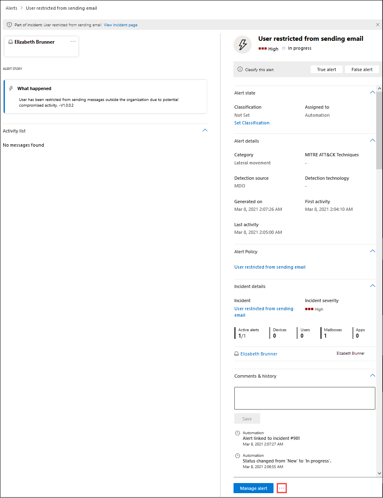

# Risolvere gli account utente compromessi con analisi e risposta automatizzate

**Si applica a**
- [Exchange Online Protection](exchange-online-protection-overview.md)
- [Microsoft Defender per Office 365 piano 1 e piano 2](defender-for-office-365.md)
- [Microsoft 365 Defender](../defender/microsoft-365-defender.md)

[Microsoft Defender per Office 365 Piano 2](defender-for-office-365.md#microsoft-defender-for-office-365-plan-1-and-plan-2) include potenti funzionalità air [(Automated Investigation and Response).](office-365-air.md) Tali funzionalità possono risparmiare tempo e fatica al team delle operazioni di sicurezza per affrontare le minacce. Microsoft continua a migliorare le funzionalità di sicurezza. Di recente, le funzionalità AIR sono state migliorate per includere un playbook di sicurezza degli utenti compromesso (attualmente in anteprima). Leggi questo articolo per altre informazioni sul playbook sulla sicurezza degli utenti compromesso. E vedi il post di blog Velocizzare il tempo per rilevare e rispondere alla compromissione degli utenti e limitare l'ambito di violazione con [Microsoft Defender per](https://techcommunity.microsoft.com/t5/Security-Privacy-and-Compliance/Speed-up-time-to-detect-and-respond-to-user-compromise-and-limit/ba-p/977053) Office 365 per ulteriori dettagli.

Il playbook sulla sicurezza degli utenti compromesso consente al team di sicurezza dell'organizzazione di:

- Velocizzare il rilevamento degli account utente compromessi;
- Limitare l'ambito di una violazione quando un account viene compromesso; e
- Rispondere agli utenti compromessi in modo più efficace ed efficiente.

## Avvisi utente compromessi

Quando un account utente viene compromesso, si verificano comportamenti atipici o anomali. Ad esempio, i messaggi di phishing e posta indesiderata potrebbero essere inviati internamente da un account utente attendibile. Defender for Office 365 può rilevare tali anomalie nei modelli di posta elettronica e nell'attività di collaborazione all'interno Office 365. In questo caso, vengono attivati gli avvisi e inizia il processo di mitigazione delle minacce.

Ad esempio, ecco un avviso che è stato attivato a causa di un invio di posta elettronica sospetto:

Ecco un esempio di avviso che è stato attivato quando è stato raggiunto un limite di invio per un utente:

## Analizzare e rispondere a un utente compromesso

Quando un account utente viene compromesso, vengono attivati gli avvisi. In alcuni casi, l'account utente viene bloccato e non può inviare ulteriori messaggi di posta elettronica fino a quando il problema non viene risolto dal team delle operazioni di sicurezza dell'organizzazione. In altri casi, viene avviata un'indagine automatizzata che può comportare azioni consigliate da parte del team di sicurezza.

- [Visualizzare e analizzare gli utenti con restrizioni](#view-and-investigate-restricted-users)

- [Visualizzare i dettagli sulle indagini automatizzate](#view-details-about-automated-investigations)

> [!IMPORTANT]
> Per eseguire le attività seguenti, è necessario disporre delle autorizzazioni appropriate. Vedere [Autorizzazioni necessarie per l'utilizzo delle funzionalità AIR.](office-365-air.md#required-permissions-to-use-air-capabilities)

### Visualizzare e analizzare gli utenti con restrizioni

Sono disponibili alcune opzioni per passare a un elenco di utenti con restrizioni. Ad esempio, nel portale Microsoft 365 Defender, è possibile passare a **Posta elettronica & collaborazione** \> **Rivedere** Utenti \> **con restrizioni**. Nella procedura seguente viene descritto lo spostamento tramite il **dashboard** Avvisi, che rappresenta un ottimo modo per visualizzare vari tipi di avvisi che potrebbero essere stati attivati.

1. Aprire il portale Microsoft 365 Defender ( <https://security.microsoft.com> ) e passare a Eventi **imprevisti &** \> **avvisi**. In caso contrario, per passare direttamente alla **pagina Avvisi,** utilizzare <https://security.microsoft.com/alerts> .

2. Nella pagina **Avvisi** filtrare i risultati in base al periodo di tempo e al criterio denominato Utente con restrizioni **per l'invio di posta elettronica.**

   

3. Se si seleziona la voce facendo  clic sul nome, verrà visualizzata una pagina Utente con restrizioni per l'invio di posta elettronica con ulteriori dettagli da esaminare. Accanto al  pulsante Gestisci avviso, è possibile fare clic su Altre opzioni Icona Altre opzioni e quindi selezionare Visualizza dettagli utente con restrizioni per passare alla pagina Utenti con restrizioni, in cui è possibile rilasciare l'utente   [restrizioni.](removing-user-from-restricted-users-portal-after-spam.md)  

   

### Visualizzare i dettagli sulle indagini automatizzate

Una volta avviata un'indagine automatizzata, è possibile visualizzarne i dettagli e i risultati nel Centro sicurezza & conformità. Passare a **Indagini sulla gestione delle** \> **minacce** e quindi selezionare un'indagine per visualizzarne i dettagli.

Per ulteriori informazioni, vedere [Visualizzare i dettagli di un'indagine.](air-view-investigation-results.md)

## Tenere presenti i punti seguenti

- **Tieniti al primo piano degli avvisi.** Come sai, più a lungo un compromesso non viene rilevato, maggiore è il potenziale di un impatto diffuso e dei costi per l'organizzazione, i clienti e i partner. Il rilevamento precoce e la risposta tempestiva sono fondamentali per ridurre le minacce e soprattutto quando l'account di un utente viene compromesso.

- **L'automazione assiste, ma non sostituisce, il team delle operazioni di sicurezza.** Le funzionalità di analisi e risposta automatizzate possono rilevare un utente compromesso nelle prime fasi, ma il team delle operazioni di sicurezza dovrà probabilmente impegnarsi ed eseguire alcune indagini e correzioni. Serve aiuto per questo? Vedi [Rivedere e approvare le azioni.](air-review-approve-pending-completed-actions.md)

- **Non fare affidamento su un avviso di accesso sospetto come unico indicatore.** Quando un account utente viene compromesso, potrebbe o meno attivare un avviso di accesso sospetto. A volte è la serie di attività che si verificano dopo la compromissione di un account che attiva un avviso. Per saperne di più sugli avvisi, vedere Vedere [Criteri di avviso](../../compliance/alert-policies.md).

## Passaggi successivi

- [Esaminare le autorizzazioni necessarie per l'utilizzo delle funzionalità AIR](office-365-air.md#required-permissions-to-use-air-capabilities)

- [Trovare e analizzare la posta elettronica dannosa in Office 365](investigate-malicious-email-that-was-delivered.md)

- [Informazioni su AIR in Microsoft Defender for Endpoint](/windows/security/threat-protection/microsoft-defender-atp/automated-investigations)

- [Visitare la Microsoft 365 roadmap per vedere cosa verrà presto e implementazione](https://www.microsoft.com/microsoft-365/roadmap?filters=)