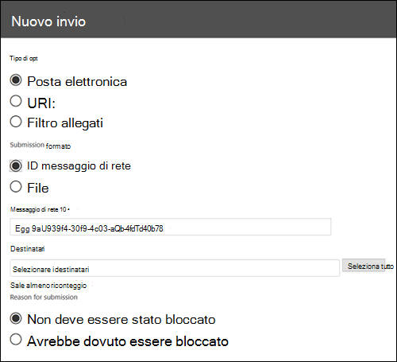
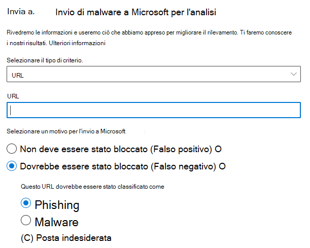
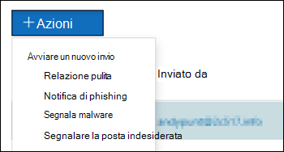

# Usare l'Invio dell'amministratore per inviare posta indesiderata sospetta, phishing, URL e file a MicrosoftUse Admin Submission to submit suspected spam, phish, URLs, and files to Microsoft

[!INCLUDE [Microsoft 365 Defender rebranding](../includes/microsoft-defender-for-office.md)]

**Si applica a****Applies to**
- [Exchange Online ProtectionExchange Online Protection](exchange-online-protection-overview.md)
- [Microsoft Defender per Office 365 piano 1 e piano 2Microsoft Defender for Office 365 plan 1 and plan 2](defender-for-office-365.md)

Nelle organizzazioni di Microsoft 365 con cassette postali in Exchange Online, gli amministratori possono utilizzare il portale invii nel Centro sicurezza & conformità per inviare messaggi di posta elettronica, URL e allegati a Microsoft per l'analisi.In Microsoft 365 organizations with mailboxes in Exchange Online, admins can use the Submissions portal in the Security & Compliance Center to submit email messages, URLs, and attachments to Microsoft for scanning.

Quando invii un messaggio di posta elettronica, ottieni:When you submit an email message, you will get:

1. **Controllo dell'autenticazione della** posta elettronica : Dettagli sul fatto che l'autenticazione della posta elettronica sia stata superata o meno al momento del recapito.**Email authentication check**: Details on whether email authentication passed or failed when it was delivered.
2. **Riscontri criteri:** informazioni su eventuali criteri che potrebbero aver consentito o bloccato la posta elettronica in arrivo nel tenant, ignorando i verdetti del filtro del servizio.**Policy hits**: Information about any policies that may have allowed or blocked the incoming email into your tenant, overriding our service filter verdicts.
3. **Reputazione/detonazione del payload**: esame di eventuali URL e allegati nel messaggio.**Payload reputation/detonation**: Examination of any URLs and attachments in the message.
4. **Analisi grader**: Revisione eseguita dai grader umani per verificare se i messaggi sono dannosi.**Grader analysis**: Review done by human graders in order to confirm whether or not messages are malicious.

> [!IMPORTANT]
> La reputazione/detonazione del payload e l'analisi del grado non vengono eseguite in tutti i tenant.Payload reputation/detonation and grader analysis are not done in all tenants. Le informazioni non possono uscire dall'organizzazione quando i dati non devono uscire dal limite del tenant per motivi di conformità.Information is blocked from going outside the organization when data is not supposed to leave the tenant boundary for compliance purposes.

Per altri modi per inviare messaggi di posta elettronica, URL e allegati a Microsoft, vedere [Segnalare messaggi e file a Microsoft](report-junk-email-messages-to-microsoft.md).For other ways to submit email messages, URLs, and attachments to Microsoft, see [Report messages and files to Microsoft](report-junk-email-messages-to-microsoft.md).

## Che cosa è necessario sapere prima di iniziareWhat do you need to know before you begin?

- Aprire il Centro sicurezza e conformità in<https://protection.office.com/>.You open the Security & Compliance Center at <https://protection.office.com/>. Per passare direttamente alla **pagina Invio,** usa <https://protection.office.com/reportsubmission> .To go directly to the **Submission** page, use <https://protection.office.com/reportsubmission>.

- Per inviare messaggi e file a Microsoft, è necessario essere membri di uno dei gruppi di ruoli seguenti:To submit messages and files to Microsoft, you need to be a member of one of the following role groups:

  - **Gestione dell'organizzazione** **o Lettore sicurezza** nel [Centro sicurezza & conformità](permissions-in-the-security-and-compliance-center.md).**Organization Management** or **Security Reader** in the [Security & Compliance Center](permissions-in-the-security-and-compliance-center.md).

  - **Gestione dell'organizzazione** in [Exchange Online](/Exchange/permissions-exo/permissions-exo#role-groups).**Organization Management** in [Exchange Online](/Exchange/permissions-exo/permissions-exo#role-groups).

    Si noti che l'appartenenza a questo gruppo di ruoli è necessaria per [visualizzare gli](#view-user-submissions-to-the-custom-mailbox) invii degli utenti alla cassetta postale personalizzata, come descritto più avanti in questo articolo.Note that membership in this role group is required to [View user submissions to the custom mailbox](#view-user-submissions-to-the-custom-mailbox) as described later in this article.

- Per ulteriori informazioni su come gli utenti possono inviare messaggi e file a Microsoft, vedere [Segnalare messaggi e file a Microsoft](report-junk-email-messages-to-microsoft.md).For more information about how users can submit messages and files to Microsoft, see [Report messages and files to Microsoft](report-junk-email-messages-to-microsoft.md).

## Segnalare contenuti sospetti a MicrosoftReport suspicious content to Microsoft

1. Nel Centro sicurezza & conformità passare  a Invii di gestione delle minacce, verificare di essere nella scheda \>  **Invii** dell'amministratore e quindi fare clic su **Nuovo invio.**In the Security & Compliance Center, go to **Threat management** \> **Submissions**, verify that you're on the **Admin submissions** tab, and then click **New submission**.

2. Usa **il riquadro a** comparsa Nuovo invio visualizzato per inviare il messaggio, l'URL o l'allegato come descritto nelle sezioni seguenti.Use **New submission** flyout that appears to submit the message, URL, or attachment as described in the following sections.

### Inviare un messaggio di posta elettronica discutibile a MicrosoftSubmit a questionable email to Microsoft

1. Nella sezione **Tipo oggetto** selezionare Posta **elettronica.**In the **Object type** section, select **Email**. Nella sezione **Formato invio** usa una delle opzioni seguenti:In the **Submission format** section, use one of the following options:

   - **ID** messaggio di rete: si tratta di un valore GUID disponibile nell'intestazione **X-MS-Exchange-Organization-Network-Message-Id** del messaggio o nell'intestazione **X-MS-Office365-Filtering-Correlation-Id** nei messaggi in quarantena.**Network Message ID**: This is a GUID value that's available in the **X-MS-Exchange-Organization-Network-Message-Id** header in the message, or in the **X-MS-Office365-Filtering-Correlation-Id** header in quarantined messages.

   - **File**: fare clic **su Scegli file.****File**: Click **Choose file**. Nella finestra di dialogo visualizzata individuare e selezionare il file con estensione eml o msg e quindi fare clic su **Apri**.In the dialog that opens, find and select the .eml or .msg file, and then click **Open**.

   > [!NOTE]
   > Gli amministratori con Defender per Office 365 Piano 1 o Piano 2 possono inviare messaggi vecchi fino a 30 giorni.Admins with Defender for Office 365 Plan 1 or Plan 2 are able to submit messages as old as 30 days. Altri amministratori potranno tornare indietro di 7 giorni.Other admins will only be able to go back 7 days.

2. Nella sezione **Destinatari** specificare uno o più destinatari per i quali si desidera eseguire un controllo dei criteri.In the **Recipients** section, specify one or more recipients that you would like to run a policy check against. Il controllo dei criteri determinerà se l'analisi dei messaggi di posta elettronica è stata ignorata a causa dei criteri dell'utente o dell'organizzazione.The policy check will determine if the email bypassed scanning due to user or organization policies.

3. Nella sezione **Motivo invio** selezionare una delle opzioni seguenti:In the **Reason for submission** section, select one of the following options:

   - **Non dovrebbe essere stato bloccato****Should not have been blocked**

   - **Dovrebbe essere stato bloccato:** Selezionare **Posta indesiderata,** **Phishing** o **Malware.****Should have been blocked**: Select **Spam**, **Phishing**, or **Malware**. Se non sei sicuro, usa il tuo miglior giudizio.If you're not sure, use your best judgment.

4. Al termine, fare clic sul **pulsante** Invia.When you're finished, click the **Submit** button.

   

### Inviare un URL sospetto a MicrosoftSend a suspect URL to Microsoft

1. Nella sezione **Tipo oggetto** selezionare **URL**.In the **Object type** section, select **URL**. Nella casella visualizzata immettere l'URL completo, ad esempio `https://www.fabrikam.com/marketing.html` .In the box that appears, enter the full URL (for example, `https://www.fabrikam.com/marketing.html`).

2. Nella sezione **Motivo invio** selezionare una delle opzioni seguenti:In the **Reason for submission** section, select one of the following options:

   - **Non dovrebbe essere stato bloccato****Should not have been blocked**

   - **Should have been blocked**: Select **Phishing** or **Malware**.**Should have been blocked**: Select **Phishing** or **Malware**.

3. Al termine, fare clic sul **pulsante** Invia.When you're finished, click the **Submit** button.

   

### Inviare un file sospetto a MicrosoftSubmit a suspected file to Microsoft

1. Nella sezione **Tipo oggetto** selezionare **Allegato.**In the **Object type** section, select **Attachment**.

2. Fare **clic su Scegli file**.Click **Choose File**. Nella finestra di dialogo visualizzata individuare e selezionare il file e quindi fare clic su **Apri.**In the dialog that opens, find and select the file, and then click **Open**.

3. Nella sezione **Motivo invio** selezionare una delle opzioni seguenti:In the **Reason for submission** section, select one of the following options:

   - **Non dovrebbe essere stato bloccato****Should not have been blocked**

   - **Dovrebbe essere stato bloccato:** **il malware** è l'unica scelta e viene selezionato automaticamente.**Should have been blocked**: **Malware** is the only choice, and is automatically selected..

4. Al termine, fare clic sul **pulsante** Invia.When you're finished, click the **Submit** button.

   

## Visualizzare gli elementi inviati per l'analisiView items Submitted for analysis

Nel Centro sicurezza & conformità passare **a** Invii di gestione delle minacce , verificare di essere \> nella scheda Inviato **per l'analisi**In the Security & Compliance Center, go to **Threat management** \> **Submissions**, verify that you're on the **Submitted for analysis** tab

Nella parte superiore della pagina è possibile immettere una data di inizio, una data di fine e, per impostazione predefinita, è possibile filtrare in base **all'ID** invio (un valore GUID assegnato a ogni invio) immettendo un valore nella casella e facendo clic sul pulsante  .Near the top of the page, you can enter a start date, an end date, and (by default) you can filter by **Submission ID** (a GUID value that's assigned to every submission) by entering a value in the box and clicking . È possibile immettere più valori separati da virgole.You can enter multiple values separated by commas.

Per modificare i criteri di filtro, fare clic sul pulsante **ID invio** e scegliere uno dei valori seguenti:To change the filter criteria, click the **Submission ID** button and choose one of the following values:

- **Mittente****Sender**
- **Subject/URL/File name****Subject/URL/File name**
- **Inviato da****Submitted by**
- **Tipo di invio****Submission type**
- **Stato****Status**

Per esportare i risultati, fare clic **su Esporta** nella parte superiore della pagina e selezionare **Dati grafico** o **Tabella.**To export the results, click **Export** near the top of the page and select **Chart data** or **Table**. Nella finestra di dialogo visualizzata salvare il file CSV.In the dialog that appears, save the .csv file.

Sotto il grafico sono disponibili tre schede: **Posta elettronica** (impostazione predefinita), **URL** e **Allegato.**Below the graph, there are three tabs: **Email** (default), **URL**, and **Attachment**.

### Visualizzare gli invii di posta elettronica dell'amministratoreView admin email submissions

Fare clic sulla **scheda Posta** elettronica.Click the **Email** tab.

È possibile fare clic **sul pulsante Opzioni** colonna nella parte inferiore della pagina per aggiungere o rimuovere colonne dalla visualizzazione:You can click the **Column options** button near the bottom of the page to add or remove columns from the view:

- **Data****Date**
- **ID invio:** valore GUID assegnato a ogni invio.**Submission ID**: A GUID value that's assigned to every submission.
- **Inviato da**\***Submitted by**\*
- **Oggetto**\***Subject**\*
- **Mittente****Sender**
- **Indirizzo IP mittente**\***Sender IP**\*
- **Tipo di invio****Submission type**
- **Motivo recapito****Delivery reason**
- **Stato**\***Status**\*

  \* Se si fa clic su questo valore, le informazioni dettagliate vengono visualizzate in un riquadro a comparsa.\* If you click this value, detailed information is displayed in a flyout.

#### Dettagli dell'analisi dell'invio dell'amministratoreAdmin submission rescan details

I messaggi inviati negli invii di amministratori vengono sottoposti a nuova analisi e i risultati vengono visualizzati nel riquadro a comparsa dei dettagli:Messages that are submitted in admin submissions are rescanned and results shown in the details flyout:

- Se si è verificato un errore nell'autenticazione della posta elettronica del mittente al momento del recapito.If there was a failure in the sender's email authentication at the time of delivery.
- Informazioni su eventuali riscontri dei criteri che potrebbero aver influenzato o sostituito il verdetto di un messaggio.Information about any policy hits that could have affected or overridden the verdict of a message.
- Risultati della detonazione correnti per verificare se gli URL o i file contenuti nel messaggio erano dannosi o meno.Current detonation results to see if the URLs or files contained in the message were malicious or not.
- Feedback dei gradi.Feedback from graders.

Se è stata trovata una sostituzione, la nuova analisi dovrebbe essere completata dopo alcuni minuti.If an override was found, the rescan should complete in several minutes. Se non si è verificato un problema nell'autenticazione della posta elettronica o il recapito non è stato influenzato da una sostituzione, il feedback dei voti potrebbe richiedere fino a un giorno.If there wasn't a problem in email authentication or delivery wasn't affected by an override, then the feedback from graders could take up to a day.

### Visualizzare gli invii di URL di amministratoreView admin URL submissions

Fare clic **sulla scheda URL.**Click the **URL** tab.

È possibile fare clic **sul pulsante Opzioni** colonna nella parte inferiore della pagina per aggiungere o rimuovere colonne dalla visualizzazione:You can click the **Column options** button near the bottom of the page to add or remove columns from the view:

- **Data****Date**
- **ID invio****Submission ID**
- **Inviato da**\***Submitted by**\*
- **URL**\***URL**\*
- **Tipo di invio****Submission type**
- **Stato**\***Status**\*

  \* Se si fa clic su questo valore, le informazioni dettagliate vengono visualizzate in un riquadro a comparsa.\* If you click this value, detailed information is displayed in a flyout.

### Visualizzare gli invii di allegati dell'amministratoreView admin attachment submissions

Fare clic **sulla scheda** Allegati.Click the **Attachments** tab.

È possibile fare clic **sul pulsante Opzioni** colonna nella parte inferiore della pagina per aggiungere o rimuovere colonne dalla visualizzazione:You can click the **Column options** button near the bottom of the page to add or remove columns from the view:

- **Data****Date**
- **ID invio****Submission ID**
- **Inviato da**\***Submitted by**\*
- **Nome file**\***File name**\*
- **Tipo di invio****Submission type**
- **Stato**\***Status**\*

  \* Se si fa clic su questo valore, le informazioni dettagliate vengono visualizzate in un riquadro a comparsa.\* If you click this value, detailed information is displayed in a flyout.

## Visualizzare gli invii degli utenti a MicrosoftView user submissions to Microsoft

Se è stato distribuito il componente aggiuntivo Segnala [messaggio,](enable-the-report-message-add-in.md)il componente aggiuntivo Segnala [phishing](enable-the-report-phish-add-in.md)o gli utenti utilizzano la creazione di  report predefinita in [Outlook sul Web,](report-junk-email-and-phishing-scams-in-outlook-on-the-web-eop.md)è possibile visualizzare le segnalazioni degli utenti nella scheda Invii utente.If you've deployed the [Report Message add-in](enable-the-report-message-add-in.md), the [Report Phishing add-in](enable-the-report-phish-add-in.md), or people use the [built-in reporting in Outlook on the web](report-junk-email-and-phishing-scams-in-outlook-on-the-web-eop.md), you can see what users are reporting on the **User submissions** tab.

1. Nel Centro sicurezza & conformità passare a **Gestione minacce** \> **Invii**.In the Security & Compliance Center, go to **Threat management** \> **Submissions**.

2. Seleziona la **scheda Invii utente** e quindi fai clic su **Nuovo invio.**Select the **User submissions** tab, and then click **New submission**.

È possibile fare clic **sul pulsante Opzioni** colonna nella parte inferiore della pagina per aggiungere o rimuovere colonne dalla visualizzazione:You can click the **Column options** button near the bottom of the page to add or remove columns from the view:

- **Inviato il****Submitted on**
- **Inviato da**\***Submitted by**\*
- **Oggetto**\***Subject**\*
- **Mittente****Sender**
- **Indirizzo IP mittente**\***Sender IP**\*
- **Tipo di invio****Submission type**

\* Se si fa clic su questo valore, le informazioni dettagliate vengono visualizzate in un riquadro a comparsa.\* If you click this value, detailed information is displayed in a flyout.

Nella parte superiore della pagina è possibile immettere una data di inizio, una  data di fine e, per impostazione predefinita, è possibile filtrare in base al mittente immettendo un valore nella casella e facendo clic sul  .Near the top of the page, you can enter a start date, an end date, and (by default) you can filter by **Sender** by entering a value in the box and clicking . È possibile immettere più valori separati da virgole.You can enter multiple values separated by commas.

Per modificare i criteri di filtro, fare clic **sul pulsante Mittente** e scegliere uno dei valori seguenti:To change the filter criteria, click the **Sender** button and choose one of the following values:

- **Dominio del mittente****Sender domain**
- **Oggetto****Subject**
- **Inviato da****Submitted by**
- **Tipo di invio****Submission type**
- **Indirizzo IP mittente****Sender IP**

Per esportare i risultati, fare clic **su Esporta** nella parte superiore della pagina e selezionare **Dati grafico** o **Tabella.**To export the results, click **Export** near the top of the page and select **Chart data** or **Table**. Nella finestra di dialogo visualizzata salvare il file CSV.In the dialog that appears, save the .csv file.

## Visualizzare gli invii utente alla cassetta postale personalizzataView user submissions to the custom mailbox

**Se** è stata [configurata una cassetta](user-submission.md) postale personalizzata per ricevere i messaggi segnalati dall'utente, è possibile visualizzare e inviare i messaggi recapitati alla cassetta postale di segnalazione.**If** you've [configured a custom mailbox](user-submission.md) to receive user reported messages, you can view and also submit messages that were delivered to the reporting mailbox.

1. Nel Centro sicurezza & conformità passare a **Gestione minacce** \> **Invii**.In the Security & Compliance Center, go to **Threat management** \> **Submissions**.

2. Selezionare la **scheda Cassetta postale** personalizzata.Select the **Custom mailbox** tab.

È possibile fare clic **sul pulsante Opzioni** colonna nella parte inferiore della pagina per aggiungere o rimuovere colonne dalla visualizzazione:You can click the **Column options** button near the bottom of the page to add or remove columns from the view:

- **Inviato il****Submitted on**
- **Inviato da**\***Submitted by**\*
- **Oggetto**\***Subject**\*
- **Mittente****Sender**
- **Indirizzo IP mittente**\***Sender IP**\*
- **Tipo di invio****Submission type**

Nella parte superiore della pagina è possibile immettere una data di inizio, una data di fine e filtrare in base a **Inviato** immettendo un valore nella casella e facendo clic sul  .Near the top of the page, you can enter a start date, an end date, and you can filter by **Submitted by** by entering a value in the box and clicking . È possibile immettere più valori separati da virgole.You can enter multiple values separated by commas.

Per esportare i risultati, fare clic **su Esporta** nella parte superiore della pagina e selezionare **Dati grafico** o **Tabella.**To export the results, click **Export** near the top of the page and select **Chart data** or **Table**. Nella finestra di dialogo visualizzata salvare il file CSV.In the dialog that appears, save the .csv file.

> [!NOTE]
> Se le organizzazioni sono configurate per l'invio solo alla cassetta postale personalizzata, i messaggi segnalati non verranno inviati per la nuova analisi e i risultati nel portale Messaggi segnalati dall'utente saranno sempre vuoti.If organizations are configured to send to custom mailbox only, reported messages will not be sent for rescan and results in the User reported messages portal will always be empty.

## Annullare gli invii utenteUndo user submissions

Una volta che un utente invia un messaggio di posta elettronica sospetto alla cassetta postale personalizzata, l'utente e l'amministratore non hanno la possibilità di annullare l'invio.Once a user submits a suspicious email to the custom mailbox, the user and admin don't have an option to undo the submission. Se l'utente desidera recuperare la posta elettronica, sarà disponibile per il ripristino nelle cartelle Posta eliminata o Posta indesiderata.If the user would like to recover the email, it will be available for recovery in the Deleted Items or Junk Email folders.

### Inviare messaggi a Microsoft dalla cassetta postale personalizzataSubmit messages to Microsoft from the custom mailbox

Se la cassetta postale personalizzata è stata configurata per intercettare i messaggi segnalati dall'utente senza inviare i messaggi a Microsoft, è possibile trovare e inviare messaggi specifici a Microsoft per l'analisi.If you've configured the custom mailbox to intercept user-reported messages without sending the messages to Microsoft, you can find and send specific messages to Microsoft for analysis. Questo sposta in modo efficace un invio utente a un invio da amministratore.This effectively moves a user submission to an admin submission.

Nella scheda **Cassetta postale** personalizzata selezionare un messaggio nell'elenco, fare clic sul pulsante **Azione** ed effettuare una delle seguenti selezioni:On the **Custom mailbox** tab, select a message in the list, click the **Action** button, and make one of the following selections:

- **Segnala pulito****Report clean**
- **Segnalare phishing****Report phishing**
- **Segnalare malware****Report malware**
- **Segnalare posta indesiderata****Report spam**

