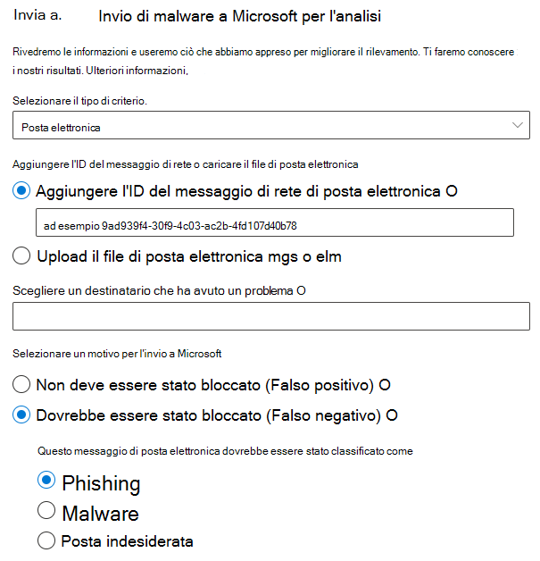
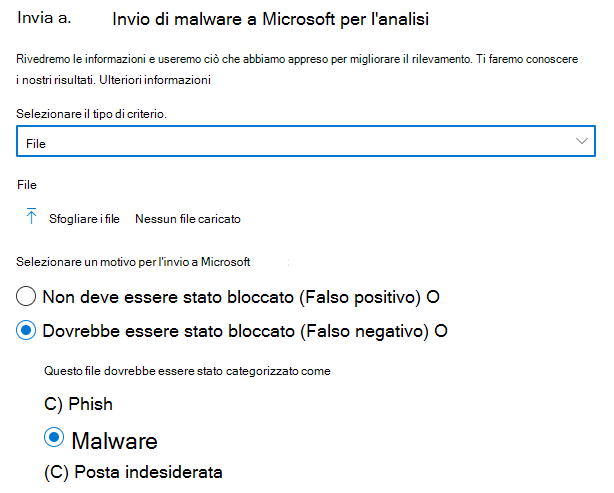
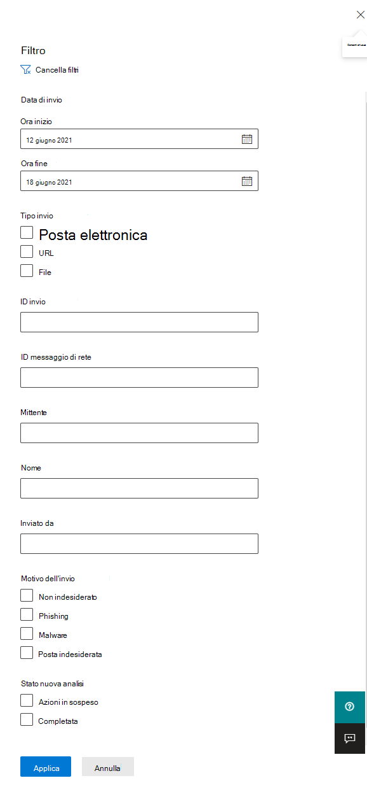
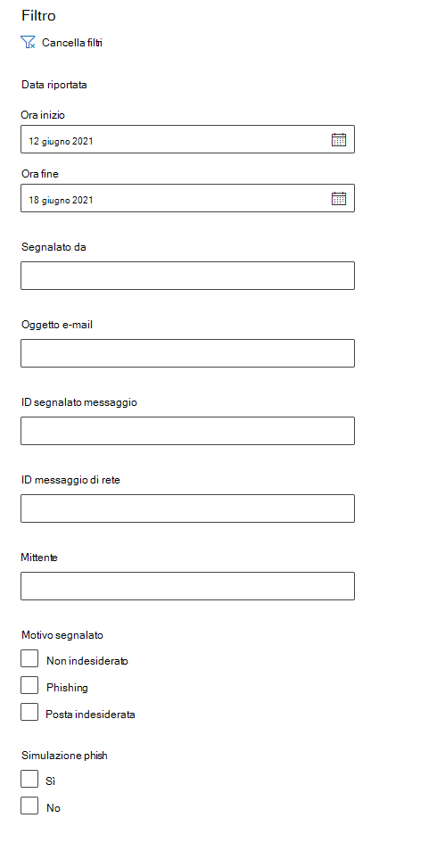
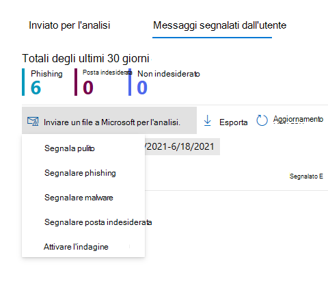

# Usare l'Invio dell'amministratore per inviare posta indesiderata sospetta, phishing, URL e file a MicrosoftUse Admin Submission to submit suspected spam, phish, URLs, and files to Microsoft

[!INCLUDE [Microsoft 365 Defender rebranding](../includes/microsoft-defender-for-office.md)]

**Si applica a****Applies to**
- [Exchange Online ProtectionExchange Online Protection](exchange-online-protection-overview.md)
- [Microsoft Defender per Office 365 piano 1 e piano 2Microsoft Defender for Office 365 plan 1 and plan 2](defender-for-office-365.md)

Nelle Microsoft 365 con cassette postali di Exchange Online, gli amministratori possono utilizzare il portale invii nel portale di Microsoft 365 Defender per inviare messaggi di posta elettronica, URL e allegati a Microsoft per l'analisi.In Microsoft 365 organizations with Exchange Online mailboxes, admins can use the Submissions portal in the Microsoft 365 Defender portal to submit email messages, URLs, and attachments to Microsoft for scanning.

Quando invii un messaggio di posta elettronica, ottieni:When you submit an email message, you will get:

- **Controllo dell'autenticazione della** posta elettronica : Dettagli sul fatto che l'autenticazione della posta elettronica sia stata superata o meno al momento del recapito.**Email authentication check**: Details on whether email authentication passed or failed when it was delivered.
- **Riscontri criteri:** informazioni su eventuali criteri che potrebbero aver consentito o bloccato la posta elettronica in arrivo nel tenant, ignorando i verdetti del filtro del servizio.**Policy hits**: Information about any policies that may have allowed or blocked the incoming email into your tenant, overriding our service filter verdicts.
- **Reputazione/detonazione del payload**: esame di eventuali URL e allegati nel messaggio.**Payload reputation/detonation**: Examination of any URLs and attachments in the message.
- **Analisi grader**: Revisione eseguita dai grader umani per verificare se i messaggi sono dannosi.**Grader analysis**: Review done by human graders in order to confirm whether or not messages are malicious.

> [!IMPORTANT]
> La reputazione/detonazione del payload e l'analisi del grado non vengono eseguite in tutti i tenant.Payload reputation/detonation and grader analysis are not done in all tenants. Le informazioni non possono uscire dall'organizzazione quando i dati non devono uscire dal limite del tenant per motivi di conformità.Information is blocked from going outside the organization when data is not supposed to leave the tenant boundary for compliance purposes.

Per altri modi per inviare messaggi di posta elettronica, URL e allegati a Microsoft, vedere [Segnalare messaggi e file a Microsoft](report-junk-email-messages-to-microsoft.md).For other ways to submit email messages, URLs, and attachments to Microsoft, see [Report messages and files to Microsoft](report-junk-email-messages-to-microsoft.md).

## Che cosa è necessario sapere prima di iniziare?What do you need to know before you begin?

- Per aprire il portale di Microsoft 365 Defender, andare alla pagina <https://security.microsoft.com/>.You open the Microsoft 365 Defender portal at <https://security.microsoft.com/>. Per passare direttamente alla **pagina Invii,** usa <https://security.microsoft.com/reportsubmission> .To go directly to the **Submissions** page, use <https://security.microsoft.com/reportsubmission>.

- Per inviare messaggi e file a Microsoft, è necessario essere membri di uno dei gruppi di ruoli seguenti:To submit messages and files to Microsoft, you need to be a member of one of the following role groups:
  - **Gestione dell'organizzazione** **o Lettore sicurezza** [nel portale Microsoft 365 Defender sicurezza](permissions-microsoft-365-security-center.md).**Organization Management** or **Security Reader** in the [Microsoft 365 Defender portal](permissions-microsoft-365-security-center.md).
  
    Si noti che l'appartenenza a questo gruppo di ruoli è necessaria per [visualizzare gli](#view-user-submissions-to-microsoft) invii degli utenti alla cassetta postale personalizzata, come descritto più avanti in questo articolo.Note that membership in this role group is required to [View user submissions to the custom mailbox](#view-user-submissions-to-microsoft) as described later in this article.

- Per ulteriori informazioni su come gli utenti possono inviare messaggi e file a Microsoft, vedere [Segnalare messaggi e file a Microsoft](report-junk-email-messages-to-microsoft.md).For more information about how users can submit messages and files to Microsoft, see [Report messages and files to Microsoft](report-junk-email-messages-to-microsoft.md).

## Segnalare contenuti sospetti a MicrosoftReport suspicious content to Microsoft

1. Nel portale Microsoft 365 Defender, passare a Invia tramite **posta elettronica & collaborazione** \> **Invii.**In the Microsoft 365 Defender portal, go to **Email & collaboration** \> **Submissions**.

2. Nella pagina **Invii** verificare  che la scheda Inviato per l'analisi sia selezionata e quindi fare clic su Icona Annuncio  **l'analisi.**On the **Submissions** page, verify that the **Submitted for analysis** tab is selected, and then click  **Submit to Microsoft for analysis**.

3. Usa il **riquadro a comparsa Invia** a Microsoft per la revisione che viene visualizzato per inviare il messaggio, l'URL o l'allegato di posta elettronica, come descritto nelle sezioni seguenti.Use the **Submit to Microsoft for review** flyout that appears to submit the message, URL, or email attachment as described in the following sections.

   > [!NOTE]
   > Gli invii di file e URL non sono disponibili nei cloud che non consentono ai dati di uscire dall'ambiente.File and URL submissions are not available in the clouds that do not allow for data to leave the environment. La possibilità di selezionare File o URL verrà disattivata.The ability to select File or URL will be greyed out.

### Inviare un messaggio di posta elettronica discutibile a MicrosoftSubmit a questionable email to Microsoft

1. Nella casella **Seleziona il tipo di invio,** verificare che l'opzione **Posta** elettronica sia selezionata nell'elenco a discesa.In the **Select the submission type** box, verify that **Email** is selected in the drop down list.

2. Nella sezione **Aggiungere l'ID del messaggio di rete o caricare il file di posta** elettronica, utilizzare una delle opzioni seguenti:In the **Add the network message ID or upload the email file** section, use one of the following options:
   - **Aggiungere l'ID** del messaggio di rete di posta elettronica : si tratta di un valore GUID disponibile nell'intestazione **X-MS-Exchange-Organization-Network-Message-Id** nel messaggio o nell'intestazione **X-MS-Office365-Filtering-Correlation-Id** nei messaggi in quarantena.**Add the email network message ID**: This is a GUID value that's available in the **X-MS-Exchange-Organization-Network-Message-Id** header in the message or in the **X-MS-Office365-Filtering-Correlation-Id** header in quarantined messages.
   - **Upload il file di posta elettronica (con estensione msg o eml):** fare clic **su Sfoglia file**.**Upload the email file (.msg or .eml)**: Click **Browse files**. Nella finestra di dialogo visualizzata individuare e selezionare il file con estensione eml o msg e quindi fare clic su **Apri**.In the dialog that opens, find and select the .eml or .msg file, and then click **Open**.

   > [!NOTE]
   > La possibilità di inviare messaggi vecchi di 30 giorni è stata temporaneamente sospesa per Defender per Office 365 clienti.The ability to submit messages as old as 30 days has been temporarily suspended for Defender for Office 365 customers. Gli amministratori potranno tornare indietro di 7 giorni.Admins will only be able to go back 7 days.

3. Nella casella **Scegliere un destinatario che ha avuto un** problema specificare il destinatario per cui si desidera eseguire un controllo dei criteri.In the **Choose a recipient who had an issue** box, specify the recipient that you would like to run a policy check against. Il controllo dei criteri determinerà se l'analisi dei messaggi di posta elettronica è stata ignorata a causa dei criteri dell'utente o dell'organizzazione.The policy check will determine if the email bypassed scanning due to user or organization policies.

4. Nella sezione **Selezionare un motivo per l'invio a Microsoft** selezionare una delle opzioni seguenti:In the **Select a reason for submitting to Microsoft** section, select one of the following options:
   - **Non dovrebbe essere stato bloccato (falso positivo)****Should not have been blocked (false positive)**
   - **Dovrebbe essere stato** bloccato: nella sezione Il messaggio di posta elettronica dovrebbe essere stato categorizzato come visualizzato, selezionare uno dei valori seguenti (se non si è sicuri, utilizzare la valutazione migliore): **Should have been blocked**: In the **The email should have been categorized as** section that appears, select one of the following values (if you're not sure, use your best judgement):
     - **Phishing****Phish**
     - **Posta indesiderata****Spam**
     - **Malware****Malware**

5. Al termine, fare clic sul **pulsante** Invia.When you're finished, click the **Submit** button.

> [!div class="mx-imgBorder"]
> 

### Inviare un URL sospetto a MicrosoftSend a suspect URL to Microsoft

1. Nella casella **Seleziona il tipo di invio** seleziona **URL** nell'elenco a discesa.In the **Select the submission type** box, select **URL** from the drop down list.

2. Nella casella **URL** visualizzata immettere l'URL completo, ad esempio `https://www.fabrikam.com/marketing.html` .In the **URL** box that appears, enter the full URL (for example, `https://www.fabrikam.com/marketing.html`).

3. Nella sezione **Selezionare un motivo per l'invio a Microsoft** selezionare una delle opzioni seguenti:In the **Select a reason for submitting to Microsoft** section, select one of the following options:
   - **Non dovrebbe essere stato bloccato (falso positivo)****Should not have been blocked (false positive)**
   - **Dovrebbe essere stato bloccato:** nella sezione **Questo URL** dovrebbe essere stato classificato come visualizzato, selezionare **Phish** o **Malware.****Should have been blocked**: In the **This URL should have been categorized as** section that appears, select **Phish** or **Malware**.

4. Al termine, fare clic sul **pulsante** Invia.When you're finished, click the **Submit** button.

> [!div class="mx-imgBorder"]
> 

### Inviare un allegato di posta elettronica sospetto a MicrosoftSubmit a suspected email attachment to Microsoft

1. Nella casella **Seleziona il tipo di invio** seleziona **File** nell'elenco a discesa.In the **Select the submission type** box, select **File** from the drop down list.

2. Nella sezione **File** visualizzata fare clic su **Sfoglia file.**In the **File** section that appears, click **Browse files**. Nella finestra di dialogo visualizzata individuare e selezionare il file e quindi fare clic su **Apri.**In the dialog that opens, find and select the file, and then click **Open**.

3. Nella sezione **Selezionare un motivo per l'invio a Microsoft** selezionare una delle opzioni seguenti:In the **Select a reason for submitting to Microsoft** section, select one of the following options:
   - **Non dovrebbe essere stato bloccato (falso positivo)****Should not have been blocked (false positive)**
   - **Dovrebbe essere stato bloccato:** nella sezione Questo **URL** dovrebbe essere stato classificato come visualizzato, **Malware** è l'unica scelta e viene selezionato automaticamente.**Should have been blocked**: In the **This URL should have been categorized as** section that appears, **Malware** is the only choice, and is automatically selected.

4. Al termine, fare clic sul **pulsante** Invia.When you're finished, click the **Submit** button.

> [!div class="mx-imgBorder"]
> 

## Visualizzare gli invii di amministratori a MicrosoftView admin submissions to Microsoft

1. Nel portale Microsoft 365 Defender, passare a Invia tramite **posta elettronica & collaborazione** \> **Invii.**In the Microsoft 365 Defender portal, go to **Email & collaboration** \> **Submissions**.

2. Nella pagina **Invii** verificare che la scheda **Inviato per l'analisi** sia selezionata.On the **Submissions** page, verify that the **Submitted for analysis** tab is selected.

   - È possibile ordinare le voci facendo clic su un'intestazione di colonna disponibile.You can sort the entries by clicking on an available column header. Fare **clic su Personalizza** colonne per visualizzare un massimo di sette colonne.Click **Customize columns** to show a maximum of seven columns. I valori predefiniti sono contrassegnati da un asterisco (\*):The default values are marked with an asterisk (\*):
     - **Nome invio**\***Submission name**\*
     - **Mittente**\***Sender**\*
     - **Data di invio**\***Date submitted**\*
     - **Tipo di invio**\***Submission type**\*
     - **Motivo dell'invio**\***Reason for submitting**\*
     - **Stato nuova analisi**\***Rescan status**\*
     - **Risultato dell'analisi**\***Rescan result**\*
     - **Verdetto filtro****Filter verdict**
     - **Motivo recapito/blocco****Delivery/Block reason**
     - **ID invio****Submission ID**
     - **ID messaggio di rete/ID oggetto****Network Message ID/Object ID**
     - **Direzione****Direction**
     - **Indirizzo IP mittente****Sender IP**
     - **Livello di conformità in blocco (BCL)****Bulk compliant level (BCL)**
     - **Destinazione****Destination**
     - **Azione dei criteri****Policy action**
     - **Inviato da****Submitted by**

     Al termine, fare clic su **Applica.**When you're finished, click **Apply**.

   - Per filtrare le voci, fare clic su **Filtro.**To filter the entries, click **Filter**. I filtri disponibili sono:The available filters are:
     - **Date submitted**: **Start date e** End **date**.**Date submitted**: **Start date** and **End date**.
     - **Tipo di invio:** **Posta** elettronica, **URL** o **File.****Submission type**: **Email**, **URL**, or **File**.
     - **ID invio:** valore GUID assegnato a ogni invio.**Submission ID**: A GUID value that's assigned to every submission.
     - **ID messaggio di rete****Network Message ID**
     - **Mittente****Sender**

     Al termine, fare clic su **Applica.**When you're finished, click **Apply**.

     > [!div class="mx-imgBorder"]
     > 

   - Per raggruppare le voci, fare clic **su Gruppo** e selezionare uno dei valori seguenti nell'elenco a discesa:To group the entries, click **Group** and select one of the following values from the drop down list:
     - **Nessuna****None**
     - **Type****Type**
     - **Motivo****Reason**
     - **Stato****Status**
     - **Risultato dell'analisi****Rescan result**

   - Per esportare le voci, fare clic su **Esporta.**To export the entries, click **Export**. Nella finestra di dialogo visualizzata, salvare il file .csv file.In the dialog that appears, save the .csv file.

### Dettagli dell'analisi dell'invio dell'amministratoreAdmin submission rescan details

I messaggi inviati negli invii di amministratori vengono esaminati e i risultati vengono visualizzati nel riquadro a comparsa dettagli invii:Messages that are submitted in admin submissions are reviewed and results shown in the submissions detail flyout:

- Se si è verificato un errore nell'autenticazione della posta elettronica del mittente al momento del recapito.If there was a failure in the sender's email authentication at the time of delivery.
- Informazioni su eventuali riscontri dei criteri che potrebbero aver influenzato o sostituito il verdetto di un messaggio.Information about any policy hits that could have affected or overridden the verdict of a message.
- Risultati della detonazione correnti per verificare se gli URL o i file contenuti nel messaggio erano dannosi o meno.Current detonation results to see if the URLs or files contained in the message were malicious or not.
- Feedback dei gradi.Feedback from graders.

Se è stata trovata una sostituzione, la nuova analisi dovrebbe essere completata dopo alcuni minuti.If an override was found, the rescan should complete in several minutes. Se non si è verificato un problema nell'autenticazione della posta elettronica o il recapito non è stato influenzato da una sostituzione, il feedback dei voti potrebbe richiedere fino a un giorno.If there wasn't a problem in email authentication or delivery wasn't affected by an override, then the feedback from graders could take up to a day.

## Visualizzare gli invii degli utenti a MicrosoftView user submissions to Microsoft

Se è stato distribuito il componente aggiuntivo Segnala [messaggio,](enable-the-report-message-add-in.md)il componente aggiuntivo Segnala [phishing](enable-the-report-phish-add-in.md)o gli utenti utilizzano la segnalazione predefinita [in Outlook sul web](report-junk-email-and-phishing-scams-in-outlook-on-the-web-eop.md), è possibile visualizzare i report degli utenti nella scheda **Messaggio** segnalato dall'utente.If you've deployed the [Report Message add-in](enable-the-report-message-add-in.md), the [Report Phishing add-in](enable-the-report-phish-add-in.md), or people use the [built-in reporting in Outlook on the web](report-junk-email-and-phishing-scams-in-outlook-on-the-web-eop.md), you can see what users are reporting on the **User reported message** tab.

1. Nel portale Microsoft 365 Defender, passare a Invia tramite **posta elettronica & collaborazione** \> **Invii.**In the Microsoft 365 Defender portal, go to **Email & collaboration** \> **Submissions**.

2. Nella pagina **Invii** seleziona la **scheda Messaggi segnalati dall'utente.**On the **Submissions** page, select the **User reported messages** tab.

   - È possibile ordinare le voci facendo clic su un'intestazione di colonna disponibile.You can sort the entries by clicking on an available column header. Fare **clic su Personalizza** colonne per visualizzare un massimo di sette colonne.Click **Customize columns** to show a maximum of seven columns. I valori predefiniti sono contrassegnati da un asterisco (\*):The default values are marked with an asterisk (\*):

     - **Oggetto del messaggio di posta elettronica**\***Email subject**\*
     - **Segnalato da**\***Reported by**\*
     - **Data riportata**\***Date reported**\*
     - **Mittente**\***Sender**\*
     - **Motivo segnalato**\***Reported reason**\*
     - **Risultato dell'analisi**\***Rescan result**\*
     - **ID segnalato messaggio****Message reported ID**
     - **ID messaggio di rete****Network Message ID**
     - **Indirizzo IP mittente****Sender IP**
     - **Simulazione phish****Phish simulation**

     Al termine, fare clic su **Applica.**When you're finished, click **Apply**.

   - Per filtrare le voci, fare clic su **Filtro.**To filter the entries, click **Filter**. I filtri disponibili sono:The available filters are:
     - **Data riportata**: **Data inizio** e **Data fine**.**Date reported**: **Start date** and **End date**.
     - **Segnalato da****Reported by**
     - **Oggetto e-mail****Email subject**
     - **ID segnalato messaggio****Message reported ID**
     - **ID messaggio di rete****Network Message ID**
     - **Mittente****Sender**
     - **Motivo segnalato**: **Non posta indesiderata,** **Phish** o **Posta indesiderata.****Reported reason**: **Not junk**, **Phish**, or **Spam**.
     - **Simulazione phish**: **Sì** o **No****Phish simulation**: **Yes** or **No**

     Al termine, fare clic su **Applica.**When you're finished, click **Apply**.

     > [!div class="mx-imgBorder"]
     > 

   - Per raggruppare le voci, fare clic **su Gruppo** e selezionare uno dei valori seguenti nell'elenco a discesa:To group the entries, click **Group** and select one of the following values from the drop down list:
     - **Nessuna****None**
     - **Motivo****Reason**
     - **Mittente****Sender**
     - **Segnalato da****Reported by**
     - **Risultato dell'analisi****Rescan result**
     - **Simulazione phish****Phish simulation**

   - Per esportare le voci, fare clic su **Esporta.**To export the entries, click **Export**. Nella finestra di dialogo visualizzata, salvare il file .csv file.In the dialog that appears, save the .csv file.

> [!NOTE]
> Se le organizzazioni sono configurate per inviare messaggi segnalati dall'utente solo alla cassetta postale personalizzata, i messaggi segnalati non verranno inviati per la nuova analisi e i risultati in **Messaggi** segnalati dall'utente saranno sempre vuoti.If organizations are configured to send user reported messages to the custom mailbox only, reported messages will not be sent for rescan and the results in **User reported messages** will always be empty.

### Annullare gli invii utenteUndo user submissions

Una volta che un utente invia un messaggio di posta elettronica sospetto alla cassetta postale personalizzata, l'utente e l'amministratore non hanno la possibilità di annullare l'invio.Once a user submits a suspicious email to the custom mailbox, the user and admin don't have an option to undo the submission. Se l'utente desidera recuperare la posta elettronica, sarà disponibile per il ripristino nelle cartelle Posta eliminata o Posta indesiderata.If the user would like to recover the email, it will be available for recovery in the Deleted Items or Junk Email folders.

### Inviare messaggi a Microsoft dalla cassetta postale personalizzataSubmit messages to Microsoft from the custom mailbox

Se la cassetta postale personalizzata è stata configurata per intercettare i messaggi segnalati dall'utente senza inviare i messaggi a Microsoft, è possibile trovare e inviare messaggi specifici a Microsoft per l'analisi.If you've configured the custom mailbox to intercept user-reported messages without sending the messages to Microsoft, you can find and send specific messages to Microsoft for analysis. Questo sposta in modo efficace un invio utente a un invio da amministratore.This effectively moves a user submission to an admin submission.

Nella scheda **Messaggi segnalati dall'utente** selezionare un messaggio nell'elenco, fare clic su Invia a **Microsoft** per l'analisi e quindi selezionare uno dei valori seguenti nell'elenco a discesa:On the **User reported messages** tab, select a message in the list, click **Submit to Microsoft for analysis**, and then select one of the following values from the drop down list:

- **Segnala pulito****Report clean**
- **Segnalare phishing****Report phishing**
- **Segnalare malware****Report malware**
- **Segnalare posta indesiderata****Report spam**
- **Attivare l'indagine****Trigger investigation**

> [!div class="mx-imgBorder"]
> 
