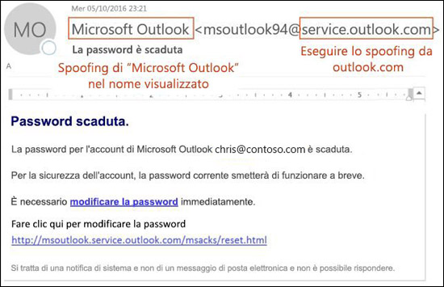
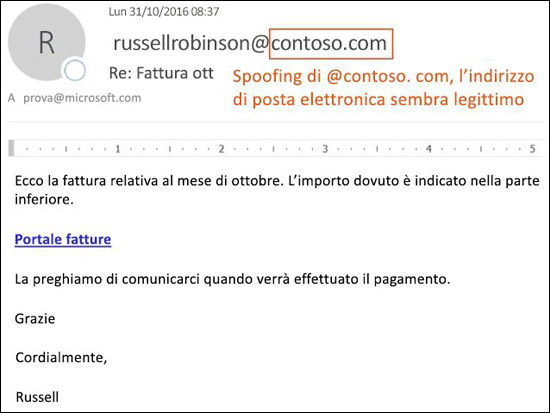
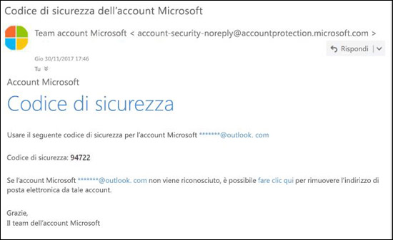

# Protezione anti-spoofing in EOPAnti-spoofing protection in EOP

[!INCLUDE [Microsoft 365 Defender rebranding](../includes/microsoft-defender-for-office.md)]

Nelle organizzazioni di Microsoft 365 con cassette postali in Exchange Online o nelle organizzazioni di Exchange Online Protection (EOP) autonomo senza cassette postali di Exchange Online, EOP include funzionalità per la protezione dell'organizzazione dai mittenti di spoofing (falsificati).In Microsoft 365 organizations with mailboxes in Exchange Online or standalone Exchange Online Protection (EOP) organizations without Exchange Online mailboxes, EOP includes features to help protect your organization from spoofed (forged) senders.

Quando si tratta di proteggere gli utenti, Microsoft prende seriamente in considerazione il rischio di phishing.When it comes to protecting its users, Microsoft takes the threat of phishing seriously. Lo spoofing è una tecnica comune usata dagli utenti malintenzionati.Spoofing is a common technique that's used by attackers. **I messaggi oggetto di spoofing sembrano provenire da una persona o una posizione diversa da quella reale**.**Spoofed messages appear to originate from someone or somewhere other than the actual source**. Questa tecnica viene spesso usata in campagne di phishing progettate per ottenere le credenziali dell'utente.This technique is often used in phishing campaigns that are designed to obtain user credentials. La tecnologia anti-spoofing in EOP esamina specificamente la contraffazione dell'intestazione From nel corpo del messaggio, usata per mostrare il mittente dei messaggi nei client di posta elettronica.The anti-spoofing technology in EOP specifically examines forgery of the From header in the message body (used to display the message sender in email clients). Se EOP rileva con alta probabilità che l'intestazione From è contraffatta, il messaggio viene identificato come falsificato.When EOP has high confidence that the From header is forged, the message is identified as spoofed.

In EOP sono disponibili le tecnologie anti-spoofing seguenti:The following anti-spoofing technologies are available in EOP:

- **Spoof Intelligence**: per esaminare i messaggi falsificati inviati da mittenti in domini interni ed esterni e consentire o bloccare tali mittenti.**Spoof intelligence**: Review spoofed messages from senders in internal and external domains, and allow or block those senders. Per altre informazioni, vedere [Configurare spoof intelligence in Microsoft 365](learn-about-spoof-intelligence.md).For more information, see [Configure spoof intelligence in Microsoft 365](learn-about-spoof-intelligence.md).

- **Criteri anti-phishing**: in EOP i criteri anti-phishing consentono di attivare o disattivare spoof intelligence, attivare o disattivare l'identificazione dei mittenti non autenticati in Outlook e specificare l'azione per i mittenti di spoofing bloccati (spostare nella cartella Posta indesiderata o mettere in quarantena).**Anti-phishing policies**: In EOP, anti-phishing policies allow you to turn spoof intelligence on or off, turn unauthenticated sender identification in Outlook on or off, and specify the action for blocked spoofed senders (move to the Junk Email folder or quarantine). I criteri anti-phishing avanzati disponibili in Microsoft Defender per Office 365 includono anche impostazioni anti-imitazione (mittenti e domini protetti), impostazioni di intelligence sulle cassette postali e soglie di phishing avanzate.Advanced anti-phishing policies that are available in Microsoft Defender for Office 365 also contain anti-impersonation settings (protected senders and domains), mailbox intelligence settings, and adjustable advanced phishing thresholds. Per altre informazioni, vedere [Criteri anti-phishing in Microsoft 365](set-up-anti-phishing-policies.md).For more information, see [Anti-phishing policies in Microsoft 365](set-up-anti-phishing-policies.md).

- **Autenticazione e-mail**: parte integrante di qualsiasi iniziativa anti-spoofing è l'uso dell'autenticazione e-mail, nota anche come convalida della posta elettronica, tramite i record SPF, DKIM e DMARC nel DNS.**Email authentication**: An integral part of any anti-spoofing effort is the use of email authentication (also known as email validation) by SPF, DKIM, and DMARC records in DNS. È possibile configurare questi record per un dominio in modo che i sistemi di posta elettronica di destinazione possano controllare la validità dei messaggi che dichiarano di provenire da mittenti in tale dominio.You can configure these records for your domains so destination email systems can check the validity of messages that claim to be from senders in your domains. Per i messaggi in ingresso, Microsoft 365 richiede l'autenticazione di posta elettronica per i domini dei mittenti.For inbound messages, Microsoft 365 requires email authentication for sender domains. Per altre informazioni, vedere [Autenticazione di posta elettronica in Microsoft 365](email-validation-and-authentication.md).For more information, see [Email authentication in Microsoft 365](email-validation-and-authentication.md).

Dall'ottobre 2018, la protezione anti-spoofing è disponibile in EOP.As of October 2018, anti-spoofing protection is available in EOP.

EOP analizza e blocca i messaggi che non è possibile autenticare con una combinazione di metodi standard di autenticazione della posta elettronica e tecniche basate sulla reputazione del mittente.EOP analyzes and blocks messages that can't be authenticated by the combination of standard email authentication methods and sender reputation techniques.

## Come viene usato lo spoofing negli attacchi di phishingHow spoofing is used in phishing attacks

I messaggi oggetto di spoofing, ovvero falsificati, hanno le implicazioni negative seguenti per gli utenti:Spoofing messages have the following negative implications for users:

- **I messaggi falsificati ingannano gli utenti**: un messaggio oggetto di spoofing potrebbe indurre un utente a fare clic su un collegamento e fornire le proprie credenziali, a scaricare malware o a rispondere a un messaggio con contenuti sensibili. Quest'ultimo attacco è noto come Business Email Compromise (BEC), compromissione dell'e-mail aziendale.**Spoofed messages deceive users**: A spoofed message might trick the recipient into clicking a link and giving up their credentials, downloading malware, or replying to a message with sensitive content (known as a business email compromise or BEC).

  Il messaggio seguente è un esempio di phishing che usa il mittente contraffatto msoutlook94@service.outlook.com:The following message is an example of phishing that uses the spoofed sender msoutlook94@service.outlook.com:

  

  Il messaggio non proviene da service.outlook.com, ma l'utente malintenzionato ha falsificato il campo di intestazione **From** intestazione per far sembrare che sia così.This message didn't come from service.outlook.com, but the attacker spoofed the **From** header field to make it look like it did. Si tratta di un tentativo di indurre il destinatario a fare clic sul collegamento per **modificare la password** e inserire le sue credenziali.This was an attempt to trick the recipient into clicking the **change your password** link and giving up their credentials.

  Il messaggio seguente è un esempio di BEC che usa il dominio di posta elettronica contraffatto contoso.com:The following message is an example of BEC that uses the spoofed email domain contoso.com:

  

  Il messaggio sembra legittimo ma il mittente è contraffatto.The message looks legitimate, but the sender is spoofed.

- **Gli utenti confondono i messaggi autentici con quelli contraffatti**: anche gli utenti che conoscono il phishing potrebbero avere difficoltà a distinguere tra messaggi reali e falsificati.**Users confuse real messages for fake ones**: Even users who know about phishing might have difficulty seeing the differences between real messages and spoofed messages.

  Il messaggio di seguito è un esempio di messaggio reale di reimpostazione della password inviato dal team per la sicurezza degli account Microsoft:The following message is an example of a real password reset message from the Microsoft Security account:

  

  Il messaggio proveniva davvero da Microsoft, ma gli utenti sono diventati sospettosi.The message really did come from Microsoft, but users have been conditioned to be suspicious. Poiché è difficile capire la differenza tra un messaggio di reimpostazione della password autentico e uno contraffatto, molti utenti potrebbero ignorare il messaggio, segnalarlo come posta indesiderata o segnalarlo inutilmente a Microsoft come phishing.Because it's difficult to the difference between a real password reset message and a fake one, users might ignore the message, report it as spam, or unnecessarily report the message to Microsoft as phishing.

## Tipi diversi di spoofingDifferent types of spoofing

Microsoft distingue tra due diversi tipi di spoofing dei messaggi:Microsoft differentiates between two different types of spoofed messages:

- **Spoofing intra-organizzazione**: anche noto come spoofing _self-to-self_.**Intra-org spoofing**: Also known as _self-to-self_ spoofing. Ad esempio:For example:

  - Il mittente e il destinatario si trovano nello stesso dominio:The sender and recipient are in the same domain:
    > Da: chris@contoso.comFrom: chris@contoso.com   A: michelle@contoso.comTo: michelle@contoso.com

  - Il mittente e il destinatario si trovano in sottodomini nello stesso dominio:The sender and the recipient are in subdomains of the same domain:
    > Da: laura@marketing.fabrikam.comFrom: laura@marketing.fabrikam.com   A: julia@engineering.fabrikam.comTo: julia@engineering.fabrikam.com

  - Il mittente e il destinatario si trovano in domini diversi che appartengono alla stessa organizzazione, vale a dire che entrambi i domini sono configurati come [domini accettati](https://docs.microsoft.com/exchange/mail-flow-best-practices/manage-accepted-domains/manage-accepted-domains) nella stessa organizzazione:The sender and recipient are in different domains that belong to the same organization (that is, both domains are configured as [accepted domains](https://docs.microsoft.com/exchange/mail-flow-best-practices/manage-accepted-domains/manage-accepted-domains) in the same organization):
    > Da: mittente @ microsoft.comFrom: sender @ microsoft.com   A: destinatario @ bing.comTo: recipient @ bing.com

    Negli indirizzi di posta elettronica vengono usati spazi per impedire la raccolta da parte di spambot.Spaces are used in the email addresses to prevent spambot harvesting.

  I messaggi che non superano l'[autenticazione composita](email-validation-and-authentication.md#composite-authentication) per spoofing intra-organizzazione contengono i valori di intestazione seguenti:Messages that fail [composite authentication](email-validation-and-authentication.md#composite-authentication) due to intra-org spoofing contain the following header values:

  `Authentication-Results: ... compauth=fail reason=6xx`

  `X-Forefront-Antispam-Report: ...CAT:SPOOF;...SFTY:9.11`

  - `reason=6xx` indica lo spoofing intra-organizzazione.`reason=6xx` indicates intra-org spoofing.

  - SFTY è il livello di sicurezza del messaggio.SFTY is the safety level of the message. 9 indica il phishing, .11 indica lo spoofing intra-organizzazione.9 indicates phishing, .11 indicates intra-org spoofing.

- **Spoofing tra domini**: i domini del mittente e del destinatario sono diversi e non hanno relazioni gli uni con gli altri (si parla anche di domini esterni).**Cross-domain spoofing**: The sender and recipient domains are different, and have no relationship to each other (also known as external domains). Ad esempio:For example:
    > Da: chris@contoso.comFrom: chris@contoso.com   A: michelle@tailspintoys.comTo: michelle@tailspintoys.com

  I messaggi che non superano l'[autenticazione composita](email-validation-and-authentication.md#composite-authentication) a causa dello spoofing tra domini contengono i valori di intestazione seguenti:Messages that fail [composite authentication](email-validation-and-authentication.md#composite-authentication) due to cross-domain spoofing contain the following headers values:

  `Authentication-Results: ... compauth=fail reason=000/001`

  `X-Forefront-Antispam-Report: ...CAT:SPOOF;...SFTY:9.22`

  - `reason=000` indica che il messaggio non ha superato l'autenticazione e-mail esplicita.`reason=000` indicates the message failed explicit email authentication. `reason=001` indica che il messaggio non ha superato l'autenticazione e-mail implicita.`reason=001` indicates the message failed implicit email authentication.

  - SFTY è il livello di sicurezza del messaggio.SFTY is the safety level of the message. 9 indica il phishing, .22 indica lo spoofing tra domini.9 indicates phishing, .22 indicates cross-domain spoofing.

Per altre informazioni sui valori di categoria e autenticazione composita (CompAuth) correlati allo spoofing, vedere [Intestazioni messaggi della protezione da posta indesiderata in Microsoft 365](anti-spam-message-headers.md).For more information about the Category and composite authentication (compauth) values that are related to spoofing, see [Anti-spam message headers in Microsoft 365](anti-spam-message-headers.md).

Per altre informazioni su DMARC, vedere [Usare DMARC per convalidare la posta elettronica in Microsoft 365](use-dmarc-to-validate-email.md).For more information about DMARC, see [Use DMARC to validate email in Microsoft 365](use-dmarc-to-validate-email.md).

## Report relativi al numero di messaggi contrassegnati come spoofingReports of how many messages were marked as spoofed

Le organizzazioni EOP possono usare il report dei **rilevamenti Spoof** nella dashboard dei Report del Centro di Sicurezza e Conformità.EOP organizations can use the **Spoof detections** report in the Reports dashboard in the Security & Compliance Center. Per altre informazioni, vedere [Report Rilevamenti spoof](view-email-security-reports.md#spoof-detections-report).For more information, see [Spoof Detections report](view-email-security-reports.md#spoof-detections-report).

Un' organizzazione con Microsoft Defender per Office 365 può usare Esplora minacce nel Centro sicurezza e conformità per visualizzare informazioni sui tentativi di phishing.Microsoft Defender for Office 365 organization can use Threat Explorer in the Security & Compliance Center to view information about phishing attempts. Per altre informazioni, vedere [Analisi e risposta alle minacce di Microsoft 365](office-365-ti.md).For more information, see [Microsoft 365 threat investigation and response](office-365-ti.md).

## Problemi correlati alla protezione anti-spoofingProblems with anti-spoofing protection

È noto che le liste di distribuzione, dette anche elenchi di discussione, hanno problemi con l'anti-spoofing a causa del modo in cui inoltrano e modificano i messaggi.Mailing lists (also known as discussion lists) are known to have problems with anti-spoofing due to the way they forward and modify messages.

Ad esempio, Gabriela Laureano (glaureano@contoso.com) è interessata al birdwatching, aderisce alla lista di distribuzione birdwatchers@fabrikam.com e invia il messaggio seguente alla lista:For example, Gabriela Laureano (glaureano@contoso.com) is interested in bird watching, joins the mailing list birdwatchers@fabrikam.com, and sends the following message to the list:

> **Da:** "Gabriela Laureano" \<glaureano@contoso.com\>**From:** "Gabriela Laureano" \<glaureano@contoso.com\>   **A:** Elenchi di Discussione dei Birdwatcher \<birdwatchers@fabrikam.com\>**To:** Birdwatcher's Discussion List \<birdwatchers@fabrikam.com\>   **Oggetto:** ottimo avvistamento dei Jays blu sula cima del Monte**Subject:** Great viewing of blue jays at the top of Mt. Rainier questa settimanaRainier this week 
 Qualche utente desidera vedere la visualizzazione di questa settimana dal monteAnyone want to check out the viewing this week from Mt. Rainier?Rainier?

Il server della lista di distribuzione riceve il messaggio, ne modifica il contenuto e lo riproduce ai membri della lista.The mailing list server receives the message, modifies its content, and replays it to the members of list. Il messaggio riprodotto ha lo stesso indirizzo del mittente (glaureano@contoso.com), ma è stato modificato aggiungendo un tag alla riga dell'oggetto e un piè di pagina in fondo.The replayed message has the same From address (glaureano@contoso.com), but a tag is added to the subject line, and a footer is added to the bottom of the message. Questo tipo di modifica è comune nelle liste di distribuzione e può generare falsi positivi.This type of modification is common in mailing lists, and may result in false positives for spoofing.

> **Da:** "Gabriela Laureano" \<glaureano@contoso.com\>**From:** "Gabriela Laureano" \<glaureano@contoso.com\>   **A:** Elenchi di Discussione dei Birdwatcher \<birdwatchers@fabrikam.com\>**To:** Birdwatcher's Discussion List \<birdwatchers@fabrikam.com\>   **Oggetto:** [BIRDWATCHING] ottimo avvistamento dei Jays blu sula cima del Monte**Subject:** [BIRDWATCHERS] Great viewing of blue jays at the top of Mt. Rainier questa settimanaRainier this week 
 Qualche utente desidera vedere la visualizzazione di questa settimana dal monteAnyone want to check out the viewing this week from Mt. Rainier?Rainier? 
 Questo messaggio è stato inviato all'elenco di discussione degli amanti del birdwatching.This message was sent to the Birdwatchers Discussion List. È possibile annullare l’iscrizione in qualsiasi momento.You can unsubscribe at any time.

Per consentire ai messaggi delle liste di distribuzione di superare i controlli anti-spoofing, eseguire le operazioni seguenti in base al fatto che si controlli o meno la lista di distribuzione:To help mailing list messages pass anti-spoofing checks, do following steps based on whether you control the mailing list:

- L'organizzazione è proprietaria della lista di distribuzione:Your organization owns the mailing list:

  - Consultare le domande frequenti su DMARC.org e leggere la domanda: [I operate a mailing list and I want to interoperate with DMARC, what should I do?](https://dmarc.org/wiki/FAQ#I_operate_a_mailing_list_and_I_want_to_interoperate_with_DMARC.2C_what_should_I_do.3F) (Gestisco una lista di distribuzione e desidero interagire con DMARC, cosa devo fare?).Check the FAQ at DMARC.org: [I operate a mailing list and I want to interoperate with DMARC, what should I do?](https://dmarc.org/wiki/FAQ#I_operate_a_mailing_list_and_I_want_to_interoperate_with_DMARC.2C_what_should_I_do.3F).

  - Leggere le istruzioni in questo post di blog: [A tip for mailing list operators to interoperate with DMARC to avoid failures](https://blogs.msdn.microsoft.com/tzink/2017/03/22/a-tip-for-mailing-list-operators-to-interoperate-with-dmarc-to-avoid-failures/) (Un suggerimento per gli operatori delle liste di distribuzione che interagiscono con DMARC per evitare errori).Read the instructions at this blog post: [A tip for mailing list operators to interoperate with DMARC to avoid failures](https://blogs.msdn.microsoft.com/tzink/2017/03/22/a-tip-for-mailing-list-operators-to-interoperate-with-dmarc-to-avoid-failures/).

  - Prendere in considerazione l'installazione degli aggiornamenti nel server delle liste di distribuzione per supportare ARC, vedere<http://arc-spec.org>.Consider installing updates on your mailing list server to support ARC, see <http://arc-spec.org>.

- L'organizzazione non è proprietaria della lista di distribuzione:Your organization doesn't own the mailing list:

  - Chiedere al gestore della lista di distribuzione di configurare l'autenticazione e-mail per il dominio da cui la lista di distribuzione esegue l'inoltro.Ask the maintainer of the mailing list to configure email authentication for the domain that the mailing list is relaying from.

    Quando un numero sufficiente di mittenti risponde ai proprietari dei domini che dovrebbero impostare i record di autenticazione della posta elettronica, li sprona a intervenire.When enough senders reply back to domain owners that they should set up email authentication records, it spurs them into taking action. Anche se Microsoft è compatibile con i proprietari di dominio per pubblicare i record necessari, è ancora più utile quando i singoli utenti lo richiedono.While Microsoft also works with domain owners to publish the required records, it helps even more when individual users request it.

  - Creare regole di posta in arrivo nel client di posta elettronica per spostare i messaggi nella cartella Posta in arrivo.Create inbox rules in your email client to move messages to the Inbox. È anche possibile chiedere agli amministratori di configurare override come descritto in [Usare spoof intelligence per configurare i mittenti di posta elettronica non autenticata consentiti](email-validation-and-authentication.md#use-spoof-intelligence-to-configure-permitted-senders-of-unauthenticated-email).You can also ask your admins to configure overrides as discussed in the [Use spoof intelligence to configure permitted senders of unauthenticated email](email-validation-and-authentication.md#use-spoof-intelligence-to-configure-permitted-senders-of-unauthenticated-email).

  - Creare un ticket di supporto con Microsoft 365 per creare una sostituzione per la lista di distribuzione al fine di trattarla come legittima.Create a support ticket with Microsoft 365 to create an override for the mailing list to treat it as legitimate. Per altre informazioni, vedere [Contattare il supporto per i prodotti per le aziende - Guida per amministratori](../../admin/contact-support-for-business-products.md).For more information, see [Contact support for business products - Admin Help](../../admin/contact-support-for-business-products.md).

Se il problema persiste, è possibile segnalare il messaggio come falso positivo a Microsoft.If all else fails, you can report the message as a false positive to Microsoft. Per altre informazioni, vedere [Segnalazione di messaggi e file a Microsoft](report-junk-email-messages-to-microsoft.md).For more information, see [Report messages and files to Microsoft](report-junk-email-messages-to-microsoft.md).

È anche possibile contattare l'amministratore, che può aprire un ticket di supporto con Microsoft.You may also contact your admin who can raise it as a support ticket with Microsoft. Il team di sviluppo Microsoft analizzerà il motivo per cui il messaggio è stato contrassegnato come spoofing.The Microsoft engineering team will investigate why the message was marked as a spoof.

## Considerazioni per la protezione anti-spoofingConsiderations for anti-spoofing protection

Gli amministratori che attualmente inviano messaggi a Microsoft 365 devono assicurarsi che la posta elettronica venga autenticata correttamente.If you're an admin who currently sends messages to Microsoft 365, you need to ensure that your email is properly authenticated. In caso contrario, potrebbero essere contrassegnati come posta indesiderata o phishing.Otherwise, it might be marked as spam or phishing. Per altre informazioni, vedere [Soluzioni per i mittenti legittimi che inviano messaggi di posta elettronica non autenticati](email-validation-and-authentication.md#solutions-for-legitimate-senders-who-are-sending-unauthenticated-email).For more information, see [Solutions for legitimate senders who are sending unauthenticated email](email-validation-and-authentication.md#solutions-for-legitimate-senders-who-are-sending-unauthenticated-email).

I mittenti di un elenco di mittenti di un utente (o amministratore) specifico ignoreranno delle parti dello stack di filtraggio, inclusa la protezione contro lo spoofing.Senders in an individual user's (or admin's) Safe Senders list will bypass parts of the filtering stack, including spoof protection. Per altre informazioni, vedere [Mittenti attendibili di Outlook](create-safe-sender-lists-in-office-365.md#use-outlook-safe-senders).For more information, see [Outlook Safe Senders](create-safe-sender-lists-in-office-365.md#use-outlook-safe-senders).

Gli amministratori devono evitare, se possibile, di usare gli elenchi di mittenti consentiti o di domini consentiti.Admins should avoid (when possible) using allowed sender lists or allowed domain lists. Questi mittenti ignorano tutte le protezioni da posta indesiderata, spoofing e phishing, e anche l'autenticazione del mittente (SPF, DKIM, DMARC).These senders bypass all spam, spoofing, and phishing protection, and also sender authentication (SPF, DKIM, DMARC). Per altre informazioni, vedere [Usare gli elenchi di mittenti o domini consentiti](create-safe-sender-lists-in-office-365.md#use-allowed-sender-lists-or-allowed-domain-lists).For more information, see [Use allowed sender lists or allowed domain lists](create-safe-sender-lists-in-office-365.md#use-allowed-sender-lists-or-allowed-domain-lists).
