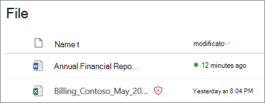
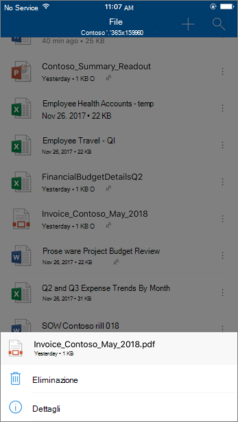

# ATP per SharePoint, OneDrive e Microsoft TeamsATP for SharePoint, OneDrive, and Microsoft Teams

[!INCLUDE [Microsoft 365 Defender rebranding](../includes/microsoft-defender-for-office.md)]

ATP per SharePoint, OneDrive e Microsoft teams in [Office 365 Advanced Threat Protection (ATP)](office-365-atp.md) fornisce un ulteriore livello di protezione per i file che sono già stati analizzati al momento del caricamento da parte del [motore di rilevamento virus comune in Microsoft 365](virus-detection-in-spo.md).ATP for SharePoint, OneDrive, and Microsoft Teams in [Office 365 Advanced Threat Protection (ATP)](office-365-atp.md) provides an additional layer of protection for files that have already been scanned at upload time by the [common virus detection engine in Microsoft 365](virus-detection-in-spo.md). ATP per SharePoint, OneDrive e Microsoft teams consente di rilevare e bloccare i file esistenti identificati come dannosi nei siti del team e nelle raccolte documenti.ATP for SharePoint, OneDrive, and Microsoft Teams helps detect and block existing files that are identified as malicious in team sites and document libraries.

ATP per SharePoint, OneDrive e Microsoft teams non è abilitato per impostazione predefinita.ATP for SharePoint, OneDrive, and Microsoft Teams is not enabled by default. Per attivarlo, vedere [accendere ATP per SharePoint, OneDrive e Microsoft teams](turn-on-atp-for-spo-odb-and-teams.md).To turn it on, see [Turn on ATP for SharePoint, OneDrive, and Microsoft Teams](turn-on-atp-for-spo-odb-and-teams.md).

## Funzionamento di ATP per SharePoint, OneDrive e Microsoft TeamsHow ATP for SharePoint, OneDrive, and Microsoft Teams works

Quando ATP per SharePoint, OneDrive e Microsoft teams è abilitato e identifica un file come dannoso, il file viene bloccato utilizzando l'integrazione diretta con gli archivi di file.When ATP for SharePoint, OneDrive, and Microsoft Teams is enabled and identifies a file as malicious, the file is locked using direct integration with the file stores. Nell'immagine seguente viene mostrato un esempio di un file dannoso rilevato in una raccolta.The following image shows an example of a malicious file detected in a library.

Anche se il file bloccato è ancora elencato nella raccolta documenti e nelle applicazioni Web, per dispositivi mobili o desktop, gli utenti non possono aprire, copiare, spostare o condividere il file.Although the blocked file is still listed in the document library and in web, mobile, or desktop applications, people can't open, copy, move, or share the file. Tuttavia, è possibile eliminare il file bloccato.But they can delete the blocked file.

Di seguito è riportato un esempio di come si presenta un file bloccato su un dispositivo mobile:Here's an example of what a blocked file looks like on a mobile device:

Per impostazione predefinita, gli utenti possono scaricare un file bloccato.By default, people can download a blocked file. Di seguito è riportato l'aspetto del download di un file bloccato su un dispositivo mobile:Here's what downloading a blocked file looks like on a mobile device:

Gli amministratori di SharePoint Online possono impedire agli utenti di scaricare file dannosi.SharePoint Online admins can prevent people from downloading malicious files. Per istruzioni, vedere [utilizzare PowerShell di SharePoint Online per impedire agli utenti di scaricare file dannosi](turn-on-atp-for-spo-odb-and-teams.md#step-2-recommended-use-sharepoint-online-powershell-to-prevent-users-from-downloading-malicious-files).For instructions, see [Use SharePoint Online PowerShell to prevent users from downloading malicious files](turn-on-atp-for-spo-odb-and-teams.md#step-2-recommended-use-sharepoint-online-powershell-to-prevent-users-from-downloading-malicious-files).

Per ulteriori informazioni sull'esperienza utente quando un file è stato rilevato come dannoso, vedere [cosa fare quando si trova un file dannoso in SharePoint Online, OneDrive o Microsoft teams](https://support.microsoft.com/office/01e902ad-a903-4e0f-b093-1e1ac0c37ad2).To learn more about the user experience when a file has been detected as malicious, see [What to do when a malicious file is found in SharePoint Online, OneDrive, or Microsoft Teams](https://support.microsoft.com/office/01e902ad-a903-4e0f-b093-1e1ac0c37ad2).

## Visualizzare informazioni sui file dannosi rilevati da ATP per SharePoint, OneDrive e Microsoft TeamsView information about malicious files detected by ATP for SharePoint, OneDrive, and Microsoft Teams

I file identificati come dannosi da ATP verranno visualizzati nei [report di Office 365 Advanced Threat Protection](view-reports-for-atp.md) e in [Explorer (e in Real-Time detections)](threat-explorer.md).Files that are identified as malicious by ATP will show up in [reports for Office 365 Advanced Threat Protection](view-reports-for-atp.md) and in [Explorer (and real-time detections)](threat-explorer.md).

A maggio 2018, quando un file viene identificato come dannoso da ATP, il file è disponibile anche in quarantena.As of May 2018, when a file is identified as malicious by ATP, the file is also available in quarantine. Per ulteriori informazioni, vedere [use the Security & Compliance Center per gestire i file in quarantena](manage-quarantined-messages-and-files.md#atp-only-use-the-security--compliance-center-to-manage-quarantined-files).For more information, see [Use the Security & Compliance Center to manage quarantined files](manage-quarantined-messages-and-files.md#atp-only-use-the-security--compliance-center-to-manage-quarantined-files).

## Tenere presente questi puntiKeep these points in mind

- ATP non analizzerà tutti i singoli file in SharePoint Online, OneDrive for business o Microsoft teams.ATP will not scan every single file in SharePoint Online, OneDrive for Business, or Microsoft Teams. Si tratta di un comportamento legato alla progettazione.This is by design. I file vengono analizzati in modo asincrono.Files are scanned asynchronously. Il processo utilizza gli eventi di condivisione e attività Guest insieme a sistemi euristici intelligenti e segnalazioni di minacce per identificare i file dannosi.The process uses sharing and guest activity events along with smart heuristics and threat signals to identify malicious files.

- Verificare che i siti di SharePoint siano configurati per l'utilizzo dell' [esperienza moderna](https://docs.microsoft.com/sharepoint/guide-to-sharepoint-modern-experience).Make sure your SharePoint sites are configured to use the [Modern experience](https://docs.microsoft.com/sharepoint/guide-to-sharepoint-modern-experience). La protezione del trifosfato di adenosina applica se viene utilizzata l'esperienza moderna o la visualizzazione classica. Tuttavia, gli indicatori visivi che un file è bloccato sono disponibili solo nell'esperienza moderna.ATP protection applies whether the Modern experience or the Classic view is used; however, visual indicators that a file is blocked are available only in the Modern experience.

- ATP per SharePoint, OneDrive e Microsoft teams è parte integrante della strategia globale di protezione dalle minacce dell'organizzazione, che include la protezione da posta indesiderata e antimalware in Exchange Online Protection (EOP), nonché collegamenti sicuri e allegati sicuri in Office 365 ATP.ATP for SharePoint, OneDrive, and Microsoft Teams is part of your organization's overall threat protection strategy, which includes anti-spam and anti-malware protection in Exchange Online Protection (EOP), as well as Safe Links and Safe Attachments in Office 365 ATP. Per ulteriori informazioni, vedere [protezione dalle minacce in Office 365](protect-against-threats.md).To learn more, see [Protect against threats in Office 365](protect-against-threats.md).
