# Collegamenti sicuri in Microsoft Defender per Office 365

[!INCLUDE [Microsoft 365 Defender rebranding](../includes/microsoft-defender-for-office.md)]

**Si applica a**
- [Microsoft Defender per Office 365 piano 1 e piano 2](office-365-atp.md)
- [Microsoft 365 Defender](../mtp/microsoft-threat-protection.md)

> [!IMPORTANT]
> Questo articolo è rivolto ai clienti aziendali di [Microsoft Defender per Office 365](office-365-atp.md). Se si usa Outlook.com, Microsoft 365 Family o Microsoft 365 Personal e si cercano informazioni sui collegamenti sicuri in Outlook, vedere [Advanced Outlook.com security.](https://support.microsoft.com/office/882d2243-eab9-4545-a58a-b36fee4a46e2)

Collegamenti sicuri è una funzionalità di Defender per [Office 365](office-365-atp.md) che fornisce l'analisi e la riscrittura degli URL dei messaggi di posta elettronica in ingresso nel flusso di posta e la verifica time-of-click degli URL e dei collegamenti nei messaggi di posta elettronica e in altre posizioni. L'analisi dei collegamenti sicuri viene eseguita in aggiunta alla normale protezione da posta indesiderata e [antimalware](anti-spam-and-anti-malware-protection.md) nei messaggi di posta elettronica in ingresso in Exchange Online Protection (EOP). L'analisi dei collegamenti sicuri consente di proteggere l'organizzazione da collegamenti dannosi utilizzati nel phishing e in altri attacchi.

La protezione collegamenti sicuri è disponibile nei percorsi seguenti:

- **Messaggi di posta** elettronica: la protezione dei collegamenti sicuri per i collegamenti nei messaggi di posta elettronica è controllata dai criteri collegamenti sicuri. Non esiste un criterio collegamenti sicuri predefinito, quindi per ottenere la protezione dei collegamenti sicuri nei messaggi di posta elettronica, è necessario creare uno o più **criteri collegamenti sicuri.** Per istruzioni, vedere [Configurare i criteri collegamenti sicuri in Microsoft Defender per Office 365.](set-up-atp-safe-links-policies.md)

  Per ulteriori informazioni sulla protezione dei collegamenti sicuri per i messaggi di posta elettronica, vedere la sezione Collegamenti sicuri per i messaggi di [posta](#safe-links-settings-for-email-messages) elettronica più avanti in questo articolo.

- **Microsoft Teams** (attualmente in anteprima TAP): la protezione dei collegamenti sicuri per i collegamenti nelle conversazioni di Teams, nelle chat di gruppo o dai canali è controllata anche dai criteri collegamenti sicuri. Non esiste un criterio collegamenti sicuri predefinito, quindi per ottenere la protezione dei collegamenti sicuri in Teams, è necessario creare uno o più **criteri collegamenti sicuri.**

  Per ulteriori informazioni sulla protezione dei collegamenti sicuri in Teams, vedere la sezione Collegamenti sicuri per [Microsoft Teams](#safe-links-settings-for-microsoft-teams) più avanti in questo articolo.

- **App di Office 365:** la protezione dei collegamenti sicuri per le app di Office 365 è disponibile negli accessi desktop, mobili e Web supportati. La **protezione** dei collegamenti sicuri per le app di  Office 365 viene configurata nell'impostazione globale che non rientra nei criteri collegamenti sicuri. Per istruzioni, vedere [Configurare le impostazioni globali per le impostazioni dei collegamenti sicuri in Microsoft Defender per Office 365.](configure-global-settings-for-safe-links.md)

  Tuttavia, la protezione collegamenti sicuri per le  app di Office 365 viene applicata solo agli utenti inclusi nei criteri collegamenti sicuri attivi. Se un utente non è incluso in un criterio collegamenti sicuri attivo, l'utente non ottiene la protezione collegamenti sicuri nelle app di Office 365 supportate.

  Per ulteriori informazioni sulla protezione dei collegamenti sicuri nelle app di Office 365, vedere la sezione Impostazioni collegamenti sicuri per le app di [Office 365](#safe-links-settings-for-office-365-apps) più avanti in questo articolo.

In questo articolo sono incluse descrizioni dettagliate dei seguenti tipi di impostazioni per i collegamenti sicuri:

- **Impostazioni nei criteri collegamenti** sicuri: queste impostazioni si applicano solo agli utenti inclusi nei criteri specifici e le impostazioni potrebbero essere diverse tra i criteri. Queste impostazioni includono:

  - [Impostazioni collegamenti sicuri per i messaggi di posta elettronica](#safe-links-settings-for-email-messages)
  - [Impostazioni dei collegamenti sicuri per Microsoft Teams](#safe-links-settings-for-microsoft-teams)
  - ["Non riscrivere gli URL seguenti" nei criteri collegamenti sicuri](#do-not-rewrite-the-following-urls-lists-in-safe-links-policies)

- **Impostazioni globali collegamenti sicuri**: queste impostazioni vengono configurate a livello globale e non nei criteri collegamenti sicuri. Tuttavia, le impostazioni si applicano solo agli utenti inclusi nei criteri collegamenti sicuri attivi. Queste impostazioni includono:

  - [Impostazioni dei collegamenti sicuri per le app di Office 365](#safe-links-settings-for-office-365-apps)
  - [Elenco "Blocca gli URL seguenti" per i collegamenti sicuri](#block-the-following-urls-list-for-safe-links)

La tabella seguente descrive gli scenari per i collegamenti sicuri nelle organizzazioni di Microsoft 365 e Office 365 che includono Defender per Office 365 (in altre parole, la mancanza di licenze non è mai un problema negli esempi).

****

|Scenario|Risultato|
|---|---|
|Francesco è un membro del reparto marketing. La protezione collegamenti sicuri per le app di Office 365 è attivata nelle impostazioni globali per i collegamenti sicuri e esiste un criterio collegamenti sicuri applicabile ai membri del reparto marketing. Francesco apre una presentazione di PowerPoint in un messaggio di posta elettronica e quindi fa clic su un URL nella presentazione.|Francesco è protetto da collegamenti sicuri. 
 Francesco è incluso in un criterio collegamenti sicuri e la protezione collegamenti sicuri per le app di Office 365 è attivata. 
 Per ulteriori informazioni sui requisiti per la protezione dei collegamenti sicuri nelle app di Office 365, vedere la sezione Collegamenti sicuri per le app di [Office 365](#safe-links-settings-for-office-365-apps) più avanti in questo articolo.|
|L'organizzazione di Microsoft 365 E5 di Chris non dispone di criteri collegamenti sicuri configurati. Chris riceve un messaggio di posta elettronica da un mittente esterno contenente un URL a un sito Web dannoso su cui fa clic.|Chris non è protetto da collegamenti sicuri. 
 Un amministratore deve creare almeno un criterio collegamenti sicuri per ottenere la protezione dei collegamenti sicuri nei messaggi di posta elettronica in ingresso. Chris deve essere incluso nelle condizioni dei criteri per ottenere la protezione dei collegamenti sicuri.|
|Nell'organizzazione di Pat, nessun amministratore ha creato criteri collegamenti sicuri, ma la protezione collegamenti sicuri per le app di Office 365 è attivata. Pat apre un documento di Word e fa clic su un URL nel file.|Pat non è protetto da collegamenti sicuri. 
 Anche se la protezione collegamenti sicuri per le app di Office 365 è attivata a livello globale, Pat non è incluso nei criteri collegamenti sicuri attivi, quindi la protezione non può essere applicata.|
|Nell'organizzazione di Lee, è configurato nell'elenco Blocca gli URL seguenti nelle `https://tailspintoys.com` impostazioni globali per i collegamenti sicuri.  Esiste già un criterio collegamenti sicuri che include Lee. Lee riceve un messaggio di posta elettronica contenente `https://tailspintoys.com/aboutus/trythispage` l'URL. Lee fa clic sull'URL.|L'URL potrebbe essere bloccato automaticamente per Lee. dipende dalla voce dell'URL nell'elenco e dal client di posta elettronica utilizzato da Lee. Per ulteriori informazioni, vedere [l'elenco "Bloccare gli URL seguenti"](#block-the-following-urls-list-for-safe-links) per i collegamenti sicuri più avanti in questo articolo.|
|Julia e Julia funzionano entrambi per contoso.com. Molto tempo fa, gli amministratori configurano i criteri collegamenti sicuri che si applicano sia a Julia che a Julia. Julia invia un messaggio di posta elettronica a Julia, senza sapere che il messaggio contiene un URL dannoso.|Julia è protetta da collegamenti **sicuri se** il criterio Collegamenti sicuri che si applica a lei è configurato per essere applicato ai messaggi tra destinatari interni. Per ulteriori informazioni, vedere la sezione [Collegamenti sicuri per i messaggi di posta](#safe-links-settings-for-email-messages) elettronica più avanti in questo articolo.|

## Impostazioni collegamenti sicuri per i messaggi di posta elettronica

Collegamenti sicuri analizza la posta elettronica in arrivo alla ricerca di collegamenti ipertestuali dannosi noti. Gli URL analizzati vengono riscritti utilizzando il prefisso URL standard Microsoft: `https://nam01.safelinks.protection.outlook.com` . Una volta riscritto, il collegamento viene analizzato per ricercare contenuti potenzialmente dannosi.

Dopo la riscrittura di un URL da parte dei  collegamenti sicuri, l'URL rimane riscritto anche se il messaggio viene inoltrato manualmente o a cui si risponde (sia ai destinatari interni che a destinatari esterni). I collegamenti aggiuntivi aggiunti al messaggio inoltrato o a cui viene risposto non vengono riscritti. Tuttavia, nel caso  dell'inoltro automatico da parte delle regole di Posta in arrivo o dell'inoltro  SMTP, l'URL non verrà riscritto nel messaggio destinato al destinatario finale, a meno che tale destinatario non sia protetto anche da collegamenti sicuri o che l'URL sia già stato riscritto in una comunicazione precedente. 

Le impostazioni dei criteri collegamenti sicuri applicabili ai messaggi di posta elettronica sono descritte nell'elenco seguente:

- **Selezionare l'azione per URL sconosciuti potenzialmente dannosi nei messaggi:** abilita o disabilita l'analisi dei collegamenti sicuri nei messaggi di posta elettronica. Il valore consigliato è **On.** L'attivazione di questa impostazione comporta le azioni seguenti.

  - L'analisi dei collegamenti sicuri è abilitata in Outlook (C2R) in Windows.
  - Gli URL vengono riscritti e gli utenti vengono instradati tramite la protezione Collegamenti sicuri quando fanno clic su URL nei messaggi.
  - Quando si fa clic, gli URL vengono controllati in base a un elenco di URL dannosi noti e all'elenco ["Blocca gli URL seguenti".](#block-the-following-urls-list-for-safe-links)
  - Gli URL che non hanno una reputazione valida vengono detonati in modo asincrono in background.

- **Applicare l'analisi degli URL** in tempo reale per i collegamenti sospetti e i collegamenti che puntano ai file: consente l'analisi in tempo reale dei collegamenti, inclusi i collegamenti nei messaggi di posta elettronica che puntano a contenuto scaricabile. Il valore consigliato è abilitato.

  - **Attendere il completamento dell'analisi degli URL prima di recapitare il messaggio:**

    - Abilitato: i messaggi che contengono URL vengono mantenuti fino al termine dell'analisi. I messaggi vengono recapitati solo dopo che gli URL sono stati confermati come sicuri. Questo è il valore consigliato.
    - Disabilitato: se l'analisi degli URL non può essere completata, recapitare comunque il messaggio.

- **Applica collegamenti sicuri** ai messaggi di posta elettronica inviati all'interno dell'organizzazione: abilita o disabilita l'analisi dei collegamenti sicuri sui messaggi inviati tra mittenti interni e destinatari interni all'interno della stessa organizzazione di Exchange Online. Il valore consigliato è abilitato.

- **Non tenere traccia dei clic degli utenti:** consente di abilitare o disabilitare l'archiviazione dei dati di clic sui collegamenti sicuri per gli URL su cui si fa clic nei messaggi di posta elettronica. Il valore consigliato è lasciare deselezionata questa impostazione (per tenere traccia dei clic dell'utente).

  La verifica dei clic dell'URL per i collegamenti nei messaggi di posta elettronica inviati tra mittenti interni e destinatari interni non è attualmente supportata.

- **Non consentire agli utenti di passare all'URL** originale: consente o impedisce agli utenti di fare clic nella pagina di avviso [fino](#warning-pages-from-safe-links) all'URL originale. Il valore consigliato è abilitato.

- **Non riscrivere gli URL seguenti:** lascia gli URL così come sono. Mantiene un elenco personalizzato di URL sicuri che non necessitano dell'analisi. L'elenco è univoco per ogni criterio collegamenti sicuri. Per ulteriori informazioni sull'elenco Non riscrivere gli **URL** seguenti, vedere gli elenchi "Non riscrivere gli [URL seguenti"](#do-not-rewrite-the-following-urls-lists-in-safe-links-policies) nella sezione criteri collegamenti sicuri più avanti in questo articolo.

Per ulteriori informazioni sui valori consigliati per le impostazioni dei criteri Standard e Strict per i criteri collegamenti sicuri, vedere Impostazioni dei criteri [collegamenti sicuri.](recommended-settings-for-eop-and-office365-atp.md#safe-links-policy-settings)

- **Filtri destinatario:** è necessario specificare le condizioni e le eccezioni del destinatario che determinano a chi si applica il criterio. È possibile utilizzare queste proprietà per le condizioni e le eccezioni:

  - **Il destinatario è**
  - **Il dominio del destinatario è**
  - **Il destinatario è un membro di**

  È possibile utilizzare solo un'eccezione una volta, ma la condizione o l'eccezione può contenere più valori. Più valori della stessa condizione o eccezione utilizzano la logica OR (ad esempio, _\<recipient1\>_ o _\<recipient2\>_). Condizioni o eccezioni diverse utilizzano la logica AND (ad esempio, _\<recipient1\>_ e _\<member of group 1\>_).

- **Priorità:** se si creano più criteri, è possibile specificare l'ordine in cui vengono applicati. Nessun criterio può avere la stessa priorità e l'elaborazione dei criteri termina dopo l'applicazione del primo criterio.

  Per altre informazioni sull'ordine di precedenza e su come vengono valutati e applicati multipli criteri, vedere [Ordine e precedenza della protezione della posta elettronica](how-policies-and-protections-are-combined.md).

### Funzionamento dei collegamenti sicuri nei messaggi di posta elettronica

Ad alto livello, ecco come funziona la protezione dei collegamenti sicuri sugli URL nei messaggi di posta elettronica:

1. Tutta la posta elettronica passa attraverso EOP, dove i filtri ip e delle buste, la protezione antimalware basata sulla firma, i filtri antispam e antimalware prima che il messaggio venga recapitato alla cassetta postale del destinatario.

2. L'utente apre il messaggio nella propria cassetta postale e fa clic su un URL nel messaggio.

3. Collegamenti sicuri controlla immediatamente l'URL prima di aprire il sito Web:

   - Se l'URL è incluso nell'elenco Blocca **gli URL** seguenti, viene visualizzato un avviso [url](#blocked-url-warning) bloccato.

   - Se l'URL punta a un sito Web  che è stato rilevato come dannoso, viene visualizzata una pagina di avviso del sito Web dannoso (o una pagina di avviso diversa).

   - Se l'URL punta a un file scaricabile e l'impostazione Applica analisi **URL** in tempo reale per collegamenti sospetti e collegamenti che puntano a file è abilitata nei criteri applicabili all'utente, il file scaricabile viene controllato.

   - Se l'URL viene determinato come sicuro, viene aperto il sito Web.

## Impostazioni dei collegamenti sicuri per Microsoft Teams

> [!IMPORTANT]
> A partire da marzo 2020, questa funzionalità è disponibile in anteprima ed è disponibile solo per i membri del programma TAP (Technology Adoption Program) di Microsoft Teams. Per informazioni sulla pianificazione dei rilasci, consultare la roadmap di [Microsoft 365.](https://www.microsoft.com/microsoft-365/roadmap?rtc=1&filters=&searchterms=Safe%2CLinks%2CProtection%2Cfor%2CMicrosoft%2CTeams)

La protezione dei collegamenti sicuri per Microsoft Teams viene abilitata o disabilitata nei criteri collegamenti sicuri. In particolare, si usa l'impostazione Seleziona l'azione per URL sconosciuti o **potenzialmente dannosi all'interno di Microsoft Teams.** Il valore consigliato è **On.**

Le impostazioni seguenti nei criteri collegamenti sicuri che si applicano ai collegamenti nei messaggi di posta elettronica si applicano anche ai collegamenti in Teams:

- **Applicare l'analisi degli URL in tempo reale per i collegamenti sospetti e i collegamenti che puntano ai file**
- **Non tenere traccia dei clic degli utenti**
- **Non consentire agli utenti di passare all'URL originale**

Queste impostazioni sono illustrate nella sezione collegamenti [sicuri precedente per i messaggi di posta](#safe-links-settings-for-email-messages) elettronica.

Dopo aver attivata la protezione dei collegamenti sicuri per Microsoft Teams, gli URL in Teams vengono controllati in base a un elenco di collegamenti dannosi noti quando l'utente protetto fa clic sul collegamento (protezione basata sul clic). Gli URL non vengono riscritti. Se un collegamento viene rilevato come dannoso, gli utenti avranno le esperienze seguenti:

- Se il collegamento è stato fatto clic in una conversazione di Teams, in una chat di gruppo o da canali, la pagina di avviso, come illustrato nello screenshot seguente, verrà visualizzata nel Web browser predefinito.
- Se il collegamento è stato fatto clic da una scheda aggiunta, la pagina di avviso verrà visualizzata nell'interfaccia di Teams all'interno di tale scheda. L'opzione per aprire il collegamento in un Web browser è disabilitata per motivi di sicurezza.
- A seconda di come è configurata l'impostazione Non consentire agli utenti di passare **all'URL** originale nel criterio, l'utente sarà autorizzato o meno a fare clic sull'URL originale (continuare comunque (scelta non **consigliata)** nello screenshot. È consigliabile abilitare l'impostazione Non consentire agli utenti di passare **all'URL** originale in modo che gli utenti non possano accedere all'URL originale.

Se l'utente che ha inviato il collegamento non è incluso in un criterio collegamenti sicuri in cui è abilitata la protezione di Teams, l'utente è libero di passare all'URL originale nel computer o nel dispositivo.

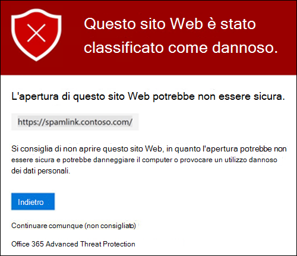

Se si **fa clic sul pulsante** Indietro nella pagina di avviso, l'utente verrà nuovamente visualizzato nel contesto o nella posizione dell'URL originale. Tuttavia, facendo di nuovo clic sul collegamento originale, collegamenti sicuri rieffeguiranno l'analisi dell'URL, in modo che la pagina di avviso verrà nuovamente visualizzata.

### Funzionamento dei collegamenti sicuri in Teams

Ad alto livello, ecco come funziona la protezione dei collegamenti sicuri per gli URL in Microsoft Teams:

1. Un utente avvia l'app Teams.

2. Microsoft 365 verifica che l'organizzazione dell'utente includa Microsoft Defender per Office 365 e che l'utente sia incluso in un criterio collegamenti sicuri attivo in cui è abilitata la protezione per Microsoft Teams.

3. Gli URL vengono convalidati al momento del clic dell'utente nelle chat, nelle chat di gruppo, nei canali e nelle schede.

## Impostazioni dei collegamenti sicuri per le app di Office 365

La protezione collegamenti sicuri per le app di Office 365 controlla i collegamenti nei documenti di Office, non i collegamenti nei messaggi di posta elettronica (ma può controllare i collegamenti nei documenti di Office allegati nei messaggi di posta elettronica dopo l'apertura del documento).

La protezione collegamenti sicuri per le app di Office 365 presenta i requisiti client seguenti:

- Microsoft 365 Apps o Microsoft 365 Business Premium.
  - Versioni correnti di Word, Excel e PowerPoint in Windows, Mac o in un Web browser.
  - App di Office su dispositivi iOS o Android.
  - Visio in Windows.
  - OneNote in un Web browser.

- Le app di Office 365 sono configurate per l'utilizzo dell'autenticazione moderna. Per ulteriori informazioni, vedere Funzionamento dell'autenticazione moderna per le app client di [Office 2013, Office 2016 e Office 2019.](../../enterprise/modern-auth-for-office-2013-and-2016.md)

- Gli utenti hanno eseguito l'accesso usando i propri account aziendali o dell'istituto di istruzione. Per ulteriori informazioni, vedere [Accedere a Office.](https://support.microsoft.com/office/b9582171-fd1f-4284-9846-bdd72bb28426)

La protezione dei collegamenti sicuri per le app di Office 365 viene configurata nelle impostazioni globali per i collegamenti sicuri, non nei criteri collegamenti sicuri. Tuttavia, per applicare la protezione collegamenti sicuri per le app di Office 365, l'utente che apre il documento di Office e fa clic sul collegamento deve essere incluso in un criterio collegamenti sicuri attivo.

Le impostazioni dei collegamenti sicuri seguenti sono disponibili per le app di Office 365:

- **Applicazioni di Office 365:** abilita o disabilita l'analisi dei collegamenti sicuri nelle app di Office 365 supportate. Il valore predefinito e consigliato è **On.**

- **Non tenere traccia** quando gli utenti fanno clic su Collegamenti sicuri: consente di abilitare o disabilitare l'archiviazione dei dati dei collegamenti sicuri per gli URL selezionati nelle versioni desktop di Word, Excel, PowerPoint e Visio. Il valore consigliato è **Disattivato,** il che significa che i clic dell'utente vengono monitorati.

- Non consentire agli utenti di fare clic su collegamenti sicuri  **all'URL** originale: consente o impedisce agli utenti di fare clic nella pagina di avviso all'URL originale nelle versioni desktop di Word, Excel, PowerPoint e Visio. Il valore predefinito e consigliato è **On.**

Per configurare le impostazioni dei collegamenti sicuri per le app di Office 365, vedere Configurare la protezione dei collegamenti sicuri per le [app di Office 365.](configure-global-settings-for-safe-links.md#configure-safe-links-protection-for-office-365-apps-in-the-security--compliance-center)

Per ulteriori informazioni sui valori consigliati per le impostazioni dei criteri Standard e Strict, vedere [Global settings for Safe Links.](recommended-settings-for-eop-and-office365-atp.md#global-settings-for-safe-links)

### Funzionamento dei collegamenti sicuri nelle app di Office 365

A livello di alto livello, ecco come funziona la protezione dei collegamenti sicuri per gli URL nelle app di Office 365. Le app di Office 365 supportate sono descritte nella sezione precedente.

1. Un utente accede con il proprio account aziendale o dell'istituto di istruzione in un'organizzazione che include Microsoft 365 Apps o Microsoft 365 Business Premium.

2. L'utente apre e fa clic su un collegamento a un documento di Office in un'app di Office supportata.

3. Collegamenti sicuri controlla immediatamente l'URL prima di aprire il sito Web di destinazione:

   - Se l'URL è incluso nell'elenco che  ignora l'analisi dei collegamenti sicuri (l'elenco Blocca gli URL seguenti), viene visualizzata una pagina di avviso [url](#blocked-url-warning) bloccati.

   - Se l'URL punta a un sito Web  che è stato rilevato come dannoso, viene visualizzata una pagina di avviso del sito Web dannoso (o una pagina di avviso diversa).

   - Se l'URL punta a un file scaricabile e il criterio Collegamenti sicuri applicabile all'utente è configurato per l'analisi dei collegamenti al contenuto scaricabile (applicare l'analisi degli **URL** in tempo reale per verificare la ricerca di collegamenti sospetti e collegamenti che puntano ai file), il file scaricabile viene controllato.

   - Se l'URL è considerato sicuro, l'utente viene portato al sito Web.

   - Se non è possibile completare l'analisi dei collegamenti sicuri, la protezione collegamenti sicuri non viene attivata. Nei client desktop di Office, l'utente verrà avvisato prima di passare al sito Web di destinazione.

> [!NOTE]
> All'inizio di ogni sessione potrebbero essere necessario alcuni secondi per verificare che all'utente siano abilitati i collegamenti sicuri per Office.

## Elenco "Blocca gli URL seguenti" per i collegamenti sicuri

**L'elenco Blocca gli URL** seguenti definisce i collegamenti sempre bloccati dall'analisi dei collegamenti sicuri nei percorsi seguenti:

- Messaggi di posta elettronica.
- Documenti nelle app di Office 365 in Windows e Mac.
- Documenti in Office per iOS e Android.

Quando un utente in un criterio collegamenti sicuri attivo fa clic su un collegamento bloccato in un'app supportata, viene visualizzata la [pagina di](#blocked-url-warning) avviso URL bloccati.

L'elenco degli URL viene configurato nelle impostazioni globali per i collegamenti sicuri. Per istruzioni, vedere [Configurare l'elenco "Bloccare gli URL seguenti".](configure-global-settings-for-safe-links.md#configure-the-block-the-following-urls-list-in-the-security--compliance-center)

**Note**:

- Per un elenco veramente universale degli URL bloccati ovunque, vedere [Gestire l'elenco tenant consentiti/bloccati.](tenant-allow-block-list.md)

- Limiti:
  - Il numero massimo di voci è 500.
  - La lunghezza massima di una voce è 128 caratteri.
  - Tutte le voci non possono superare i 10.000 caratteri.

- Non includere una barra ( `/` ) alla fine dell'URL. Ad esempio, utilizzare `https://www.contoso.com` , non `https://www.contoso.com/` .

- Un URL solo dominio (ad esempio `contoso.com` o `tailspintoys.com` ) blocterà qualsiasi URL che contiene il dominio.

- È possibile bloccare un sottodominio senza bloccare l'intero dominio. Ad esempio, blocca qualsiasi URL che contiene il sottodominio, ma non blocca gli `toys.contoso.com*` URL che contengono il dominio `contoso.com` completo.

- È possibile includere fino a tre caratteri jolly ( `*` ) per ogni voce URL.

### Sintassi delle voci per l'elenco "Blocca gli URL seguenti"

Nella tabella seguente sono descritti alcuni esempi dei valori che è possibile immettere e dei relativi risultati:

****

|Valore|Risultato|
|---|---|
|`contoso.com` 
 oppure 
 `*contoso.com*`|Blocca il dominio, i sottodomini e i percorsi. Ad esempio, `https://www.contoso.com` , `https://sub.contoso.com` e sono `https://contoso.com/abc` bloccati.|
|`https://contoso.com/a`|Blocca `https://contoso.com/a` ma non altri sottopercorso, ad esempio `https://contoso.com/a/b` .|
|`https://contoso.com/a*`|Blocchi `https://contoso.com/a` e altri sottopercorso come `https://contoso.com/a/b` .|
|`https://toys.contoso.com*`|Blocca un sottodominio ( in questo esempio) ma consente i clic su altri `toys` URL di dominio (ad esempio o `https://contoso.com` `https://home.contoso.com` ).|
|

## "Non riscrivere gli URL seguenti" nei criteri collegamenti sicuri

> [!NOTE]
> Se nell'organizzazione vengono utilizzati  criteri collegamenti sicuri, l'unico metodo supportato per i test di phishing di terze parti è Non riscrivere gli URL seguenti.

Ogni criterio Collegamenti sicuri contiene un elenco Non riscrivere gli **URL** seguenti che è possibile utilizzare per specificare gli URL non riscritti dall'analisi dei collegamenti sicuri. In altre parole, l'elenco consente agli utenti inclusi nel criterio di accedere agli URL specificati che altrimenti verrebbero bloccati dai collegamenti sicuri. È possibile configurare elenchi diversi in criteri collegamenti sicuri diversi. L'elaborazione dei criteri si interrompe dopo l'applicazione del primo criterio (probabilmente con la priorità più alta) all'utente. Pertanto, a  un utente incluso in più criteri collegamenti sicuri attivi viene applicato un solo url non riscrivere l'elenco degli URL seguenti.

Per aggiungere voci all'elenco nei criteri collegamenti sicuri nuovi o esistenti, vedere [Create Safe Links policies](set-up-atp-safe-links-policies.md#use-the-security--compliance-center-to-create-safe-links-policies) or Modify Safe Links [policies.](set-up-atp-safe-links-policies.md#use-the-security--compliance-center-to-modify-safe-links-policies)

**Note**:

- I client seguenti non riconoscono l'elenco **Do not rewrite the following URLs** lists in Safe Links policies. Agli utenti inclusi nei criteri può essere impedito di accedere agli URL in base ai risultati dell'analisi dei collegamenti sicuri in questi client:

  - Microsoft Teams
  - Office Web Apps

  Per un elenco veramente universale degli URL consentiti ovunque, vedere [Manage the Tenant Allow/Block List.](tenant-allow-block-list.md)

- Valuta la possibilità di aggiungere URL interni di uso comune all'elenco per migliorare l'esperienza utente. Ad esempio, se si dispone di servizi locali, come Skype for Business o SharePoint, è possibile aggiungere tali URL per escluderli dall'analisi.

- Se nei criteri collegamenti sicuri non sono già state riscritte le voci degli **URL** seguenti, assicurarsi di esaminare gli elenchi e aggiungere i caratteri jolly in base alle esigenze. Ad esempio, l'elenco contiene una voce simile e `https://contoso.com/a` successivamente si decide di includere sottopercorso come `https://contoso.com/a/b` . Anziché aggiungere una nuova voce, aggiungere un carattere jolly alla voce esistente in modo che diventi `https://contoso.com/a/*` .

- È possibile includere fino a tre caratteri jolly ( `*` ) per ogni voce URL. I caratteri jolly includono in modo esplicito prefissi o sottodomini. Ad esempio, la voce non corrisponde a , perché consente agli utenti di visitare i sottodomini e i `contoso.com` `*.contoso.com/*` percorsi nel dominio `*.contoso.com/*` specificato.

### Sintassi delle voci per l'elenco "Non riscrivere gli URL seguenti"

Nella tabella seguente sono descritti alcuni esempi dei valori che è possibile immettere e dei relativi risultati:

****

|Valore|Risultato|
|---|---|
|`contoso.com`|Consente `https://contoso.com` l'accesso a sottodomini o percorsi, ma non a percorsi.|
|`*.contoso.com/*`|Consente l'accesso a un dominio, a sottodomini e a percorsi, ad esempio `https://www.contoso.com` `https://www.contoso.com` , , o `https://maps.contoso.com` `https://www.contoso.com/a` . 
 Questa voce è intrinsecamente migliore di , perché non consente siti `*contoso.com*` potenzialmente fraudolenti, come `https://www.falsecontoso.com` o `https://www.false.contoso.completelyfalse.com`|
|`https://contoso.com/a`|Consente l'accesso `https://contoso.com/a` a , ma non a sottopercorsi come `https://contoso.com/a/b`|
|`https://contoso.com/a/*`|Consente `https://contoso.com/a` l'accesso e i sottopercorso come `https://contoso.com/a/b`|
|

## Pagine di avviso da Collegamenti sicuri

Questa sezione contiene esempi delle varie pagine di avviso attivate dalla protezione Collegamenti sicuri quando si fa clic su un URL.

Si noti che sono state aggiornate diverse pagine di avviso. Se non vedi già le pagine aggiornate, lo sarà a breve. Le pagine aggiornate includono una nuova combinazione di colori, più dettagli e la possibilità di passare a un sito nonostante i suggerimenti e gli avvisi forniti.

### Notifica analisi in corso

L'URL su cui si fa clic viene analizzato da Collegamenti sicuri. Potrebbe essere necessario attendere alcuni istanti prima di provare di nuovo il collegamento.

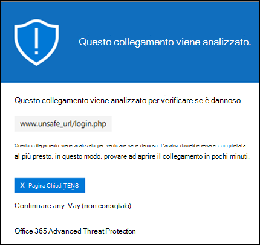

La pagina di notifica originale era simile alla seguente:

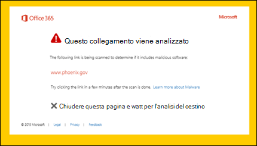

### Avviso di messaggi sospetti

L'URL su cui si è fatto clic era in un messaggio di posta elettronica simile ad altri messaggi sospetti. Si consiglia di controllare il messaggio di posta elettronica prima di procedere al sito.

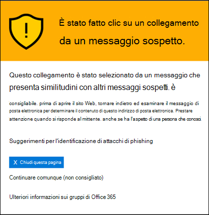

### Avviso tentativi di phishing

L'URL su cui si è fatto clic era in un messaggio di posta elettronica identificato come attacco di phishing. Di conseguenza, tutti gli URL nel messaggio di posta elettronica vengono bloccati. È consigliabile non procedere con il sito.

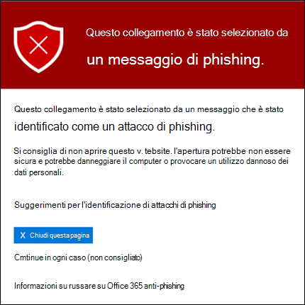

### Avviso di siti Web dannosi

L'URL su cui si fa clic punta a un sito identificato come dannoso. È consigliabile non procedere con il sito.

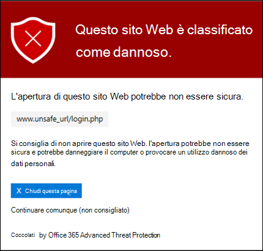

La pagina di avviso originale era simile alla seguente:

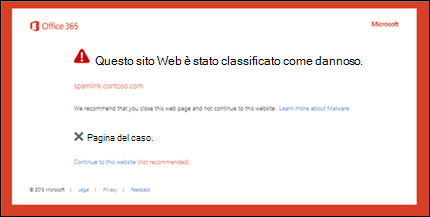

### Avviso URL bloccati

L'URL selezionato è stato bloccato manualmente da un amministratore dell'organizzazione (l'elenco Blocca gli **URL** seguenti nelle impostazioni globali per i collegamenti sicuri). Il collegamento non è stato analizzato da Collegamenti sicuri perché è stato bloccato manualmente.

Esistono diversi motivi per cui un amministratore bloccherebbe manualmente URL specifici. Se si pensa che il sito non debba essere bloccato, contattare l'amministratore.

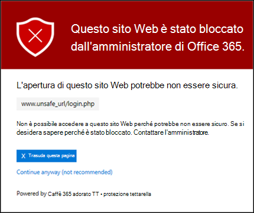

La pagina di avviso originale era simile alla seguente:

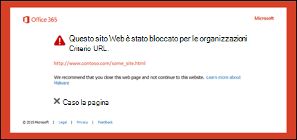

### Avviso di errore

Si è verificato un tipo di errore e non è possibile aprire l'URL.

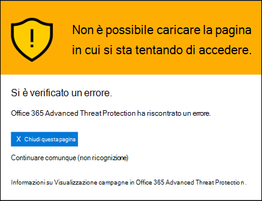

La pagina di avviso originale era simile alla seguente:

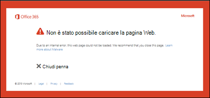
