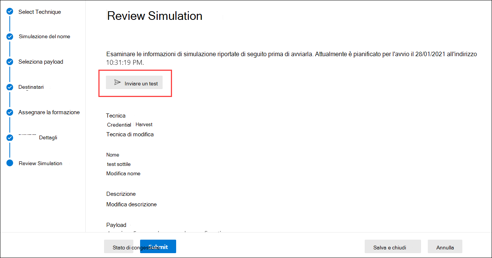

# Considerazioni e domande frequenti sulla distribuzione della formazione del Simulatore di attacchiAttack simulation training deployment considerations and FAQ

La formazione per la simulazione di attacchi [è ora disponibile in genere.](https://techcommunity.microsoft.com/t5/microsoft-security-and/attack-simulation-training-in-microsoft-defender-for-office-365/ba-p/2037291)Attack simulation training is now [generally available](https://techcommunity.microsoft.com/t5/microsoft-security-and/attack-simulation-training-in-microsoft-defender-for-office-365/ba-p/2037291). La formazione sulla simulazione di attacchi consente alle organizzazioni di Microsoft 365 E5 o Microsoft Defender per Office 365 Piano 2 di misurare e gestire i rischi di social engineering consentendo la creazione e la gestione di simulazioni di phishing basate su payload di phishing reali e de-armati.Attack simulation training enables Microsoft 365 E5 or Microsoft Defender for Office 365 Plan 2 organizations to measure and manage social engineering risk by allowing the creation and management of phishing simulations that are powered by real-world, de-weaponized phishing payloads. La formazione iper mirata, in collaborazione con la sicurezza di Terranova, aiuta a migliorare le conoscenze e a modificare il comportamento dei dipendenti.Hyper-targeted training, delivered in partnership with Terranova security, helps improve knowledge and change employee behavior.

Per ulteriori informazioni sull'introduzione alla formazione sulla simulazione di attacco, vedere Introduzione all'uso della formazione [sulla simulazione di attacco.](attack-simulation-training-get-started.md)For more information about getting started with Attack simulation training, see [Get started using Attack simulation training](attack-simulation-training-get-started.md).

Sebbene l'intera esperienza di creazione e pianificazione della simulazione sia stata progettata per essere senza flusso libero e senza attriti, l'esecuzione di simulazioni su scala aziendale spesso richiede una pianificazione.While the whole simulation creation and scheduling experience has been designed to be free-flowing and frictionless, running simulations at an enterprise scale often requires planning. Questo articolo consente di affrontare sfide specifiche che vediamo quando i nostri clienti eseguono simulazioni nei propri ambienti.This article helps address specific challenges that we see as our customers run simulations in their own environments.

## Problemi con le esperienze degli utenti finaliIssues with end user experiences

### URL di simulazione di phishing bloccati da Google Safe BrowsingPhishing simulation URLs blocked by Google Safe Browsing

Un servizio di reputazione URL potrebbe identificare uno o più URL utilizzati dal training di simulazione degli attacchi come non sicuri.A URL reputation service might identify one or more of the URLs that are used by Attack simulation training as unsafe. L'esplorazione sicura di Google in Google Chrome blocca alcuni DEGLI URL di phishing simulati con un **messaggio di** sito inganneale in anticipo.Google Safe Browsing in Google Chrome blocks some of the simulated phishing URLs with a **Deceptive site ahead** message. Anche se lavoriamo con molti fornitori di reputazione URL per consentire sempre gli URL di simulazione, non sempre abbiamo una copertura completa.While we work with many URL reputation vendors to always allow our simulation URLs, we don't always have full coverage.

Tieni presente che questo problema non influisce su Microsoft Edge.Note that this issue does not affect Microsoft Edge.

Nell'ambito della fase di pianificazione, verificare la disponibilità dell'URL nei Web browser supportati prima di utilizzare l'URL in una campagna di phishing.As part of the planning phase, be sure to check the availability of the URL in your supported web browsers before you use the URL in a phishing campaign. Se gli URL sono bloccati da Google Safe Browsing, segui [queste](https://support.google.com/chrome/a/answer/7532419) indicazioni di Google per consentire l'accesso agli URL.If the URLs are blocked by Google Safe Browsing, [follow this guidance](https://support.google.com/chrome/a/answer/7532419) from Google to allow access to the URLs.

Per [l'elenco degli](attack-simulation-training-get-started.md) URL attualmente utilizzati dal training di simulazione di attacco, vedere Introduzione all'uso del training di simulazione degli attacchi.Refer to [Get started using Attack simulation training](attack-simulation-training-get-started.md) for the list of URLs that are currently used by Attack simulation training.

### Simulazione di phishing e URL di amministratore bloccati dalle soluzioni proxy di rete e dai driver di filtroPhishing simulation and admin URLs blocked by network proxy solutions and filter drivers

Sia gli URL di simulazione di phishing che gli URL di amministrazione potrebbero essere bloccati o eliminati dai filtri o dai dispositivi di sicurezza intermedi.Both phishing simulation URLs and admin URLs might be blocked or dropped by your intermediate security devices or filters. Ad esempio:For example:

- FirewallFirewalls
- Soluzioni WaF (Web Application Firewall)Web Application Firewall (WAF) solutions
- Driver di filtro di terze parti (ad esempio, filtri in modalità kernel)Third-party filter drivers (for example, kernel mode filters)

Anche se abbiamo visto pochi clienti bloccati a questo livello, si verifica.While we have seen few customers being blocked at this layer, it does happen. In caso di problemi, è consigliabile configurare gli URL seguenti per ignorare l'analisi da parte dei dispositivi di sicurezza o dei filtri in base alle esigenze:If you encounter problems, consider configuring the following URLs to bypass scanning by your security devices or filters as required:

- Gli URL di phishing simulati, come descritto in [Introduzione all'uso della simulazione di attacco.](attack-simulation-training-get-started.md)The simulated phishing URLs as described in [Get started using Attack simulation training](attack-simulation-training-get-started.md).
- <https://security.microsoft.com/attacksimulator>
- <https://security.microsoft.com/attacksimulationreport>
- <https://security.microsoft.com/trainingassignments>

### Messaggi di simulazione non recapitati a tutti gli utenti di destinazioneSimulation messages not delivered to all targeted users

È possibile che il numero di utenti che effettivamente ricevono i messaggi di posta elettronica di simulazione sia inferiore al numero di utenti mirati dalla simulazione.It's possible that the number of users who actually receive the simulation email messages is less than the number of users who were targeted by the simulation. Nell'ambito della convalida di destinazione verranno esclusi i tipi di utenti seguenti:The following types of users will be excluded as part of target validation:

- Indirizzi di posta elettronica dei destinatari non validi.Invalid recipient email addresses.
- Utenti guest.Guest users.
- Utenti che non sono più attivi in Azure Active Directory (Azure AD).Users that are no longer active in Azure Active Directory (Azure AD).

Nelle simulazioni verranno inclusi solo gli utenti non guest validi con una cassetta postale valida.Only valid, non-guest users with a valid mailbox will be included in simulations. Se si utilizzano gruppi di distribuzione o gruppi di sicurezza abilitati alla posta elettronica per gli utenti di destinazione, è possibile utilizzare il cmdlet [Get-DistributionGroupMember](/powershell/module/exchange/get-distributiongroupmember) in [PowerShell](/powershell/exchange/connect-to-exchange-online-powershell) di Exchange Online per visualizzare e convalidare i membri del gruppo di distribuzione.If you use distribution groups or mail-enabled security groups to target users, you can use the [Get-DistributionGroupMember](/powershell/module/exchange/get-distributiongroupmember) cmdlet in [Exchange Online PowerShell](/powershell/exchange/connect-to-exchange-online-powershell) to view and validate distribution group members.

## Problemi relativi alla creazione di report di formazione sulla simulazione di attacchiIssues with Attack simulation training reporting

### I report di formazione sulla simulazione di attacchi non contengono dettagli sull'attivitàAttack simulation training reports do not contain any activity details

La formazione sulla simulazione di attacchi include informazioni dettagliate e utilizzabili che ti tengono informati sullo stato di preparazione alle minacce dei dipendenti.Attack simulation training comes with rich, actionable insights that keep you informed of the threat readiness progress of your employees. Se i report di training della simulazione di attacco non sono popolati con dati, verificare che la ricerca nei log di controllo sia attivata nell'organizzazione (è attivata per impostazione predefinita).If Attack simulation training reports are not populated with data, verify that audit log search is turned on in your organization (it's on by default).

La ricerca nel log di controllo è necessaria per la formazione sulla simulazione degli attacchi in modo che gli eventi possano essere acquisiti, registrati e letti.Audit log search is required by Attack simulation training so events can be captured, recorded, and read back. La disattivazione della ricerca nei log di controllo ha le seguenti conseguenze per il training di simulazione degli attacchi:Turning off audit log search has the following consequences for Attack simulation training:

- I dati dei report non sono disponibili in tutti i report.Reporting data is not available across all reports. I report verranno visualizzati vuoti.The reports will appear empty.
- Le assegnazioni di formazione sono bloccate perché i dati non sono disponibili.Training assignments are blocked, because data is not available.

Per attivare o disattivare la ricerca nei log di controllo, vedere Attivare o [disattivare la ricerca nei log di controllo.](../../compliance/turn-audit-log-search-on-or-off.md)To turn on audit log search, see [Turn audit log search on or off](../../compliance/turn-audit-log-search-on-or-off.md).

> [!NOTE]
> I dettagli delle attività vuote possono anche essere causati dall'assenza di licenze E5 assegnate agli utenti.Empty activity details can also be caused by no E5 licenses being assigned to users. Verificare che almeno una licenza E5 sia assegnata a un utente attivo per assicurarsi che gli eventi di segnalazione siano acquisiti e registrati.Verify at least one E5 license is assigned to an active user to ensure that reporting events are captured and recorded.

### I report di simulazione non vengono aggiornati immediatamenteSimulation reports are not updated immediately

I report di simulazione dettagliati non vengono aggiornati immediatamente dopo l'avvio di una campagna.Detailed simulation reports are not updated immediately after you launch a campaign. Non preoccuparti; questo comportamento è previsto.Don't worry; this behavior is expected.

Ogni campagna di simulazione ha un ciclo di vita.Every simulation campaign has a lifecycle. Quando viene creata per la prima volta, la simulazione è nello **stato Pianificato.**When first created, the simulation is in the **Scheduled** state. All'avvio, la simulazione passa allo **stato In** corso.When the simulation starts, it transitions to the **In progress** state. Al termine, la simulazione passa allo **stato Completed.**When completed, the simulation transitions to the **Completed** state.

Mentre una simulazione è nello **stato Pianificato,** i report di simulazione saranno per lo più vuoti.While a simulation is in the **Scheduled** state, the simulation reports will be mostly empty. Durante questa fase, il motore di simulazione sta risolvendo gli indirizzi di posta elettronica degli utenti di destinazione, espandendo i gruppi di distribuzione, rimuovendo gli utenti guest dall'elenco e così via:During this stage, the simulation engine is resolving the target user email addresses, expanding distribution groups, removing guest users from the list, etc.:

Una volta che la simulazione entra **nella fase In** corso, noterai che le informazioni iniziano a entrano nel report:Once the simulation enters the **In progress** stage, you will notice information starting to trickle into the reporting:

L'aggiornamento dei singoli report di simulazione dopo la transizione allo stato **In** corso può richiedere fino a 30 minuti.It can take up to 30 minutes for the individual simulation reports to update after the transition to the **In progress** state. I dati del report continuano a essere compilati fino a quando la simulazione non raggiunge lo **stato Completed.**The report data continues to build until the simulation reaches the **Completed** state. Gli aggiornamenti dei report vengono eseguiti a intervalli seguenti:Reporting updates occur at the following intervals:

- Ogni 10 minuti per i primi 60 minuti.Every 10 minutes for the first 60 minutes.
- Ogni 15 minuti dopo 60 minuti fino a 2 giorni.Every 15 minutes after 60 minutes until 2 days.
- Ogni 30 minuti dopo 2 giorni fino a 7 giorni.Every 30 minutes after 2 days until 7 days.
- Ogni 60 minuti dopo 7 giorni.Every 60 minutes after 7 days.

I widget nella pagina **Panoramica** offrono un rapido snapshot della posizione di sicurezza basata sulla simulazione dell'organizzazione nel tempo.Widgets on the **Overview** page provide a quick snapshot of your organization's simulation-based security posture over time. Poiché questi widget riflettono la tua posizione di sicurezza complessiva e il percorso nel tempo, vengono aggiornati al termine di ogni campagna di simulazione.Because these widgets reflect your overall security posture and journey over time, they're updated after each simulation campaign is completed.

> [!NOTE]
> È possibile utilizzare **l'opzione Esporta** nelle varie pagine di report per estrarre i dati.You can use the **Export** option on the various reporting pages to extract data.

### I messaggi segnalati come phishing dagli utenti non vengono visualizzati nei report di simulazioneMessages reported as phishing by users aren't appearing in simulation reports

I report di simulazione nel training del simulatore di attacco forniscono informazioni dettagliate sull'attività degli utenti.Simulation reports in Attack simulator training provide details on user activity. Ad esempio:For example:

- Utenti che hanno fatto clic sul collegamento nel messaggio.Users who clicked on the link in the message.
- Utenti che hanno rinunciato alle proprie credenziali.Users who gave up their credentials.
- Utenti che hanno segnalato il messaggio come phishing.Users who reported the message as phishing.

Se i messaggi segnalati dagli utenti come phishing non vengono acquisiti nei report di simulazione della simulazione di attacco, potrebbe essere presente una regola del flusso di posta di Exchange (nota anche come regola di trasporto) che blocca il recapito dei messaggi segnalati a Microsoft.If messages that users reported as phishing aren't captured in Attack simulation training simulation reports, there might be an Exchange mail flow rule (also known as a transport rule) that's blocking the delivery of the reported messages to Microsoft. Verificare che le regole del flusso di posta non blocchino il recapito ai seguenti indirizzi di posta elettronica:Verify that any mail flow rules aren't blocking delivery to the following email addresses:

- junk@office365.microsoft.comjunk@office365.microsoft.com
- abuse@messaging.microsoft.comabuse@messaging.microsoft.com
- phish@office365.microsoft.comphish@office365.microsoft.com
- non \_ junk@office365.microsoft.comnot\_junk@office365.microsoft.com

## Altre domande frequentiOther frequently asked questions

### D: Qual è il metodo consigliato per gli utenti di destinazione per le campagne di simulazione?Q: What is the recommended method to target users for simulation campaigns?

A: Sono disponibili diverse opzioni per gli utenti di destinazione:A: Several options are available to target users:

- Includere tutti gli utenti (attualmente disponibili per le organizzazioni con meno di 40.000 utenti).Include all users (currently available to organizations with less than 40,000 users).
- Scegliere utenti specifici.Choose specific users.
- Selezionare gli utenti da un file CSV.Select users from a CSV file.
- Targeting basato su gruppo di Azure AD.Azure AD group-based targeting.

È stato rilevato che le campagne in cui gli utenti di destinazione sono identificati dai gruppi di Azure AD sono in genere più facili da gestire.We've found that campaigns where the targeted users are identified by Azure AD groups are generally easier to manage.

### D: Esistono limiti per la destinazione degli utenti durante l'importazione da un file CSV o l'aggiunta di utenti?Q: Are there any limits in targeting users while importing from a CSV or adding users?

A: Il limite per l'importazione di destinatari da un file CSV o l'aggiunta di singoli destinatari a una simulazione è di 40.000.A: The limit for importing recipients from a CSV file or adding individual recipients to a simulation is 40,000.

Un destinatario può essere un singolo utente o un gruppo.A recipient can be an individual user or a group. Un gruppo può contenere centinaia o migliaia di destinatari, quindi non viene posto un limite effettivo al numero di singoli utenti.A group might contain hundreds or thousands of recipients, so an actual limit isn't placed on the number of individual users.

La gestione di un file CSV di grandi dimensioni o l'aggiunta di molti singoli destinatari può essere complicata.Managing a large CSV file or adding many individual recipients can be cumbersome. L'uso dei gruppi di Azure AD semplifica la gestione complessiva della simulazione.Using Azure AD groups will simplify the overall management of the simulation.

### D: Microsoft fornisce payload in altre lingue?Q: Does Microsoft provide payloads in other languages?

A: Attualmente sono disponibili 5 payload localizzati.A: Currently, there are 5 localized payloads available. Abbiamo notato che qualsiasi traduzione diretta o automatica di payload esistenti in altre lingue comporta imprecisioni e una minore pertinenza.We've noticed than any direct or machine translations of existing payloads to other languages will lead to inaccuracies and decreased relevance.

Detto questo, puoi creare il tuo payload nella lingua desiderata usando l'esperienza di creazione del payload personalizzato.That being said, you can create your own payload in the language of your choice using the custom payload authoring experience. È inoltre consigliabile raccogliere i payload esistenti usati per gli utenti di una specifica area geografica.We also strongly recommend that you harvest existing payloads that were used to target users in a specific geography. In altre parole, consenti agli utenti malintenzionati di localizzare il contenuto per te.In other words, let the attackers localize the content for you.

### D: Come è possibile passare ad altre lingue per il portale di amministrazione e l'esperienza di formazione?Q: How can I switch to other languages for my admin portal and training experience?

A: In Microsoft 365 o Office 365, la configurazione della lingua è specifica e centralizzata per ogni account utente.A: In Microsoft 365 or Office 365, language configuration is specific and centralized for each user account. Per istruzioni su come modificare l'impostazione della lingua, vedere Modificare la lingua di visualizzazione e il fuso [orario in Microsoft 365 per le aziende.](https://support.microsoft.com/office/6f238bff-5252-441e-b32b-655d5d85d15b)For instructions on how to change your language setting, see [Change your display language and time zone in Microsoft 365 for Business](https://support.microsoft.com/office/6f238bff-5252-441e-b32b-655d5d85d15b).

Si noti che la sincronizzazione della modifica della configurazione potrebbe richiedere fino a 30 minuti tra tutti i servizi.Note that the configuration change might take up to 30 minutes to synchronize across all services.

### D: È possibile attivare una simulazione di test per comprendere come appare prima di avviare una campagna completa?Q: Can I trigger a test simulation to understand what it looks like prior to launching a full-fledged campaign?

A: Sì, è possibile!A: Yes you can! Nell'ultima pagina **Verifica simulazione** della procedura guidata per creare una nuova simulazione, è disponibile un'opzione per **inviare un test.**On the very last **Review Simulation** page in the wizard to create a new simulation, there's an option to **Send a test**. Questa opzione invierà un messaggio di simulazione di phishing di esempio all'utente attualmente connesso.This option will send a sample phishing simulation message to the currently logged in user. Dopo aver convalidato il messaggio di phishing nella posta in arrivo, è possibile inviare la simulazione.After you validate the phishing message in your Inbox, you can submit the simulation.

### D: È possibile scegliere come target gli utenti che appartengono a un tenant diverso nell'ambito della stessa campagna di simulazione?Q: Can I target users that belong to a different tenant as part of the same simulation campaign?

R: No.A: No. Attualmente, le simulazioni tra tenant non sono supportate.Currently, cross-tenant simulations are not supported. Verificare che tutti gli utenti di destinazione siano nello stesso tenant.Verify that all of your targeted users are in the same tenant. Tutti gli utenti cross-tenant o guest verranno esclusi dalla campagna di simulazione.Any cross-tenant users or guest users will be excluded from the simulation campaign.

### D: Come funziona il recapito con informazioni sull'area geografica?Q: How does region aware delivery work?

A: Il recapito in grado di riconoscere l'area geografica usa l'attributo TimeZone della cassetta postale dell'utente di destinazione e la logica "non prima" per determinare quando recapitare il messaggio.A: Region aware delivery uses the TimeZone attribute of the targeted user's mailbox and 'not before' logic to determine when to deliver the message. Si consideri, ad esempio, lo scenario seguente:For example, consider the following scenario:

- Alle 7:00 del fuso orario del Pacifico (UTC-8), un amministratore crea e pianifica una campagna per iniziare alle 9.00 dello stesso giorno.At 7:00 AM in the Pacific time zone (UTC-8), an admin creates and schedules a campaign to start at 9:00 AM on the same day.
- UserA si trova nel fuso orario orientale (UTC-5).UserA is in the Eastern time zone (UTC-5).
- UserB si trova anche nel fuso orario del Pacifico.UserB is also in the Pacific time zone.

Alle 9:00 dello stesso giorno, il messaggio di simulazione viene inviato all'utenteB.At 9:00 AM on the same day, the simulation message is sent to UserB. Con il recapito in grado di riconoscere l'area geografica, il messaggio non viene inviato a UserA lo stesso giorno, perché le 9.00 ora del Pacifico sono le 12.00 ora orientale.With region-aware delivery, the message is not sent to UserA on the same day, because 9:00 AM Pacific time is 12:00 PM Eastern time. Il messaggio viene invece inviato all'UtenteA alle 9.00 ora orientale del giorno successivo.Instead, the message is sent to UserA at 9:00 AM Eastern time on the following day.

Pertanto, all'esecuzione iniziale di una campagna con il recapito in grado di riconoscere l'area geografica abilitato, potrebbe sembrare che il messaggio di simulazione sia stato inviato solo agli utenti in un fuso orario specifico.So, on the initial run of a campaign with region aware delivery enabled, it might appear that the simulation message was sent only to users in a specific time zone. Tuttavia, con il passare del tempo e l'accesso di un numero maggiore di utenti all'ambito, gli utenti di destinazione aumenteranno.But, as time passes and more users come into scope, the targeted users will increase.