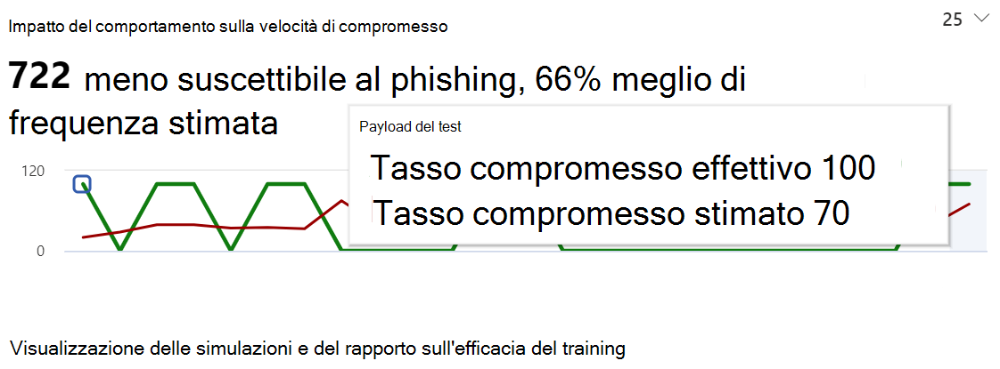
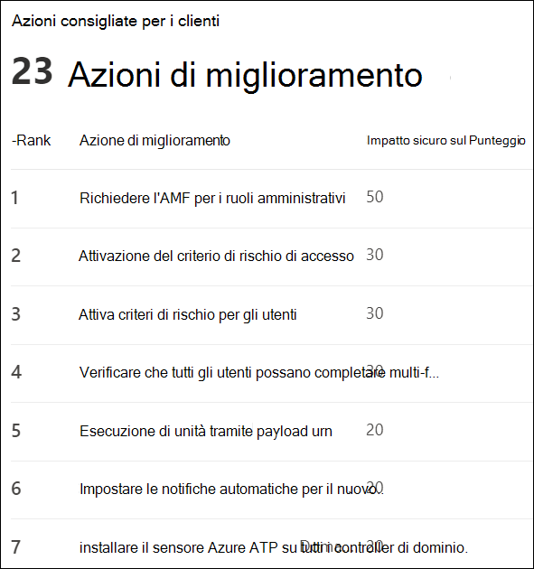

# Acquisire informazioni approfondite attraverso la formazione del Simulatore di attacchi

All'interno della formazione sulla simulazione degli attacchi, Microsoft fornisce informazioni basate sui risultati delle simulazioni e degli allenamenti che i dipendenti hanno attraversato. Queste informazioni consentono di tenere informati sul progresso della prontezza delle minacce dei dipendenti, nonché di consigliare i passaggi successivi per preparare meglio i dipendenti e l'ambiente per gli attacchi.

[!INCLUDE [Prerelease information](../includes/prerelease.md)]

Stiamo lavorando continuamente per espandere le intuizioni che sono disponibili per l'utente. L'impatto sul comportamento e le azioni consigliate sono attualmente disponibili. Per iniziare, passare a [Attack Simulation Training in Microsoft 365 Security Center](https://security.microsoft.com/attacksimulator?viewid=overview).

## Impatto del comportamento sulla velocità di compromesso

Nella scheda **Panoramica** della formazione sulla simulazione di attacco, è possibile trovare l' **impatto sul comportamento sulla** scheda della velocità di compromesso. Questa scheda illustra come i dipendenti hanno affrontato le simulazioni che sono state eseguiti in contrasto con il **tasso di compromesso previsto**. È possibile utilizzare queste informazioni per monitorare lo stato di avanzamento della preparazione delle minacce dei dipendenti eseguendo più simulazioni sugli stessi gruppi di dipendenti.

Nel grafico è possibile vedere:

- **Tasso di compromesso previsto** che riflette il tasso medio di compromesso per le simulazioni che utilizzano lo stesso tipo di payload tra gli altri tenant di Microsoft 365 che utilizzano la formazione di simulazione di attacco.
- Il **tasso di compromesso effettivo** riflette la percentuale di dipendenti che sono caduti per la simulazione.

Inoltre, `<number> less susceptible to phishing` riflette la differenza tra il numero effettivo di dipendenti compromessi dall'attacco e il tasso di compromesso previsto. Questo numero di dipendenti ha meno probabilità di essere compromesso da attacchi simili in futuro, mentre `<percent%> better than predicted rate` indica la modalità complessiva dei dipendenti in contrasto con il tasso di compromesso previsto.

> [!div class="mx-imgBorder"]
> 

Per visualizzare un report più dettagliato, fare clic su **Visualizza simulazioni e report sull'efficacia del training**. Questo rapporto fornisce le stesse informazioni con un contesto aggiuntivo dalla simulazione stessa (ad esempio, tecnica di simulazione e totale degli utenti mirati).

## Azioni consigliate

Nella scheda [ **simulazioni**](https://security.microsoft.com/attacksimulator?viewid=simulations)Selezionare una simulazione vi consentirà di visualizzare i dettagli della simulazione, in cui è disponibile la sezione **azioni consigliate** .

La sezione azioni consigliate descrive in dettaglio i suggerimenti disponibili in [Microsoft Secure Score](https://docs.microsoft.com/microsoft-365/security/mtp/microsoft-secure-score). Questi suggerimenti si basano sul payload utilizzato nella simulazione e consentono di proteggere i dipendenti e il proprio ambiente. Facendo clic su ogni azione di miglioramento, vengono illustrati i dettagli.

> [!div class="mx-imgBorder"]
> 

## Collegamenti correlati

**Attacco simulatore** [creare una simulazione di attacco di phishing](attack-simulation-training.md) e [creare un payload per la formazione degli utenti](attack-simulation-training-payloads.md)
