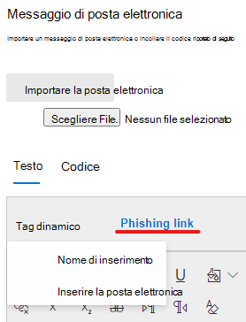

# Creare un payload personalizzato per la formazione del Simulatore di attacchi

Microsoft offre un robusto catalogo di payload per varie tecniche di social engineering per la combinazione con la formazione di simulazione di attacco. Tuttavia, potrebbe essere necessario creare payload personalizzati che funzioneranno meglio per la propria organizzazione. In questo articolo viene descritto come creare un payload nell'esercitazione sulla simulazione di attacco in Microsoft Defender per Office 365.

È possibile creare un payload facendo clic su **Crea un payload** nella [scheda **payload** dedicati](https://security.microsoft.com/attacksimulator?viewid=payload) o nella [procedura guidata](attack-simulation-training.md#selecting-a-payload)per la creazione di una simulazione.

Il primo passaggio della procedura guidata consentirà di selezionare un tipo di payload. **Attualmente, solo la posta elettronica è disponibile**.

Successivamente, selezionare una tecnica associata. Per ulteriori informazioni, vedere tecniche per [la scelta di una tecnica di social engineering](attack-simulation-training.md#selecting-a-social-engineering-technique).

Nel passaggio successivo denominare il payload. Facoltativamente, è possibile assegnargli una descrizione.

## Configurare il payload

Ora è il momento di creare il payload. Inserire il nome del mittente, l'indirizzo di posta elettronica e l'oggetto del messaggio di posta elettronica nella sezione dei **Dettagli del mittente** . Selezionare un URL di phishing dall'elenco specificato. Questo URL verrà incorporato in un secondo momento nel corpo del messaggio.

> [!TIP]
> È possibile scegliere un messaggio di posta elettronica interno per il mittente del payload, che consentirà di visualizzare il payload come proveniente da un altro dipendente della società. Ciò aumenterà la suscettibilità al payload e contribuirà a istruire i dipendenti sul rischio di minacce interne.

Un editor di testo RTF è disponibile per creare il payload. È inoltre possibile importare un messaggio di posta elettronica creato in precedenza. Quando si crea il corpo del messaggio di posta elettronica, utilizzare i **tag dinamici** per personalizzare il messaggio di posta elettronica per i destinatari. Fare clic su **collegamento di phishing** per aggiungere l'URL di phishing precedentemente selezionato nel corpo del messaggio.

> [!TIP]
> Per risparmiare tempo, attiva l'opzione per **sostituire tutti i collegamenti del messaggio di posta elettronica con il collegamento di phishing**.

Dopo aver completato la creazione del payload a proprio piacimento, fare clic su **Avanti**.

## Aggiunta di indicatori

Gli indicatori consentiranno ai dipendenti che passano attraverso la simulazione di attacco di comprendere l'indizio che possono cercare negli attacchi futuri. Per iniziare, fare clic su **Aggiungi indicatore**.

Selezionare un indicatore che si desidera utilizzare nell'elenco a discesa. Questo elenco è curato per contenere gli indizi più comuni che compaiono nei messaggi di posta elettronica di phishing. Dopo aver selezionato, verificare che la posizione dell'indicatore sia impostata sul **corpo del messaggio di posta elettronica** e fare clic su **Seleziona testo**. Evidenziare la parte del payload in cui viene visualizzato l'indicatore e fare clic su **Seleziona**.

Aggiungere una descrizione personalizzata per descrivere l'indicatore e fare clic all'interno della cornice di anteprima dell'indicatore per visualizzare un'anteprima dell'indicatore. Una volta fatto, fare clic su **Aggiungi**. Ripetere questi passaggi finché non sono stati descritti tutti gli indicatori nel payload.

## Verifica payload

La creazione del payload è stata completata. Ora è il momento di esaminare i dettagli e visualizzare un'anteprima del payload. L'anteprima includerà tutti gli indicatori che sono stati creati. È possibile modificare ogni parte del payload da questo passaggio. Una volta soddisfatti, è possibile **inviare** il payload.

> [!IMPORTANT]
> I payload creati avranno **tenant** come origine. Quando si seleziona payload, assicurarsi di non escludere il **tenant**.

## Collegamenti correlati

[Introduzione alla formazione sull’uso di Simulatore di attacchi](attack-simulation-training-get-started.md)

[Creare una simulazione di attacco di phishing](attack-simulation-training.md)

[Acquisire informazioni approfondite attraverso la formazione del Simulatore di attacchi](attack-simulation-training-insights.md)
