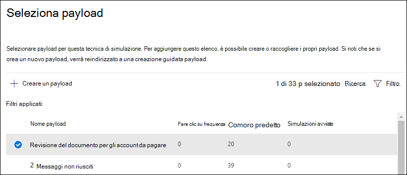
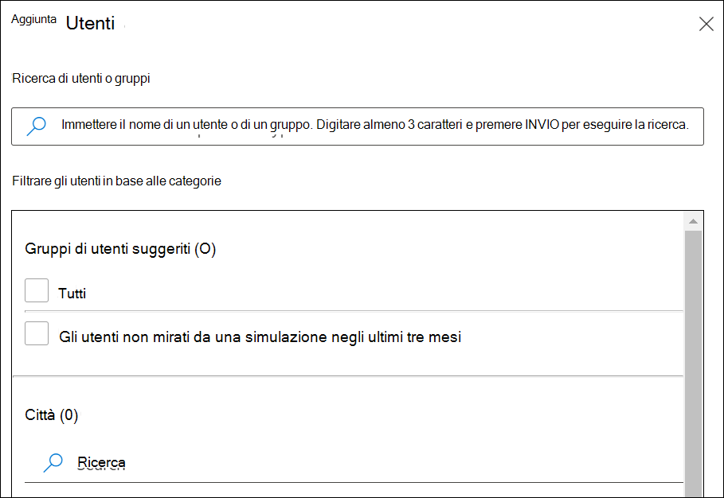
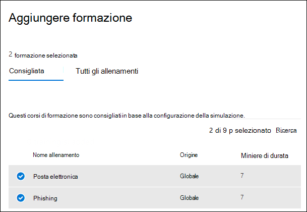

# Simulare un attacco di phishingSimulate a phishing attack

La formazione di simulazione di attacco in Microsoft Defender per Office 365 consente di eseguire simulazioni di cyberattack benigne nell'organizzazione per testare i criteri e le procedure di sicurezza, nonché formare i dipendenti per aumentare la loro consapevolezza e diminuirne la suscettibilità agli attacchi.Attack simulation training in Microsoft Defender for Office 365 lets you run benign cyberattack simulations on your organization to test your security policies and practices, as well as train your employees to increase their awareness and decrease their susceptibility to attacks. In questo articolo viene illustrata la creazione di un attacco di phishing simulato utilizzando la formazione di simulazione di attacco.This article walks you through creating  a simulated phishing attack using attack simulation training.

Per informazioni introduttive sulla formazione sulla simulazione degli attacchi, vedere [Introduzione all'esercitazione sulla simulazione](attack-simulation-training-get-started.md)di attacco.For getting started information about Attack simulation training, see [Get started using Attack simulation training](attack-simulation-training-get-started.md).

Per avviare un attacco di phishing simulato, aprire il [Centro sicurezza Microsoft 365](https://security.microsoft.com/), passare a **&** \> la formazione sulla **simulazione** di collaborazione e passare alla scheda [**simulazioni**](https://security.microsoft.com/attacksimulator?viewid=simulations) .To launch a simulated phishing attack, open the [Microsoft 365 security center](https://security.microsoft.com/), go to **Email & collaboration** \> **Attack simulation training**, and switch to the [**Simulations**](https://security.microsoft.com/attacksimulator?viewid=simulations) tab.

In **simulazioni**, selezionare **+ Avvia una simulazione**.Under **Simulations**, select **+ Launch a simulation**.

> [!NOTE]
> Durante la creazione di una simulazione, è possibile salvare e chiudere per continuare a configurare la simulazione in un secondo momento.At any point during simulation creation, you can save and close to continue configuring the simulation at a later time.

## Selezione di una tecnica di social engineeringSelecting a social engineering technique

Scegliere tra 4 diverse tecniche, a cura del [&CK® Framework](https://attack.mitre.org/techniques/enterprise/).Select from 4 different techniques, curated from the [MITRE ATT&CK® framework](https://attack.mitre.org/techniques/enterprise/). Sono disponibili diversi payload per tecniche diverse:Different payloads are available for different techniques:

- **Raccolta** di credenziali tentativi di raccolta delle credenziali tramite l'accesso degli utenti a un sito Web di ricerca noto con caselle di input per inviare un nome utente e una password.**Credential harvest** attempts to collect credentials by taking users to a well-known looking website with input boxes to submit a username and password.
- L' **allegato di malware** aggiunge un allegato dannoso a un messaggio.**Malware attachment** adds a malicious attachment to a message. Quando l'utente apre l'allegato, viene eseguito codice arbitrario che consentirà all'aggressore di compromettere il dispositivo di destinazione.When the user opens the attachment, arbitrary code is run that will help the attacker compromise the target's device.
- **Link in Attachment** è un tipo di raccolta di credenziali ibrido.**Link in attachment** is a type of credential harvest hybrid. Un utente malintenzionato inserisce un URL in un allegato di posta elettronica.An attacker inserts a URL into an email attachment. L'URL all'interno dell'allegato segue la stessa tecnica del raccolto di credenziali.The URL within the attachment follows the same technique as credential harvest.
- Il **collegamento a malware** eseguirà un codice arbitrario proveniente da un file ospitato in un servizio di condivisione file conosciuto.**Link to malware** will run some arbitrary code from a file hosted on a well-known file sharing service. Il messaggio inviato all'utente conterrà un collegamento a questo file dannoso.The message sent to the user will contain a link to this malicious file. Aprire il file e aiutare l'aggressore a compromettere il dispositivo di destinazione.Opening the file and help the attacker compromise the target's device.

> [!TIP]
> Se si fa clic su **Visualizza dettagli** all'interno della descrizione di ogni tecnica, vengono visualizzate ulteriori informazioni e i passaggi di simulazione per la tecnica.Clicking on **View details** within the description of each technique will display further information and the simulation steps for the technique.
>
> 

Dopo aver selezionato la tecnica e fare clic su **Avanti**, assegnare un nome alla simulazione e, facoltativamente, una descrizione.After you've selected the technique and clicked on **Next**, give your simulation a name and optionally a description.

## Selezione di un payloadSelecting a payload

Successivamente, è necessario selezionare un payload dal catalogo payload preesistente.Next, you'll need to either select a payload from the pre-existing payload catalog.

I payload dispongono di una serie di punti dati che consentono di scegliere:Payloads have a number of data points to help you choose:

- **Fare clic su rate** count quante persone hanno fatto clic su questo payload.**Click rate** counts how many people clicked this payload.
- Il **tasso di compromesso previsto** prevede la percentuale di persone che verranno compromesse da questo payload in base ai dati cronologici per il payload tra Microsoft Defender per i clienti di Office 365.**Predicted compromise rate** predicts the percentage of people that will get compromised by this payload based on historical data for the payload across Microsoft Defender for Office 365 customers.
- **Simulazioni avviate** calcola il numero di volte in cui questo payload è stato utilizzato in altre simulazioni.**Simulations launched** counts the number of times this payload was used in other simulations.
- La **complessità**, disponibile tramite **filtri**, viene calcolata in base al numero di indicatori all'interno del payload a cui sono assegnati indizi su un attacco.**Complexity**, available through **filters**, is calculated based on the number of indicators within the payload that clue targets in on it being an attack. Altri indicatori conducono a una complessità inferiore.More indicators lead to lower complexity.
- L' **origine**, disponibile tramite **filtri**, indica se il payload è stato creato nel tenant o è parte del catalogo di payload preesistente di Microsoft (globale).**Source**, available through **filters**, indicates whether the payload was created on your tenant or is a part of Microsoft's pre-existing payload catalog (global).

Selezionare un payload dall'elenco per visualizzare un'anteprima del payload con ulteriori informazioni su di esso.Select a payload from the list to see a preview of the payload with additional information about it.

Se si desidera creare un payload personalizzato, leggere [creare un payload per la formazione di simulazione di attacco](attack-simulation-training-payloads.md).If you'd like to create your own payload, read [create a payload for attack simulation training](attack-simulation-training-payloads.md).

## Gruppi di destinatariAudience targeting

Ora è il momento di selezionare il gruppo di destinatari della simulazione.Now it's time to select this simulation's audience. È possibile scegliere di **includere tutti gli utenti nell'organizzazione** o **includere solo utenti e gruppi specifici**.You can choose to **include all users in your organization** or **include only specific users and groups**.

Quando si sceglie di **includere solo utenti e gruppi specifici,** è possibile eseguire le operazioni seguenti:When you choose to **include only specific users and groups** you can either:

- **Aggiungere gli utenti**, che consentono di sfruttare la ricerca del tenant, nonché le funzionalità di ricerca e filtraggio avanzate, come il targeting degli utenti che non sono stati presi di mira da una simulazione negli ultimi 3 mesi.**Add users**, which allows you to leverage search for your tenant, as well as advanced search and filtering capabilities, like targeting users who haven't been targeted by a simulation in the last 3 months.
  
- L' **importazione da CSV** consente di importare un insieme predefinito di utenti per questa simulazione.**Import from CSV** allows you to import a predefined set of users for this simulation.

## Assegnazione della formazioneAssigning training

Si consiglia di assegnare corsi di formazione per ogni simulazione, in quanto i dipendenti che passano la formazione sono meno suscettibili di attacchi simili.We recommend that you assign training for each simulation, as employees who go through training are less susceptible to similar attacks.

È possibile scegliere di avere un training assegnato per l'utente oppure selezionare manualmente i corsi di formazione e i moduli.You can either choose to have training assigned for you or select training courses and modules yourself.

Selezionare la **Data di scadenza della formazione** per assicurarsi che i dipendenti completino la propria formazione in modo tempestivo.Select the **training due date** to make sure employees finish their training in a timely manner.

> [!NOTE]
> Se si sceglie di selezionare manualmente corsi e moduli, sarà comunque possibile visualizzare il contenuto consigliato, nonché tutti i corsi e i moduli disponibili.If you choose to select courses and modules yourself, you'll still be able to see the recommended content as well as all available courses and modules.
>
> 

Nei passaggi successivi è necessario **aggiungere corsi di formazione** se si è scelto di selezionarlo personalmente e personalizzare la pagina di destinazione per l'addestramento.In the next steps you'll need to **Add trainings** if you opted to select it yourself, and customize your training landing page. È possibile visualizzare in anteprima la pagina di destinazione della formazione, nonché modificare l'intestazione e il corpo di esso.You'll be able to preview the training landing page, as well as change the header and body of it.

## Dettagli di avvio e RevisioneLaunch details and review

Ora che tutto è configurato, è possibile avviare questa simulazione immediatamente o pianificarla per una data successiva.Now that everything is configured, you can launch this simulation immediately or schedule it for a later date. Sarà inoltre necessario scegliere quando terminare la simulazione.You will also need to choose when to end this simulation. L'interazione con questa simulazione verrà interrotta dopo l'intervallo di tempo selezionato.We will stop capturing interaction with this simulation past the selected time.

**Abilitare il recapito di TimeZone** a livello di area per fornire messaggi di attacco simulati ai dipendenti durante le ore lavorative in base alla propria area geografica.**Enable region aware timezone delivery** to deliver simulated attack messages to your employees during their working hours based on their region.

Al termine, fare clic su **Avanti** e rivedere i dettagli della simulazione.Once you're done, click on **Next** and review the details of your simulation. Fare clic su **modifica** su una qualsiasi delle parti per tornare indietro e modificare eventuali dettagli che devono essere modificati.Click on **Edit** on any of the parts to go back and change any details that need changing. Una volta fatto, fare clic su **Invia**.Once done, click **Submit**.
