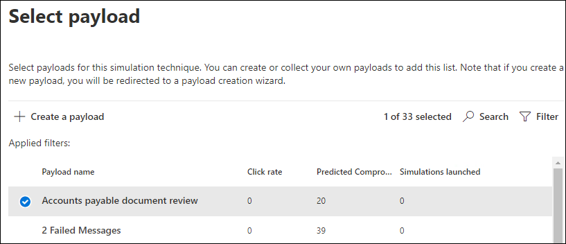

# Simulare un attacco di phishing

La formazione sulla simulazione di attacchi in Microsoft Defender per Office 365 ti consente di eseguire simulazioni di attacchi informatici benigni nell'organizzazione per testare i criteri e le procedure di sicurezza, oltre a formare i dipendenti per aumentare la consapevolezza e ridurre la loro suscettibilità agli attacchi. In questo articolo viene illustrata la creazione di un attacco di phishing simulato tramite la formazione di simulazione degli attacchi.

Per informazioni introduttive sulla formazione sulla simulazione di attacco, vedere Introduzione all'uso della formazione [sulla simulazione di attacco.](attack-simulation-training-get-started.md)

Per avviare un attacco di phishing simulato, aprire il Centro sicurezza [Microsoft 365,](https://security.microsoft.com/)passare **a** Formazione sulla simulazione di attacco & collaborazione e passare alla scheda \> Simulazioni. 

In **Simulazioni** selezionare **+ Avvia una simulazione.**

> [!NOTE]
> In qualsiasi momento durante la creazione della simulazione, è possibile salvare e chiudere per continuare a configurare la simulazione in un secondo momento.

## Selezione di una tecnica di social engineering

Scegli tra 4 tecniche diverse, a cura del [framework MITRE ATT&CK®](https://attack.mitre.org/techniques/enterprise/). Sono disponibili payload diversi per tecniche diverse:

- **La raccolta delle** credenziali tenta di raccogliere le credenziali portando gli utenti in un sito Web dall'aspetto noto con caselle di input per inviare un nome utente e una password.
- **L'allegato** malware aggiunge un allegato dannoso a un messaggio. Quando l'utente apre l'allegato, viene eseguito codice arbitrario che aiuterà l'utente malintenzionato a compromettere il dispositivo di destinazione.
- **Il collegamento nell'allegato** è un tipo di ibrido di raccolta delle credenziali. Un utente malintenzionato inserisce un URL in un allegato di posta elettronica. L'URL all'interno dell'allegato segue la stessa tecnica del raccolto delle credenziali.
- **Il collegamento al malware** eseguirà codice arbitrario da un file ospitato in un noto servizio di condivisione file. Il messaggio inviato all'utente conterrà un collegamento a questo file dannoso. Aprire il file e aiutare l'autore dell'attacco a compromettere il dispositivo di destinazione.
- **L'URL drive-by** è il punto in cui l'URL dannoso nel messaggio porta l'utente a un sito Web dall'aspetto familiare che viene eseguito in modo invisibile all'utente e/o installa codice nel dispositivo dell'utente.

> [!TIP]
> Facendo clic **su Visualizza dettagli** all'interno della descrizione di ogni tecnica verranno visualizzate ulteriori informazioni e i passaggi di simulazione per la tecnica.
>
> 

Dopo aver selezionato la tecnica e aver fatto clic su **Avanti,** assegna alla simulazione un nome e facoltativamente una descrizione.

## Selezione di un payload

Successivamente, dovrai selezionare un payload dal catalogo di payload preesiste.

I payload hanno una serie di punti dati per aiutarti a scegliere:

- **La frequenza** dei clic conta il numero di persone che hanno fatto clic su questo payload.
- **La percentuale di compromissione** stimata prevede la percentuale di persone compromesse da questo payload in base ai dati cronologici per il payload in Microsoft Defender per i Office 365 clienti.
- **Le simulazioni avviate** conteggia il numero di volte in cui questo payload è stato usato in altre simulazioni.
- **La complessità,** disponibile tramite **filtri,** viene calcolata in base al numero di indicatori all'interno del payload che consentono di descrizione degli obiettivi di un attacco. Più indicatori portano a una minore complessità.
- **Source**, disponibile tramite **filtri**, indica se il payload è stato creato nel tenant o fa parte del catalogo payload preesistevo di Microsoft (globale).

Seleziona un payload dall'elenco per visualizzare un'anteprima del payload con ulteriori informazioni su di esso.

Se vuoi creare un payload personalizzato, leggi creare un payload per il [training della simulazione di attacco.](attack-simulation-training-payloads.md)

## Gruppi di destinatari

Ora è il momento di selezionare il gruppo di destinatari di questa simulazione. È possibile scegliere di **includere tutti gli utenti nell'organizzazione** o includere solo utenti e gruppi **specifici.**

Quando si sceglie di **includere solo utenti e gruppi** specifici, è possibile:

- **Aggiungere utenti**, che consente di sfruttare la ricerca per il tenant, nonché funzionalità avanzate di ricerca e filtro, ad esempio la destinazione degli utenti che non sono stati presi di mira da una simulazione negli ultimi 3 mesi.
  
- **L'importazione da CSV** consente di importare un set predefinito di utenti per questa simulazione.

## Assegnazione di corsi di formazione

Ti consigliamo di assegnare una formazione per ogni simulazione, poiché i dipendenti che passano attraverso la formazione sono meno soggetti ad attacchi simili.

È possibile scegliere se assegnare la formazione oppure selezionare i corsi e i moduli di formazione manualmente.

Selezionare la **data di scadenza della formazione** per assicurarsi che i dipendenti finiscano la formazione in modo corretto.

> [!NOTE]
> Se si sceglie di selezionare i corsi e i moduli manualmente, sarà comunque possibile visualizzare il contenuto consigliato, nonché tutti i corsi e i moduli disponibili.
>
> 

Nei passaggi successivi dovrai  aggiungere corsi di formazione se hai scelto di selezionarlo manualmente e personalizzare la pagina di destinazione della formazione. Potrai visualizzare in anteprima la pagina di destinazione del training, nonché modificare l'intestazione e il corpo della pagina.

## Dettagli di avvio e revisione

Ora che tutto è configurato, puoi avviare questa simulazione immediatamente o pianificarla per una data successiva. Dovrai anche scegliere quando terminare questa simulazione. L'acquisizione dell'interazione con questa simulazione verrà interrotta dopo l'ora selezionata.

**Abilitare il recapito del fuso orario** in grado di riconoscere l'area geografica per recapitare messaggi di attacco simulati ai dipendenti durante l'orario di lavoro in base all'area geografica.

Al termine, fare clic su **Avanti** ed esaminare i dettagli della simulazione. Fare clic **su** Modifica in una delle parti per tornare indietro e modificare i dettagli che devono essere modificati. Al termine, fare clic su **Invia.**
