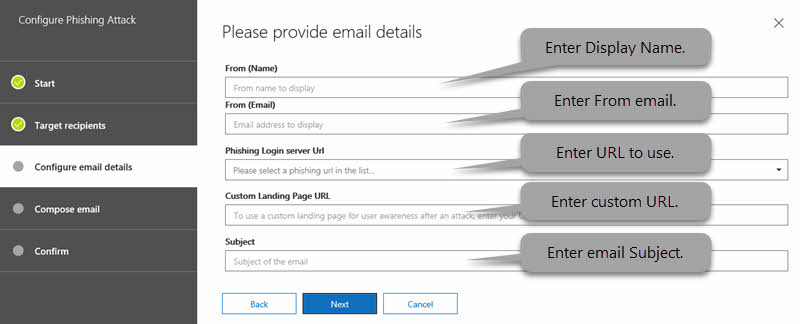

# Simulatore di attacchi in Office 365Attack Simulator in Office 365

**Riepilogo** Se si è un amministratore globale di Office 365 o un amministratore della sicurezza e l'organizzazione dispone di Office 365 Advanced Threat Protection Plan 2, che include le [funzionalità di analisi e di risposta alle minacce](office-365-ti.md), è possibile utilizzare Attack Simulator per eseguire scenari di attacco realistici nell'organizzazione.**Summary** If you are an Office 365 global administrator or a security administrator and your organization has Office 365 Advanced Threat Protection Plan 2, which includes [Threat Investigation and Response capabilities](office-365-ti.md), you can use Attack Simulator to run realistic attack scenarios in your organization. Questo può essere utile per identificare e individuare gli utenti vulnerabili prima che un attacco reale impatti la linea di base.This can help you identify and find vulnerable users before a real attack impacts your bottom line. Leggere questo articolo per ulteriori informazioni.Read this article to learn more.

## Gli attacchiThe Attacks

Sono attualmente disponibili tre tipi di simulazioni di attacco:Three kinds of attack simulations are currently available:

- [Spear Harvest Credential-attacco di phishingCredential harvest spear-phishing attack](#credential-harvest-spear-phishing-attack)

- [Attacco Spear-phishing AttackAttachment spear-phishing attack](#attachment-spear-phishing-attack)

- [Attacco spray per la passwordPassword-spray attack](#password-spray-attack)

- [Attacco per la password con forza brutaBrute-force password attack](#brute-force-password-attack)

Affinché l'avvio di un attacco venga eseguito correttamente, verificare che l'account utilizzato per eseguire gli attacchi simulati utilizzi l'autenticazione a più fattori.For an attack to be successfully launched, make sure that the account you are using to run simulated attacks is using multi-factor authentication. Inoltre, è necessario essere un amministratore globale di Office 365 o un amministratore della sicurezza.In addition, you must be an Office 365 global administrator or a security administrator. Per ulteriori informazioni sui ruoli e le autorizzazioni, vedere [Permissions in the Office 365 Security & Compliance Center](permissions-in-the-security-and-compliance-center.md).(To learn more about roles and permissions, see [Permissions in the Office 365 Security & Compliance Center](permissions-in-the-security-and-compliance-center.md).)

Per accedere a simulatore di attacco, &amp; nel centro sicurezza e conformità scegliere **Threat Management** \> **Attack Simulator**.To access Attack Simulator, in the Security &amp; Compliance Center, choose **Threat management** \> **Attack simulator**.

## Prima di iniziare...Before you begin...

Assicurarsi che l'utente e l'organizzazione soddisfino i seguenti requisiti per il simulatore di attacco:Make sure that you and your organization meet the following requirements for Attack Simulator:

- La posta elettronica dell'organizzazione è ospitata in Exchange Online.Your organization's email is hosted in Exchange Online. (Attack Simulator non è disponibile per i server di posta elettronica locali.)(Attack Simulator is not available for on-premises email servers.)

- Si è un amministratore globale o un amministratore di sicurezza di Office 365You are an Office 365 global administrator or security administrator

- Le campagne di phishing raccolgono ed elaborano gli eventi per un periodo di 30 giorni, i dati della campagna cronologica saranno disponibili fino a 90 giorni dopo l'avvio della campagna.Phishing campaigns will collect and process events for a period of 30 days, historical campaign data will be available for up to 90 days after the campaign is launched.

- L'autenticazione a più fattori e l' [accesso condizionale](https://docs.microsoft.com/office365/admin/security-and-compliance/set-up-multi-factor-authentication) sono attivati, almeno per l'account di amministratore globale di Office 365 e gli amministratori della sicurezza che utilizzeranno simulatore di attacco.[Multi-factor authentication/Conditional Access](https://docs.microsoft.com/office365/admin/security-and-compliance/set-up-multi-factor-authentication) is turned on, for at least the Office 365 global administrator account and security administrators who will be using Attack Simulator. (Idealmente, l'autenticazione a più fattori e l'accesso condizionale sono attivati per tutti gli utenti dell'organizzazione.)(Ideally, multi-factor authentication/conditional access is turned on for all users in your organization.)

- L'organizzazione dispone [di Office 365 Advanced Threat Protection Plan 2](office-365-atp.md), con simulatore di attacco visibile &amp; nel centro sicurezza e conformità (andare a **Threat Management** \> **Attack Simulator**)Your organization has [Office 365 Advanced Threat Protection Plan 2](office-365-atp.md), with Attack Simulator visible in the Security &amp; Compliance Center (go to **Threat management** \> **Attack simulator**)

    

## Spear Harvest Credential-attacco di phishingCredential harvest spear-phishing attack

Il phishing è un termine generico per una vasta serie di attacchi classificati come un attacco stile di social engineering.Phishing is a generic term for a broad suite of attacks classed as a social engineering style attack. Questo attacco è concentrato sul phishing Spear, un attacco più mirato che si rivolge a un gruppo specifico di persone o di un'organizzazione.This attack is focused on spear phishing, a more targeted attack that is aimed at a specific group of individuals or an organization. In genere, un attacco personalizzato con alcuni ricognizione eseguito e utilizzando un nome visualizzato che genererà la fiducia nel destinatario, ad esempio un messaggio di posta elettronica che sembra provenire da un dirigente all'interno dell'organizzazione.Typically, a customized attack with some reconnaissance performed and using a display name that will generate trust in the recipient, such as an email message that looks like it came from an executive within your organization.

Questo attacco è incentrato sull'eventualità di modificare il messaggio a cui sembra abbia avuto origine cambiando il nome visualizzato e l'indirizzo di origine.This attack focuses on letting you manipulate who the message appears to have originated from by changing the display name and source address. Quando gli attacchi Spear-phishing hanno esito positivo, cyberattackers accedere alle credenziali degli utenti.When spear-phishing attacks are successful, cyberattackers gain access to users' credentials.

### Per simulare un attacco di Spear-phishingTo simulate a spear-phishing attack

È possibile creare l'editor HTML RTF direttamente nel campo **corpo del messaggio di posta elettronica** o collaborare con l'origine HTML.You can craft the rich HTML editor directly in the **Email body** field itself or work with HTML source.

1. Nel [Centro sicurezza &amp; e conformità](https://protection.office.com)scegliere **Threat Management** \> **Attack Simulator**.In the [Security &amp; Compliance Center](https://protection.office.com), choose **Threat management** \> **Attack simulator**.

2. Specificare un nome di campagna significativo per l'attacco o selezionare un modello.Specify a meaningful campaign name for the attack or select a template.

   

3. Specificare i destinatari di destinazione.Specify the target recipients. Può trattarsi di singoli o gruppi nell'organizzazione.This can be individuals or groups in your organization. Ogni destinatario di destinazione deve disporre di una cassetta postale di Exchange online in modo che l'attacco abbia esito positivo.Each targeted recipient must have an Exchange Online Mailbox in order for the attack to be successful.

   

4. Configurare i dettagli di posta elettronica di phishing.Configure the Phishing email details.

   

   La formattazione HTML può essere complessa o di base come necessario per la campagna.The HTML formatting can be as complex or basic as your campaign needs. Poiché il formato del messaggio di posta elettronica è HTML, è possibile inserire immagini e testo per migliorare la credibilità.As the email format is HTML, you can insert images and text to enhance believability. È possibile controllare l'aspetto del messaggio ricevuto nel client di posta elettronica di ricezione.You have control on what the received message will look like in the receiving email client.

5. Specificare il testo per il campo **from (Name)** .Specify text for the **From (Name)** field. Si tratta del campo che viene visualizzato nel **nome visualizzato** nel client di posta elettronica di ricezione.This is the field that shows in the **Display Name** in the receiving email client.

6. Specificare il testo o il campo **da** .Specify text or the **From** field. Si tratta del campo che viene visualizzato come indirizzo di posta elettronica del mittente nel client di posta elettronica di ricezione.This is the field that shows as the email address of the sender in the receiving email client.

   È possibile immettere uno spazio dei nomi di posta elettronica esistente all'interno dell'organizzazione (in questo modo l'indirizzo di posta elettronica viene effettivamente risolto nel client di ricezione, facilitando un modello di attendibilità molto elevato) oppure è possibile immettere un indirizzo di posta elettronica esterno.You can enter an existing email namespace within your organization (doing this will make the email address actually resolve in the receiving client, facilitating a very high trust model), or you can enter an external email address. L'indirizzo di posta elettronica specificato non deve esistere effettivamente, ma è necessario seguire il formato di un indirizzo SMTP valido, ad esempio `user@domainname.extension`.The email address that you specify does not have to actually exist, but it does need to follow the format of a valid SMTP address, such as `user@domainname.extension`.

7. Usando il selettore a discesa, selezionare un URL del server di accesso di phishing che rispecchi il tipo di contenuto che si avrà all'interno dell'attacco.Using the drop-down selector, select a Phishing Login server URL that reflects the type of content you will have within your attack. È possibile scegliere tra diversi URL a tema, ad esempio recapito dei documenti, tecnico, retribuzione e così via. Questo è effettivamente l'URL a cui gli utenti designati devono fare clic.Several themed URLs are provided for you to choose from, such as document delivery, technical, payroll etc. This is effectively the URL that targeted users are asked to click.

8. Specificare un URL della pagina di destinazione personalizzata.Specify a custom landing page URL. In questo modo gli utenti verranno reindirizzati a un URL specificato al termine di un attacco con esito positivo.Using this will redirect users to a URL you specify at the end of a successful attack. Se si dispone di un training di sensibilizzazione interno, ad esempio, è possibile specificarlo qui.If you have internal awareness training, for example, you can specify that here.

9. Specificare il testo per il campo **Subject** .Specify text for the **Subject** field. Si tratta del campo che viene visualizzato come **nome del soggetto** nel client di posta elettronica di ricezione.This is the field that shows as the **Subject Name** in the receiving email client.

10. Comporre il **corpo del messaggio di posta elettronica** che riceverà il destinatario.Compose the **Email body** that the target will receive.

    `${username}`inserisce il nome della destinazione nel corpo della posta elettronica.`${username}` inserts the targets name into the Email body.

    `${loginserverurl}`inserisce l'URL in cui si desidera che gli utenti di destinazione clicchino`${loginserverurl}` inserts the URL we want target users to click

11. Fare clic su **Avanti,** quindi su **fine** per avviare l'attacco.Choose **Next,** then **Finish** to launch the attack. Il messaggio di posta elettronica di phishing Spear viene recapitato alle cassette postali dei destinatari.The spear phishing email message is delivered to your target recipients' mailboxes.

## Attacco Spear-phishing AttackAttachment spear-phishing attack

Il phishing è un termine generico per una vasta serie di attacchi classificati come un attacco stile di social engineering.Phishing is a generic term for a broad suite of attacks classed as a social engineering style attack. Questo attacco è concentrato sull'Attachment Spear phishing, un attacco più mirato che si rivolge a un gruppo specifico di persone o di un'organizzazione.This attack is focused on attachment spear phishing, a more targeted attack that is aimed at a specific group of individuals or an organization. In genere, un attacco personalizzato con alcuni ricognizione eseguito e utilizzando un nome visualizzato che genererà la fiducia nel destinatario, ad esempio un messaggio di posta elettronica che sembra provenire da un dirigente all'interno dell'organizzazione.Typically, a customized attack with some reconnaissance performed and using a display name that will generate trust in the recipient, such as an email message that looks like it came from an executive within your organization.

Questo attacco si concentra sull'eventualità di modificare il messaggio a cui sembra abbia avuto origine cambiando il nome visualizzato e l'indirizzo di origine, ma stavolta anziché offrire un URL per provare a attirare l'utente finale in modo da fare clic su, offriamo un allegato che si sta tentando di ottenere t utente finale da aprire.This attack focuses on letting you manipulate who the message appears to have originated from by changing the display name and source address, but this time as opposed to offering a URL to try and lure the end user to click, we offer an attachment that we are trying to get the end user to open. 

### Per simulare un attacco Spear-phishing AttachmentTo simulate a Attachment spear-phishing attack

1. Seguire la procedura dall'alto, facendo clic sull' **attacco degli allegati** nella pagina di destinazione.Follow the steps from above, having this time clicked on **Attachment Attack** on the landing page.

2. Man mano che si procede attraverso la procedura guidata, vengono visualizzate due opzioni da configurare.As you progress through the wizard, you see two options to configure. Il **tipo di allegato**supporta due tipi di allegati, con **estensione docx** o **PDF**.The **Attachment Type**, we support two attachment types, **.docx** or **.pdf**. **Nome allegato**, utilizzare questo campo per creare un nome di allegato significativo per la campagna.The **Attachment Name**, use this field to create a meaningful attachment name for the campaign.

## Attacco spray per la passwordPassword-spray attack

Un attacco di spruzzatura della password in un'organizzazione viene in genere utilizzato dopo che un attore cattivo ha acquisito un elenco di utenti validi dal tenant.A password spray attack against an organization is typically used after a bad actor has successfully acquired a list of valid users from the tenant. L'attore cattivo conosce le password comuni utilizzate dalle persone.The bad actor knows about common passwords that people use. Si tratta di un attacco ampiamente utilizzato, poiché si tratta di un attacco a basso costo da eseguire e più difficile da rilevare rispetto alla forza bruta.This is a widely used attack, as it is a cheap attack to run, and harder to detect than brute force approaches.

Questo attacco consente di specificare una password comune rispetto a una base di utenti di grandi dimensioni.This attack focuses on letting you specify a common password against a large target base of users.

**Nota importante** l'esecuzione dell'attacco di spruzzatura della password sugli account utente finali che dispongono già dell'autenticazione a più fattori comporta un tentativo infruttuoso di tali account nella creazione di report.**Important Note** running the password spray attack against end user accounts that already have multi-factor authentication, will result in a unsuccessful attempt for those accounts in the reporting. Ciò è dovuto al fatto che l'autenticazione a più fattori è uno dei principali mechanims per contribuire alla protezione contro gli attacchi spray tramite password, pertanto è previsto.This is due to multi-factor authentication being one of the primary mechanims to help protect against password spray attacks, so is expected.

### Per simulare un attacco spray per la passwordTo simulate a password-spray attack

1. Nel [Centro sicurezza &amp; e conformità](https://protection.office.com)scegliere **Threat Management** \> **Attack Simulator**.In the [Security &amp; Compliance Center](https://protection.office.com), choose **Threat management** \> **Attack simulator**.

2. Specificare il nome di una campagna significativa per l'attacco.Specify a meaningful campaign name for the attack.

3. Specificare i destinatari di destinazione.Specify the target recipients. Può trattarsi di singoli o gruppi nell'organizzazione.This can be individuals or groups in your organization. Un destinatario di destinazione deve disporre di una cassetta postale di Exchange online in modo che l'attacco abbia esito positivo.A targeted recipient must have an Exchange Online mailbox in order for the attack to be successful.

4. Specificare una password da utilizzare per l'attacco.Specify a password to use for the attack. Ad esempio, una password comune e pertinente che è possibile `Summer2019`provare è.For example, one common, relevant password you could try is `Summer2019`. Un altro potrebbe `Fall2019`essere, `Password1`o.Another might be `Fall2019`, or `Password1`.

5. Scegliere **fine** per avviare l'attacco.Choose **Finish** to launch the attack.

## Attacco per la password con forza brutaBrute-force password attack

Un attacco di password con forza bruta nei confronti di un'organizzazione viene in genere utilizzato dopo che un attore non valido ha acquisito un elenco di utenti chiave dal tenant.A brute-force password attack against an organization is typically used after a bad actor has successfully acquired a list of key users from the tenant. Questo attacco si concentra sul tentativo di un set di password su un singolo account utente.This attack focuses on trying a set of passwords on a single user's account.

**Nota importante** l'esecuzione degli attacchi di password Brute per gli account utente finali che dispongono già dell'autenticazione a più fattori comporta un tentativo non riuscito per tali account nella creazione di report.**Important Note** running the brute-force password attacks against end user accounts that already have multi-factor authentication, will result in a unsuccessful attempt for those accounts in the reporting. Ciò è dovuto al fatto che l'autenticazione a più fattori è uno dei principali mechanims per contribuire alla protezione contro gli attacchi di password bruta, pertanto è previsto.This is due to multi-factor authentication being one of the primary mechanims to help protect against brute-force password attacks, so is expected.

### Per simulare un attacco di password con forza brutaTo simulate a brute-force password attack

1. Nel [Centro sicurezza &amp; e conformità](https://protection.office.com)scegliere **Threat Management** \> **Attack Simulator**.In the [Security &amp; Compliance Center](https://protection.office.com), choose **Threat management** \> **Attack simulator**.

2. Specificare il nome di una campagna significativa per l'attacco.Specify a meaningful campaign name for the attack.

3. Specificare il destinatario di destinazione.Specify the target recipient. Un destinatario di destinazione deve disporre di una cassetta postale di Exchange online in modo che l'attacco abbia esito positivo.A targeted recipient must have an Exchange Online mailbox in order for the attack to be successful.

4. Specificare un set di password da utilizzare per l'attacco.Specify a set of passwords to use for the attack. A tale scopo, è possibile utilizzare un file di testo (con estensione txt) per l'elenco delle password.To do this, you can use a text (.txt) file for your list of passwords. Il file di testo non può superare i 10 MB nelle dimensioni dei file.The text file cannot exceed 10 MB in file size. Utilizzare una password per riga e assicurarsi di includere un ritorno a capo dopo l'ultima password dell'elenco.Use one password per line, and make sure to include a hard return after the last password in your list.

5. Scegliere **fine** per avviare l'attacco.Choose **Finish** to launch the attack.

Visitare la Guida di [orientamento di Microsoft 365](https://www.microsoft.com/microsoft-365/roadmap) per vedere cosa c'è in sviluppo, cosa è in uscita e cosa è già stato avviato.Visit the [Microsoft 365 Roadmap](https://www.microsoft.com/microsoft-365/roadmap) to see what's in development, what's rolling out, and what's already launched.

## Vedere ancheSee also

[Descrizione del servizio Office 365 Advanced Threat ProtectionOffice 365 Advanced Threat Protection Service Description](https://docs.microsoft.com/office365/servicedescriptions/office-365-advanced-threat-protection-service-description)

[Office 365 Advanced Threat ProtectionOffice 365 Advanced Threat Protection](office-365-atp.md)
