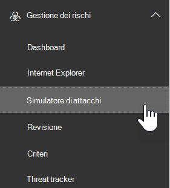

# Simulatore di attacco in ATPAttack Simulator in ATP

**Riepilogo** Se si è un amministratore globale o un amministratore della sicurezza e l'organizzazione dispone di Office 365 Advanced Threat Protection Plan 2, che include le [funzionalità di analisi e di risposta alle minacce](office-365-ti.md), è possibile utilizzare Attack Simulator per eseguire scenari di attacco realistici nell'organizzazione.**Summary** If you are a global administrator or a security administrator and your organization has Office 365 Advanced Threat Protection Plan 2, which includes [Threat Investigation and Response capabilities](office-365-ti.md), you can use Attack Simulator to run realistic attack scenarios in your organization. Ciò può essere utile a identificare e trovare utenti vulnerabili prima che un attacco reale abbia un impatto sui profitti.This can help you identify and find vulnerable users before a real attack impacts your bottom line. Leggere questo articolo per ulteriori informazioni.Read this article to learn more.

## Che cosa è necessario sapere prima di iniziareWhat do you need to know before you begin?

- Per aprire il Centro sicurezza e conformità, passare a <https://protection.office.com/>.To open the Security & Compliance Center, go to <https://protection.office.com/>. Simulatore di attacco è disponibile in **Threat Management** \> **Attack Simulator**.Attack simulator is available at **Threat management** \> **Attack simulator**.

  

- Per ulteriori informazioni sulla disponibilità di simulatori di attacco in diverse sottoscrizioni di Microsoft 365, vedere [Descrizione del servizio Advanced Threat Protection di Office 365](https://docs.microsoft.com/office365/servicedescriptions/office-365-advanced-threat-protection-service-description).For more information about the availability of Attack Simulator across different Microsoft 365 subscriptions, see [Office 365 Advanced Threat Protection service description](https://docs.microsoft.com/office365/servicedescriptions/office-365-advanced-threat-protection-service-description).

- È necessario essere membri dei gruppi di ruoli **Gestione organizzazione** o **amministratore sicurezza** .You need to be a member of the **Organization Management** or **Security Administrator** role groups. Per altre informazioni sui gruppi di ruoli nel Centro sicurezza e conformità, vedere [Autorizzazioni nel Centro sicurezza e conformità](permissions-in-the-security-and-compliance-center.md).For more information about role groups in the Security & Compliance Center, see [Permissions in the Security & Compliance Center](permissions-in-the-security-and-compliance-center.md).

- L'account deve essere configurato per l'autenticazione a più fattori (AMF) per creare e gestire le campagne in Attack Simulator.Your account needs to be configured for multi-factor authentication (MFA) to create and manage campaigns in Attack Simulator. Per istruzioni, vedere [configurare l'autenticazione](https://docs.microsoft.com/microsoft-365/admin/security-and-compliance/set-up-multi-factor-authentication)a più fattori.For instructions, see [Set up multi-factor authentication](https://docs.microsoft.com/microsoft-365/admin/security-and-compliance/set-up-multi-factor-authentication).

Affinché l'avvio di un attacco venga eseguito correttamente, verificare che l'account utilizzato per eseguire gli attacchi simulati utilizzi l'autenticazione a più fattori.For an attack to be successfully launched, make sure that the account you are using to run simulated attacks is using multi-factor authentication. Inoltre, è necessario essere un amministratore globale o un amministratore della sicurezza.In addition, you must be a global administrator or a security administrator. Per ulteriori informazioni sui ruoli e le autorizzazioni, vedere [Permissions in the Security & Compliance Center](permissions-in-the-security-and-compliance-center.md).(To learn more about roles and permissions, see [Permissions in the Security & Compliance Center](permissions-in-the-security-and-compliance-center.md).)

- Le campagne di phishing raccolgono ed elaborano gli eventi per 30 giorni.Phishing campaigns will collect and process events for 30 days. I dati della campagna cronologica saranno disponibili fino a 90 giorni dopo l'avvio della campagna.Historical campaign data will be available for up to 90 days after you launch the campaign.

- Non sono disponibili i cmdlet di PowerShell corrispondenti per il simulatore di attacco.There are no corresponding PowerShell cmdlets for Attack Simulator.

## Campagne di phishing SpearSpear phishing campaigns

Il *phishing* è un termine generico per gli attacchi di posta elettronica che tentano di rubare informazioni sensibili nei messaggi che sembrano provenire da mittenti legittimi o attendibili.*Phishing* is a generic term for email attacks that try to steal sensitive information in messages that appear to be from legitimate or trusted senders. *Spear phishing* è un attacco di phishing mirato che utilizza contenuto molto concentrato e personalizzato appositamente adattato ai destinatari mirati (in genere, dopo la ricognizione dei destinatari da parte dell'utente malintenzionato).*Spear phishing* is a targeted phishing attack that uses very focused and customized content that's specifically tailored to the targeted recipients (typically, after reconnaissance on the recipients by the attacker).

- Si è un amministratore globale o un amministratore della sicurezzaYou are a global administrator or security administrator

In Attack Simulator sono disponibili due diversi tipi di campagne di phishing Spear:In Attack Simulator, two different types of spear phishing campaigns are available:

- L'autenticazione a più fattori e l' [accesso condizionale](https://docs.microsoft.com/microsoft-365/admin/security-and-compliance/set-up-multi-factor-authentication) sono attivati, almeno per l'account di amministratore globale e gli amministratori della sicurezza che utilizzeranno simulatore di attacco.[Multi-factor authentication/Conditional Access](https://docs.microsoft.com/microsoft-365/admin/security-and-compliance/set-up-multi-factor-authentication) is turned on, for at least the global administrator account and security administrators who will be using Attack Simulator. (Idealmente, l'autenticazione a più fattori e l'accesso condizionale sono attivati per tutti gli utenti dell'organizzazione.)(Ideally, multi-factor authentication/conditional access is turned on for all users in your organization.)

  - Una pagina predefinita che spiega questo è stato un semplice test e fornisce suggerimenti per il riconoscimento dei messaggi di phishing.A default page that explains this was a just a test, and gives tips for recognizing phishing messages.

    

  - Una pagina personalizzata (URL) specificata.A custom page (URL) that you specify.

- **Spear phishing (Attachment)**: l'attacco tenta di convincere i destinatari ad aprire un allegato. docx o. pdf nel messaggio.**Spear phishing (attachment)**: The attack tries to convince the recipients to open a .docx or .pdf attachment in the message. L'allegato contiene lo stesso contenuto del collegamento di phishing predefinito, ma la prima frase inizia con " \<Display Name\> , si sta vedendo questo messaggio come un messaggio di posta elettronica recente è stato aperto...".The attachment contains the same content from the default phishing link, but the first sentence starts with "\<Display Name\>, you are seeing this message as a recent email message you opened...".

> [!NOTE]
> Attualmente, le campagne di phishing Spear in Attack Simulator non scadono.Currently, spear phishing campaigns in Attack Simulator don't expire.

### Creare una campagna di phishing di SpearCreate a spear phishing campaign

Una parte importante di qualsiasi campagna di phishing Spear è l'aspetto del messaggio di posta elettronica inviato ai destinatari mirati.An important part of any spear phishing campaign is the look and feel of the email message that's sent to the targeted recipients. Per creare e configurare il messaggio di posta elettronica, sono disponibili le seguenti opzioni:To create and configure the email message, you have these options:

- **Utilizzo di un modello di posta elettronica incorporato**: sono disponibili due modelli incorporati: **Giveaway Prize** and **Payroll Update**.**Use a built-in email template**: Two built-in templates are available: **Prize Giveaway** and **Payroll Update**. È possibile personalizzare ulteriormente alcune, tutte o nessuna delle proprietà di posta elettronica dal modello quando si crea e si avvia la campagna.You can further customize some, all, or none of the email properties from the template when you create and launch the campaign.

- **Creare un modello di posta elettronica riutilizzabile**: dopo aver creato e salvato il modello di posta elettronica, è possibile utilizzarlo nuovamente nelle future campagne di phishing Spear.**Create a reusable email template**: After you create and save the email template, you can use it again in future spear phishing campaigns. È possibile personalizzare ulteriormente alcune, tutte o nessuna delle proprietà di posta elettronica dal modello quando si crea e si avvia la campagna.You can further customize some, all, or none of the email properties from the template when you create and launch the campaign.

- **Creare il messaggio di posta elettronica nella procedura guidata**: è possibile creare il messaggio di posta elettronica direttamente nella procedura guidata quando si crea e si avvia la campagna di phishing Spear.**Create the email message in the wizard**: You can create the email message directly in the wizard as you create and launch the spear phishing campaign.

#### Passaggio 1 (facoltativo): creare un modello di posta elettronica personalizzatoStep 1 (Optional): Create a custom email template

Se si intende utilizzare uno dei modelli incorporati o creare il messaggio di posta elettronica direttamente nella procedura guidata, è possibile ignorare questo passaggio.If you're going to use one of the built-in templates or create the email message directly in the wizard, you can skip this step.

1. Nel centro sicurezza & conformità, accedere a **Threat Management** \> **Attack Simulator**.In the Security & Compliance Center, go to **Threat management** \> **Attack simulator**.

2. Nella pagina **simula attacchi** , nella sezione **spear phishing (credentials Harvest)** o **spear phishing (Attachment)** , fare clic su **Attack Details**.On the **Simulate attacks** page, in either the **Spear Phishing (Credentials Harvest)** or **Spear Phishing (Attachment)** sections, click **Attack Details**.

   Non importa dove creare il modello.It doesn't matter where you create the template. Le opzioni disponibili nel modello sono uguali per entrambi i tipi di attacchi di phishing.The available options in the template are the same for both types of phishing attacks.

3. Nella pagina dei **Dettagli sull'attacco** visualizzata, nella sezione **modelli di phishing** , nell'area **Crea modelli** fare clic su **nuovo modello**.In the **Attack details** page that opens, in the **Phishing Templates** section, in the **Create Templates** area, click **New Template**.

4. La procedura guidata **Configura modello di phishing** viene avviata in un nuovo riquadro a comparsa.The **Configure Phishing Template** wizard starts in a new flyout. Nel passaggio **iniziale** , immettere un nome visualizzato univoco per il modello e quindi fare clic su **Avanti**.In the **Start** step, enter a unique display name for the template, and then click **Next**.

5. Nel passaggio **Configure email details** , configurare le seguenti impostazioni:In the **Configure email details** step, configure the following settings:

   - **From (Name)**: il nome visualizzato utilizzato per il mittente del messaggio.**From (Name)**: The display name that's used for the message sender.

   - **From (posta elettronica)**: l'indirizzo di posta elettronica del mittente.**From (Email)**: The sender's email address.

   - **URL del server di accesso di phishing**: fare clic sul menu a discesa e selezionare uno degli URL disponibili nell'elenco.**Phishing Login Server URL**: Click the drop down and select one of the available URLs from the list. Questo è l'URL a cui gli utenti saranno tentati di fare clic.This is the URL that users will be tempted to click. Le opzioni disponibili sono:The choices are:

     - <http://portal.docdeliveryapp.com>
     - <http://portal.docdeliveryapp.net>
     - <http://portal.docstoreinternal.com>
     - <http://portal.docstoreinternal.net>
     - <http://portal.hardwarecheck.net>
     - <http://portal.hrsupportint.com>
     - <http://portal.payrolltooling.com>
     - <http://portal.payrolltooling.net>
     - <http://portal.prizegiveaway.net>
     - <http://portal.prizesforall.com>
     - <http://portal.salarytoolint.com>
     - <http://portal.salarytoolint.net>

     > [!NOTE]
     > <ul><li>Tutti gli URL sono intenzionalmente http, non HTTPS.All of the URLs are intentionally http, not https.</li><li>Un servizio di reputazione URL potrebbe identificare uno o più di questi URL come non sicuri.A URL reputation service might identify one or more of these URLs as unsafe. Controllare la disponibilità dell'URL nei Web browser supportati prima di utilizzare l'URL in una campagna di phishing.Check the availability of the URL in your supported web browsers before you use the URL in a phishing campaign.</li></ul>

   - **URL della pagina di destinazione personalizzata**: immettere una pagina di destinazione facoltativa in cui gli utenti vengono eseguiti se fanno clic sul collegamento di phishing e immettono le proprie credenziali.**Custom Landing Page URL**: Enter an optional landing page where users are taken if they click the phishing link and enter their credentials. Questo collegamento sostituisce la pagina di destinazione predefinita.This link replaces the default landing page. Ad esempio, se si dispone di un training di sensibilizzazione interno, è possibile specificare l'URL qui.For example, if you have internal awareness training, you can specify that URL here.

   - **Categoria**: attualmente, questa impostazione non viene utilizzata (qualsiasi elemento immesso viene ignorato).**Category**: Currently, this setting isn't used (anything you enter is ignored).

   - **Subject**: il campo **Subject** del messaggio di posta elettronica.**Subject**: The **Subject** field of the email message.

   Al termine dell'operazione, fare clic su **Avanti**.When you're finished, click **Next**.

6. Nel passaggio di creazione della **posta elettronica** creare il corpo del messaggio di posta elettronica.In the **Compose email** step, create the message body of the email message. È possibile utilizzare la scheda **posta elettronica** (un editor HTML RTF) oppure la scheda **origine** (codice HTML non elaborato).You can use the **Email** tab (a rich HTML editor) or the **Source** tab (raw HTML code).

   La formattazione HTML può essere semplice o complessa come è necessario.The HTML formatting can be as simple or complex as you need it to be. È possibile inserire immagini e testo per migliorare la credibilità del messaggio nel client di posta elettronica del destinatario.You can insert images and text to enhance the believability of the message in the recipient's email client.

   - `${username}`inserisce il nome del destinatario.`${username}` inserts the recipient's name.

   - `${loginserverurl}`inserisce il valore dell' **URL del server di accesso di phishing** dal passaggio precedente.`${loginserverurl}` inserts the **Phishing Login Server URL** value from the previous step.

   Al termine dell'operazione, fare clic su **Avanti**.When you're finished, click **Next**.

7. Nel passaggio **conferma** fare clic su **fine**.In the **Confirm** step, click **Finish**.

#### Passaggio 2: creare e avviare la campagna di phishing SpearStep 2: Create and launch the spear phishing campaign

1. Nel centro sicurezza & conformità, accedere a **Threat Management** \> **Attack Simulator**.In the Security & Compliance Center, go to **Threat management** \> **Attack simulator**.

2. Nella pagina **simula attacchi** fare una delle selezioni seguenti in base al tipo di campagna che si desidera creare:On the **Simulate attacks** page, make one of the following selections based on the type of campaign you want to create:

   - Nella sezione **spear phishing (raccolta credenziali)** fare clic su **Launch Attack** o fare clic su Attack **Details** \> **Launch Attack**.In the **Spear Phishing (Credentials Harvest)** section, click **Launch Attack** or click **Attack Details** \> **Launch Attack**.

   - Nella sezione **spear phishing (Attachment)** , fare clic su **Launch Attack** o fare clic su Attack **Details** \> **Launch Attack**.In the **Spear Phishing (Attachment)** section, click **Launch Attack** or click **Attack Details** \> **Launch Attack**.

3. La procedura guidata **Configura attacco di phishing** viene avviata in un nuovo riquadro a comparsa.The **Configure Phishing Attack** wizard starts in a new flyout. Nel passaggio **iniziale** eseguire una delle operazioni seguenti:In the **Start** step, do one of the following steps:

   - Nella casella **nome** immettere un nome visualizzato univoco per la campagna.In the **Name** box, enter a unique display name for the campaign. Non fare clic su **Usa modello**perché verrà creato il messaggio di posta elettronica in un secondo momento nella procedura guidata.Don't click **Use Template**, because you'll create the email message later in the wizard.

   - Fare clic su **Usa modello** e selezionare un modello di posta elettronica incorporato o personalizzato.Click **Use Template** and select a built-in or custom email template. Dopo aver selezionato il modello, la casella **nome** viene riempita automaticamente in base al modello, ma è possibile modificarne il nome.After you select the template, the **Name** box is automatically filled based on the template, but you can change the name.

   

   Al termine dell'operazione, fare clic su **Avanti**.When you're finished, click **Next**.

4. Nel passaggio **destinatari di destinazione** eseguire una delle operazioni seguenti:In the **Target recipients** step, do one of the following steps:

   - Fare **clic su Rubrica per** selezionare i destinatari (utenti o gruppi) per la campagna.Click **Address Book** to select the recipients (users or groups) for the campaign. Ogni destinatario di destinazione deve disporre di una cassetta postale di Exchange Online.Each targeted recipient must have an Exchange Online mailbox. Se si fa clic su **Filtra** e **applica** senza immettere un criterio di ricerca, tutti i destinatari vengono restituiti e aggiunti alla campagna.If you click **Filter** and **Apply** without entering a search criteria, all recipients are returned and added to the campaign.

   - Fare clic su **Importa** quindi **importazione file** per importare un valore separato da virgole (CSV) o un file di indirizzi di posta elettronica separato da una riga.Click **Import** then **File Import** to import a comma-separated value (CSV) or line-separated file of email addresses. Ogni riga deve contenere l'indirizzo di posta elettronica del destinatario.Each line must contain the recipient's email address.

   Al termine dell'operazione, fare clic su **Avanti**.When you're finished, click **Next**.

5. Nel passaggio **Configure email details** , configurare le seguenti impostazioni:In the **Configure email details** step, configure the following settings:

   Se nel passaggio **iniziale** è stato selezionato un modello, la maggior parte di questi valori è già configurata, ma è possibile modificarli.If you selected a template in the **Start** step, most of these values are already configured, but you can change them.

   - **From (Name)**: il nome visualizzato utilizzato per il mittente del messaggio.**From (Name)**: The display name that's used for the message sender.

   - **From (posta elettronica)**: l'indirizzo di posta elettronica del mittente.**From (Email)**: The sender's email address. È possibile immettere un indirizzo di posta elettronica reale o fasullo dal dominio di posta elettronica dell'organizzazione oppure è possibile immettere un indirizzo di posta elettronica esterno reale o fasullo.You can enter a real or fake email address from your organization's email domain, or you can enter a real or fake external email address. Un indirizzo di posta elettronica del mittente valido dell'organizzazione verrà effettivamente risolto nel client di posta elettronica del destinatario.A valid sender email address from your organization will actually resolve in the recipient's email client.

   - **URL del server di accesso di phishing**: fare clic sul menu a discesa e selezionare uno degli URL disponibili nell'elenco.**Phishing Login Server URL**: Click the drop down and select one of the available URLs from the list. Questo è l'URL a cui gli utenti saranno tentati di fare clic.This is the URL that users will be tempted to click. Le opzioni disponibili sono:The choices are:

     - <http://portal.docdeliveryapp.com>
     - <http://portal.docdeliveryapp.net>
     - <http://portal.docstoreinternal.com>
     - <http://portal.docstoreinternal.net>
     - <http://portal.hardwarecheck.net>
     - <http://portal.hrsupportint.com>
     - <http://portal.payrolltooling.com>
     - <http://portal.payrolltooling.net>
     - <http://portal.prizegiveaway.net>
     - <http://portal.prizesforall.com>
     - <http://portal.salarytoolint.com>
     - <http://portal.salarytoolint.net>

     > [!NOTE]
     > <ul><li>Tutti gli URL sono intenzionalmente http, non HTTPS.All of the URLs are intentionally http, not https.</li><li>Un servizio di reputazione URL potrebbe identificare uno o più di questi URL come non sicuri.A URL reputation service might identify one or more of these URLs as unsafe. Controllare la disponibilità dell'URL nei Web browser supportati prima di utilizzare l'URL in una campagna di phishing.Check the availability of the URL in your supported web browsers before you use the URL in a phishing campaign.</li><li>È necessario selezionare un URL.You are required to select a URL. Per le campagne di <b>phishing (Attachment)</b> , è possibile rimuovere il collegamento dal corpo del messaggio nel passaggio successivo (in caso contrario, il messaggio conterrà sia un collegamento <b>che</b> un allegato).For <b>Spear Phishing (Attachment)</b> campaigns, you can remove the link from the body of the message in the next step (otherwise, the message will contain both a link <b>and</b> an attachment).</li></ul>

   - **Tipo di allegato**: questa impostazione è disponibile solo nelle campagne di **phishing (allegato) di Spear** .**Attachment Type**: This setting is only available in **Spear Phishing (Attachment)** campaigns. Fare clic sull'elenco a discesa e selezionare **. DOCX** o **. File PDF** dall'elenco.Click the drop down and select **.DOCX** or **.PDF** from the list.

   - **Nome allegato**: questa impostazione è disponibile solo nelle campagne di **phishing (allegato) di Spear** .**Attachment Name**: This setting is only available in **Spear Phishing (Attachment)** campaigns. Immettere un nome di file per l'allegato. docx o. pdf.Enter a filename for the .docx or .pdf attachment.

   - **URL della pagina di destinazione personalizzata**: immettere una pagina di destinazione facoltativa in cui gli utenti vengono eseguiti se fanno clic sul collegamento di phishing e immettono le proprie credenziali.**Custom Landing Page URL**: Enter an optional landing page where users are taken if they click the phishing link and enter their credentials. Questo collegamento sostituisce la pagina di destinazione predefinita.This link replaces the default landing page. Ad esempio, se si dispone di un training di sensibilizzazione interno, è possibile specificare l'URL qui.For example, if you have internal awareness training, you can specify that URL here.

   - **Subject**: il campo **Subject** del messaggio di posta elettronica.**Subject**: The **Subject** field of the email message.

   Al termine dell'operazione, fare clic su **Avanti**.When you're finished, click **Next**.

6. Nel passaggio di creazione della **posta elettronica** creare il corpo del messaggio di posta elettronica.In the **Compose email** step, create the message body of the email message. Se nel passaggio **iniziale** è stato selezionato un modello, il corpo del messaggio è già configurato, ma è possibile personalizzarlo.If you selected a template in the **Start** step, the message body is already configured, but you can customize it. È possibile utilizzare la scheda **posta elettronica** (un editor HTML RTF) oppure la scheda **origine** (codice HTML non elaborato).You can use the **Email** tab (a rich HTML editor) or the **Source** tab (raw HTML code).

   La formattazione HTML può essere semplice o complessa come è necessario.The HTML formatting can be as simple or complex as you need it to be. È possibile inserire immagini e testo per migliorare la credibilità del messaggio nel client di posta elettronica del destinatario.You can insert images and text to enhance the believability of the message in the recipient's email client.

   - `${username}`inserisce il nome del destinatario.`${username}` inserts the recipient's name.

   - `${loginserverurl}`inserisce il valore dell' **URL del server di accesso di phishing** .`${loginserverurl}` inserts the **Phishing Login Server URL** value.

   Per le campagne di **phishing (allegato)** , è necessario rimuovere il collegamento dal corpo del messaggio (in caso contrario, il messaggio conterrà sia un collegamento **che** un allegato e i collegamenti non vengono registrati in una campagna di allegato).For **Spear Phishing (Attachment)** campaigns, you should remove the link from the body of the message (otherwise, the message will contain both a link **and** an attachment, and link clicks aren't tracked in an attachment campaign).

   

   Al termine dell'operazione, fare clic su **Avanti**.When you're finished, click **Next**.

7. Nel passaggio **conferma** fare clic su **fine** per avviare la campagna.In the **Confirm** step, click **Finish** to launch the campaign. Il messaggio di phishing viene recapitato ai destinatari mirati.The phishing message is delivered to the targeted recipients.

## Campagne di attacco tramite passwordPassword attack campaigns

Un *attacco* per la password cerca di indovinare le password per gli account utente di un'organizzazione, in genere dopo che l'utente malintenzionato ha identificato uno o più account validi.A *password attack* tries to guess passwords for user accounts in an organization, typically after the attacker has identified one or more valid user accounts.

In Attack Simulator, sono disponibili due diversi tipi di campagne di attacco per la password per testare la complessità delle password degli utenti:In Attack Simulator, two different types of password attack campaigns are available for you to test the complexity of your users' passwords:

- **Password forza bruta (attacco dizionario)**: una *forza bruta* o un attacco del *dizionario* utilizza un file di dizionario di parole chiave di grandi dimensioni in un account utente con la speranza che uno di essi funzioni (molte password su un account).**Brute force password (dictionary attack)**: A *brute force* or *dictionary* attack uses a large dictionary file of passwords on a user account with the hope that one of them will work (many passwords against one account). Gli errori di blocco delle password non corretti consentono di scoraggiare gli attacchi di password Brute.Incorrect password lock-outs help deter brute force password attacks.

  Per l'attacco del dizionario, è possibile specificare una o più password da provare (immessa manualmente o in un file caricato) ed è possibile specificare uno o più utenti.For the dictionary attack, you can specify one or many passwords to try (manually entered or in an uploaded file), and you can specify one or many users.

- **Attacco spray**per la password: un attacco *spray* per la password utilizza la stessa password accuratamente considerata rispetto A un elenco di account utente (una password per molti account).**Password spray attack**: A *password spray* attack uses the same carefully considered password against a list of user accounts (one password against many accounts). Gli attacchi spray per la password sono più difficili da rilevare rispetto agli attacchi delle password per la forza bruta (la probabilità che il successo aumenti quando un utente malintenzionato cerca una password tra decine o centinaia di account senza il rischio di inciampare nel blocco della password errata dell'utente).Password spray attacks are harder to detect than brute force password attacks (the probability of success increases when an attacker tries one password across dozens or hundreds of accounts without the risk of tripping the user's incorrect password lock-out).

  Per l'attacco spray per la password, è possibile specificare solo una password da provare ed è possibile specificare uno o più utenti.For the password spray attack, you can only specify one password to try, and you can specify one or many users.

> [!NOTE]
> Gli attacchi tramite password in Attack Simulator passano il nome utente e le richieste di autenticazione di base delle password a un endpoint, in modo che funzionino anche con gli altri metodi (AD FS, sincronizzazione hash delle password, pass-through, PingFederate e così via).The password attacks in Attack Simulator pass username and password Basic auth requests to an endpoint, so they also work with other authentication methods (AD FS, password hash sync, pass-through, PingFederate, etc.). Per gli utenti che dispongono di un Master abilitato, anche se l'attacco della password tenta la password effettiva, il tentativo si registrerà sempre come un errore (in altre parole, gli utenti dell'AMF non verranno mai visualizzati nel conteggio dei **tentativi riusciti** della campagna).For users that have MFA enabled, even if the password attack tries their actual password, the attempt will always register as a failure (in other words, MFA users will never appear in the **Successful attempts** count of the campaign). Questo è il risultato previsto.This is the expected result. L'AMF è un metodo principale che consente di proteggere gli attacchi delle password.MFA is a primary method to help protect against password attacks.

### Creare e avviare una campagna di attacco tramite passwordCreate and launch a password attack campaign

1. Nel centro sicurezza & conformità, accedere a **Threat Management** \> **Attack Simulator**.In the Security & Compliance Center, go to **Threat management** \> **Attack simulator**.

2. Nella pagina **simula attacchi** fare una delle selezioni seguenti in base al tipo di campagna che si desidera creare:On the **Simulate attacks** page, make one of the following selections based on the type of campaign you want to create:

   - Nella sezione **password forza bruta (attacco dizionario)** fare clic su **Avvia attacco** o fare clic su Attack **Details** \> **Launch Attack**.In the **Brute Force Password (Dictionary Attack)** section, click **Launch Attack** or click **Attack Details** \> **Launch Attack**.

   - nella sezione **attacco spray password** fare clic su **Launch Attack** o su Attack **Details** \> **Launch Attack**.in the **Password spray attack** section, click **Launch Attack** or click **Attack Details** \> **Launch Attack**.

3. La procedura guidata **Configura attacco password** viene avviata in un nuovo riquadro a comparsa.The **Configure Password Attack** wizard starts in a new flyout. Nel passaggio **iniziale** , immettere un nome visualizzato univoco per la campagna e quindi fare clic su **Avanti**.In the **Start** step, enter a unique display name for the campaign, and then click **Next**.

4. Nel passaggio **degli utenti di destinazione** , eseguire una delle operazioni seguenti:In the **Target users** step, do one of the following steps:

   - Fare **clic su Rubrica per** selezionare i destinatari (utenti o gruppi) per la campagna.Click **Address Book** to select the recipients (users or groups) for the campaign. Ogni destinatario di destinazione deve disporre di una cassetta postale di Exchange Online.Each targeted recipient must have an Exchange Online mailbox. Se si fa clic su **Filtra** e **applica** senza immettere un criterio di ricerca, tutti i destinatari vengono restituiti e aggiunti alla campagna.If you click **Filter** and **Apply** without entering a search criteria, all recipients are returned and added to the campaign.

   - Fare clic su **Importa** quindi **importazione file** per importare un valore separato da virgole (CSV) o un file di indirizzi di posta elettronica separato da una riga.Click **Import** then **File Import** to import a comma-separated value (CSV) or line-separated file of email addresses. Ogni riga deve contenere l'indirizzo di posta elettronica del destinatario.Each line must contain the recipient's email address.

   Al termine dell'operazione, fare clic su **Avanti**.When you're finished, click **Next**.

5. Nel passaggio **scegliere le impostazioni di attacco** scegliere le operazioni da eseguire in base al tipo di campagna:In the **Choose attack settings** step, choose what to do based on the campaign type:

   - **Password forza bruta (attacco dizionario)**: eseguire una delle operazioni seguenti:**Brute Force Password (Dictionary Attack)**: Do either of the following steps:

     - **Immettere le password manualmente**: nella casella **premere INVIO per aggiungere una password** digitare una password e quindi premere INVIO.**Enter passwords manually**: In the **Press enter to add a password** box, type a password and then press ENTER. Ripetere questo passaggio tutte le volte necessarie.Repeat this step as many times as necessary.

     - **Caricare password da un file di dizionario**: fare clic su **carica** per importare un file di testo esistente che contiene una password su ogni riga e un'ultima riga vuota.**Upload passwords from a dictionary file**: Click **Upload** to import an existing text file that contains one password on each line and a blank last line. Il file di testo deve avere una dimensione di 10 MB o inferiore e non può contenere più di 30000 password.The text file must be 10 MB or less in size, and can't contain more than 30000 passwords.

   - **Attacco spray**per la password: nelle **password da utilizzare nella casella attacco** , immettere una password.**Password spray attack**: In **The password(s) to use in the attack** box, enter one password.

   Al termine dell'operazione, fare clic su **Avanti**.When you're finished, click **Next**.

6. Nel passaggio **conferma** fare clic su **fine** per avviare la campagna.In the **Confirm** step, click **Finish** to launch the campaign. Le password specificate sono state provate per gli utenti specificati.The passwords you specified are tried on users you specified.

## Visualizzare i risultati della campagnaView campaign results

Dopo aver avviato una campagna, è possibile controllare lo stato e i risultati della pagina principale degli **attacchi simulati** .After you launch a campaign, you can check the progress and results on the main **Simulate attacks** page.

Le campagne attive visualizzeranno una barra di stato, un valore percentuale completato e il numero "(utenti completati) di (utenti totali)".Active campaigns will show a status bar, a completed percentage value and "(completed users) of (total users)" count. Se si fa clic sul pulsante **Aggiorna** , verrà aggiornato lo stato di avanzamento di qualsiasi campagna attiva.Clicking the **Refresh** button will update the progress of any active campaigns. È inoltre possibile fare clic su **termina** per arrestare una campagna attiva.You can also click **Terminate** to stop an active campaign.

Al termine della campagna, lo stato cambia in **attacco completato**.When the campaign is finished, the status changes to **Attack completed**. È possibile visualizzare i risultati della campagna eseguendo una delle operazioni seguenti:You can view the results of the campaign by doing either of the following actions:

- Nella pagina simulazione principale degli **attacchi** , fare clic su **Visualizza report** sotto il nome della campagna.On the main **Simulate attacks** page, click **View Report** under the name of the campaign.

- Nella pagina simulazione principale degli **attacchi** , fare clic su **attacco dettagli** nella sezione relativa al tipo di attacco.On the main **Simulate attacks** page, click **Attack Details** in the section for the type of attack. Nella pagina dei **Dettagli sull'attacco** che viene visualizzata, selezionare la campagna nella sezione cronologia degli **attacchi** .On the **Attack details** page that opens, select the campaign in the **Attack History** section.

Una delle azioni precedenti consentirà di utilizzare una pagina denominata **Dettagli attacco**.Either of the previous actions will take you to a page named **Attack details**. Le informazioni disponibili in questa pagina per ogni tipo di campagna sono descritte nelle sezioni seguenti.The information that's available on this page for each type of campaign is described in the following sections.

### Risultati della campagna Spear phishing (Harvest Credentials)Spear Phishing (Credentials Harvest) campaign results

Le informazioni seguenti sono disponibili nella pagina dei **Dettagli sull'attacco** per ogni campagna:The following information is available on the **Attack details** page for each campaign:

- Durata (data/ora di inizio e data/ora di fine) della campagna.The duration (start date/time and end date/time) of the campaign.

- **Totale utenti designati****Total users targeted**

- **Tentativi riusciti**: il numero di utenti che hanno fatto clic sul collegamento **e** hanno immesso le proprie credenziali (*qualsiasi* nome utente e valore password).**Successful attempts**: The number of users who clicked the link **and** entered their credentials (*any* username and password value).

- **Tasso di successo globale**: percentuale calcolata con **esito positivo dei tentativi**  /  **totali degli utenti mirati**.**Overall Success Rate**: A percentage that's calculated by **Successful attempts** / **Total users targeted**.

- Più **veloce fare clic su**: quanto tempo è stato necessario per il primo utente per fare clic sul collegamento dopo aver avviato la campagna.**Fastest Click**: How long it took the first user to click the link after you launched the campaign.

- **Media clic**: la somma del tempo impiegato da tutti per fare clic sul collegamento diviso per il numero di utenti che hanno fatto clic sul collegamento.**Average Click**: The sum of how long it took everyone to click the link divided by the number of users who clicked the link.

- **Fare clic su velocità di successo**: percentuale calcolata da (numero di utenti che hanno fatto clic sul collegamento)/ **Totale utenti designati**.**Click Success Rate**: A percentage that's calculated by (number of users who clicked the link) / **Total users targeted**.

- **Credenziali più veloci**: il tempo impiegato dal primo utente per immettere le credenziali dopo aver avviato la campagna.**Fastest Credentials**: How long it took the first user to enter their credentials after you launched the campaign.

- **Credenziali medie**: somma del tempo impiegato da tutti per immettere le proprie credenziali diviso per il numero di utenti che hanno immesso le proprie credenziali.**Average Credentials**: The sum of how long it took everyone to enter their credentials divided by the number of users who entered their credentials.

- **Tasso di successo della credenziale**: percentuale calcolata da (numero di utenti che hanno immesso le proprie credenziali)/ **Totale utenti designati**.**Credential Success Rate**: A percentage that's calculated by (number of users who entered their credentials) / **Total users targeted**.

- Grafico a barre che Visualizza il **collegamento selezionato** e i numeri di **credenziale forniti** al giorno.A bar graph that shows the **Link clicked** and **Credential supplied** numbers per day.

- Grafico a cerchio che Visualizza il **collegamento fatto clic**, **credenziali fornite**e **Nessuna** percentuale per la campagna.A circle graph that shows the **Link clicked**, **Credential supplied**, and **None** percentages for the campaign.

- Nella sezione **utenti compromessi** sono elencati i dettagli degli utenti che hanno fatto clic sul collegamento:The **Compromised Users** section lists the details of the users who clicked the link:

  - L'indirizzo di posta elettronica dell'utenteThe user's email address

  - La data e l'ora in cui si è fatto clic sul collegamento.The date/time when they clicked the link.

  - L'indirizzo IP del client.The client IP address.

  - Dettagli sulla versione dell'utente di Windows e del Web browser.Details about the user's version of Windows and web browser.

  È possibile fare clic su **Esporta** per esportare i risultati in un file CSV.You can click **Export** to export the results to a CSV file.

### Risultati della campagna di phishing (allegato) SpearSpear Phishing (Attachment) campaign results

Le informazioni seguenti sono disponibili nella pagina dei **Dettagli sull'attacco** per ogni campagna:The following information is available on the **Attack details** page for each campaign:

- Durata (data/ora di inizio e data/ora di fine) della campagna.The duration (start date/time and end date/time) of the campaign.

- **Totale utenti designati****Total users targeted**

- **Tentativi riusciti**: il numero di utenti che hanno aperto o scaricato e aperto l'allegato (l'anteprima non conta).**Successful attempts**: The number of users who opened or downloaded and opened the attachment (preview doesn't count).

- **Tasso di successo globale**: percentuale calcolata con **esito positivo dei tentativi**  /  **totali degli utenti mirati**.**Overall Success Rate**: A percentage that's calculated by **Successful attempts** / **Total users targeted**.

- **Intervallo di tempo di apertura più rapido**: il tempo impiegato dal primo utente per aprire l'allegato dopo aver avviato la campagna.**Fastest attachment open time**: How long it took the first user to open the attachment after you launched the campaign.

- **Intervallo di tempo di apertura medio**: la somma di quanto tempo ha impiegato tutti per aprire l'allegato diviso per il numero di utenti che hanno aperto l'allegato.**Average attachment open time**: The sum of how long it took everyone to open the attachment divided by the number of users who opened the attachment.

- **Tasso di successo Open Attachment**: percentuale calcolata da (numero di utenti che hanno aperto l'allegato)/ **Totale utenti designati**.**Attachment open success rate**: A percentage that's calculated by (number of users who opened the attachment) / **Total users targeted**.

### Risultati della campagna password forza bruta (attacco dizionario)Brute Force Password (Dictionary Attack) campaign results

Le informazioni seguenti sono disponibili nella pagina dei **Dettagli sull'attacco** per ogni campagna:The following information is available on the **Attack details** page for each campaign:

- Durata (data/ora di inizio e data/ora di fine) della campagna.The duration (start date/time and end date/time) of the campaign.

- **Totale utenti designati****Total users targeted**

- **Tentativi riusciti**: il numero di utenti che hanno trovato l'utilizzo di una delle password specificate.**Successful attempts**: The number of users who were found to be using one of the specified passwords.

- **Tasso di successo globale**: percentuale calcolata con **esito positivo dei tentativi**  /  **totali degli utenti mirati**.**Overall Success Rate**: A percentage that's calculated by **Successful attempts** / **Total users targeted**.

- La sezione **utenti compromessi** elenca gli indirizzi di posta elettronica degli utenti coinvolti.The **Compromised Users** section lists the email addresses of the affected users. È possibile fare clic su **Esporta** per esportare i risultati in un file CSV.You can click **Export** to export the results to a CSV file.

### Risultati della campagna di attacco a spruzzo di passwordPassword spray attack campaign results

Le informazioni seguenti sono disponibili nella pagina dei **Dettagli sull'attacco** per ogni campagna:The following information is available on the **Attack details** page for each campaign:

- Durata (data/ora di inizio e data/ora di fine) della campagna.The duration (start date/time and end date/time) of the campaign.

- **Totale utenti designati****Total users targeted**

- **Tentativi riusciti**: il numero di utenti che sono stati trovati a utilizzare la password specificata.**Successful attempts**: The number of users who were found to be using the specified password.

- **Tasso di successo globale**: percentuale calcolata con **esito positivo dei tentativi**  /  **totali degli utenti mirati**.**Overall Success Rate**: A percentage that's calculated by **Successful attempts** / **Total users targeted**.
