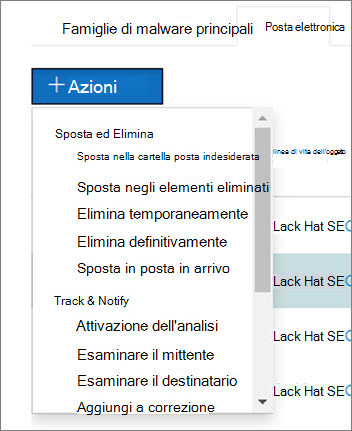

# Come funziona l'analisi e la risposta automatizzata in Microsoft Defender per Office 365

[!INCLUDE [Microsoft 365 Defender rebranding](../includes/microsoft-defender-for-office.md)]

Quando vengono attivati gli avvisi di sicurezza, spetta al team delle operazioni di sicurezza esaminare gli avvisi e procedere per proteggere l'organizzazione. A volte, i team delle operazioni di sicurezza possono sentirsi sopraffatti dal volume degli avvisi attivati. Le funzionalità di analisi e risposta automatizzate in Microsoft Defender per Office 365 possono essere utili.

AIR consente al team di operazioni di sicurezza di operare in modo più efficiente ed efficace. Le funzionalità AEREe includono processi di analisi automatizzati in risposta a minacce ben note che esistono oggi. Le azioni correttive appropriate attendono l'approvazione, consentendo al team di operazioni di sicurezza di rispondere alle minacce rilevate.

In questo articolo viene descritto il funzionamento dell'aria attraverso diversi esempi. Quando si è pronti per iniziare a usare AIR, vedere [indagare e rispondere automaticamente alle minacce](office-365-air.md).

- [Esempio 1: un messaggio di phishing riferito dall'utente avvia un playbook di analisi](#example-a-user-reported-phish-message-launches-an-investigation-playbook)
- [Esempio 2: un amministratore della sicurezza attiva un'indagine da Esplora minacce](#example-a-security-administrator-triggers-an-investigation-from-threat-explorer)
- [Esempio 3: un team di operazioni di sicurezza integra l'aria con i propri SIEM utilizzando l'API di attività di gestione di Office 365](#example-a-security-operations-team-integrates-air-with-their-siem-using-the-office-365-management-activity-api)

## Esempio: un messaggio di phishing riferito dall'utente avvia un playbook di analisi

Si supponga che un utente dell'organizzazione riceva un messaggio di posta elettronica che ritengono essere un tentativo di phishing. L'utente, addestrato a segnalare tali messaggi, utilizza il [componente aggiuntivo segnala messaggio](enable-the-report-message-add-in.md) per inviarlo a Microsoft per l'analisi. L'invio viene inviato anche al sistema ed è visibile in Esplora nella visualizzazione **invii** (in precedenza denominato visualizzazione **segnalata dall'utente** ). Inoltre, il messaggio visualizzato dall'utente ora attiva un avviso informativo basato sul sistema, che avvia automaticamente il PlayBook di analisi.

Durante la fase di analisi radice, vengono valutati vari aspetti del messaggio di posta elettronica. Tra questi aspetti sono inclusi:

- Determinazione del tipo di minaccia che potrebbe essere;
- Chi lo ha inviato;
- In cui è stato inviato il messaggio di posta elettronica (infrastruttura di invio);
- Se sono state recapitate o bloccate altre istanze del messaggio di posta elettronica;
- Una valutazione dei nostri analisti;
- Se il messaggio di posta elettronica è associato a qualsiasi campagna Nota;
- e altro ancora.

Dopo aver completato l'analisi radice, il PlayBook fornisce un elenco delle azioni consigliate da intraprendere sul messaggio di posta elettronica originale e le entità ad esso associate.

Successivamente, vengono eseguiti diversi passaggi di indagine e di ricerca di minacce:

- I messaggi di posta elettronica simili vengono identificati tramite ricerche cluster di posta elettronica.
- Il segnale viene condiviso con altre piattaforme, ad esempio [Microsoft Defender per endpoint](https://docs.microsoft.com/windows/security/threat-protection/microsoft-defender-atp/microsoft-defender-advanced-threat-protection).
- Si determina se gli utenti hanno fatto clic su eventuali collegamenti dannosi nei messaggi di posta elettronica sospetti.
- Viene effettuato un controllo tramite Exchange Online Protection ([EOP](exchange-online-protection-overview.md)) e ([Microsoft Defender per Office 365](office-365-atp.md)) per verificare se sono presenti altri messaggi simili segnalati dagli utenti.
- Viene effettuato un controllo per verificare se un utente è stato compromesso. Questa verifica utilizza i segnali di Office 365, [Microsoft cloud app Security](https://docs.microsoft.com/cloud-app-security)e [Azure Active Directory](https://docs.microsoft.com/azure/active-directory), correlando eventuali anomalie relative alle attività degli utenti.

Durante la fase di caccia, i rischi e le minacce sono assegnati a vari passaggi di caccia.

La correzione è la fase finale del PlayBook. Durante questa fase, vengono eseguite le operazioni di correzione, in base alle fasi di ricerca e caccia.

## Esempio: un amministratore della sicurezza attiva un'indagine da Esplora minacce

Oltre alle indagini automatizzate attivate da un avviso, il team delle operazioni di sicurezza dell'organizzazione può attivare un'analisi automatizzata da una visualizzazione in [Esplora minacce](threat-explorer.md).  Questa indagine crea anche un avviso, in modo che gli incidenti di Microsoft Defender e gli strumenti di SIEM esterni possano vedere che questa indagine è stata attivata.

Si supponga, ad esempio, di utilizzare la visualizzazione **antimalware** in Esplora risorse. Utilizzando le schede sotto il grafico, è possibile selezionare la scheda **posta elettronica** . Se si seleziona uno o più elementi nell'elenco, viene attivato il pulsante **+ Actions** .

Utilizzando il menu **azioni** , è possibile selezionare **Avvia analisi**.

Analogamente ai PlayBook attivati da un avviso, le indagini automatiche che vengono attivate da una visualizzazione in Esplora risorse includono un'analisi radice, procedure per identificare e correlare le minacce e le azioni consigliate per attenuare tali minacce.

## Esempio: un team di operazioni di sicurezza integra l'aria con i propri SIEM utilizzando l'API di gestione delle attività di Office 365

Le funzionalità AEREe in Microsoft Defender per Office 365 includono [rapporti & dettagli che i](air-view-investigation-results.md) team delle operazioni di sicurezza possono utilizzare per monitorare e risolvere le minacce. Tuttavia, è anche possibile integrare le funzionalità AEREe con altre soluzioni. Tra gli esempi sono inclusi un sistema di gestione delle informazioni e di gestione eventi (SIEM), un System Management case o una soluzione per la creazione di report personalizzati. Questo tipo di integrazione può essere effettuato utilizzando l'API di [attività di gestione di Office 365](https://docs.microsoft.com/office/office-365-management-api/office-365-management-activity-api-reference).

Ad esempio, di recente, un'organizzazione ha configurato un modo per il team delle operazioni di sicurezza per visualizzare gli avvisi di phishing segnalati dall'utente già elaborati in base all'aria. La soluzione integra avvisi rilevanti con il server SIEM dell'organizzazione e il sistema di gestione dei casi. La soluzione riduce notevolmente il numero di falsi positivi, in modo che il team delle operazioni di sicurezza possa concentrare il proprio tempo e lo sforzo su minacce effettive. Per ulteriori informazioni su questa soluzione personalizzata, vedere [Tech Community Blog: migliorare l'efficacia del SOC con Microsoft Defender per Office 365 e l'API di gestione di O365](https://techcommunity.microsoft.com/t5/microsoft-security-and/improve-the-effectiveness-of-your-soc-with-office-365-atp-and/ba-p/1525185).

## Passaggi successivi

- [Iniziare a usare AIR](office-365-air.md)

- [Visitare la roadmap di Microsoft 365 per vedere cosa è stato pianificato e rilasciarlo presto](https://www.microsoft.com/microsoft-365/roadmap?filters=)

- [Informazioni sulle funzionalità di analisi e risposta automatizzate in Microsoft 365 Defender](https://docs.microsoft.com/microsoft-365/security/mtp/mtp-autoir)
