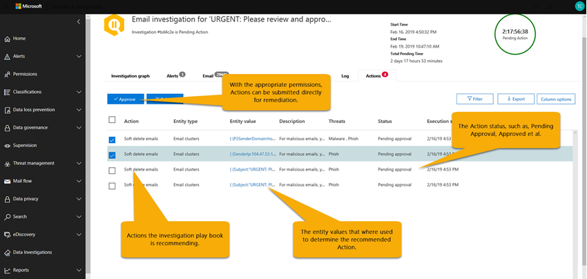

# Indagine automatizzata e risposta (AIR) in Office 365

Le funzionalità di analisi e risposta automatizzate consentono di eseguire processi di analisi automatizzati in risposta a minacce ben note che esistono oggi. AIR può aiutare il team delle operazioni di sicurezza a operare in modo più efficiente ed efficace.
- Per ottenere una panoramica del funzionamento dell'aria, utilizzare questo articolo.
- Per iniziare a usare AIR, vedere [indagare e rispondere automaticamente alle minacce in Office 365](office-365-air.md).

> [!TIP]
> Si possiedono Microsoft 365 E5 o Microsoft 365 E3 con identità e protezione dalle minacce? È consigliabile provare [Microsoft Threat Protection](../mtp/microsoft-threat-protection.md).

## Flusso globale dell'aria

A livello elevato, il flusso di aria funziona in questo modo:

|Fase  |Elementi coinvolti  |
|---------|---------|
|1     |Un [avviso](#alerts) viene attivato da un evento di Office e un sistema di [sicurezza PlayBook](#security-playbooks) avvia un'indagine automatizzata per gli avvisi selezionati.   In alternativa, un analista di sicurezza può [avviare un'indagine automatizzata manualmente](#example-a-security-administrator-triggers-an-investigation-from-threat-explorer), da un messaggio di posta elettronica da [Esplora risorse](threat-explorer.md).        |
|2     |Durante l'esecuzione di un'indagine automatizzata, vengono raccolti dati aggiuntivi relativi all'indirizzo di posta elettronica e alle entità correlate alla posta elettronica: file, URL e destinatari.  L'ambito dell'indagine può aumentare, poiché vengono attivati nuovi avvisi correlati.         |
|3     |Durante e dopo un'analisi automatizzata, [i dettagli e i risultati](#investigation-graph) sono disponibili per la visualizzazione. I risultati includono [azioni consigliate](#recommended-actions) che è possibile intraprendere per rispondere e correggere eventuali minacce individuate. Inoltre, è disponibile un [Registro PlayBook](#playbook-log) che tiene traccia di tutte le attività investigative.  Se l'organizzazione utilizza una soluzione per la creazione di report personalizzati o una soluzione di terze parti, è possibile [utilizzare l'API di attività di gestione di Office 365](office-365-air.md#use-the-office-365-management-activity-api-for-custom-or-third-party-reporting-solutions) per visualizzare le informazioni relative a indagini e minacce automatizzate.         |
|4     |Il team delle operazioni di sicurezza esamina i risultati e le raccomandazioni dell'analisi e approva le azioni di correzione. In Office 365, le azioni di correzione vengono eseguite solo dopo l'approvazione da parte del team di sicurezza dell'organizzazione.         |

Nelle sezioni seguenti vengono fornite ulteriori informazioni su AIR, inclusi i dettagli sugli avvisi, gli schemi di sicurezza e i dettagli dell'indagine. Inoltre, in questo articolo sono inclusi due esempi del funzionamento di AIR Works. Per iniziare a usare AIR, vedere [indagare e rispondere automaticamente alle minacce in Office 365](office-365-air.md).

## Avvisi

Gli [avvisi](../../compliance/alert-policies.md#viewing-alerts) rappresentano trigger per i flussi di lavoro del team di operazioni di sicurezza per la risposta agli incidenti. Definire la priorità del set di avvisi appropriato per l'analisi, assicurandosi che non vi siano minacce non indirizzate. Quando le indagini sugli avvisi vengono eseguite manualmente, i team delle operazioni di sicurezza devono cercare e correlare le entità (ad esempio, il contenuto, i dispositivi e gli utenti) a rischio di minacce. Tali attività e flussi di lavoro possono richiedere molto tempo e coinvolgere più strumenti e sistemi. Con AIR, l'analisi e la risposta per gli eventi di sicurezza di Office 365 vengono automatizzati tramite gli avvisi di sicurezza e di gestione delle minacce che attivano automaticamente gli schemi di risposta alla sicurezza. 

Attualmente per l'aria, gli avvisi generati dai seguenti tipi di criteri di avviso vengono analizzati automaticamente:  

- È stato rilevato un clic URL potenzialmente dannoso
- Messaggi di posta elettronica segnalati dall'utente come phishing *
- Messaggi di posta elettronica contenenti malware rimossi dopo il recapito *
- Messaggi di posta elettronica contenenti gli URL di phishing rimossi dopo il recapito *
- Modelli di invio di messaggi di posta elettronica sospetti #
- Utente con limitazioni all'invio di posta elettronica #

> [!NOTE]
> Agli avvisi contrassegnati da un asterisco (*) viene assegnata una gravità *informativa* nei rispettivi criteri di avviso all'interno del centro sicurezza & conformità, con le notifiche di posta elettronica disattivate. Le notifiche tramite posta elettronica possono essere attivate tramite la [configurazione del criterio di avviso](../../compliance/alert-policies.md#alert-policy-settings). Gli avvisi contrassegnati con un hash (#) sono generalmente disponibili agli avvisi associati ai PlayBook di anteprima pubblica.

Per visualizzare gli avvisi, nel centro sicurezza & conformità scegliere **avvisi** > **Visualizza avvisi**. Selezionare un avviso per visualizzare i dettagli, quindi utilizzare il collegamento **Visualizza analisi** per passare all' [analisi](#investigation-graph)corrispondente.  

> [!NOTE]
> Gli avvisi informativi sono nascosti nella visualizzazione avviso per impostazione predefinita. Per visualizzarli, modificare il filtro degli avvisi per includere gli avvisi informativi.

Se l'organizzazione gestisce gli avvisi di sicurezza tramite un sistema di gestione degli avvisi, un sistema di gestione dei servizi o un sistema di gestione eventi e informazioni di sicurezza, è possibile inviare avvisi di Office 365 a tale sistema tramite notifica tramite posta elettronica o tramite l' [API di gestione di office 365 Management](https://docs.microsoft.com/office/office-365-management-api/office-365-management-activity-api-reference). Le notifiche di avviso per l'analisi tramite posta elettronica o API includono collegamenti per accedere agli avvisi nel centro sicurezza & conformità, consentendo all'amministratore della sicurezza assegnato di passare rapidamente all'indagine.

 

## Schemi di sicurezza

Gli schemi di sicurezza sono criteri di back-end che sono al centro dell'automazione in Office Advanced Threat Protection e Microsoft Threat Protection. Gli schemi di sicurezza forniti in AIR sono basati su scenari comuni di sicurezza del mondo reale e sviluppati in base ai commenti e suggerimenti dei team di operazioni di sicurezza. Una sicurezza PlayBook viene avviata automaticamente quando vengono attivati avvisi specifici all'interno dell'organizzazione. Dopo che l'avviso è stato attivato, l'oggetto PlayBook associato viene eseguito dal sistema di analisi e risposta automatico (AIR). L'analisi analizza l'avviso in base al Playbook di quel particolare avviso, analizzando tutti i metadati associati (compresi messaggi di posta elettronica, utenti, soggetti, mittenti e così via). In base ai risultati dell'indagine del PlayBook, AIR consiglia una serie di azioni che il team di sicurezza dell'organizzazione può intraprendere per controllare e mitigare la minaccia. 

Gli schemi di sicurezza che otterrete con AIR sono studiati per affrontare le minacce più frequenti che le organizzazioni incontrano oggi con la posta elettronica. Sono basati sull'input dalle operazioni di sicurezza e dai team di risposta agli incidenti, compresi quelli che aiutano a difendere Microsoft e le risorse dei clienti.

### Gli schemi di sicurezza vengono implementati in fasi

Come parte di AIR, i PlayBook di sicurezza stanno per essere implementati in fasi. La fase 1 è ora generalmente disponibile e include diversi PlayBook che forniscono suggerimenti per le azioni che gli amministratori della sicurezza possono rivedere e approvare:
- Messaggio phishing visualizzato dall'utente
- URL fare clic su modifica verdetto
- Malware rilevato dopo il recapito (ZAP malware)
- Phishing rilevato dopo il recapito dello ZAP (phishing ZAP)

La fase 1 include anche il supporto per le indagini di posta elettronica attivate dall'amministratore (tramite [Esplora minacce](threat-explorer.md)).

La fase 2 è ora in corso con i seguenti PlayBook nell' **anteprima pubblica**, fornendo suggerimenti per le azioni e aiutando gli amministratori della sicurezza a esaminare i problemi:
- Utente segnalato come compromesso (anteprima pubblica)

Ulteriori PlayBook verranno rilasciati Man mano che sono stati completati. Visitare la Guida di [orientamento di Microsoft 365](https://www.microsoft.com/microsoft-365/roadmap) per vedere cos'altro è pianificato e disponibile a breve.

### I PlayBook includono analisi e suggerimenti

In AIR, ogni PlayBook di sicurezza include: 
- analisi radice delle entità di un messaggio di posta elettronica (file, URL, destinatari, indirizzi IP e così via)
- ulteriore ricerca di messaggi di posta elettronica simili ricevuti dall'organizzazione 
- passaggi necessari per identificare e correlare altre potenziali minacce e 
- azioni di correzione delle minacce consigliate.

Ogni passaggio di alto livello include una serie di passaggi che vengono eseguiti per fornire una risposta profonda, dettagliata ed esaustiva alle minacce.

## Indagini automatizzate

Nella pagina indagini automatizzate vengono visualizzate le indagini dell'organizzazione e gli stati correnti.

 
  
È possibile:
- Passare direttamente a un'indagine (selezionare un **ID di ricerca**).
- Applicare filtri. Scegliere tra il **tipo di analisi**, l'intervallo di **tempo**, **lo stato**o una combinazione di questi.
- Esportare i dati in un file. csv.

Lo stato dell'indagine indica lo stato di avanzamento dell'analisi e delle azioni. Durante l'esecuzione dell'indagine, lo stato cambia per indicare se sono state trovate minacce e se le azioni sono state approvate. 

|Stato  |Cosa significa  |
|---------|---------|
|In avvio | L'analisi viene accodata per iniziare a breve |
|In esecuzione | L'inchiesta è iniziata e sta conducendo la sua analisi |
|Non sono state trovate minacce | L'indagine ha completato l'analisi e non sono state trovate minacce |
|Terminato dal sistema | L'inchiesta non è stata chiusa ed è scaduta dopo 7 giorni |
|Azione in sospeso | Nell'inchiesta sono state individuate minacce con azioni consigliate.  L'analisi continua a essere eseguita dopo che sono state trovate le minacce iniziali e le azioni consigliate, pertanto è necessario controllare il registro prima di approvare le azioni per verificare se gli analizzatori sono ancora in corso. |
|Minacce trovate | L'inchiesta ha rilevato minacce, ma le minacce non sono disponibili in aria.  Si tratta di azioni dell'utente in cui non è ancora presente un'azione aria di direzione. |
|Corretti | L'inchiesta è stata completata ed è stata completamente rimediata (tutte le azioni sono state approvate) |
|Parzialmente rimediato | L'inchiesta è terminata e sono state approvate alcune delle azioni consigliate |
|Terminato dall'utente | Un amministratore ha terminato l'indagine |
|Failed | Si è verificato un errore durante l'indagine che impediva di raggiungere una conclusione sulle minacce |
|Accodamento tramite limitazione | L'indagine è in attesa di analisi a causa di limitazioni di elaborazione del sistema (per proteggere le prestazioni del servizio) |
|Terminata mediante limitazione | L'inchiesta non è stata completata in tempi sufficienti a causa di limitazioni del volume e dell'elaborazione del sistema di analisi. È possibile riattivare l'indagine selezionando il messaggio di posta elettronica in Esplora risorse e selezionando l'azione indaga. |

### Grafico dell'indagine

Quando si apre una specifica indagine, viene visualizzata la pagina del grafico delle indagini. In questa pagina vengono illustrate tutte le diverse entità: messaggi di posta elettronica, utenti (e loro attività) e dispositivi che sono stati analizzati automaticamente come parte dell'avviso che è stato attivato.

È possibile:
- Ottenere una panoramica visiva dell'indagine corrente.
- Visualizzare un riepilogo della durata dell'indagine.
- Selezionare un nodo nella visualizzazione per visualizzare i dettagli per il nodo.
- Selezionare una scheda all'interno della parte superiore per visualizzare i dettagli per tale scheda.

### Indagine sugli avvisi

Nella scheda **avvisi** per un'indagine, è possibile visualizzare gli avvisi rilevanti per l'indagine. I dettagli includono l'avviso che ha attivato l'indagine e altri avvisi correlati, ad esempio l'accesso rischioso, le violazioni dei criteri DLP e così via, che sono correlate all'inchiesta. Da questa pagina, un analista di sicurezza può anche visualizzare ulteriori dettagli sui singoli avvisi.

È possibile:
- Ottenere una panoramica visiva dell'avviso di attivazione corrente e degli eventuali avvisi associati.
- Selezionare un avviso nell'elenco per aprire una pagina di volo che Visualizza i dettagli degli avvisi completi.

### Indagine tramite posta elettronica

Nella scheda **posta elettronica** per un'indagine, è possibile visualizzare i messaggi di e-mail originali e i cluster di messaggi di posta elettronica analoghi identificati nell'ambito dell'inchiesta. 

Dato il volume totale di messaggi di posta elettronica che gli utenti di un'organizzazione inviano e ricevono, oltre alla natura multi-utente delle comunicazioni e degli attacchi di posta elettronica, il processo di 
- clustering dei messaggi di posta elettronica in base a attributi simili provenienti da un'intestazione, corpo, URL e allegati del messaggio; 
- separazione di messaggi di posta elettronica dannosi dal buon messaggio di posta elettronica; e 
- esecuzione di un'azione su messaggi di posta elettronica dannosi 

può richiedere molto tempo. AIR ora automatizza questo processo, salvando il tempo e lo sforzo del team di sicurezza dell'organizzazione. 

Durante il passaggio di analisi della posta elettronica possono essere identificati due tipi di cluster di posta elettronica: cluster di somiglianza e cluster di indicatori. 
- I cluster di somiglianza sono messaggi di posta elettronica identificati dalla ricerca di messaggi di posta elettronica con attributi di contenuto e mittente simili. Tali cluster vengono valutati per i contenuti dannosi in base ai risultati di rilevamento originali. I cluster di posta elettronica che contengono sufficienti rilevamenti di posta elettronica dannosi sono considerati dannosi.
- I cluster di indicatori sono messaggi di posta elettronica identificati tramite la ricerca per la stessa entità indicatore (hash di file o URL) dal messaggio di posta elettronica originale. Quando l'entità file/URL originale viene identificata come dannosa, AIR applica l'indicatore verdetto all'intero gruppo di messaggi di posta elettronica che contiene tale entità. Un file identificato come malware indica che il cluster di messaggi di posta elettronica che contiene il file viene trattato come messaggio di posta elettronica antimalware.

L'obiettivo del raggruppamento è la ricerca e la ricerca di altri messaggi di posta elettronica correlati inviati dallo stesso mittente come parte di un attacco o di una campagna.  In alcuni casi, la posta elettronica legittima può innescare un'indagine (ad esempio, un utente segnala un messaggio di posta elettronica di marketing).  In questi scenari, il clustering di posta elettronica dovrebbe identificare che i cluster di posta elettronica non sono dannosi – quando lo fa in modo appropriato, **non** indicherà una minaccia né la rimozione della posta elettronica.

La scheda **posta elettronica** Visualizza anche gli elementi di posta elettronica relativi all'indagine, ad esempio i dettagli di posta elettronica segnalati dall'utente, il messaggio di posta elettronica originale riportato, i messaggi di posta elettronica zapped a causa di malware/phishing e così via.

Il numero di messaggi di posta elettronica identificati nella scheda posta elettronica rappresenta attualmente la somma totale di tutti gli SMS visualizzati nella scheda **posta elettronica** . Poiché i messaggi di posta elettronica sono presenti in più cluster, il conteggio totale effettivo dei messaggi di posta elettronica identificati (ed è influenzato dalle azioni correttive) è il numero di messaggi di posta elettronica univoci presenti in tutti i cluster e nei messaggi di posta elettronica dei destinatari originali. 

Entrambi i messaggi di posta elettronica di Explorer e conteggio aria sono per ogni destinatario, in quanto i verdetti di sicurezza, le azioni e i percorsi di recapito variano in base al destinatario. Pertanto, un messaggio di posta elettronica originale inviato a tre utenti conta come un totale di tre messaggi di posta elettronica anziché un messaggio di posta elettronica. Nota potrebbero verificarsi casi in cui un messaggio di posta elettronica viene contato due o più volte, poiché il messaggio di posta elettronica può avere più azioni su di esso e potrebbe essere più copie del messaggio di posta elettronica una volta che tutte le azioni si verificano. Ad esempio, un messaggio di posta elettronica antimalware rilevato al momento del parto può comportare un messaggio di posta elettronica bloccato (in quarantena) e un messaggio di posta elettronica sostituito (il file di minacce è stato sostituito da un file di avviso e quindi recapitato alla cassetta postale Poiché vi sono letteralmente due copie del messaggio di posta elettronica nel sistema, entrambe possono essere conteggiate nei conteggi dei cluster. 

I conteggi dei messaggi di posta elettronica vengono calcolati al momento dell'indagine e alcuni conteggi vengono ricalcolati quando si apre l'indagine comparsa (in base a una query sottostante). Il numero di messaggi di posta elettronica visualizzati per i cluster di posta elettronica nella scheda posta elettronica e il valore della quantità di posta elettronica visualizzato nel riquadro a comparsa del cluster vengono calcolati al momento dell'indagine e non cambiano. Il numero di posta elettronica visualizzato nella parte inferiore della scheda posta elettronica del riquadro a comparsa del cluster di posta elettronica e il numero di messaggi di posta elettronica visualizzati in Esplora riflettono i messaggi di posta elettronica ricevuti dopo l'analisi iniziale dell'indagine. In questo modo un cluster di posta elettronica che mostra una quantità originale di 10 messaggi di posta elettronica mostrerà una lista di posta elettronica di 15 quando altri cinque messaggi di posta elettronica arrivano tra la fase di analisi dell'inchiesta e quando l'amministratore esamina l'indagine.  Analogamente, le indagini precedenti potrebbero avere un numero maggiore rispetto alle query di Explorer, poiché i dati di ATP P2 scadono dopo 7 giorni per le prove e 30 giorni per le licenze a pagamento.  La visualizzazione dei conteggi cronologici e correnti di count in visualizzazioni diverse viene eseguita per indicare l'impatto della posta elettronica al momento dell'indagine e l'impatto corrente fino al momento in cui viene eseguita la correzione.

Si consideri, ad esempio, lo scenario seguente. Il primo gruppo di tre messaggi di posta elettronica è stato ritenuto phishing. Un altro gruppo di messaggi simili con lo stesso IP e l'oggetto è stato trovato e considerato dannoso, in quanto alcuni di essi sono stati identificati come phishing durante il rilevamento iniziale. 

È possibile:
- Ottenere una panoramica visiva dei risultati del clustering corrente e delle minacce trovate.
- Fare clic su un'entità cluster o su un elenco di minacce per aprire una pagina di volo che Visualizza i dettagli degli avvisi completi.
- Esaminare ulteriormente il cluster di posta elettronica facendo clic sul collegamento ' Apri in Esplora risorse ' nella parte superiore della scheda ' dettagli cluster di posta elettronica '

> [!NOTE]
> Nel contesto della posta elettronica, è possibile che venga visualizzata una superficie di minaccia per l'anomalia del volume come parte dell'indagine. Un'anomalia del volume indica un picco nei messaggi di posta elettronica simili nei pressi del tempo dell'evento di indagine rispetto ai tempi precedenti. Questo picco del traffico di posta elettronica con caratteristiche simili (ad esempio, dominio del mittente e del soggetto, somiglianza del corpo e IP del mittente) è tipico dell'inizio delle campagne di posta elettronica o degli attacchi. Tuttavia, la massa, la posta indesiderata e le campagne di posta elettronica legittime condividono queste caratteristiche. Le anomalie dei volumi rappresentano una potenziale minaccia e, di conseguenza, potrebbero essere meno gravi rispetto alle minacce di malware o phishing identificate con motori anti-virus, detonazione o reputazione dannosa.

### Analisi degli utenti

Nella scheda **utenti** è possibile visualizzare tutti gli utenti identificati come parte dell'indagine. Gli account utente vengono visualizzati nell'inchiesta quando si verifica un evento o un'indicazione del fatto che tali account utente potrebbero essere intaccati o compromessi.

Ad esempio, nell'immagine seguente, l'aria ha identificato indicatori di compromesso e anomalie basate su una nuova regola di posta in arrivo che è stata creata. Ulteriori dettagli (prova) dell'indagine sono disponibili tramite visualizzazioni dettagliate all'interno di questa scheda. gli indicatori di compromesso e anomalie possono includere anche rilevamenti di anomalie dalla [sicurezza delle app cloud di Microsoft](https://docs.microsoft.com/cloud-app-security).

È possibile:
- Ottenere una panoramica visiva dei risultati e dei rischi individuati dall'utente.
- Selezionare un utente per l'apertura di una pagina di fly-out che Visualizza i dettagli degli avvisi completi.

### Indagine del computer

Nella scheda **computer** , è possibile visualizzare tutti i computer identificati come parte dell'indagine. 

Come parte di alcuni PlayBook, AIR correla le minacce alla posta elettronica ai dispositivi (ad esempio, malware con zapping). Ad esempio, un'analisi passa un hash di file dannosi a [Microsoft Defender ATP](https://docs.microsoft.com/windows/security/threat-protection/microsoft-defender-atp/microsoft-defender-advanced-threat-protection
) per esaminare. Questo consente l'analisi automatizzata delle macchine rilevanti per gli utenti, per garantire che le minacce vengano affrontate sia nel cloud che negli endpoint. 

È possibile:
- Ottenere una panoramica visiva dei computer e delle minacce correnti trovati.
- Selezionare un computer per aprire una visualizzazione che si riferisce alle [indagini ATP Microsoft Defender](https://docs.microsoft.com/windows/security/threat-protection/microsoft-defender-atp/automated-investigations) correlate in Microsoft Defender Security Center.

### Indagine su entità

Nella scheda **entità** , è possibile visualizzare le entità identificate e analizzate nell'ambito dell'indagine. 

In questa sezione, è possibile visualizzare le entità indagate e i dettagli dei tipi di entità, ad esempio i messaggi di posta elettronica, i cluster, gli indirizzi IP, gli utenti e altro ancora. È inoltre possibile vedere quante entità sono state analizzate e le minacce che sono state associate a ognuna di esse. 

È possibile:
- Ottenere una panoramica visiva delle entità investigative e delle minacce trovate.
- Selezionare un'entità per aprire una pagina di fly-out che Visualizza i dettagli dell'entità correlata.

### Registro PlayBook

Nella scheda **log** , è possibile visualizzare tutti i passaggi del PlayBook che si sono verificati durante l'indagine. Il log acquisisce un inventario completo di tutti gli analizzatori e le azioni completate dalle funzionalità di analisi automatica di Office 365 come parte di AIR. Viene fornita una chiara visualizzazione di tutti i passaggi, tra cui l'azione stessa, una descrizione e la durata dell'effettivo dall'inizio alla fine. 

È possibile:
- Ottenere una panoramica visiva dei passaggi di PlayBook eseguiti.
- Esportare i risultati in un file CSV.
- Filtrare la visualizzazione.

|Dell'analizzatore dell' | Descrizione |
|-----|-----|
|Indagini sulle violazioni DLP |Esaminare eventuali violazioni rilevate da [Office 365 prevenzione della perdita di dati](../../compliance/data-loss-prevention-policies.md) (DLP) |
|Estrazione degli indicatori di posta elettronica |Estrarre indicatori dall'intestazione, dal corpo e dal contenuto di un messaggio di posta elettronica per l'analisi |
|Reputazione hash file |Rilevare anomalie in base agli hash dei file per gli utenti e i computer dell'organizzazione |
|Identificazione del cluster di posta |Analisi del cluster di posta elettronica basata su intestazione, corpo, contenuto e URL |
|Analisi del volume del cluster di posta |Analisi del cluster di posta elettronica basata su modelli di volume del flusso di posta in uscita |
|Indagine sulla delega della posta |Esaminare l'accesso alla delega della posta per le cassette postali degli utenti correlate all'analisi |
|Analisi delle regole di inoltro della posta |Esaminare le regole di inoltro della posta per le cassette postali degli utenti relative a questa indagine |
|Rilevato malware rilevati |Rilevare la presenza di malware mancante recapitato alla cassetta postale dell'utente nell'organizzazione |
|Detonazione su richiesta |Detonazione su richiesta attivata per i messaggi di posta elettronica, gli allegati e gli URL |
|Indagine sull'anomalia della posta in uscita |Rilevare anomalie basate su modelli di invio di flussi di posta cronologici per gli utenti dell'organizzazione |
|Indagine su malware e posta indesiderata in uscita |Rilevare malware, phishing o posta indesiderata intra-org e in uscita provenienti da utenti dell'organizzazione |
|Indagine sul dominio del mittente |Controllo su richiesta della reputazione del dominio da [Microsoft Intelligent Security Graph](https://www.microsoft.com/security/operations/intelligence) e fonti di intelligence per le minacce esterne |
|Indagine IP del mittente | Controllo su richiesta della reputazione IP dal [grafico Microsoft Intelligent Security Graph](https://www.microsoft.com/security/operations/intelligence) e dalle fonti di intelligence per le minacce esterne |
|Indagine clic URL | Esaminare i clic degli utenti protetti da [collegamenti sicuri di Office 365 ATP](atp-safe-links.md) nell'organizzazione |
|Indagine sulla reputazione URL |Verifica su richiesta sulla reputazione URL del grafico di [sicurezza intelligente di Microsoft](https://www.microsoft.com/security/operations/intelligence) e delle origini di intelligence per le minacce esterne |
|Indagine sulle attività degli utenti |Analisi delle anomalie delle attività degli utenti in [Microsoft cloud app Security](https://docs.microsoft.com/cloud-app-security/what-is-cloud-app-security) |
|Estrazione degli indicatori di messaggi di posta elettronica segnalati dall'utente |Estrarre indicatori dall'intestazione, dal corpo e dal contenuto della [posta elettronica segnalata dall'utente](enable-the-report-message-add-in.md) per l'analisi |

### Azioni consigliate

Nella scheda **azioni** , è possibile visualizzare tutte le azioni di PlayBook consigliate per la correzione dopo il completamento dell'indagine. 

Azioni acquisire i passaggi consigliati da Microsoft al termine di un'indagine. È possibile eseguire le azioni di correzione selezionando una o più azioni. Se si fa clic su **approva** è possibile iniziare la correzione. (Sono necessarie autorizzazioni appropriate: il ruolo ' Search and Purge ' è necessario per eseguire azioni da Explorer e AIR). Ad esempio, un lettore di sicurezza è in grado di visualizzare le azioni, ma non di approvarle. Nota: non è necessario approvare ogni azione. Se non si è d'accordo con l'azione consigliata o l'organizzazione non sceglie alcuni tipi di azioni, è possibile scegliere di **rifiutare** le azioni o semplicemente ignorarle e non intraprendere alcuna azione. L'approvazione e/o il rifiuto di tutte le azioni consente di chiudere completamente l'indagine (lo stato viene ripristinato), lasciando inalterate alcune azioni allo stato dell'inchiesta che cambia in uno stato parzialmente rimediato.

È possibile:
- Ottenere una panoramica visiva delle azioni consigliate in PlayBook.
- Selezionare una singola azione o più azioni.
- Approvare o rifiutare le azioni consigliate con i commenti.
- Esportare i risultati in un file CSV.
- Filtrare la visualizzazione.

## Azioni correttive

Quando un'indagine automatizzata è in esecuzione o è stata completata, in genere vengono visualizzate una o più azioni di correzione. Nella tabella seguente sono elencate le possibili azioni di correzione in Office 365 AIR.

|Azione | Descrizione |
|-----|-----|
|Blocco di URL (al momento del clic) |Proteggi da messaggi di posta elettronica e documenti che contengono URL dannosi. In questo modo è possibile bloccare i collegamenti dannosi e tutte le pagine Web correlate tramite [collegamenti sicuri](atp-safe-links.md) quando l'utente fa clic su un collegamento in un file di Office esistente o in un messaggio di posta elettronica precedente. |
|Elimina messaggio di posta elettronica soft  |Eliminazione temporanea di messaggi di posta elettronica specifici dalla cassetta postale di un utente|
|Cluster di posta elettronica con eliminazione morbida  |Eliminare i messaggi di posta elettronica dannosi che corrispondono a una query da tutte le cassette postali degli utenti|
|Disattivazione dell'inoltro della posta elettronica esterna |Rimuove la regola di inoltro dalla cassetta postale di un utente finale specifico|

## Esempio: un messaggio di phishing riferito dall'utente avvia un playbook di analisi

Quando un utente dell'organizzazione invia un messaggio di posta elettronica e lo segnala a Microsoft utilizzando il [componente aggiuntivo per i messaggi di report per Outlook o Outlook Web App](enable-the-report-message-add-in.md), il report viene inviato anche al sistema ed è visibile in Esplora nella visualizzazione segnalata dall'utente. Questo messaggio visualizzato dall'utente ora attiva un avviso informativo basato sul sistema, che avvia automaticamente il PlayBook di analisi.

Durante la fase di analisi radice, vengono valutati vari aspetti del messaggio di posta elettronica. Ad esempio:
- Determinazione del tipo di minaccia che potrebbe essere;
- Chi lo ha inviato;
- In cui è stato inviato il messaggio di posta elettronica (infrastruttura di invio);
- Se sono state recapitate o bloccate altre istanze del messaggio di posta elettronica;
- Una valutazione dei nostri analisti;
- Se il messaggio di posta elettronica è associato a qualsiasi campagna Nota;
- e altro ancora.

Dopo aver completato l'analisi radice, il PlayBook fornisce un elenco delle azioni consigliate da intraprendere sul messaggio di posta elettronica originale e le entità ad esso associate.
  
Successivamente, vengono eseguiti diversi passaggi di indagine e di ricerca di minacce:

- I messaggi di posta elettronica simili vengono identificati tramite ricerche cluster di posta elettronica.
- Il segnale viene condiviso con altre piattaforme, ad esempio [Microsoft Defender ATP](https://docs.microsoft.com/windows/security/threat-protection/microsoft-defender-atp/microsoft-defender-advanced-threat-protection).
- Si determina se gli utenti hanno fatto clic su eventuali collegamenti dannosi nei messaggi di posta elettronica sospetti.
- Viene effettuato un controllo in Office 365 Exchange Online Protection ([EOP](exchange-online-protection-eop.md)) e Office 365 Advanced Threat Protection ([ATP](office-365-atp.md)) per verificare se sono presenti altri messaggi simili segnalati dagli utenti.
- Viene effettuato un controllo per verificare se un utente è stato compromesso. Questa verifica utilizza i segnali di Office 365, [Microsoft cloud app Security](https://docs.microsoft.com/cloud-app-security)e [Azure Active Directory](https://docs.microsoft.com/azure/active-directory), correlando eventuali anomalie relative alle attività degli utenti. 

Durante la fase di caccia, i rischi e le minacce sono assegnati a vari passaggi di caccia. 

La correzione è la fase finale del PlayBook. Durante questa fase, vengono eseguite le operazioni di correzione, in base alle fasi di ricerca e caccia. 

## Esempio: un amministratore della sicurezza attiva un'indagine da Esplora minacce

Oltre alle indagini automatiche attivate da un avviso, il team delle operazioni di sicurezza dell'organizzazione può attivare un'analisi automatica da una visualizzazione in [Esplora minacce](threat-explorer.md).

Si supponga, ad esempio, di visualizzare i dati in Esplora informazioni sui messaggi segnalati dall'utente. È possibile selezionare un elemento nell'elenco dei risultati e quindi fare clic su **indaga** dal menu azione (supponendo che si disponga delle autorizzazioni di correzione appropriate).

Come un altro esempio, si supponga di visualizzare i dati relativi ai messaggi di posta elettronica rilevati come contenenti malware e che sono stati rilevati diversi messaggi di posta elettronica come contenenti malware. È possibile selezionare la scheda **posta elettronica** , selezionare uno o più messaggi di posta elettronica e quindi scegliere **indaga**dal menu **azioni** . 

Analogamente ai PlayBook attivati da un avviso, le indagini automatiche che vengono attivate da una visualizzazione in Esplora risorse includono un'analisi radice, procedure per identificare e correlare le minacce e le azioni consigliate per attenuare tali minacce.

## Come ottenere aria

Office 365 AIR è incluso negli abbonamenti seguenti:

- Microsoft 365 E5
- Office 365 E5
- Microsoft Threat Protection
- Office 365 Advanced Threat Protection (Piano 2)

Se non si dispone di una o più di queste sottoscrizioni, [avviare una versione di valutazione gratuita](https://go.microsoft.com/fwlink/p/?LinkID=698279&culture=en-US&country=US).

Per ulteriori informazioni sulla disponibilità delle funzionalità, visitare la [disponibilità delle funzionalità tra i piani di Advanced Threat Protection (ATP)](https://docs.microsoft.com/office365/servicedescriptions/office-365-advanced-threat-protection-service-description#feature-availability-across-advanced-threat-protection-atp-plans).

## Autorizzazioni necessarie per l'utilizzo delle funzionalità AEREe

Le autorizzazioni vengono concesse tramite alcuni ruoli, ad esempio quelli descritti nella tabella seguente: 

|Attività |Ruoli necessari |
|--|--|
|Per impostare le caratteristiche dell'aria |Uno dei ruoli seguenti:  - **Amministratore globale** - **Amministratore della sicurezza**  Questi ruoli possono essere assegnati in [Azure Active Directory](https://docs.microsoft.com/azure/active-directory/users-groups-roles/directory-assign-admin-roles) o nel [Centro sicurezza & conformità di Office 365](https://docs.microsoft.com/microsoft-365/security/office-365-security/permissions-in-the-security-and-compliance-center). |
|Per approvare o rifiutare le azioni consigliate|Uno dei ruoli seguenti, assegnato in [Azure Active Directory](https://docs.microsoft.com/azure/active-directory/users-groups-roles/directory-assign-admin-roles) o nel [Centro sicurezza & conformità di Office 365](https://docs.microsoft.com/microsoft-365/security/office-365-security/permissions-in-the-security-and-compliance-center): - **Amministratore globale**  - **Amministratore della sicurezza** - **Lettore di sicurezza**  --- e --- - **Search and Purge** (questo ruolo è assegnato solo nel [Centro sicurezza & conformità di Office 365](https://docs.microsoft.com/microsoft-365/security/office-365-security/permissions-in-the-security-and-compliance-center). Potrebbe essere necessario creare un nuovo gruppo di ruoli e aggiungere il ruolo Search and Purge a quel nuovo gruppo di ruoli.

## Passaggi successivi

- [Iniziare a usare AIR in Office 365](office-365-air.md)
- [Informazioni su AIR in Microsoft Defender ATP](https://docs.microsoft.com/windows/security/threat-protection/microsoft-defender-atp/automated-investigations) 
- [Visitare la Guida di orientamento di Microsoft 365 per vedere cosa succederà tra breve e in uscita](https://www.microsoft.com/microsoft-365/roadmap?filters=)

## Vedere anche

- [Microsoft Threat Protection](../mtp/microsoft-threat-protection.md)
- [Indagine automatizzata e correzione (AIR) in Microsoft Threat Protection](../mtp/mtp-autoir.md)
