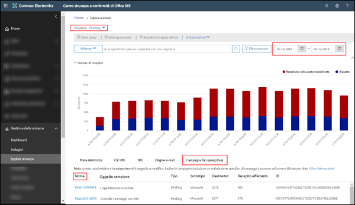
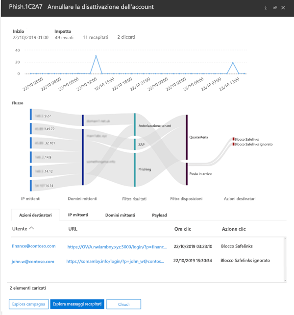

# Visualizzazione campagne in Office 365 ATP

> [!NOTE]
> Le funzionalità qui descritte sono attualmente in anteprima e soggette a modifiche.

Visualizzazione campagne è una funzionalità di Advanced Threat Protection (ATP) nel Centro sicurezza e conformità di Office 365 che identifica e categorizza gli attacchi di phishing nel servizio. Visualizzazione campagne consente di:

- Analizzare e rispondere in modo efficiente agli attacchi di phishing.

- Comprendere meglio la portata dell'attacco.

- Visualizzare i dettagli dell'attacco.

Visualizzazione campagne fornisce una visione d'insieme di un attacco in maniera più rapida e completa rispetto a un processo manuale.

## Cos'è una campagna?

Una campagna è un attacco coordinato perpetrato tramite posta elettronica contro una o più organizzazioni. I messaggi di posta elettronica per rubare credenziali e dati aziendali sono diventati un business lucrativo. Con l'aumentare delle tecnologie impiegate per arrestare le minacce informatiche, gli attacchi informatici sono diventati così sofisticati da modificare i metodi impiegati per garantire il proprio successo.

Microsoft sfrutta le enormi quantità di dati anti-phishing, della posta indesiderata, anti-malware e dall'esperienza nell'intero servizio Office 365 per identificare campagne di scala mondiale. Le informazioni relative all'attacco sono analizzate e classificate in base a diversi fattori. Ad esempio:

- **Origine dell'attacco**: indirizzi IP origine e domini di posta elettronica del mittente.

- **Caratteristiche del messaggio di attacco**: il contenuto, lo stile e il tono dei messaggi di attacco.

- **Destinatari dell'attacco**: domini dei destinatari, funzione aziendale dei destinatari (amministratori, dirigenti e così via), tipi di azienda (grandi, piccole, pubbliche, private e così via) e settori.

- **Attacco payload**: collegamenti, allegati o altri payload dannosi.

## Visualizzazione campagne del Centro sicurezza e conformità di Office 365

Visualizzazione campagne è disponibile nel [Centro sicurezza e conformità](https://docs.microsoft.com/microsoft-365/compliance/go-to-the-securitycompliance-center) nelle seguenti posizioni:

- **Gestione delle minacce** \> **Esplora** \> **Visualizzazione** \> **Phishing** \> **Campagna in primo piano (anteprima)**

- **Gestione delle minacce** \> **Esplora** \> **Visualizzazione** \> **Tutti i messaggi di posta elettronica** \> **Campagna in primo piano (anteprima)**

> [!TIP]
> Attualmente l'unico filtro disponibile è l'intervallo di date. Se i dati della campagna non sono visibili, provare a modificare l'intervallo di date.

La pagina di panoramica visualizza le seguenti informazioni sulla campagna:

- **Nome**

- **Esempio di oggetto**: oggetto di uno dei messaggi della campagna. Si noti che _non tutti_ i messaggi della campagna avranno necessariamente lo stesso oggetto.

- **Tipo**: al momento questo valore sarà sempre **Phishing**.

- **Sottotipo**: se disponibile, il marchio oggetto dell'attacco di phishing dalla campagna. Quando la minaccia viene rilevata grazie alla tecnologia ATP, al valore sottotipo viene aggiunto **ATP**.

- **Destinatari**: il numero di utenti oggetti dell'attacco della campagna.

- **Recapitato**: il numero di utenti che hanno ricevuto i messaggi della campagna nella loro posta in arrivo.

- **ID**: identificatore univoco della campagna.

Quando si fa clic sul nome di una campagna, i dettagli della campagna sono visualizzati in un riquadro a comparsa.

## Dettagli campagna

Nella visualizzazione dei dettagli della campagna sono disponibili numerose informazioni:

- Informazioni sulla campagna:

  - **ID**: l'identificatore univoco della campagna, identico a quello della schermata panoramica.

  - **Iniziata** e **Terminata**: l'intervallo di date scelto come filtro.

  - **Impatto**: il numero di messaggi inviati nell'intervallo di date selezionato, il numero di messaggi ricevuti (recapitati nella posta in arrivo) e il numero di utenti che hanno fatto clic sull'URL del payload nel messaggio di phishing.

  - Una sequenza temporale delle attività delle campagne: quando è iniziata e terminata la campagna e il volume di messaggi nel corso del tempo.

### Flusso della campagna

I dettagli importanti sulla campagna sono presentati in un diagramma di flusso orizzontale (noto come diagramma di _Sankey_) nella sezione **Flusso**. Questi dettagli aiuteranno a comprendere gli elementi della campagna e il potenziale impatto sull'organizzazione.

Se si passa il mouse su una fascia orizzontale nel diagramma, viene visualizzato il numero di messaggi correlati (ad esempio i messaggi provenienti da un determinato IP di origine, i messaggi provenienti dall'IP di origine con il dominio del mittente specificato e così via).

Il diagramma include le seguenti informazioni:

- **Indirizzi IP mittenti**

- **Domini mittenti**

- **Filtra risultati**: i valori qui riportati riguardano i risultati del filtro anti-phishing e della posta indesiderata disponibili come descritto in [Intestazioni dei messaggi di posta indesiderata](anti-spam-message-headers.md). Molto interessanti sono i valori **Autorizza tenant**, ossia un'impostazione di configurazione nell'organizzazione che ha autorizzato il recapito di un messaggio che sarebbe altrimenti stato bloccato dal servizio (ad esempio un dominio nell'elenco di mittenti consentiti).

  - **Blocca tenant**: questo valore si riferisce a un'opzione nell'organizzazione (ad esempio una voce di dominio nell'[Elenco mittenti bloccati](create-block-sender-lists-in-office-365.md)) che ha rilevato il messaggio e ha determinato dove è stato recapitato. Per i messaggi non messi in quarantena, esaminare le impostazioni dei mittenti bloccati per determinare il motivo per cui il messaggio è stato recapitato.

  - **Rilevato**

  - **Tenant autorizzato**

- **Posizioni di recapito**: è consigliabile esaminare i messaggi che sono stati effettivamente recapitati ai destinatari (nella cartella posta in arrivo o posta indesiderata), anche se gli utenti non hanno fatto clic sull'URL del payload nel messaggio. È anche possibile rimuovere i messaggi messi in quarantena da [Messaggi di posta elettronica in quarantena in Office 365](quarantine-email-messages.md).

  - **Posta indesiderata**

  - **Quarantena**

  - **Posta in arrivo**

#### Clic URL

È possibile che i messaggi recapitati nella cartella di posta in arrivo o nella posta indesiderata del destinatario vengano gestiti dall'utente (ossia che l'utente clicchi sull'URL dannoso nel messaggio). Se questo non avviene, si tratta solo di una piccola percentuale di successo, anche se è certamente necessario determinare il motivo per cui il messaggio è stato recapitato nella casella di posta.

Se un utente ha fatto clic sull'URL dannoso, le azioni vengono visualizzate nella sezione **Clic URL** del diagramma.

- **Blocco di collegamenti sicuri**: questo valore indica che il destinatario ha fatto clic sull'URL di payload nel messaggio, ma è stato bloccato dai criteri [Collegamenti sicuri ATP](atp-safe-links.md) all'interno dell'organizzazione.

- **Blocco collegamenti sicuri ignorato**: questo valore indica anche che il destinatario ha fatto clic sull'URL di payload nel messaggio e che i collegamenti sicuri ATP hanno tentato di fermarlo ma gli utenti sono stati autorizzati a ignorare il blocco. È necessario analizzare i [criteri dei collegamenti sicuri](set-up-atp-safe-links-policies.md) per capire perché agli utenti è consentito ignorare la valutazione dei collegamenti sicuri e quindi fare clic su URL dannosi.

### Schede

Nella visualizzazione dei dettagli della campagna sono disponibili diverse schede che consentono di esaminare la campagna in maniera più approfondita.

- **Clic URL**: se non è stato fatto clic sull'URL del payload nel messaggio di phishing, questa sezione sarà vuota. Se un utente ha potuto fare clic sull'URL,

  - **Utente:**\*

  - **URL**\*

  - **Ora clic**

  - **Azione clic**

- **Indirizzi IP mittenti**

  - **Indirizzo IP mittente**\*

  - **Conteggio totale**

  - **Conteggio messaggi in posta in arrivo**

  - **Conteggio bloccati**

  - **SPF superato**

- **Mittenti**

  - **Mittente**

  - **Conteggio totale**

  - **Conteggio messaggi in posta in arrivo**

  - **Conteggio bloccati**

  - **DKIM superato**

  - **DMARC superato**

- **Payload**

  - **URL**\*

  - **Conteggio totale**

\* Se si fa clic su questo valore, viene aperto un nuovo riquadro a comparsa che contiene altri dettagli sulla voce specificata (utente, URL e così via) nella parte superiore della visualizzazione dei dettagli della campagna. Per tornare alla visualizzazione dei dettagli della campagna, fare clic su **Chiudi** nel nuovo riquadro a comparsa.

### Pulsanti

I pulsanti nella visualizzazione dei dettagli della campagna consentono di usare la potenza di Esplora minacce per approfondire la campagna.

- **Esplora minacce**: apre una nuova scheda di ricerca in Esplora minacce usando il valore **ID campagna** come filtro di ricerca.

- **Esplora minacce in posta in arrivo**: apre una nuova scheda di ricerca in Esplora minacce usando **ID campagna** e **Posizione di recapito: posta in arrivo** come filtro di ricerca.
