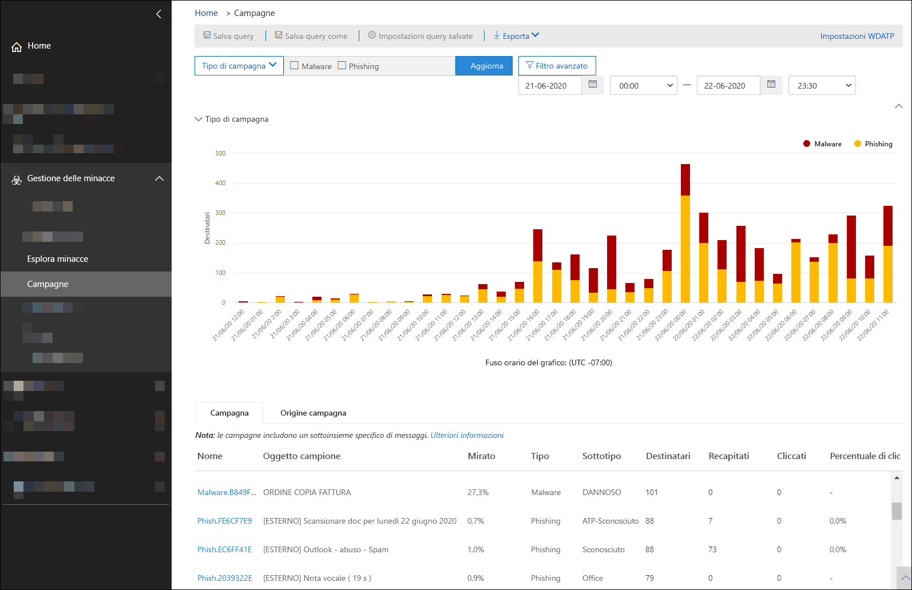
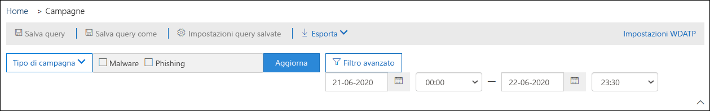
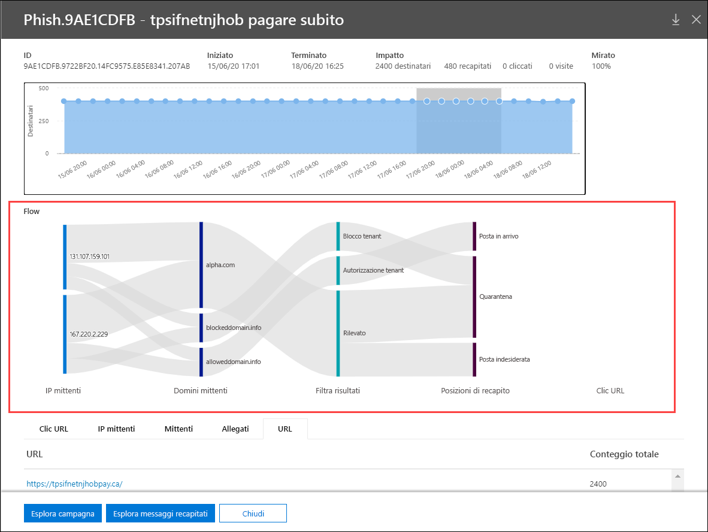

# Visualizzazioni della campagna in Microsoft Defender per Office 365Campaign Views in Microsoft Defender for Office 365

[!INCLUDE [Microsoft 365 Defender rebranding](../includes/microsoft-defender-for-office.md)]

La visualizzazione della campagna è una funzionalità di Microsoft Defender per Office 365 piano 2 (ad esempio Microsoft 365 E5 o organizzazioni con un componente aggiuntivo difensore per Office 365 piano 2).Campaign Views is a feature in Microsoft Defender for Office 365 Plan 2 (for example Microsoft 365 E5 or organizations with an Defender for Office 365 Plan 2 add-on). Le visualizzazioni della campagna nel centro sicurezza & conformità identifica e categorizza gli attacchi di phishing nel servizio.Campaign Views in the Security & Compliance Center identifies and categorizes phishing attacks in the service. Visualizzazione campagne consente di:Campaign Views can help you to:

- Analizzare e rispondere in modo efficiente agli attacchi di phishing.Efficiently investigate and respond to phishing attacks.
- Comprendere meglio la portata dell'attacco.Better understand the scope of the attack.
- Visualizzare i dettagli dell'attacco.Show value to decision makers.

Visualizzazione campagne fornisce una visione d'insieme di un attacco in maniera più rapida e completa rispetto a un processo manuale.Campaign Views lets you see the big picture of an attack faster and more complete than any human.

## Cos'è una campagna?What is a campaign?

Una campagna è un attacco coordinato perpetrato tramite posta elettronica contro una o più organizzazioni.A campaign is a coordinated email attack against one or many organizations. Gli attacchi tramite posta elettronica che rubano le credenziali e i dati aziendali sono un'industria grande e redditizia.Email attacks that steal credentials and company data are a large and lucrative industry. Man mano che le tecnologie aumentano nel tentativo di arrestare gli attacchi, gli aggressori modificano i propri metodi nel tentativo di garantire il successo continuativo.As technologies increase in an effort to stop attacks, attackers modify their methods in an effort to ensure continued success.

Microsoft sfrutta la vasta quantità di dati antiphishing, di protezione dalla posta indesiderata e antimalware in tutto il servizio per facilitare l'identificazione delle campagne.Microsoft leverages the vast amounts of anti-phishing, anti-spam, and anti-malware data across the entire service to help identify campaigns. Vengono analizzate e classificate le informazioni sull'attacco in base a diversi fattori.We analyze and classify the attack information according to several factors. Ad esempio:For example:

- **Origine attacco**: gli indirizzi IP di origine e i domini di posta elettronica del mittente.**Attack source**: The source IP addresses and sender email domains.
- **Proprietà del messaggio**: contenuto, stile e tono dei messaggi.**Message properties**: The content, style, and tone of the messages.
- **Destinatari del messaggio**: modalità di correlazione dei destinatari.**Message recipients**: How recipients are related. Ad esempio, i domini destinatario, le funzioni del processo dei destinatari (amministratori, dirigenti e così via), i tipi di società (grandi, piccoli, pubblici, privati, ecc.) e le industrie.For example, recipient domains, recipient job functions (admins, executives, etc.), company types (large, small, public, private, etc.), and industries.
- **Payload di attacco**: collegamenti dannosi, allegati o altri payload nei messaggi.**Attack payload**: Malicious links, attachments, or other payloads in the messages.

Una campagna potrebbe essere di breve durata, o potrebbe interferire tra diversi giorni, settimane o mesi con periodi attivi e inattivi.A campaign might be short-lived, or could span several days, weeks, or months with active and inactive periods. Una campagna potrebbe essere avviata con l'organizzazione specifica oppure l'organizzazione potrebbe far parte di una campagna più estesa tra più società.A campaign might be launched against your specific organization, or your organization might be part of a larger campaign across multiple companies.

## Visualizzazioni della campagna nel centro sicurezza & conformitàCampaign Views in the Security & Compliance Center

Le visualizzazioni della campagna sono disponibili nel [Centro sicurezza & conformità](https://protection.office.com) nelle campagne di **gestione delle minacce** \> **Campaigns** o direttamente su <https://protection.office.com/campaigns> .Campaign Views is available in the [Security & Compliance Center](https://protection.office.com) at **Threat management** \> **Campaigns**, or directly at <https://protection.office.com/campaigns>.

È inoltre possibile accedere alle visualizzazioni della campagna da:You can also get to Campaign Views from:

- **Gestione delle minacce** \> **Gestione risorse** \> **Visualizzazione** \> **Campagne****Threat management** \> **Explorer** \> **View** \> **Campaigns**
- **Gestione delle minacce** \> **Gestione risorse** \> **Visualizzazione** \> **Tutti i messaggi di posta elettronica** \> Scheda **campagna****Threat management** \> **Explorer** \> **View** \> **All email** \> **Campaign** tab
- **Gestione delle minacce** \> **Gestione risorse** \> **Visualizzazione** \> **Phishing** \> Scheda **campagna****Threat management** \> **Explorer** \> **View** \> **Phish** \> **Campaign** tab
- **Gestione delle minacce** \> **Gestione risorse** \> **Visualizzazione** \> **Malware** \> Scheda **campagna****Threat management** \> **Explorer** \> **View** \> **Malware** \> **Campaign** tab

Per accedere alle visualizzazioni della campagna, è necessario essere membri dei gruppi di ruoli **Gestione organizzazione**, **amministratore sicurezza** o **lettore di sicurezza** nel centro sicurezza & conformità.To access Campaign Views, you need to be a member of the **Organization Management**, **Security Administrator**, or **Security Reader** role groups in the Security & Compliance Center. Per altre informazioni, vedere [Autorizzazioni nel Centro sicurezza e conformità](permissions-in-the-security-and-compliance-center.md).For more information, see [Permissions in the Security & Compliance Center](permissions-in-the-security-and-compliance-center.md).

## Panoramica delle campagneCampaigns overview

La pagina Panoramica Visualizza informazioni su tutte le campagne.The overview page shows information about all campaigns.

Nella scheda **campagna** predefinita, l'area **tipo di campagna** Visualizza un grafico a barre che indica il numero di destinatari al giorno.On the default **Campaign** tab, the **Campaign type** area shows a bar graph that shows the number of recipients per day. Per impostazione predefinita, nel grafico vengono visualizzati i dati di **phishing** e di **malware** .By default, the graph shows both **Phish** and **Malware** data.

> [!TIP]
> Se non vengono visualizzati dati sulla campagna, provare a modificare l'intervallo di date o i [filtri](#filters-and-settings).If you don't see any campaign data, try changing the date range or [filters](#filters-and-settings).

La parte restante della pagina Panoramica Visualizza le informazioni seguenti nella scheda **campagna** :The rest of the overview page shows the following information on the **Campaign** tab:

- **Nome****Name**

- **Esempio di oggetto**: oggetto di uno dei messaggi della campagna.**Sample subject**: The subject line of one of the messages in the campaign. Tenere presente che tutti i messaggi nella campagna non avranno necessariamente lo stesso oggetto.Note that all messages in the campaign will not necessarily have the same subject.

- **Targeted**: la percentuale calcolata da: (il numero di destinatari della campagna nell'organizzazione)/(il numero totale di destinatari nella campagna tra tutte le organizzazioni del servizio).**Targeted**: The percentage as calculated by: (the number of campaign recipients in your organization) / (the total number of recipients in the campaign across all organizations in the service). Questo valore indica la misura in cui la campagna viene indirizzata solo alla propria organizzazione (un valore superiore) e indirizzata anche ad altre organizzazioni del servizio (valore inferiore).This value indicates the degree to which the campaign is directed only at your organization (a higher value) vs. also directed at other organizations in the service (a lower value).

- **Type**: questo valore è **phishing** o **malware**.**Type**: This value is either **Phish** or **Malware**.

- **Sottotipo**: questo valore contiene maggiori dettagli sulla campagna.**Subtype**: This value contains more details about the campaign. Ad esempio:For example:
  - **Phishing**: se disponibile, il marchio che viene phishing da questa campagna.**Phish**: Where available, the brand that is being phished by this campaign. Ad esempio,,,, `Microsoft` `365` `Unknown` `Outlook` o `DocuSign` .For example, `Microsoft`, `365`, `Unknown`, `Outlook`, or `DocuSign`.
  - **Malware**: ad esempio, `HTML/PHISH` o `HTML/<MalwareFamilyName>` .**Malware**: For example, `HTML/PHISH` or `HTML/<MalwareFamilyName>`.

  Se disponibile, il marchio che viene phishing da questa campagna.Where available, the brand that is being phished by this campaign. Quando il rilevamento è guidato da Defender per la tecnologia Office 365, il prefisso **ATP-** viene aggiunto al valore del sottotipo.When the detection is driven by Defender for Office 365 technology, the prefix **ATP-** is added to the subtype value.

- **Destinatari**: il numero di utenti oggetti dell'attacco della campagna.**Recipients**: The number of users that were targeted by this campaign.

- **Posta in arrivo**: il numero di utenti che hanno ricevuto messaggi da questa campagna nella posta in arrivo (non recapitati nella cartella posta indesiderata).**Inboxed**: The number of users that received messages from this campaign in their Inbox (not delivered to their Junk Email folder).

- **Fare clic** su: numero di utenti che hanno fatto clic sull'URL o che hanno aperto l'allegato nel messaggio di phishing.**Clicked**: The number of users that clicked on the URL or opened the attachment in the phishing message.

- **Fare clic su rate**: la percentuale calcolata da "**fare clic su**  /  **posta in arrivo**".**Click rate**: The percentage as calculated by "**Clicked** / **Inboxed**". Questo valore è un indicatore dell'efficacia della campagna.This value is an indicator of the effectiveness of the campaign. In altre parole, se i destinatari sono stati in grado di identificare il messaggio come phishing e se non sono stati fare clic sull'URL payload.In other words, if the recipients were able to identify the message as phishing, and if they didn't click on the payload URL.

  Si noti che la **frequenza di clic** non viene utilizzata nelle campagne antimalware.Note that **Click rate** isn't used in malware campaigns.

- **Visitato**: numero di utenti effettivamente apportati al sito Web payload.**Visited**: How many users actually made it through to the payload website. Se sono presenti valori **cliccati** , ma i collegamenti sicuri impediscono l'accesso al sito Web, questo valore sarà zero.If there are **Clicked** values, but Safe Links blocked access to the website, this value will be zero.

La scheda **origine campagna** Visualizza le origini dei messaggi in una mappa del mondo.The **Campaign origin** tab shows the message sources on a map of the world.

### Filtri e impostazioniFilters and settings

Nella parte superiore della pagina visualizzazioni campagna sono disponibili diverse impostazioni di filtro e query che consentono di individuare e isolare campagne specifiche.At the top of the Campaign Views page, there are several filter and query settings to help you find and isolate specific campaigns.

La maggior parte dei filtri di base che è possibile eseguire è la data/ora di inizio e la data/ora di fine.The most basic filtering that you can do is the start date/time and the end date/time.

Per filtrare ulteriormente la visualizzazione, è possibile eseguire una singola proprietà con un filtro a più valori facendo clic sul pulsante **tipo di campagna** , effettuando la selezione e quindi facendo clic su **Aggiorna**.To further filter the view, you can do single property with multiple values filtering by clicking the **Campaign type** button, making your selection, and then clicking **Refresh**.

Le proprietà della campagna filtrabili disponibili nel pulsante **tipo di campagna** sono descritte nell'elenco seguente:The filterable campaign properties that are available in the **Campaign type** button are described in the following list:

- **Base**:**Basic**:
  - **Tipo di campagna**: selezionare **malware** o **phishing**.**Campaign type**: Select **Malware** or **Phish**. La cancellazione delle selezioni ha lo stesso risultato della selezione di entrambi.Clearing the selections has the same result as selecting both.
  - **Nome della campagna****Campaign name**
  - **Sottotipo di campagna****Campaign subtype**
  - **Mittente****Sender**
  - **Destinatari****Recipients**
  - **Dominio mittente****Sender domain**
  - **Oggetto****Subject**
  - **Nome file allegato****Attachment filename**
  - **Famiglia di malware****Malware family**
  - **Tag**: utenti o gruppi a cui è stato applicato il tag utente specificato (compresi gli account prioritari).**Tags**: Users or groups that have had the specified user tag applied (including priority accounts). Per ulteriori informazioni sui tag degli utenti, vedere [tag utente](user-tags.md).For more information about user tags, see [User tags](user-tags.md).
  - **Sostituzioni del sistema****System overrides**
  - **Azione per il recapito****Delivery action**
  - **Azione aggiuntiva****Additional action**
  - **Directionality****Directionality**
  - **Tecnologia di rilevamento****Detection technology**
  - **Percorso di recapito originale****Original delivery location**
  - **Sede di recapito più recente****Latest delivery location**
  - **Sostituzioni del sistema****System overrides**

- **Avanzato**:**Advanced**:
  - **ID messaggio Internet**: disponibile nel campo di intestazione **Message-ID** nell'intestazione del messaggio.**Internet message ID**: Available in the **Message-ID** header field in the message header. Un valore di esempio è `<08f1e0f6806a47b4ac103961109ae6ef@server.domain>` (si notino le parentesi angolari).An example value is `<08f1e0f6806a47b4ac103961109ae6ef@server.domain>` (note the angle brackets).
  - **ID messaggio di rete**: valore GUID disponibile nel campo di intestazione **X-MS-Exchange-Organization-network-Message-ID** nell'intestazione del messaggio.**Network message ID**: A GUID value that's available in the **X-MS-Exchange-Organization-Network-Message-Id** header field in the message header.
  - **Indirizzo IP mittente****Sender IP**
  - **Attachment SHA256**: per trovare il valore hash SHA256 di un file in Windows, eseguire il comando seguente in un prompt dei comandi: `certutil.exe -hashfile "<Path>\<Filename>" SHA256` .**Attachment SHA256**: To find the SHA256 hash value of a file in Windows, run the following command in a Command Prompt: `certutil.exe -hashfile "<Path>\<Filename>" SHA256`.
  - **ID cluster****Cluster ID**
  - **ID criteri di avviso****Alert Policy ID**
  - **Segnale URL ZAP****ZAP URL signal**

- **URL**:**URLs**:
  - **Dominio URL****URL domain**
  - **Dominio e percorso URL****URL domain and path**
  - **URL****URL**
  - **Percorso URL****URL path**
  - **Fare clic su verdetto****Click verdict**

Per un filtro più avanzato, tra cui il filtro in base a più proprietà, è possibile fare clic sul pulsante **filtro avanzato** per creare una query.For more advanced filtering, including filtering by multiple properties, you can click the **Advanced filter** button to build a query. Sono disponibili le stesse proprietà della campagna, ma con i miglioramenti seguenti:The same campaign properties are available, but with the following enhancements:

- È possibile fare clic su **Aggiungi condizione** per selezionare più condizioni.You can click **Add a condition** to select multiple conditions.
- È possibile scegliere l'operatore **and** o **or** tra le condizioni.You can choose the **And** or **Or** operator between conditions.
- È possibile selezionare l'elemento del **gruppo** di condizioni nella parte inferiore dell'elenco delle condizioni per formare condizioni composte complesse.You can select the **Condition group** item at the bottom of the conditions list to form complex compound conditions.

Al termine, fare clic sul pulsante **query** .When you're finished, click the **Query** button.

Dopo aver creato un filtro di base o avanzato, è possibile salvarlo tramite **Save Query** or **Save query As**.After you create a basic or advanced filter, you can save it by using **Save query** or **Save query as**. Successivamente, quando si torna alla visualizzazione della campagna, è possibile caricare un filtro salvato facendo clic su **Impostazioni query salvate**.Later, when you return to Campaign Views, you can load a saved filter by clicking **Saved query settings**.

Per esportare il grafico o l'elenco delle campagne, fare clic su **Esporta** e selezionare **Esporta dati grafico** o **Esporta campagna**.To export the graph or the list of campaigns, click **Export** and select **Export chart data** or **Export campaign list**.

Se si dispone di un abbonamento a Microsoft Defender per endpoint, è possibile fare clic su **WDATP** per connettere o disconnettere le informazioni sulle campagne con Microsoft Defender per endpoint.If you have a Microsoft Defender for Endpoint subscription, you can click **WDATP** to connect or disconnect the campaigns information with Microsoft Defender for Endpoint. Per ulteriori informazioni, vedere [integrare Microsoft Defender per Office 365 con Microsoft Defender per endpoint](integrate-office-365-ti-with-wdatp.md).For more information, see [Integrate Microsoft Defender for Office 365 with Microsoft Defender for Endpoint](integrate-office-365-ti-with-wdatp.md).

## Dettagli campagnaCampaign details

Quando si fa clic sul nome di una campagna, i dettagli della campagna vengono visualizzati in un riquadro a comparsa.When you click on the name of a campaign, the campaign details appear in a flyout.

### Informazioni sulla campagnaCampaign information

Nella parte superiore della visualizzazione dettagli campagna sono disponibili le informazioni sulla campagna seguenti:At the top of the campaign details view, the following campaign information is available:

- **ID**: l'identificatore della campagna univoco.**ID**: The unique campaign identifier.

- **Started** and **ended**: la data di inizio e la data di fine della campagna.**Started** and **Ended**: The start date and end date of the campaign. Si noti che queste date potrebbero essere estese oltre le date di filtro selezionate nella pagina panoramica.Note that these dates might extend further than your filter dates that you selected on the overview page.

- **Impatto**: in questa sezione sono contenuti i dati seguenti per il filtro intervallo di date selezionato (o che si seleziona nella sequenza temporale):**Impact**: This section contains the following data for the date range filter you selected (or that you select in the timeline):
  - Numero totale di destinatari.The total number of recipients.
  - Il numero di messaggi che sono stati "ricevuti" (ovvero recapitati nella posta in arrivo, non nella cartella posta indesiderata).The number of messages that were "Inboxed" (that is, delivered to the Inbox, not to the Junk Email folder).
  - Il numero di utenti che hanno fatto clic sul payload URL nel messaggio di phishing.How many users clicked on the URL payload in the phishing message.
  - Howe molti utenti hanno visitato l'URL.Howe many users visited the URL.

- **Targeted**: la percentuale calcolata da: (il numero di destinatari della campagna nell'organizzazione)/(il numero totale di destinatari nella campagna tra tutte le organizzazioni del servizio).**Targeted**: The percentage as calculated by: (the number of campaign recipients in your organization) / (the total number of recipients in the campaign across all organizations in the service). Si noti che questo valore viene calcolato per tutta la durata della campagna e non viene modificato in base ai filtri data.Note that this value is calculated over the entire lifetime of the campaign, and doesn't change based on date filters.

- Una cronologia interattiva delle attività della campagna: la sequenza temporale Visualizza le attività per l'intera durata della campagna.An interactive timeline of campaign activity: The timeline shows activity over the entire lifetime of the campaign. Per impostazione predefinita, l'area ombreggiata include il filtro dell'intervallo di date selezionato nella panoramica.By default, the shaded area includes the date range filter that you selected in the overview. È possibile fare clic e trascinare per selezionare un punto iniziale e un punto finale specifici, <u>che modificheranno i dati visualizzati nell'area di **impatto** e nel resto della pagina come descritto nelle sezioni successive</u>.You can click and drag to select a specific start point and end point, <u>which will change the data that's displayed in **Impact** area, and on the rest of the page as described in the next sections</u>.

Nella barra del titolo, è possibile fare clic sull'icona **download campagna** write-up per scaricare la campagna  i dettagli della campagna in un documento di Word (per impostazione predefinita, denominato CampaignReport.docx).In the title bar, you can click the **Download campaign write-up** button  to download the campaign details to a Word document (by default, named CampaignReport.docx). Si noti che il download contiene informazioni dettagliate sull'intero ciclo di vita della campagna (non solo le date di filtro selezionate).Note that the download contains details over the entire lifetime of the campaign (not just the filter dates you selected).

### Flusso della campagnaCampaign flow

Al centro della visualizzazione dettagli campagna, i dettagli importanti sulla campagna sono presentati nella sezione **flusso** in un diagramma di flusso orizzontale (noto come diagramma di _Sankey_ ).In the middle of the campaign details view, important details about the campaign are presented in the **Flow** section in a horizontal flow diagram (known as a _Sankey_ diagram). Questi dettagli aiuteranno a comprendere gli elementi della campagna e il potenziale impatto sull'organizzazione.These details will help you to understand the elements of the campaign and the potential impact in your organization.

> [!TIP]
> Le informazioni visualizzate nel diagramma di **flusso** sono controllate dall'intervallo di date ombreggiato nella sequenza temporale, come descritto nella sezione precedente.The information that's displayed in the **Flow** diagram is controlled by the shaded date range in the timeline as described in the previous section.

Se si passa il mouse su una fascia orizzontale nel diagramma, viene visualizzato il numero di messaggi correlati (ad esempio i messaggi provenienti da un determinato IP di origine, i messaggi provenienti dall'IP di origine con il dominio del mittente specificato e così via).If you hover over a horizontal band in the diagram, you'll see the number of related messages (for example, messages from a particular source IP, messages from the source IP using the specified sender domain, etc.).

Il diagramma include le seguenti informazioni:The diagram contains the following information:

- **Indirizzi IP mittenti****Sender IPs**
- **Domini mittenti****Sender domains**
- **Verdetti del filtro**: i valori del verdetto sono correlati ai verdetti del filtro antispamming e di phishing disponibili come descritto nelle intestazioni dei messaggi di protezione dalla [posta indesiderata](anti-spam-message-headers.md).**Filter verdicts**: Verdict values are related to the available phishing and spam filtering verdicts as described in [Anti-spam message headers](anti-spam-message-headers.md). I valori disponibili sono descritti nella tabella seguente:The available values are described in the following table:

  ****

  |ValoreValue|Verdetto del filtro posta indesiderataSpam filter verdict|DescrizioneDescription|
  |---|---|---|
  |**Consentito****Allowed**|`SFV:SKN` 
 `SFV:SKI`|Il messaggio è stato contrassegnato come non indesiderato e/o il filtro saltato prima di essere valutato tramite filtro posta indesiderata.The message was marked as not spam and/or skipped filtering before being evaluated by spam filtering. Ad esempio, il messaggio è stato contrassegnato come non indesiderato da una regola del flusso di posta (nota anche come regola di trasporto).For example, the message was marked as not spam by a mail flow rule (also known as a transport rule). 
 Il messaggio ha ignorato il filtro della posta indesiderata per altri motivi.The message skipped spam filtering for other reasons. Ad esempio, il mittente e il destinatario sono presenti nella stessa organizzazione.For example, the sender and recipient appear to be in the same organization.|
  |**Bloccato****Blocked**|`SFV:SKS`|Il messaggio è stato contrassegnato come posta indesiderata prima di essere valutato tramite filtro posta indesiderata.The message was marked as spam before being evaluated by spam filtering. Ad esempio, da una regola del flusso di posta.For example, by a mail flow rule.|
  |**Rilevato****Detected**|`SFV:SPM`|Il messaggio è stato contrassegnato come posta indesiderata dal filtro della posta indesiderata.The message was marked as spam by spam filtering.|
  |**Non rilevato****Not Detected**|`SFV:NSPM`|Il messaggio è stato contrassegnato come non indesiderato dal filtro posta indesiderata.The message was marked as not spam by spam filtering.|
  |**Rilasciato****Released**|`SFV:SKQ`|Il messaggio ha ignorato il filtro della posta indesiderata perché è stato rilasciato dalla quarantena.The message skipped spam filtering because it was released from quarantine.|
  |**Consenti tenant**\***Tenant Allow**\*|`SFV:SKA`|Il messaggio ha ignorato il filtro della posta indesiderata a causa delle impostazioni di un criterio di protezione da posta indesiderata.The message skipped spam filtering because of the settings in an anti-spam policy. Ad esempio, il mittente si trovava nell'elenco dei mittenti consentiti o nell'elenco dei domini consentiti.For example, the sender was in the allowed sender list or allowed domain list.|
  |**Blocco tenant**\*\***Tenant Block**\*\*|`SFV:SKA`|Il messaggio è stato bloccato dal filtro posta indesiderata a causa delle impostazioni di un criterio di protezione da posta indesiderata.The message was blocked by spam filtering because of the settings in an anti-spam policy. Ad esempio, il mittente si trovava nell'elenco dei mittenti consentiti o nell'elenco dei domini consentiti.For example, the sender was in the allowed sender list or allowed domain list.|
  |**Consenti utente**\***User Allow**\*|`SFV:SFE`|Il messaggio ha ignorato il filtro della posta indesiderata perché il mittente si trovava nell'elenco Mittenti attendibili di un utente.The message skipped spam filtering because the sender was in a user's Safe Senders list.|
  |**Blocco utenti**\*\***User Block**\*\*|`SFV:BLK`|Il messaggio è stato bloccato dal filtro posta indesiderata perché il mittente si trovava nell'elenco dei mittenti bloccati di un utente.The message was blocked by spam filtering because the sender was in a user's Blocked Senders list.|
  |**ZAP****ZAP**|n/dn/a|[Zero-hour auto Purge (ZAP)](zero-hour-auto-purge.md) ha spostato il messaggio recapitato nella cartella posta indesiderata o in quarantena.[Zero-hour auto purge (ZAP)](zero-hour-auto-purge.md) moved the delivered message to the Junk Email folder or quarantine. È possibile configurare l'azione nel criterio di protezione da posta indesiderata.You configure the action in your anti-spam policy.|
  |

  \* Esaminare i criteri di protezione da posta indesiderata, poiché il servizio potrebbe essere stato bloccato.\* Review your anti-spam policies, because the allowed message would have likely been blocked by the service.

  \*\* Esaminare i criteri di protezione da posta indesiderata, poiché tali messaggi devono essere messi in quarantena, non recapitati.\*\* Review your anti-spam policies, because these messages should be quarantined, not delivered.

- **Posizioni di recapito**: è probabile che si desideri esaminare i messaggi che sono stati recapitati ai destinatari (nella cartella posta in arrivo o posta indesiderata), anche se gli utenti non hanno fatto clic sull'URL payload del messaggio.**Delivery locations**: You'll likely want to investigate messages that were delivered to recipients (either to the Inbox or the Junk Email folder), even if users didn't click on the payload URL in the message. È inoltre possibile rimuovere i messaggi in quarantena dalla quarantena.You can also remove the quarantined messages from quarantine. Per ulteriori informazioni, vedere [messaggi di posta elettronica in quarantena in EOP](quarantine-email-messages.md).For more information, see [Quarantined email messages in EOP](quarantine-email-messages.md).
  - **Cartella eliminata****Deleted folder**
  - **Interrotte****Dropped**
  - **External**: il destinatario si trova nell'organizzazione di posta elettronica locale in ambienti ibridi.**External**: The recipient is located in your on-premises email organization in hybrid environments.
  - **Operazione non riuscita****Failed**
  - **Inoltrato****Forwarded**
  - **Posta in arrivo****Inbox**
  - **Posta indesiderata****Junk folder**
  - **Quarantena****Quarantine**
  - **Unknown****Unknown**

- **Clic URL**: questi valori sono descritti nella sezione successiva.**URL clicks**: These values are described in the next section.

> [!NOTE]
> In tutti i layer che contengono più di 10 elementi vengono visualizzati i primi 10 elementi, mentre quelli restanti sono raggruppati in **altri**.In all layers that contain more than 10 items, the top 10 items are shown, while the rest are bundled together in **Others**.

#### Clic URLURL clicks

Quando un messaggio di phishing viene recapitato nella cartella posta in arrivo o posta indesiderata del destinatario, è sempre possibile che l'utente clicchi sull'URL del payload.When a phishing message is delivered to a recipient's Inbox or Junk Email folder, there's always a chance that the user will click on the payload URL. Non fare clic sull'URL è una piccola misura di esito positivo, ma è necessario determinare il motivo per cui il messaggio di phishing è stato persino recapitato alla cassetta postale.Not clicking on the URL is a small measure of success, but you need to determine why the phishing message was even delivered to the mailbox.

Se un utente ha fatto clic sull'URL payload nel messaggio di phishing, le azioni vengono visualizzate nell'area **clic URL** del diagramma nella visualizzazione dettagli campagna.If a user clicked on the payload URL in the phishing message, the actions are displayed in the **URL clicks** area of the diagram in the campaign details view.

- **Consentito****Allowed**
- **BlockPage**: il destinatario ha fatto clic sull'URL payload, ma l'accesso al sito Web dannoso è stato bloccato da un criterio [collegamenti sicuri](atp-safe-links.md) nell'organizzazione.**BlockPage**: The recipient clicked on the payload URL, but their access to the malicious website was blocked by a [Safe Links](atp-safe-links.md) policy in your organization.
- **BlockPageOverride**: il destinatario ha fatto clic sull'URL payload nel messaggio, i collegamenti sicuri hanno tentato di arrestarli, ma sono stati autorizzati a eseguire l'override del blocco.**BlockPageOverride**: The recipient clicked on the payload URL in the message, Safe Links tried to stop them, but they were allowed to override the block. Esaminare i [criteri dei collegamenti sicuri](set-up-atp-safe-links-policies.md) per individuare il motivo per cui gli utenti possono ignorare il verdetto relativo ai collegamenti sicuri e continuare con il sito Web dannoso.Inspect your [Safe Links policies](set-up-atp-safe-links-policies.md) to see why users are allowed to override the Safe Links verdict and continue to the malicious website.
- **PendingDetonationPage**: allegati sicuri in Microsoft Defender per Office 365 è in fase di apertura e analisi dell'URL di payload in un ambiente computer virtuale.**PendingDetonationPage**: Safe Attachments in Microsoft Defender for Office 365 is in the process of opening and investigating the payload URL in a virtual computer environment.
- **PendingDetonationPageOverride**: al destinatario è stato consentito di ignorare il processo di detonazione del payload e di aprire l'URL senza attendere i risultati.**PendingDetonationPageOverride**: The recipient was allowed to override the payload detonation process and open the URL without waiting for the results.

### SchedeTabs

Le schede nella visualizzazione dettagli campagna consentono di analizzare ulteriormente la campagna.The tabs in the campaign details view allow you to further investigate the campaign.

> [!TIP]
> Le informazioni visualizzate nelle schede sono controllate dall'intervallo di date ombreggiato nella sequenza temporale, come descritto nella sezione [informazioni sulla campagna](#campaign-information) .The information that's displayed on the tabs is controlled by the shaded date range in the timeline as described in [Campaign information](#campaign-information) section.

- **Clic URL**: se gli utenti non hanno fatto clic sull'URL payload nel messaggio, questa sezione sarà vuota.**URL clicks**: If users didn't click on the payload URL in the message, this section will be blank. Se un utente è stato in grado di fare clic sull'URL, verranno inseriti i valori seguenti:If a user was able to click on the URL, the following values will be populated:
  - **Utente:**\***User**\*
  - **URL**\***URL**\*
  - **Fare clic su tempo****Click time**
  - **Fare clic su verdetto****Click verdict**

- **Indirizzi IP mittenti****Sender IPs**
  - **Indirizzo IP mittente**\***Sender IP**\*
  - **Conteggio totale****Total count**
  - **Posta in arrivo****Inboxed**
  - **Non ricevuti****Not Inboxed**
  - **SPF superato**: il mittente è stato autenticato da [Sender Policy Framework (SPF)](how-office-365-uses-spf-to-prevent-spoofing.md).**SPF passed**: The sender was authenticated by the [Sender Policy Framework (SPF)](how-office-365-uses-spf-to-prevent-spoofing.md). Un mittente che non supera la convalida SPF indica un mittente non autenticato oppure il messaggio spoofing è un mittente legittimo.A sender that doesn't pass SPF validation indicates an unauthenticated sender, or the message is spoofing a legitimate sender.

- **Mittenti****Senders**
  - **Sender**: questo è l'indirizzo effettivo del mittente nel comando SMTP mail from, che non è necessariamente l'indirizzo di posta elettronica da: che gli utenti visualizzano nei client di posta elettronica.**Sender**: This is the actual sender address in the SMTP MAIL FROM command, which is not necessarily the From: email address that users see in their email clients.
  - **Conteggio totale****Total count**
  - **Posta in arrivo****Inboxed**
  - **Non ricevuti****Not Inboxed**
  - **DKIM superato**: il mittente è stato autenticato da [Key Domain identificated mail (DKIM)](support-for-validation-of-dkim-signed-messages.md).**DKIM passed**: The sender was authenticated by [Domain Keys Identified Mail (DKIM)](support-for-validation-of-dkim-signed-messages.md). Un mittente che non supera la convalida di DKIM indica un mittente non autenticato o il messaggio è spoofing di un mittente legittimo.A sender that doesn't pass DKIM validation indicates an unauthenticated sender, or the message is spoofing a legitimate sender.
  - **DMARC superato**: il mittente è stato autenticato da [autenticazione dei messaggi basata sul dominio, Reporting e conformità (DMARC)](use-dmarc-to-validate-email.md).**DMARC passed**: The sender was authenticated by [Domain-based Message Authentication, Reporting, and Conformance (DMARC)](use-dmarc-to-validate-email.md). Un mittente che non supera la convalida di DMARC indica un mittente non autenticato o il messaggio è spoofing di un mittente legittimo.A sender that doesn't pass DMARC validation indicates an unauthenticated sender, or the message is spoofing a legitimate sender.

- **Allegati****Attachments**
  - **Filename****Filename**
  - **SHA256****SHA256**
  - **Famiglia di malware****Malware family**
  - **Conteggio totale****Total count**

- **URL****URL**
  - **URL**\***URL**\*
  - **Conteggio totale****Total Count**

\* Se si fa clic su questo valore, viene aperto un nuovo riquadro a comparsa che contiene altri dettagli sulla voce specificata (utente, URL e così via) nella parte superiore della visualizzazione dei dettagli della campagna.\* Clicking on this value opens a new flyout that contains more details about the specified item (user, URL, etc.) on top of the campaign details view. Per tornare alla visualizzazione dei dettagli della campagna, fare clic su **Chiudi** nel nuovo riquadro a comparsa.To return to the campaign details view, click **Done** in the new flyout.

### PulsantiButtons

I pulsanti nella visualizzazione dei dettagli della campagna consentono di usare la potenza di Esplora minacce per approfondire la campagna.The buttons in the campaign details view allow you to use the power of Threat Explorer to further investigate the campaign.

- **Esplora minacce**: apre una nuova scheda di ricerca in Esplora minacce usando il valore **ID campagna** come filtro di ricerca.**Explore campaign**: Opens a new Threat Explorer search tab using the **Campaign ID** value as the search filter.
- **Esplorare i messaggi in arrivo**: apre una nuova scheda di ricerca di Esplora minacce utilizzando l' **ID della campagna** e il **percorso di recapito: posta in arrivo** come filtro di ricerca.**Explore Inboxed messages**: Opens a new Threat Explorer search tab using the **Campaign ID** and **Delivery location: Inbox** as the search filter.
