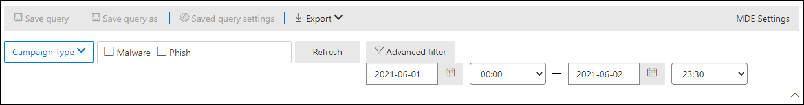

# Visualizzazioni della campagna in Microsoft Defender per Office 365Campaign Views in Microsoft Defender for Office 365

[!INCLUDE [Microsoft 365 Defender rebranding](../includes/microsoft-defender-for-office.md)]

**Si applica a****Applies to**
- [Microsoft Defender per Office 365 Piano 2Microsoft Defender for Office 365 plan 2](defender-for-office-365.md)

Visualizzazioni campagna è una funzionalità di Microsoft Defender per Office 365 Piano 2 (ad esempio, Microsoft 365 E5 o organizzazioni con un componente aggiuntivo Defender per Office 365 Piano 2).Campaign Views is a feature in Microsoft Defender for Office 365 Plan 2 (for example, Microsoft 365 E5 or organizations with an Defender for Office 365 Plan 2 add-on). Visualizzazioni campagna nel portale Microsoft 365 Defender identifica e categorizza gli attacchi di phishing nel servizio.Campaign Views in the Microsoft 365 Defender portal identifies and categorizes phishing attacks in the service. Visualizzazione campagne consente di:Campaign Views can help you to:

- Analizzare e rispondere in modo efficiente agli attacchi di phishing.Efficiently investigate and respond to phishing attacks.
- Comprendere meglio la portata dell'attacco.Better understand the scope of the attack.
- Visualizzare i dettagli dell'attacco.Show value to decision makers.

Visualizzazione campagne fornisce una visione d'insieme di un attacco in maniera più rapida e completa rispetto a un processo manuale.Campaign Views lets you see the big picture of an attack faster and more complete than any human.

## Cos'è una campagna?What is a campaign?

Una campagna è un attacco coordinato perpetrato tramite posta elettronica contro una o più organizzazioni.A campaign is a coordinated email attack against one or many organizations. Gli attacchi tramite posta elettronica che rubano credenziali e dati aziendali sono un settore di grandi dimensioni e lucrativo.Email attacks that steal credentials and company data are a large and lucrative industry. Con l'aumentare delle tecnologie nel tentativo di arrestare gli attacchi, gli utenti malintenzionati modificano i propri metodi per garantire il successo continuo.As technologies increase in an effort to stop attacks, attackers modify their methods in an effort to ensure continued success.

Microsoft sfrutta le grandi quantità di dati anti-phishing, posta indesiderata e antimalware nell'intero servizio per identificare le campagne.Microsoft leverages the vast amounts of anti-phishing, anti-spam, and anti-malware data across the entire service to help identify campaigns. Analizziamo e classifichiamo le informazioni sugli attacchi in base a diversi fattori.We analyze and classify the attack information according to several factors. Ad esempio:For example:

- **Origine dell'attacco:** gli indirizzi IP di origine e i domini di posta elettronica del mittente.**Attack source**: The source IP addresses and sender email domains.
- **Proprietà messaggio**: contenuto, stile e tono dei messaggi.**Message properties**: The content, style, and tone of the messages.
- **Destinatari del** messaggio: come sono correlati i destinatari.**Message recipients**: How recipients are related. Ad esempio, domini destinatario, funzioni di lavoro dei destinatari (amministratori, dirigenti e così via), tipi di società (grandi, piccoli, pubblici, privati e così via) e settori.For example, recipient domains, recipient job functions (admins, executives, etc.), company types (large, small, public, private, etc.), and industries.
- **Payload di** attacco: collegamenti dannosi, allegati o altri payload nei messaggi.**Attack payload**: Malicious links, attachments, or other payloads in the messages.

Una campagna può essere di breve durata o può estendersi per diversi giorni, settimane o mesi con periodi attivi e inattivi.A campaign might be short-lived, or could span several days, weeks, or months with active and inactive periods. È possibile che venga avviata una campagna per l'organizzazione specifica oppure che l'organizzazione sia parte di una campagna più ampia tra più società.A campaign might be launched against your specific organization, or your organization might be part of a larger campaign across multiple companies.

## Visualizzazioni campagna nel portale Microsoft 365 DefenderCampaign Views in the Microsoft 365 Defender portal

Visualizzazioni campagna è disponibile nel portale Microsoft 365 Defender ( ) in <https://security.microsoft.com> **Email & collaboration** \> **Campaigns** o direttamente all'indirizzo <https://security.microsoft.com/campaigns> .Campaign Views is available in the Microsoft 365 Defender portal (<https://security.microsoft.com>) at **Email & collaboration** \> **Campaigns**, or directly at <https://security.microsoft.com/campaigns>.

Puoi anche accedere a Visualizzazioni campagna da:You can also get to Campaign Views from:

- **Collaborazione & posta elettronica** \> **Explorer** \> **Visualizza** \> **Campagne****Email & collaboration** \> **Explorer** \> **View** \> **Campaigns**
- **Collaborazione & posta elettronica** \> **Explorer** \> **Visualizza** \> **Tutti i messaggi di posta elettronica** \> **Scheda** Campagna**Email & collaboration** \> **Explorer** \> **View** \> **All email** \> **Campaign** tab
- **Collaborazione & posta elettronica** \> **Explorer** \> **Visualizza** \> **Phish** \> **Scheda** Campagna**Email & collaboration** \> **Explorer** \> **View** \> **Phish** \> **Campaign** tab
- **Collaborazione & posta elettronica** \> **Explorer** \> **Visualizza** \> **Malware** \> **Scheda** Campagna**Email & collaboration** \> **Explorer** \> **View** \> **Malware** \> **Campaign** tab

Per accedere a Visualizzazioni campagna, è necessario essere membri  dei gruppi di ruoli Gestione **organizzazione,** Amministratore sicurezza o Lettore sicurezza nel portale di Microsoft 365 Defender.To access Campaign Views, you need to be a member of the **Organization Management**, **Security Administrator**, or **Security Reader** role groups in the Microsoft 365 Defender portal. Per ulteriori informazioni, vedere [Autorizzazioni nel portale Microsoft 365 Defender.](permissions-microsoft-365-security-center.md)For more information, see [Permissions in the Microsoft 365 Defender portal](permissions-microsoft-365-security-center.md).

## Panoramica delle campagneCampaigns overview

La pagina di panoramica mostra informazioni su tutte le campagne.The overview page shows information about all campaigns.

Nella scheda **campagna predefinita,** l'area **Tipo di** campagna mostra un grafico a barre che mostra il numero di destinatari al giorno.On the default **Campaign** tab, the **Campaign type** area shows a bar graph that shows the number of recipients per day. Per impostazione predefinita, il grafico mostra **sia i dati phish** che **i dati di malware.**By default, the graph shows both **Phish** and **Malware** data.

> [!TIP]
> Se non vengono visualizzati dati della campagna, provare a modificare l'intervallo di date o i [filtri](#filters-and-settings).If you don't see any campaign data, try changing the date range or [filters](#filters-and-settings).

La tabella sotto il grafico nella pagina di panoramica mostra le informazioni seguenti nella **scheda** Campagna:The table below the graph on the overview page shows the following information on the **Campaign** tab:

- **Nome****Name**

- **Esempio di oggetto**: oggetto di uno dei messaggi della campagna.**Sample subject**: The subject line of one of the messages in the campaign. Tieni presente che tutti i messaggi della campagna non avranno necessariamente lo stesso oggetto.Note that all messages in the campaign will not necessarily have the same subject.

- **Mirato**: percentuale calcolata da: (il numero di destinatari della campagna nell'organizzazione) / (il numero totale di destinatari nella campagna in tutte le organizzazioni nel servizio).**Targeted**: The percentage as calculated by: (the number of campaign recipients in your organization) / (the total number of recipients in the campaign across all organizations in the service). Questo valore indica il grado in cui la campagna viene indirizzata solo all'organizzazione (un valore superiore) e anche ad altre organizzazioni nel servizio (un valore inferiore).This value indicates the degree to which the campaign is directed only at your organization (a higher value) vs. also directed at other organizations in the service (a lower value).

- **Type**: Questo valore è **Phish** o **Malware.****Type**: This value is either **Phish** or **Malware**.

- **Sottotipo:** questo valore contiene ulteriori dettagli sulla campagna.**Subtype**: This value contains more details about the campaign. Ad esempio:For example:
  - **Phish:** se disponibile, il marchio che viene phished da questa campagna.**Phish**: Where available, the brand that is being phished by this campaign. Ad esempio, `Microsoft` , , , o `365` `Unknown` `Outlook` `DocuSign` .For example, `Microsoft`, `365`, `Unknown`, `Outlook`, or `DocuSign`.
  - **Malware**: ad esempio, `HTML/PHISH` o `HTML/<MalwareFamilyName>` .**Malware**: For example, `HTML/PHISH` or `HTML/<MalwareFamilyName>`.

  Se disponibile, il marchio di cui viene fatto phishing da questa campagna.Where available, the brand that is being phished by this campaign. Quando il rilevamento viene guidato da Defender per Office 365 tecnologia, il prefisso **ATP-** viene aggiunto al valore del sottotipo.When the detection is driven by Defender for Office 365 technology, the prefix **ATP-** is added to the subtype value.

- **Destinatari**: il numero di utenti oggetti dell'attacco della campagna.**Recipients**: The number of users that were targeted by this campaign.

- **Posta in** arrivo : Numero di utenti che hanno ricevuto messaggi da questa campagna nella posta in arrivo (non recapitati nella cartella Posta indesiderata).**Inboxed**: The number of users that received messages from this campaign in their Inbox (not delivered to their Junk Email folder).

- **Clicked**: Numero di utenti che hanno fatto clic sull'URL o hanno aperto l'allegato nel messaggio di phishing.**Clicked**: The number of users that clicked on the URL or opened the attachment in the phishing message.

- **Frequenza clic**: percentuale calcolata da " Posta in arrivo su cui **è stato fatto** clic  /  ".**Click rate**: The percentage as calculated by "**Clicked** / **Inboxed**". Questo valore è un indicatore dell'efficacia della campagna.This value is an indicator of the effectiveness of the campaign. In altre parole, se i destinatari sono stati in grado di identificare il messaggio come phishing e se non hanno fatto clic sull'URL del payload.In other words, if the recipients were able to identify the message as phishing, and if they didn't click on the payload URL.

  Tieni presente **che la frequenza** di clic non viene usata nelle campagne di malware.Note that **Click rate** isn't used in malware campaigns.

- **Visitato**: numero di utenti che hanno effettivamente effettuato l'accesso al sito Web del payload.**Visited**: How many users actually made it through to the payload website. Se sono presenti **valori Clicked,** ma collegamenti sicuri bloccano l'accesso al sito Web, questo valore sarà zero.If there are **Clicked** values, but Safe Links blocked access to the website, this value will be zero.

La **scheda Origine** campagna mostra le origini dei messaggi su una mappa del mondo.The **Campaign origin** tab shows the message sources on a map of the world.

### Filtri e impostazioniFilters and settings

Nella parte superiore della pagina **Campagna** sono disponibili diverse impostazioni di filtro e query che consentono di individuare e isolare campagne specifiche.At the top of the **Campaign** page, there are several filter and query settings to help you find and isolate specific campaigns.

Il filtro di base che è possibile eseguire è data/ora di inizio e data/ora di fine.The most basic filtering that you can do is the start date/time and the end date/time.

Per filtrare ulteriormente la visualizzazione, è possibile eseguire un'unica proprietà con più valori filtrando facendo clic sul pulsante **Tipo** di campagna, effettuando la selezione e quindi facendo clic su **Aggiorna.**To further filter the view, you can do single property with multiple values filtering by clicking the **Campaign type** button, making your selection, and then clicking **Refresh**.

Le proprietà filtrabili della campagna disponibili nel pulsante **Tipo di** campagna sono descritte nell'elenco seguente:The filterable campaign properties that are available in the **Campaign type** button are described in the following list:

- **Basic**:**Basic**:
  - **Tipo di campagna:** selezionare **Malware** **o Phish.****Campaign type**: Select **Malware** or **Phish**. La cancellazione delle selezioni ha lo stesso risultato della selezione di entrambe.Clearing the selections has the same result as selecting both.
  - **Nome campagna****Campaign name**
  - **Sottotipo campagna****Campaign subtype**
  - **Mittente****Sender**
  - **Destinatari****Recipients**
  - **Dominio del mittente****Sender domain**
  - **Oggetto****Subject**
  - **Nome file allegato****Attachment filename**
  - **Famiglia di malware****Malware family**
  - **Tag**: utenti o gruppi a cui è stato applicato il tag utente specificato (inclusi gli account di priorità).**Tags**: Users or groups that have had the specified user tag applied (including priority accounts). Per ulteriori informazioni sui tag utente, vedere [Tag utente](user-tags.md).For more information about user tags, see [User tags](user-tags.md).
  - **Azione di recapito****Delivery action**
  - **Azione aggiuntiva****Additional action**
  - **Direzionalità****Directionality**
  - **Tecnologia di rilevamento****Detection technology**
  - **Percorso di recapito originale****Original delivery location**
  - **Posizione di recapito più recente****Latest delivery location**
  - **Sostituzioni di sistema****System overrides**

- **Avanzate**:**Advanced**:
  - **ID messaggio Internet**: Disponibile nel **campo di intestazione Message-ID** nell'intestazione del messaggio.**Internet message ID**: Available in the **Message-ID** header field in the message header. Un valore di esempio è `<08f1e0f6806a47b4ac103961109ae6ef@server.domain>` (si notino le parentesi angolari).An example value is `<08f1e0f6806a47b4ac103961109ae6ef@server.domain>` (note the angle brackets).
  - **ID messaggio di** rete : valore GUID disponibile nel campo di intestazione **X-MS-Exchange-Organization-Network-Message-Id** nell'intestazione del messaggio.**Network message ID**: A GUID value that's available in the **X-MS-Exchange-Organization-Network-Message-Id** header field in the message header.
  - **Indirizzo IP mittente****Sender IP**
  - **Allegato SHA256**: Per trovare il valore hash SHA256 di un file in Windows, eseguire il comando seguente in un prompt dei comandi: `certutil.exe -hashfile "<Path>\<Filename>" SHA256` .**Attachment SHA256**: To find the SHA256 hash value of a file in Windows, run the following command in a Command Prompt: `certutil.exe -hashfile "<Path>\<Filename>" SHA256`.
  - **Cluster ID****Cluster ID**
  - **ID avviso****Alert ID**
  - **ID criterio avviso****Alert Policy ID**
  - **ID campagna****Campaign ID**
  - **Segnale URL ZAP****ZAP URL signal**

- **URL**:**URLs**:
  - **Dominio URL****URL domain**
  - **Percorso e dominio URL****URL domain and path**
  - **URL****URL**
  - **Percorso URL****URL path**
  - **Fare clic su verdetto****Click verdict**

Per un filtro più avanzato, incluso il filtro in base a più proprietà, è possibile fare clic sul **pulsante Filtro** avanzato per creare una query.For more advanced filtering, including filtering by multiple properties, you can click the **Advanced filter** button to build a query. Sono disponibili le stesse proprietà della campagna, ma con i miglioramenti seguenti:The same campaign properties are available, but with the following enhancements:

- È possibile fare **clic su Aggiungi una condizione** per selezionare più condizioni.You can click **Add a condition** to select multiple conditions.
- È possibile scegliere **l'operatore And** **o Or** tra le condizioni.You can choose the **And** or **Or** operator between conditions.
- È possibile selezionare **l'elemento Gruppo di** condizioni nella parte inferiore dell'elenco delle condizioni per formare condizioni composte complesse.You can select the **Condition group** item at the bottom of the conditions list to form complex compound conditions.

Al termine, fare clic sul **pulsante Query.**When you're finished, click the **Query** button.

Dopo aver creato un filtro di base o avanzato, è possibile salvarlo utilizzando **Salva query** o Salva query **con nome.**After you create a basic or advanced filter, you can save it by using **Save query** or **Save query as**. In seguito, quando si torna **alla** pagina Campagne, è possibile caricare un filtro salvato facendo clic su Impostazioni **query salvate.**Later, when you return to the **Campaigns** page, you can load a saved filter by clicking **Saved query settings**.

Per esportare il grafico o l'elenco delle campagne, fare clic **su** Esporta e selezionare **Esporta dati grafico** o Esporta elenco **campagne.**To export the graph or the list of campaigns, click **Export** and select **Export chart data** or **Export campaign list**.

Se hai un abbonamento a Microsoft Defender for Endpoint, puoi fare clic su **MDE Impostazioni** per connettere o disconnettere le informazioni sulle campagne con Microsoft Defender for Endpoint.If you have a Microsoft Defender for Endpoint subscription, you can click **MDE Settings** to connect or disconnect the campaigns information with Microsoft Defender for Endpoint. Per altre informazioni, vedi [Integrare Microsoft Defender per Office 365 con Microsoft Defender per Endpoint.](integrate-office-365-ti-with-mde.md)For more information, see [Integrate Microsoft Defender for Office 365 with Microsoft Defender for Endpoint](integrate-office-365-ti-with-mde.md).

## Dettagli campagnaCampaign details

Quando fai clic sul nome di una campagna, i dettagli della campagna vengono visualizzati in un riquadro a comparsa.When you click on the name of a campaign, the campaign details appear in a flyout.

### Informazioni campagnaCampaign information

Nella parte superiore della visualizzazione dei dettagli della campagna sono disponibili le informazioni seguenti:At the top of the campaign details view, the following campaign information is available:

- **ID campagna:** identificatore univoco della campagna.**Campaign ID**: The unique campaign identifier.
- **Attività**: durata e attività della campagna.**Activity**: The duration and activity of the campaign.
- I dati seguenti per il filtro dell'intervallo di date selezionato (o selezionato nella sequenza temporale):The following data for the date range filter you selected (or that you select in the timeline):
- **Impatto****Impact**
- **Messaggi**: numero totale di destinatari.**Messages**: The total number of recipients.
- **Posta in** arrivo : numero di messaggi recapitati nella cartella Posta in arrivo e non nella cartella Posta indesiderata.**Inboxed**: The number of messages that were delivered to the Inbox, not to the Junk Email folder.
- **Collegamento su cui è** stato fatto clic: numero di utenti che hanno fatto clic sul payload dell'URL nel messaggio di phishing.**Clicked link**: How many users clicked on the URL payload in the phishing message.
- **Collegamento Visitato:** numero di utenti che hanno visitato l'URL.**Visited link**: How many users visited the URL.
- **Mirato(%)**: percentuale calcolata da: (numero di destinatari della campagna nell'organizzazione) / (il numero totale di destinatari nella campagna in tutte le organizzazioni nel servizio).**Targeted(%)**: The percentage as calculated by: (the number of campaign recipients in your organization) / (the total number of recipients in the campaign across all organizations in the service). Tieni presente che questo valore viene calcolato per l'intera durata della campagna e non cambia in base ai filtri di data.Note that this value is calculated over the entire lifetime of the campaign, and doesn't change based on date filters.
- I filtri data/ora di inizio e data/ora di fine per il flusso della campagna, come descritto nella sezione successiva.Start date/time and end data/time filters for the campaign flow as described in the next section.
- Una sequenza temporale interattiva dell'attività della campagna: la sequenza temporale mostra l'attività per l'intera durata della campagna.An interactive timeline of campaign activity: The timeline shows activity over the entire lifetime of the campaign. È possibile posizionare il puntatore del mouse sui punti dati nel grafico per visualizzare la quantità di messaggi rilevati.You can hover over the data points in the graph to see the amount of detected messages.

### Flusso della campagnaCampaign flow

Nella parte centrale della visualizzazione dei dettagli della campagna, dettagli importanti sulla campagna vengono presentati in un diagramma di flusso orizzontale (noto come _diagramma Sankey)._In the middle of the campaign details view, important details about the campaign are presented in a horizontal flow diagram (known as a _Sankey_ diagram). Questi dettagli aiuteranno a comprendere gli elementi della campagna e il potenziale impatto sull'organizzazione.These details will help you to understand the elements of the campaign and the potential impact in your organization.

> [!TIP]
> Le informazioni visualizzate nel diagramma di flusso sono controllate dal filtro dell'intervallo di date nella sequenza temporale, come descritto nella sezione precedente.The information that's displayed in the flow diagram is controlled by the date range filter in the timeline as described in the previous section.

Se si passa il mouse su una fascia orizzontale nel diagramma, viene visualizzato il numero di messaggi correlati (ad esempio i messaggi provenienti da un determinato IP di origine, i messaggi provenienti dall'IP di origine con il dominio del mittente specificato e così via).If you hover over a horizontal band in the diagram, you'll see the number of related messages (for example, messages from a particular source IP, messages from the source IP using the specified sender domain, etc.).

Il diagramma include le seguenti informazioni:The diagram contains the following information:

- **Indirizzi IP mittenti****Sender IPs**
- **Domini mittenti****Sender domains**
- **Verdetti del filtro**: I valori verditti sono correlati ai verdetti disponibili per il filtro di phishing e posta indesiderata, come descritto in Intestazioni dei messaggi di [posta indesiderata.](anti-spam-message-headers.md)**Filter verdicts**: Verdict values are related to the available phishing and spam filtering verdicts as described in [Anti-spam message headers](anti-spam-message-headers.md). I valori disponibili sono descritti nella tabella seguente:The available values are described in the following table:

   

  ****

  |ValoreValue|Verdetto del filtro posta indesiderataSpam filter verdict|DescrizioneDescription|
  |---|---|---|
  |**Consentito****Allowed**|`SFV:SKN` 
 `SFV:SKI`|Il messaggio è stato contrassegnato come non posta indesiderata e/o è stato ignorato prima di essere valutato dal filtro posta indesiderata.The message was marked as not spam and/or skipped filtering before being evaluated by spam filtering. Ad esempio, il messaggio è stato contrassegnato come non posta indesiderata da una regola del flusso di posta (nota anche come regola di trasporto).For example, the message was marked as not spam by a mail flow rule (also known as a transport rule). 
 Il messaggio ha ignorato il filtro posta indesiderata per altri motivi.The message skipped spam filtering for other reasons. Ad esempio, il mittente e il destinatario sembrano essere nella stessa organizzazione.For example, the sender and recipient appear to be in the same organization.|
  |**Bloccato****Blocked**|`SFV:SKS`|Il messaggio è stato contrassegnato come posta indesiderata prima di essere valutato dal filtro posta indesiderata.The message was marked as spam before being evaluated by spam filtering. Ad esempio, tramite una regola del flusso di posta.For example, by a mail flow rule.|
  |**Rilevato****Detected**|`SFV:SPM`|Il messaggio è stato contrassegnato come posta indesiderata dal filtro della posta indesiderata.The message was marked as spam by spam filtering.|
  |**Non rilevato****Not Detected**|`SFV:NSPM`|Il messaggio è stato contrassegnato come non posta indesiderata dal filtro posta indesiderata.The message was marked as not spam by spam filtering.|
  |**Rilasciato****Released**|`SFV:SKQ`|Il messaggio ha ignorato il filtro posta indesiderata perché è stato rilasciato dalla quarantena.The message skipped spam filtering because it was released from quarantine.|
  |**Tenant Allow**\***Tenant Allow**\*|`SFV:SKA`|Il messaggio ha ignorato il filtro posta indesiderata a causa delle impostazioni di un criterio di protezione da posta indesiderata.The message skipped spam filtering because of the settings in an anti-spam policy. Ad esempio, il mittente era nell'elenco dei mittenti consentiti o nell'elenco dei domini consentiti.For example, the sender was in the allowed sender list or allowed domain list.|
  |**Blocco tenant**\*\***Tenant Block**\*\*|`SFV:SKA`|Il messaggio è stato bloccato dal filtro posta indesiderata a causa delle impostazioni di un criterio di protezione da posta indesiderata.The message was blocked by spam filtering because of the settings in an anti-spam policy. Ad esempio, il mittente era nell'elenco dei mittenti consentiti o nell'elenco dei domini consentiti.For example, the sender was in the allowed sender list or allowed domain list.|
  |**Consenti utente**\***User Allow**\*|`SFV:SFE`|Il messaggio ha ignorato il filtro posta indesiderata perché il mittente era in un elenco Mittenti attendibili di un utente.The message skipped spam filtering because the sender was in a user's Safe Senders list.|
  |**Blocco utente**\*\***User Block**\*\*|`SFV:BLK`|Il messaggio è stato bloccato dal filtro posta indesiderata perché il mittente era in un elenco Mittenti bloccati di un utente.The message was blocked by spam filtering because the sender was in a user's Blocked Senders list.|
  |**ZAP****ZAP**|n/dn/a|L'eliminazione automatica di zero [ore (ZAP)](zero-hour-auto-purge.md) ha spostato il messaggio recapitato nella cartella Posta indesiderata o in quarantena.[Zero-hour auto purge (ZAP)](zero-hour-auto-purge.md) moved the delivered message to the Junk Email folder or quarantine. L'azione viene configurata nei criteri di protezione da posta indesiderata.You configure the action in your anti-spam policy.|
  |

  \* Esaminare i criteri di protezione da posta indesiderata, perché il messaggio consentito sarebbe stato probabilmente bloccato dal servizio.\* Review your anti-spam policies, because the allowed message would have likely been blocked by the service.

  \*\* Esaminare i criteri di protezione da posta indesiderata, perché questi messaggi devono essere messi in quarantena, non recapitati.\*\* Review your anti-spam policies, because these messages should be quarantined, not delivered.

- **Destinazioni dei** messaggi : è probabile che si desideri analizzare i messaggi recapitati ai destinatari (nella cartella Posta in arrivo o Posta indesiderata), anche se gli utenti non hanno fatto clic sull'URL del payload nel messaggio.**Message destinations**: You'll likely want to investigate messages that were delivered to recipients (either to the Inbox or the Junk Email folder), even if users didn't click on the payload URL in the message. È inoltre possibile rimuovere i messaggi in quarantena dalla quarantena.You can also remove the quarantined messages from quarantine. Per ulteriori informazioni, vedere [Quarantined email messages in EOP](quarantine-email-messages.md).For more information, see [Quarantined email messages in EOP](quarantine-email-messages.md).
  - **Cartella eliminata****Deleted folder**
  - **Rilasciato****Dropped**
  - **Esterno**: il destinatario si trova nell'organizzazione di posta elettronica locale in ambienti ibridi.**External**: The recipient is located in your on-premises email organization in hybrid environments.
  - **Operazione non riuscita****Failed**
  - **Inoltrato****Forwarded**
  - **Posta in arrivo****Inbox**
  - **Posta indesiderata****Junk folder**
  - **Quarantena****Quarantine**
  - **Unknown****Unknown**

- **Clic url:** questi valori sono descritti nella sezione successiva.**URL clicks**: These values are described in the next section.

> [!NOTE]
> In tutti i layer che contengono più di 10 elementi, vengono visualizzati i primi 10 elementi, mentre gli altri sono raggruppati in **Altri**.In all layers that contain more than 10 items, the top 10 items are shown, while the rest are bundled together in **Others**.

#### Clic URLURL clicks

Quando un messaggio di phishing viene recapitato nella cartella Posta in arrivo o Posta indesiderata di un destinatario, è sempre possibile che l'utente clic sull'URL del payload.When a phishing message is delivered to a recipient's Inbox or Junk Email folder, there's always a chance that the user will click on the payload URL. Non fare clic sull'URL è una piccola misura di successo, ma è necessario determinare perché il messaggio di phishing è stato persino recapitato alla cassetta postale.Not clicking on the URL is a small measure of success, but you need to determine why the phishing message was even delivered to the mailbox.

Se un utente ha fatto clic sull'URL del payload nel messaggio di phishing, le azioni vengono visualizzate nell'area dei clic **sull'URL** del diagramma nella visualizzazione dei dettagli della campagna.If a user clicked on the payload URL in the phishing message, the actions are displayed in the **URL clicks** area of the diagram in the campaign details view.

- **Consentito****Allowed**
- **BlockPage**: il destinatario ha fatto clic sull'URL del payload, ma l'accesso al sito Web dannoso è stato bloccato da un criterio [Collegamenti](safe-links.md) sicuri nell'organizzazione.**BlockPage**: The recipient clicked on the payload URL, but their access to the malicious website was blocked by a [Safe Links](safe-links.md) policy in your organization.
- **BlockPageOverride:** il destinatario ha fatto clic sull'URL del payload nel messaggio, i collegamenti sicuri hanno tentato di interromperli, ma gli è stato consentito ignorare il blocco.**BlockPageOverride**: The recipient clicked on the payload URL in the message, Safe Links tried to stop them, but they were allowed to override the block. Esaminare i [criteri collegamenti sicuri](set-up-safe-links-policies.md) per vedere perché agli utenti è consentito ignorare il verdetto Collegamenti sicuri e continuare con il sito Web dannoso.Inspect your [Safe Links policies](set-up-safe-links-policies.md) to see why users are allowed to override the Safe Links verdict and continue to the malicious website.
- **PendingDetonationPage:** allegati sicuri in Microsoft Defender per Office 365 è in corso l'apertura e l'analisi dell'URL del payload in un ambiente di computer virtuale.**PendingDetonationPage**: Safe Attachments in Microsoft Defender for Office 365 is in the process of opening and investigating the payload URL in a virtual computer environment.
- **PendingDetonationPageOverride**: al destinatario è stato consentito eseguire l'override del processo di detonazione del payload e aprire l'URL senza attendere i risultati.**PendingDetonationPageOverride**: The recipient was allowed to override the payload detonation process and open the URL without waiting for the results.

### SchedeTabs

Le schede nella visualizzazione dei dettagli della campagna consentono di analizzare ulteriormente la campagna.The tabs in the campaign details view allow you to further investigate the campaign.

> [!TIP]
> Le informazioni visualizzate nelle schede sono controllate dal filtro dell'intervallo di date nella sequenza temporale, come descritto nella [sezione Informazioni sulla](#campaign-information) campagna.The information that's displayed on the tabs is controlled by the date range filter in the timeline as described in [Campaign information](#campaign-information) section.

- **Clic url:** se gli utenti non hanno fatto clic sull'URL del payload nel messaggio, questa sezione sarà vuota.**URL clicks**: If users didn't click on the payload URL in the message, this section will be blank. Se un utente è stato in grado di fare clic sull'URL, verranno popolati i valori seguenti:If a user was able to click on the URL, the following values will be populated:
  - **Utente:**\***User**\*
  - **URL**\***URL**\*
  - **Ora clic****Click time**
  - **Fare clic su verdetto****Click verdict**

- **Indirizzi IP mittenti****Sender IPs**
  - **Indirizzo IP mittente**\***Sender IP**\*
  - **Conteggio totale****Total count**
  - **Posta in arrivo****Inboxed**
  - **Non in arrivo****Not Inboxed**
  - **SPF superato:** il mittente è stato autenticato da [Sender Policy Framework (SPF).](how-office-365-uses-spf-to-prevent-spoofing.md)**SPF passed**: The sender was authenticated by the [Sender Policy Framework (SPF)](how-office-365-uses-spf-to-prevent-spoofing.md). Un mittente che non supera la convalida SPF indica un mittente non autenticato o il messaggio sta falsificando un mittente legittimo.A sender that doesn't pass SPF validation indicates an unauthenticated sender, or the message is spoofing a legitimate sender.

- **Mittenti****Senders**
  - **Sender**: Si tratta dell'indirizzo effettivo del mittente nel comando SMTP MAIL FROM, che non è necessariamente l'indirizzo di posta elettronica From: visualizzato dagli utenti nei client di posta elettronica.**Sender**: This is the actual sender address in the SMTP MAIL FROM command, which is not necessarily the From: email address that users see in their email clients.
  - **Conteggio totale****Total count**
  - **Posta in arrivo****Inboxed**
  - **Non in arrivo****Not Inboxed**
  - **DKIM superato:** il mittente è stato autenticato da [Domain Keys Identified Mail (DKIM).](support-for-validation-of-dkim-signed-messages.md)**DKIM passed**: The sender was authenticated by [Domain Keys Identified Mail (DKIM)](support-for-validation-of-dkim-signed-messages.md). Un mittente che non supera la convalida DKIM indica un mittente non autenticato o il messaggio sta effettuando lo spoofing di un mittente legittimo.A sender that doesn't pass DKIM validation indicates an unauthenticated sender, or the message is spoofing a legitimate sender.
  - **DMARC superato:** il mittente è stato autenticato da [DMARC (Domain-based Message Authentication, Reporting, and Conformance)](use-dmarc-to-validate-email.md).**DMARC passed**: The sender was authenticated by [Domain-based Message Authentication, Reporting, and Conformance (DMARC)](use-dmarc-to-validate-email.md). Un mittente che non supera la convalida DMARC indica un mittente non autenticato o il messaggio sta effettuando lo spoofing di un mittente legittimo.A sender that doesn't pass DMARC validation indicates an unauthenticated sender, or the message is spoofing a legitimate sender.

- **Allegati****Attachments**
  - **Filename****Filename**
  - **SHA256****SHA256**
  - **Famiglia di malware****Malware family**
  - **Conteggio totale****Total count**

- **URL****URL**
  - **URL**\***URL**\*
  - **Conteggio totale****Total Count**

\* Se si fa clic su questo valore, viene aperto un nuovo riquadro a comparsa che contiene altri dettagli sulla voce specificata (utente, URL e così via) nella parte superiore della visualizzazione dei dettagli della campagna.\* Clicking on this value opens a new flyout that contains more details about the specified item (user, URL, etc.) on top of the campaign details view. Per tornare alla visualizzazione dei dettagli della campagna, fare clic su **Chiudi** nel nuovo riquadro a comparsa.To return to the campaign details view, click **Done** in the new flyout.

### PulsantiButtons

I pulsanti nella parte inferiore della visualizzazione dei dettagli della campagna consentono di analizzare e registrare i dettagli della campagna:The buttons at the bottom the campaign details view allow you to investigate and record details about the campaign:

- **Esplorare i messaggi**: usare il potere di Threat Explorer per analizzare ulteriormente la campagna:**Explore messages**: Use the power of Threat Explorer to further investigate the campaign:
  - **Tutti i messaggi**: apre una nuova scheda di ricerca di Esplora minacce utilizzando il valore **ID** campagna come filtro di ricerca.**All messages**: Opens a new Threat Explorer search tab using the **Campaign ID** value as the search filter.
  - **Messaggi in arrivo**: apre una nuova scheda di ricerca di Esplora minacce utilizzando **l'ID campagna** e la posizione di **recapito: Posta** in arrivo come filtro di ricerca.**Inboxed messages**: Opens a new Threat Explorer search tab using the **Campaign ID** and **Delivery location: Inbox** as the search filter.
  - **Messaggi interni**: apre una nuova  scheda di ricerca di Threat Explorer usando ID campagna e **Direzionalità: Intra-org** come filtro di ricerca.**Internal messages**: Opens a new Threat Explorer search tab using the **Campaign ID** and **Directionality: Intra-org** as the search filter.

- **Download threat report**: Scaricare i dettagli della campagna in un documento di Word (per impostazione predefinita, denominato CampaignReport.docx).**Download threat report**: Download the campaign details to a Word document (by default, named CampaignReport.docx). Tieni presente che il download contiene dettagli per l'intera durata della campagna (non solo le date di filtro selezionate).Note that the download contains details over the entire lifetime of the campaign (not just the filter dates you selected).
