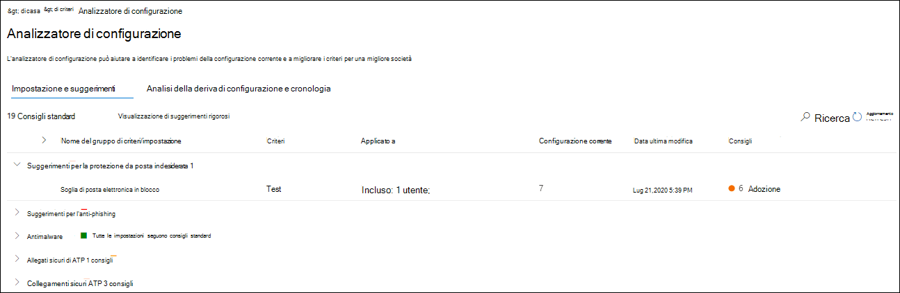
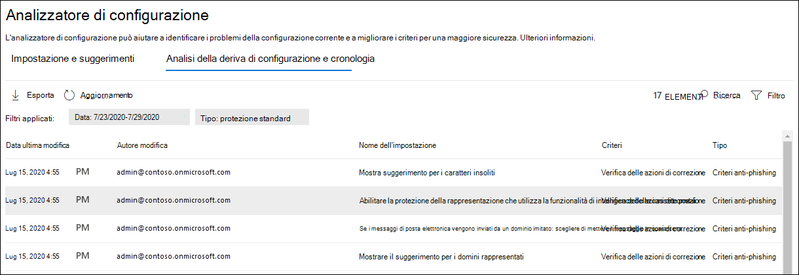

# Analizzatore della configurazione per i criteri di protezione in EOP e Microsoft Defender per Office 365Configuration analyzer for protection policies in EOP and Microsoft Defender for Office 365

[!INCLUDE [Microsoft 365 Defender rebranding](../includes/microsoft-defender-for-office.md)]

**Si applica a****Applies to**
- [Exchange Online ProtectionExchange Online Protection](exchange-online-protection-overview.md)
- [Microsoft Defender per Office 365 piano 1 e piano 2Microsoft Defender for Office 365 plan 1 and plan 2](defender-for-office-365.md)
- [Microsoft 365 DefenderMicrosoft 365 Defender](../defender/microsoft-365-defender.md)

L'analizzatore della configurazione nel portale di Microsoft 365 Defender offre una posizione centrale per trovare e correggere i criteri di sicurezza in cui le impostazioni sono al di sotto delle impostazioni di protezione standard e dei profili di protezione rigorosi nei criteri [di sicurezza preimpostati.](preset-security-policies.md)Configuration analyzer in the Microsoft 365 Defender portal provides a central location to find and fix security policies where the settings are below the Standard protection and Strict protection profile settings in [preset security policies](preset-security-policies.md).

L'analizzatore di configurazione analizza i seguenti tipi di criteri:The following types of policies are analyzed by the configuration analyzer:

- **Exchange Online Protection (EOP):** sono incluse Microsoft 365 con cassette postali Exchange Online e organizzazioni EOP autonome senza Exchange Online cassette postali:**Exchange Online Protection (EOP) policies**: This includes Microsoft 365 organizations with Exchange Online mailboxes and standalone EOP organizations without Exchange Online mailboxes:

  - [Criteri di protezione da posta indesiderata](configure-your-spam-filter-policies.md).[Anti-spam policies](configure-your-spam-filter-policies.md).
  - [Criteri antimalware](configure-anti-malware-policies.md).[Anti-malware policies](configure-anti-malware-policies.md).
  - [Criteri anti-phishing EOP](set-up-anti-phishing-policies.md#spoof-settings).[EOP anti-phishing policies](set-up-anti-phishing-policies.md#spoof-settings).

- **Microsoft Defender per Office 365** criteri : sono incluse le organizzazioni con Microsoft 365 E5 o Defender per Office 365 di componenti aggiuntivi:**Microsoft Defender for Office 365 policies**: This includes organizations with Microsoft 365 E5 or Defender for Office 365 add-on subscriptions:

  - Criteri anti-phishing in Microsoft Defender per Office 365, che includono:Anti-phishing policies in Microsoft Defender for Office 365, which include:
    - Le stesse [impostazioni di spoofing](set-up-anti-phishing-policies.md#spoof-settings) disponibili nei criteri anti-phishing di EOP.The same [spoof settings](set-up-anti-phishing-policies.md#spoof-settings) that are available in the EOP anti-phishing policies.
    - [Impostazioni di rappresentazioneImpersonation settings](set-up-anti-phishing-policies.md#impersonation-settings-in-anti-phishing-policies-in-microsoft-defender-for-office-365)
    - [Soglie di phishing avanzateAdvanced phishing thresholds](set-up-anti-phishing-policies.md#advanced-phishing-thresholds-in-anti-phishing-policies-in-microsoft-defender-for-office-365)
  - [Criteri collegamenti sicuri](set-up-safe-links-policies.md).[Safe Links policies](set-up-safe-links-policies.md).
  - [Criteri allegati sicuri](set-up-safe-attachments-policies.md).[Safe Attachments policies](set-up-safe-attachments-policies.md).

I **valori delle** impostazioni dei criteri Standard e **Strict** utilizzati come baseline sono descritti in Impostazioni consigliate per EOP e Microsoft Defender per la Office 365 [sicurezza](recommended-settings-for-eop-and-office365.md).The **Standard** and **Strict** policy setting values that are used as baselines are described in [Recommended settings for EOP and Microsoft Defender for Office 365 security](recommended-settings-for-eop-and-office365.md).

## Che cosa è necessario sapere prima di iniziareWhat do you need to know before you begin?

- Aprire il portale Microsoft 365 Defender all'indirizzo <https://security.microsoft.com> .You open the Microsoft 365 Defender portal at <https://security.microsoft.com>. Per passare direttamente alla pagina **dell'analizzatore della** configurazione, utilizzare <https://security.microsoft.com/configurationAnalyzer> .To go directly to the **Configuration analyzer** page, use <https://security.microsoft.com/configurationAnalyzer>.

- Per informazioni su come connettersi a PowerShell per Exchange Online, vedere [Connettersi a PowerShell per Exchange Online](/powershell/exchange/connect-to-exchange-online-powershell).To connect to Exchange Online PowerShell, see [Connect to Exchange Online PowerShell](/powershell/exchange/connect-to-exchange-online-powershell).

- Per eseguire le procedure descritte in questo articolo, è necessario disporre delle autorizzazioni nel portale di Microsoft 365 Defender:You need to be assigned permissions in the Microsoft 365 Defender portal before you can do the procedures in this article:
  - Per utilizzare l'analizzatore **della configurazione** e apportare aggiornamenti ai criteri di sicurezza, è necessario essere membri dei gruppi **di** ruoli Gestione organizzazione o Amministratore **sicurezza.**To use the configuration analyzer **and** make updates to security policies, you need to be a member of the **Organization Management** or **Security Administrator** role groups.
  - Per l'accesso in sola lettura all'analizzatore di configurazione, è necessario essere membri dei gruppi di ruoli **Lettore** globale o **Lettore** di sicurezza.For read-only access to the configuration analyzer, you need to be a member of the **Global Reader** or **Security Reader** role groups.

  Per ulteriori informazioni, vedere [Autorizzazioni nel portale Microsoft 365 Defender.](permissions-microsoft-365-security-center.md)For more information, see [Permissions in the Microsoft 365 Defender portal](permissions-microsoft-365-security-center.md).

  > [!NOTE]
  >  
  > - L'aggiunta di utenti al ruolo di Azure Active Directory corrispondente offre agli utenti  le autorizzazioni necessarie nel portale di Microsoft 365 Defender e le autorizzazioni per altre funzionalità di Microsoft 365.Adding users to the corresponding Azure Active Directory role gives users the required permissions in the Microsoft 365 Defender portal _and_ permissions for other features in Microsoft 365. Per altre informazioni, vedere [Informazioni sui ruoli di amministratore](../../admin/add-users/about-admin-roles.md).For more information, see [About admin roles](../../admin/add-users/about-admin-roles.md).
  >
  > - Anche il gruppo di ruoli di **Gestione organizzazione sola visualizzazione** in [Exchange Online](/Exchange/permissions-exo/permissions-exo#role-groups) offre inoltre l'accesso di sola lettura a tale funzionalità.The **View-Only Organization Management** role group in [Exchange Online](/Exchange/permissions-exo/permissions-exo#role-groups) also gives read-only access to the feature.

## Usare l'analizzatore della configurazione nel portale Microsoft 365 DefenderUse the configuration analyzer in the Microsoft 365 Defender portal

Nel portale Microsoft 365 Defender passare alla sezione **Criteri** di collaborazione & di posta elettronica & criteri di minaccia Criteri modello \>  \>  \>  \> .In the Microsoft 365 Defender portal, go to **Email & collaboration** \> **Policies & rules** \> **Threat policies** \> **Templated policies** section \> **Configuration analyzer**.

La **pagina Analizzatore** configurazione include due schede principali:The **Configuration analyzer** page has two main tabs:

- **Impostazioni e suggerimenti**: è possibile selezionare **Standard** o **Strict** e confrontare tali impostazioni con i criteri di sicurezza esistenti.**Settings and recommendations**: You pick **Standard** or **Strict** and compare those settings to your existing security policies. Nei risultati puoi modificare i valori delle impostazioni per portarli allo stesso livello di Standard o Strict.In the results, you can adjust the values of your settings to bring them up to the same level as Standard or Strict.
- **Analisi e cronologia della deriva della configurazione**: questa visualizzazione consente di tenere traccia delle modifiche apportate ai criteri nel tempo.**Configuration drift analysis and history**: This view allows you to track policy changes over time.

### Scheda Impostazioni e suggerimenti nell'analizzatore della configurazioneSetting and recommendations tab in the configuration analyzer

Per impostazione predefinita, la scheda viene aperta nel confronto con il profilo di protezione standard.By default, the tab opens on the comparison to the Standard protection profile. È possibile passare al confronto del profilo di protezione Strict selezionando **Visualizza suggerimenti rigorosi.**You can switch to the comparison of the Strict protection profile by selecting **View Strict recommendations**. Per tornare indietro, selezionare **Visualizza suggerimenti standard.**To switch back, select **View Standard recommendations**.

Per impostazione predefinita, la colonna Nome **gruppo/impostazione** criteri contiene una visualizzazione compressa dei diversi tipi di criteri di sicurezza e del numero di impostazioni che devono essere migliorate (se presenti).By default, the **Policy group/setting name** column contains a collapsed view of the different types of security policies and the number of settings that need improvement (if any). I tipi di criteri sono:The types of policies are:

- **Protezione da posta indesiderata****Anti-spam**
- **Anti-phishing****Anti-phishing**
- **Antimalware****Anti-malware**
- **Allegati sicuri** (se l'abbonamento include Microsoft Defender per Office 365)**Safe Attachments** (if your subscription includes Microsoft Defender for Office 365)
- **Collegamenti sicuri** (se l'abbonamento include Microsoft Defender per Office 365)**Safe Links** (if your subscription includes Microsoft Defender for Office 365)

Nella visualizzazione predefinita, tutto è compresso.In the default view, everything is collapsed. Accanto a ogni criterio, è presente un riepilogo dei risultati del confronto dei criteri (che è possibile modificare) e delle impostazioni nei criteri corrispondenti per i profili di protezione Standard o Strict (che non è possibile modificare).Next to each policy, there's a summary of comparison results from your policies (which you can modify) and the settings in the corresponding policies for the Standard or Strict protection profiles (which you can't modify). Verranno visualizzate le informazioni seguenti per il profilo di protezione con cui si sta confrontando:You'll see the following information for the protection profile that you're comparing to:

- **Verde**: tutte le impostazioni in tutti i criteri esistenti sono almeno sicure quanto il profilo di protezione.**Green**: All settings in all existing policies are at least as secure as the protection profile.
- **Ambra:** un numero limitato di impostazioni nei criteri esistenti non è sicuro quanto il profilo di protezione.**Amber**: A small number of settings in the existing policies are not as secure as the protection profile.
- **Rosso:** un numero significativo di impostazioni nei criteri esistenti non è sicuro quanto il profilo di protezione.**Red**: A significant number of settings in the existing policies are not as secure as the protection profile. Potrebbe trattarsi di alcune impostazioni in molti criteri o di molte impostazioni in un criterio.This could be a few settings in many policies or many settings in one policy.

Per i confronti più vantaggiosi, verrà visualizzato il testo: **Tutte le impostazioni seguono i** \<**Standard** or **Strict**\> **suggerimenti.**For favorable comparisons, you'll see the text: **All settings follow** \<**Standard** or **Strict**\> **recommendations**. In caso contrario, verrà visualizzato il numero di impostazioni consigliate da modificare.Otherwise, you'll see the number of recommended settings to change.

Se espandi Nome **gruppo/impostazione** criteri, vengono rivelati tutti i criteri e le impostazioni associate in ogni criterio specifico che richiede attenzione.If you expand **Policy group/setting name**, all of the policies and the associated settings in each specific policy that require attention are revealed. In caso contrario, è possibile espandere un tipo specifico di criteri (ad **esempio,** Protezione da posta indesiderata) per visualizzare solo le impostazioni in questi tipi di criteri che richiedono attenzione.Or, you can expand a specific type of policy (for example, **Anti-spam**) to see just those settings in those types of policies that require your attention.

Se il confronto non contiene suggerimenti per il miglioramento (verde), l'espansione del criterio non rivela nulla.If the comparison has no recommendations for improvement (green), expanding the policy reveals nothing. Se sono presenti diversi suggerimenti per il miglioramento (ambra o rosso), vengono visualizzate le impostazioni che richiedono attenzione e le informazioni corrispondenti vengono visualizzate nelle colonne seguenti:If there are any number of recommendations for improvement (amber or red), the settings that require attention are revealed, and corresponding information is revealed in the following columns:

- **Nome gruppo/impostazione criteri**: Nome dell'impostazione che richiede l'attenzione dell'utente.**Policy group/setting name**: The name of the setting that requires your attention. Ad esempio, nello screenshot precedente, si tratta delle impostazioni nel criterio di protezione da posta indesiderata predefinito.For example, in the previous screenshot, it's the settings in the default anti-spam policy.
- **Criterio**: nome del criterio interessato che contiene l'impostazione.**Policy**: The name of the affected policy that contains the setting.
- **Applicato a**: Numero di utenti a cui vengono applicati i criteri interessati.**Applied to**: The number of users that the affected policies are applied to.
- **Configurazione corrente**: valore corrente dell'impostazione.**Current configuration**: The current value of the setting. Per il criterio predefinito di quel tipo che si applica a tutti i destinatari, questo valore è vuoto.For the default policy of that type that applies to all recipients, this value is blank.
- **Last modified**: Data dell'ultima modifica del criterio.**Last modified**: The date that the policy was last modified.
- **Consigli**: Valore dell'impostazione nel profilo di protezione Standard o Strict.**Recommendations**: The value of the setting in the Standard or Strict protection profile. Per modificare il valore dell'impostazione nel criterio in modo che corrisponda al valore consigliato nel profilo di protezione, fare clic su **Adotta**.To change the value of the setting in your policy to match the recommended value in the protection profile, click **Adopt**. Se la modifica ha esito positivo, verrà visualizzato il messaggio: Consigli **adottato correttamente**.If the change is successful, you'll see the message: **Recommendations successfully adopted**. Fare **clic su** Aggiorna per visualizzare il numero ridotto di suggerimenti e la rimozione della riga di impostazione/criterio specifica dai risultati.Click **Refresh** to see the reduced number of recommendations, and the removal of the specific setting/policy row from the results.

### Scheda Analisi e cronologia della deriva della configurazione nell'analizzatore della configurazioneConfiguration drift analysis and history tab in the configuration analyzer

Questa scheda consente di tenere traccia delle modifiche apportate ai criteri di sicurezza personalizzati.This tab allows you to track the changes that you've made to your custom security policies. Per impostazione predefinita, vengono visualizzate le informazioni seguenti:By default, the following information is displayed:

- **Data ultima modifica****Last modified**
- **Modificato da****Modified by**
- **Nome impostazione****Setting Name**
- **Criterio****Policy**
- **Type****Type**
- **Modifica apportata alla configurazione****Configuration change**
- **Deriva della configurazione**: il valore **Aumenta** o **Diminuisci**.**Configuration drift**: The value **Increase** or **Decrease**.

Per filtrare i risultati, selezionare **Filtro**.To filter the results, click **Filter**. Nel riquadro **a** comparsa Filtri visualizzato è possibile selezionare uno dei filtri seguenti:In the **Filters** flyout that appears, you can select from the following filters:

- **Ora inizio** e **Ora fine** (data)**Start time** and **End time** (date)
- **Protezione standard** o **Protezione rigida****Standard protection** or **Strict protection**

Per esportare i risultati in un file .csv, fare clic su **Esporta.**To export the results to a .csv file, click **Export**.

