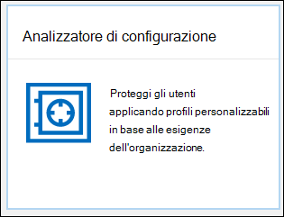

# Analizzatore di configurazione per i criteri di protezione in EOP e Microsoft Defender per Office 365

[!INCLUDE [Microsoft 365 Defender rebranding](../includes/microsoft-defender-for-office.md)]

> [!NOTE]
> Le funzionalità descritte in questo argomento sono in anteprima, non sono disponibili in tutte le organizzazioni e sono soggette a modifiche. Per informazioni sulla pianificazione dei rilasci, vedere la Guida di [orientamento di Microsoft 365](https://www.microsoft.com/microsoft-365/roadmap?filters=&searchterms=config%2Canalyzer).

Analizzatore di configurazione nel centro sicurezza & conformità fornisce una posizione centrale per individuare e correggere i criteri di sicurezza in cui le impostazioni sono al di sotto delle impostazioni di protezione standard e del profilo di protezione rigido nei [criteri di sicurezza preimpostati](preset-security-policies.md).

I seguenti tipi di criteri vengono analizzati dall'analizzatore della configurazione:

- **Criteri di Exchange Online Protection (EOP)**: sono incluse le organizzazioni Microsoft 365 con le cassette postali di Exchange Online e le organizzazioni EOP autonome senza cassette postali di Exchange Online:
  
  - [Criteri di protezione da posta indesiderata](configure-your-spam-filter-policies.md).
  - [Criteri anti-malware](configure-anti-malware-policies.md).
  - [Criteri di anti-phishing di EOP](set-up-anti-phishing-policies.md#spoof-settings).

- **Microsoft Defender per i criteri di office 365**: include le organizzazioni con Microsoft 365 E5 o gli abbonamenti del componente aggiuntivo Defender per Office 365:

  - Criteri di anti-phishing in Microsoft Defender per Office 365, che includono:

    - Le stesse [impostazioni di spoofing](set-up-anti-phishing-policies.md#spoof-settings) disponibili nei criteri di anti-phishing di EOP.
    - [Impostazioni di rappresentazione](set-up-anti-phishing-policies.md#impersonation-settings-in-anti-phishing-policies-in-microsoft-defender-for-office-365)
    - [Soglie di phishing avanzate](set-up-anti-phishing-policies.md#advanced-phishing-thresholds-in-anti-phishing-policies-in-microsoft-defender-for-office-365)

  - [Criteri collegamenti sicuri](set-up-atp-safe-links-policies.md).

  - [Criteri allegati sicuri](set-up-atp-safe-attachments-policies.md).

I valori di impostazione dei criteri **standard** e **rigorosi** utilizzati come linee di base sono descritti in [impostazioni consigliate per EOP e Microsoft Defender per la sicurezza di Office 365](recommended-settings-for-eop-and-office365-atp.md).

## Che cosa è necessario sapere prima di iniziare

- Aprire il Centro sicurezza e conformità in <https://protection.office.com/>. Per passare direttamente alla pagina dell' **analizzatore** dell'utilità di configurazione, utilizzare <https://protection.office.com/configurationAnalyzer> .

- Per informazioni su come connettersi a PowerShell per Exchange Online, vedere [Connettersi a PowerShell per Exchange Online](https://docs.microsoft.com/powershell/exchange/connect-to-exchange-online-powershell).

- Prima di poter eseguire le procedure descritte in questo articolo, è necessario disporre delle autorizzazioni per il Centro sicurezza & Compliance:
  - Per utilizzare l'analizzatore di configurazione **e** aggiornare i criteri di sicurezza, è necessario essere membri dei gruppi di ruoli **Gestione organizzazione** o **amministratore sicurezza** .
  - Per l'accesso in sola lettura all'analizzatore di configurazione, è necessario essere membri dei gruppi di ruoli **lettore globale** o lettore di **sicurezza** .

  Per altre informazioni, vedere [Autorizzazioni nel Centro sicurezza e conformità](permissions-in-the-security-and-compliance-center.md).

  **Note**:

  - L'aggiunta di utenti al ruolo di Azure Active Directory corrispondente nell'interfaccia di amministrazione di Microsoft 365 fornisce agli utenti le autorizzazioni necessarie per il Centro sicurezza & Compliance _e_ le autorizzazioni per altre funzionalità di Microsoft 365. Per altre informazioni, vedere [Informazioni sui ruoli di amministratore](https://docs.microsoft.com/microsoft-365/admin/add-users/about-admin-roles).
  - Il gruppo di ruoli di **gestione dell'organizzazione di sola visualizzazione** in [Exchange Online](https://docs.microsoft.com/Exchange/permissions-exo/permissions-exo#role-groups) fornisce anche l'accesso in sola lettura alla funzionalità.

## Utilizzare l'analizzatore di configurazione nel centro sicurezza & Compliance

Nel centro sicurezza & conformità, accedere a **Threat management** \> **Policy** \> **analizzatore configurazione** criteri di gestione delle minacce.

L'analizzatore di configurazione dispone di due schede principali:

- **Impostazioni e suggerimenti**: si seleziona standard o Strict e si confrontano tali impostazioni con i criteri di sicurezza esistenti. Nei risultati, è possibile modificare i valori delle impostazioni per riportarli allo stesso livello di standard o Strict.

- **Analisi della deriva di configurazione e cronologia**: questa visualizzazione consente di monitorare le modifiche dei criteri nel tempo.

### Scheda Impostazioni e suggerimenti nell'analizzatore di configurazione

Per impostazione predefinita, la scheda viene visualizzata nel confronto con il profilo di protezione standard. È possibile passare al confronto del profilo di protezione rigoroso facendo clic su **Visualizza suggerimenti rigorosi**. Per tornare indietro, selezionare **Visualizza suggerimenti standard**.

Per impostazione predefinita, la colonna **gruppo di criteri/Nome impostazione** contiene una visualizzazione compressa dei diversi tipi di criteri di sicurezza e il numero di impostazioni che devono essere migliorate (se presenti). I tipi di criteri sono:

- **Protezione da posta indesiderata**
- **Anti-phishing**
- **Anti-malware**
- **Allegati sicuri ATP** (se l'abbonamento include Microsoft Defender per Office 365)
- **Collegamenti sicuri ATP** (se l'abbonamento include Microsoft Defender per Office 365)

Nella visualizzazione predefinita, tutto è compresso. Accanto a ogni criterio, è disponibile un riepilogo dei risultati del confronto tra i criteri (che è possibile modificare) e le impostazioni nei criteri corrispondenti per i profili di protezione standard o rigorosi (che non è possibile modificare). Verranno visualizzate le informazioni seguenti per il profilo di protezione a cui si sta eseguendo il confronto:

- **Verde**: tutte le impostazioni di tutti i criteri esistenti sono almeno altrettanto sicure del profilo di protezione.
- **Ambra**: un numero limitato di impostazioni nei criteri esistenti non è più sicuro del profilo di protezione.
- **Rosso**: un numero significativo di impostazioni nei criteri esistenti non è più sicuro del profilo di protezione. Questo potrebbe essere un paio di impostazioni in molti criteri o in molte impostazioni di un criterio.

Per i confronti favorevoli, viene visualizzato il testo: **tutte le impostazioni seguono** i \<**Standard** or **Strict**\> **suggerimenti**. In caso contrario, verrà visualizzato il numero di impostazioni consigliate da modificare.

Se si espande il **nome del gruppo di criteri/impostazione**, vengono rivelati tutti i criteri e le impostazioni associate in ogni criterio specifico che richiede attenzione. In alternativa, è possibile espandere un tipo specifico di criteri, ad esempio la protezione da **posta indesiderata**, per visualizzare solo tali impostazioni in quei tipi di criteri che richiedono attenzione.

Se il confronto non ha suggerimenti per il miglioramento (verde), l'espansione del criterio non rivela nulla. Se è presente un numero qualsiasi di suggerimenti per il miglioramento (ambra o rosso), vengono rivelate le impostazioni che richiedono attenzione e vengono riportate le informazioni corrispondenti nelle colonne seguenti:

- Nome dell'impostazione che richiede attenzione. Ad esempio, nella schermata precedente, è la soglia di **posta elettronica in blocco** in un criterio di protezione da posta indesiderata.

- **Policy**: il nome del criterio coinvolto che contiene l'impostazione.

- **Applicato a**: il numero di utenti a cui sono applicati i criteri coinvolti.

- **Configurazione corrente**: valore corrente dell'impostazione.

- **Last modified**: la data in cui è stato modificato l'ultima volta il criterio.

- **Suggerimenti**: il valore dell'impostazione nel profilo di protezione standard o rigoroso. Per modificare il valore dell'impostazione del criterio in modo che corrisponda al valore consigliato nel profilo di protezione, fare clic su **adotta**. Se la modifica ha esito positivo, verrà visualizzato il messaggio: **suggerimenti adottati correttamente**. Fare clic su **Aggiorna** per visualizzare il numero ridotto di suggerimenti e la rimozione della riga specifica dell'impostazione o dei criteri dai risultati.

### Scheda cronologia e analisi della deriva di configurazione nell'analizzatore di configurazione

Questa scheda consente di monitorare le modifiche apportate ai criteri di sicurezza personalizzati. Per impostazione predefinita, vengono visualizzate le seguenti informazioni:

- **Data ultima modifica**
- **Modificato da**
- **Nome dell'impostazione**
- **Criterio**
- **Type**

Per filtrare i risultati, selezionare **Filtro**. Nel riquadro a comparsa **filtri** che viene visualizzato, è possibile scegliere tra i filtri seguenti:

- **Ora di inizio** e **ora di fine** (Data)
- **Protezione standard** o **protezione rigorosa**

Per esportare i risultati in un file CSV, fare clic su **Esporta**.

