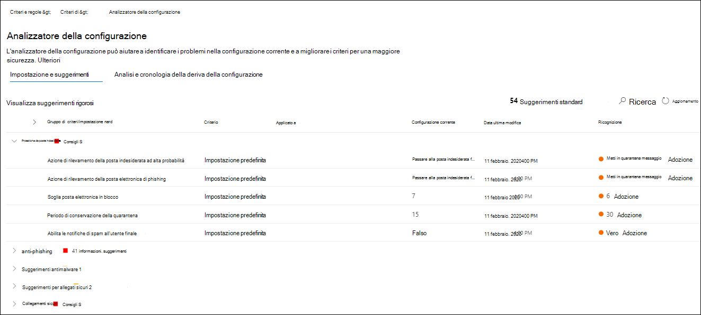
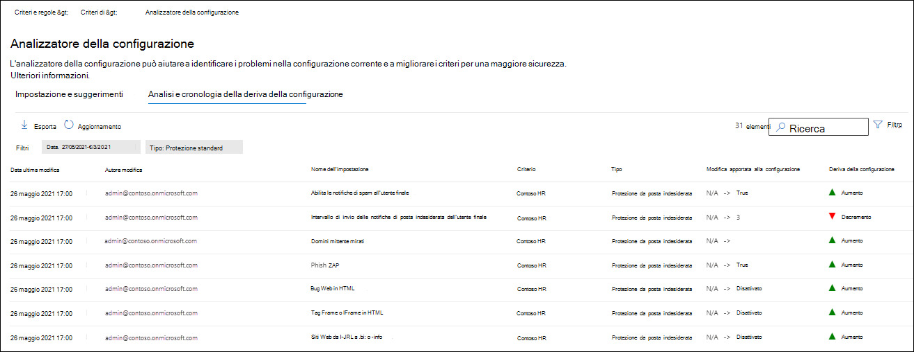

# Analizzatore di configurazione per i criteri di protezione in EOP e Microsoft Defender per Office 365Configuration analyzer for protection policies in EOP and Microsoft Defender for Office 365

[!INCLUDE [Microsoft 365 Defender rebranding](../includes/microsoft-defender-for-office.md)]

Analizzatore di configurazione nel centro sicurezza & conformità fornisce una posizione centrale per individuare e correggere i criteri di sicurezza in cui le impostazioni sono al di sotto delle impostazioni di protezione standard e del profilo di protezione rigido nei [criteri di sicurezza preimpostati](preset-security-policies.md).Configuration analyzer in the Security & Compliance center provides a central location to find and fix security policies where the settings are below the Standard protection and Strict protection profile settings in [preset security policies](preset-security-policies.md).

I seguenti tipi di criteri vengono analizzati dall'analizzatore della configurazione:The following types of policies are analyzed by the configuration analyzer:

- **Criteri di Exchange Online Protection (EOP)**: sono incluse le organizzazioni Microsoft 365 con le cassette postali di Exchange Online e le organizzazioni EOP autonome senza cassette postali di Exchange Online:**Exchange Online Protection (EOP) policies**: This includes Microsoft 365 organizations with Exchange Online mailboxes and standalone EOP organizations without Exchange Online mailboxes:

  - [Criteri di protezione da posta indesiderata](configure-your-spam-filter-policies.md).[Anti-spam policies](configure-your-spam-filter-policies.md).
  - [Criteri anti-malware](configure-anti-malware-policies.md).[Anti-malware policies](configure-anti-malware-policies.md).
  - [Criteri di anti-phishing di EOP](set-up-anti-phishing-policies.md#spoof-settings).[EOP Anti-phishing policies](set-up-anti-phishing-policies.md#spoof-settings).

- **Microsoft Defender per i criteri di office 365**: include le organizzazioni con Microsoft 365 E5 o gli abbonamenti del componente aggiuntivo Defender per Office 365:**Microsoft Defender for Office 365 policies**: This includes organizations with Microsoft 365 E5 or Defender for Office 365 add-on subscriptions:

  - Criteri di anti-phishing in Microsoft Defender per Office 365, che includono:Anti-phishing policies in Microsoft Defender for Office 365, which include:

    - Le stesse [impostazioni di spoofing](set-up-anti-phishing-policies.md#spoof-settings) disponibili nei criteri di anti-phishing di EOP.The same [spoof settings](set-up-anti-phishing-policies.md#spoof-settings) that are available in the EOP anti-phishing policies.
    - [Impostazioni di rappresentazioneImpersonation settings](set-up-anti-phishing-policies.md#impersonation-settings-in-anti-phishing-policies-in-microsoft-defender-for-office-365)
    - [Soglie di phishing avanzateAdvanced phishing thresholds](set-up-anti-phishing-policies.md#advanced-phishing-thresholds-in-anti-phishing-policies-in-microsoft-defender-for-office-365)

  - [Criteri collegamenti sicuri](set-up-atp-safe-links-policies.md).[Safe Links policies](set-up-atp-safe-links-policies.md).

  - [Criteri allegati sicuri](set-up-atp-safe-attachments-policies.md).[Safe Attachments policies](set-up-atp-safe-attachments-policies.md).

I valori di impostazione dei criteri **standard** e **rigorosi** utilizzati come linee di base sono descritti in [impostazioni consigliate per EOP e Microsoft Defender per la sicurezza di Office 365](recommended-settings-for-eop-and-office365-atp.md).The **Standard** and **Strict** policy setting values that are used as baselines are described in [Recommended settings for EOP and Microsoft Defender for Office 365 security](recommended-settings-for-eop-and-office365-atp.md).

## Che cosa è necessario sapere prima di iniziareWhat do you need to know before you begin?

- Aprire il Centro sicurezza e conformità in<https://protection.office.com/>.You open the Security & Compliance Center at <https://protection.office.com/>. Per passare direttamente alla pagina dell' **analizzatore** dell'utilità di configurazione, utilizzare <https://protection.office.com/configurationAnalyzer> .To go directly to the **Configuration analyzer** page, use <https://protection.office.com/configurationAnalyzer>.

- Per informazioni su come connettersi a PowerShell per Exchange Online, vedere [Connettersi a PowerShell per Exchange Online](https://docs.microsoft.com/powershell/exchange/connect-to-exchange-online-powershell).To connect to Exchange Online PowerShell, see [Connect to Exchange Online PowerShell](https://docs.microsoft.com/powershell/exchange/connect-to-exchange-online-powershell).

- È necessario disporre delle autorizzazioni nel Centro sicurezza e conformità per poter eseguire le procedure contenute in questo articolo:You need to be assigned permissions in the Security & Compliance Center before you can do the procedures in this article:
  - Per utilizzare l'analizzatore di configurazione **e** aggiornare i criteri di sicurezza, è necessario essere membri dei gruppi di ruoli **Gestione organizzazione** o **amministratore sicurezza** .To use the configuration analyzer **and** make updates to security policies, you need to be a member of the **Organization Management** or **Security Administrator** role groups.
  - Per l'accesso in sola lettura all'analizzatore di configurazione, è necessario essere membri dei gruppi di ruoli **lettore globale** o lettore di **sicurezza** .For read-only access to the configuration analyzer, you need to be a member of the **Global Reader** or **Security Reader** role groups.

  Per altre informazioni, vedere [Autorizzazioni nel Centro sicurezza e conformità](permissions-in-the-security-and-compliance-center.md).For more information, see [Permissions in the Security & Compliance Center](permissions-in-the-security-and-compliance-center.md).

  > [!NOTE]
  >  
  > - L'aggiunta di utenti al ruolo di Azure Active Directory corrispondente nell'interfaccia di amministrazione di Microsoft 365 fornisce agli utenti le autorizzazioni necessarie nel centro Sicurezza e conformità _e_ le autorizzazioni per altre funzionalità di Microsoft 365.Adding users to the corresponding Azure Active Directory role in the Microsoft 365 admin center gives users the required permissions in the Security & Compliance Center _and_ permissions for other features in Microsoft 365. Per altre informazioni, vedere [Informazioni sui ruoli di amministratore](https://docs.microsoft.com/microsoft-365/admin/add-users/about-admin-roles).For more information, see [About admin roles](https://docs.microsoft.com/microsoft-365/admin/add-users/about-admin-roles).
  > 
  > - Anche il gruppo di ruoli di **Gestione organizzazione sola visualizzazione** in [Exchange Online](https://docs.microsoft.com/Exchange/permissions-exo/permissions-exo#role-groups) offre inoltre l'accesso di sola lettura a tale funzionalità.The **View-Only Organization Management** role group in [Exchange Online](https://docs.microsoft.com/Exchange/permissions-exo/permissions-exo#role-groups) also gives read-only access to the feature.

## Utilizzare l'analizzatore di configurazione nel centro sicurezza & ComplianceUse the configuration analyzer in the Security & Compliance Center

Nel centro sicurezza & conformità, accedere a  \>  \> **analizzatore configurazione** criteri di gestione delle minacce.In the Security & Compliance Center, go to **Threat management** \> **Policy** \> **Configuration analyzer**.

L'analizzatore di configurazione dispone di due schede principali:The configuration analyzer has two main tabs:

- **Impostazioni e suggerimenti**: si seleziona standard o Strict e si confrontano tali impostazioni con i criteri di sicurezza esistenti.**Settings and recommendations**: You pick Standard or Strict and compare those settings to your existing security policies. Nei risultati, è possibile modificare i valori delle impostazioni per riportarli allo stesso livello di standard o Strict.In the results, you can adjust the values of your settings to bring them up to the same level as Standard or Strict.

- **Analisi della deriva di configurazione e cronologia**: questa visualizzazione consente di monitorare le modifiche dei criteri nel tempo.**Configuration drift analysis and history**: This view allows you to track policy changes over time.

### Scheda Impostazioni e suggerimenti nell'analizzatore di configurazioneSetting and recommendations tab in the configuration analyzer

Per impostazione predefinita, la scheda viene visualizzata nel confronto con il profilo di protezione standard.By default, the tab opens on the comparison to the Standard protection profile. È possibile passare al confronto del profilo di protezione rigoroso facendo clic su **Visualizza suggerimenti rigorosi**.You can switch to the comparison of the Strict protection profile by clicking **View Strict recommendations**. Per tornare indietro, selezionare **Visualizza suggerimenti standard**.To switch back, select **View Standard recommendations**.

Per impostazione predefinita, la colonna **gruppo di criteri/Nome impostazione** contiene una visualizzazione compressa dei diversi tipi di criteri di sicurezza e il numero di impostazioni che devono essere migliorate (se presenti).By default, the **Policy group/setting name** column contains a collapsed view of the different types of security policies and the number of settings that need improvement (if any). I tipi di criteri sono:The types of policies are:

- **Protezione da posta indesiderata****Anti-spam**
- **Anti-phishing****Anti-phishing**
- **Anti-malware****Anti-malware**
- **Allegati sicuri ATP** (se l'abbonamento include Microsoft Defender per Office 365)**ATP Safe Attachments** (if your subscription includes Microsoft Defender for Office 365)
- **Collegamenti sicuri ATP** (se l'abbonamento include Microsoft Defender per Office 365)**ATP Safe Links** (if your subscription includes Microsoft Defender for Office 365)

Nella visualizzazione predefinita, tutto è compresso.In the default view, everything is collapsed. Accanto a ogni criterio, è disponibile un riepilogo dei risultati del confronto tra i criteri (che è possibile modificare) e le impostazioni nei criteri corrispondenti per i profili di protezione standard o rigorosi (che non è possibile modificare).Next to each policy, there's a summary of comparison results from your policies (which you can modify) and the settings in the corresponding policies for the Standard or Strict protection profiles (which you can't modify). Verranno visualizzate le informazioni seguenti per il profilo di protezione a cui si sta eseguendo il confronto:You'll see the following information for the protection profile that you're comparing to:

- **Verde**: tutte le impostazioni di tutti i criteri esistenti sono almeno altrettanto sicure del profilo di protezione.**Green**: All settings in all existing policies are at least as secure as the protection profile.
- **Ambra**: un numero limitato di impostazioni nei criteri esistenti non è più sicuro del profilo di protezione.**Amber**: A small number of settings in the existing policies are not as secure as the protection profile.
- **Rosso**: un numero significativo di impostazioni nei criteri esistenti non è più sicuro del profilo di protezione.**Red**: A significant number of settings in the existing policies are not as secure as the protection profile. Questo potrebbe essere un paio di impostazioni in molti criteri o in molte impostazioni di un criterio.This could be a few settings in many policies or many settings in one policy.

Per i confronti favorevoli, viene visualizzato il testo: **tutte le impostazioni seguono** i \<**Standard** or **Strict**\> **suggerimenti**.For favorable comparisons, you'll see the text: **All settings follow** \<**Standard** or **Strict**\> **recommendations**. In caso contrario, verrà visualizzato il numero di impostazioni consigliate da modificare.Otherwise, you'll see the number of recommended settings to change.

Se si espande il **nome del gruppo di criteri/impostazione**, vengono rivelati tutti i criteri e le impostazioni associate in ogni criterio specifico che richiede attenzione.If you expand **Policy group/setting name**, all of the policies and the associated settings in each specific policy that require attention are revealed. In alternativa, è possibile espandere un tipo specifico di criteri, ad esempio la protezione da **posta indesiderata**, per visualizzare solo tali impostazioni in quei tipi di criteri che richiedono attenzione.Or, you can expand a specific type of policy (for example, **Anti-spam**) to see just those settings in those types of policies that require your attention.

Se il confronto non ha suggerimenti per il miglioramento (verde), l'espansione del criterio non rivela nulla.If the comparison has no recommendations for improvement (green), expanding the policy reveals nothing. Se è presente un numero qualsiasi di suggerimenti per il miglioramento (ambra o rosso), vengono rivelate le impostazioni che richiedono attenzione e vengono riportate le informazioni corrispondenti nelle colonne seguenti:If there are any number of recommendations for improvement (amber or red), the settings that require attention are revealed, and corresponding information is revealed in the following columns:

- Nome dell'impostazione che richiede attenzione.The name of the setting that requires your attention. Ad esempio, nella schermata precedente, è la soglia di **posta elettronica in blocco** in un criterio di protezione da posta indesiderata.For example, in the previous screenshot, it's the **Bulk email threshold** in an anti-spam policy.

- **Policy**: il nome del criterio coinvolto che contiene l'impostazione.**Policy**: The name of the affected policy that contains the setting.

- **Applicato a**: il numero di utenti a cui sono applicati i criteri coinvolti.**Applied to**: The number of users that the affected policies are applied to.

- **Configurazione corrente**: valore corrente dell'impostazione.**Current configuration**: The current value of the setting.

- **Last modified**: la data in cui è stato modificato l'ultima volta il criterio.**Last modified**: The date that the policy was last modified.

- **Suggerimenti**: il valore dell'impostazione nel profilo di protezione standard o rigoroso.**Recommendations**: The value of the setting in the Standard or Strict protection profile. Per modificare il valore dell'impostazione del criterio in modo che corrisponda al valore consigliato nel profilo di protezione, fare clic su **adotta**.To change the value of the setting in your policy to match the recommended value in the protection profile, click **Adopt**. Se la modifica ha esito positivo, verrà visualizzato il messaggio: **suggerimenti adottati correttamente**.If the change is successful, you'll see the message: **Recommendations successfully adopted**. Fare clic su **Aggiorna** per visualizzare il numero ridotto di suggerimenti e la rimozione della riga specifica dell'impostazione o dei criteri dai risultati.Click **Refresh** to see the reduced number of recommendations, and the removal of the specific setting/policy row from the results.

### Scheda cronologia e analisi della deriva di configurazione nell'analizzatore di configurazioneConfiguration drift analysis and history tab in the configuration analyzer

Questa scheda consente di monitorare le modifiche apportate ai criteri di sicurezza personalizzati.This tab allows you to track the changes that you've made to your custom security policies. Per impostazione predefinita, vengono visualizzate le seguenti informazioni:By default, the following information is displayed:

- **Data ultima modifica****Last modified**
- **Modificato da****Modified by**
- **Nome dell'impostazione****Setting Name**
- **Criterio****Policy**
- **Type****Type**

Per filtrare i risultati, selezionare **Filtro**.To filter the results, click **Filter**. Nel riquadro a comparsa **filtri** che viene visualizzato, è possibile scegliere tra i filtri seguenti:In the **Filters** flyout that appears, you can select from the following filters:

- **Ora di inizio** e **ora di fine** (Data)**Start time** and **End time** (date)
- **Protezione standard** o **protezione rigorosa****Standard protection** or **Strict protection**

Per esportare i risultati in un file CSV, fare clic su **Esporta**.To export the results to a .csv file, click **Export**.

