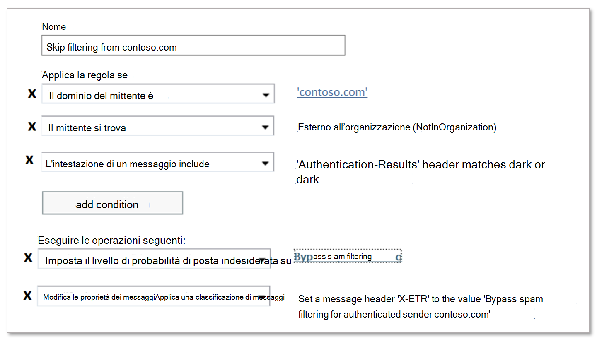

# Creare elenchi di mittenti attendibili in EOPCreate safe sender lists in EOP

[!INCLUDE [Microsoft 365 Defender rebranding](../includes/microsoft-defender-for-office.md)]

**Si applica a****Applies to**
- [Exchange Online ProtectionExchange Online Protection](https://go.microsoft.com/fwlink/?linkid=2148611)
- [Microsoft Defender per Office 365 piano 1 e piano 2Microsoft Defender for Office 365 plan 1 and plan 2](https://go.microsoft.com/fwlink/?linkid=2148715)
- [Microsoft 365 DefenderMicrosoft 365 Defender](https://go.microsoft.com/fwlink/?linkid=2118804)

Se si è un cliente di Microsoft 365 con cassette postali in Exchange Online o un cliente autonomo di Exchange Online Protection (EOP) senza cassette postali di Exchange Online, EOP offre diversi modi per garantire che gli utenti ricevano la posta elettronica da mittenti attendibili.If you're a Microsoft 365 customer with mailboxes in Exchange Online or a standalone Exchange Online Protection (EOP) customer without Exchange Online mailboxes, EOP offers multiple ways of ensuring that users will receive email from trusted senders. Queste opzioni includono le regole del flusso di posta di Exchange (note anche come regole di trasporto), i mittenti attendibili di Outlook, l'elenco indirizzi IP consentiti (filtro connessioni) e gli elenchi di mittenti consentiti o gli elenchi di domini consentiti nei criteri di protezione dalla posta indesiderata.These options include Exchange mail flow rules (also known as transport rules), Outlook Safe Senders, the IP Allow List (connection filtering), and allowed sender lists or allowed domain lists in anti-spam policies. Collettivamente, è possibile pensare a queste opzioni come _elenchi di mittenti attendibili._Collectively, you can think of these options as _safe sender lists_.

Gli elenchi di mittenti attendibili disponibili sono descritti nell'elenco seguente nell'ordine dal più consigliato al meno consigliato:The available safe sender lists are described in the following list in order from most recommended to least recommended:

1. Regole del flusso di postaMail flow rules
2. Mittenti attendibili di OutlookOutlook Safe Senders
3. Elenco indirizzi IP consentiti (filtro connessioni)IP Allow List (connection filtering)
4. Elenchi di mittenti consentiti o elenchi di domini consentiti (criteri di protezione da posta indesiderata)Allowed sender lists or allowed domain lists (anti-spam policies)

Le regole del flusso di posta consentono la massima flessibilità per garantire che siano consentiti solo i messaggi a destra.Mail flow rules allow the most flexibility to ensure that only the right messages are allowed. Gli elenchi di mittenti e domini consentiti nei criteri di protezione da posta indesiderata non sono sicuri come l'elenco indirizzi IP consentiti, perché il dominio di posta elettronica del mittente è facilmente contraffatto.Allowed sender and allowed domain lists in anti-spam policies aren't as secure as the IP Allow List, because the sender's email domain is easily spoofed. Tuttavia, anche l'elenco indirizzi IP consentiti rappresenta un rischio, perché la posta elettronica inviata da qualsiasi dominio inviato da tale indirizzo IP ignora il filtro di protezione da posta indesiderata. But, the IP Allow List also presents a risk, because email from _any_ domain that's sent from that IP address will bypass spam filtering.

> [!IMPORTANT]
>
> - Prestare attenzione a monitorare attentamente *eventuali eccezioni* apportate al filtro posta indesiderata utilizzando elenchi di mittenti attendibili.Be careful to closely monitor *any* exceptions that you make to spam filtering using safe sender lists.
>
> - Sebbene sia possibile utilizzare gli elenchi di mittenti attendibili per facilitare l'utilizzo di falsi positivi (messaggi di posta elettronica non sicuri contrassegnati come non attendibili), è consigliabile considerare l'utilizzo degli elenchi di mittenti attendibili come soluzione temporanea da evitare, se possibile.While you can use safe sender lists to help with false positives (good email marked as bad), you should consider the use of safe sender lists as a temporary solution that should be avoided if possible. Non è consigliabile gestire i falsi positivi utilizzando gli elenchi di mittenti attendibili, perché le eccezioni al filtro posta indesiderata possono aprire l'organizzazione allo spoofing e ad altri attacchi.We don't recommend managing false positives by using safe sender lists, because exceptions to spam filtering can open your organization to spoofing and other attacks. Se si insistono a utilizzare gli elenchi di mittenti attendibili per gestire i falsi positivi, è necessario essere in grado di segnalare messaggi e file a [Microsoft](report-junk-email-messages-to-microsoft.md) nell'argomento.If you insist on using safe sender lists to manage false positives, you need to be vigilant and keep the topic [Report messages and files to Microsoft](report-junk-email-messages-to-microsoft.md) at the ready.
>
> - Per consentire a un dominio di inviare messaggi di posta elettronica non autenticati (ignorare la protezione anti-spoofing) ma non di ignorare i controlli antispam e antimalware, è possibile aggiungerlo all'elenco Mittenti attendibili [AllowedToSpoof](walkthrough-spoof-intelligence-insight.md)To allow a domain to send unauthenticated email (bypass anti-spoofing protection) but not bypass anti-spam and anti-malware checks, you can add it to the [AllowedToSpoof safe sender list](walkthrough-spoof-intelligence-insight.md)
>
> - EOP e Outlook esaminano diverse proprietà del messaggio per determinare il mittente del messaggio.EOP and Outlook inspect different message properties to determine the sender of the message. Per ulteriori informazioni, vedere la sezione [Considerazioni per la posta elettronica in](#considerations-for-bulk-email) blocco più avanti in questo articolo.For more information, see the [Considerations for bulk email](#considerations-for-bulk-email) section later in this article.

Al contrario, sono disponibili diverse opzioni per bloccare la posta elettronica da origini specifiche tramite _elenchi di mittenti bloccati._In contrast, you also have several options to block email from specific sources using _blocked sender lists_. Per altre informazioni, vedere [Creare elenchi di mittenti bloccati in EOP](create-block-sender-lists-in-office-365.md).For more information, see [Create block sender lists in EOP](create-block-sender-lists-in-office-365.md).

## (Consigliato) Utilizzare le regole del flusso di posta(Recommended) Use mail flow rules

Le regole del flusso di posta in Exchange Online e in EOP autonomo utilizzano condizioni ed eccezioni per identificare i messaggi e azioni per specificare le operazioni da eseguire su tali messaggi.Mail flow rules in Exchange Online and standalone EOP use conditions and exceptions to identify messages, and actions to specify what should be done to those messages. Per ulteriori informazioni, vedere [Mail flow rules (transport rules) in Exchange Online](https://docs.microsoft.com/Exchange/security-and-compliance/mail-flow-rules/mail-flow-rules).For more information, see [Mail flow rules (transport rules) in Exchange Online](https://docs.microsoft.com/Exchange/security-and-compliance/mail-flow-rules/mail-flow-rules).

Nell'esempio seguente si presuppone che sia necessaria la posta contoso.com per ignorare il filtro posta indesiderata.The following example assumes you need email from contoso.com to skip spam filtering. A tale scopo, configurare le impostazioni seguenti:To do this, configure the following settings:

1. **Condizione:** **il dominio del** \> **mittente contoso.com.** \>**Condition**: **The sender** \> **domain is** \> contoso.com.

2. Configurare una delle impostazioni seguenti:Configure either of the following settings:

   - **Condizione della regola del flusso di posta**: **Un'intestazione** del messaggio include una \> **delle seguenti** \> **parole: Header name**: Header `Authentication-Results` \> **value**: or `dmarc=pass` `dmarc=bestguesspass` .**Mail flow rule condition**: **A message header** \> **includes any of these words** \> **Header name**: `Authentication-Results` \> **Header value**: `dmarc=pass` or `dmarc=bestguesspass`.

     Questa condizione controlla lo stato di autenticazione della posta elettronica del dominio di posta elettronica di invio per assicurarsi che il dominio di invio non venga falsificato.This condition checks the email authentication status of the sending email domain to ensure that the sending domain is not being spoofed. Per ulteriori informazioni sull'autenticazione della posta elettronica, vedere [SPF,](set-up-spf-in-office-365-to-help-prevent-spoofing.md) [DKIM](use-dkim-to-validate-outbound-email.md)e [DMARC.](use-dmarc-to-validate-email.md)For more information about email authentication, see [SPF](set-up-spf-in-office-365-to-help-prevent-spoofing.md), [DKIM](use-dkim-to-validate-outbound-email.md), and [DMARC](use-dmarc-to-validate-email.md).

   - **Elenco indirizzi IP consentiti**: specificare l'indirizzo IP o l'intervallo di indirizzi di origine nel criterio del filtro connessioni.**IP Allow List**: Specify the source IP address or address range in the connection filter policy.

     Utilizzare questa impostazione se il dominio di invio non utilizza l'autenticazione della posta elettronica.Use this setting if the sending domain does not use email authentication. Essere il più restrittivo possibile per quanto riguarda gli indirizzi IP di origine nell'elenco indirizzi IP consentiti.Be as restrictive as possible when it comes to the source IP addresses in the IP Allow List. È consigliabile un intervallo di indirizzi IP di /24 o inferiore (meno è meglio).We recommend an IP address range of /24 or less (less is better). Non utilizzare intervalli di indirizzi IP appartenenti a servizi consumer (ad esempio, outlook.com) o infrastrutture condivise.Do not use IP address ranges that belong to consumer services (for example, outlook.com) or shared infrastructures.

   > [!IMPORTANT]
   >
   > - Non configurare mai le regole del flusso di posta *con solo* il dominio del mittente come condizione per ignorare il filtro posta indesiderata.Never configure mail flow rules with *only* the sender domain as the condition to skip spam filtering. In questo  modo si aumenta significativamente la probabilità che gli utenti malintenzionati possano effettuare lo spoofing del dominio di invio (o rappresentare l'indirizzo di posta elettronica completo), ignorare tutti i filtri della posta indesiderata e ignorare i controlli di autenticazione del mittente in modo che il messaggio arrivi nella Posta in arrivo del destinatario.Doing so will *significantly* increase the likelihood that attackers can spoof the sending domain (or impersonate the full email address), skip all spam filtering, and skip sender authentication checks so the message will arrive in the recipient's Inbox.
   >
   > - Non utilizzare domini di cui si è proprietari (noti anche come domini accettati) o domini popolari (ad esempio, microsoft.com) come condizioni nelle regole del flusso di posta.Do not use domains you own (also known as accepted domains) or popular domains (for example, microsoft.com) as conditions in mail flow rules. Questa operazione è considerata ad alto rischio perché consente agli utenti malintenzionati di inviare messaggi di posta elettronica che altrimenti verrebbero filtrati.Doing so is considered high risk because it creates opportunities for attackers to send email that would otherwise be filtered.
   >
   > - Se si consente un indirizzo IP dietro un gateway NAT (Network Address Translation), è necessario conoscere i server coinvolti nel pool NAT per conoscere l'ambito dell'elenco indirizzi IP consentiti.If you allow an IP address that's behind a network address translation (NAT) gateway, you need to know the servers that are involved in the NAT pool in order to know the scope of your IP Allow List. Gli indirizzi IP e i partecipanti NAT possono cambiare.IP addresses and NAT participants can change. È necessario controllare periodicamente le voci dell'elenco indirizzi IP consentiti nell'ambito delle procedure di manutenzione standard.You need to periodically check your IP Allow List entries as part of your standard maintenance procedures.

3. **Condizioni facoltative:****Optional conditions**:

   - **Il mittente** \> **è interno/esterno** \> **All'esterno** dell'organizzazione: questa condizione è implicita, ma è possibile utilizzarla per creare account per i server di posta elettronica locali che potrebbero non essere configurati correttamente.**The sender** \> **is internal/external** \> **Outside the organization**: This condition is implicit, but it's OK to use it to account for on-premises email servers that might not be correctly configured.

   - **L'oggetto o il corpo** \> **l'oggetto o il corpo include una di queste parole** \> : se è possibile limitare ulteriormente i messaggi tramite parole chiave o frasi nella riga dell'oggetto o nel corpo del messaggio, è possibile utilizzare tali parole \<keywords\> come condizione.**The subject or body** \> **subject or body includes any of these words** \> \<keywords\>: If you can further restrict the messages by keywords or phrases in the subject line or message body, you can use those words as a condition.

4. **Azione:** configurare entrambe le azioni nella regola:**Action**: Configure both of these actions in the rule:

   a.a. **Modificare le proprietà del messaggio** \> **impostare il livello di probabilità di posta indesiderata (SCL)** \> **Ignorare il filtro posta indesiderata.****Modify the message properties** \> **set the spam confidence level (SCL)** \> **Bypass spam filtering**.

   b.b. **Modificare le proprietà del messaggio** \> **impostare un'intestazione del** messaggio : **impostare l'intestazione** \<CustomHeaderName\> **del messaggio sul valore** \<CustomHeaderValue\> .**Modify the message properties** \> **set a message header**: **Set the message header** \<CustomHeaderName\> **to the value** \<CustomHeaderValue\>.

      Ad esempio, `X-ETR: Bypass spam filtering for authenticated sender 'contoso.com'`.For example, `X-ETR: Bypass spam filtering for authenticated sender 'contoso.com'`. Se nella regola sono presenti più domini, è possibile personalizzare il testo dell'intestazione in base alle esigenze.If you have more than one domain in the rule, you can customize the header text as appropriate.

      Quando un messaggio ignora il filtro posta indesiderata a causa di una regola del flusso di posta, il valore viene contrassegnato nell'intestazione `SFV:SKN` **X-Forefront-Antispam-Report.**When a message skips spam filtering due to a mail flow rule, the value `SFV:SKN` value is stamped in the **X-Forefront-Antispam-Report** header. Se il messaggio viene inviato da un'origine in elenco indirizzi IP consentiti, viene `IPV:CAL` aggiunto anche il valore.If the message is from a source that's on the IP Allow List, the value `IPV:CAL` is also added. Questi valori possono essere utili per la risoluzione dei problemi.These values can help you with troubleshooting.

## Utilizzare Mittenti attendibili di OutlookUse Outlook Safe Senders

> [!CAUTION]
> Questo metodo crea un rischio elevato di utenti malintenzionati che recapitino correttamente messaggi di posta elettronica nella Posta in arrivo che altrimenti verrebbero filtrati; Tuttavia, gli elenchi Mittenti attendibili o Domini attendibili dell'utente non impediscono il filtro di malware o messaggi di phishing ad alta probabilità.This method creates a high risk of attackers successfully delivering email to the Inbox that would otherwise be filtered; however, the user's Safe Senders or Safe Domains lists don't prevent malware or high confidence phishing messages from being filtered.

Anziché un'impostazione dell'organizzazione, gli utenti o gli amministratori possono aggiungere gli indirizzi di posta elettronica dei mittenti all'elenco Mittenti attendibili nella cassetta postale.Instead of an organizational setting, users or admins can add the sender email addresses to the Safe Senders list in the mailbox. Per istruzioni, vedere Configurare le impostazioni della posta indesiderata nelle [cassette postali di Exchange Online in Office 365.](configure-junk-email-settings-on-exo-mailboxes.md)For instructions, see [Configure junk email settings on Exchange Online mailboxes in Office 365](configure-junk-email-settings-on-exo-mailboxes.md). Ciò non è consigliabile nella maggior parte delle situazioni, poiché i mittenti ignorano parti dello stack di filtro.This is not desirable in most situations since senders will bypass parts of the filtering stack. Anche se si considera attendibile il mittente, il mittente può comunque essere compromesso e inviare contenuti dannosi.Although you trust the sender, the sender can still be compromised and send malicious content. È meglio consentire ai filtri di eseguire le attività necessarie per controllare ogni messaggio e quindi segnalare il [falso positivo/negativo](report-junk-email-messages-to-microsoft.md) a Microsoft se i filtri non sono stati applicati.It is best that you let our filters do what is needed to check every message and then [report the false positive/negative to Microsoft](report-junk-email-messages-to-microsoft.md) if our filters got it wrong. L'esclusione dello stack di filtro interferisce anche con [ZAP.](zero-hour-auto-purge.md)Bypassing the filtering stack also interferes with [ZAP](zero-hour-auto-purge.md).

Quando i messaggi ignorano il filtro posta indesiderata a causa dell'elenco Mittenti attendibili di un utente, il campo di intestazione **X-Forefront-Antispam-Report** conterrà il valore , che indica che il filtro per la posta indesiderata, lo spoofing e il phishing sono stati `SFV:SFE` ignorati.When messages skip spam filtering due to a user's Safe Senders list, the **X-Forefront-Antispam-Report** header field will contain the value `SFV:SFE`, which indicates that filtering for spam, spoof, and phishing were bypassed.

## Utilizzare l'elenco indirizzi IP consentitiUse the IP Allow List

Se non è possibile utilizzare le regole del flusso di posta come descritto in precedenza, l'opzione migliore successiva è aggiungere il server o i server di posta elettronica di origine all'elenco indirizzi IP consentiti nel criterio di filtro delle connessioni.If you can't use mail flow rules as previously described, the next best option is to add the source email server or servers to the IP Allow List in the connection filter policy. Per informazioni dettagliate, vedere [Configurare il filtro connessioni in EOP.](configure-the-connection-filter-policy.md)For details, see [Configure connection filtering in EOP](configure-the-connection-filter-policy.md).

**Note**:**Notes**:

- È importante mantenere il numero di indirizzi IP consentiti al minimo, quindi evitare di usare interi intervalli di indirizzi IP quando possibile.It's important that you keep the number of allowed IP addresses to a minimum, so avoid using entire IP address ranges whenever possible.

- Non utilizzare intervalli di indirizzi IP appartenenti a servizi consumer (ad esempio, outlook.com) o infrastrutture condivise.Do not use IP address ranges that belong to consumer services (for example, outlook.com) or shared infrastructures.

- Esaminare regolarmente le voci nell'elenco indirizzi IP consentiti e rimuovere le voci non più necessarie.Regularly review the entries in the IP Allow List and remove the entries that you no longer need.

> [!CAUTION]
> Senza ulteriori verifiche come le regole del flusso di posta, i messaggi di posta elettronica provenienti da origini nell'elenco indirizzi IP consentiti ignorano il filtro posta indesiderata e i controlli di autenticazione mittente (SPF, DKIM, DMARC).Without additional verification like mail flow rules, email from sources in the IP Allow List skips spam filtering and sender authentication (SPF, DKIM, DMARC) checks. Ciò crea un rischio elevato di utenti malintenzionati che recapitino correttamente messaggi di posta elettronica nella Posta in arrivo che altrimenti verrebbero filtrati; Tuttavia, l'elenco indirizzi IP consentiti non impedisce il filtro di malware o messaggi di phishing con alta probabilità.This creates a high risk of attackers successfully delivering email to the Inbox that would otherwise be filtered; however, the IP Allow List doesn't prevent malware or high confidence phishing messages from being filtered.

## Utilizzare elenchi di mittenti consentiti o elenchi di domini consentitiUse allowed sender lists or allowed domain lists

L'opzione meno desiderabile è utilizzare l'elenco dei mittenti consentiti o l'elenco dei domini consentiti nei criteri di protezione dalla posta indesiderata.The least desirable option is to use the allowed sender list or allowed domain list in anti-spam policies. È consigliabile  evitare questa opzione, se possibile, perché i mittenti ignorano tutta la protezione da posta indesiderata, spoofing e phishing e l'autenticazione mittente (SPF, DKIM, DMARC).You should avoid this option *if at all possible* because senders bypass all spam, spoof, and phishing protection, and sender authentication (SPF, DKIM, DMARC). È consigliabile usare questo metodo solo per test temporanei.This method is best used for temporary testing only. La procedura dettagliata è disponibile nell'argomento [Configure anti-spam policies in EOP.](configure-your-spam-filter-policies.md)The detailed steps can be found in [Configure anti-spam policies in EOP](configure-your-spam-filter-policies.md) topic.

Il limite massimo per questi elenchi è di circa 1000 voci. anche se sarà possibile immettere solo 30 voci nel portale.The maximum limit for these lists is approximately 1000 entries; although, you will only be able to enter 30 entries into the portal. È necessario utilizzare PowerShell per aggiungere più di 30 voci.You must use PowerShell to add more than 30 entries.

> [!CAUTION]
>
> - Questo metodo crea un rischio elevato di utenti malintenzionati che recapitino correttamente messaggi di posta elettronica nella Posta in arrivo che altrimenti verrebbero filtrati; Tuttavia, i mittenti consentiti o gli elenchi di domini consentiti non impediscono il filtro di malware o messaggi di phishing ad alta probabilità.This method creates a high risk of attackers successfully delivering email to the Inbox that would otherwise be filtered; however, the allowed senders or allowed domains lists don't prevent malware or high confidence phishing messsages from being filtered.
>
> - Non utilizzare domini di cui si è proprietari (noti anche come domini accettati) o domini popolari (ad esempio, microsoft.com) negli elenchi di domini consentiti.Do not use domains you own (also known as accepted domains) or popular domains (for example, microsoft.com) in allowed domain lists.

## Considerazioni sulla posta elettronica in bloccoConsiderations for bulk email

Un messaggio di posta elettronica SMTP standard è costituito da una *busta del messaggio* e dal contenuto del messaggio.A standard SMTP email message consists of a *message envelope* and message content. La busta del messaggio contiene le informazioni necessarie per la trasmissione e il recapito del messaggio tra i server SMTP.The message envelope contains information that's required for transmitting and delivering the message between SMTP servers. Il contenuto del messaggio include i campi di intestazione del messaggio (denominati collettivamente *intestazione del messaggio*) e il corpo del messaggio.The message content contains message header fields (collectively called the *message header*) and the message body. La busta del messaggio è descritta in RFC 5321 e l'intestazione del messaggio è descritta in RFC 5322.The message envelope is described in RFC 5321, and the message header is described in RFC 5322. I destinatari non vedono mai la busta effettiva del messaggio perché viene generata dal processo di trasmissione del messaggio e non fa parte del messaggio.Recipients never see the actual message envelope because it's generated by the message transmission process, and it isn't actually part of the message.

- L'indirizzo (noto anche come indirizzo `5321.MailFrom` **MAIL FROM,** mittente P1 o mittente della busta) è l'indirizzo di posta elettronica utilizzato nella trasmissione SMTP del messaggio.The `5321.MailFrom` address (also known as the **MAIL FROM** address, P1 sender, or envelope sender) is the email address that's used in the SMTP transmission of the message. Questo indirizzo di posta elettronica viene in genere registrato nel campo di intestazione **Return-Path** nell'intestazione del messaggio (anche se il mittente può designare un indirizzo di posta elettronica **Return-Path** diverso).This email address is typically recorded in the **Return-Path** header field in the message header (although it's possible for the sender to designate a different **Return-Path** email address). Se il messaggio non può essere recapitato, è il destinatario del rapporto di mancato recapito (noto anche come rapporto di mancato recapito o notifica di mancato recapito).If the message can't be delivered, it's the recipient for the non-delivery report (also known as an NDR or bounce message).

- L'indirizzo (noto anche come indirizzo mittente o mittente P2) è l'indirizzo di posta elettronica nel campo di intestazione Da ed è l'indirizzo di posta elettronica del mittente visualizzato nei client di posta `5322.From` elettronica.  The `5322.From` (also known as the **From** address or P2 sender) is the email address in the **From** header field, and is the sender's email address that's displayed in email clients.

Spesso gli `5321.MailFrom` indirizzi e gli indirizzi sono gli stessi (comunicazione da persona a `5322.From` persona).Frequently, the `5321.MailFrom` and `5322.From` addresses are the same (person-to-person communication). Tuttavia, quando la posta elettronica viene inviata per conto di un altro utente, gli indirizzi possono essere diversi.However, when email is sent on behalf of someone else, the addresses can be different. Ciò si verifica più spesso per i messaggi di posta elettronica in blocco.This happens most often for bulk email messages.

Si supponga, ad esempio, che Blue Yonder Airlines abbia assunto Margie's Travel per inviare la pubblicità tramite posta elettronica.For example, suppose that Blue Yonder Airlines has hired Margie's Travel to send out its email advertising. Il messaggio ricevuto nella posta in arrivo ha le proprietà seguenti:The message you receive in your Inbox has the following properties:

- `5321.MailFrom`L'indirizzo è blueyonder.airlines@margiestravel.com.The `5321.MailFrom` address is blueyonder.airlines@margiestravel.com.

- L'indirizzo blueyonder@news.blueyonderairlines.com, che è quello `5322.From` che verrà visualizzato in Outlook.The `5322.From` address is blueyonder@news.blueyonderairlines.com, which is what you'll see in Outlook.

Gli elenchi di mittenti attendibili e di domini attendibili nei criteri di protezione da posta indesiderata in EOP esaminano solo gli indirizzi, in modo analogo ai mittenti attendibili di Outlook che `5322.From` utilizzano `5322.From` l'indirizzo.Safe sender lists and safe domain lists in anti-spam policies in EOP inspect only the `5322.From` addresses, this is similar to Outlook Safe Senders that uses the `5322.From` address.

Per impedire che il messaggio venga filtrato, è possibile eseguire le operazioni seguenti:To prevent this message from being filtered, you can take the following steps:

- Aggiungere blueyonder@news.blueyonderairlines.com `5322.From` (l'indirizzo) come mittente sicuro di Outlook.Add blueyonder@news.blueyonderairlines.com (the `5322.From` address) as an Outlook Safe Sender.

- [Utilizzare una regola del flusso di](#recommended-use-mail-flow-rules) posta con una condizione che consente di cercare i messaggi da blueyonder@news.blueyonderairlines.com (l'indirizzo, blueyonder.airlines@margiestravel.com `5322.From` (il ) o `5321.MailFrom` entrambi.[Use a mail flow rule](#recommended-use-mail-flow-rules) with a condition that looks for messages from blueyonder@news.blueyonderairlines.com (the `5322.From` address, blueyonder.airlines@margiestravel.com (the `5321.MailFrom`), or both.

Per ulteriori informazioni, vedere [Creare elenchi di mittenti attendibili in EOP.](create-safe-sender-lists-in-office-365.md)For more information, see [Create safe sender lists in EOP](create-safe-sender-lists-in-office-365.md).
