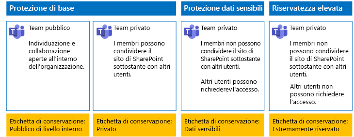
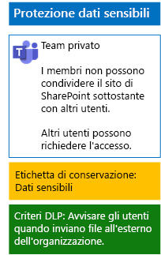
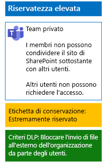

# Proteggere i file nei team con etichette di conservazione e prevenzione della perdita dei dati

 
Seguire la procedura descritta in questo articolo per progettare e distribuire le etichette di conservazione e i criteri di prevenzione della perdita dei dati ai team di base, sensibili ed estremamente riservati e ai rispettivi siti di SharePoint sottostanti. Per ulteriori informazioni su questi tre livelli di protezione, vedere [Proteggere i file in Microsoft Teams](secure-files-in-teams.md).
  
## Funzionamento

1. Creare le etichette di conservazione desiderate e pubblicarle. La pubblicazione può richiedere fino a 12 ore.
2. Per i siti di SharePoint sottostanti desiderati, modificare le impostazioni della raccolta documenti per applicare le etichette di conservazione desiderate agli elementi della raccolta.
3. Creare criteri di prevenzione della perdita dei dati per intervenire in base alle etichette di conservazione.

Quando gli utenti aggiungono un documento alla raccolta siti di SharePoint sottostante per il team, il documento riceve per impostazione predefinita l'etichetta di conservazione assegnata. È possibile modificare l'etichetta, se necessario. Quando un utente condivide un documento all'esterno dell'organizzazione, i criteri di prevenzione della perdita dei dati verificano se è assegnata un'etichetta e intervengono in caso di corrispondenza all'etichetta. Quindi cercano la corrispondenza anche ad altri criteri, ad esempio la protezione dei file con i numeri di carta di credito, se questo tipo di criterio è configurato. 

## Etichette di conservazione per i siti di SharePoint sottostanti

La procedura per creare e poi assegnare etichette di conservazione ai siti di SharePoint sottostanti prevede tre fasi.
  
### Fase 1: Definire i nomi delle etichette di conservazione

In questa fase si definiscono i nomi delle etichette di conservazione per i quattro livelli di protezione delle informazioni applicati ai siti di SharePoint sottostanti. La tabella seguente elenca i nomi consigliati per ogni livello.
  
|**livello di protezione dei siti di SharePoint sottostanti**|**Nome etichetta**|
|:-----|:-----|
|Pubblico di base    |Pubblico interno    |
|Privato di base    |Private    |
|Dati sensibili    |Dati sensibili    |
|Highly Confidential (Riservatezza elevata)    |Estremamente riservato    |
   
### Fase 2: Creare le etichette di conservazione

In questa fase si creano e poi pubblicano le etichette specificate per i diversi livelli di protezione delle informazioni.
  
1. Accedere al [portale Conformità Microsoft 365](https://compliance.microsoft.com) con un account che dispone del ruolo Amministratore della sicurezza oppure Amministratore della società.
    
2. Dalla scheda **Home: Conformità Microsoft 365** del browser fare clic su **Classificazioni > Etichette**.
    
3. Fare clic su **Etichette di conservazione > Crea un'etichetta**.
    
4. Nel riquadro **Assegnare un nome all'etichetta** digitare il nome dell’etichetta e una descrizione per amministratori e utenti, quindi fare clic su **Avanti**.

5. Nel riquadro **Descrittori del piano di archiviazione** compilare come necessario e quindi fare clic su **Avanti**.
    
6. Nel riquadro **Impostazioni etichetta** impostare **Conservazione** su **Sì**, se necessario, e configurare le impostazioni di conservazione. Fare clic su **Avanti**.
    
7. Nel riquadro **Rivedere le impostazioni** fare clic su **Crea etichetta**.
    
8. Per etichette aggiuntive, fare clic su **Crea un'etichetta** e ripetere i passaggi da 3 a 7 di questa procedura in base alle esigenze.
    

### Pubblicare le nuove etichette

Successivamente, seguire questa procedura per pubblicare le nuove etichette di conservazione.
  
1. Nel riquadro **Etichette** fare clic sulla scheda **Etichette di conservazione** e quindi su **Pubblica etichette**.
    
2. Nel riquadro **Scegliere le etichette da pubblicare** fare clic su **Scegliere le etichette da pubblicare**.
    
3. Nel riquadro **Scegli etichette** fare clic su **Aggiungi**, selezionare le quattro etichette e fare clic su **Aggiungi**.
    
4. Fare clic su **Fine**.
    
5. Nel riquadro **Choose labels to publish** (Scegli etichette da pubblicare) fare clic su **Avanti**.
    
6. Nel riquadro **Choose locations** (Scegli posizioni) fare clic su **Avanti**.
    
7. Nel riquadro **Denomina il criterio**, digitare un nome per il set di etichette in **Nome**, quindi fare clic su **Avanti**.
    
8. Nel riquadro **Verifica le impostazioni** fare clic su **Publish labels** (Pubblica etichette), quindi fare clic su **Chiudi**.

    
### Fase 3: Applicare le etichette di conservazione ai siti di SharePoint sottostanti

Seguire questa procedura per applicare le etichette di conservazione alle cartelle di documenti dei siti di SharePoint sottostanti.
  
1.  Dal team, fare clic su **File**, quindi selezionare **Apri in SharePoint**.

2. Nella nuova scheda del sito di SharePoint del browser fare clic su **Documenti**.
    
3. Fare clic sull'icona delle impostazioni e selezionare **Impostazioni libreria**.
    
4. In **Autorizzazioni e gestione** fare clic su **Apply label to items in this library** (Applica etichetta agli elementi in questa libreria).
    
5. In **Impostazioni - Applica etichetta**, selezionare l'etichetta di conservazione appropriata, quindi fare clic su **Salva**.
    
6. Chiudere la scheda per il sito di SharePoint.
    
7. Ripetere i passaggi da 1 a 6 per assegnare le etichette di conservazione a siti di SharePoint sottostanti aggiuntivi.
    
Di seguito è riportata la configurazione risultante.
  

  
## Criteri di prevenzione della perdita dei dati per i siti di SharePoint sottostanti

Seguire questa procedura per configurare un criterio della prevenzione della perdita dei dati che notifica agli utenti la condivisione di un documento in un sito di SharePoint sottostante all'esterno dell'organizzazione.

1. Accedere al [portale Conformità Microsoft 365](https://compliance.microsoft.com/) con un account che dispone del ruolo Amministratore della sicurezza oppure Amministratore della società.
    
2. Nella nuova scheda **Sicurezza Microsoft 365** del browser fare clic su **Criteri > Prevenzione della perdita dei dati**.
    
3. Nel riquadro **Home > Prevenzione della perdita dei dati** fare clic su **Crea un criterio**.
    
4. Nel riquadro **Iniziare con un modello o creare un criterio personalizzato** fare clic su **Personalizza**, quindi su **Avanti**.
    
5. Nel riquadro **Denomina il criterio**, digitare il nome per il criterio DLP di livello riservato in **Nome**, quindi fare clic su **Avanti**.
    
6. Nel riquadro **Scegli posizioni** fare clic su **Consenti di scegliere posizioni specifiche** e fare clic su **Avanti**.
    
7. Nell'elenco di località, disabilitare le località **Posta elettronica di Exchange**, **Account di OneDrive** e **Messaggi di chat e canali di Teams**, quindi fare clic su **Avanti**.
    
8. Nel riquadro **Personalizzare il tipo di contenuti da proteggere**, fare clic su **Modifica**.
    
9. Nel riquadro **Scegliere i tipi di contenuto da proteggere**,fare clic su **Aggiungi** nella casella di riepilogo a discesa, quindi fare clic su **Etichette di conservazione**.
    
10. Nel riquadro **Etichette di conservazione** fare clic su **Aggiungi**, selezionare l'etichetta **Riservato** fare clic su **Aggiungi**, quindi fare clic su **Fine**.
    
11. Nel riquadro **Choose the types of content to protect** (Scegli i tipi di contenuto da proteggere) fare clic su **Salva**.
    
12. Nel riquadro **Personalizzare i tipi di informazioni da proteggere**, fare clic su **Avanti**.

13. Nel riquadro **What do you want to do if we detect sensitive info?** (Selezionare come procedere in caso di informazioni sensibili rilevate) fare clic su **Customize the tip and email** (Personalizza suggerimento e messaggio di posta elettronica).
    
14. Nel riquadro **Customize policy tips and email notifications** (Personalizza i suggerimenti per i criteri e le notifiche tramite posta elettronica) fare clic su **Customize the policy tip text** (Personalizza testo suggerimento per criterio).
    
15. Nella casella di testo digitare o incollare uno dei seguenti suggerimenti:
    
  - Per condividere con un utente esterno all'organizzazione, scaricare il file e quindi aprirlo. Fare clic su File, Proteggi documento, Crittografa con password, quindi specificare una password complessa. Inviare la password in un'e-mail separata o con altri mezzi di comunicazione.
  - I file estremamente riservati sono protetti con crittografia. Solo gli utenti esterni che hanno ricevuto le autorizzazioni per questi file dal reparto IT possono leggerli.
    
    In alternativa, digitare o incollare un suggerimento per i criteri che indica agli utenti come condividere un file all'esterno dell'organizzazione.
    
16. Fare clic su **OK**.
    
17. Nel riquadro **Quale operazione eseguire se vengono rilevate informazioni riservate?**, fare clic su **Avanti**.
    
18. Nel riquadro **Abilitare il criterio o eseguire prima un test?**, fare clic su **Sì, abilitarlo immediatamente**, quindi su **Avanti**.
    
19. Nel riquadro **Verifica le impostazioni** fare clic su **Crea** e quindi su **Chiudi**.
    
Di seguito è riportata la configurazione risultante per i team sensibili.
  

  
Successivamente, seguire questa procedura per configurare un criterio della prevenzione della perdita dei dati che impedisce agli utenti la condivisione di un documento in un sito di SharePoint sottostante all'esterno dell'organizzazione.
  
1. Nella nuova scheda **Sicurezza Microsoft 365** del browser fare clic su **Criteri > Prevenzione della perdita dei dati**.
    
2. Nel riquadro **Prevenzione della perdita dei dati** fare clic su ** Crea un criterio**.
    
3. Nel riquadro **Inizia con un modello o crea un criterio personalizzato**, fare clic su **Personalizza**, quindi su **Avanti**.
    
4. Nel riquadro **Denomina il criterio**, digitare il nome per il criterio DLP di livello estremamente riservato in **Nome**, quindi fare clic su **Avanti**.
    
5. Nel riquadro **Choose locations** (Scegli posizioni) fare clic su **Let me choose specific locations** (Consenti di scegliere posizioni specifiche) e fare clic su **Avanti**.
    
6. Nell'elenco di località, disabilitare le località **Posta elettronica di Exchange**, **Account di OneDrive** e **Messaggi di chat e canali di Teams**, quindi fare clic su **Avanti**.
    
7. Nel riquadro **Personalizzare i tipi di informazioni riservate da proteggere** fare clic su **Modifica**.
    
8. Nel riquadro **Scegliere i tipi di contenuto da proteggere**,fare clic su **Aggiungi** nella casella di riepilogo a discesa, quindi fare clic su **Etichette di conservazione**.
    
9. Nel riquadro **Etichette** fare clic su **Aggiungi**, selezionare l'etichetta **Estremamente riservato**, fare clic su **Aggiungi**, quindi fare clic su **Fine**.
    
10. Nel riquadro **Choose the types of content to protect** (Scegli i tipi di contenuto da proteggere) fare clic su **Salva**.
    
12. Nel riquadro **Customize the types of sensitive info you want to protect** (Personalizza i tipi di informazioni sensibili da proteggere) fare clic su **Avanti**.
    
13. Nel riquadro **What do you want to do if we detect sensitive info?** (Selezionare come procedere in caso di informazioni sensibili rilevate) fare clic su **Customize the tip and email** (Personalizza suggerimento e messaggio di posta elettronica).
    
14. Nel riquadro **Customize policy tips and email notifications** (Personalizza i suggerimenti per i criteri e le notifiche tramite posta elettronica) fare clic su **Customize the policy tip text** (Personalizza testo suggerimento per criterio).
    
15. Nella casella di testo digitare o incollare quanto segue:
    
  - Per condividere con un utente esterno all'organizzazione, scaricare il file e quindi aprirlo. Fare clic su File, Proteggi documento, Crittografa con password, quindi specificare una password complessa. Inviare la password in un'e-mail separata o con altri mezzi di comunicazione.
    
    In alternativa, digitare o incollare un suggerimento per i criteri che indica agli utenti come condividere un file all'esterno dell'organizzazione.
    
16. Fare clic su **OK**.
    
17. Nel riquadro **Quale operazione eseguire se vengono rilevate informazioni riservate?** fare clic su **Limita l'accesso o crittografa i contenuti** in **Rileva se viene condivisa una specifica quantità di informazioni sensibili nello stesso momento** e quindi fare clic su **Avanti**.
    
18. Nel riquadro **Abilitare il criterio o eseguire prima un test?**, fare clic su **Sì, abilitarlo immediatamente**, quindi su **Avanti**.
    
19. Nel riquadro **Verifica le impostazioni** fare clic su **Crea** e quindi su **Chiudi**.
    
Di seguito è riportata la configurazione risultante per i team estremamente riservati.
  

  
## Passaggio successivo

[Proteggere i file nei team con etichette di riservatezza](deploy-teams-sensitivity-labels.md)
    
## Vedere anche

[Proteggere i file in Microsoft Teams](secure-files-in-teams.md)
  
[Adozione del cloud e soluzioni ibride](https://docs.microsoft.com/office365/enterprise/cloud-adoption-and-hybrid-solutions)

