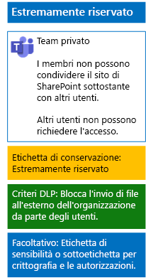

# Proteggere i file nei team con etichette di riservatezzaProtect files in teams with sensitivity labels

Diversamente da un'etichetta di riservatezza per dati altamente regolamentati, che chiunque può applicare a qualsiasi file, un team estremamente riservato deve avere una propria etichetta o sottoetichetta, in modo che i file a cui è assegnata:Unlike a sensitivity label for highly regulated data that anyone can apply to any file, a secure team needs its own label or sublabel so that assigned files:

- Siano crittografati singolarmente.Are individually encrypted.
- Contengano autorizzazioni personalizzate in modo che solo i membri del team possano aprirli.Contain custom permissions so that only members of the Team Group can open it.

Per implementare questo ulteriore livello di sicurezza per i file archiviati nel sito di SharePoint sottostante di un team, è necessario configurare un'etichetta di riservatezza personalizzata, autonoma o come sottoetichetta dell'etichetta generale per i dati altamente regolamentati.To accomplish this additional level of security for files stored in the Team Site, you must configure a new sensitivity label that is either its own label a sublabel of the general label for highly regulated files. Solo i membri del team vedranno l'etichetta personalizzata o la sottoetichetta nel proprio elenco di etichette.Only team members will see the customized label or sublabel in their list of labels.

Usare un'etichetta di riservatezza quando è necessario un numero limitato di etichette sia per l'uso globale che per i singoli team privati.Use a sensitivity label when you need a small number of labels for both global use and individual private teams. 

Usare una sottoetichetta di riservatezza se si ha un numero elevato di etichette o se si vogliono organizzare le etichette per i team estremamente riservati sotto l'etichetta per i dati altamente regolamentati.Use a sensitivity sublabel when you have a large number of labels or want to organize labels for private teams under the highly regulated label.

Seguire [queste istruzioni ](https://docs.microsoft.com/microsoft-365/compliance/encryption-sensitivity-labels) per configurare un'etichetta separata o una sottoetichetta con le impostazioni seguenti:[Use these instructions](https://docs.microsoft.com/microsoft-365/compliance/encryption-sensitivity-labels) to configure a separate label or a sublabel with the following settings:

- Il nome dell'etichetta o della sottoetichetta contiene il nome del teamThe name of the label contains the name of the team
- La crittografia è abilitataEncryption is enabled
- Il gruppo di Office 365 per il team ha autorizzazioni di creazione condivisaThe Office 365 group for the team has Co-Author permissions

Una volta creata, pubblicare la nuova etichetta o sottoetichetta per gli utenti, che potranno quindi applicarla ai file in locale prima di caricarli nel team o dopo che il file sarà archiviato nel team.After creating, publish the new label or sublabel for your users, who can then apply them to files either locally before uploading them to the team or later once the file is stored in the team.

Ecco la configurazione del team estremamente riservato che utilizza etichette di riservatezza per le autorizzazioni e la crittografia dei file.Here is the configuration of the highly confidential team that uses sensitivity labels for file encryption and permissions.

## Vedere ancheSee Also

[Proteggere i file in Microsoft TeamsSecure files in Microsoft Teams](secure-files-in-teams.md)
  
[Adozione del cloud e soluzioni ibrideCloud adoption and hybrid solutions](https://docs.microsoft.com/office365/enterprise/cloud-adoption-and-hybrid-solutions)
