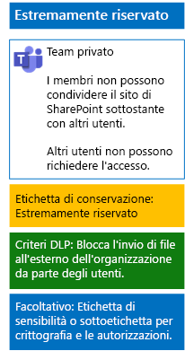

# Proteggere i file nei team con etichette di riservatezza

Diversamente da un'etichetta di riservatezza per dati altamente regolamentati, che chiunque può applicare a qualsiasi file, un team estremamente riservato deve avere una propria etichetta o sottoetichetta, in modo che i file a cui è assegnata:

- Siano crittografati singolarmente.
- Contengano autorizzazioni personalizzate in modo che solo i membri del team possano aprirli.

Per implementare questo ulteriore livello di sicurezza per i file archiviati nel sito di SharePoint sottostante di un team, è necessario configurare un'etichetta di riservatezza personalizzata, autonoma o come sottoetichetta dell'etichetta generale per i dati altamente regolamentati. Solo i membri del team vedranno l'etichetta personalizzata o la sottoetichetta nel proprio elenco di etichette.

Usare un'etichetta di riservatezza quando è necessario un numero limitato di etichette sia per l'uso globale che per i singoli team privati. 

Usare una sottoetichetta di riservatezza se si ha un numero elevato di etichette o se si vogliono organizzare le etichette per i team estremamente riservati sotto l'etichetta per i dati altamente regolamentati.

Seguire [queste istruzioni ](https://docs.microsoft.com/microsoft-365/compliance/encryption-sensitivity-labels) per configurare un'etichetta separata o una sottoetichetta con le impostazioni seguenti:

- Il nome dell'etichetta o della sottoetichetta contiene il nome del team
- La crittografia è abilitata
- Il gruppo di Microsoft 365 per il team ha autorizzazioni di creazione condivisa

Una volta creata, pubblicare la nuova etichetta o sottoetichetta per gli utenti, che potranno quindi applicarla ai file in locale prima di caricarli nel team o dopo che il file sarà archiviato nel team.

Ecco la configurazione del team estremamente riservato che utilizza etichette di riservatezza per le autorizzazioni e la crittografia dei file.

## Vedere anche

[Proteggere i file in Microsoft Teams](secure-files-in-teams.md)
  
[Adozione del cloud e soluzioni ibride](https://docs.microsoft.com/office365/enterprise/cloud-adoption-and-hybrid-solutions)
