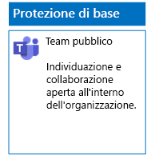
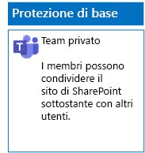
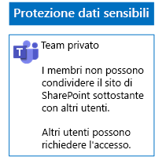
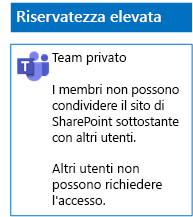

# Distribuire team per tre livelli di protezione dei fileDeploy teams for three tiers of protection for files

Usare i passaggi descritti in questo articolo per progettare e implementare team di base, sensibili ed estremamente riservati.Use the steps in this article to design and deploy baseline, sensitive, and highly confidential teams. Per ulteriori informazioni su questi tre livelli di protezione, vedere [Proteggere i file in Microsoft Teams](secure-files-in-teams.md).For more information about these three tiers of protection, see [Secure files in Microsoft Teams](secure-files-in-teams.md).

## Team di baseBaseline teams

La protezione di base include team pubblici e privati.Baseline protection includes both public and private teams. I team pubblici possono essere individuati e usati da chiunque nell'organizzazione.Public teams can be discovered and accessed by anybody in the organization. I siti privati possono essere individuati e sono accessibili solo dai membri del gruppo Office 365 associato al team.Private sites can only be discovered and accessed by members of the Office 365 group associated with the team. Entrambi questi tipi di team consentono ai membri di condividere il sito con altri utenti.Both of these types of teams allow members to share the site with others.

### PubblicoPublic

Seguire le istruzioni disponibili in [questo articolo](https://support.office.com/article/174adf5f-846b-4780-b765-de1a0a737e2b) per creare un Team di base con autorizzazioni e accesso pubblico.Follow the instructions in [this article](https://support.office.com/article/174adf5f-846b-4780-b765-de1a0a737e2b) to create a baseline Team with public access and permissions.

Questa è la configurazione risultante.Here is your resulting configuration.

### PrivatoPrivate

Seguire le istruzioni disponibili in [questo articolo](https://support.office.com/article/174adf5f-846b-4780-b765-de1a0a737e2b) per creare un Team di base con autorizzazioni e accesso privato.Follow the instructions in [this article](https://support.office.com/article/174adf5f-846b-4780-b765-de1a0a737e2b) to create a baseline Team with private access and permissions.

Questa è la configurazione risultante.Here is your resulting configuration.

## Team sensibiliSensitive teams

Per un team sensibile, è possibile iniziare [creando un team privato](https://support.office.com/article/174adf5f-846b-4780-b765-de1a0a737e2b).For a sensitive team, you start by [creating a private team](https://support.office.com/article/174adf5f-846b-4780-b765-de1a0a737e2b).

Successivamente, si configura il sito di SharePoint sottostante per impedire la condivisione ai membri del team.Next, you configure the underlying SharePoint site to prevent sharing by team members.

1. Nella barra degli strumenti per il team fare clic su **File**.In the tool bar for the team, click **Files**.

2. Fare clic sui puntini di sospensione, quindi selezionare **Apri in SharePoint**.Click the ellipsis, and then click **Open in SharePoint**.

3. Nella barra degli strumenti del sito di SharePoint sottostante fare clic sull'icona delle impostazioni, quindi su **Autorizzazioni sito**.In the tool bar of the underlying SharePoint site, click the settings icon, and then click **Site permissions**.

4. Nel riquadro **Autorizzazioni sito** fare clic su **Modifica impostazioni di condivisione** in **Impostazioni di condivisione**.In the **Site permissions** pane, under **Sharing Settings**, click **Change sharing settings**.

5. In **Impostazioni di condivisione** scegliere **Solo i proprietari del sito possono condividere file, cartelle e il sito**, quindi fare clic su **Salva**.Under **Sharing permissions**, choose **Only site owners can share files, folders, and the site**, and then click **Save**.

Di seguito è riportata la configurazione risultante.Here is your resulting configuration.

## Team estremamente riservatiHighly confidential teams

Con un team estremamente riservato, si inizia [creando un team privato](https://support.office.com/article/174adf5f-846b-4780-b765-de1a0a737e2b).With a highly confidential team, you start by [creating a private team](https://support.office.com/article/174adf5f-846b-4780-b765-de1a0a737e2b).

Successivamente, si configura il sito di SharePoint sottostante per impedire la condivisione ai membri del team e la richiesta di accesso per i non membri del team.Next, you configure the underlying SharePoint site to prevent sharing by team members and the requesting of access by non-members of the team.

1. Nella barra degli strumenti per il team fare clic su **File**.In the tool bar for the team, click **Files**.

2. Fare clic sui puntini di sospensione, quindi selezionare **Apri in SharePoint**.Click the ellipsis, and then click **Open in SharePoint**.

3. Nella barra degli strumenti del sito di SharePoint sottostante fare clic sull'icona delle impostazioni, quindi su **Autorizzazioni sito**.In the tool bar of the underlying SharePoint site, click the settings icon, and then click **Site permissions**.

4. Nel riquadro **Autorizzazioni sito** fare clic su **Modifica impostazioni di condivisione** in **Impostazioni di condivisione**.In the **Site permissions** pane, under **Sharing Settings**, click **Change sharing settings**.

5. In **Impostazioni di condivisione** scegliere **Solo i proprietari del sito possono condividere file, cartelle e il sito**.Under **Sharing permissions**, choose **Only site owners can share files, folders, and the site**.

6. Disattivare **Consenti richieste di accesso** e quindi fare clic su **Salva**.Turn off **Allow access requests**, and then click **Save**.

Di seguito è riportata la configurazione risultante.Here is your resulting configuration.

## Passaggio successivoNext step

[Proteggere i file nei team con etichette di conservazione e prevenzione della perdita dei datiProtect files in teams with retention labels and DLP](deploy-teams-retention-DLP.md)

## Vedere ancheSee also

[Proteggere i file in Microsoft TeamsSecure files in Microsoft Teams](secure-files-in-teams.md)

[Adozione del cloud e soluzioni ibrideCloud adoption and hybrid solutions](https://docs.microsoft.com/office365/enterprise/cloud-adoption-and-hybrid-solutions)
