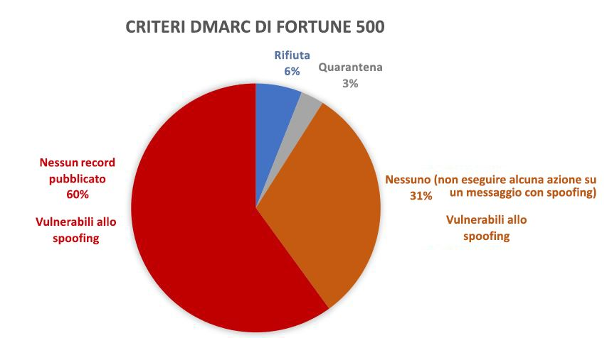
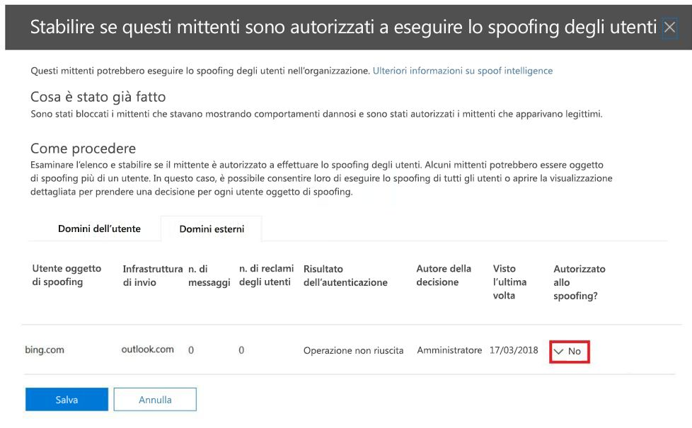

# <a name="email-authentication-in-eop"></a>Autenticazione e-mail in EOP

[!INCLUDE [Microsoft 365 Defender rebranding](../includes/microsoft-defender-for-office.md)]

**Si applica a**
- [Exchange Online Protection](exchange-online-protection-overview.md)
- [Microsoft Defender per Office 365 piano 1 e piano 2](defender-for-office-365.md)
- [Microsoft 365 Defender](../defender/microsoft-365-defender.md)


Con la denominazione di autenticazione e-mail, nota anche come autenticazione della posta elettronica o convalida della posta elettronica, si indica un gruppo di standard che prova a bloccare lo spoofing, ossia i messaggi di posta elettronica provenienti da mittenti contraffatti. In tutte le organizzazioni Microsoft 365, EOP usa questi standard per verificare la posta elettronica in ingresso:

- [SPF](set-up-spf-in-office-365-to-help-prevent-spoofing.md)

- [DKIM](use-dkim-to-validate-outbound-email.md)

- [DMARC](use-dmarc-to-validate-email.md)

L'autenticazione della posta elettronica verifica che i messaggi di posta elettronica provenienti da un mittente, ad esempio laura@contoso.com, siano legittimi e provengano da fonti previste per quel dominio di posta elettronica, ad esempio contoso.com.

Il resto di questo articolo spiega come funzionano queste tecnologie e il modo in cui vengono usate in EOP per controllare la posta elettronica in ingresso.

## <a name="use-email-authentication-to-help-prevent-spoofing"></a>Usare l'autenticazione della posta elettronica per evitare lo spoofing

DMARC previene lo spoofing tramite l'analisi dell'indirizzo **Da** nei messaggi. L'indirizzo **Da** è l'indirizzo di posta elettronica del mittente che gli utenti vedono nel loro client di posta elettronica. Le organizzazioni di posta elettronica di destinazione possono anche verificare che il dominio di posta elettronica abbia superato le autenticazioni SPF o DKIM. In altre parole, il dominio è stato autenticato pertanto l’indirizzo di posta elettronica del mittente non è falsificato.

Tuttavia, i record DNS per le autenticazioni SPF, DKIM e DMARC (note collettivamente come criteri di autenticazione della posta elettronica) sono facoltativi. I domini con criteri avanzati di autenticazione della posta elettronica, come microsoft.com e skype.com, sono protetti contro lo spoofing. Tuttavia, i domini con criteri di autenticazione della posta elettronica più deboli, o privi di criteri, sono obiettivi primari dei contraffattori.

Al marzo 2018, solo il 9% dei domini delle aziende Fortune 500 pubblicava criteri avanzati di autenticazione della posta elettronica. Il 91% restante delle aziende è soggetto a contraffazione. Se non è in uso un altro meccanismo di filtro della posta elettronica, è possibile che i messaggi provenienti da mittenti contraffatti in questi domini vengano recapitati agli utenti.



Le proporzioni delle piccole e medie imprese che pubblicano criteri avanzati di autenticazione della posta elettronica sono più piccole. E il numero è ancora più piccolo per i domini di posta elettronica all'esterno del Nord America e dell'Europa occidentale.

L’assenza di criteri avanzati di autenticazione della posta elettronica è un problema importante. Benché le organizzazioni possano non comprendere come funziona l'autenticazione della posta elettronica, gli aggressori lo conoscono a fondo e ne traggono vantaggio. Per evitare l'esposizione al phishing e a causa dell'adozione limitata di criteri avanzati di autenticazione della posta elettronica, Microsoft usa l'*autenticazione implicita* per controllare la posta in ingresso.

L'autenticazione implicita della posta elettronica è un'estensione dei normali criteri di autenticazione della posta elettronica. Queste estensioni includono reputazione del mittente, cronologia del mittente e del destinatario, analisi comportamentale e altre tecniche avanzate. In assenza di altri segnali inviati da queste estensioni, i messaggi inviati da domini che non usano criteri di autenticazione della posta elettronica saranno contrassegnati come contraffatti.

Per visualizzare l'annuncio generale di Microsoft, vedere [A Sea of Phish Part 2: Enhanced Anti-spoofing technology in Microsoft 365](https://techcommunity.microsoft.com/t5/Security-Privacy-and-Compliance/Schooling-A-Sea-of-Phish-Part-2-Enhanced-Anti-spoofing/ba-p/176209) (Un mare di phishing parte 2 - Anti-spoofing avanzato in Microsoft 365).

## <a name="composite-authentication"></a>Autenticazione composita

Se un dominio non contiene record SPF, DKIM E DMARC tradizionali, tali controlli dei record non comunicano informazioni sufficienti sullo stato di autenticazione. Di conseguenza, Microsoft ha sviluppato un algoritmo per l'autenticazione implicita della posta elettronica. Questo algoritmo combina più segnali in un singolo valore denominato _autenticazione composita_, o `compauth` in breve. Il valore `compauth` viene indicato nell'intestazione **Authentication-Results** nelle intestazioni dei messaggi.

```text
Authentication-Results:
   compauth=<fail | pass | softpass | none> reason=<yyy>
```

Questi valori sono spiegati in [Intestazione del messaggio Authentication-results](anti-spam-message-headers.md#authentication-results-message-header).

Esaminando le intestazioni dei messaggi, gli amministratori o anche gli utenti finali possono comprendere il modo in cui Microsoft 365 ha determinato che il mittente è contraffatto.

## <a name="why-email-authentication-is-not-always-enough-to-stop-spoofing"></a>Perché l'autenticazione e-mail non è sempre sufficiente per bloccare lo spoofing

Affidarsi solo ai record di autenticazione della posta elettronica per determinare se un messaggio in arrivo è contraffatto presenta le limitazioni seguenti:

- È possibile che il dominio di invio non abbia i record DNS necessari o che i record siano configurati in modo errato.

- Il dominio di origine ha record DNS configurati in modo corretto, ma quel dominio non corrisponde al dominio nell'indirizzo del mittente. SPF e DKIM non richiedono che il dominio sia usato nell'indirizzo del mittente. Aggressori o servizi legittimi potrebbero registrare un dominio, configurare SPF e DKIM per il dominio, usare un dominio completamente diverso nell'indirizzo del mittente. I messaggi provenienti da mittenti di questo dominio supereranno SPF e DKIM.

L'autenticazione composita può risolvere queste limitazioni, passando messaggi che altrimenti non supererebbero i controlli di autenticazione della posta elettronica.

Per semplicità, gli esempi seguenti sono incentrati sui risultati dell'autenticazione. Altri fattori di intelligence di back-end potrebbero identificare i messaggi che superano l'autenticazione e-mail come contraffatti o i messaggi che non la superano come legittimi.

Il dominio fabrikam.com, ad esempio, non ha record SPF, DKIM o DMARC. I messaggi provenienti da mittenti nel dominio fabrikam.com possono non superare l'autenticazione composita (notare il valore `compauth` e il motivo):

```text
Authentication-Results: spf=none (sender IP is 10.2.3.4)
  smtp.mailfrom=fabrikam.com; contoso.com; dkim=none
  (message not signed) header.d=none; contoso.com; dmarc=none
  action=none header.from=fabrikam.com; compauth=fail reason=001
From: chris@fabrikam.com
To: michelle@contoso.com
```

Se fabrikam.com configura un SPF senza un record DKIM, il messaggio può superare l'autenticazione composita. Il dominio che ha superato i controlli SPF è allineato al dominio nell'indirizzo del mittente:

```text
Authentication-Results: spf=pass (sender IP is 10.2.3.4)
  smtp.mailfrom=fabrikam.com; contoso.com; dkim=none
  (message not signed) header.d=none; contoso.com; dmarc=bestguesspass
  action=none header.from=fabrikam.com; compauth=pass reason=109
From: chris@fabrikam.com
To: michelle@contoso.com
```

Se fabrikam.com configura un DKIM senza un record SPF, il messaggio può superare l'autenticazione composita. Il dominio che della firma DKIM è allineato al dominio nell'indirizzo del mittente:

```text
Authentication-Results: spf=none (sender IP is 10.2.3.4)
  smtp.mailfrom=fabrikam.com; contoso.com; dkim=pass
  (signature was verified) header.d=outbound.fabrikam.com;
  contoso.com; dmarc=bestguesspass action=none
  header.from=fabrikam.com; compauth=pass reason=109
From: chris@fabrikam.com
To: michelle@contoso.com
```

Se il dominio in SPF o nella firma DKIM non è allineato al dominio nell'indirizzo del mittente, il messaggio potrebbe non superare l'autenticazione composita:

```text
Authentication-Results: spf=none (sender IP is 192.168.1.8)
  smtp.mailfrom=maliciousdomain.com; contoso.com; dkim=pass
  (signature was verified) header.d=maliciousdomain.com;
  contoso.com; dmarc=none action=none header.from=contoso.com;
  compauth=fail reason=001
From: chris@contoso.com
To: michelle@fabrikam.com
```

## <a name="solutions-for-legitimate-senders-who-are-sending-unauthenticated-email"></a>Soluzioni per i mittenti legittimi che inviano messaggi di posta elettronica non autenticati

Microsoft 365 tiene traccia di chi invia messaggi di posta elettronica non autenticati all'organizzazione. Se il servizio ritiene che il mittente non sia legittimo, contrassegnerà i messaggi del mittente come errori di autenticazione composita. Per evitarlo, è possibile seguire i suggerimenti di questa sezione.

### <a name="configure-email-authentication-for-domains-you-own"></a>Configurare l'autenticazione e-mail per i domini di cui si è proprietari

Si può usare questo metodo per risolvere lo spoofing intra-organizzazione e lo spoofing fra domini nei casi in cui si è proprietari o si interagisce con più tenant. Il metodo consente anche di risolvere i problemi di spoofing fra domini in cui si invia ad altri clienti all'interno di Microsoft 365 o a terze parti ospitate da altri provider.

- [Configurare record SPF](set-up-spf-in-office-365-to-help-prevent-spoofing.md) per i propri domini.

- [Configurare record DKIM](use-dkim-to-validate-outbound-email.md) per i propri domini primari.

- [Valutare la possibilità di configurare record DMARC](use-dmarc-to-validate-email.md) per il dominio per determinare chi sono i mittenti legittimi.

Microsoft non fornisce istruzioni dettagliate per l'implementazione dei record SPF, DKIM e DMARC. Online, tuttavia, sono disponibili numerose informazioni. Esistono anche società terze parti che si occupano di aiutare le organizzazioni a configurare i record di autenticazione della posta elettronica.

#### <a name="you-dont-know-all-sources-for-your-email"></a>Non si conoscono tutte le origini dei propri messaggi di posta elettronica

Molti domini non pubblicano i record SPF perché non conoscono tutte le origini di posta elettronica nel proprio dominio. Iniziare con la pubblicazione di un record SPF contenente tutte le origini di posta elettronica che si conoscono, soprattutto nell'ubicazione del traffico aziendale, e pubblicare il criterio SPF neutro `?all`. Ad esempio:

```text
fabrikam.com IN TXT "v=spf1 include:spf.fabrikam.com ?all"
```

Questo esempio significa che i messaggi di posta elettronica provenienti dall'infrastruttura aziendale supereranno l'autenticazione e-mail, ma quelli provenienti da origini sconosciute ricadranno nel criterio neutro.

Microsoft 365 tratterà i messaggi di posta elettronica ricevuti dall'infrastruttura aziendale come autenticati. La posta elettronica inviata da mittenti non identificati potrebbe essere contrassegnata come contrattatta se non supera l'autenticazione implicita. Tuttavia, questo rappresenta comunque un miglioramento rispetto al contrassegno di tutti i messaggi di posta elettronica come spoofing in Microsoft 365.

Dopo aver iniziato a usare un criterio di fallback SPF `?all`, è possibile individuare e includere gradualmente altre origini di posta elettronica per i messaggi e quindi aggiornare il record SPF con criteri più restrittivi.

### <a name="use-spoof-intelligence-to-configure-permitted-senders-of-unauthenticated-email"></a>Usare spoof intelligence per configurare i mittenti di posta elettronica non autenticata consentiti

È anche possibile usare [spoof intelligence](learn-about-spoof-intelligence.md) per consentire ai mittenti di trasmettere messaggi non autenticati alla propria organizzazione.

Per i domini esterni, l'utente oggetto di spoofing è il dominio dell'indirizzo del mittente, mentre l'infrastruttura di invio è l'indirizzo IP di origine, suddiviso in intervalli CIDR /24, o il dominio dell'organizzazione del record DNS inverso (PTR).

Nello screenshot seguente l'indirizzo IP di origine potrebbe essere 131.107.18.4 con il record PTR outbound.mail.protection.outlook.com. Questo sarebbe visualizzato come outlook.com per l'infrastruttura di invio.

Per consentire al mittente di inviare messaggi di posta elettronica non autenticati, modificare il **No** in un **Sì**.



### <a name="create-an-allow-entry-for-the-senderrecipient-pair"></a>Creare una voce Consenti per la coppia mittente/destinatario

Per ignorare il filtro della posta indesiderata, alcune parti del filtro anti-phishing ma non il filtro antimalware per mittenti specifici, vedere [Creare elenchi di mittenti attendibili in Microsoft 365](create-safe-sender-lists-in-office-365.md).

### <a name="ask-the-sender-to-configure-email-authentication-for-domains-you-dont-own"></a>Chiedere al mittente di configurare l'autenticazione e-mail per i domini di cui non si è proprietari

A causa dei problemi generati dalla posta indesiderata e dal phishing, Microsoft consiglia a tutte le organizzazioni di posta elettronica di configurare l'autenticazione e-mail. Anziché configurare override manuali nell'organizzazione, si può chiedere a un amministratore nel dominio di invio di configurare i propri record di autenticazione e-mail.

- Anche se in passato non erano tenuti a pubblicare record di autenticazione e-mail, devono farlo se inviano messaggi di posta elettronica a Microsoft.

- Configurare SPF per pubblicare gli indirizzi IP di invio del dominio e configurare DKIM (se disponibile) per la firma digitale dei messaggi. Dovrebbero inoltre prendere in considerazione la configurazione dei record DMARC.

- Se usano mittenti in blocco per inviare messaggi di posta elettronica per loro conto, assicurarsi che il dominio nell'indirizzo Da (se di loro proprietà) sia allineato al dominio che supera i controlli SPF o DMARC.

- Verificare che le posizioni seguenti, se in uso, siano incluse nel record SPF:

  - Server di posta elettronica locali.
  - Messaggi di posta elettronica inviati da un provider di software come un servizio (SaaS).
  - Messaggi di posta elettronica inviati da un servizio di hosting cloud (Microsoft Azure, GoDaddy, Rackspace, Amazon Web Services e così via).

- Per i piccoli domini ospitati da un ISP, configurare il record SPF in base alle istruzioni fornite dall'ISP.

Anche se in un primo momento può essere difficile ottenere l'autenticazione dei domini di invio, nel corso del tempo, poiché sempre più filtri per la posta elettronica iniziano a selezionare i loro messaggi come posta indesiderata o addirittura li rifiutano, questo li indurrà a configurare correttamente i record per garantire una migliore distribuzione. Inoltre, la loro partecipazione può essere utile per la lotta al phishing e può ridurre la possibilità di phishing interno o nelle organizzazioni a cui inviano messaggi di posta elettronica.

#### <a name="information-for-infrastructure-providers-isps-esps-or-cloud-hosting-services"></a>Informazioni per i provider di infrastrutture (ISP, ESP o servizi di hosting cloud)

Se si ospita la posta elettronica di un dominio o si fornisce un'infrastruttura di hosting in grado di inviare messaggi di posta elettronica, è consigliabile eseguire le operazioni seguenti:

- Verificare che i propri clienti dispongano di documentazione in cui viene spiegato in che modo devono configurare i record SPF

- Valutare la possibilità di firmare con firme DKIM i messaggi di posta elettronica in uscita, anche se il cliente non l'ha esplicitamente configurata (firmare con un dominio predefinito). È anche possibile firmare due volte il messaggio di posta elettronica con DKIM (una volta con il dominio del cliente se è stato configurato e una seconda volta con la firma DKIM della società)

Anche se si autentica la posta elettronica proveniente dalla propria piattaforma, il corretto recapito a Microsoft non è garantito, ma almeno questo assicura che Microsoft non la contrassegni come indesiderata perché non è autenticata.

## <a name="related-links"></a>Collegamenti correlati

Per altre informazioni sulle procedure consigliate per i provider di servizi, vedere le [procedure consigliate per la messaggistica mobile di M3AAWG per i provider di servizi](https://www.m3aawg.org/sites/default/files/m3aawg-mobile-messaging-best-practices-service-providers-2015-08_0.pdf).

Scopri come Office 365 usa l’SPF e supporta la convalida di DKIM:

- [Altre informazioni sull’SPF](how-office-365-uses-spf-to-prevent-spoofing.md)

- [Altre informazioni sul DKIM](support-for-validation-of-dkim-signed-messages.md)
