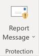

# Abilitare il componente aggiuntivo Segnala messaggio

> [!NOTE]
> Il componente aggiuntivo del messaggio di report per Outlook e Outlook sul Web non è esattamente lo stesso del filtro della [posta indesiderata di Outlook](https://support.office.com/article/5ae3ea8e-cf41-4fa0-b02a-3b96e21de089), sebbene entrambi possano essere utilizzati per contrassegnare la posta elettronica come indesiderata, non indesiderata o tentativo di phishing. La differenza è che il componente aggiuntivo per i messaggi di report per Outlook e Outlook sul Web notifica a Microsoft la posta indesiderata, mentre il filtro posta indesiderata di Outlook viene utilizzato per organizzare i messaggi di posta elettronica nella cassetta postale di un utente.

## Panoramica

Il componente aggiuntivo del messaggio di report per Outlook e Outlook sul Web consente agli utenti di segnalare facilmente messaggi di posta indesiderata, siano essi sicuri o dannosi, a Microsoft e ai suoi affiliati per l'analisi. Microsoft utilizza questi invii per migliorare l'efficacia delle tecnologie di protezione della posta elettronica. Inoltre, se l'organizzazione utilizza [Office 365 Advanced Threat Protection Plan 1](office-365-atp.md) o [Plan 2](office-365-ti.md), il componente aggiuntivo segnala messaggio fornisce al team di sicurezza dell'organizzazione informazioni utili che è possibile utilizzare per esaminare e aggiornare i criteri di sicurezza.

Si supponga, ad esempio, che le persone riferiscono un gran quantità di messaggi come phishing. Queste informazioni si riferiscono al [dashboard di sicurezza](security-dashboard.md) e ad altri report. Il team di sicurezza dell'organizzazione può utilizzare queste informazioni per indicare che potrebbe essere necessario aggiornare i criteri di protezione anti-phishing. In alternativa, se la gente segnala un gran quantità di messaggi che sono stati contrassegnati come posta indesiderata come non indesiderata utilizzando il componente aggiuntivo segnala messaggio, il team di sicurezza dell'organizzazione potrebbe dover adeguare i criteri di protezione da [posta indesiderata](configure-the-anti-spam-policies.md).

Il componente aggiuntivo segnala messaggio è compatibile con l'abbonamento a Office 365 e i prodotti seguenti:
 - Outlook sul Web
 - Outlook 2013 SP1
 - Outlook 2016
 - Outlook 2016 per Mac
 - Outlook incluso con Office 365 ProPlus

Il Web browser esistente dovrebbe essere sufficiente per il componente aggiuntivo del messaggio di report in modo che funzioni; Tuttavia, se si nota che il componente aggiuntivo non è disponibile o non funziona come previsto, provare con un altro browser.

Se si è un singolo utente, è possibile [abilitare il componente aggiuntivo per i messaggi di report](#get-the-report-message-add-in-for-yourself).

Se si è un amministratore globale di Office 365 o un amministratore di Exchange Online ed Exchange è configurato per l'utilizzo dell'autenticazione OAuth, è possibile [abilitare il componente aggiuntivo per i messaggi di report per l'organizzazione](#get-and-enable-the-report-message-add-in-for-your-organization). Il componente aggiuntivo segnala messaggio è ora disponibile tramite la [distribuzione centralizzata](https://docs.microsoft.com/office365/admin/manage/centralized-deployment-of-add-ins).

## Ottenere il componente aggiuntivo per i messaggi di report

1. In [Microsoft AppSource](https://appsource.microsoft.com/marketplace/apps), cercare il [componente aggiuntivo](https://appsource.microsoft.com/product/office/wa104381180)per i messaggi di report.

2. Scegliere **Get it now**.

   

3. Esaminare le condizioni di utilizzo e i criteri di privacy. Scegliere **Continue**.

4. Accedere a Office 365 utilizzando l'account aziendale o dell'Istituto di istruzione (per uso commerciale) o il proprio account Microsoft (per uso personale).

Dopo aver installato e abilitato il componente aggiuntivo, vengono visualizzate le icone seguenti:

- In Outlook l'icona è simile alla seguente:

  

- In Outlook sul Web (in precedenza noto come Outlook Web App), l'icona è simile alla seguente:

  

> [!TIP]
> Come passaggio successivo, informazioni su come [utilizzare il componente aggiuntivo per i messaggi di report](https://support.office.com/article/b5caa9f1-cdf3-4443-af8c-ff724ea719d2).

## Ottenere e attivare il componente aggiuntivo per i messaggi di report per l'organizzazione

> [!IMPORTANT]
> Per eseguire questa attività, è necessario essere un amministratore globale di Office 365 o un amministratore di Exchange Online. Inoltre, Exchange deve essere configurato per l'utilizzo dell'autenticazione OAuth per ulteriori informazioni, vedere [requisiti di Exchange (distribuzione centralizzata dei componenti aggiuntivi)](https://docs.microsoft.com/office365/admin/manage/centralized-deployment-of-add-ins).

1. Passare alla [pagina dei componenti aggiuntivi & Servizi](https://admin.microsoft.com/AdminPortal/Home#/Settings/ServicesAndAddIns) nell'interfaccia di amministrazione di Microsoft 365.

   

2. Scegliere **+ Distribuisci componente aggiuntivo**.

   

3. Nella schermata **nuovo componente aggiuntivo** , esaminare le informazioni e quindi fare clic su **Avanti**.

   

4. Selezionare **desidero aggiungere un componente aggiuntivo da Office Store**e quindi scegliere **Avanti**.

   

5. Cercare il **messaggio di report**e, nell'elenco dei risultati, accanto al **componente aggiuntivo segnala messaggio**, scegliere **Aggiungi**.

   

6. Nella schermata del **messaggio di report** , esaminare le informazioni e quindi fare clic su **Avanti**.

   

7. Specificare le impostazioni predefinite per l'utente di Outlook e quindi scegliere **Avanti**.

   

8. Specificare chi riceve il componente aggiuntivo per i messaggi di report e quindi fare clic su **Salva**.

   

> [!TIP]
> È consigliabile [impostare una regola per ottenere una copia dei messaggi di posta elettronica segnalati dagli utenti](#set-up-a-rule-to-get-a-copy-of-email-messages-reported-by-your-users).

A seconda di cosa è stato selezionato quando si configura il componente aggiuntivo (passaggi 7-8 sopra), gli utenti dell'organizzazione disporranno del [componente aggiuntivo](https://support.office.com/article/b5caa9f1-cdf3-4443-af8c-ff724ea719d2) per i messaggi di report disponibile. Gli utenti dell'organizzazione vedranno le icone seguenti:

- In Outlook l'icona è simile alla seguente:

  

- In Outlook sul Web, l'icona è simile alla seguente:

  

> [!TIP]
> Quando si informa gli utenti sul componente aggiuntivo per i messaggi di report, includere un collegamento per [l'utilizzo del componente aggiuntivo per i messaggi di report](https://support.office.com/article/b5caa9f1-cdf3-4443-af8c-ff724ea719d2).

## Impostare una regola per ottenere una copia dei messaggi di posta elettronica segnalati dagli utenti

> [!IMPORTANT]
> Per eseguire questa attività, è necessario essere un amministratore di Exchange Online.

È possibile configurare una regola per ottenere una copia dei messaggi di posta elettronica segnalati dagli utenti dell'organizzazione. Questa operazione viene eseguita dopo aver scaricato e abilitato il componente aggiuntivo per i messaggi di report per l'organizzazione.

1. Nell'interfaccia di amministrazione di Exchange, scegliere **regole**del **flusso** \> di posta.

2. Scegliere **+** \> **Crea una nuova regola**.

3. Nella casella **nome** Digitare un nome, ad esempio invii.

4. Nell'elenco **applica la regola se** , scegliere **l'indirizzo del destinatario include...**.

5. Nella schermata **specificare parole o frasi** , aggiungere `junk@office365.microsoft.com` e `phish@office365.microsoft.com`quindi scegliere **OK**.

   

6. Nell'elenco **fare quanto segue...** , scegliere **BCC il messaggio a...**.

7. Aggiungere un amministratore globale, un amministratore della sicurezza e/o un lettore di sicurezza che dovrebbe ricevere una copia di ogni messaggio di posta elettronica che gli utenti riferiscono a Microsoft e quindi scegliere **OK**.

   

8. Selezionare **Controlla questa regola con livello di gravità**e scegliere **media**.

9. In **Scegli una modalità per questa regola**, scegliere **applica**.

   

10. Fare clic su **Salva**.

Con questa regola sul posto, ogni volta che un utente dell'organizzazione segnala un messaggio di posta elettronica utilizzando il componente aggiuntivo segnala messaggio, l'amministratore globale, l'amministratore della sicurezza e/o il lettore di sicurezza riceverà una copia del messaggio. Queste informazioni consentono di impostare o modificare i criteri, ad esempio i criteri di [collegamenti sicuri ATP di Office 365](atp-safe-links.md) o le impostazioni di protezione da [posta indesiderata](anti-spam-protection.md) .

## Informazioni su come utilizzare il componente aggiuntivo per i messaggi di report

Per ulteriori informazioni, vedere [use the report Message Add-in](https://support.office.com/article/b5caa9f1-cdf3-4443-af8c-ff724ea719d2).

## Esaminare o modificare le impostazioni per il componente aggiuntivo per i messaggi di report

È possibile esaminare e modificare le impostazioni predefinite per il componente aggiuntivo dei messaggi di report nella [pagina dei componenti aggiuntivi & di servizi](https://admin.microsoft.com/AdminPortal/Home#/Settings/ServicesAndAddIns).

> [!IMPORTANT]
> Per eseguire questa attività, è necessario essere un amministratore globale di Office 365 o un amministratore di Exchange Online.

1. Passare alla [pagina dei componenti aggiuntivi & Servizi](https://admin.microsoft.com/AdminPortal/Home#/Settings/ServicesAndAddIns) nell'interfaccia di amministrazione di Microsoft 365.

   

2. Individuare e selezionare il componente aggiuntivo per i messaggi di report.

   

3. Nella schermata del messaggio di report, esaminare e modificare le impostazioni appropriate per l'organizzazione.

   

## Argomenti correlati

[Utilizzare il componente aggiuntivo per i messaggi di report](https://support.office.com/article/b5caa9f1-cdf3-4443-af8c-ff724ea719d2)

[Visualizzare i report sulla sicurezza della posta &amp; elettronica nel centro sicurezza e conformità](view-email-security-reports.md)

[Visualizzare i report per Office 365 Advanced Threat Protection](view-reports-for-atp.md)

[Utilizzo di Esplora risorse nel &amp; Centro sicurezza e conformità](threat-explorer.md)
