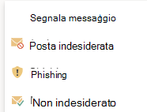

# Abilitare i componenti aggiuntivi Segnala messaggio o Segnala phishing

[!INCLUDE [Microsoft 365 Defender rebranding](../includes/microsoft-defender-for-office.md)]

**Si applica a**
- [Exchange Online Protection](exchange-online-protection-overview.md)
- [Microsoft Defender per Office 365 piano 1 e piano 2](defender-for-office-365.md)
- [Microsoft 365 Defender](../defender/microsoft-365-defender.md)

> [!NOTE]
> Se si è un amministratore di un'organizzazione Microsoft 365 con cassette postali Exchange Online,  è consigliabile utilizzare la pagina Invii nel portale Microsoft 365 Defender. Per ulteriori informazioni, vedere [Use Admin Submission to submit suspected spam, phish, URLs, and files to Microsoft](admin-submission.md).

I componenti aggiuntivi Segnala messaggio e Segnala phishing per Outlook e Outlook sul web (in precedenza noto come Outlook Web App) consentono agli utenti di segnalare facilmente falsi positivi (buona posta elettronica contrassegnata come non positiva) o falsi negativi (posta elettronica non consentita) a Microsoft e alle relative affiliate per l'analisi.

Microsoft usa questi invii per migliorare l'efficacia delle tecnologie di protezione della posta elettronica. Si supponga, ad esempio, che gli utenti segnalano molti messaggi utilizzando il componente aggiuntivo Segnala phishing. Queste informazioni vengono visualizzate nel dashboard di sicurezza e in altri report. Il team di sicurezza dell'organizzazione può utilizzare queste informazioni per indicare che potrebbe essere necessario aggiornare i criteri anti-phishing.

È possibile installare il componente aggiuntivo Segnala messaggio o Segnala phishing. Se si desidera che gli utenti segnalano messaggi di posta indesiderata e di phishing, distribuire il componente aggiuntivo Segnala messaggio nell'organizzazione. Per ulteriori informazioni, vedere Enable the Report Message add-in.

Il componente aggiuntivo Segnala messaggio consente di segnalare sia i messaggi di posta indesiderata che i messaggi di phishing. Gli amministratori possono abilitare il componente aggiuntivo Segnala messaggio per l'organizzazione e i singoli utenti possono installarlo automaticamente.

Il componente aggiuntivo Segnala phishing consente di segnalare solo i messaggi di phishing. Gli amministratori possono abilitare il componente aggiuntivo Segnala phishing per l'organizzazione e i singoli utenti possono installarlo automaticamente.

Se si è un singolo utente, è possibile abilitare entrambi i componenti aggiuntivi.

Se si è un amministratore globale o un amministratore di Exchange Online e Exchange è configurato per l'utilizzo dell'autenticazione OAuth, è possibile abilitare il componente aggiuntivo Segnala messaggio e il componente aggiuntivo Segnala phishing per l'organizzazione. Entrambi i componenti aggiuntivi sono ora disponibili tramite [distribuzione centralizzata.](../../admin/manage/centralized-deployment-of-add-ins.md)

## Informazioni necessarie prima di iniziare

- Sia il componente aggiuntivo Segnala messaggio che il componente aggiuntivo Segnala phishing funzionano con la maggior parte delle sottoscrizioni Microsoft 365 e i prodotti seguenti:
  - Outlook sul Web
  - Outlook 2013 SP1 o versione successiva
  - Outlook 2016 per Mac
  - Outlook incluse nelle app Microsoft 365 per Enterprise
  - Outlook app per iOS e Android

- Entrambi i componenti aggiuntivi non sono disponibili per le cassette postali condivise o le cassette postali nelle organizzazioni Exchange locali.

- Il Web browser esistente dovrebbe funzionare sia con i componenti aggiuntivi Segnala messaggio che Segnala phishing. Tuttavia, se si nota che il componente aggiuntivo non è disponibile o non funziona come previsto, provare un browser diverso.

- Per le installazioni dell'organizzazione, l'organizzazione deve essere configurata per l'utilizzo dell'autenticazione OAuth. Per ulteriori informazioni, vedere [Determine if Centralized Deployment of add-ins works for your organization](../../admin/manage/centralized-deployment-of-add-ins.md).

- Gli amministratori devono essere membri del gruppo di ruoli Amministratori globali. Per altre informazioni, vedere [Autorizzazioni nel portale di Microsoft 365 Defender](permissions-microsoft-365-security-center.md).

- Per ulteriori informazioni su come segnalare un messaggio utilizzando la funzionalità Segnala messaggio, vedere Segnalare falsi positivi e falsi negativi [in Outlook](report-false-positives-and-false-negatives.md).

> [!IMPORTANT]
> Non è consigliabile l'esperienza di creazione di report incorporata in Outlook perché non può usare i criteri di invio [degli utenti.](./user-submission.md) È consigliabile usare invece il componente aggiuntivo Segnala messaggio o Segnala phishing.

## Ottenere il componente aggiuntivo Segnala messaggio

### Ottenere il componente aggiuntivo Segnala messaggio per se stessi

1. Passare a Microsoft AppSource <https://appsource.microsoft.com/marketplace/apps> all'indirizzo e cercare il componente aggiuntivo Segnala messaggio. Per passare direttamente al componente aggiuntivo Segnala messaggio, passare a <https://appsource.microsoft.com/product/office/wa104381180> .

2. Fai **clic su SCARICA ORA**.

   

3. Nella finestra di dialogo visualizzata esaminare le condizioni per l'utilizzo e l'informativa sulla privacy e quindi fare clic su **Continua.**

4. Accedi usando l'account aziendale o dell'istituto di istruzione (per uso aziendale) o l'account Microsoft (per uso personale).

Dopo aver installato e abilitato il componente aggiuntivo, verranno visualizzate le icone seguenti:

- In Outlook, l'icona è simile alla seguente:

  > [!div class="mx-imgBorder"]
  > 

- In Outlook sul web, l'icona è simile alla seguente:

  > [!div class="mx-imgBorder"]
  > 

### Ottenere il componente aggiuntivo Segnala messaggio per l'organizzazione

> [!NOTE]
> La visualizzazione del componente aggiuntivo nell'organizzazione potrebbe richiedere fino a 12 ore.

1. Nell'interfaccia di amministrazione di Microsoft 365 passare alla pagina **Impostazioni** \> **componenti aggiuntivi** all'indirizzo <https://admin.microsoft.com/AdminPortal/Home#/Settings/AddIns> . Se la pagina del  componente aggiuntivo non è  visualizzata, passare al collegamento componenti aggiuntivi Impostazioni app integrate nella parte superiore della pagina \>  \>  **App** integrate.

2. Selezionare **Distribuisci componente aggiuntivo** nella parte superiore della pagina e quindi selezionare **Avanti.**

   

3. Nel riquadro **a comparsa Distribuisci un** nuovo componente aggiuntivo visualizzato esaminare le informazioni e quindi fare clic su **Avanti.**

4. Nella pagina successiva fai clic su **Scegli dallo Store.**

   

5. Nella pagina **Seleziona componente aggiuntivo visualizzata** fare clic nella casella **Di** ricerca, immettere **Segnala** messaggio e quindi fare clic su **Cerca**  Ricerca. Nell'elenco dei risultati, trovare **Segnala messaggio e** quindi fare clic su **Aggiungi.**

   

6. Nella finestra di dialogo visualizzata esaminare le informazioni sulla licenza e sulla privacy e quindi fare clic su **Continua.**

7. Nella pagina **Configura componente aggiuntivo visualizzata** configurare le impostazioni seguenti:

   - **Utenti assegnati**: selezionare uno dei valori seguenti:
     - **Tutti** (impostazione predefinita)
     - **Utenti/gruppi specifici**
     - **Solo io**

   - **Metodo di distribuzione:** selezionare uno dei valori seguenti:
     - **Risolto (impostazione predefinita):** il componente aggiuntivo viene distribuito automaticamente agli utenti specificati e non può essere rimosso.
     - **Disponibile**: gli utenti possono installare il componente aggiuntivo in **Home** \> **Get add-ins** \> **Admin-managed**.
     - **Facoltativo:** il componente aggiuntivo viene distribuito automaticamente agli utenti specificati, ma può scegliere di rimuoverlo.

   

   Al termine, fare clic su **Distribuisci**.

8. Nella pagina **Deploy Report Message** visualizzata verrà visualizzato un rapporto sullo stato seguito da una conferma della distribuzione del componente aggiuntivo. Dopo aver letto le informazioni, fare clic su **Avanti.**

   

9. Nella pagina **Annuncia componente aggiuntivo visualizzata** esaminare le informazioni e quindi fare clic su **Chiudi.**

   

## Rivedere o modificare le impostazioni per il componente aggiuntivo Segnala messaggio

1. Nel interfaccia di amministrazione di Microsoft 365 passare alla pagina Impostazioni  \> **componenti aggiuntivi** all'indirizzo <https://admin.microsoft.com/AdminPortal/Home#/Settings/AddIns> . Se la pagina del  componente aggiuntivo non è  visualizzata, passare al collegamento componenti aggiuntivi Impostazioni app integrate nella parte superiore della pagina \>  \>  **App** integrate.

   

2. Individuare e selezionare il componente aggiuntivo **Segnala** messaggio.

3. Nel riquadro **a comparsa Modifica messaggio** rapporto visualizzato esaminare e modificare le impostazioni in base alle esigenze dell'organizzazione. Al termine, scegliere **Salva**.

   

## Ottenere il componente aggiuntivo Segnala phishing

### Ottenere il componente aggiuntivo Segnala phishing per se stessi

1. Vai a Microsoft AppSource <https://appsource.microsoft.com/marketplace/apps> all'indirizzo e cerca il componente aggiuntivo Segnala phishing.

2. Fai **clic su SCARICA ORA**.

3. Nella finestra di dialogo visualizzata esaminare le condizioni per l'utilizzo e l'informativa sulla privacy e quindi fare clic su **Continua.**

4. Accedi usando l'account aziendale o dell'istituto di istruzione (per uso aziendale) o l'account Microsoft (per uso personale).

Dopo aver installato e abilitato il componente aggiuntivo, verranno visualizzate le icone seguenti:

- In Outlook, l'icona è simile alla seguente:

  

- In Outlook sul web, l'icona è simile alla seguente:

  > [!div class="mx-imgBorder"]
  > 

### Ottenere il componente aggiuntivo Segnala phishing per l'organizzazione

> [!NOTE]
> La visualizzazione del componente aggiuntivo nell'organizzazione potrebbe richiedere fino a 12 ore.

1. Nel interfaccia di amministrazione di Microsoft 365 passare alla pagina Impostazioni  \> **componenti aggiuntivi** all'indirizzo <https://admin.microsoft.com/AdminPortal/Home#/Settings/AddIns> . Se la pagina del  componente aggiuntivo non è  visualizzata, passare al collegamento componenti aggiuntivi Impostazioni app integrate nella parte superiore della pagina \>  \>  **App** integrate.

2. Selezionare **Distribuisci componente aggiuntivo** nella parte superiore della pagina e quindi selezionare **Avanti.**

   

3. Nel riquadro **a comparsa Distribuisci un** nuovo componente aggiuntivo visualizzato esaminare le informazioni e quindi fare clic su **Avanti.**

4. Nella pagina successiva fai clic su **Scegli dallo Store.**

   

5. Nella pagina **Seleziona componente aggiuntivo visualizzata** fare clic nella casella **Di** ricerca, immettere **Segnala phishing** e quindi fare clic su **Cerca**  Ricerca. Nell'elenco dei risultati, individuare **Segnala phishing** e quindi fare clic su **Aggiungi.**

6. Nella finestra di dialogo visualizzata esaminare le informazioni sulla licenza e sulla privacy e quindi fare clic su **Continua.**

7. Nella pagina **Configura componente aggiuntivo visualizzata** configurare le impostazioni seguenti:

   - **Utenti assegnati**: selezionare uno dei valori seguenti:
     - **Tutti** (impostazione predefinita)
     - **Utenti/gruppi specifici**
     - **Solo io**

   - **Metodo di distribuzione:** selezionare uno dei valori seguenti:
     - **Risolto (impostazione predefinita):** il componente aggiuntivo viene distribuito automaticamente agli utenti specificati e non può essere rimosso.
     - **Disponibile**: gli utenti possono installare il componente aggiuntivo in **Home** \> **Get add-ins** \> **Admin-managed**.
     - **Facoltativo:** il componente aggiuntivo viene distribuito automaticamente agli utenti specificati, ma può scegliere di rimuoverlo.

   Al termine, fare clic su **Distribuisci**.

8. Nella pagina **Distribuisci phishing** report visualizzata verrà visualizzato un rapporto sullo stato seguito da una conferma della distribuzione del componente aggiuntivo. Dopo aver letto le informazioni, fare clic su **Avanti.**

9. Nella pagina **Annuncia componente aggiuntivo visualizzata** esaminare le informazioni e quindi fare clic su **Chiudi.**

## Rivedere o modificare le impostazioni per il componente aggiuntivo Segnala phishing

1. Nel interfaccia di amministrazione di Microsoft 365 passare alla pagina Impostazioni  \> **componenti aggiuntivi** all'indirizzo <https://admin.microsoft.com/AdminPortal/Home#/Settings/AddIns> . Se la pagina del  componente aggiuntivo non è  visualizzata, passare al collegamento componenti aggiuntivi Impostazioni app integrate nella parte superiore della pagina \>  \>  **App** integrate.

2. Individuare e selezionare il **componente aggiuntivo Segnala** phishing.

3. Nel riquadro **a comparsa Modifica rapporto Phishing** visualizzato, esaminare e modificare le impostazioni in base alle esigenze dell'organizzazione. Al termine, scegliere **Salva**.
