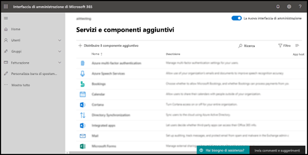

# Abilitare il componente aggiuntivo Segnala messaggio

> [!NOTE]
> Se si è un amministratore in un'organizzazione di Microsoft 365 con cassette postali di Exchange Online, è consigliabile utilizzare il portale invii nel centro sicurezza & Compliance. Per ulteriori informazioni, vedere [utilizzare l'invio di amministratore per inviare messaggi di posta indesiderata, phishing, URL e file a Microsoft](admin-submission.md).

Il componente aggiuntivo segnala messaggio per Outlook e Outlook sul Web (in precedenza noto come Outlook Web App) consente agli utenti di segnalare facilmente falsi positivi (buona posta elettronica contrassegnata come difettosa) o falsi negativi (messaggi di posta elettronica non consentiti) a Microsoft e ai suoi affiliati per l'analisi. Microsoft utilizza questi invii per migliorare l'efficacia delle tecnologie di protezione della posta elettronica.

Si supponga, ad esempio, che le persone riferiscono un gran quantità di messaggi come phishing. Queste informazioni si riferiscono al [dashboard di sicurezza](security-dashboard.md) e ad altri report. Il team di sicurezza dell'organizzazione può utilizzare queste informazioni per indicare che potrebbe essere necessario aggiornare i criteri di protezione anti-phishing. In alternativa, se la gente segnala un gran quantità di messaggi che sono stati contrassegnati come posta indesiderata come non indesiderata utilizzando il componente aggiuntivo segnala messaggio, il team di sicurezza dell'organizzazione potrebbe dover adeguare i criteri di protezione da [posta indesiderata](configure-your-spam-filter-policies.md).

Inoltre, se l'organizzazione utilizza [Office 365 Advanced Threat Protection Plan 1](office-365-atp.md) o [Plan 2](office-365-ti.md), il componente aggiuntivo segnala messaggio fornisce al team di sicurezza dell'organizzazione informazioni utili che è possibile utilizzare per esaminare e aggiornare i criteri di sicurezza.

Gli amministratori possono abilitare il componente aggiuntivo per i messaggi di report per l'organizzazione e i singoli utenti possono installarli personalmente.

Se si è un singolo utente, è possibile [abilitare il componente aggiuntivo per i messaggi di report](#get-the-report-message-add-in-for-yourself).

Se si è un amministratore globale o un amministratore di Exchange Online ed Exchange è configurato per l'utilizzo dell'autenticazione OAuth, è possibile [abilitare il componente aggiuntivo per i messaggi di report per l'organizzazione](#get-and-enable-the-report-message-add-in-for-your-organization). Il componente aggiuntivo segnala messaggio è ora disponibile tramite la [distribuzione centralizzata](https://docs.microsoft.com/office365/admin/manage/centralized-deployment-of-add-ins).

## Che cosa è necessario sapere prima di iniziare

- Il componente aggiuntivo segnala messaggio è compatibile con la maggior parte delle sottoscrizioni Microsoft 365 e i prodotti seguenti:

  - Outlook sul Web
  - Outlook 2013 SP1 o versione successiva
  - Outlook 2016 per Mac
  - Outlook incluso con Microsoft 365 Apps for Enterprise

- Il componente aggiuntivo per i messaggi di report non è attualmente disponibile per:

  - Cassette postali in organizzazioni di Exchange locali
  - Abbonamenti a GCC, GCC HIGH o DoD

- È possibile configurare i messaggi segnalati in modo che vengano copiati o reindirizzati a una cassetta postale specificata. Per ulteriori informazioni, vedere [specificare una cassetta postale per l'invio di messaggi di posta indesiderata e di phishing in Exchange Online](user-submission.md).

- Il Web browser esistente dovrebbe funzionare con il componente aggiuntivo per i messaggi di report. Tuttavia, se si nota che il componente aggiuntivo non è disponibile o non funziona come previsto, provare con un altro browser.

- Per le installazioni organizzative, l'organizzazione deve essere configurata per l'utilizzo dell'autenticazione OAuth. Per ulteriori informazioni, vedere [determinare se la distribuzione centralizzata dei componenti aggiuntivi funziona per l'organizzazione](../../admin/manage/centralized-deployment-of-add-ins.md).

- Gli amministratori devono essere membri del gruppo di ruoli Global Admins. Per altre informazioni, vedere [Autorizzazioni nel Centro sicurezza e conformità](permissions-in-the-security-and-compliance-center.md).

## Ottenere il componente aggiuntivo per i messaggi di report

1. Accedere a Microsoft AppSource <https://appsource.microsoft.com/marketplace/apps> e cercare il componente aggiuntivo per i messaggi di report. Per accedere direttamente al componente aggiuntivo per i messaggi di report, passare a <https://appsource.microsoft.com/product/office/wa104381180> .

2. Fare clic su **Ottieni subito**.

   

3. Nella finestra di dialogo che viene visualizzata, esaminare le condizioni di utilizzo e i criteri di privacy, quindi fare clic su **continua**.

4. Accedere con l'account aziendale o dell'Istituto di istruzione (per uso commerciale) o con il proprio account Microsoft (per uso personale).

Dopo aver installato e abilitato il componente aggiuntivo, vengono visualizzate le icone seguenti:

- In Outlook l'icona è simile alla seguente:

  

- In Outlook sul Web, l'icona è simile alla seguente:

  

Per informazioni su come utilizzare il componente aggiuntivo, vedere [use the report Message Add-in](https://support.office.com/article/b5caa9f1-cdf3-4443-af8c-ff724ea719d2).

## Ottenere e attivare il componente aggiuntivo per i messaggi di report per l'organizzazione

> [!NOTE]
> La visualizzazione del componente aggiuntivo nell'organizzazione potrebbe richiedere fino a 12 ore.

1. Nell'interfaccia di amministrazione di Microsoft 365 passare alla pagina **servizi & componenti** aggiuntivi <https://admin.microsoft.com/AdminPortal/Home#/Settings/ServicesAndAddIns> e quindi fare clic su **Distribuisci componente aggiuntivo**.

   

2. Nel riquadro a comparsa **Distribuisci un nuovo componente aggiuntivo** che viene visualizzato, esaminare le informazioni e quindi fare clic su **Avanti**.

3. Nella pagina successiva fare clic su **Scegli nell'archivio**.

   

4. Nella pagina **Seleziona componente aggiuntivo** visualizzata, fare clic nella casella di **ricerca** , immettere il **messaggio di rapporto**e quindi fare clic su icona ricerca ricerca **Search**  . Nell'elenco dei risultati, trovare il **messaggio di rapporto** , quindi fare clic su **Aggiungi**.

   

5. Nella finestra di dialogo che viene visualizzata, esaminare la gestione delle licenze e le informazioni sulla privacy, quindi fare clic su **continua**.

6. Nella pagina **Configura componente aggiuntivo** che viene visualizzata, configurare le seguenti impostazioni:

   - **Utenti assegnati**: selezionare uno dei valori seguenti:

     - **Tutti** (impostazione predefinita)
     - **Utenti/gruppi specifici**
     - **Solo io**

   - **Metodo di distribuzione**: selezionare uno dei valori seguenti:

     - **Fixed (impostazione predefinita)**: il componente aggiuntivo viene distribuito automaticamente agli utenti specificati e non è possibile rimuoverlo.
     - **Disponibile**: gli utenti possono installare il componente aggiuntivo in **casa** per \> **ottenere i componenti** aggiuntivi gestiti dall' \> **amministratore**.
     - **Facoltativo**: il componente aggiuntivo viene distribuito automaticamente agli utenti specificati, ma è possibile sceglierlo per rimuoverlo.

   

   Al termine, fare clic su **Distribuisci**.

7. Nella pagina **Distribuisci messaggio di report** che viene visualizzata, verrà visualizzato un rapporto sullo stato seguito da una conferma che il componente aggiuntivo è stato distribuito. Dopo aver letto le informazioni, fare clic su **Avanti**.

   

8. Nella pagina del **componente aggiuntivo annunciare** che viene visualizzata, esaminare le informazioni e quindi fare clic su **Chiudi**.

   

## Informazioni su come utilizzare il componente aggiuntivo per i messaggi di report

Gli utenti a cui è assegnato il componente aggiuntivo vedranno le icone seguenti:

- In Outlook l'icona è simile alla seguente:

  

- In Outlook sul Web, l'icona è simile alla seguente:

  

Quando si informa gli utenti sul componente aggiuntivo per i messaggi di report, includere un collegamento per [l'utilizzo del componente aggiuntivo per i messaggi di report](https://support.office.com/article/b5caa9f1-cdf3-4443-af8c-ff724ea719d2).

## Esaminare o modificare le impostazioni per il componente aggiuntivo per i messaggi di report

1. Nell'interfaccia di amministrazione di Microsoft 365, accedere alla pagina **servizi & componenti** aggiuntivi in <https://admin.microsoft.com/AdminPortal/Home#/Settings/ServicesAndAddIns> .

   

2. Individuare e selezionare il componente aggiuntivo per i **messaggi di report** .

3. Nel riquadro a comparsa del **messaggio di modifica** che viene visualizzato, esaminare e modificare le impostazioni appropriate per l'organizzazione. Al termine, scegliere **Salva**.

   

## Visualizzazione e revisione dei messaggi segnalati

Per esaminare i messaggi che gli utenti riferiscono a Microsoft, sono disponibili le seguenti opzioni:

- Utilizzare il portale degli invii di amministratore. Per ulteriori informazioni, vedere [visualizzare gli invii degli utenti a Microsoft](admin-submission.md#view-user-submissions-to-microsoft).

- Creare una regola del flusso di posta (nota anche come regola di trasporto) per inviare copie dei messaggi segnalati. Per istruzioni, vedere [utilizzo delle regole del flusso di posta per vedere cosa gli utenti stanno segnalando a Microsoft](use-mail-flow-rules-to-see-what-your-users-are-reporting-to-microsoft.md).
