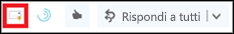

# Abilitare il componente aggiuntivo Segnala messaggioEnable the Report Message add-in

[!INCLUDE [Microsoft 365 Defender rebranding](../includes/microsoft-defender-for-office.md)]

> [!NOTE]
> Se si è un amministratore in un'organizzazione di Microsoft 365 con cassette postali di Exchange Online, è consigliabile utilizzare il portale invii nel centro sicurezza & Compliance.If you're an admin in a Microsoft 365 organization with Exchange Online mailboxes, we recommend that you use the Submissions portal in the Security & Compliance Center. Per ulteriori informazioni, vedere [utilizzare l'invio di amministratore per inviare messaggi di posta indesiderata, phishing, URL e file a Microsoft](admin-submission.md).For more information, see [Use Admin Submission to submit suspected spam, phish, URLs, and files to Microsoft](admin-submission.md).

Il messaggio di report e i componenti aggiuntivi di phishing dei report per Outlook e Outlook sul Web (in precedenza noto come Outlook Web App) consentono agli utenti di segnalare facilmente falsi positivi (buona posta elettronica contrassegnata come difettosa) o falsi negativi (messaggi di posta elettronica non consentiti) a Microsoft e ai suoi affiliati per l'analisi.The Report Message and Report Phishing add-ins for Outlook and Outlook on the web (formerly known as Outlook Web App) enables people to easily report false positives (good email marked as bad) or false negatives (bad email allowed) to Microsoft and its affiliates for analysis.

Microsoft utilizza questi invii per migliorare l'efficacia delle tecnologie di protezione della posta elettronica.Microsoft uses these submissions to improve the effectiveness of email protection technologies. Ad esempio, se gli utenti segnalano numerosi messaggi che sono stati contrassegnati come posta indesiderata come non indesiderata utilizzando il componente aggiuntivo segnala messaggio, il team di sicurezza dell'organizzazione potrebbe dover regolare i criteri di protezione da [posta indesiderata](configure-your-spam-filter-policies.md).For example, if people are reporting a lot of messages that were flagged as junk mail as Not Junk by using the Report Message add-in, your organization's security team might need to adjust [anti-spam policies](configure-your-spam-filter-policies.md).

È possibile installare il messaggio di report o il componente aggiuntivo di phishing del report.You can install either the Report Message or Report Phishing add-in. Se si desidera che gli utenti riportino solo i messaggi di phishing, distribuire il componente aggiuntivo per il phishing dei report nell'organizzazione.If you want your users to report only phishing messages, deploy the Report Phishing add-in in your organization. Per ulteriori informazioni, vedere [Enable the report phishing Add-in](enable-the-report-phish-add-in.md).For more information, see [Enable the Report Phishing add-in](enable-the-report-phish-add-in.md).

Il componente aggiuntivo segnala messaggio fornisce la possibilità di segnalare sia messaggi di posta indesiderata che di phishing.The Report Message add-in provides the option to report both spam and phishing messages. Gli amministratori possono abilitare il componente aggiuntivo per i messaggi di report per l'organizzazione e i singoli utenti possono installarli personalmente.Admins can enable the Report Message add-in for the organization, and individual users can install it for themselves.

Se si è un singolo utente, è possibile [abilitare il componente aggiuntivo per i messaggi di report](#get-the-report-message-add-in-for-yourself).If you're an individual user, you can [enable the Report Message add-in for yourself](#get-the-report-message-add-in-for-yourself).

Se si è un amministratore globale o un amministratore di Exchange Online ed Exchange è configurato per l'utilizzo dell'autenticazione OAuth, è possibile [abilitare il componente aggiuntivo per i messaggi di report per l'organizzazione](#get-and-enable-the-report-message-add-in-for-your-organization).If you're a global administrator or an Exchange Online administrator, and Exchange is configured to use OAuth authentication, you can [enable the Report Message add-in for your organization](#get-and-enable-the-report-message-add-in-for-your-organization). La Add-In del messaggio di report è ora disponibile tramite la [distribuzione centralizzata](https://docs.microsoft.com/microsoft-365/admin/manage/centralized-deployment-of-add-ins).The Report Message Add-In is now available through [Centralized Deployment](https://docs.microsoft.com/microsoft-365/admin/manage/centralized-deployment-of-add-ins).

## Che cosa è necessario sapere prima di iniziareWhat do you need to know before you begin?

- Il componente aggiuntivo segnala messaggio è compatibile con la maggior parte delle sottoscrizioni Microsoft 365 e i prodotti seguenti:The Report Message add-in works with most Microsoft 365 subscriptions and the following products:

  - Outlook sul WebOutlook on the web
  - Outlook 2013 SP1 o versione successivaOutlook 2013 SP1 or later
  - Outlook 2016 per MacOutlook 2016 for Mac
  - Outlook incluso con Microsoft 365 Apps for EnterpriseOutlook included with Microsoft 365 apps for Enterprise

- Il componente aggiuntivo per i messaggi di report non è disponibile per le cassette postali nelle organizzazioni Exchange locali.The Report Message add-in is not available for mailboxes in on-premises Exchange organizations.

- È possibile configurare i messaggi segnalati in modo che vengano copiati o reindirizzati a una cassetta postale specificata.You can configure reported messages to be copied or redirected to a mailbox that you specify. Per ulteriori informazioni, vedere [criteri degli invii degli utenti](user-submission.md).For more information, see [User submissions policies](user-submission.md).

- Il Web browser esistente dovrebbe funzionare con il componente aggiuntivo per i messaggi di report.Your existing web browser should work with the Report Message add-in. Tuttavia, se si nota che il componente aggiuntivo non è disponibile o non funziona come previsto, provare con un altro browser.But, if you notice the add-in is not available or not working as expected, try a different browser.

- Per le installazioni organizzative, l'organizzazione deve essere configurata per l'utilizzo dell'autenticazione OAuth.For organizational installs, the organization needs to be configured to use OAuth authentication. Per ulteriori informazioni, vedere [determinare se la distribuzione centralizzata dei componenti aggiuntivi funziona per l'organizzazione](../../admin/manage/centralized-deployment-of-add-ins.md).For more information, see [Determine if Centralized Deployment of add-ins works for your organization](../../admin/manage/centralized-deployment-of-add-ins.md).

- Gli amministratori devono essere membri del gruppo di ruoli Global Admins.Admins need to be a member of the Global admins role group. Per altre informazioni, vedere [Autorizzazioni nel Centro sicurezza e conformità](permissions-in-the-security-and-compliance-center.md).For more information, see [Permissions in the Security & Compliance Center](permissions-in-the-security-and-compliance-center.md).

## Ottenere il componente aggiuntivo per i messaggi di reportGet the Report Message add-in for yourself

1. Accedere a Microsoft AppSource <https://appsource.microsoft.com/marketplace/apps> e cercare il componente aggiuntivo per i messaggi di report.Go to the Microsoft AppSource at <https://appsource.microsoft.com/marketplace/apps> and search for the Report Message add-in. Per accedere direttamente al componente aggiuntivo per i messaggi di report, passare a <https://appsource.microsoft.com/product/office/wa104381180> .To go directly to the Report Message add-in, go to <https://appsource.microsoft.com/product/office/wa104381180>.

2. Fare clic su **Ottieni subito**.Click **GET IT NOW**.

   

3. Nella finestra di dialogo che viene visualizzata, esaminare le condizioni di utilizzo e i criteri di privacy, quindi fare clic su **continua**.In the dialog that appears, review the terms of use and privacy policy, and then click **Continue**.

4. Accedere con l'account aziendale o dell'Istituto di istruzione (per uso commerciale) o con il proprio account Microsoft (per uso personale).Sign in using your work or school account (for business use) or your Microsoft account (for personal use).

Dopo aver installato e abilitato il componente aggiuntivo, vengono visualizzate le icone seguenti:After the add-in is installed and enabled, you'll see the following icons:

- In Outlook l'icona è simile alla seguente:In Outlook, the icon looks like this:

  

- In Outlook sul Web, l'icona è simile alla seguente:In Outlook on the web, the icon looks like this:

  

Per informazioni su come utilizzare il componente aggiuntivo, vedere [use the report Message Add-in](https://support.microsoft.com/office/b5caa9f1-cdf3-4443-af8c-ff724ea719d2).To learn how to use the add-in, see [Use the Report Message add-in](https://support.microsoft.com/office/b5caa9f1-cdf3-4443-af8c-ff724ea719d2).

## Ottenere e attivare il componente aggiuntivo per i messaggi di report per l'organizzazioneGet and enable the Report Message add-in for your organization

> [!NOTE]
> La visualizzazione del componente aggiuntivo nell'organizzazione potrebbe richiedere fino a 12 ore.It could take up to 12 hours for the add-in to appear in your organization.

1. Nell'interfaccia di amministrazione di Microsoft 365 passare alla pagina Vai alla pagina dei componenti aggiuntivi per le **Impostazioni** , \>  <https://admin.microsoft.com/AdminPortal/Home#/Settings/AddIns> se la pagina del **componente aggiuntivo** non è visualizzata, passare al collegamento **Impostazioni** \> componenti aggiuntivi delle **app integrate** \>  nella parte superiore della pagina delle **app integrate** .In the Microsoft 365 admin center, go to the go to the **Settings** \> **Add-ins** page at <https://admin.microsoft.com/AdminPortal/Home#/Settings/AddIns>, If you don't see the **Add-in** Page, go to the **Settings** \> **Integrated apps** \> **Add-ins** link on the top of the **Integrated apps** page.

2. Selezionare **Distribuisci componente aggiuntivo nella** parte superiore della pagina e quindi fare clic su **Avanti**.Select **Deploy Add-in** at the top of the page, and then select **Next**.

   

3. Nel riquadro a comparsa **Distribuisci un nuovo componente aggiuntivo** che viene visualizzato, esaminare le informazioni e quindi fare clic su **Avanti**.In the **Deploy a new add-in** flyout that appears, review the information, and then click **Next**.

4. Nella pagina successiva fare clic su **Scegli nell'archivio**.On the next page, click **Choose from the Store**.

   

5. Nella pagina **Seleziona componente aggiuntivo** visualizzata, fare clic nella casella di **ricerca** , immettere il **messaggio di rapporto** e quindi fare clic su icona ricerca ricerca   .In the **Select add-in** page that appears, click in the **Search** box, enter **Report Message**, and then click **Search** . Nell'elenco dei risultati, trovare il **messaggio di rapporto** , quindi fare clic su **Aggiungi**.In the list of results, find **Report Message** and then click **Add**.

   

6. Nella finestra di dialogo che viene visualizzata, esaminare la gestione delle licenze e le informazioni sulla privacy, quindi fare clic su **continua**.In the dialog that appears, review the licensing and privacy information, and then click **Continue**.

7. Nella pagina **Configura componente aggiuntivo** che viene visualizzata, configurare le seguenti impostazioni:In the **Configure add-in** page that appears, configure the following settings:

   - **Utenti assegnati**: selezionare uno dei valori seguenti:**Assigned users**: Select one of the following values:

     - **Tutti** (impostazione predefinita)**Everyone** (default)
     - **Utenti/gruppi specifici****Specific users / groups**
     - **Solo io****Just me**

   - **Metodo di distribuzione**: selezionare uno dei valori seguenti:**Deployment method**: Select one of the following values:

     - **Fixed (impostazione predefinita)**: il componente aggiuntivo viene distribuito automaticamente agli utenti specificati e non è possibile rimuoverlo.**Fixed (Default)**: The add-in is automatically deployed to the specified users and they can't remove it.
     - **Disponibile**: gli utenti possono installare il componente aggiuntivo in **casa** per \> **ottenere i componenti** aggiuntivi gestiti dall' \> **amministratore**.**Available**: Users can install the add-in at **Home** \> **Get add-ins** \> **Admin-managed**.
     - **Facoltativo**: il componente aggiuntivo viene distribuito automaticamente agli utenti specificati, ma è possibile sceglierlo per rimuoverlo.**Optional**: The add-in is automatically deployed to the specified users, but they can choose to remove it.

   

   Al termine, fare clic su **Distribuisci**.When you're finished, click **Deploy**.

8. Nella pagina **Distribuisci messaggio di report** che viene visualizzata, verrà visualizzato un rapporto sullo stato seguito da una conferma che il componente aggiuntivo è stato distribuito.In the **Deploy Report Message** page that appears, you'll see a progress report followed by a confirmation that the add-in was deployed. Dopo aver letto le informazioni, fare clic su **Avanti**.After you read the information, click **Next**.

   

9. Nella pagina del **componente aggiuntivo annunciare** che viene visualizzata, esaminare le informazioni e quindi fare clic su **Chiudi**.On the **Announce add-in** page that appears, review the information, and then click **Close**.

   

## Informazioni su come utilizzare il componente aggiuntivo per i messaggi di reportLearn how to use the Report Message add-in

Gli utenti a cui è assegnato il componente aggiuntivo vedranno le icone seguenti:People who have the add-in assigned to them will see the following icons:

- In Outlook l'icona è simile alla seguente:In Outlook, the icon looks like this:

  

- In Outlook sul Web, l'icona è simile alla seguente:In Outlook on the web, the icon looks like this:

  

Quando si informa gli utenti sul componente aggiuntivo per i messaggi di report, includere un collegamento per [l'utilizzo del componente aggiuntivo per i messaggi di report](https://support.microsoft.com/office/b5caa9f1-cdf3-4443-af8c-ff724ea719d2).When you notify users about the Report Message add-in, include a link to [Use the Report Message add-in](https://support.microsoft.com/office/b5caa9f1-cdf3-4443-af8c-ff724ea719d2).

## Esaminare o modificare le impostazioni per il componente aggiuntivo per i messaggi di reportReview or edit settings for the Report Message add-in

1. Nell'interfaccia di amministrazione di Microsoft 365 passare alla pagina Vai alla pagina dei componenti aggiuntivi per le **Impostazioni** , \>  <https://admin.microsoft.com/AdminPortal/Home#/Settings/AddIns> se la pagina del **componente aggiuntivo** non è visualizzata, passare al collegamento **Impostazioni** \> componenti aggiuntivi delle **app integrate** \>  nella parte superiore della pagina delle **app integrate** .In the Microsoft 365 admin center, go to the go to the **Settings** \> **Add-ins** page at <https://admin.microsoft.com/AdminPortal/Home#/Settings/AddIns>, If you don't see the **Add-in** Page, go to the **Settings** \> **Integrated apps** \> **Add-ins** link on the top of the **Integrated apps** page.

   

2. Individuare e selezionare il componente aggiuntivo per i **messaggi di report** .Find and select the **Report Message** add-in.

3. Nel riquadro a comparsa del **messaggio di modifica** che viene visualizzato, esaminare e modificare le impostazioni appropriate per l'organizzazione.In the **Edit Report Message** flyout that appears, review and edit settings as appropriate for your organization. Al termine, scegliere **Salva**.When you're finished, click **Save**.

   

## Visualizzazione e revisione dei messaggi segnalatiView and review reported messages

Per esaminare i messaggi che gli utenti riferiscono a Microsoft, sono disponibili le seguenti opzioni:To review messages that users report to Microsoft, you have these options:

- Utilizzare il portale degli invii di amministratore.Use the Admin Submissions portal. Per ulteriori informazioni, vedere [visualizzare gli invii degli utenti a Microsoft](admin-submission.md#view-user-submissions-to-microsoft).For more information, see [View user submissions to Microsoft](admin-submission.md#view-user-submissions-to-microsoft).

- Creare una regola del flusso di posta (nota anche come regola di trasporto) per inviare copie dei messaggi segnalati.Create a mail flow rule (also known as a transport rule) to send copies of reported messages. Per istruzioni, vedere [utilizzo delle regole del flusso di posta per vedere cosa gli utenti stanno segnalando a Microsoft](use-mail-flow-rules-to-see-what-your-users-are-reporting-to-microsoft.md).For instructions, see [Use mail flow rules to see what your users are reporting to Microsoft](use-mail-flow-rules-to-see-what-your-users-are-reporting-to-microsoft.md).
