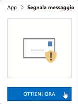

# Abilitare il componente aggiuntivo Segnala messaggio

[!INCLUDE [Microsoft 365 Defender rebranding](../includes/microsoft-defender-for-office.md)]

**Si applica a**
- [Exchange Online Protection](exchange-online-protection-overview.md)
- [Microsoft Defender per Office 365 piano 1 e piano 2](office-365-atp.md)
- [Microsoft 365 Defender](../mtp/microsoft-threat-protection.md)

> [!NOTE]
> Gli amministratori di un'organizzazione di Microsoft 365 con cassette postali di Exchange Online consigliano di usare il portale Invii nel Centro sicurezza & conformità. Per ulteriori informazioni, vedere [Use Admin Submission to submit suspected spam, phish, URLs, and files to Microsoft.](admin-submission.md)

I componenti aggiuntivi Segnala messaggio e Segnala phishing per Outlook e Outlook sul Web (in precedenza noto come Outlook Web App) consentono agli utenti di segnalare facilmente falsi positivi (messaggi di posta elettronica non consentiti) o falsi negativi (posta elettronica non consentita) a Microsoft e alle relative consociati per l'analisi.

Microsoft usa questi invii per migliorare l'efficacia delle tecnologie di protezione della posta elettronica. Ad esempio, se gli utenti segnalano molti messaggi contrassegnati come posta indesiderata come non indesiderata utilizzando il componente aggiuntivo Segnala messaggio, il team di sicurezza dell'organizzazione potrebbe dover modificare i criteri di protezione dalla posta [indesiderata.](configure-your-spam-filter-policies.md)

È possibile installare il componente aggiuntivo Segnala messaggio o Segnala phishing. Se si desidera che gli utenti segnalano solo messaggi di phishing, distribuire il componente aggiuntivo Segnala phishing nell'organizzazione. Per ulteriori informazioni, vedere [Abilitare il componente aggiuntivo Segnala phishing.](enable-the-report-phish-add-in.md)

Il componente aggiuntivo Segnala messaggio consente di segnalare sia i messaggi di posta indesiderata che i messaggi di phishing. Gli amministratori possono abilitare il componente aggiuntivo Segnala messaggio per l'organizzazione e i singoli utenti possono installarlo automaticamente.

Se si è un singolo utente, è possibile abilitare manualmente il [componente aggiuntivo Segnala messaggio.](#get-the-report-message-add-in-for-yourself)

Se si è un amministratore globale o un amministratore di Exchange Online ed Exchange è configurato per l'utilizzo dell'autenticazione OAuth, è possibile abilitare il componente aggiuntivo Segnala messaggio [per l'organizzazione.](#get-and-enable-the-report-message-add-in-for-your-organization) La funzionalità Segnala messaggio Add-In è ora disponibile tramite [la distribuzione centralizzata.](../../admin/manage/centralized-deployment-of-add-ins.md)

## Che cosa è necessario sapere prima di iniziare

- Il componente aggiuntivo Segnala messaggio funziona con la maggior parte degli abbonamenti a Microsoft 365 e dei prodotti seguenti:

  - Outlook sul Web
  - Outlook 2013 SP1 o versione successiva
  - Outlook 2016 per Mac
  - Outlook incluso nelle app di Microsoft 365 per le aziende
  - App Outlook per iOS e Android

- Il componente aggiuntivo Segnala messaggio non è disponibile per le cassette postali condivise o le cassette postali nelle organizzazioni Exchange locali.

- È possibile configurare i messaggi segnalati da copiare o reindirizzare a una cassetta postale specificata. Per altre informazioni, vedi [Criteri di invio degli utenti.](user-submission.md)

- Il Web browser esistente dovrebbe funzionare con il componente aggiuntivo Segnala messaggio. Tuttavia, se si nota che il componente aggiuntivo non è disponibile o non funziona come previsto, provare un browser diverso.

- Per le installazioni dell'organizzazione, l'organizzazione deve essere configurata per l'utilizzo dell'autenticazione OAuth. Per ulteriori informazioni, vedere [Determine if Centralized Deployment of add-ins works for your organization.](../../admin/manage/centralized-deployment-of-add-ins.md)

- Gli amministratori devono essere membri del gruppo di ruoli Amministratori globali. Per altre informazioni, vedere [Autorizzazioni nel Centro sicurezza e conformità](permissions-in-the-security-and-compliance-center.md).

## Ottenere il componente aggiuntivo Segnala messaggio

1. Passare a Microsoft AppSource e cercare il componente aggiuntivo <https://appsource.microsoft.com/marketplace/apps> Segnala messaggio. Per passare direttamente al componente aggiuntivo Segnala messaggio, passare a <https://appsource.microsoft.com/product/office/wa104381180> .

2. Fare **clic su SCARICA ORA.**

   

3. Nella finestra di dialogo visualizzata esaminare le condizioni per l'utilizzo e l'informativa sulla privacy e quindi fare clic su **Continua.**

4. Accedi usando l'account aziendale o dell'istituto di istruzione (per uso aziendale) o l'account Microsoft (per uso personale).

Dopo aver installato e abilitato il componente aggiuntivo, verranno visualizzate le icone seguenti:

- In Outlook l'icona è simile alla seguente:

  

- In Outlook sul Web, l'icona è simile alla seguente:

  

Per informazioni su come utilizzare il componente aggiuntivo, vedere Utilizzare il componente [aggiuntivo Segnala messaggio.](https://support.microsoft.com/office/b5caa9f1-cdf3-4443-af8c-ff724ea719d2)

## Ottenere e abilitare il componente aggiuntivo Segnala messaggio per l'organizzazione

> [!NOTE]
> La visualizzazione del componente aggiuntivo nell'organizzazione potrebbe richiedere fino a 12 ore.

1. Nell'interfaccia di amministrazione di Microsoft 365  passare alla pagina Componenti aggiuntivi impostazioni \>  <https://admin.microsoft.com/AdminPortal/Home#/Settings/AddIns> all'indirizzo  ,  Se la pagina del componente aggiuntivo non è visualizzata, passare al collegamento Impostazioni componenti aggiuntivi app integrate nella parte superiore della pagina App \>  \>  integrate. 

2. Selezionare **Distribuisci componente aggiuntivo** nella parte superiore della pagina e quindi fare clic su **Avanti.**

   

3. Nel riquadro **a comparsa Distribuisci un** nuovo componente aggiuntivo visualizzato, esaminare le informazioni e quindi fare clic su **Avanti.**

4. Nella pagina successiva fai clic su **Scegli dallo Store.**

   

5. Nella pagina **Seleziona componente aggiuntivo visualizzata** fare clic nella casella **di** ricerca, immettere **Segnala** messaggio e quindi fare clic **sull'icona**  Cerca. Nell'elenco dei risultati, trovare **Segnala messaggio e** quindi fare clic su **Aggiungi.**

   

6. Nella finestra di dialogo visualizzata esaminare le informazioni sulla licenza e sulla privacy e quindi fare clic su **Continua.**

7. Nella pagina **Configura componente aggiuntivo** visualizzata configurare le impostazioni seguenti:

   - **Utenti assegnati:** selezionare uno dei seguenti valori:

     - **Tutti** (impostazione predefinita)
     - **Utenti/gruppi specifici**
     - **Solo io**

   - **Metodo di distribuzione:** selezionare uno dei valori seguenti:

     - **Risolto (impostazione predefinita):** il componente aggiuntivo viene distribuito automaticamente agli utenti specificati e non può essere rimosso.
     - **Disponibile:** gli utenti possono installare il componente aggiuntivo in **Home** \> **Get add-ins** \> **Gestito dall'amministratore.**
     - **Facoltativo:** il componente aggiuntivo viene distribuito automaticamente agli utenti specificati, ma può scegliere di rimuoverlo.

   

   Al termine, fare clic su **Distribuisci.**

8. Nella pagina **Deploy Report Message** visualizzata verrà visualizzato un rapporto sullo stato seguito da una conferma della distribuzione del componente aggiuntivo. Dopo aver letto le informazioni, fare clic su **Avanti.**

   

9. Nella pagina **Annuncia componente aggiuntivo visualizzata** esaminare le informazioni e quindi fare clic su **Chiudi.**

   

## Informazioni su come usare il componente aggiuntivo Segnala messaggio

Gli utenti a cui è assegnato il componente aggiuntivo visualizzano le icone seguenti:

- In Outlook l'icona è simile alla seguente:

  

- In Outlook sul Web, l'icona è simile alla seguente:

  

Quando si invia una notifica agli utenti sul componente aggiuntivo Segnala messaggio, includere un collegamento per utilizzare il componente aggiuntivo [Segnala messaggio.](https://support.microsoft.com/office/b5caa9f1-cdf3-4443-af8c-ff724ea719d2)

## Rivedere o modificare le impostazioni per il componente aggiuntivo Segnala messaggio

1. Nell'interfaccia di amministrazione di Microsoft 365  passare alla pagina Componenti aggiuntivi impostazioni \>  <https://admin.microsoft.com/AdminPortal/Home#/Settings/AddIns> all'indirizzo  ,  Se la pagina del componente aggiuntivo non è visualizzata, passare al collegamento Impostazioni componenti aggiuntivi app integrate nella parte superiore della pagina App \>  \>  integrate. 

   

2. Trovare e selezionare il **componente aggiuntivo Segnala** messaggio.

3. Nel riquadro **a comparsa Modifica** messaggio rapporto visualizzato, rivedere e modificare le impostazioni in base alle esigenze dell'organizzazione. Al termine, scegliere **Salva**.

   

## Visualizzare ed esaminare i messaggi segnalati

Per esaminare i messaggi che gli utenti segnalano a Microsoft, sono disponibili le opzioni seguenti:

- Usa il portale invii di amministratori. Per altre informazioni, vedi [Visualizzare gli invii degli utenti a Microsoft.](admin-submission.md#view-user-submissions-to-microsoft)

- Creare una regola del flusso di posta (nota anche come regola di trasporto) per inviare copie dei messaggi segnalati. Per istruzioni, vedere [Usare le regole del flusso di posta per vedere cosa segnalano gli](use-mail-flow-rules-to-see-what-your-users-are-reporting-to-microsoft.md)utenti a Microsoft.
