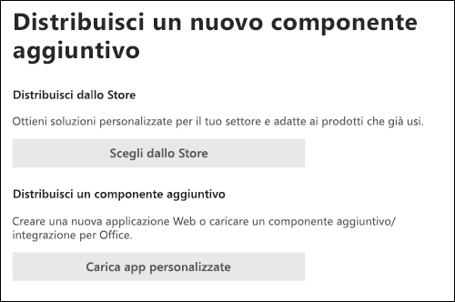

# Abilitare il componente aggiuntivo Segnala phishingEnable the Report Phishing add-in

[!INCLUDE [Microsoft 365 Defender rebranding](../includes/microsoft-defender-for-office.md)]

> [!NOTE]
> Se si è un amministratore di un'organizzazione Microsoft 365 con cassette postali di Exchange Online, è consigliabile utilizzare il portale invii nel Centro sicurezza & conformità.If you're an admin in a Microsoft 365 organization with Exchange Online mailboxes, we recommend that you use the Submissions portal in the Security & Compliance Center. Per ulteriori informazioni, vedere [Use Admin Submission to submit suspected spam, phish, URLs, and files to Microsoft](admin-submission.md).For more information, see [Use Admin Submission to submit suspected spam, phish, URLs, and files to Microsoft](admin-submission.md).

I componenti aggiuntivi Segnala messaggio e Segnala phishing per Outlook e Outlook sul Web (in precedenza noto come Outlook Web App) consentono agli utenti di segnalare facilmente falsi positivi (buona posta elettronica contrassegnata come non buona) o falsi negativi (posta elettronica non consentita) a Microsoft e alle relative affiliate per l'analisi.The Report Message and Report Phishing add-ins for Outlook and Outlook on the web (formerly known as Outlook Web App) enable people to easily report false positives (good email marked as bad) or false negatives (bad email allowed) to Microsoft and its affiliates for analysis.

Microsoft usa questi invii per migliorare l'efficacia delle tecnologie di protezione della posta elettronica.Microsoft uses these submissions to improve the effectiveness of email protection technologies. Si supponga, ad esempio, che gli utenti segnalano molti messaggi utilizzando il componente aggiuntivo Segnala phishing.For example, suppose that people are reporting many messages using the Report Phishing add-in. Queste informazioni vengono visualizzate nel [dashboard di sicurezza](security-dashboard.md) e in altri report.This information surfaces in the [Security Dashboard](security-dashboard.md) and other reports. Il team di sicurezza dell'organizzazione può utilizzare queste informazioni per indicare che potrebbe essere necessario aggiornare i criteri anti-phishing.Your organization's security team can use this information as an indication that anti-phishing policies might need to be updated.

È possibile installare il componente aggiuntivo Segnala messaggio o Segnala phishing.You can install either the Report Message or Report Phishing add-in. Se si desidera che gli utenti segnalano messaggi di posta indesiderata e di phishing, distribuire il componente aggiuntivo Segnala messaggio nell'organizzazione.If you want your users to report both spam and phishing messages, deploy the Report Message add-in in your organization. Per ulteriori informazioni, vedere [Enable the Report Message add-in](enable-the-report-message-add-in.md).For more information, see [Enable the Report Message add-in](enable-the-report-message-add-in.md).

Il componente aggiuntivo Segnala phishing consente di segnalare solo i messaggi di phishing.The Report Phishing add-in provides the option to report only phishing messages. Gli amministratori possono abilitare il componente aggiuntivo Segnala phishing per l'organizzazione e i singoli utenti possono installarlo automaticamente.Admins can enable the Report Phishing add-in for the organization, and individual users can install it for themselves.

Se si è un singolo utente, è possibile abilitare il componente aggiuntivo Segnala phishing [per se stessi.](#get-the-report-phishing-add-in-for-yourself)If you're an individual user, you can [enable the Report Phishing add-in for yourself](#get-the-report-phishing-add-in-for-yourself).

Se si è un amministratore globale o un amministratore di Exchange Online e Exchange è configurato per l'utilizzo dell'autenticazione OAuth, è possibile abilitare il componente aggiuntivo Segnala phishing per [l'organizzazione.](#get-and-enable-the-report-phishing-add-in-for-your-organization)If you're a global administrator or an Exchange Online administrator, and Exchange is configured to use OAuth authentication, you can [enable the Report Phishing add-in for your organization](#get-and-enable-the-report-phishing-add-in-for-your-organization). L'Add-In di phishing dei report è ora disponibile tramite [distribuzione centralizzata.](../../admin/manage/centralized-deployment-of-add-ins.md)The Report Phishing Add-In is now available through [Centralized Deployment](../../admin/manage/centralized-deployment-of-add-ins.md).

## Che cosa è necessario sapere prima di iniziare?What do you need to know before you begin?

- Il componente aggiuntivo Segnala phishing funziona con la maggior parte Microsoft 365 sottoscrizioni e i prodotti seguenti:The Report Phishing add-in works with most Microsoft 365 subscriptions and the following products:

  - Outlook sul WebOutlook on the web
  - Outlook 2013 SP1 o versione successivaOutlook 2013 SP1 or later
  - Outlook 2016 per Mac o versioni successiveOutlook 2016 for Mac or later
  - Outlook incluse nelle app Microsoft 365 per EnterpriseOutlook included with Microsoft 365 apps for Enterprise
  - Outlook app per iOS e AndroidOutlook app for iOS and Android

- Il componente aggiuntivo Segnala phishing non è disponibile per le cassette postali condivise o le cassette postali nelle organizzazioni Exchange locali.The Report Phishing add-in is not available for shared mailboxes or mailboxes in on-premises Exchange organizations.

- È possibile configurare i messaggi segnalati da copiare o reindirizzare a una cassetta postale specificata.You can configure reported messages to be copied or redirected to a mailbox that you specify. Per ulteriori informazioni, vedere [Criteri di invio degli utenti.](user-submission.md)For more information, see [User submissions policies](user-submission.md).

- Il Web browser esistente dovrebbe funzionare con il componente aggiuntivo Segnala phishing.Your existing web browser should work with the Report Phishing add-in. Tuttavia, se si nota che il componente aggiuntivo non è disponibile o non funziona come previsto, provare un browser diverso.But, if you notice the add-in is not available or not working as expected, try a different browser.

- Per le installazioni dell'organizzazione, l'organizzazione deve essere configurata per l'utilizzo dell'autenticazione OAuth.For organizational installs, the organization needs to be configured to use OAuth authentication. Per ulteriori informazioni, vedere [Determine if Centralized Deployment of add-ins works for your organization](../../admin/manage/centralized-deployment-of-add-ins.md).For more information, see [Determine if Centralized Deployment of add-ins works for your organization](../../admin/manage/centralized-deployment-of-add-ins.md).

- Gli amministratori devono essere membri del gruppo di ruoli Amministratori globali.Admins need to be a member of the Global admins role group. Per altre informazioni, vedere [Autorizzazioni nel Centro sicurezza e conformità](permissions-in-the-security-and-compliance-center.md).For more information, see [Permissions in the Security & Compliance Center](permissions-in-the-security-and-compliance-center.md).

## Ottenere il componente aggiuntivo Segnala phishing per se stessiGet the Report Phishing add-in for yourself

1. Vai a Microsoft AppSource <https://appsource.microsoft.com/marketplace/apps> all'indirizzo e cerca il componente aggiuntivo Segnala phishing.Go to the Microsoft AppSource at <https://appsource.microsoft.com/marketplace/apps> and search for the Report Phishing add-in.

2. Fai **clic su SCARICA ORA**.Click **GET IT NOW**.

3. Nella finestra di dialogo visualizzata esaminare le condizioni per l'utilizzo e l'informativa sulla privacy e quindi fare clic su **Continua.**In the dialog that appears, review the terms of use and privacy policy, and then click **Continue**.

4. Accedi usando l'account aziendale o dell'istituto di istruzione (per uso aziendale) o l'account Microsoft (per uso personale).Sign in using your work or school account (for business use) or your Microsoft account (for personal use).

Dopo aver installato e abilitato il componente aggiuntivo, verranno visualizzate le icone seguenti:After the add-in is installed and enabled, you'll see the following icons:

- In Outlook, l'icona è simile alla seguente:In Outlook, the icon looks like this:

  

- In Outlook sul Web, l'icona è simile alla seguente:In Outlook on the web, the icon looks like this:

  

## Ottenere e abilitare il componente aggiuntivo Segnala phishing per l'organizzazioneGet and enable the Report Phishing add-in for your organization

> [!NOTE]
> La visualizzazione del componente aggiuntivo nell'organizzazione potrebbe richiedere fino a 12 ore.It could take up to 12 hours for the add-in to appear in your organization.

1. Nell'interfaccia di amministrazione di Microsoft 365 passare alla pagina Componenti aggiuntivi di **Impostazioni** \>  <https://admin.microsoft.com/AdminPortal/Home#/Settings/AddIns> all'indirizzo ,   \>  \>   Se la pagina del componente aggiuntivo non è visualizzata, passare al collegamento Componenti aggiuntivi app integrate di Impostazioni nella parte superiore della pagina App integrate.In the Microsoft 365 admin center, go to the go to the **Settings** \> **Add-ins** page at <https://admin.microsoft.com/AdminPortal/Home#/Settings/AddIns>, If you don't see the **Add-in** Page, go to the **Settings** \> **Integrated apps** \> **Add-ins** link on the top of the **Integrated apps** page.

2. Selezionare **Distribuisci componente aggiuntivo** nella parte superiore della pagina e quindi selezionare **Avanti.**Select **Deploy Add-in** at the top of the page, and then select **Next**.

   

3. Nel riquadro **a comparsa Distribuisci un** nuovo componente aggiuntivo visualizzato esaminare le informazioni e quindi fare clic su **Avanti.**In the **Deploy a new add-in** flyout that appears, review the information, and then click **Next**.

4. Nella pagina successiva fai clic su **Scegli dallo Store.**On the next page, click **Choose from the Store**.

   

5. Nella pagina **Seleziona componente aggiuntivo visualizzata** fare clic nella casella **Di** ricerca, immettere **Segnala phishing** e quindi fare clic su **Cerca**  Ricerca.In the **Select add-in** page that appears, click in the **Search** box, enter **Report Phishing**, and then click **Search** . Nell'elenco dei risultati, individuare **Segnala phishing** e quindi fare clic su **Aggiungi.**In the list of results, find **Report Phishing** and then click **Add**.

6. Nella finestra di dialogo visualizzata esaminare le informazioni sulla licenza e sulla privacy e quindi fare clic su **Continua.**In the dialog that appears, review the licensing and privacy information, and then click **Continue**.

7. Nella pagina **Configura componente aggiuntivo visualizzata** configurare le impostazioni seguenti:In the **Configure add-in** page that appears, configure the following settings:

   - **Utenti assegnati**: selezionare uno dei valori seguenti:**Assigned users**: Select one of the following values:

     - **Tutti** (impostazione predefinita)**Everyone** (default)
     - **Utenti/gruppi specifici****Specific users / groups**
     - **Solo io****Just me**

   - **Metodo di distribuzione:** selezionare uno dei valori seguenti:**Deployment method**: Select one of the following values:

     - **Risolto (impostazione predefinita):** il componente aggiuntivo viene distribuito automaticamente agli utenti specificati e non può essere rimosso.**Fixed (Default)**: The add-in is automatically deployed to the specified users and they can't remove it.
     - **Disponibile**: gli utenti possono installare il componente aggiuntivo in **Home** \> **Get add-ins** \> **Admin-managed**.**Available**: Users can install the add-in at **Home** \> **Get add-ins** \> **Admin-managed**.
     - **Facoltativo:** il componente aggiuntivo viene distribuito automaticamente agli utenti specificati, ma può scegliere di rimuoverlo.**Optional**: The add-in is automatically deployed to the specified users, but they can choose to remove it.

   Al termine, fare clic su **Distribuisci**.When you're finished, click **Deploy**.

8. Nella pagina **Distribuisci phishing** report visualizzata verrà visualizzato un rapporto sullo stato seguito da una conferma della distribuzione del componente aggiuntivo.In the **Deploy Report Phishing** page that appears, you'll see a progress report followed by a confirmation that the add-in was deployed. Dopo aver letto le informazioni, fare clic su **Avanti.**After you read the information, click **Next**.

9. Nella pagina **Annuncia componente aggiuntivo visualizzata** esaminare le informazioni e quindi fare clic su **Chiudi.**On the **Announce add-in** page that appears, review the information, and then click **Close**.

## Informazioni su come usare il componente aggiuntivo Segnala phishingLearn how to use the Report Phishing add-in

Gli utenti a cui è assegnato il componente aggiuntivo visualizzano le icone seguenti:People who have the add-in assigned to them will see the following icons:

- In Outlook, l'icona è simile alla seguente:In Outlook, the icon looks like this:

  

- In Outlook sul Web, l'icona è simile alla seguente:In Outlook on the web, the icon looks like this:

  

## Rivedere o modificare le impostazioni per il componente aggiuntivo Segnala phishingReview or edit settings for the Report Phishing add-in

1. Nell'interfaccia di amministrazione di Microsoft 365 passare alla pagina Componenti aggiuntivi di **Impostazioni** \>  <https://admin.microsoft.com/AdminPortal/Home#/Settings/AddIns> all'indirizzo ,   \>  \>   Se la pagina del componente aggiuntivo non è visualizzata, passare al collegamento Componenti aggiuntivi app integrate di Impostazioni nella parte superiore della pagina App integrate.In the Microsoft 365 admin center, go to the go to the **Settings** \> **Add-ins** page at <https://admin.microsoft.com/AdminPortal/Home#/Settings/AddIns>, If you don't see the **Add-in** Page, go to the **Settings** \> **Integrated apps** \> **Add-ins** link on the top of the **Integrated apps** page.

2. Individuare e selezionare il **componente aggiuntivo Segnala** phishing.Find and select the **Report Phishing** add-in.

3. Nel riquadro **a comparsa Modifica rapporto Phishing** visualizzato, esaminare e modificare le impostazioni in base alle esigenze dell'organizzazione.In the **Edit Report Phishing** flyout that appears, review, and edit settings as appropriate for your organization. Al termine, scegliere **Salva**.When you're finished, click **Save**.

## Visualizzare ed esaminare i messaggi segnalatiView and review reported messages

Per esaminare i messaggi che gli utenti segnalano a Microsoft, sono disponibili le opzioni seguenti:To review messages that users report to Microsoft, you have these options:

- Usa il portale per gli invii di amministratori.Use the Admin Submissions portal. Per ulteriori informazioni, vedere [View user submissions to Microsoft](admin-submission.md#view-user-submissions-to-microsoft).For more information, see [View user submissions to Microsoft](admin-submission.md#view-user-submissions-to-microsoft).

- Creare una regola del flusso di posta (nota anche come regola di trasporto) per inviare copie dei messaggi segnalati.Create a mail flow rule (also known as a transport rule) to send copies of reported messages. Per istruzioni, vedere [Use mail flow rules to see what users are reporting to Microsoft](/exchange/security-and-compliance/mail-flow-rules/use-rules-to-see-what-users-are-reporting-to-microsoft).For instructions, see [Use mail flow rules to see what users are reporting to Microsoft](/exchange/security-and-compliance/mail-flow-rules/use-rules-to-see-what-users-are-reporting-to-microsoft).
