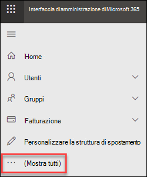
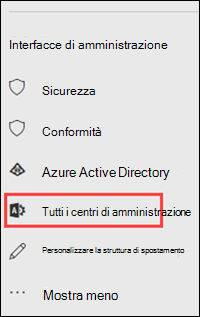

# Interfaccia di amministrazione di Exchange Online Protection autonomo

[!INCLUDE [Microsoft 365 Defender rebranding](../includes/microsoft-defender-for-office.md)]

Interfaccia di amministrazione di Exchange (EAC) è una console di gestione basata sul Web per Exchange Online Protection (EOP) autonomo.

Per informazioni sulla versione di Exchange online in questo argomento, vedere Vedere interfaccia [di amministrazione di Exchange in Exchange Online](https://docs.microsoft.com/exchange/exchange-admin-center).

## Aprire l'interfaccia di amministrazione di Exchange in EOP

I clienti EOP autonomi possono accedere all'interfaccia di amministrazione di Exchange utilizzando i metodi seguenti:

- **Dall'interfaccia di amministrazione di Microsoft 365**:

  1. Andare a <https://admin.microsoft.com> e fare clic su **Mostra tutto**.

     

  2. Nella sezione interfaccia di **Amministrazione** visualizzata fare clic su **tutti i centri di amministrazione**.

     

  3. Nella pagina **tutti i centri di amministrazione** visualizzati fare clic su **Exchange Online Protection**.

- Andare direttamente a `https://admin.protection.outlook.com/ecp/` .

## Elementi comuni dell'interfaccia utente in EAC in EOP

In questa sezione vengono illustrati gli elementi dell'interfaccia utente disponibili in EAC.

### Riquadro delle funzionalità

È il primo livello di esplorazione per la maggior parte delle attività da eseguire in EAC. Il riquadro delle funzionalità è organizzato in aree funzionali.

- **Destinatari**: consente di visualizzare gruppi e contatti esterni.

- **Autorizzazioni**: consente di gestire i ruoli di amministratore.

- **Gestione della conformità**: consente di trovare il rapporto del gruppo di ruoli amministratore e il report del registro di controllo di amministrazione.

- **Protezione**: è possibile gestire i criteri antimalware, i criteri di filtro delle connessioni predefiniti e DKIM.

  > [!NOTE]
  > È consigliabile gestire i criteri antimalware e i criteri di filtro delle connessioni predefiniti nel centro sicurezza & conformità. Per ulteriori informazioni, vedere [Configure anti-malware Policies in EOP](configure-anti-malware-policies.md) e [Configure Connection Filtering in EOP](configure-the-connection-filter-policy.md).

- **Flusso di posta**: consente di gestire le regole del flusso di posta (note anche come regole di trasporto), i domini accettati e i connettori, nonché le posizioni in cui è possibile eseguire la traccia dei messaggi.

- Soluzione **ibrida**: è possibile eseguire la [procedura guidata di configurazione ibrida](https://docs.microsoft.com/Exchange/hybrid-configuration-wizard)e dove è possibile installare il [modulo di PowerShell di Exchange Online](https://docs.microsoft.com/powershell/exchange/mfa-connect-to-exchange-online-powershell).

### Schede

Le schede rappresentano il secondo livello di esplorazione. Ciascuna area funzionale contiene varie schede, ognuna delle quali rappresenta una funzionalità.

### Barra degli strumenti

La selezione della maggior parte delle schede consente di visualizzare una barra degli strumenti. che include icone che eseguono un'azione specifica. Nella tabella seguente sono descritte le icone e le loro azioni.

****

|Icona|Nome|Azione|
|---|---|---|
||Aggiungi, Nuovo|Utilizzare questa icona per creare un nuovo oggetto. Ad alcune icone è associata una freccia in giù sulla quale si può fare clic per mostrare ulteriori oggetti da creare.|
||Modifica|Utilizzare questa icona per modificare un oggetto.|
||Elimina|Utilizzare questa icona per eliminare un oggetto. Ad alcune icone Elimina è associata una freccia in giù su cui si può fare clic per mostrare altre opzioni.|
||Cerca|Utilizzare questa icona per aprire una casella di ricerca in cui digitare la frase di ricerca per l'oggetto che si desidera trovare.|
||Aggiorna|Utilizzare questa icona per aggiornare la visualizzazione elenco.|
||Altre opzioni|Utilizzare questa icona per visualizzare le altre azioni da eseguire per gli oggetti della scheda. Ad esempio in **Destinatari \> Utenti**, facendo clic sull'icona, viene visualizzata l'opzione per eseguire una **Ricerca avanzata**.  |
||Freccia su e freccia giù|Utilizzare queste icone per spostare la priorità di un oggetto verso l'alto o verso il basso.|
||Rimuovi|Questa icona consente di rimuovere gli oggetti da un elenco.|
|

### Visualizzazione elenco

Selezionando una scheda, nella maggior parte dei casi viene attivata una visualizzazione elenco. Il limite visualizzabile con l'elenco EAC è di circa 10.000 oggetti. È inoltre inclusa la funzione di paging che consente di scorrere fino ai risultati.

### Riquadro dei dettagli

Quando si seleziona un oggetto dalla visualizzazione elenco, nel riquadro dei dettagli vengono visualizzate le informazioni relative all'oggetto in questione. In alcuni casi il riquadro dei dettagli include attività di gestione.

### Riquadro Io e Guida

Il riquadro **Io** consente di disconnettersi da EAC e accedere come altro utente. Dal   , è possibile eseguire le operazioni seguenti:

- **Guida**: fare clic su  per visualizzare il contenuto della Guida in linea.
- **Commenti e suggerimenti**: lasciare commenti e suggerimenti.
- **Community**: inviare una domanda per trovare risposte nei forum della community.
- **Disattiva la guida del fumetto**: la Guida di bubbling Visualizza la supporto contestuale per i campi quando si crea o si modifica un oggetto. È possibile disabilitare la finestra della Guida o riattivarla se era stata disabilitata.
- **Mostra registrazione comandi**: viene visualizzata una nuova finestra in cui vengono visualizzati i comandi di PowerShell equivalenti in base alle impostazioni configurate in EAC.

## Browser supportati

Per la migliore esperienza nell'utilizzo di EAC, si consiglia di utilizzare sempre i browser più recenti, i client e le app di Office. Si consiglia inoltre di installare gli aggiornamenti software quando disponibili. Per ulteriori informazioni sui browser supportati e sui requisiti di sistema per il servizio, vedere [requisiti di sistema per Office](https://products.office.com/office-system-requirements).

## Lingue supportate

Le lingue seguenti sono supportate e disponibili per l'interfaccia di amministrazione di Exchange in EOP autonomo.

- Amharico
- Arabo
- Basco (Province basche)
- Bengali (India)
- Bulgaro
- Catalano
- Cinese (semplificato)
- Cinese (tradizionale)
- Croato
- Ceco
- Danese
- Olandese
- Inglese
- Estone
- Filippino (Filippine)
- Finlandese
- Francese
- Gallego
- Tedesco
- Greco
- Gujarati
- Ebraico
- Hindi
- Ungherese
- Islandese
- Indonesiano
- Italiano
- Giapponese
- Kannada
- Kazaco
- Kiswahili
- Coreano
- Lettone
- Lituano
- Malese (Brunei Darussalam)
- Malese (Malesia)
- Malayalam
- Marathi
- Norvegese (Bokmål)
- Norvegese (Nynorsk)
- Oriya
- Persiano
- Polacco
- Portoghese (Brasile)
- Portoghese (Portogallo)
- Rumeno
- Russo
- Serbo (alfabeto cirillico)
- Serbo (alfabeto latino)
- Slovacco
- Sloveno
- Spagnolo
- Svedese
- Tamil
- Telugu
- Tailandese
- Turco
- Ucraino
- Urdu
- Vietnamita
- Gallese
