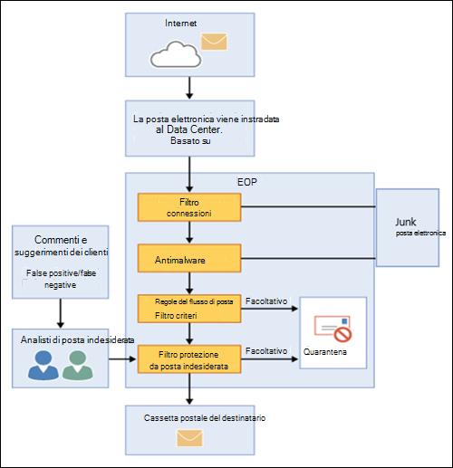

# Panoramica su Exchange Online ProtectionExchange Online Protection overview

Exchange Online Protection (EOP) è il servizio di filtraggio basato sul cloud che consente di proteggere l'organizzazione da posta indesiderata e malware.Exchange Online Protection (EOP) is the cloud-based filtering service that helps protect your organization against spam and malware. EOP è incluso in tutte le organizzazioni Microsoft 365 con le cassette postali di Exchange Online.EOP is included in all Microsoft 365 organizations with Exchange Online mailboxes.

Tuttavia, EOP è disponibile anche negli scenari locali seguenti:But, EOP is also available in the following on-premises scenarios:

- **In uno scenario autonomo**: EOP fornisce la protezione della posta elettronica basata sul cloud per l'organizzazione di Exchange locale o per qualsiasi altra soluzione di posta elettronica SMTP locale.**In a standalone scenario**: EOP provides cloud-based email protection for your on-premises Exchange organization or for any other on-premises SMTP email solution.

- **In una distribuzione ibrida**: EOP può essere configurato per proteggere l'ambiente di posta elettronica e controllare il routing della posta quando si dispone di una combinazione di cassette postali locali e cloud.**In a hybrid deployment**: EOP can be configured to protect your email environment and control mail routing when you have a mix of on-premises and cloud mailboxes.

In questi scenari, EOP è in grado di semplificare la gestione dell'ambiente di posta elettronica e di alleviare molti dei fardelli in cui vengono mantenuta l'hardware e il software locali.In these scenarios, EOP can simplify the management of your email environment and alleviate many of the burdens that come with maintaining on-premises hardware and software.

Il resto di questo argomento illustra la modalità di funzionamento di EOP in ambienti autonomi e ibridi.The rest of this topic explains how EOP works in standalone and hybrid environments.

## Come funziona EOPHow EOP works

Per capire come funziona EOP, aiuta osservare il modo in cui elabora la posta in arrivo:To understand how EOP works, it helps to see how it processes incoming email:

- Un messaggio in arrivo passa inizialmente tramite il filtro connessioni, che controlla la reputazione del mittente e controlla il messaggio per il malware.An incoming message initially passes through connection filtering, which checks the sender's reputation and inspects the message for malware. La maggior parte della posta indesiderata viene interrotta a questo punto e viene eliminata da EOP.The majority of spam is stopped at this point and deleted by EOP. Per ulteriori informazioni, vedere [Configurare il filtraggio delle connessioni](configure-the-connection-filter-policy.md).For more information, see [Configure connection filtering](configure-the-connection-filter-policy.md).

- I messaggi continuano tramite il filtro dei criteri, in cui i messaggi vengono valutati in base alle regole del flusso di posta personalizzate (note anche come regole di trasporto) create o applicate da un modello.Messages continue through policy filtering, where messages are evaluated against custom mail flow rules (also known as transport rules) that you create or enforce from a template. Ad esempio, è possibile disporre di una regola che invia una notifica a un responsabile quando la posta arriva da un mittente specifico.For example, you can have a rule that sends a notification to a manager when mail arrives from a specific sender. I controlli di prevenzione della perdita di dati (DLP) si verificano anche a questo punto (Exchange Enterprise CAL with Services).Data loss prevention (DLP) checks also occur at this point (Exchange Enterprise CAL with Services).

- Successivamente, i messaggi passano attraverso il filtro di protezione dalla posta indesiderata (noto anche come filtro contenuto).Next, messages pass through anti-spam filtering (also known as content filtering). Un messaggio che è determinato come posta indesiderata può essere inviato alla cartella posta indesiderata di un utente o alla quarantena, tra le altre opzioni.A message that's determined to be spam can be sent to a user's Junk Email folder or to the quarantine, among other options. Per altre informazioni, vedere [Configurare i criteri di protezione dalla posta indesiderata](configure-your-spam-filter-policies.md).For more information, see [Configure anti-spam policies](configure-your-spam-filter-policies.md).

- Dopo che un messaggio ha superato tutti questi livelli di protezione, viene recapitato al destinatario.After a message passes all of these protection layers successfully, it's delivered to the recipient.

Per ulteriori informazioni, vedere [ordine e precedenza della protezione della posta elettronica](how-policies-and-protections-are-combined.md).For more information, see [Order and precedence of email protection](how-policies-and-protections-are-combined.md).

### Datacenter EOPEOP datacenters

EOP viene eseguito in una rete globale di centri dati progettati per offrire la massima disponibilità.EOP runs on a worldwide network of datacenters that are designed to provide the best availability. Ad esempio, se un datacenter non è disponibile, i messaggi di posta elettronica vengono automaticamente instradati a un altro datacenter senza interruzione del servizio.For example, if a datacenter becomes unavailable, email messages are automatically routed to another datacenter without any interruption in service. I server di ogni data center accettano messaggi per conto di, fornendo un livello di separazione tra l'organizzazione e Internet, riducendo così il carico sui server.Servers in each datacenter accept messages on your behalf, providing a layer of separation between your organization and the internet, thereby reducing load on your servers. Attraverso questa rete altamente disponibile, Microsoft può garantire che la posta elettronica raggiunga l'organizzazione in modo tempestivo.Through this highly available network, Microsoft can ensure that email reaches your organization in a timely manner.

EOP esegue il bilanciamento del carico tra i datacenter ma solo all'intero di un'area geografica. In caso di provisioning in un'unica area geografica, tutti i messaggi saranno elaborati utilizzando il routing della posta per tale area geografica. L'elenco seguente mostra il modo in cui funziona il routing della posta regionale per i datacenter EOP:EOP performs load balancing between datacenters but only within a region. If you're provisioned in one region all your messages will be processed using the mail routing for that region. The following list shows the how regional mail routing works for the EOP datacenters:

- In Europa, Medio Oriente e Africa (EMEA), tutte le cassette postali di Exchange Online si trovano in datacenter situati in EMEA e tutti i messaggi vengono instradati tramite datacenter in EMEA per il filtraggio EOP.In Europe, the Middle East, and Africa (EMEA), all Exchange Online mailboxes are located in EMEA datacenters, and all messages are routed through EMEA datacenters for EOP filtering.

- In Asia-Pacifico (APAC), tutte le cassette postali di Exchange Online si trovano in datacenter APAC e i messaggi sono attualmente instradati attraverso i datacenter di APAC per il filtro EOP.In Asia-Pacific (APAC), all Exchange Online mailboxes are located in APAC datacenters, and messages are currently routed through APAC datacenters for EOP filtering.

- Nelle Americhe i servizi sono distribuiti nei seguenti percorsi:In the Americas, services are distributed in the following locations:

  - Sud America: le cassette postali di Exchange Online si trovano in datacenter in Brasile e Cile.South America: Exchange Online mailboxes are located in datacenters in Brazil and Chile. Tutti i messaggi vengono instradati attraverso i centri dati locali per il filtro EOP.All messages are routed through local datacenters for EOP filtering. I messaggi in quarantena vengono archiviati nel centro dati in cui si trova il tenant.Quarantined messages are stored in the datacenter where the tenant is located.

  - Canada: le cassette postali di Exchange Online si trovano in datacenter in Canada.Canada: Exchange Online mailboxes are located in datacenters in Canada. Tutti i messaggi vengono instradati attraverso i centri dati locali per il filtro EOP.All messages are routed through local datacenters for EOP filtering. I messaggi in quarantena vengono archiviati nel centro dati in cui si trova il tenant.Quarantined messages are stored in the datacenter where the tenant is located.

  - Stati Uniti: le cassette postali di Exchange Online si trovano nei data center degli Stati Uniti.United States: Exchange Online mailboxes are located in U.S. datacenters. Tutti i messaggi vengono instradati attraverso i centri dati locali per il filtro EOP.All messages are routed through local datacenters for EOP filtering. I messaggi in quarantena vengono archiviati nel centro dati in cui si trova il tenant.Quarantined messages are stored in the datacenter where the tenant is located.

- Per GCC (Government Community Cloud) tutte le cassette postali di Exchange Online si trovano in datacenter degli Stati Uniti e tutti i messaggi vengono instradati tramite datacenter statunitensi per il filtraggio EOP.For the Government Community Cloud (GCC), all Exchange Online mailboxes are located in U.S. datacenters and all messages are routed through U.S. datacenters for EOP filtering.

## Piani e funzionalità di EOP per le organizzazioni di posta elettronica localiEOP plans and features for on-premises email organizations

I piani di sottoscrizione di EOP disponibili sono i seguenti:The available EOP subscription plans are:

- **EOP standalone**: ti iscrivi a EOP per proteggere l'organizzazione di posta elettronica locale.**EOP standalone**: You enroll in EOP to protect your on-premises email organization.

- **Funzionalità di EOP in Exchange Online**: tutti gli abbonamenti che includono Exchange Online (standalone o come parte di Microsoft 365) utilizzano EOP per proteggere le cassette postali di Exchange Online.**EOP features in Exchange Online**: Any subscription that includes Exchange Online (standalone or as part of Microsoft 365) uses EOP to protect your Exchange Online mailboxes.

- **Exchange Enterprise CAL with Services**: se si dispone di un'organizzazione di Exchange locale in cui sono state acquistate altre licenze di Exchange Enterprise CAL with Services, EOP è parte integrante dei servizi inclusi.**Exchange Enterprise CAL with Services**: If you have an on-premises Exchange organization where you've purchased additional Exchange Enterprise CAL with Services licenses, EOP is part of the included services.

Per informazioni sui requisiti, i limiti importanti e la disponibilità delle funzionalità in tutti i piani di sottoscrizione di EOP, vedere la [Descrizione del servizio Exchange Online Protection](https://docs.microsoft.com/office365/servicedescriptions/exchange-online-protection-service-description/exchange-online-protection-service-description).For information about requirements, important limits, and feature availability across all EOP subscription plans, see the [Exchange Online Protection service description](https://docs.microsoft.com/office365/servicedescriptions/exchange-online-protection-service-description/exchange-online-protection-service-description).

## Configurazione di EOP per le organizzazioni di posta elettronica localiSetting up EOP for on-premises email organizations

La configurazione di EOP può essere semplice, specialmente nel caso di una piccola organizzazione con poche regole di conformità. Tuttavia, se si ha una grande organizzazione con più domini, regole di conformità personalizzate o flusso di posta ibrido, la configurazione può richiedere più pianificazione e tempo.Setting up EOP can be simple, especially in the case of a small organization with a handful of compliance rules. However, if you have a large organization with multiple domains, custom compliance rules, or hybrid mail flow, set up can take more planning and time.

Se EOP è già stato acquistato, vedere [Installazione del servizio EOP](set-up-your-eop-service.md) per assicurarsi di completare tutti i passaggi necessari per configurare EOP per proteggere l'ambiente di messaggistica.If you've already purchased EOP, see [Set up your EOP service](set-up-your-eop-service.md) to ensure that you complete all the steps necessary to configure EOP to protect your messaging environment.

## Guida di EOP per gli amministratoriEOP Help for admins

Il contenuto della Guida di EOP per gli amministratori comprende le seguenti categorie di primo livello:The Help content for EOP administrators consists of the following top-level categories:

- [Panoramica di Exchange Online Protection](exchange-online-protection-overview.md): introduce la modalità di funzionamento di EOP e fornisce collegamenti a ulteriori informazioni.[Exchange Online Protection overview](exchange-online-protection-overview.md): Introduces how EOP works and provides links to additional information.

- [Caratteristiche di EOP](eop-features.md): fornisce un elenco delle funzionalità disponibili in EOP.[EOP features](eop-features.md): Provides a list of features that are available in EOP.

- [Set up your EOP Service](set-up-your-eop-service.md): viene descritta la procedura per configurare il servizio EOP e i collegamenti a ulteriori informazioni.[Set up your EOP service](set-up-your-eop-service.md): Provides steps for setting up your EOP service, and links to additional information.

- [Passare a EOP da Google Postini, Barracuda Spam and virus firewall o Cisco IronPort](switch-to-eop-from-google-postini-the-barracuda-spam-and-virus-firewall-or-cisco.md): viene descritto il processo di passaggio a EOP da un altro prodotto di protezione della posta elettronica.[Switch to EOP from Google Postini, the Barracuda Spam and Virus Firewall, or Cisco IronPort](switch-to-eop-from-google-postini-the-barracuda-spam-and-virus-firewall-or-cisco.md): Describes the process for switching to EOP from another email protection product.

- [Manage Recipients in standalone EOP](manage-recipients-in-eop.md): viene descritto come gestire gli utenti e i gruppi di posta elettronica in EOP.[Manage recipients in standalone EOP](manage-recipients-in-eop.md): Describes how to manage mail users and groups in EOP.

- [Flusso di posta in EOP: in](mail-flow-in-eop.md)questo articolo viene descritto come configurare scenari del flusso di posta personalizzato utilizzando i connettori, come gestire i domini associati al servizio e come abilitare la funzionalità DBEB (directory based Edge Blocking).[Mail flow in EOP](mail-flow-in-eop.md): Describes how to configure custom mail flow scenarios using connectors, how to manage domains associated with the service, and how to enable the Directory Based Edge Blocking (DBEB) feature.

- [Procedure](best-practices-for-configuring-eop.md)consigliate per la configurazione di EOP: vengono descritte le impostazioni di configurazione e le considerazioni consigliate per una volta configurato e provisioning del servizio.[Best practices for configuring EOP](best-practices-for-configuring-eop.md): Describes recommended configuration settings and considerations for after you set up and provision your service.

- [Rapporti di controllo in EOP autonomo](auditing-reports-in-eop.md): viene descritto come utilizzare i rapporti di controllo per verificare le modifiche alla configurazione del servizio.[Auditing reports in standalone EOP](auditing-reports-in-eop.md): Describes how to use auditing reports to track configuration changes to the service.

- [Protezione da posta indesiderata e antimalware in EOP](anti-spam-and-anti-malware-protection.md): vengono descritti i filtri per la posta indesiderata e il filtro antimalware e viene illustrato come personalizzarli in modo da soddisfare al meglio le esigenze dell'organizzazione.[Anti-spam and anti-malware protection in EOP](anti-spam-and-anti-malware-protection.md): Describes spam filtering and malware filtering and shows how to customize them to best meet the needs of your organization. Descrive inoltre le attività che gli amministratori e gli utenti finali possono eseguire sui messaggi in quarantena.Also describes tasks that administrators and end users can perform on quarantined messages.

- [Reporting and Message Trace in Exchange Online Protection](reporting-and-message-trace-in-exchange-online-protection.md): vengono descritti i report e gli strumenti per la risoluzione dei problemi disponibili.[Reporting and message trace in Exchange Online Protection](reporting-and-message-trace-in-exchange-online-protection.md): Describes the reports and troubleshooting tools that are available.

- Interfaccia di [amministrazione di Exchange in EOP autonomo](exchange-admin-center-in-exchange-online-protection-eop.md): viene descritto come accedere e navigare tramite il centro di gestione di amministrazione di Exchange (EAC) per gestire il servizio EOP.[Exchange admin center in standalone EOP](exchange-admin-center-in-exchange-online-protection-eop.md): Describes how to access and navigate through the Exchange admin center (EAC) management interface in order to manage your EOP service.

- [PowerShell di Exchange Online Protection](https://docs.microsoft.com/powershell/exchange/exchange-online-protection-powershell): fornisce informazioni su PowerShell remoto, che consente di gestire il servizio EOP dalla riga di comando.[Exchange Online Protection PowerShell](https://docs.microsoft.com/powershell/exchange/exchange-online-protection-powershell): Provides information about remote PowerShell, which lets you manage your EOP service from the command line.

- [Guida e supporto tecnico per EOP](help-and-support-for-eop.md) Fornisce informazioni su come ottenere assistenza e supporto tecnico.[Help and support for EOP](help-and-support-for-eop.md) Provides information about obtaining help and technical support.
