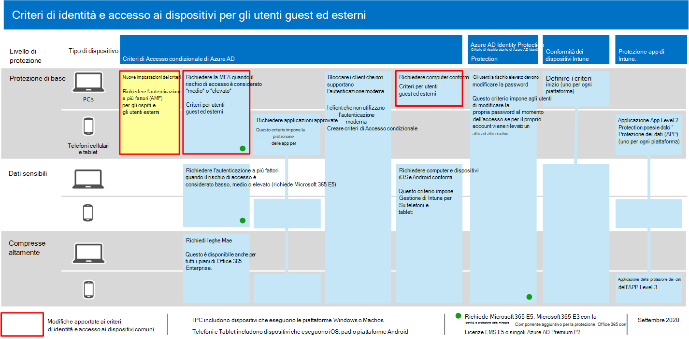
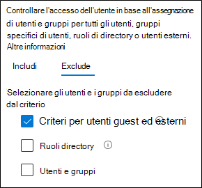
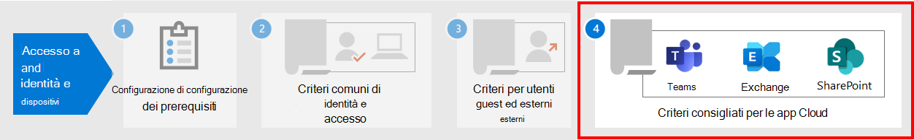

# Criteri per consentire l'accesso guest e l'accesso degli utenti esterni B2B

In questo articolo viene illustrata la modifica dei criteri di accesso alle identità e ai dispositivi consigliati per consentire l'accesso a utenti guest ed esterni che dispongono di un account business-to-business (B2B) di Azure Active Directory (Azure AD). Queste indicazioni si basano sui [criteri comuni di identità e accesso ai dispositivi.](identity-access-policies.md)

Questi suggerimenti sono progettati per essere applicati al livello **di protezione** di base. Tuttavia, puoi anche modificare i suggerimenti in base alle tue esigenze specifiche per una **protezione sensibile** **e altamente regolamentata.**

Fornire un percorso per gli account B2B per l'autenticazione con il tenant di Azure AD non consente a questi account di accedere all'intero ambiente. Gli utenti B2B e i loro account hanno accesso a servizi e risorse, come i file, condivisi con loro dai criteri di accesso condizionale.

## Aggiornamento dei criteri comuni per consentire e proteggere gli utenti guest e gli utenti esterni

Questo diagramma mostra quali criteri aggiungere o aggiornare tra i criteri comuni di identità e accesso ai dispositivi, per l'accesso degli utenti guest ed esterni B2B.

Nella tabella seguente sono elencati i criteri che è necessario creare e aggiornare. I criteri comuni sono link alle istruzioni di configurazione associate [nell'articolo Criteri di identità](identity-access-policies.md) e accesso ai dispositivi comuni.

|Livello di protezione|Criteri|Ulteriori informazioni|
|---|---|---|
|**Protezione di base**|[Richiedi MFA sempre per utenti guest ed esterni](identity-access-policies.md#require-mfa-based-on-sign-in-risk)|Creare questo nuovo criterio e configurare: <ul><li>Per **Assegnazioni > utenti** e gruppi > Includi , scegliere **Seleziona** utenti e gruppi e quindi selezionare Tutti gli utenti guest **ed esterni**.</li><li>Per **Assegnazioni > condizioni >** accesso , lasciare deselezionate tutte le opzioni per applicare sempre l'autenticazione a più fattori (MFA).</li></ul>|
||[Richiedi autenticazione a più fattori quando il rischio di accesso *è medio* o *alto*](identity-access-policies.md#require-mfa-based-on-sign-in-risk)|Modificare questo criterio per escludere utenti guest ed utenti esterni.|
||[Richiedere computer conformi](identity-access-policies.md#require-compliant-pcs-but-not-compliant-phones-and-tablets)|Modificare questo criterio per escludere utenti guest ed utenti esterni.|

Per includere o escludere utenti guest ed esterni nei criteri di accesso condizionale, per Assegnazioni **> Utenti** e gruppi > Includi o Escludi , selezionare Tutti gli utenti guest ed **esterni.** 

## Ulteriori informazioni

### Accesso guest e utente esterno con Microsoft Teams

Microsoft Teams definisce gli utenti seguenti:

- **L'accesso** guest usa un account B2B di Azure AD che può essere aggiunto come membro di un team e avere accesso alle comunicazioni e alle risorse del team.

- **L'accesso** esterno è per un utente esterno che non dispone di un account B2B. L'accesso degli utenti esterni include inviti, chiamate, chat e riunioni, ma non include l'appartenenza al team e l'accesso alle risorse del team.

Per ulteriori informazioni, vedere il confronto [tra gli utenti guest e l'accesso degli utenti esterni per i team.](/microsoftteams/communicate-with-users-from-other-organizations#compare-external-and-guest-access)

Per ulteriori informazioni sulla protezione dei criteri di identità e di accesso ai dispositivi per Teams, vedere Suggerimenti per i criteri per la protezione Teams chat, gruppi [e file.](teams-access-policies.md)

### Richiedi MFA sempre per utenti guest ed esterni

Questo criterio richiede agli utenti guest di registrarsi per la MFA nel tenant, indipendentemente dal fatto che siano registrati per la MFA nel tenant principale. Quando si accede alle risorse nel tenant, gli utenti guest e esterni devono utilizzare la MFA per ogni richiesta.

### Esclusione di utenti guest ed utenti esterni dall'autenticazione a più fattori basata sul rischio

Sebbene le organizzazioni possano applicare criteri basati sul rischio per gli utenti B2B che usano Azure AD Identity Protection, esistono limitazioni nell'implementazione di Azure AD Identity Protection per gli utenti di collaborazione B2B in una directory delle risorse a causa della loro identità esistente nella home directory. A causa di queste limitazioni, Microsoft consiglia di escludere gli utenti guest dai criteri MFA basati sul rischio e richiedere a questi utenti di utilizzare sempre la MFA.

Per ulteriori informazioni, vedere [Limitations of Identity Protection for B2B collaboration users](/azure/active-directory/identity-protection/concept-identity-protection-b2b#limitations-of-identity-protection-for-b2b-collaboration-users).

### Esclusione di utenti guest ed esterni dalla gestione dei dispositivi

Solo un'organizzazione può gestire un dispositivo. Se non escludi guest ed utenti esterni dai criteri che richiedono la conformità dei dispositivi, questi criteri bloccheranno questi utenti.

## Passaggio successivo

Configurare i criteri di accesso condizionale per:

- [Microsoft Teams](teams-access-policies.md)
- [Exchange Online](secure-email-recommended-policies.md)
- [SharePoint](sharepoint-file-access-policies.md)
- [Microsoft Cloud App Security](mcas-saas-access-policies.md)
 