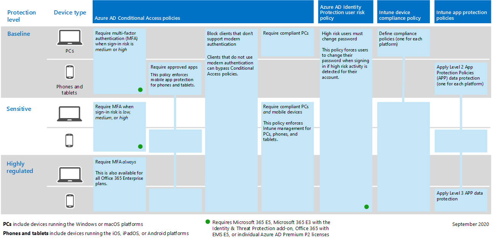
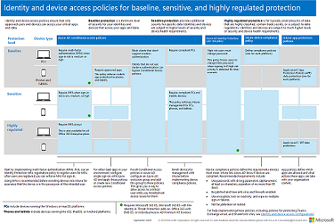
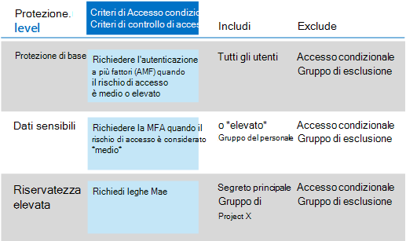
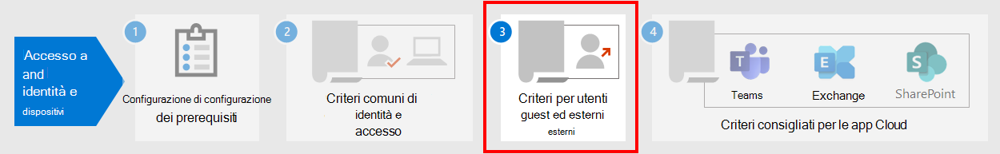

# Criteri comuni di identità e accesso dei dispositiviCommon identity and device access policies

**Si applica a****Applies to**
- [Exchange Online ProtectionExchange Online Protection](https://go.microsoft.com/fwlink/?linkid=2148611)
- [Microsoft Defender per Office 365 piano 1 e piano 2Microsoft Defender for Office 365 plan 1 and plan 2](https://go.microsoft.com/fwlink/?linkid=2148715)
- AzureAzure

Questo articolo descrive i criteri consigliati comuni per proteggere l'accesso ai servizi cloud di Microsoft 365, incluse le applicazioni locali pubblicate con il proxy di applicazione di Azure Active Directory (Azure AD).This article describes the common recommended policies for securing access to Microsoft 365 cloud services, including on-premises applications published with Azure Active Directory (Azure AD) Application Proxy.

In questa guida viene illustrato come distribuire i criteri consigliati in un ambiente di cui è stato appena effettuato il provisioning.This guidance discusses how to deploy the recommended policies in a newly-provisioned environment. L'impostazione di questi criteri in un ambiente lab separato consente di comprendere e valutare i criteri consigliati prima di eseguire l'implementazione negli ambienti di preproduzione e produzione.Setting up these policies in a separate lab environment allows you to understand and evaluate the recommended policies before staging the rollout to your preproduction and production environments. Il nuovo ambiente di cui è stato eseguito il provisioning può essere solo cloud o ibrido per soddisfare le esigenze di valutazione.Your newly provisioned environment can be cloud-only or hybrid to reflect your evaluation needs.

## Set di criteriPolicy set

Nel diagramma seguente viene illustrato il set di criteri consigliato.The following diagram illustrates the recommended set of policies. Mostra a quale livello di protezione si applica ogni criterio e se i criteri si applicano a PC, telefoni e tablet o a entrambe le categorie di dispositivi.It shows which tier of protections each policy applies to and whether the policies apply to PCs or phones and tablets, or both categories of devices. Indica inoltre dove configurare questi criteri.It also indicates where you configure these policies.

[Vedere una versione più grande di questa immagineSee a larger version of this image](https://github.com/MicrosoftDocs/microsoft-365-docs/raw/public/microsoft-365/media/microsoft-365-policies-configurations/Identity_device_access_policies_byplan.png)

Ecco un riepilogo PDF di una pagina con collegamenti ai singoli criteri:Here's a one-page PDF summary with links to the individual policies:

   [Visualizzazione in formato PDF](../../downloads/MSFT-cloud-architecture-identity-device-protection-handout.pdf) \| [Download in formato PDF](https://github.com/MicrosoftDocs/microsoft-365-docs/raw/public/microsoft-365/downloads/MSFT-cloud-architecture-identity-device-protection-handout.pdf)[View as a PDF](../../downloads/MSFT-cloud-architecture-identity-device-protection-handout.pdf) \| [Download as a PDF](https://github.com/MicrosoftDocs/microsoft-365-docs/raw/public/microsoft-365/downloads/MSFT-cloud-architecture-identity-device-protection-handout.pdf)

Nella parte restante di questo articolo viene descritto come configurare questi criteri.The rest of this article describes how to configure these policies.

> [!NOTE]
> È consigliabile richiedere l'uso dell'autenticazione a più fattori (MFA) prima di registrare i dispositivi in Intune per garantire che il dispositivo sia in possesso dell'utente previsto.Requiring the use of multi-factor authentication (MFA) is recommended before enrolling devices in Intune to assure that the device is in the possession of the intended user. È necessario registrare i dispositivi in Intune prima di poter applicare i criteri di conformità dei dispositivi.You must enroll devices in Intune before you can enforce device compliance policies.

Per concedere il tempo necessario per eseguire queste attività, è consigliabile implementare i criteri di base nell'ordine indicato in questa tabella.To give you time to accomplish these tasks, we recommend implementing the baseline policies in the order listed in this table. Tuttavia, i criteri MFA per i livelli di protezione sensibili e altamente regolamentati possono essere implementati in qualsiasi momento.However, the MFA policies for sensitive and highly regulated levels of protection can be implemented at any time.

|Livello di protezioneProtection level|CriteriPolicies|Altre informazioniMore information|
|---|---|---|
|**Protezione di base****Baseline**|[Richiedere l'autenticazione a più fattori quando il rischio di accesso *è medio* o *alto*Require MFA when sign-in risk is *medium* or *high*](#require-mfa-based-on-sign-in-risk)||
||[Bloccare i client che non supportano l'autenticazione modernaBlock clients that don't support modern authentication](#block-clients-that-dont-support-multi-factor)|I client che non utilizzano l'autenticazione moderna possono ignorare i criteri di accesso condizionale, quindi è importante bloccarlo.Clients that do not use modern authentication can bypass Conditional Access policies, so it's important to block these.|
||[Gli utenti a rischio elevato devono modificare la passwordHigh risk users must change password](#high-risk-users-must-change-password)|Forza gli utenti a cambiare la password quando a loro volta a loro volta si accede se vengono rilevate attività ad alto rischio per il proprio account.Forces users to change their password when signing in if high-risk activity is detected for their account.|
||[Applicare i criteri di protezione dei dati delle appApply app data protection policies](#apply-app-data-protection-policies)|Un criterio di protezione delle app di Intune per piattaforma (Windows, iOS/iPadOS, Android).One Intune App Protection policy per platform (Windows, iOS/iPadOS, Android).|
||[Richiedi app approvate e protezione appRequire approved apps and app protection](#require-approved-apps-and-app-protection)|Applica la protezione delle app per dispositivi mobili per telefoni e tablet con iOS, iPadOS o Android.Enforces mobile app protection for phones and tablets using iOS, iPadOS, or Android.|
||[Definire i criteri di conformità dei dispositiviDefine device compliance policies](#define-device-compliance-policies)|Un criterio per ogni piattaforma.One policy for each platform.|
||[Richiedere computer conformiRequire compliant PCs](#require-compliant-pcs-but-not-compliant-phones-and-tablets)|Applica la gestione intune dei PC con Windows o MacOS.Enforces Intune management of PCs using Windows or MacOS.|
|**Sensibili****Sensitive**|[Richiedere l'autenticazione a più fattori quando il rischio di accesso è *basso,* *medio* o *alto*Require MFA when sign-in risk is *low*, *medium*, or *high*](#require-mfa-based-on-sign-in-risk)||
||[Richiedere PC e *dispositivi* mobili conformiRequire compliant PCs *and* mobile devices](#require-compliant-pcs-and-mobile-devices)|Applica la gestione di Intune per PC (Windows o MacOS) e telefoni o tablet (iOS, iPadOS o Android).Enforces Intune management for both PCs (Windows or MacOS) and phones or tablets (iOS, iPadOS, or Android).|
|**Riservatezza elevata****Highly regulated**|[*Richiedi sempre* L'autenticazione a più fattori*Always* require MFA](#require-mfa-based-on-sign-in-risk)|
|

## Assegnazione di criteri a gruppi e utentiAssigning policies to groups and users

Prima di configurare i criteri, identificare i gruppi di Azure AD in uso per ogni livello di protezione.Before configuring policies, identify the Azure AD groups you are using for each tier of protection. In genere, la protezione di base si applica a tutti gli utenti dell'organizzazione.Typically, baseline protection applies to everybody in the organization. A un utente incluso sia per la protezione di base che per la protezione sensibile verranno applicati tutti i criteri di base oltre ai criteri sensibili.A user who is included for both baseline and sensitive protection will have all the baseline policies applied plus the sensitive policies. La protezione è cumulativa e vengono applicati i criteri più restrittivi.Protection is cumulative and the most restrictive policy is enforced.

Una procedura consigliata consiste nel creare un gruppo di Azure AD per l'esclusione dell'accesso condizionale.A recommended practice is to create an Azure AD group for Conditional Access exclusion. Aggiungi questo gruppo a tutti i  criteri di  accesso condizionale nell'impostazione Escludi dell'impostazione Utenti e gruppi **nella sezione** Assegnazioni.Add this group to all of your Conditional Access policies in the **Exclude** value of the **Users and groups** setting in the **Assignments** section. Ciò offre un metodo per fornire l'accesso a un utente durante la risoluzione dei problemi di accesso.This gives you a method to provide access to a user while you troubleshoot access issues. Questa opzione è consigliata solo come soluzione temporanea.This is recommended as a temporary solution only. Monitorare questo gruppo per le modifiche e assicurarsi che il gruppo di esclusione venga utilizzato solo come previsto.Monitor this group for changes and be sure the exclusion group is being used only as intended.

Ecco un esempio di assegnazione di gruppo ed esclusioni per richiedere l'autenticazione a più fattori.Here's an example of group assignment and exclusions for requiring MFA.

Ecco i risultati:Here are the results:

- Tutti gli utenti devono usare l'autenticazione a più fattori quando il rischio di accesso è medio o alto.All users are required to use MFA when the sign-in risk is medium or high.

- I membri del gruppo Executive Staff devono usare l'autenticazione a più fattori quando il rischio di accesso è basso, medio o alto.Members of the Executive Staff group are required to use MFA when the sign-in risk is low, medium, or high.

  In questo caso, i membri del gruppo Executive Staff corrispondono ai criteri di accesso condizionale di base e sensibili.In this case, members of the Executive Staff group match both the baseline and sensitive Conditional Access policies. I controlli di accesso per entrambi i criteri sono combinati, che in questo caso equivale al criterio di accesso condizionale sensibile.The access controls for both policies are combined, which in this case is equivalent to the sensitive Conditional Access policy.

- I membri del gruppo Top Secret Project X sono sempre necessari per l'uso dell'autenticazione a più fattoriMembers of the Top Secret Project X group are always required to use MFA

  In questo caso, i membri del gruppo Top Secret Project X corrispondono sia ai criteri di accesso condizionale di base che ai criteri di accesso condizionale altamente regolamentati.In this case, members of the Top Secret Project X group match both the baseline and highly-regulated Conditional Access policies. I controlli di accesso per entrambi i criteri vengono combinati.The access controls for both policies are combined. Poiché il controllo di accesso per i criteri di accesso condizionale altamente regolamentati è più restrittivo, viene utilizzato.Because the access control for the highly-regulated Conditional Access policy is more restrictive, it is used.

Prestare attenzione quando si applicano livelli di protezione più elevati a gruppi e utenti.Be careful when applying higher levels of protection to groups and users. Ad esempio, ai membri del gruppo Top Secret Project X verrà richiesto di usare l'autenticazione a più fattori ogni volta che esemplino l'accesso, anche se non stanno lavorando ai contenuti altamente regolamentati per il progetto X.For example, members of the Top Secret Project X group will be required to use MFA every time they sign in, even if they are not working on the highly-regulated content for Project X.

Tutti i gruppi di Azure AD creati come parte di questi suggerimenti devono essere creati come gruppi di Microsoft 365.All Azure AD groups created as part of these recommendations must be created as Microsoft 365 groups. Questo è importante per la distribuzione delle etichette di riservatezza quando si protegge i documenti in Microsoft Teams e SharePoint.This is important for the deployment of sensitivity labels when securing documents in Microsoft Teams and SharePoint.

## Richiedere l'autenticazione a più fattori in base al rischio di accessoRequire MFA based on sign-in risk

Dovresti fare in modo che gli utenti si registrino per l'autenticazione a più fattori prima di richiederne l'uso.You should have your users register for MFA prior to requiring its use. Se si dispone di Microsoft 365 E5, Microsoft 365 E3 con il componente aggiuntivo Identity & Threat Protection, Office 365 con EMS E5 o singole licenze di Azure AD Premium P2, è possibile usare i criteri di registrazione MFA con Azure AD Identity Protection per richiedere agli utenti di registrarsi per l'autenticazione a più fattori.If you have Microsoft 365 E5, Microsoft 365 E3 with the Identity & Threat Protection add-on, Office 365 with EMS E5, or individual Azure AD Premium P2 licenses, you can use the MFA registration policy with Azure AD Identity Protection to require that users register for MFA. Il [lavoro prerequisito include](identity-access-prerequisites.md) la registrazione di tutti gli utenti con MFA.The [prerequisite work](identity-access-prerequisites.md) includes registering all users with MFA.

Dopo aver registrato gli utenti, è possibile richiedere l'autenticazione a più fattori per l'accesso con un nuovo criterio di accesso condizionale.After your users are registered, you can require MFA for sign-in with a new Conditional Access policy.

1. Andare nel [portale di Azure](https://portal.azure.com) e accedere con le proprie credenziali.Go to the [Azure portal](https://portal.azure.com), and sign in with your credentials.
2. Nell'elenco dei servizi di Azure scegliere **Azure Active Directory.**In the list of Azure services, choose **Azure Active Directory**.
3. **Nell'elenco Gestisci** scegliere **Sicurezza** e quindi Accesso **condizionale.**In the **Manage** list, choose **Security**, and then choose **Conditional Access**.
4. Scegliere **Nuovo criterio** e digitare il nome del nuovo criterio.Choose **New policy** and type the new policy's name.

Nelle tabelle seguenti vengono descritte le impostazioni dei criteri di accesso condizionale per richiedere l'autenticazione a più fattori in base al rischio di accesso.The following tables describes the Conditional Access policy settings to require MFA based on sign-in risk.

Nella sezione **Assegnazioni:**In the **Assignments** section:

|ImpostazioneSetting|ProprietàProperties|ValoriValues|NoteNotes|
|---|---|---|---|
|Utenti e gruppiUsers and groups|IncludiInclude|**Selezionare utenti e gruppi > utenti e gruppi:** selezionare gruppi specifici contenenti account utente di destinazione.**Select users and groups > Users and groups**:  Select specific groups containing targeted user accounts.|Iniziare con il gruppo che include gli account utente pilota.Start with the group that includes pilot user accounts.|
||ExcludeExclude|**Utenti e gruppi**: selezionare il gruppo di eccezioni di accesso condizionale; account di servizio (identità delle app).**Users and groups**: Select your Conditional Access exception group; service accounts (app identities).|L'appartenenza deve essere modificata in base alle esigenze e temporaneamente.Membership should be modified on an as-needed, temporary basis.|
|App o azioni cloudCloud apps or actions|**App cloud > includere****Cloud apps > Include**|**Selezionare le app:** selezionare le app a cui si desidera applicare questo criterio.**Select apps**: Select the apps you want this policy to apply to. Ad esempio, selezionare Exchange Online.For example, select Exchange Online.||
|CondizioniConditions|||Configurare condizioni specifiche per l'ambiente e le esigenze.Configure conditions that are specific to your environment and needs.|
||Rischio di accessoSign-in risk||Vedere le indicazioni nella tabella seguente.See the guidance in the following table.|
|

### Impostazioni delle condizioni di rischio per l'accessoSign-in risk condition settings

Applicare le impostazioni del livello di rischio in base al livello di protezione di destinazione.Apply the risk level settings based on the protection level you are targeting.

|Livello di protezioneLevel of protection|Valori del livello di rischio necessariRisk level values needed|AzioneAction|
|---|---|---|
|Protezione di baseBaseline|Alto, medioHigh, medium|Controlla entrambi.Check both.|
|Dati sensibiliSensitive|Alto, medio, bassoHigh, medium, low|Controlla tutti e tre.Check all three.|
|Riservatezza elevataHighly regulated||Lasciare deselezionate tutte le opzioni per applicare sempre l'autenticazione a più fattori.Leave all options unchecked to always enforce MFA.|
|

Nella sezione **Controlli di** accesso:In the **Access controls** section:

|ImpostazioneSetting|ProprietàProperties|ValoriValues|AzioneAction|
|---|---|---|---|
|ConcessioneGrant|**Grant access****Grant access**||SelectSelect|
|||**Richiedi autenticazione a più fattori****Require Multi-factor authentication**|AssegnoCheck|
||**Richiedi tutti i controlli selezionati****Require all the selected controls**||SelectSelect|
|

Scegliere **Seleziona** per salvare le **impostazioni di** concessione.Choose **Select** to save the **Grant** settings.

Infine, selezionare **Attivato** per **Abilita criterio** e quindi scegliere **Crea.**Finally, select **On** for **Enable policy**, and then choose **Create**.

Valuta inoltre la possibilità di usare lo strumento [What if](https://docs.microsoft.com/azure/active-directory/active-directory-conditional-access-whatif) per testare il criterio.Also consider using the [What if](https://docs.microsoft.com/azure/active-directory/active-directory-conditional-access-whatif) tool to test the policy.

## Bloccare i client che non supportano più fattoriBlock clients that don't support multi-factor

Utilizzare le impostazioni in queste tabelle per un criterio di accesso condizionale per bloccare i client che non supportano l'autenticazione a più fattori.Use the settings in these tables for a Conditional Access policy to block clients that don't support multi-factor authentication.

Vedere [questo articolo per](../../enterprise/microsoft-365-client-support-multi-factor-authentication.md) un elenco dei client in Microsoft 365 che supportano l'autenticazione a più fattori.See [this article](../../enterprise/microsoft-365-client-support-multi-factor-authentication.md) for a list of clients in Microsoft 365 that do support multi-factor authentication.

Nella sezione **Assegnazioni:**In the **Assignments** section:

|ImpostazioneSetting|ProprietàProperties|ValoriValues|NoteNotes|
|---|---|---|---|
|Utenti e gruppiUsers and groups|IncludiInclude|**Selezionare utenti e gruppi > utenti e gruppi:** selezionare gruppi specifici contenenti account utente di destinazione.**Select users and groups > Users and groups**:  Select specific groups containing targeted user accounts.|Iniziare con il gruppo che include gli account utente pilota.Start with the group that includes pilot user accounts.|
||ExcludeExclude|**Utenti e gruppi**: selezionare il gruppo di eccezioni di accesso condizionale; account di servizio (identità delle app).**Users and groups**: Select your Conditional Access exception group; service accounts (app identities).|L'appartenenza deve essere modificata in base alle esigenze e temporaneamente.Membership should be modified on an as-needed, temporary basis.|
|App o azioni cloudCloud apps or actions|**App cloud > includere****Cloud apps > Include**|**Selezionare le app:** selezionare le app corrispondenti ai client che non supportano l'autenticazione moderna.**Select apps**: Select the apps corresponding to the clients that do not support modern authentication.||
|CondizioniConditions|**App client****Client apps**|Choose **Yes** for **Configure**Choose **Yes** for **Configure** 
 Deselezionare i segni di spunta per **le app browser** e per dispositivi mobili e i client **desktop**Clear the check marks for **Browser** and **Mobile apps and desktop clients**||
|

Nella sezione **Controlli di** accesso:In the **Access controls** section:

|ImpostazioneSetting|ProprietàProperties|ValoriValues|AzioneAction|
|---|---|---|---|
|ConcessioneGrant|**Blocca accesso****Block access**||SelectSelect|
||**Richiedi tutti i controlli selezionati****Require all the selected controls**||SelectSelect|
|

Scegliere **Seleziona** per salvare le **impostazioni di** concessione.Choose **Select** to save the **Grant** settings.

Infine, selezionare **Attivato** per **Abilita criterio** e quindi scegliere **Crea.**Finally, select **On** for **Enable policy**, and then choose **Create**.

Valuta la possibilità [di usare lo](https://docs.microsoft.com/azure/active-directory/active-directory-conditional-access-whatif) strumento What if per testare il criterio.Consider using the [What if](https://docs.microsoft.com/azure/active-directory/active-directory-conditional-access-whatif) tool to test the policy.

Per Exchange Online, è possibile utilizzare i criteri di autenticazione [per](https://docs.microsoft.com/exchange/clients-and-mobile-in-exchange-online/disable-basic-authentication-in-exchange-online)disabilitare l'autenticazione di base, che forza tutte le richieste di accesso client a utilizzare l'autenticazione moderna.For Exchange Online, you can use authentication policies to [disable Basic authentication](https://docs.microsoft.com/exchange/clients-and-mobile-in-exchange-online/disable-basic-authentication-in-exchange-online), which forces all client access requests to use modern authentication.

## Gli utenti a rischio elevato devono modificare la passwordHigh risk users must change password

Per assicurarsi che tutti gli account compromessi di tutti gli utenti ad alto rischio siano obbligati a modificare la password durante l'accesso, è necessario applicare il criterio seguente.To ensure that all high-risk users' compromised accounts are forced to perform a password change when signing-in, you must apply the following policy.

Accedere al [portale di Microsoft Azure (https://portal.azure.com)](https://portal.azure.com/) con le credenziali di amministratore e selezionare **Azure AD Identity Protection > Criteri di rischio utente**.Log in to the [Microsoft Azure portal (https://portal.azure.com)](https://portal.azure.com/) with your administrator credentials, and then navigate to **Azure AD Identity Protection > User Risk Policy**.

Nella sezione **Assegnazioni:**In the **Assignments** section:

|TipoType|ProprietàProperties|ValoriValues|AzioneAction|
|---|---|---|---|
|UsersUsers|IncludiInclude|**Tutti gli utenti****All users**|SelectSelect|
|Rischio utenteUser risk|**High****High**||SelectSelect|
|

Nella seconda **sezione Assignments:**In the second **Assignments** section:

|TipoType|ProprietàProperties|ValoriValues|AzioneAction|
|---|---|---|---|
|AccessAccess|**Consenti accesso****Allow access**||SelectSelect|
|||**Richiedi modifica password****Require password change**|AssegnoCheck|
|

Scegliere **Fine** per salvare le **impostazioni di** Access.Choose **Done** to save the **Access** settings.

Infine, selezionare **On** per **Applica criterio** e quindi scegliere **Salva.**Finally, select **On** for **Enforce policy**, and then choose **Save**.

Valuta la possibilità [di usare lo](https://docs.microsoft.com/azure/active-directory/active-directory-conditional-access-whatif) strumento What if per testare il criterio.Consider using the [What if](https://docs.microsoft.com/azure/active-directory/active-directory-conditional-access-whatif) tool to test the policy.

Usa questo criterio insieme a Configura la protezione password di [Azure AD,](https://docs.microsoft.com/azure/active-directory/authentication/concept-password-ban-bad)che rileva e blocca le password deboli note e le relative varianti e altri termini deboli specifici dell'organizzazione.Use this policy in conjunction with [Configure Azure AD password protection](https://docs.microsoft.com/azure/active-directory/authentication/concept-password-ban-bad), which detects and blocks known weak passwords and their variants and additional weak terms that are specific to your organization. L'uso della protezione con password di Azure AD garantisce che le password modificate siano complesse.Using Azure AD password protection ensures that changed passwords are strong ones.

## Applicare i criteri di protezione dei dati appApply APP data protection policies

I criteri di protezione delle app definiscono le app consentite e le azioni che possono eseguire con i dati dell'organizzazione.App Protection Policies (APP) define which apps are allowed and the actions they can take with your organization's data. Le scelte disponibili in APP consentono alle organizzazioni di adattare la protezione alle proprie esigenze specifiche.The choices available in APP enable organizations to tailor the protection to their specific needs. Per alcuni, potrebbe non essere ovvio quali impostazioni dei criteri sono necessarie per implementare uno scenario completo.For some, it may not be obvious which policy settings are required to implement a complete scenario. Per aiutare le organizzazioni a dare la priorità alla protezione avanzata degli endpoint dei client mobili, Microsoft ha introdotto la tassonomia per il framework di protezione dei dati APP per la gestione delle app per dispositivi mobili iOS e Android.To help organizations prioritize mobile client endpoint hardening, Microsoft has introduced taxonomy for its APP data protection framework for iOS and Android mobile app management.

Il framework di protezione dei dati APP è organizzato in tre livelli di configurazione distinti, con ogni livello che si esercite al di fuori del livello precedente:The APP data protection framework is organized into three distinct configuration levels, with each level building off the previous level:

- **La protezione dei dati di base** aziendale (livello 1) garantisce che le app siano protette con un PIN e crittografate ed esegua operazioni di cancellazione selettiva.**Enterprise basic data protection** (Level 1) ensures that apps are protected with a PIN and encrypted and performs selective wipe operations. Per i dispositivi Android, questo livello convalida l'attestazione dei dispositivi Android.For Android devices, this level validates Android device attestation. Si tratta di una configurazione di livello di ingresso che fornisce un controllo di protezione dei dati simile nei criteri cassetta postale di Exchange Online e introduce l'IT e la popolazione degli utenti in APP.This is an entry level configuration that provides similar data protection control in Exchange Online mailbox policies and introduces IT and the user population to APP.
- **La protezione dei dati avanzata** aziendale (livello 2) introduce i meccanismi di prevenzione della perdita di dati dell'APP e i requisiti minimi del sistema operativo.**Enterprise enhanced data protection** (Level 2) introduces APP data leakage prevention mechanisms and minimum OS requirements. Questa è la configurazione applicabile alla maggior parte degli utenti mobili che accedono ai dati aziendali o dell'istituto di istruzione.This is the configuration that is applicable to most mobile users accessing work or school data.
- **Enterprise high data protection** (Level 3) introduce meccanismi avanzati di protezione dei dati, configurazione pin avanzata e APP Mobile Threat Defense.**Enterprise high data protection** (Level 3) introduces advanced data protection mechanisms, enhanced PIN configuration, and APP Mobile Threat Defense. Questa configurazione è consigliabile per gli utenti che accedono a dati ad alto rischio.This configuration is desirable for users that are accessing high risk data.

Per visualizzare i consigli specifici per ogni livello di configurazione e le app minime che devono essere protette, consulta Framework di protezione dei dati [usando i criteri di protezione delle app.](https://docs.microsoft.com/mem/intune/apps/app-protection-framework)To see the specific recommendations for each configuration level and the minimum apps that must be protected, review [Data protection framework using app protection policies](https://docs.microsoft.com/mem/intune/apps/app-protection-framework).

Usando i principi descritti [nelle](microsoft-365-policies-configurations.md)configurazioni di identità e accesso ai dispositivi, i livelli di protezione di base e di protezione dei dati sensibili sono strettamente associati alle impostazioni di protezione dei dati avanzate aziendali di livello 2.Using the principles outlined in [Identity and device access configurations](microsoft-365-policies-configurations.md), the Baseline and Sensitive protection tiers map closely with the Level 2 enterprise enhanced data protection settings. Il livello di protezione altamente regolamentato è strettamente associato alle impostazioni di protezione dei dati aziendali di livello 3.The Highly regulated protection tier maps closely to the Level 3 enterprise high data protection settings.

|Livello di protezioneProtection level|Criteri di protezione delle appApp Protection Policy|Altre informazioniMore information|
|---|---|---|
|Protezione di baseBaseline|[Protezione avanzata dei dati di livello 2Level 2 enhanced data protection](https://docs.microsoft.com/mem/intune/apps/app-protection-framework#level-2-enterprise-enhanced-data-protection)|Le impostazioni dei criteri applicate nel livello 2 includono tutte le impostazioni dei criteri consigliate per il livello 1 e aggiungono o aggiornano solo le impostazioni dei criteri seguenti per implementare più controlli e una configurazione più sofisticata rispetto al livello 1.The policy settings enforced in level 2 include all the policy settings recommended for level 1 and only adds to or updates the below policy settings to implement more controls and a more sophisticated configuration than level 1.|
|Dati sensibiliSensitive|[Protezione avanzata dei dati di livello 2Level 2 enhanced data protection](https://docs.microsoft.com/mem/intune/apps/app-protection-framework#level-2-enterprise-enhanced-data-protection)|Le impostazioni dei criteri applicate nel livello 2 includono tutte le impostazioni dei criteri consigliate per il livello 1 e aggiungono o aggiornano solo le impostazioni dei criteri seguenti per implementare più controlli e una configurazione più sofisticata rispetto al livello 1.The policy settings enforced in level 2 include all the policy settings recommended for level 1 and only adds to or updates the below policy settings to implement more controls and a more sophisticated configuration than level 1.|
|Altamente regolamentatoHighly Regulated|[Livello 3 di protezione dei dati elevata aziendaleLevel 3 enterprise high data protection](https://docs.microsoft.com/mem/intune/apps/app-protection-framework#level-3-enterprise-high-data-protection)|Le impostazioni dei criteri applicate nel livello 3 includono tutte le impostazioni dei criteri consigliate per i livelli 1 e 2 e aggiungono o aggiornano solo le impostazioni dei criteri seguenti per implementare più controlli e una configurazione più sofisticata rispetto al livello 2.The policy settings enforced in level 3 include all the policy settings recommended for level 1 and 2 and only adds to or updates the below policy settings to implement more controls and a more sophisticated configuration than level 2.|
|

Per creare nuovi criteri di protezione delle app per ogni piattaforma (iOS e Android) in Microsoft Endpoint Manager usando le impostazioni del framework di protezione dei dati, puoi:To create a new app protection policy for each platform (iOS and Android) within Microsoft Endpoint Manager using the data protection framework settings, you can:

1. Creare manualmente i criteri seguendo i passaggi descritti in Come creare e distribuire i criteri di [protezione delle app con Microsoft Intune.](https://docs.microsoft.com/mem/intune/apps/app-protection-policies)Manually create the policies by following the steps in [How to create and deploy app protection policies with Microsoft Intune](https://docs.microsoft.com/mem/intune/apps/app-protection-policies).
2. Importare i modelli JSON di [Intune App Protection Policy Configuration Framework](https://github.com/microsoft/Intune-Config-Frameworks/tree/master/AppProtectionPolicies) con gli script di [PowerShell di Intune.](https://github.com/microsoftgraph/powershell-intune-samples)Import the sample [Intune App Protection Policy Configuration Framework JSON templates](https://github.com/microsoft/Intune-Config-Frameworks/tree/master/AppProtectionPolicies) with [Intune's PowerShell scripts](https://github.com/microsoftgraph/powershell-intune-samples).

## Richiedi app approvate e protezione APPRequire approved apps and APP protection

Per applicare i criteri di protezione app applicati in Intune, è necessario creare un criterio di accesso condizionale per richiedere app client approvate e le condizioni impostate nei criteri di protezione app.To enforce the APP protection policies you applied in Intune, you must create a Conditional Access policy to require approved client apps and the conditions set in the APP protection policies.

L'applicazione dei criteri di protezione app richiede un set di criteri descritti in Richiedi criteri di protezione delle app per l'accesso [alle app cloud con accesso condizionale.](https://docs.microsoft.com/azure/active-directory/conditional-access/app-protection-based-conditional-access)Enforcing APP protection policies requires a set of policies described in in [Require app protection policy for cloud app access with Conditional Access](https://docs.microsoft.com/azure/active-directory/conditional-access/app-protection-based-conditional-access). Questi criteri sono inclusi in questo set consigliato di criteri di configurazione delle identità e degli accessi.These policies are each included in this recommended set of identity and access configuration policies.

Per creare i criteri di accesso condizionale che richiedono app approvate e protezione APP, seguire "Passaggio 1: Configurare un criterio di accesso condizionale di Azure AD per Microsoft 365" nello scenario 1: le app [di Microsoft 365](https://docs.microsoft.com/azure/active-directory/conditional-access/app-protection-based-conditional-access#scenario-1-office-365-apps-require-approved-apps-with-app-protection-policies)richiedono app approvate con criteri di protezione delle app, che consentono a Outlook per iOS e Android, ma bloccano la connessione a Exchange Online dei client Exchange ActiveSync in grado di OAuth.To create the Conditional Access policy that requires approved apps and APP protection, follow "Step 1: Configure an Azure AD Conditional Access policy for Microsoft 365" in [Scenario 1: Microsoft 365 apps require approved apps with app protection policies](https://docs.microsoft.com/azure/active-directory/conditional-access/app-protection-based-conditional-access#scenario-1-office-365-apps-require-approved-apps-with-app-protection-policies), which allows Outlook for iOS and Android, but blocks OAuth capable Exchange ActiveSync clients from connecting to Exchange Online.

   > [!NOTE]
   > Questo criterio garantisce agli utenti mobili di accedere a tutti gli endpoint di Office usando le app applicabili.This policy ensures mobile users can access all Office endpoints using the applicable apps.

Se si abilita l'accesso mobile a Exchange Online, implementare Block [ActiveSync clients](secure-email-recommended-policies.md#block-activesync-clients), che impedisce ai client Exchange ActiveSync che si sfruttando l'autenticazione di base di connettersi a Exchange Online.If you are enabling mobile access to Exchange Online, implement [Block ActiveSync clients](secure-email-recommended-policies.md#block-activesync-clients), which prevents Exchange ActiveSync clients leveraging basic authentication from connecting to Exchange Online. Questo criterio non è illustrato nella figura nella parte superiore di questo articolo.This policy is not pictured in the illustration at the top of this article. Viene descritto e illustrato nei suggerimenti per i criteri per [la protezione della posta elettronica.](secure-email-recommended-policies.md)It is described and pictured in [Policy recommendations for securing email](secure-email-recommended-policies.md).

Per creare i criteri di accesso condizionale che richiedono Edge per iOS e Android, seguire "Passaggio 2: Configurare un criterio di accesso condizionale di Azure AD per Microsoft 365" nello [scenario 2:](https://docs.microsoft.com/azure/active-directory/conditional-access/app-protection-based-conditional-access#scenario-2-browser-apps-require-approved-apps-with-app-protection-policies)le app del browser richiedono app approvate con criteri di protezione delle app, che consentono a Edge per iOS e Android, ma impedisce ad altri Web browser di dispositivi mobili di connettersi agli endpoint di Microsoft 365.To create the Conditional Access policy that requires Edge for iOS and Android, follow "Step 2: Configure an Azure AD Conditional Access policy for Microsoft 365" in [Scenario 2: Browser apps require approved apps with app protection policies](https://docs.microsoft.com/azure/active-directory/conditional-access/app-protection-based-conditional-access#scenario-2-browser-apps-require-approved-apps-with-app-protection-policies), which allows Edge for iOS and Android, but blocks other mobile device web browsers from connecting to Microsoft 365 endpoints.

 Questi criteri sfruttano i controlli di concessione [Richiedi app client approvata e](https://docs.microsoft.com/azure/active-directory/conditional-access/concept-conditional-access-grant#require-approved-client-app) Richiedi criteri di protezione delle [app.](https://docs.microsoft.com/azure/active-directory/conditional-access/concept-conditional-access-grant#require-app-protection-policy)These policies leverage the grant controls [Require approved client app](https://docs.microsoft.com/azure/active-directory/conditional-access/concept-conditional-access-grant#require-approved-client-app) and [Require app protection policy](https://docs.microsoft.com/azure/active-directory/conditional-access/concept-conditional-access-grant#require-app-protection-policy).

Infine, il blocco dell'autenticazione legacy per altre app client su dispositivi iOS e Android garantisce che questi client non siano in grado di ignorare i criteri di accesso condizionale.Finally, blocking legacy authentication for other client apps on iOS and Android devices ensures that these clients cannot bypass Conditional Access policies. Se si stanno seguendo le indicazioni fornite in questo articolo, sono già stati configurati i client di blocco che [non supportano l'autenticazione moderna.](#block-clients-that-dont-support-multi-factor)If you're following the guidance in this article, you've already configured [Block clients that don't support modern authentication](#block-clients-that-dont-support-multi-factor).

<!---
With Conditional Access, organizations can restrict access to approved (modern authentication capable) iOS and Android client apps with Intune app protection policies applied to them. Several Conditional Access policies are required, with each policy targeting all potential users. Details on creating these policies can be found in [Require app protection policy for cloud app access with Conditional Access](https://docs.microsoft.com/azure/active-directory/conditional-access/app-protection-based-conditional-access).

1. Follow "Step 1: Configure an Azure AD Conditional Access policy for Microsoft 365" in [Scenario 1: Microsoft 365 apps require approved apps with app protection policies](https://docs.microsoft.com/azure/active-directory/conditional-access/app-protection-based-conditional-access#scenario-1-office-365-apps-require-approved-apps-with-app-protection-policies), which allows Outlook for iOS and Android, but blocks OAuth capable Exchange ActiveSync clients from connecting to Exchange Online.

   > [!NOTE]
   > This policy ensures mobile users can access all Office endpoints using the applicable apps.

2. If enabling mobile access to Exchange Online, implement [Block ActiveSync clients](secure-email-recommended-policies.md#block-activesync-clients), which prevents Exchange ActiveSync clients leveraging basic authentication from connecting to Exchange Online.

   The above policies leverage the grant controls [Require approved client app](https://docs.microsoft.com/azure/active-directory/conditional-access/concept-conditional-access-grant#require-approved-client-app) and [Require app protection policy](https://docs.microsoft.com/azure/active-directory/conditional-access/concept-conditional-access-grant#require-app-protection-policy).

3. Disable legacy authentication for other client apps on iOS and Android devices. For more information, see [Block clients that don't support modern authentication](#block-clients-that-dont-support-modern-authentication).
-->

## Definire i criteri di conformità dei dispositiviDefine device-compliance policies

I criteri di conformità dei dispositivi definiscono i requisiti che i dispositivi devono soddisfare per essere determinati come conformi.Device-compliance policies define the requirements that devices must meet to be determined as compliant. I criteri di conformità dei dispositivi Intune vengono creati dall'interfaccia di amministrazione di Microsoft Endpoint Manager.You create Intune device compliance policies from within the Microsoft Endpoint Manager admin center.

Devi creare un criterio per ogni piattaforma pc, telefono o tablet:You must create a policy for each PC, phone, or tablet platform:

- Amministratore del dispositivo AndroidAndroid device administrator
- Android EnterpriseAndroid Enterprise
- iOS/iPadOSiOS/iPadOS
- macOSmacOS
- Windows 8.1 e versioni successiveWindows 8.1 and later
- Windows 10 e versioni successiveWindows 10 and later

Per creare criteri di conformità dei dispositivi, accedere all'interfaccia di amministrazione di [Microsoft Endpoint Manager](https://endpoint.microsoft.com) con le credenziali di amministratore, quindi passare a **Criteri** di \> **conformità dei** \> **dispositivi.**To create device compliance policies, log in to the [Microsoft Endpoint Manager Admin Center](https://endpoint.microsoft.com) with your administrator credentials, and then navigate to **Devices** \> **Compliance policies** \> **Policies**. Selezionare **Crea criterio.**Select **Create Policy**.

Per distribuire i criteri di conformità dei dispositivi, è necessario assegnare tali criteri ai gruppi di utenti.For device compliance policies to be deployed, they must be assigned to user groups. Dopo aver creato e salvato un criterio, assegnare un criterio.You assign a policy after you create and save it. Nell'interfaccia di amministrazione, selezionare il criterio e quindi **selezionare Assegnazioni.**In the admin center, select the policy and then select **Assignments**. Dopo aver selezionato i gruppi a cui si desidera ricevere il criterio, selezionare **Salva** per salvare l'assegnazione di gruppo e distribuire il criterio.After selecting the groups that you want to receive the policy, select **Save** to save that group assignment and deploy the policy.

Per istruzioni dettagliate sulla creazione di criteri di conformità in Intune, vedere Creare criteri di [conformità in Microsoft Intune](https://docs.microsoft.com/mem/intune/protect/create-compliance-policy) nella documentazione di Intune.For step-by-step guidance on creating compliance policies in Intune, see [Create a compliance policy in Microsoft Intune](https://docs.microsoft.com/mem/intune/protect/create-compliance-policy) in the Intune documentation.

### Impostazioni consigliate per Windows 10 e versioni successiveRecommended settings for Windows 10 and later

Le impostazioni seguenti sono consigliate per i PC che eseguono Windows 10 e versioni successive, come configurato nel passaggio **2:** impostazioni di conformità, del processo di creazione dei criteri.The following settings are recommended for PCs running Windows 10 and later, as configured in **Step 2: Compliance settings**, of the policy creation process.

Per informazioni sulle > di valutazione del servizio di attestazione dell'integrità di **Windows,** vedere questa tabella.For **Device health > Windows Health Attestation Service evaluation rules**, see this table.

|ProprietàProperties|ValoreValue|AzioneAction|
|---|---|---|
|Richiedi BitLockerRequire BitLocker|RequireRequire|SelectSelect|
|Richiedere che l'avvio protetto sia abilitato nel dispositivoRequire Secure Boot to be enabled on the device|RequireRequire|SelectSelect|
|Richiedere l'integrità del codiceRequire code integrity|RequireRequire|SelectSelect|
|

Per **le proprietà del** dispositivo, specificare i valori appropriati per le versioni del sistema operativo in base ai criteri di sicurezza e IT.For **Device properties**, specify appropriate values for operating system versions based on your IT and security policies.

Per **Conformità di Configuration Manager,** selezionare **Richiedi.**For **Configuration Manager Compliance**, select **Require**.

Per **la sicurezza del** sistema, vedere questa tabella.For **System security**, see this table.

|TipoType|ProprietàProperties|ValoreValue|AzioneAction|
|---|---|---|---|
|PasswordPassword|Richiedere una password per sbloccare i dispositivi mobiliRequire a password to unlock mobile devices|RequireRequire|SelectSelect|
||Password sempliciSimple passwords|BloccaBlock|SelectSelect|
||Tipo di passwordPassword type|Impostazione predefinita dispositivoDevice default|SelectSelect|
||Lunghezza minima passwordMinimum password length|6 6|TipoType|
||Numero massimo di minuti di inattività prima che sia necessaria la passwordMaximum minutes of inactivity before password is required|15 15|TipoType 
 Questa impostazione è supportata per Android versioni 4.0 e successive o KNOX 4.0 e versioni successive.This setting is supported for Android versions 4.0 and above or KNOX 4.0 and above. Per i dispositivi iOS, è supportato per iOS 8.0 e versioni successive.For iOS devices, it's supported for iOS 8.0 and above.|
||Scadenza password (giorni)Password expiration (days)|4141|TipoType|
||Numero di password precedenti per impedire il riutilizzoNumber of previous passwords to prevent reuse|5 5|TipoType|
||Richiedi password quando il dispositivo torna dallo stato inattivo (mobile e holographic)Require password when device returns from idle state (Mobile and Holographic)|RequireRequire|Disponibile per Windows 10 e versioni successiveAvailable for Windows 10 and later|
|CrittografiaEncryption|Crittografia dell'archiviazione dei dati nel dispositivoEncryption of data storage on device|RequireRequire|SelectSelect|
|Sicurezza dei dispositiviDevice Security|FirewallFirewall|RequireRequire|SelectSelect|
||AntivirusAntivirus|RequireRequire|SelectSelect|
||AntispywareAntispyware|RequireRequire|SelectSelect 
 Questa impostazione richiede una soluzione anti-spyware registrata nel Centro sicurezza PC Windows.This setting requires an Anti-Spyware solution registered with Windows Security Center.|
|DefenderDefender|Microsoft Defender AntimalwareMicrosoft Defender Antimalware|RequireRequire|SelectSelect|
||Versione minima di Microsoft Defender AntimalwareMicrosoft Defender Antimalware minimum version||TipoType 
 Supportato solo per desktop Windows 10.Only supported for Windows 10 desktop. Microsoft consiglia versioni non superiori a cinque rispetto alla versione più recente.Microsoft recommends versions no more than five behind from the most recent version.|
||Firma antimalware di Microsoft Defender aggiornataMicrosoft Defender Antimalware signature up to date|RequireRequire|SelectSelect|
||Protezione in tempo realeReal-time protection|RequireRequire|SelectSelect 
 Supportato solo per desktop Windows 10Only supported for Windows 10 desktop|
|

#### Microsoft Defender per endpointMicrosoft Defender for Endpoint

|TipoType|ProprietàProperties|ValoreValue|AzioneAction|
|---|---|---|---|
|Regole di Microsoft Defender per endpointMicrosoft Defender for Endpoint rules|Richiedi che il dispositivo sia in corrispondenza o sotto il punteggio di rischio del computerRequire the device to be at or under the machine-risk score|MedioMedium|SelectSelect|
|

## Richiedi PC conformi (ma telefoni e tablet non conformi)Require compliant PCs (but not compliant phones and tablets)

Prima di aggiungere un criterio per richiedere PC conformi, assicurati di registrare i dispositivi per la gestione in Intune.Before adding a policy to require compliant PCs, be sure to enroll devices for management into Intune. L'uso dell'autenticazione a più fattori è consigliato prima di registrare i dispositivi in Intune per garantire che il dispositivo sia in possesso dell'utente previsto.Using multi-factor authentication is recommended before enrolling devices into Intune for assurance that the device is in the possession of the intended user.

Per richiedere PC conformi:To require compliant PCs:

1. Andare nel [portale di Azure](https://portal.azure.com) e accedere con le proprie credenziali.Go to the [Azure portal](https://portal.azure.com), and sign in with your credentials.
2. Nell'elenco dei servizi di Azure scegliere **Azure Active Directory.**In the list of Azure services, choose **Azure Active Directory**.
3. **Nell'elenco Gestisci** scegliere **Sicurezza** e quindi Accesso **condizionale.**In the **Manage** list, choose **Security**, and then choose **Conditional Access**.
4. Scegliere **Nuovo criterio** e digitare il nome del nuovo criterio.Choose **New policy** and type the new policy's name.

5. In **Assegnazioni** scegliere **Utenti e gruppi** e includere gli utenti a cui si desidera applicare il criterio.Under **Assignments**, choose **Users and groups** and include who you want the policy to apply to. Escludere anche il gruppo di esclusione Accesso condizionale.Also exclude your Conditional Access exclusion group.

6. In **Assegnazioni** scegliere **App cloud o azioni.**Under **Assignments**, choose **Cloud apps or actions**.

7. Per **Includi,** scegli **Seleziona app > seleziona** e quindi seleziona le app desiderate nell'elenco **App** cloud.For **Include**, choose **Select apps > Select**, and then select the desired apps from the **Cloud apps** list. Ad esempio, selezionare Exchange Online.For example, select Exchange Online. Al **termine,** scegliere Seleziona.Choose **Select** when done.

8. Per richiedere PC conformi (ma non telefoni e tablet conformi), **in** Assegnazioni scegliere Condizioni > **piattaforme dispositivo.**To require compliant PCs (but not compliant phones and tablets), under **Assignments**, choose **Conditions > Device platforms**. Selezionare **Sì** per **Configura.**Select **Yes** for **Configure**. Choose **Select device platforms,** select **Windows** and **macOS**, and then choose **Done.**Choose  **Select device platforms**, select **Windows** and **macOS**, and then choose **Done**.

9. In **Controlli di accesso** scegliere **Concedi.**Under **Access controls**, choose **Grant** .

10. Scegliere **Concedi accesso** e quindi selezionare Richiedi **che il dispositivo sia contrassegnato come conforme.**Choose **Grant access** and then check **Require device to be marked as compliant**. Per più controlli, selezionare **Richiedi tutti i controlli selezionati.**For multiple controls, select **Require all the selected controls**. Al termine, scegliere **Seleziona.**When complete, choose **Select**.

11. Selezionare **Attivato** per **Abilita criterio** e quindi scegliere **Crea.**Select **On** for **Enable policy**, and then choose **Create**.

> [!NOTE]
> Assicurati che il dispositivo sia conforme prima di abilitare questo criterio.Make sure that your device is compliant before enabling this policy. In caso contrario, potresti essere bloccato e non potrai modificare questo criterio finché l'account utente non viene aggiunto al gruppo di esclusione Accesso condizionale.Otherwise, you could get locked out and will be unable to change this policy until your user account has been added to the Conditional Access exclusion group.

## Richiedere PC e *dispositivi* mobili conformiRequire compliant PCs *and* mobile devices

Per richiedere la conformità per tutti i dispositivi:To require compliance for all devices:

1. Andare nel [portale di Azure](https://portal.azure.com) e accedere con le proprie credenziali.Go to the [Azure portal](https://portal.azure.com), and sign in with your credentials.
2. Nell'elenco dei servizi di Azure scegliere **Azure Active Directory.**In the list of Azure services, choose **Azure Active Directory**.
3. **Nell'elenco Gestisci** scegliere **Sicurezza** e quindi Accesso **condizionale.**In the **Manage** list, choose **Security**, and then choose **Conditional Access**.
4. Scegliere **Nuovo criterio** e digitare il nome del nuovo criterio.Choose **New policy** and type the new policy's name.

5. In **Assegnazioni** scegliere **Utenti e gruppi** e includere gli utenti a cui si desidera applicare il criterio.Under **Assignments**, choose **Users and groups** and include who you want the policy to apply to. Escludere anche il gruppo di esclusione Accesso condizionale.Also exclude your Conditional Access exclusion group.

6. In **Assegnazioni** scegliere **App cloud o azioni.**Under **Assignments**, choose **Cloud apps or actions**.

7. Per **Includi,** scegli **Seleziona app > seleziona** e quindi seleziona le app desiderate nell'elenco **App** cloud.For **Include**, choose **Select apps > Select**, and then select the desired apps from the **Cloud apps** list. Ad esempio, selezionare Exchange Online.For example, select Exchange Online. Al **termine,** scegliere Seleziona.Choose **Select** when done.

8. In **Controlli di accesso** scegliere **Concedi.**Under **Access controls**, choose **Grant** .

9. Scegliere **Concedi accesso** e quindi selezionare Richiedi **che il dispositivo sia contrassegnato come conforme.**Choose **Grant access** and then check **Require device to be marked as compliant**. Per più controlli, selezionare **Richiedi tutti i controlli selezionati.**For multiple controls, select **Require all the selected controls**. Al termine, scegliere **Seleziona.**When complete, choose **Select**.

10. Selezionare **Attivato** per **Abilita criterio** e quindi scegliere **Crea.**Select **On** for **Enable policy**, and then choose **Create**.

> [!NOTE]
> Assicurati che il dispositivo sia conforme prima di abilitare questo criterio.Make sure that your device is compliant before enabling this policy. In caso contrario, potresti essere bloccato e non potrai modificare questo criterio finché l'account utente non viene aggiunto al gruppo di esclusione Accesso condizionale.Otherwise, you could get locked out and will be unable to change this policy until your user account has been added to the Conditional Access exclusion group.

## Passaggio successivoNext step

[Informazioni sui suggerimenti per i criteri per gli utenti guest ed esterniLearn about policy recommendations for guest and external users](identity-access-policies-guest-access.md)
