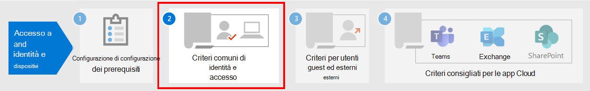

# Lavoro prerequisito per l'implementazione di criteri di identità e accesso ai dispositiviPrerequisite work for implementing identity and device access policies

In questo articolo vengono descritti i prerequisiti che gli amministratori devono soddisfare per utilizzare i criteri di identità e accesso ai dispositivi consigliati e per l'utilizzo dell'accesso condizionale.This article describes the prerequisites admins must meet to use recommended identity and device access policies, and to use Conditional Access. Vengono inoltre illustrate le impostazioni predefinite consigliate per la configurazione delle piattaforme client per la migliore esperienza Single #A0 (SSO).It also discusses the recommended defaults for configuring client platforms for the best single sign-on (SSO) experience.

## PrerequisitiPrerequisites

**Si applica a****Applies to**
- [Exchange Online ProtectionExchange Online Protection](https://go.microsoft.com/fwlink/?linkid=2148611)
- [Microsoft Defender per Office 365 piano 1 e piano 2Microsoft Defender for Office 365 plan 1 and plan 2](https://go.microsoft.com/fwlink/?linkid=2148715)
- AzureAzure

Prima di utilizzare i criteri di identità e accesso ai dispositivi consigliati, l'organizzazione deve soddisfare i prerequisiti.Before using the identity and device access policies that are recommended, your organization needs to meet prerequisites. I requisiti sono diversi per i vari modelli di identità e autenticazione elencati:The requirements are different for the various identity and authentication models listed:

- Solo cloudCloud-only
- Ibrida con autenticazione phs (password hash sync)Hybrid with password hash sync (PHS) authentication
- Ibrido con autenticazione pass-through (PTA)Hybrid with pass-through authentication (PTA)
- FederatoFederated

Nella tabella seguente sono riportate informazioni dettagliate sulle caratteristiche dei prerequisiti e sulla relativa configurazione applicabili a tutti i modelli di identità, ad eccezione di quanto riportato.The following table details the prerequisite features and their configuration that apply to all identity models, except where noted.

|ConfigurazioneConfiguration|EccezioniExceptions|
|---|:---:|
|[Configurare PHS.](https://docs.microsoft.com/azure/active-directory/hybrid/how-to-connect-password-hash-synchronization)[Configure PHS](https://docs.microsoft.com/azure/active-directory/hybrid/how-to-connect-password-hash-synchronization).  Questa opzione deve essere abilitata per rilevare le credenziali perse e agire su di esse per l'accesso condizionale basato sul rischio.This must be enabled to detect leaked credentials and to act on them for risk-based Conditional Access. **Nota:** Questa operazione è necessaria indipendentemente dal fatto che l'organizzazione utilizzi l'autenticazione federata.**Note:** This is required regardless of whether your organization uses federated authentication.|Solo cloudCloud-only|
|[Abilitare l'accesso Single #A0](https://docs.microsoft.com/azure/active-directory/connect/active-directory-aadconnect-sso) facile per accedere automaticamente agli utenti quando si stanno accedendo ai dispositivi dell'organizzazione connessi alla rete dell'organizzazione.[Enable seamless single sign-on](https://docs.microsoft.com/azure/active-directory/connect/active-directory-aadconnect-sso) to automatically sign users in when they are on their organization devices connected to your organization network.|Solo cloud e federatoCloud-only and federated|
|[Configurare le reti denominate](https://docs.microsoft.com/azure/active-directory/active-directory-known-networks-azure-portal).[Configure named networks](https://docs.microsoft.com/azure/active-directory/active-directory-known-networks-azure-portal). Azure AD Identity Protection raccoglie e analizza tutti i dati di sessione disponibili per generare un punteggio di rischio.Azure AD Identity Protection collects and analyzes all available session data to generate a risk score. È consigliabile specificare gli intervalli IP pubblici dell'organizzazione per la rete nella configurazione delle reti denominate di Azure AD.We recommend you specify your organization's public IP ranges for your network in the Azure AD named networks configuration. Al traffico proveniente da questi intervalli viene assegnato un punteggio di rischio ridotto e al traffico proveniente dall'esterno dell'ambiente dell'organizzazione viene assegnato un punteggio di rischio maggiore.Traffic coming from these ranges is given a reduced risk score, and traffic from outside the organization environment is given a higher risk score.||
|[Registrare tutti gli utenti per la reimpostazione della password in modalità self-service (SSPR)](https://docs.microsoft.com/azure/active-directory/authentication/concept-registration-mfa-sspr-converged)e l'autenticazione a più fattori (MFA).[Register all users for self-service password reset (SSPR) and multi-factor authentication (MFA)](https://docs.microsoft.com/azure/active-directory/authentication/concept-registration-mfa-sspr-converged). Ti consigliamo di registrare gli utenti per Azure AD Multi-Factor Authentication in anticipo.We recommend you register users for Azure AD Multi-Factor Authentication ahead of time. Azure AD Identity Protection usa Azure AD Multi-Factor Authentication per eseguire ulteriori verifiche della sicurezza.Azure AD Identity Protection makes use of Azure AD Multi-Factor Authentication to perform additional security verification. Inoltre, per un'esperienza di accesso ottimale, consigliamo agli utenti di installare [l'app Microsoft Authenticator](https://docs.microsoft.com/azure/active-directory/user-help/microsoft-authenticator-app-how-to) e l'app Portale aziendale Microsoft nei propri dispositivi.Additionally, for the best sign-in experience, we recommend users install the [Microsoft Authenticator app](https://docs.microsoft.com/azure/active-directory/user-help/microsoft-authenticator-app-how-to) and the Microsoft Company Portal app on their devices. Questi possono essere installati dall'App Store per ogni piattaforma.These can be installed from the app store for each platform.||
|[Abilitare la registrazione automatica dei dispositivi dei computer Windows aggiunti al dominio.](https://docs.microsoft.com/azure/active-directory/active-directory-conditional-access-automatic-device-registration-setup)[Enable automatic device registration of domain-joined Windows computers](https://docs.microsoft.com/azure/active-directory/active-directory-conditional-access-automatic-device-registration-setup). L'accesso condizionale assicura che i dispositivi che si connettono alle app siano aggiunti a un dominio o siano conformi.Conditional Access will make sure devices connecting to apps are domain-joined or compliant. A tale scopo, nei computer Windows, il dispositivo deve essere registrato con Azure AD.To support this on Windows computers, the device must be registered with Azure AD.  In questo articolo viene illustrato come configurare la registrazione automatica dei dispositivi.This article discusses how to configure automatic device registration.|Solo cloudCloud-only|
|**Preparare il team di supporto**.**Prepare your support team**. Predisporre un piano per gli utenti che non riescono a portare a termine l'autenticazione a più fattori.Have a plan in place for users that cannot complete MFA. Ciò potrebbe essere l'aggiunta a un gruppo di esclusione dei criteri o la registrazione di nuove informazioni MFA per loro.This could be adding them to a policy exclusion group, or registering new MFA information for them. Prima di apportare una di queste modifiche sensibili alla sicurezza, devi assicurarti che l'utente effettivo eserciti la richiesta.Before making either of these security-sensitive changes, you need to ensure that the actual user is making the request. Un passaggio efficace consiste nel richiedere ai responsabili degli utenti di offrire assistenza nel processo di approvazione.Requiring users' managers to help with the approval is an effective step.||
|[Configurare il writeback delle password nell'AD locale](https://docs.microsoft.com/azure/active-directory/active-directory-passwords-getting-started).[Configure password writeback to on-premises AD](https://docs.microsoft.com/azure/active-directory/active-directory-passwords-getting-started). Il writeback delle password consente ad Azure AD di richiedere agli utenti di modificare le password locali quando viene rilevata una compromissione dell'account ad alto rischio.Password writeback allows Azure AD to require that users change their on-premises passwords when a high-risk account compromise is detected. Puoi abilitare questa funzionalità usando Azure AD Connect in uno dei due modi seguenti: abilitare il **writeback** delle password nella schermata delle funzionalità facoltative della configurazione guidata di Azure AD Connect o abilitarla tramite Windows PowerShell.You can enable this feature using Azure AD Connect in one of two ways: either enable **Password Writeback** in the optional features screen of the Azure AD Connect setup wizard, or enable it via Windows PowerShell.|Solo cloudCloud-only|
|[Configurare la protezione con password di Azure AD.](https://docs.microsoft.com/azure/active-directory/authentication/concept-password-ban-bad)[Configure Azure AD password protection](https://docs.microsoft.com/azure/active-directory/authentication/concept-password-ban-bad). La protezione delle password di Azure AD rileva e blocca le password deboli note e le loro varianti, e può anche bloccare altri elementi vulnerabili specifici delle organizzazioni.Azure AD Password Protection detects and blocks known weak passwords and their variants, and can also block additional weak terms that are specific to your organization. Gli elenchi predefiniti di password escluse globalmente sono applicate automaticamente a tutti gli utenti dei tenant di Azure AD.Default global banned password lists are automatically applied to all users in an Azure AD tenant. È possibile definire altre voci in un elenco di password escluse personalizzato.You can define additional entries in a custom banned password list. Quando gli utenti modificano o reimpostano le loro password, gli elenchi di password escluse sono controllati per applicare l'uso di password sicure.When users change or reset their passwords, these banned password lists are checked to enforce the use of strong passwords.||
|[Abilitare Azure Active Directory Identity Protection.](https://docs.microsoft.com/azure/active-directory/identity-protection/overview-identity-protection)[Enable Azure Active Directory Identity Protection](https://docs.microsoft.com/azure/active-directory/identity-protection/overview-identity-protection). Azure AD Identity Protection consente di rilevare potenziali vulnerabilità che influiscono sulle identità dell'organizzazione e di configurare un criterio di correzione automatizzato per il rischio di accesso basso, medio e elevato e per gli utenti.Azure AD Identity Protection enables you to detect potential vulnerabilities affecting your organization's identities and configure an automated remediation policy to low, medium, and high sign-in risk and user risk.||
|**Abilitare l'autenticazione** moderna [per Exchange Online](https://docs.microsoft.com/Exchange/clients-and-mobile-in-exchange-online/enable-or-disable-modern-authentication-in-exchange-online) e skype for Business [online.](https://social.technet.microsoft.com/wiki/contents/articles/34339.skype-for-business-online-enable-your-tenant-for-modern-authentication.aspx)**Enable modern authentication** for [Exchange Online](https://docs.microsoft.com/Exchange/clients-and-mobile-in-exchange-online/enable-or-disable-modern-authentication-in-exchange-online) and for [Skype for Business Online](https://social.technet.microsoft.com/wiki/contents/articles/34339.skype-for-business-online-enable-your-tenant-for-modern-authentication.aspx). L'autenticazione moderna è un prerequisito per l'utilizzo dell'autenticazione a più fattori.Modern authentication is a prerequisite for using MFA. L'autenticazione moderna è abilitata per impostazione predefinita per i client di Office 2016 e 2019, SharePoint e OneDrive for Business.Modern authentication is enabled by default for Office 2016 and 2019 clients, SharePoint, and OneDrive for Business.||
|

## Configurazioni client consigliateRecommended client configurations

In questa sezione vengono descritte le configurazioni client della piattaforma predefinita consigliate per offrire agli utenti la migliore esperienza SSO, nonché i prerequisiti tecnici per l'accesso condizionale.This section describes the default platform client configurations we recommend to provide the best SSO experience to your users, as well as the technical prerequisites for Conditional Access.

### Dispositivi WindowsWindows devices

Consigliamo Windows 10 (versione 2004 o successiva), poiché Azure è progettato per offrire l'esperienza SSO più fluida possibile sia per l'ambiente locale che per Azure AD.We recommend the Windows 10 (version 2004 or later), as Azure is designed to provide the smoothest SSO experience possible for both on-premises and Azure AD. I dispositivi emessi dall'azienda o dall'istituto di istruzione devono essere configurati per l'aggiunta diretta ad Azure AD o se l'organizzazione usa l'aggiunta a un dominio AD locale, questi dispositivi devono essere configurati per la registrazione automatica e invisibile all'utente [con Azure AD.](https://docs.microsoft.com/azure/active-directory/active-directory-conditional-access-automatic-device-registration-setup)Work or school-issued devices should be configured to join Azure AD directly or if the organization uses on-premises AD domain join, those devices should be [configured to automatically and silently register with Azure AD](https://docs.microsoft.com/azure/active-directory/active-directory-conditional-access-automatic-device-registration-setup).

Per i dispositivi Windows BYOD, gli utenti possono usare **Aggiungi account aziendale o dell'istituto di istruzione.**For BYOD Windows devices, users can use **Add work or school account**. Tieni presente che gli utenti del browser Google  Chrome nei dispositivi Windows 10 devono installare un'estensione per ottenere la stessa esperienza di accesso uniforme degli utenti di Microsoft Edge.Note that users of the Google Chrome browser on Windows 10 devices need to [install an extension](https://chrome.google.com/webstore/detail/windows-10-accounts/ppnbnpeolgkicgegkbkbjmhlideopiji?utm_source=chrome-app-launcher-info-dialog) to get the same smooth sign-in experience as Microsoft Edge users. Inoltre, se l'organizzazione ha dispositivi Windows 8 o 8.1 aggiunti a un dominio, puoi installare Microsoft Workplace Join per computer non Windows 10.Also, if your organization has domain-joined Windows 8 or 8.1 devices, you can install Microsoft Workplace Join for non-Windows 10 computers. [Scarica il pacchetto per registrare](https://www.microsoft.com/download/details.aspx?id=53554) i dispositivi con Azure AD.[Download the package to register](https://www.microsoft.com/download/details.aspx?id=53554) the devices with Azure AD.

### Dispositivi iOSiOS devices

È consigliabile installare [l'app Microsoft Authenticator](https://docs.microsoft.com/azure/multi-factor-authentication/end-user/microsoft-authenticator-app-how-to) nei dispositivi degli utenti prima di distribuire i criteri di accesso condizionale o MFA.We recommend installing the [Microsoft Authenticator app](https://docs.microsoft.com/azure/multi-factor-authentication/end-user/microsoft-authenticator-app-how-to) on user devices before deploying Conditional Access or MFA policies. Come minimo, l'app deve essere installata quando agli utenti viene richiesto di registrare il proprio dispositivo con Azure AD aggiungendo un account aziendale o dell'istituto di istruzione oppure quando installano l'app portale aziendale intune per registrare il dispositivo nella gestione.At a minimum, the app should be installed when users are asked to register their device with Azure AD by adding a work or school account, or when they install the Intune company portal app to enroll their device into management. Dipende dal criterio di accesso condizionale configurato.This depends on the configured Conditional Access policy.

### Dispositivi AndroidAndroid devices

È consigliabile che gli utenti installino [l'app Portale](https://play.google.com/store/apps/details?id=com.microsoft.windowsintune.companyportal&hl=en) aziendale Intune e [l'app Microsoft Authenticator](https://docs.microsoft.com/azure/multi-factor-authentication/end-user/microsoft-authenticator-app-how-to) prima della distribuzione dei criteri di accesso condizionale o, se necessario, durante determinati tentativi di autenticazione.We recommend users install the [Intune Company Portal app](https://play.google.com/store/apps/details?id=com.microsoft.windowsintune.companyportal&hl=en) and [Microsoft Authenticator app](https://docs.microsoft.com/azure/multi-factor-authentication/end-user/microsoft-authenticator-app-how-to) before Conditional Access policies are deployed or when required during certain authentication attempts. Dopo l'installazione delle app, è possibile che venga richiesto agli utenti di registrarsi con Azure AD o di registrare il dispositivo con Intune.After app installation, users may be asked to register with Azure AD or enroll their device with Intune. Dipende dal criterio di accesso condizionale configurato.This depends on the configured Conditional Access policy.

È inoltre consigliabile che i dispositivi di proprietà dell'organizzazione siano standardizzati su OEM e versioni che supportano Android for Work o Samsung Knox per consentire agli account di posta elettronica di essere gestiti e protetti dai criteri MDM di Intune.We also recommend that organization-owned devices are standardized on OEMs and versions that support Android for Work or Samsung Knox to allow mail accounts, be managed and protected by Intune MDM policy.

### Client di posta elettronica consigliatiRecommended email clients

I client di posta elettronica seguenti supportano l'autenticazione moderna e l'accesso condizionale.The following email clients support modern authentication and Conditional Access.

|PiattaformaPlatform|ClientClient|Versione/NoteVersion/Notes|
|---|---|---|
|**Windows****Windows**|OutlookOutlook|2019, 2016, 20132019, 2016, 2013 
 [Abilitare l'autenticazione modernaEnable modern authentication](https://docs.microsoft.com/microsoft-365/admin/security-and-compliance/enable-modern-authentication) 
 [Aggiornamenti necessariRequired updates](https://support.office.com/article/Outlook-Updates-472c2322-23a4-4014-8f02-bbc09ad62213)|
|**iOS****iOS**|Outlook per iOSOutlook for iOS|[Ultima versioneLatest](https://itunes.apple.com/us/app/microsoft-outlook-email-and-calendar/id951937596?mt=8)|
|**Android****Android**|Outlook per AndroidOutlook for Android|[Ultima versioneLatest](https://play.google.com/store/apps/details?id=com.microsoft.office.outlook&hl=en)|
|**macOS****macOS**|OutlookOutlook|2019 e 20162019 and 2016|
|**Linux****Linux**|Non supportatoNot supported||
|

### Piattaforme client consigliate per la protezione di documentiRecommended client platforms when securing documents

Quando viene applicato un criterio di protezione dei documenti, è consigliabile utilizzare i client seguenti.The following clients are recommended when a secure documents policy has been applied.

|PiattaformaPlatform|Word/Excel/PowerPointWord/Excel/PowerPoint|OneNoteOneNote|App OneDriveOneDrive App|App SharePointSharePoint App|[Client di sincronizzazione di OneDriveOneDrive sync client](https://docs.microsoft.com/onedrive/enable-conditional-access)|
|---|---|---|---|---|---|
|Windows 8.1Windows 8.1|SupportatoSupported|SupportatoSupported|N/DN/A|N/DN/A|SupportatoSupported|
|Windows 10Windows 10|SupportatoSupported|SupportatoSupported|N/DN/A|N/DN/A|SupportatoSupported|
|AndroidAndroid|SupportatoSupported|SupportatoSupported|SupportatoSupported|SupportatoSupported|N/DN/A|
|iOSiOS|SupportatoSupported|SupportatoSupported|SupportatoSupported|SupportatoSupported|N/DN/A|
|macOSmacOS|SupportatoSupported|SupportatoSupported|N/DN/A|N/DN/A|Non supportatoNot supported|
|LinuxLinux|Non supportatoNot supported|Non supportatoNot supported|Non supportatoNot supported|Non supportatoNot supported|Non supportatoNot supported|
|

### Supporto client di Microsoft 365Microsoft 365 client support

Per ulteriori informazioni sul supporto client in Microsoft 365, vedere gli articoli seguenti:For more information about client support in Microsoft 365, see the following articles:

- [Supporto delle app client di Microsoft 365 - Accesso condizionaleMicrosoft 365 Client App Support - Conditional Access](../../enterprise/microsoft-365-client-support-conditional-access.md)
- [Supporto app client Microsoft 365 - Autenticazione a più fattoriMicrosoft 365 Client App Support - Multi-factor authentication](../../enterprise/microsoft-365-client-support-multi-factor-authentication.md)

## Protezione degli account amministratoreProtecting administrator accounts

Per Microsoft 365 E3 o E5 o con licenze azure AD Premium P1 o P2 separate, è possibile richiedere l'autenticazione a più fattori per gli account amministratore con un criterio di accesso condizionale creato manualmente.For Microsoft 365 E3 or E5 or with separate Azure AD Premium P1 or P2 licenses, you can require MFA for administrator accounts with a manually-created Conditional Access policy. Per [informazioni dettagliate, vedere Accesso condizionale: Richiedere l'autenticazione a](https://docs.microsoft.com/azure/active-directory/conditional-access/howto-conditional-access-policy-admin-mfa) più fattori per gli amministratori.See [Conditional Access: Require MFA for administrators](https://docs.microsoft.com/azure/active-directory/conditional-access/howto-conditional-access-policy-admin-mfa) for the details.

Per le edizioni di Microsoft 365 o Office 365  che non supportano l'accesso condizionale, è possibile abilitare le impostazioni predefinite di sicurezza per richiedere l'autenticazione a più fattori per tutti gli account.For editions of Microsoft 365 or Office 365 that do not support Conditional Access, you can enable [security defaults](https://docs.microsoft.com/azure/active-directory/fundamentals/concept-fundamentals-security-defaults) to require MFA for all accounts.

Ecco alcuni suggerimenti aggiuntivi:Here are some additional recommendations:

- Usare [Azure AD Privileged Identity Management](https://docs.microsoft.com/azure/active-directory/privileged-identity-management/pim-getting-started) per ridurre il numero di account amministrativi permanenti.Use [Azure AD Privileged Identity Management](https://docs.microsoft.com/azure/active-directory/privileged-identity-management/pim-getting-started) to reduce the number of persistent administrative accounts.
- [Utilizzare la gestione degli accessi](../../compliance/privileged-access-management-overview.md) con privilegi per proteggere l'organizzazione da violazioni che potrebbero utilizzare account di amministratore con privilegi esistenti con accesso permanente ai dati sensibili o l'accesso alle impostazioni di configurazione critiche.[Use privileged access management](../../compliance/privileged-access-management-overview.md) to protect your organization from breaches that may use existing privileged admin accounts with standing access to sensitive data or access to critical configuration settings.
- Creare e usare account separati a cui sono assegnati ruoli di amministratore di [Microsoft 365](https://docs.microsoft.com/microsoft-365/admin/add-users/about-admin-roles) *solo per l'amministrazione.*Create and use separate accounts that are assigned [Microsoft 365 administrator roles](https://docs.microsoft.com/microsoft-365/admin/add-users/about-admin-roles) *only for administration*. Gli amministratori devono disporre del proprio account utente per un normale utilizzo non amministrativo e utilizzare un account amministrativo solo se necessario per completare un'attività associata al ruolo o alla funzione lavorativa.Admins should have their own user account for regular non-administrative use and only use an administrative account when necessary to complete a task associated with their role or job function.
- Seguire [le procedure consigliate](https://docs.microsoft.com/azure/active-directory/admin-roles-best-practices) per la protezione degli account con privilegi in Azure AD.Follow [best practices](https://docs.microsoft.com/azure/active-directory/admin-roles-best-practices) for securing privileged accounts in Azure AD.

## Passaggio successivoNext step

[Configurare i criteri comuni di identità e accesso ai dispositiviConfigure the common identity and device access policies](identity-access-policies.md)
