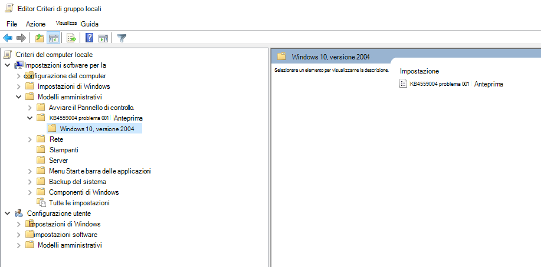
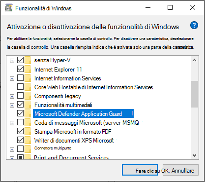
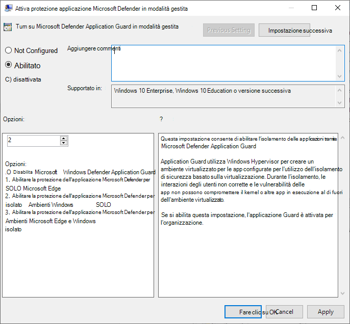
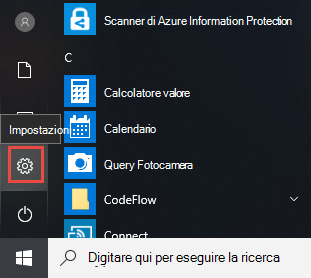
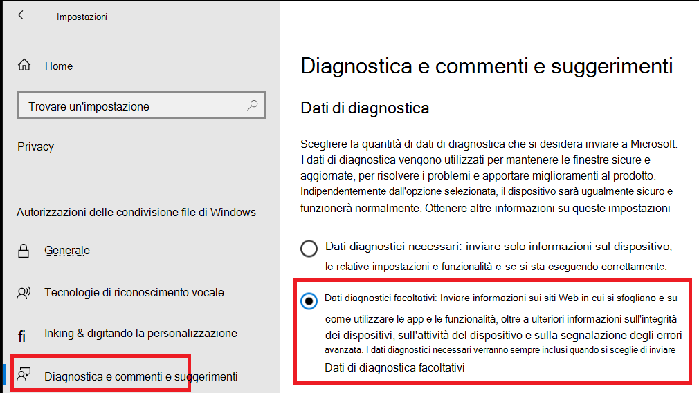
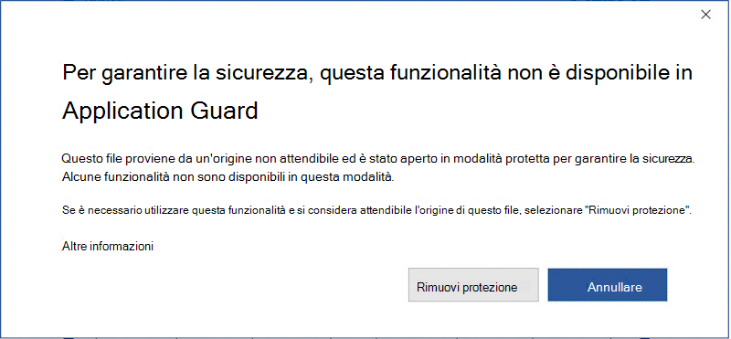

# <a name="application-guard-for-office-public-preview-for-admins"></a><span data-ttu-id="f4323-105">Applicazione di protezione per Office (anteprima pubblica) per gli amministratori</span><span class="sxs-lookup"><span data-stu-id="f4323-105">Application Guard for Office (public preview) for admins</span></span>


<span data-ttu-id="f4323-106">**Si applica a:** Word, Excel e PowerPoint per Microsoft 365, Windows 10 Enterprise</span><span class="sxs-lookup"><span data-stu-id="f4323-106">**Applies to:** Word, Excel, and PowerPoint for Microsoft 365, Windows 10 Enterprise</span></span>

>[!IMPORTANT]
><span data-ttu-id="f4323-107">Alcune informazioni si riferiscono a un prodotto prerilasciato che può essere modificato in modo sostanziale prima che venga rilasciato commercialmente.</span><span class="sxs-lookup"><span data-stu-id="f4323-107">Some information relates to a prereleased product which may be substantially modified before it's commercially released.</span></span> <span data-ttu-id="f4323-108">Microsoft makes no warranties, express or implied, with respect to the information provided here.</span><span class="sxs-lookup"><span data-stu-id="f4323-108">Microsoft makes no warranties, express or implied, with respect to the information provided here.</span></span>


<span data-ttu-id="f4323-109">Microsoft Defender Application Guard for Office (Application Guard for Office) consente di evitare che i file non attendibili accedano a risorse attendibili, mantenendo l'organizzazione sicura da attacchi nuovi ed emergenti.</span><span class="sxs-lookup"><span data-stu-id="f4323-109">Microsoft Defender Application Guard for Office (Application Guard for Office) helps prevent untrusted files from accessing trusted resources, keeping your enterprise safe from new and emerging attacks.</span></span> <span data-ttu-id="f4323-110">In questo articolo vengono illustrati gli amministratori tramite la configurazione dei dispositivi per un'anteprima di Application Guard per Office.</span><span class="sxs-lookup"><span data-stu-id="f4323-110">This article walks admins through setting up devices for a preview of Application Guard for Office.</span></span> <span data-ttu-id="f4323-111">Fornisce informazioni sui requisiti di sistema e sui passaggi di installazione per abilitare la protezione delle applicazioni per Office in un dispositivo.</span><span class="sxs-lookup"><span data-stu-id="f4323-111">It provides information about system requirements and installation steps to enable Application Guard for Office on a device.</span></span>

## <a name="prerequisites"></a><span data-ttu-id="f4323-112">Prerequisiti</span><span class="sxs-lookup"><span data-stu-id="f4323-112">Prerequisites</span></span>

### <a name="minimum-hardware-requirements"></a><span data-ttu-id="f4323-113">Requisiti hardware minimi</span><span class="sxs-lookup"><span data-stu-id="f4323-113">Minimum hardware requirements</span></span>

* <span data-ttu-id="f4323-114">**CPU**: 64 bit, 4 core (fisico o virtuale), estensioni di virtualizzazione (Intel VT-x o AMD-V), Core i5 equivalente o superiore consigliato</span><span class="sxs-lookup"><span data-stu-id="f4323-114">**CPU**: 64-bit, 4 cores (physical or virtual), virtualization extensions   (Intel VT-x OR AMD-V), Core i5 equivalent or higher recommended</span></span>
* <span data-ttu-id="f4323-115">**Memoria fisica**: 8 GB di RAM</span><span class="sxs-lookup"><span data-stu-id="f4323-115">**Physical memory**: 8-GB RAM</span></span>
* <span data-ttu-id="f4323-116">**Disco rigido**: 10 GB di spazio libero nell'unità di sistema (consigliato da SSD)</span><span class="sxs-lookup"><span data-stu-id="f4323-116">**Hard disk**: 10 GB of free space on the system drive (SSD recommended)</span></span>

### <a name="minimum-software-requirements"></a><span data-ttu-id="f4323-117">Requisiti software minimi</span><span class="sxs-lookup"><span data-stu-id="f4323-117">Minimum software requirements</span></span>

* <span data-ttu-id="f4323-118">**Windows 10**: Windows 10 Enterprise Edition, generazione Client versione 2004 (20H1) Build 19041</span><span class="sxs-lookup"><span data-stu-id="f4323-118">**Windows 10**: Windows 10 Enterprise edition, Client Build version 2004 (20H1) build 19041</span></span>
* <span data-ttu-id="f4323-119">**Office**: build di Office beta Channel versione 2008 16.0.13212 o versioni successive</span><span class="sxs-lookup"><span data-stu-id="f4323-119">**Office**: Office Beta Channel Build version 2008 16.0.13212 or later</span></span>
* <span data-ttu-id="f4323-120">**Pacchetto di aggiornamento**: aggiornamenti della sicurezza cumulativi mensili di Windows 10 [KB4566782](https://support.microsoft.com/help/4566782/windows-10-update-kb4566782)</span><span class="sxs-lookup"><span data-stu-id="f4323-120">**Update package**: Windows 10 cumulative monthly security updates [KB4566782](https://support.microsoft.com/help/4566782/windows-10-update-kb4566782)</span></span> 

<span data-ttu-id="f4323-121">Per informazioni dettagliate sui requisiti di sistema, vedere [requisiti di sistema per Microsoft Defender Application Guard](https://docs.microsoft.com/windows/security/threat-protection/microsoft-defender-application-guard/reqs-md-app-guard).</span><span class="sxs-lookup"><span data-stu-id="f4323-121">For detailed system requirements, refer to [System requirements for Microsoft Defender Application Guard](https://docs.microsoft.com/windows/security/threat-protection/microsoft-defender-application-guard/reqs-md-app-guard).</span></span> <span data-ttu-id="f4323-122">Per ulteriori informazioni sulle compilazioni di Office Insider Preview, vedere [Guida introduttiva alla distribuzione di Office Insider Builds](https://insider.office.com/business/deploy).</span><span class="sxs-lookup"><span data-stu-id="f4323-122">To learn more about Office Insider Preview builds, refer to [Getting started on deploying Office Insider builds](https://insider.office.com/business/deploy).</span></span>

### <a name="licensing-requirements"></a><span data-ttu-id="f4323-123">Requisiti per la licenza</span><span class="sxs-lookup"><span data-stu-id="f4323-123">Licensing requirements</span></span>
* <span data-ttu-id="f4323-124">Sicurezza di Microsoft 365 E5 o Microsoft 365 E5</span><span class="sxs-lookup"><span data-stu-id="f4323-124">Microsoft 365 E5 or Microsoft 365 E5 Security</span></span>

## <a name="deploy-application-guard-for-office"></a><span data-ttu-id="f4323-125">Distribuire applicazione di protezione per Office</span><span class="sxs-lookup"><span data-stu-id="f4323-125">Deploy Application Guard for Office</span></span>

### <a name="enable-application-guard-for-office"></a><span data-ttu-id="f4323-126">Abilitare la protezione dell'applicazione per Office</span><span class="sxs-lookup"><span data-stu-id="f4323-126">Enable Application Guard for Office</span></span>

1.  <span data-ttu-id="f4323-127">Scaricare e installare **gli aggiornamenti di sicurezza cumulativi mensili di Windows 10 KB4566782**.</span><span class="sxs-lookup"><span data-stu-id="f4323-127">Download and install **Windows 10 cumulative monthly security updates KB4566782**.</span></span> 

2. <span data-ttu-id="f4323-128">Scaricare e installare [**Application Guard per il pacchetto di attivazione delle funzionalità di Office**](https://download.microsoft.com/download/e/4/c/e4c1180a-fcff-462a-8324-4151c44973a8/Windows%20Preview%20-%20WDAG%20Office%20070920%2001.msi).</span><span class="sxs-lookup"><span data-stu-id="f4323-128">Download and install [**Application Guard for Office Feature enablement package**](https://download.microsoft.com/download/e/4/c/e4c1180a-fcff-462a-8324-4151c44973a8/Windows%20Preview%20-%20WDAG%20Office%20070920%2001.msi).</span></span> <span data-ttu-id="f4323-129">Questo pacchetto installa un criterio di gruppo denominato "KB4559004 Issue 001 Preview" in **Configurazione computer\Modelli (computer**).</span><span class="sxs-lookup"><span data-stu-id="f4323-129">This package installs a group policy called "KB4559004 Issue 001 Preview" under **Computer Configuration\Administrative Templates**.</span></span> <span data-ttu-id="f4323-130">Impostare questo criterio di gruppo su **attivato**.</span><span class="sxs-lookup"><span data-stu-id="f4323-130">Set this group policy  to **Enabled**.</span></span>
     <span data-ttu-id="f4323-131"></span><span class="sxs-lookup"><span data-stu-id="f4323-131"></span></span>

     

    <span data-ttu-id="f4323-133">È inoltre possibile impostare direttamente le seguenti chiavi reg:</span><span class="sxs-lookup"><span data-stu-id="f4323-133">You can also directly set the following reg keys:</span></span> 
    
    ```
    reg add HKLM\SYSTEM\CurrentControlSet\Policies\Microsoft\FeatureManagement\Overrides /v 3457697930 /t REG_DWORD /d 1 
    ```
    ```
    reg add HKLM\SYSTEM\CurrentControlSet\Policies\Microsoft\FeatureManagement\Overrides /v 94539402 /t REG_DWORD /d 1 
    ```
    <span data-ttu-id="f4323-134">Eseguire quindi il comando PowerShell:</span><span class="sxs-lookup"><span data-stu-id="f4323-134">Then, run this PowerShell command:</span></span> 
    
    ```powershell
    Get-ScheduledTask -TaskName "ReconcileFeatures" -TaskPath "\Microsoft\Windows\Flighting\FeatureConfig\" | Start-ScheduledTask 
    ```

3.  <span data-ttu-id="f4323-135">Selezionare **Protezione applicazione Microsoft Defender** in funzionalità di Windows e quindi fare clic su **OK**.</span><span class="sxs-lookup"><span data-stu-id="f4323-135">Select **Microsoft Defender Application Guard** under Windows Features and select **OK**.</span></span> <span data-ttu-id="f4323-136">L'abilitazione della funzionalità di protezione dell'applicazione richiederà un riavvio del sistema.</span><span class="sxs-lookup"><span data-stu-id="f4323-136">Enabling the Application Guard feature will prompt a system reboot.</span></span> <span data-ttu-id="f4323-137">È possibile scegliere di riavviare subito o dopo il passaggio 4.</span><span class="sxs-lookup"><span data-stu-id="f4323-137">You can choose to reboot now or after step 4.</span></span>

    
    
    <span data-ttu-id="f4323-139">La funzionalità può anche essere abilitata eseguendo il seguente comando di PowerShell come amministratore:</span><span class="sxs-lookup"><span data-stu-id="f4323-139">The feature can also be enabled by running the following PowerShell command as administrator:</span></span> 

    ```powershell
    Enable-WindowsOptionalFeature -online -FeatureName Windows-Defender-ApplicationGuard 
    ```

4.  <span data-ttu-id="f4323-140">Cercare la protezione dell'applicazione Microsoft Defender in modalità gestita criteri di gruppo disponibili in **Configurazione computer \\ modelli amministrativi di \\ Windows Components \\ Microsoft Defender Application Guard**.</span><span class="sxs-lookup"><span data-stu-id="f4323-140">Look for the Microsoft Defender Application Guard in Managed Mode group policy located at **Computer Configuration\\Administrative Templates\\Windows Components\\Microsoft Defender Application Guard**.</span></span> <span data-ttu-id="f4323-141">Attiva questo criterio impostando il valore in opzioni come **2** o **3** , quindi selezionando **OK** o **applica**.</span><span class="sxs-lookup"><span data-stu-id="f4323-141">Turn this policy on by setting the value under Options as **2** or **3** then selecting **OK** or **Apply**.</span></span>

    
  
    <span data-ttu-id="f4323-143">In alternativa, è possibile impostare il criterio CSP corrispondente:</span><span class="sxs-lookup"><span data-stu-id="f4323-143">Alternatively, you can set the corresponding CSP policy:</span></span> 

    <span data-ttu-id="f4323-144">OMA-URI: **./Device/vendor/MSFT/WindowsDefenderApplicationGuard/Settings/AllowWindowsDefenderApplicationGuard** 
    </span><span class="sxs-lookup"><span data-stu-id="f4323-144">OMA-URI: **./Device/Vendor/MSFT/WindowsDefenderApplicationGuard/Settings/AllowWindowsDefenderApplicationGuard** 
    </span></span><br><span data-ttu-id="f4323-145">Tipo di dati: **intero** 
</span><span class="sxs-lookup"><span data-stu-id="f4323-145">Data type: **Integer** 
</span></span><br><span data-ttu-id="f4323-146">Valore: **2**</span><span class="sxs-lookup"><span data-stu-id="f4323-146">Value: **2**</span></span>


5.  <span data-ttu-id="f4323-147">Riavviare il sistema.</span><span class="sxs-lookup"><span data-stu-id="f4323-147">Reboot the system.</span></span>

### <a name="set-diagnostics--feedback-to-send-full-data"></a><span data-ttu-id="f4323-148">Set Diagnostics & feedback to Send Full data</span><span class="sxs-lookup"><span data-stu-id="f4323-148">Set Diagnostics & feedback to send full data</span></span>

<span data-ttu-id="f4323-149">Questo passaggio garantisce che i dati necessari per identificare e correggere i problemi raggiungano Microsoft.</span><span class="sxs-lookup"><span data-stu-id="f4323-149">This step ensures that the data necessary to identify and fix problems is reaching Microsoft.</span></span> <span data-ttu-id="f4323-150">Seguire questa procedura per abilitare la diagnostica nel dispositivo Windows:</span><span class="sxs-lookup"><span data-stu-id="f4323-150">Follow these steps to enable diagnostics on your Windows device:</span></span>

1.  <span data-ttu-id="f4323-151">Aprire **Impostazioni** dal menu Start.</span><span class="sxs-lookup"><span data-stu-id="f4323-151">Open **Settings** from the Start menu.</span></span>

    

2.  <span data-ttu-id="f4323-153">Nelle **impostazioni di Windows**, selezionare **privacy**.</span><span class="sxs-lookup"><span data-stu-id="f4323-153">On **Windows Settings**, select **Privacy**.</span></span>

    

3.  <span data-ttu-id="f4323-155">In privacy, selezionare **diagnostica & Commenti** e selezionare **dati diagnostici facoltativi**.</span><span class="sxs-lookup"><span data-stu-id="f4323-155">Under Privacy, select **Diagnostics & feedback** and select **Optional diagnostic data**.</span></span>

    

<span data-ttu-id="f4323-157">Per ulteriori informazioni sulla configurazione delle impostazioni di diagnostica di Windows, fare riferimento a [configurazione dei dati di diagnostica di Windows nell'organizzazione](https://docs.microsoft.com/windows/privacy/configure-windows-diagnostic-data-in-your-organization#enterprise-management).</span><span class="sxs-lookup"><span data-stu-id="f4323-157">For more on configuring Windows diagnostic settings, refer to [Configuring Windows diagnostic data in your organization](https://docs.microsoft.com/windows/privacy/configure-windows-diagnostic-data-in-your-organization#enterprise-management).</span></span>

### <a name="confirm-that-application-guard-for-office-is-enabled-and-working"></a><span data-ttu-id="f4323-158">Verificare che Application Guard per Office sia abilitato e funzionante</span><span class="sxs-lookup"><span data-stu-id="f4323-158">Confirm that Application Guard for Office is enabled and working</span></span>

<span data-ttu-id="f4323-159">Prima di confermare che l'applicazione di protezione per Office è abilitata, avviare Word, Excel o PowerPoint su un dispositivo in cui sono stati distribuiti i criteri.</span><span class="sxs-lookup"><span data-stu-id="f4323-159">Before confirming that the Application Guard for Office is enabled, launch Word, Excel, or PowerPoint on a device where the policies have been deployed.</span></span> <span data-ttu-id="f4323-160">Verificare che Office sia attivato.</span><span class="sxs-lookup"><span data-stu-id="f4323-160">Make sure Office is activated.</span></span> <span data-ttu-id="f4323-161">Potrebbe essere necessario utilizzare l'identità del lavoro per attivare prima il prodotto Office.</span><span class="sxs-lookup"><span data-stu-id="f4323-161">You may need to use your work identity to activate the Office product first.</span></span>

<span data-ttu-id="f4323-162">Per confermare che Application Guard per Office è ora abilitato, avviare Word, Excel o PowerPoint e aprire un documento non attendibile.</span><span class="sxs-lookup"><span data-stu-id="f4323-162">To confirm that Application Guard for Office is now enabled, launch Word, Excel, or PowerPoint and open an untrusted document.</span></span> <span data-ttu-id="f4323-163">Ad esempio, è possibile aprire un documento scaricato da Internet o un allegato di posta elettronica da un utente esterno all'organizzazione.</span><span class="sxs-lookup"><span data-stu-id="f4323-163">For example, you can open a document downloaded from the internet or an email attachment from someone outside your organization.</span></span>

<span data-ttu-id="f4323-164">Al primo avvio di un file non attendibile, è possibile che venga visualizzata una schermata iniziale di Office come quella riportata di seguito.</span><span class="sxs-lookup"><span data-stu-id="f4323-164">On the first launch of an untrusted file, you may see an Office splash screen like the one below.</span></span> <span data-ttu-id="f4323-165">Potrebbe essere visualizzato per un certo periodo di tempo mentre è in corso l'attivazione di protezione applicazione per Office e il file viene aperto.</span><span class="sxs-lookup"><span data-stu-id="f4323-165">It might show for some time while Application Guard for Office is being activated and the file is being opened.</span></span> <span data-ttu-id="f4323-166">I successivi lanci di file non attendibili dovrebbero essere più veloci.</span><span class="sxs-lookup"><span data-stu-id="f4323-166">Subsequent launches of untrusted files should be faster.</span></span>


<span data-ttu-id="f4323-168">Al momento dell'apertura, il file deve visualizzare alcuni indicatori visivi che il file è stato aperto all'interno dell'applicazione di protezione per Office:</span><span class="sxs-lookup"><span data-stu-id="f4323-168">Upon being opened, the file should display a few visual indicators that the file was opened inside Application Guard for Office:</span></span>

* <span data-ttu-id="f4323-169">Un callout nella barra multifunzione</span><span class="sxs-lookup"><span data-stu-id="f4323-169">A callout in the ribbon</span></span>

    
* <span data-ttu-id="f4323-171">L'icona dell'applicazione con una schermatura nella barra delle applicazioni</span><span class="sxs-lookup"><span data-stu-id="f4323-171">The application icon with a shield in the taskbar</span></span> 

    


## <a name="configure-application-guard-for-office"></a><span data-ttu-id="f4323-173">Configurare la protezione dell'applicazione per Office</span><span class="sxs-lookup"><span data-stu-id="f4323-173">Configure Application Guard for Office</span></span>
<span data-ttu-id="f4323-174">Office supporta i criteri seguenti per consentire di configurare le funzionalità di protezione delle applicazioni per Office.</span><span class="sxs-lookup"><span data-stu-id="f4323-174">Office supports the following policies to enable you to configure the capabilities of Application Guard for Office.</span></span> <span data-ttu-id="f4323-175">Questi criteri possono essere configurati mediante criteri di gruppo o tramite il servizio criteri cloud di Office.</span><span class="sxs-lookup"><span data-stu-id="f4323-175">These policies can be configured through Group policies or through the Office cloud policy service.</span></span> 

>[!NOTE] 
> <span data-ttu-id="f4323-176">Questi criteri diventeranno disponibili a breve.</span><span class="sxs-lookup"><span data-stu-id="f4323-176">These policies will become available soon.</span></span>
><span data-ttu-id="f4323-177">Inoltre, la configurazione di questi criteri può disabilitare alcune funzionalità per i file aperti in Application Guard per Office.</span><span class="sxs-lookup"><span data-stu-id="f4323-177">Also, configuring these policies can disable some functionalities for files opened in Application Guard for Office.</span></span>

| <span data-ttu-id="f4323-178">Criteri</span><span class="sxs-lookup"><span data-stu-id="f4323-178">Policy</span></span>                                                                          | <span data-ttu-id="f4323-179">Descrizione</span><span class="sxs-lookup"><span data-stu-id="f4323-179">Description</span></span>                                                                                                                                                                                                                                                                                             |
|---------------------------------------------------------------------------------|---------------------------------------------------------------------------------------------------------------------------------------------------------------------------------------------------------------------------------------------------------------------------------------------------------|
| <span data-ttu-id="f4323-180">Disattiva applicazione di protezione per Office</span><span class="sxs-lookup"><span data-stu-id="f4323-180">Disable Application Guard for Office</span></span>                                            | <span data-ttu-id="f4323-181">L'abilitazione di questo criterio costringerà Word, Excel e PowerPoint a utilizzare il contenitore di isolamento della visualizzazione protetta anziché la protezione dell'applicazione per Office.</span><span class="sxs-lookup"><span data-stu-id="f4323-181">Enabling this policy will force Word, Excel, and PowerPoint to use the Protected View isolation container instead of Application Guard for Office.</span></span> <span data-ttu-id="f4323-182">Questo criterio può essere utilizzato per disabilitare temporaneamente la funzionalità di protezione delle applicazioni per Office quando si verificano problemi di abilitazione per Edge.</span><span class="sxs-lookup"><span data-stu-id="f4323-182">This policy can be used to temporarily disable Application Guard for Office when there are issues in leaving it enabled for Edge.</span></span>                                  |
| <span data-ttu-id="f4323-183">Disattiva copia/incolla per i documenti aperti in applicazione di protezione</span><span class="sxs-lookup"><span data-stu-id="f4323-183">Disable copy/paste for documents opened in Application Guard</span></span>                    | <span data-ttu-id="f4323-184">L'abilitazione di questo criterio impedirà a un utente di copiare e incollare il contenuto di un documento aperto in Application Guard for Office in un documento aperto all'esterno.</span><span class="sxs-lookup"><span data-stu-id="f4323-184">Enabling this policy will prevent a user from copying and pasting content from a document opened in Application Guard for Office to a document opened outside it.</span></span>                                                                                                                                   |
| <span data-ttu-id="f4323-185">Impedire agli utenti di rimuovere la protezione delle applicazioni in file</span><span class="sxs-lookup"><span data-stu-id="f4323-185">Prevent users from removing Application Guard protection on files</span></span>               | <span data-ttu-id="f4323-186">L'abilitazione di questo criterio consente di rimuovere l'opzione (nell'ambito dell'applicazione di Office) per disabilitare la protezione delle applicazioni o aprire un file all'esterno dell'applicazione di protezione.</span><span class="sxs-lookup"><span data-stu-id="f4323-186">Enabling this policy will remove the option (within the Office application experience) to disable Application Guard protection or open a file outside Application Guard.</span></span> <br><br><span data-ttu-id="f4323-187">**Nota:** Gli utenti possono comunque ignorare questo criterio rimuovendo manualmente la proprietà Mark-of-the-Web dal file o spostando un documento in un percorso attendibile.</span><span class="sxs-lookup"><span data-stu-id="f4323-187">**Note:** Users can still bypass this policy by manually removing the mark-of-the-web property from the file or by moving a document to a Trusted location.</span></span> |
| <span data-ttu-id="f4323-188">Limitare la stampa ai documenti aperti in protezione applicazione</span><span class="sxs-lookup"><span data-stu-id="f4323-188">Restrict printing from documents opened in Application Guard</span></span>                    | <span data-ttu-id="f4323-189">L'abilitazione di questo criterio consentirà di limitare le stampanti che un utente può stampare da un file aperto in Application Guard for Office.</span><span class="sxs-lookup"><span data-stu-id="f4323-189">Enabling this policy will limit printers a user can print to from a file opened in Application Guard for Office.</span></span> <span data-ttu-id="f4323-190">Ad esempio, è possibile utilizzare questo criterio per limitare gli utenti a stampare solo in formato PDF.</span><span class="sxs-lookup"><span data-stu-id="f4323-190">For example, you can use this policy to restrict users to only print to PDF.</span></span>                              |
| <span data-ttu-id="f4323-191">Disattivare l'accesso alla videocamera e al microfono per i documenti aperti in protezione applicazione</span><span class="sxs-lookup"><span data-stu-id="f4323-191">Turn off camera and microphone access for documents opened in Application Guard</span></span> | <span data-ttu-id="f4323-192">L'abilitazione di questo criterio consente di rimuovere l'accesso di Office alla videocamera e al microfono all'interno dell'applicazione Guard per Office.</span><span class="sxs-lookup"><span data-stu-id="f4323-192">Enabling this policy will remove Office access to Camera and Microphone inside Application Guard for Office.</span></span>                                                                                                                                                                                                     |
>[!NOTE] 
><span data-ttu-id="f4323-193">I criteri seguenti richiederanno all'utente di disconnettersi e di eseguire nuovamente l'accesso a Windows per rendere effettive le operazioni:</span><span class="sxs-lookup"><span data-stu-id="f4323-193">The following policies will require the user to log off and re-login to Windows to take effect:</span></span>
> 
> *  <span data-ttu-id="f4323-194">Disattiva copia/incolla per i documenti aperti in applicazione di protezione</span><span class="sxs-lookup"><span data-stu-id="f4323-194">Disable copy/paste for documents opened in Application Guard</span></span>
>*  <span data-ttu-id="f4323-195">Limitare la stampa per i documenti aperti in protezione applicazione</span><span class="sxs-lookup"><span data-stu-id="f4323-195">Restrict printing for documents opened in Application Guard</span></span>
> *  <span data-ttu-id="f4323-196">Disattivare l'accesso videocamera e MIC ai documenti aperti in protezione applicazione</span><span class="sxs-lookup"><span data-stu-id="f4323-196">Turn off camera and mic access to documents opened in Application Guard</span></span>


## <a name="submit-feedback"></a><span data-ttu-id="f4323-197">Inviare commenti e suggerimenti</span><span class="sxs-lookup"><span data-stu-id="f4323-197">Submit feedback</span></span>

### <a name="submit-feedback-via-feedback-hub"></a><span data-ttu-id="f4323-198">Inviare commenti e suggerimenti tramite hub commenti e suggerimenti</span><span class="sxs-lookup"><span data-stu-id="f4323-198">Submit feedback via Feedback Hub</span></span>

<span data-ttu-id="f4323-199">Se si verificano problemi durante l'avvio dell'applicazione di protezione per Office, è consigliabile inviare i propri commenti tramite l'hub dei commenti e suggerimenti:</span><span class="sxs-lookup"><span data-stu-id="f4323-199">If you encounter any issues when launching Application Guard for Office, you are encouraged to submit your feedback via Feedback Hub:</span></span>

1.  <span data-ttu-id="f4323-200">Aprire l' **app dell'hub dei commenti** e accedi.</span><span class="sxs-lookup"><span data-stu-id="f4323-200">Open the **Feedback Hub app** and sign in.</span></span>

2.  <span data-ttu-id="f4323-201">Se si riceve una finestra di dialogo di errore durante l'avvio dell'applicazione, selezionare **segnala a Microsoft** nella finestra di dialogo di errore per avviare un nuovo invio di commenti e suggerimenti.</span><span class="sxs-lookup"><span data-stu-id="f4323-201">If you get an error dialog while launching Application Guard, select **Report to Microsoft** in the error dialog to start a new feedback submission.</span></span> <span data-ttu-id="f4323-202">In caso contrario, passare a <https://aka.ms/wdagoffice-fb> per selezionare la categoria corretta per la protezione dell'applicazione, quindi selezionare **+ Aggiungi nuovo feedback** vicino all'angolo superiore destro.</span><span class="sxs-lookup"><span data-stu-id="f4323-202">Otherwise, navigate to <https://aka.ms/wdagoffice-fb> to select the correct category for Application Guard, then select **+ Add new feedback** near the top right.</span></span>

3.  <span data-ttu-id="f4323-203">Inserire la casella di **Riepilogo dei commenti e suggerimenti** se non è già stata compilata per l'utente.</span><span class="sxs-lookup"><span data-stu-id="f4323-203">Fill in the **Summarize your feedback** box if it isn’t already filled in for you.</span></span>

4.  <span data-ttu-id="f4323-204">Compilare la casella **spiega in più dettagli** con una descrizione dettagliata del problema che si è verificato e quali operazioni sono state eseguite, quindi selezionare **Avanti**.</span><span class="sxs-lookup"><span data-stu-id="f4323-204">Fill in the **Explain in more detail** box with a detailed description of the issue you experienced and what steps you took, then select **Next**.</span></span>

5.  <span data-ttu-id="f4323-205">Selezionare la bolla accanto a problema.</span><span class="sxs-lookup"><span data-stu-id="f4323-205">Select the bubble next to Problem.</span></span> <span data-ttu-id="f4323-206">Verificare che la categoria selezionata sia **sicurezza e privacy \> Microsoft Defender Application Guard – Office**, quindi selezionare **Avanti**.</span><span class="sxs-lookup"><span data-stu-id="f4323-206">Make sure the category selected is **Security and Privacy \> Microsoft Defender Application Guard – Office**, then select **Next**.</span></span>

6.  <span data-ttu-id="f4323-207">Selezionare **nuovo feedback**, quindi **Avanti**.</span><span class="sxs-lookup"><span data-stu-id="f4323-207">Select **New feedback**, then **Next**.</span></span>

7.  <span data-ttu-id="f4323-208">Raccogliere le tracce sul problema:</span><span class="sxs-lookup"><span data-stu-id="f4323-208">Collect traces about the issue:</span></span>

    1. <span data-ttu-id="f4323-209">Espandere la sezione **ricrea il mio problema** .</span><span class="sxs-lookup"><span data-stu-id="f4323-209">Expand the **Recreate my problem** tile.</span></span>

    2.  <span data-ttu-id="f4323-210">Se il problema riscontrato si verifica durante l'esecuzione della protezione dell'applicazione, aprire un'istanza di guardia dell'applicazione.</span><span class="sxs-lookup"><span data-stu-id="f4323-210">If the issue you’re experiencing occurs while Application Guard is running, open an Application Guard instance.</span></span> <span data-ttu-id="f4323-211">In questo modo è possibile raccogliere ulteriori tracce dall'interno del contenitore di protezione dell'applicazione.</span><span class="sxs-lookup"><span data-stu-id="f4323-211">Doing this allows additional traces to be collected from within the Application Guard container.</span></span>

    3.  <span data-ttu-id="f4323-212">Seleziona **Avvia registrazione** e attendi che il riquadro smetta di girare e di' *Interrompi registrazione*.</span><span class="sxs-lookup"><span data-stu-id="f4323-212">Select **Start recording** and wait for the tile to stop spinning and say *Stop recording*.</span></span>

    4.  <span data-ttu-id="f4323-213">Riprodurre completamente il problema con la protezione dell'applicazione.</span><span class="sxs-lookup"><span data-stu-id="f4323-213">Fully reproduce the issue with Application Guard.</span></span> <span data-ttu-id="f4323-214">Potrebbe essere necessario tentare di avviare un'istanza di guardia dell'applicazione e attendere che si verifichi un errore o che venga riprodotto un problema in un'istanza in esecuzione di protezione dell'applicazione.</span><span class="sxs-lookup"><span data-stu-id="f4323-214">This might include attempting to launch an Application Guard instance and waiting until it fails, or reproducing an issue in a running Application Guard instance.</span></span>

    5.  <span data-ttu-id="f4323-215">Selezionare il riquadro **Interrompi registrazione** .</span><span class="sxs-lookup"><span data-stu-id="f4323-215">Select the **Stop recording** tile.</span></span>

    6.  <span data-ttu-id="f4323-216">Mantenere tutte le istanze/s di protezione delle applicazioni in esecuzione, anche fino a qualche minuto dopo l'invio, in modo che sia possibile raccogliere anche la diagnostica dei contenitori.</span><span class="sxs-lookup"><span data-stu-id="f4323-216">Keep any running Application Guard instance/s open, even until a few minutes after submission, so that container diagnostics can also be collected.</span></span>

8.  <span data-ttu-id="f4323-217">Collegare gli screenshot o i file rilevanti relativi al problema.</span><span class="sxs-lookup"><span data-stu-id="f4323-217">Attach any relevant screenshots or files related to the problem.</span></span>

9.  <span data-ttu-id="f4323-218">Selezionare **Invia**.</span><span class="sxs-lookup"><span data-stu-id="f4323-218">Select **Submit**.</span></span>


### <a name="submit-feedback-via-office-customer-voice"></a><span data-ttu-id="f4323-219">Inviare commenti e suggerimenti tramite la voce del cliente di Office</span><span class="sxs-lookup"><span data-stu-id="f4323-219">Submit feedback via Office Customer Voice</span></span>

<span data-ttu-id="f4323-220">È anche possibile inviare commenti e suggerimenti da Office se il problema si verifica quando i documenti di Office vengono aperti nel servizio di protezione dell'applicazione.</span><span class="sxs-lookup"><span data-stu-id="f4323-220">You may also submit feedback from within Office if the issue happens when Office documents are opened in Application Guard.</span></span> <span data-ttu-id="f4323-221">Fare riferimento a [Office Insider Handbook](https://insider.office.com/handbook) per l'invio di commenti e suggerimenti.</span><span class="sxs-lookup"><span data-stu-id="f4323-221">Refer to the [Office Insider Handbook](https://insider.office.com/handbook) for submitting feedback.</span></span>

## <a name="integration-with-microsoft-defender-atp-and-office-atp"></a><span data-ttu-id="f4323-222">Integrazione con Microsoft Defender ATP e Office ATP</span><span class="sxs-lookup"><span data-stu-id="f4323-222">Integration with Microsoft Defender ATP and Office ATP</span></span>

<span data-ttu-id="f4323-223">Application Guard for Office è integrato con Microsoft Defender Advance Threat Protection (ATP) per fornire il monitoraggio e l'avviso di attività dannose che si verificano nell'ambiente isolato.</span><span class="sxs-lookup"><span data-stu-id="f4323-223">Application Guard for Office is integrated with Microsoft Defender Advance Threat Protection (ATP) to provide monitoring and alerting on malicious activity happening in the isolated environment.</span></span>

<span data-ttu-id="f4323-224">Microsoft Defender ATP è una piattaforma di sicurezza progettata per aiutare le reti aziendali a impedire, rilevare, indagare e rispondere a minacce avanzate.</span><span class="sxs-lookup"><span data-stu-id="f4323-224">Microsoft Defender ATP is a security platform designed to help enterprise networks prevent, detect, investigate, and respond to advanced threats.</span></span> <span data-ttu-id="f4323-225">Per ulteriori informazioni su questa piattaforma, visitare la pagina [Microsoft Defender Advanced Threat Protection](https://www.microsoft.com/microsoft-365/windows/microsoft-defender-atp) .</span><span class="sxs-lookup"><span data-stu-id="f4323-225">For more details about this platform, visit the [Microsoft Defender Advanced Threat Protection](https://www.microsoft.com/microsoft-365/windows/microsoft-defender-atp) page.</span></span> <span data-ttu-id="f4323-226">Per ulteriori informazioni, vedere onboarding devices to this platform at [Onboard Devices to the Microsoft Defender ATP Service](https://docs.microsoft.com/windows/security/threat-protection/microsoft-defender-atp/onboard-configure).</span><span class="sxs-lookup"><span data-stu-id="f4323-226">Learn more about onboarding devices to this platform at [Onboard devices to the Microsoft Defender ATP service](https://docs.microsoft.com/windows/security/threat-protection/microsoft-defender-atp/onboard-configure).</span></span>

<span data-ttu-id="f4323-227">È inoltre possibile configurare Office 365 ATP per l'utilizzo con Microsoft Defender ATP.</span><span class="sxs-lookup"><span data-stu-id="f4323-227">You can also configure Office 365 ATP to work with Microsoft Defender ATP.</span></span> <span data-ttu-id="f4323-228">Fare riferimento a [integrare Office 365 ATP con Microsoft Defender ATP](https://docs.microsoft.com/microsoft-365/security/office-365-security/integrate-office-365-ti-with-wdatp?view=o365-worldwide).</span><span class="sxs-lookup"><span data-stu-id="f4323-228">Refer to [Integrate Office 365 ATP with Microsoft Defender ATP](https://docs.microsoft.com/microsoft-365/security/office-365-security/integrate-office-365-ti-with-wdatp?view=o365-worldwide).</span></span>

## <a name="limitations-and-considerations"></a><span data-ttu-id="f4323-229">Limitazioni e considerazioni</span><span class="sxs-lookup"><span data-stu-id="f4323-229">Limitations and considerations</span></span>

* <span data-ttu-id="f4323-230">Applicazione di protezione per Office è una modalità limitata che isola i documenti non attendibili dall'accesso alle risorse aziendali attendibili, alla rete Intranet, all'identità dell'utente e ai file arbitrari presenti nel computer.</span><span class="sxs-lookup"><span data-stu-id="f4323-230">Application Guard for Office is a restricted mode that isolates untrusted documents from accessing trusted corporate resources, intranet, the user's identity, and arbitrary files present on the computer.</span></span> <span data-ttu-id="f4323-231">Di conseguenza, se un utente tenta di accedere a una funzionalità che ha una dipendenza da tale accesso, ad esempio, inserendo un'immagine da un file locale su disco, avrà esito negativo e verrà generato un prompt come quello riportato di seguito.</span><span class="sxs-lookup"><span data-stu-id="f4323-231">As a result, if a user tries to access a feature that has a dependency on such access, for example, inserting a picture from a local file on disk, it will fail and produce a prompt like the one below.</span></span> <span data-ttu-id="f4323-232">Per consentire a un documento non attendibile di accedere a risorse attendibili, gli utenti devono rimuovere la protezione delle applicazioni dal documento.</span><span class="sxs-lookup"><span data-stu-id="f4323-232">To enable an untrusted document to access trusted resources, users must remove Application Guard protection from the document.</span></span>

    

    >[!NOTE]    
    ><span data-ttu-id="f4323-234">Consigliare agli utenti di rimuovere la protezione solo se si considera attendibile il file e la sua origine o da dove proviene.</span><span class="sxs-lookup"><span data-stu-id="f4323-234">Advise users to only remove protection if they trust the file and its source or where it came from.</span></span>

* <span data-ttu-id="f4323-235">Il contenuto attivo in documenti come macro e controlli ActiveX è disabilitato in applicazione di protezione per Office.</span><span class="sxs-lookup"><span data-stu-id="f4323-235">Active content in documents like macros and ActiveX controls are disabled in Application Guard for Office.</span></span> <span data-ttu-id="f4323-236">Gli utenti devono rimuovere la protezione delle applicazioni per abilitare il contenuto attivo.</span><span class="sxs-lookup"><span data-stu-id="f4323-236">Users need to remove Application Guard protection to enable active content.</span></span>

* <span data-ttu-id="f4323-237">File non attendibili aperti da condivisioni di rete o file condivisi da OneDrive, OneDrive for business o SharePoint Online da un'organizzazione diversa aperta come di sola lettura in applicazione di protezione.</span><span class="sxs-lookup"><span data-stu-id="f4323-237">Untrusted files opened from network shares or files shared from OneDrive, OneDrive for Business, or SharePoint Online from a different organization open as read-only in Application Guard.</span></span> <span data-ttu-id="f4323-238">Gli utenti possono salvare una copia locale di tali file per continuare a lavorare nel contenitore o rimuovere la protezione per funzionare direttamente con il file originale.</span><span class="sxs-lookup"><span data-stu-id="f4323-238">Users can save a local copy of such files to continue working in the container or remove protection to directly work with the original file.</span></span>

* <span data-ttu-id="f4323-239">I file protetti da Information Rights Management (IRM) continuano a essere aperti in visualizzazione protetta.</span><span class="sxs-lookup"><span data-stu-id="f4323-239">Files that are protected by Information Rights Management (IRM) continue to   open in Protected View.</span></span>
* <span data-ttu-id="f4323-240">Tutte le personalizzazioni per le applicazioni di Office in Application Guard for Office non verranno mantenute dopo che un utente si disconnette e si disconnette o riavvia il dispositivo.</span><span class="sxs-lookup"><span data-stu-id="f4323-240">Any customizations to Office applications in Application Guard for Office will not persist after a user logs off and logs back in or reboots the device.</span></span> 

* <span data-ttu-id="f4323-241">Solo gli strumenti di accessibilità che utilizzano il Framework UIA possono fornire un'esperienza accessibile per i file aperti in Application Guard for Office.</span><span class="sxs-lookup"><span data-stu-id="f4323-241">Only Accessibility tools that use the UIA framework can provide an accessible experience for files opened in Application Guard for Office.</span></span>

* <span data-ttu-id="f4323-242">La connettività di rete è necessaria per il primo avvio della protezione dell'applicazione dopo l'installazione.</span><span class="sxs-lookup"><span data-stu-id="f4323-242">Network connectivity is required for the first launch of Application Guard after installation.</span></span> <span data-ttu-id="f4323-243">Questa operazione è necessaria per verificare che la licenza venga convalidata dalla protezione dell'applicazione.</span><span class="sxs-lookup"><span data-stu-id="f4323-243">This is required for Application Guard to validate the license.</span></span>
* <span data-ttu-id="f4323-244">Nella sezione info del documento, la proprietà *Last modified by* può visualizzare WDAGUtilityAccount come utente.</span><span class="sxs-lookup"><span data-stu-id="f4323-244">In the document's info section, the *Last Modified By* property may display WDAGUtilityAccount as the user.</span></span> <span data-ttu-id="f4323-245">Questo è l'utente anonimo configurato in protezione applicazione, poiché l'identità dell'utente desktop non è condivisa all'interno del contenitore di protezione dell'applicazione.</span><span class="sxs-lookup"><span data-stu-id="f4323-245">This is the anonymous user configured in Application Guard given that the desktop user's identity is not shared inside the Application Guard container.</span></span> 

## <a name="performance-optimizations-for-application-guard"></a><span data-ttu-id="f4323-246">Ottimizzazioni delle prestazioni per la protezione dell'applicazione</span><span class="sxs-lookup"><span data-stu-id="f4323-246">Performance optimizations for Application Guard</span></span> 

<span data-ttu-id="f4323-247">In questa sezione viene fornita una panoramica delle ottimizzazioni delle prestazioni utilizzate in Application Guard for Office.</span><span class="sxs-lookup"><span data-stu-id="f4323-247">This section provides an overview of the performance optimizations used in Application Guard for Office.</span></span> <span data-ttu-id="f4323-248">Queste informazioni consentono agli amministratori di diagnosticare i rapporti degli utenti relativi alle prestazioni di Office o del sistema generale quando l'applicazione di protezione è abilitata.</span><span class="sxs-lookup"><span data-stu-id="f4323-248">This information can help administrators diagnose reports from users related to the performance of Office or the overall system when Application Guard is enabled.</span></span> 

<span data-ttu-id="f4323-249">Application Guard utilizza un contenitore virtualizzato per isolare i documenti non attendibili dal sistema.</span><span class="sxs-lookup"><span data-stu-id="f4323-249">Application Guard uses a virtualized container to isolate untrusted documents away from the system.</span></span> <span data-ttu-id="f4323-250">Il processo di creazione di un contenitore e l'impostazione del contenitore di protezione dell'applicazione per aprire i documenti di Office ha un sovraccarico delle prestazioni che potrebbe influire negativamente sull'esperienza utente quando gli utenti aprono un documento non attendibile.</span><span class="sxs-lookup"><span data-stu-id="f4323-250">The process of creating a container and setting up the Application Guard container to open Office documents has a performance overhead that might negatively impact user experience when users open an  untrusted document.</span></span> 


<span data-ttu-id="f4323-251">Per fornire agli utenti l'esperienza di apertura dei file prevista, Application Guard utilizza la logica per creare un contenitore quando viene soddisfatta l'euristica seguente in un sistema: un utente ha aperto un file in visualizzazione protetta o applicazione di protezione negli ultimi 28 giorni.</span><span class="sxs-lookup"><span data-stu-id="f4323-251">To provide users with the expected file opening experience, Application Guard uses logic to pre-create a container when the following heuristic is met on a system: A user has opened a file in either Protected View or Application Guard in the past 28 days.</span></span> 

<span data-ttu-id="f4323-252">Quando viene soddisfatta questa euristica, Office crea un contenitore di protezione dell'applicazione per l'utente dopo l'accesso a Windows.</span><span class="sxs-lookup"><span data-stu-id="f4323-252">When this heuristic is met, Office will pre-create an Application Guard container for the user after they log in to Windows.</span></span> <span data-ttu-id="f4323-253">Quando questa operazione di precreazione è in corso, il sistema potrebbe avere prestazioni lente.</span><span class="sxs-lookup"><span data-stu-id="f4323-253">When this pre-create operation is in progress, the system may experience slow performance.</span></span> <span data-ttu-id="f4323-254">Questo verrà risolto non appena l'operazione viene completata.</span><span class="sxs-lookup"><span data-stu-id="f4323-254">This will resolve as soon as the operation completes.</span></span> 


>[!NOTE] 
><span data-ttu-id="f4323-255">I suggerimenti necessari per l'euristica utilizzata per creare il contenitore vengono generati dalle applicazioni di Office come un utente li utilizza.</span><span class="sxs-lookup"><span data-stu-id="f4323-255">The hints needed for the heuristic used to pre-create the container are generated by Office applications as a user uses them.</span></span> <span data-ttu-id="f4323-256">Se un utente installa Office in un nuovo sistema in cui è abilitata la funzionalità di protezione dell'applicazione, Office non creerà la precreazione del contenitore fino alla prima volta che un utente apre un documento non attendibile nel sistema.</span><span class="sxs-lookup"><span data-stu-id="f4323-256">If a user installs Office on a new system where Application Guard is enabled, Office will not pre-create the container until after the first time a user opens an untrusted document on the system.</span></span> <span data-ttu-id="f4323-257">L'utente osserverà che questo primo file richiede più tempo per l'apertura nella protezione dell'applicazione.</span><span class="sxs-lookup"><span data-stu-id="f4323-257">The user will observe that this first file takes longer to open in Application Guard.</span></span> 

## <a name="known-issues-in-preview"></a><span data-ttu-id="f4323-258">Problemi noti nell'anteprima</span><span class="sxs-lookup"><span data-stu-id="f4323-258">Known issues in preview</span></span>

* <span data-ttu-id="f4323-259">Se si fa clic su collegamenti Web ( ```http``` o ```https``` ) il browser non viene aperto.</span><span class="sxs-lookup"><span data-stu-id="f4323-259">Clicking on web links (```http``` or ```https```) does not open the browser.</span></span> 
* <span data-ttu-id="f4323-260">Gli aggiornamenti di .NET causano la mancata apertura dei file nella protezione dell'applicazione.</span><span class="sxs-lookup"><span data-stu-id="f4323-260">.NET updates cause files to fail to open in Application Guard.</span></span> <span data-ttu-id="f4323-261">Come soluzione alternativa, gli utenti possono riavviare il dispositivo quando questo problema viene rilevato.</span><span class="sxs-lookup"><span data-stu-id="f4323-261">As a workaround, users can reboot their device when this issue is encountered.</span></span>
    <span data-ttu-id="f4323-262">Per ulteriori informazioni sul problema, vedere [ricezione di un messaggio di errore quando si tenta di aprire Windows Defender Application Guard o Windows sandbox](https://support.microsoft.com/help/4575917/receiving-an-error-message-when-attempting-to-open-windows-defender-ap).</span><span class="sxs-lookup"><span data-stu-id="f4323-262">Learn more about the issue at [Receiving an error message when attempting to open Windows Defender Application Guard or Windows Sandbox](https://support.microsoft.com/help/4575917/receiving-an-error-message-when-attempting-to-open-windows-defender-ap).</span></span>
