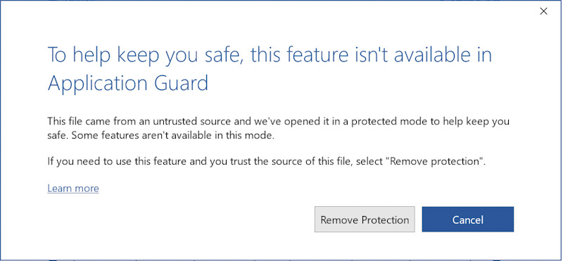

# <a name="application-guard-for-office-for-admins"></a><span data-ttu-id="72a7a-105">Application Guard per Office per amministratori</span><span class="sxs-lookup"><span data-stu-id="72a7a-105">Application Guard for Office for admins</span></span>

<span data-ttu-id="72a7a-106">**Si applica a:** Word, Excel e PowerPoint per Microsoft 365, Windows 10 Enterprise</span><span class="sxs-lookup"><span data-stu-id="72a7a-106">**Applies to:** Word, Excel, and PowerPoint for Microsoft 365, Windows 10 Enterprise</span></span>

<span data-ttu-id="72a7a-107">Microsoft Defender Application Guard per Office (Application Guard per Office) consente di impedire ai file non attendibili di accedere a risorse attendibili, proteggendo l'azienda da attacchi nuovi ed emergenti.</span><span class="sxs-lookup"><span data-stu-id="72a7a-107">Microsoft Defender Application Guard for Office (Application Guard for Office) helps prevent untrusted files from accessing trusted resources, keeping your enterprise safe from new and emerging attacks.</span></span> <span data-ttu-id="72a7a-108">Questo articolo illustra agli amministratori la configurazione dei dispositivi per un'anteprima di Application Guard per Office.</span><span class="sxs-lookup"><span data-stu-id="72a7a-108">This article walks admins through setting up devices for a preview of Application Guard for Office.</span></span> <span data-ttu-id="72a7a-109">Vengono fornite informazioni sui requisiti di sistema e sui passaggi di installazione per abilitare Application Guard per Office in un dispositivo.</span><span class="sxs-lookup"><span data-stu-id="72a7a-109">It provides information about system requirements and installation steps to enable Application Guard for Office on a device.</span></span>

## <a name="prerequisites"></a><span data-ttu-id="72a7a-110">Prerequisiti</span><span class="sxs-lookup"><span data-stu-id="72a7a-110">Prerequisites</span></span>

### <a name="minimum-hardware-requirements"></a><span data-ttu-id="72a7a-111">Requisiti hardware minimi</span><span class="sxs-lookup"><span data-stu-id="72a7a-111">Minimum hardware requirements</span></span>

* <span data-ttu-id="72a7a-112">**CPU**: 64 bit, 4 core (fisici o virtuali), estensioni di virtualizzazione (Intel VT-x OR AMD-V), Core i5 equivalente o superiore consigliato</span><span class="sxs-lookup"><span data-stu-id="72a7a-112">**CPU**: 64-bit, 4 cores (physical or virtual), virtualization extensions (Intel VT-x OR AMD-V), Core i5 equivalent or higher recommended</span></span>
* <span data-ttu-id="72a7a-113">**Memoria fisica**: 8 GB di RAM</span><span class="sxs-lookup"><span data-stu-id="72a7a-113">**Physical memory**: 8-GB RAM</span></span>
* <span data-ttu-id="72a7a-114">**Disco rigido**: 10 GB di spazio libero nell'unità di sistema (SSD consigliato)</span><span class="sxs-lookup"><span data-stu-id="72a7a-114">**Hard disk**: 10 GB of free space on the system drive (SSD recommended)</span></span>

### <a name="minimum-software-requirements"></a><span data-ttu-id="72a7a-115">Requisiti software minimi</span><span class="sxs-lookup"><span data-stu-id="72a7a-115">Minimum software requirements</span></span>

* <span data-ttu-id="72a7a-116">**Windows 10**: Windows 10 Enterprise Edition, Client Build versione 2004 (20H1) build 19041 o successiva</span><span class="sxs-lookup"><span data-stu-id="72a7a-116">**Windows 10**: Windows 10 Enterprise edition, Client Build version 2004 (20H1) build 19041 or later</span></span>
* <span data-ttu-id="72a7a-117">**Office**: Canale corrente di Office e Canale Enterprise mensile, versione build 2011 16.0.13530.10000 o successiva.</span><span class="sxs-lookup"><span data-stu-id="72a7a-117">**Office**: Office Current Channel and Monthly Enterprise Channel, Build version 2011 16.0.13530.10000 or later.</span></span> <span data-ttu-id="72a7a-118">Sono supportate sia le versioni a 32 bit che a 64 bit di Office.</span><span class="sxs-lookup"><span data-stu-id="72a7a-118">Both 32-bit and 64-bit versions of Office are supported.</span></span>
* <span data-ttu-id="72a7a-119">**Pacchetto di aggiornamento**: aggiornamento cumulativo della sicurezza mensile di Windows 10 [KB4571756](https://support.microsoft.com/help/4571756/windows-10-update-KB4571756)</span><span class="sxs-lookup"><span data-stu-id="72a7a-119">**Update package**: Windows 10 cumulative monthly security update [KB4571756](https://support.microsoft.com/help/4571756/windows-10-update-KB4571756)</span></span>

<span data-ttu-id="72a7a-120">Per i requisiti di sistema dettagliati, vedere [Requisiti di sistema per Microsoft Defender Application Guard.](/windows/security/threat-protection/microsoft-defender-application-guard/reqs-md-app-guard)</span><span class="sxs-lookup"><span data-stu-id="72a7a-120">For detailed system requirements, refer to [System requirements for Microsoft Defender Application Guard](/windows/security/threat-protection/microsoft-defender-application-guard/reqs-md-app-guard).</span></span> <span data-ttu-id="72a7a-121">Inoltre, fare riferimento alle guide del produttore del computer su come abilitare la tecnologia di virtualizzazione.</span><span class="sxs-lookup"><span data-stu-id="72a7a-121">Also, please refer to your computer manufacturer's guides on how to enable virtualization technology.</span></span>
<span data-ttu-id="72a7a-122">Per ulteriori informazioni sui canali di aggiornamento di Office, vedere [Panoramica dei canali di aggiornamento per Microsoft 365.](/deployoffice/overview-update-channels)</span><span class="sxs-lookup"><span data-stu-id="72a7a-122">To learn more about Office update channels, see [Overview of update channels for Microsoft 365](/deployoffice/overview-update-channels).</span></span>

### <a name="licensing-requirements"></a><span data-ttu-id="72a7a-123">Requisiti per la licenza</span><span class="sxs-lookup"><span data-stu-id="72a7a-123">Licensing requirements</span></span>

* <span data-ttu-id="72a7a-124">Microsoft 365 E5 o Microsoft 365 E5 Security</span><span class="sxs-lookup"><span data-stu-id="72a7a-124">Microsoft 365 E5 or Microsoft 365 E5 Security</span></span>

## <a name="deploy-application-guard-for-office"></a><span data-ttu-id="72a7a-125">Distribuire Application Guard per Office</span><span class="sxs-lookup"><span data-stu-id="72a7a-125">Deploy Application Guard for Office</span></span>

### <a name="enable-application-guard-for-office"></a><span data-ttu-id="72a7a-126">Abilitare Application Guard per Office</span><span class="sxs-lookup"><span data-stu-id="72a7a-126">Enable Application Guard for Office</span></span>

1. <span data-ttu-id="72a7a-127">Scaricare e installare gli aggiornamenti cumulativi di sicurezza mensili **di Windows 10 KB4571756**.</span><span class="sxs-lookup"><span data-stu-id="72a7a-127">Download and install **Windows 10 cumulative monthly security updates KB4571756**.</span></span>

2. <span data-ttu-id="72a7a-128">Seleziona **Microsoft Defender Application Guard** in Funzionalità di Windows e seleziona **OK.**</span><span class="sxs-lookup"><span data-stu-id="72a7a-128">Select **Microsoft Defender Application Guard** under Windows Features and  select **OK**.</span></span> <span data-ttu-id="72a7a-129">L'abilitazione della funzionalità Application Guard richiederà il riavvio del sistema.</span><span class="sxs-lookup"><span data-stu-id="72a7a-129">Enabling the Application Guard feature will prompt a system reboot.</span></span> <span data-ttu-id="72a7a-130">Puoi scegliere di riavviare subito o dopo il passaggio 3.</span><span class="sxs-lookup"><span data-stu-id="72a7a-130">You can choose to reboot now or after step 3.</span></span>

   

   <span data-ttu-id="72a7a-132">La funzionalità può essere abilitata anche eseguendo il seguente comando di PowerShell come amministratore:</span><span class="sxs-lookup"><span data-stu-id="72a7a-132">The feature can also be enabled by running the following PowerShell command as administrator:</span></span>

   ```powershell
   Enable-WindowsOptionalFeature -online -FeatureName Windows-Defender-ApplicationGuard
   ```

3. <span data-ttu-id="72a7a-133">Cercare **Microsoft Defender Application Guard in modalità gestita**, un criterio di gruppo in Configurazione computer Modelli amministrativi Componenti di Windows Microsoft Defender Application **\\ \\ \\ Guard**.</span><span class="sxs-lookup"><span data-stu-id="72a7a-133">Search for **Microsoft Defender Application Guard in Managed Mode**, a group policy in **Computer Configuration\\Administrative Templates\\Windows Components\\Microsoft Defender Application Guard**.</span></span> <span data-ttu-id="72a7a-134">Attivare questo criterio impostando il valore in Opzioni su **2** o **3** e quindi selezionando **OK** o **Applica.**</span><span class="sxs-lookup"><span data-stu-id="72a7a-134">Turn on this policy by setting the value under Options as **2** or **3**, and then selecting **OK** or **Apply**.</span></span>

   

   <span data-ttu-id="72a7a-136">È invece possibile impostare il criterio CSP corrispondente:</span><span class="sxs-lookup"><span data-stu-id="72a7a-136">Instead, you can set the corresponding CSP policy:</span></span>

   > <span data-ttu-id="72a7a-137">URI OMA: **./Device/Vendor/MSFT/WindowsDefenderApplicationGuard/Settings/AllowWindowsDefenderApplicationGuard**</span><span class="sxs-lookup"><span data-stu-id="72a7a-137">OMA-URI: **./Device/Vendor/MSFT/WindowsDefenderApplicationGuard/Settings/AllowWindowsDefenderApplicationGuard**</span></span> <br> <span data-ttu-id="72a7a-138">Tipo di dati: **Integer**</span><span class="sxs-lookup"><span data-stu-id="72a7a-138">Data type: **Integer**</span></span> <br> <span data-ttu-id="72a7a-139">Valore: **2**</span><span class="sxs-lookup"><span data-stu-id="72a7a-139">Value: **2**</span></span>

4. <span data-ttu-id="72a7a-140">Riavviare il sistema.</span><span class="sxs-lookup"><span data-stu-id="72a7a-140">Restart the system.</span></span>

### <a name="set-diagnostics--feedback-to-send-full-data"></a><span data-ttu-id="72a7a-141">Impostare il feedback & diagnostica per inviare dati completi</span><span class="sxs-lookup"><span data-stu-id="72a7a-141">Set Diagnostics & feedback to send full data</span></span>

> [!NOTE]
> <span data-ttu-id="72a7a-142">Questa operazione non è necessaria, tuttavia, la configurazione dei dati di diagnostica facoltativi consente di diagnosticare i problemi segnalati.</span><span class="sxs-lookup"><span data-stu-id="72a7a-142">This is not required, however, configuring optional diagnostics data will help diagnose reported issues.</span></span>

<span data-ttu-id="72a7a-143">Questo passaggio garantisce che i dati necessari per identificare e risolvere i problemi raggiungano Microsoft.</span><span class="sxs-lookup"><span data-stu-id="72a7a-143">This step ensures that the data necessary to identify and fix problems is reaching Microsoft.</span></span> <span data-ttu-id="72a7a-144">Segui questi passaggi per abilitare la diagnostica nel dispositivo Windows:</span><span class="sxs-lookup"><span data-stu-id="72a7a-144">Follow these steps to enable diagnostics on your Windows device:</span></span>

1. <span data-ttu-id="72a7a-145">Apri **Impostazioni** dal menu Start.</span><span class="sxs-lookup"><span data-stu-id="72a7a-145">Open **Settings** from the Start menu.</span></span>

   

2. <span data-ttu-id="72a7a-147">In **Impostazioni di Windows** seleziona **Privacy.**</span><span class="sxs-lookup"><span data-stu-id="72a7a-147">On **Windows Settings**, select **Privacy**.</span></span>

   

3. <span data-ttu-id="72a7a-149">In Privacy seleziona **Diagnostica & feedback** e seleziona Dati di diagnostica **facoltativi.**</span><span class="sxs-lookup"><span data-stu-id="72a7a-149">Under Privacy, select **Diagnostics & feedback** and select **Optional diagnostic data**.</span></span>

   

<span data-ttu-id="72a7a-151">Per ulteriori informazioni sulla configurazione delle impostazioni di diagnostica di Windows, vedere [Configuring Windows diagnostic data in your organization](/windows/privacy/configure-windows-diagnostic-data-in-your-organization#enterprise-management).</span><span class="sxs-lookup"><span data-stu-id="72a7a-151">For more on configuring Windows diagnostic settings, refer to [Configuring Windows diagnostic data in your organization](/windows/privacy/configure-windows-diagnostic-data-in-your-organization#enterprise-management).</span></span>

### <a name="confirm-that-application-guard-for-office-is-enabled-and-working"></a><span data-ttu-id="72a7a-152">Verificare che Application Guard per Office sia abilitato e funzionante</span><span class="sxs-lookup"><span data-stu-id="72a7a-152">Confirm that Application Guard for Office is enabled and working</span></span>

<span data-ttu-id="72a7a-153">Prima di verificare che Application Guard per Office sia abilitato, avviare Word, Excel o PowerPoint in un dispositivo in cui sono stati distribuiti i criteri.</span><span class="sxs-lookup"><span data-stu-id="72a7a-153">Before confirming that Application Guard for Office is enabled, launch Word, Excel, or PowerPoint on a device where the policies have been deployed.</span></span> <span data-ttu-id="72a7a-154">Verificare che Office sia attivato.</span><span class="sxs-lookup"><span data-stu-id="72a7a-154">Make sure Office is activated.</span></span> <span data-ttu-id="72a7a-155">Potrebbe essere necessario utilizzare l'identità aziendale per attivare prima il prodotto Office.</span><span class="sxs-lookup"><span data-stu-id="72a7a-155">You may need to use your work identity to activate the Office product first.</span></span>

<span data-ttu-id="72a7a-156">Per verificare che Application Guard per Office sia abilitato, avviare Word, Excel o PowerPoint e quindi aprire un documento non attendibile.</span><span class="sxs-lookup"><span data-stu-id="72a7a-156">To confirm that Application Guard for Office is enabled, launch Word, Excel, or PowerPoint, and then open an untrusted document.</span></span> <span data-ttu-id="72a7a-157">Ad esempio, è possibile aprire un documento scaricato da Internet o un allegato di posta elettronica da un utente esterno all'organizzazione.</span><span class="sxs-lookup"><span data-stu-id="72a7a-157">For example, you can open a document that was downloaded from the internet or an email attachment from someone outside your organization.</span></span>

<span data-ttu-id="72a7a-158">Quando si apre per la prima volta un file non attendibile, è possibile che venga visualizzata una schermata iniziale di Office come nell'esempio seguente.</span><span class="sxs-lookup"><span data-stu-id="72a7a-158">When you first open an untrusted file, you may see an Office splash screen like the following example.</span></span> <span data-ttu-id="72a7a-159">Potrebbe essere visualizzato per un certo periodo di tempo mentre Application Guard per Office è in fase di attivazione e il file viene aperto.</span><span class="sxs-lookup"><span data-stu-id="72a7a-159">It might be displayed for some time while Application Guard for Office is being activated and the file is being opened.</span></span> <span data-ttu-id="72a7a-160">Le successive aperture di file non attendibili dovrebbero essere più veloci.</span><span class="sxs-lookup"><span data-stu-id="72a7a-160">Subsequent openings of untrusted files should be faster.</span></span>


<span data-ttu-id="72a7a-162">All'apertura, il file dovrebbe visualizzare alcuni indicatori visivi che il file è stato aperto all'interno di Application Guard per Office:</span><span class="sxs-lookup"><span data-stu-id="72a7a-162">Upon being opened, the file should display a few visual indicators that the file was opened inside Application Guard for Office:</span></span>

* <span data-ttu-id="72a7a-163">Callout sulla barra multifunzione</span><span class="sxs-lookup"><span data-stu-id="72a7a-163">A callout in the ribbon</span></span>

  

* <span data-ttu-id="72a7a-165">Icona dell'applicazione con uno scudo sulla barra delle applicazioni</span><span class="sxs-lookup"><span data-stu-id="72a7a-165">The application icon with a shield in the taskbar</span></span>

  

## <a name="configure-application-guard-for-office"></a><span data-ttu-id="72a7a-167">Configurare Application Guard per Office</span><span class="sxs-lookup"><span data-stu-id="72a7a-167">Configure Application Guard for Office</span></span>

<span data-ttu-id="72a7a-168">Office supporta i criteri seguenti per consentire di configurare le funzionalità di Application Guard per Office.</span><span class="sxs-lookup"><span data-stu-id="72a7a-168">Office supports the following policies to enable you to configure the capabilities of Application Guard for Office.</span></span> <span data-ttu-id="72a7a-169">Questi criteri possono essere configurati tramite Criteri di gruppo o tramite il [servizio criteri cloud di Office.](/DeployOffice/overview-office-cloud-policy-service)</span><span class="sxs-lookup"><span data-stu-id="72a7a-169">These policies can be configured through Group policies or through the [Office cloud policy service](/DeployOffice/overview-office-cloud-policy-service).</span></span>
<span data-ttu-id="72a7a-170">Vedere la configurazione impostata dall'amministratore esaminando le impostazioni dei Criteri di gruppo in Configurazione utente Modelli amministrativi **\\ Microsoft Office \\ 2016 Impostazioni di protezione \\ Trust Center Application \\ \\ Guard.**</span><span class="sxs-lookup"><span data-stu-id="72a7a-170">See configuration set by your administrator by reviewing group policy settings in  **User Configuration\\Administrative Templates\\Microsoft Office 2016\\Security Settings\\Trust Center\\Application Guard**.</span></span>


> [!NOTE]
> <span data-ttu-id="72a7a-171">La configurazione di questi criteri può disabilitare alcune funzionalità per i file aperti in Application Guard per Office.</span><span class="sxs-lookup"><span data-stu-id="72a7a-171">Configuring these policies can disable some functionalities for files opened in Application Guard for Office.</span></span>

|<span data-ttu-id="72a7a-172">Criteri</span><span class="sxs-lookup"><span data-stu-id="72a7a-172">Policy</span></span>|<span data-ttu-id="72a7a-173">Descrizione</span><span class="sxs-lookup"><span data-stu-id="72a7a-173">Description</span></span>|
|---|---|
|<span data-ttu-id="72a7a-174">Non usare Application Guard per Office</span><span class="sxs-lookup"><span data-stu-id="72a7a-174">Don't use Application Guard for Office</span></span>|<span data-ttu-id="72a7a-175">Se si abilita questo criterio, Word, Excel e PowerPoint utilizzeranno il contenitore di isolamento Visualizzazione protetta anziché Application Guard per Office.</span><span class="sxs-lookup"><span data-stu-id="72a7a-175">Enabling this policy will force Word, Excel, and PowerPoint to use the Protected View isolation container instead of Application Guard for Office.</span></span> <span data-ttu-id="72a7a-176">Questo criterio può essere usato per disabilitare temporaneamente Application Guard per Office quando si verificano problemi a lasciarlo abilitato per Microsoft Edge.</span><span class="sxs-lookup"><span data-stu-id="72a7a-176">This policy can be used to temporarily disable Application Guard for Office when there are issues in leaving it enabled for Microsoft Edge.</span></span>|
|<span data-ttu-id="72a7a-177">Configurare Application Guard per la pre-creazione di contenitori di Office</span><span class="sxs-lookup"><span data-stu-id="72a7a-177">Configure Application Guard for Office container pre-creation</span></span>|<span data-ttu-id="72a7a-178">Questo criterio determina se il contenitore Application Guard per Office, per l'isolamento di file non attendibili, è pre-creato per migliorare le prestazioni di run-time.</span><span class="sxs-lookup"><span data-stu-id="72a7a-178">This policy determines if the Application Guard for Office container, for isolating untrusted files, is pre-created for improved run-time performance.</span></span> <span data-ttu-id="72a7a-179">Se si abilita questa impostazione, è possibile specificare il numero di giorni per continuare la pre-creazione di un contenitore o consentire all'euristica predefinita di Office di pre-creare il contenitore.</span><span class="sxs-lookup"><span data-stu-id="72a7a-179">If you enable this setting, you can specify the number of days to continue pre-creating a container or let the Office built-in heuristic pre-create the container.</span></span>
|<span data-ttu-id="72a7a-180">Non consentire la copia/incolla per i documenti di Office aperti in Application Guard per Office</span><span class="sxs-lookup"><span data-stu-id="72a7a-180">Don't allow copy/paste for Office documents opened in Application Guard for Office</span></span>|<span data-ttu-id="72a7a-181">L'abilitazione di questo criterio impedirà a un utente di copiare e incollare il contenuto di un documento aperto in Application Guard per Office in un documento aperto all'esterno di esso.</span><span class="sxs-lookup"><span data-stu-id="72a7a-181">Enabling this policy will prevent a user from copying and pasting content from a document opened in Application Guard for Office to a document opened outside of it.</span></span>|
|<span data-ttu-id="72a7a-182">Disabilitare l'accelerazione hardware in Application Guard per Office</span><span class="sxs-lookup"><span data-stu-id="72a7a-182">Disable hardware acceleration in Application Guard for Office</span></span>|<span data-ttu-id="72a7a-183">Questo criterio controlla se Application Guard per Office usa l'accelerazione hardware per il rendering della grafica.</span><span class="sxs-lookup"><span data-stu-id="72a7a-183">This policy controls whether Application Guard for Office uses hardware acceleration to render graphics.</span></span> <span data-ttu-id="72a7a-184">Se si abilita questa impostazione, Application Guard per Office utilizza il rendering basato su software (CPU) e non carica driver di grafica di terze parti né interagisce con alcun hardware grafico connesso.</span><span class="sxs-lookup"><span data-stu-id="72a7a-184">If you enable this setting, Application Guard for Office uses software-based (CPU) rendering and won't load any third-party graphics drivers or interact with any connected graphics hardware.</span></span>
|<span data-ttu-id="72a7a-185">Disabilitare la protezione dei tipi di file non supportati in Application Guard per Office</span><span class="sxs-lookup"><span data-stu-id="72a7a-185">Disable unsupported file types protection in Application Guard for Office</span></span>|<span data-ttu-id="72a7a-186">Questo criterio controlla se Application Guard per Office blocca l'apertura di tipi di file non supportati o se abilita il reindirizzamento a Visualizzazione protetta.</span><span class="sxs-lookup"><span data-stu-id="72a7a-186">This policy controls whether Application Guard for Office will block unsupported file types from being opened or if it will enable the redirection to Protected View.</span></span>
|<span data-ttu-id="72a7a-187">Disattivare l'accesso a fotocamera e microfono per i documenti aperti in Application Guard per Office</span><span class="sxs-lookup"><span data-stu-id="72a7a-187">Turn off camera and microphone access for documents opened in Application Guard for Office</span></span>|<span data-ttu-id="72a7a-188">L'abilitazione di questo criterio rimuove l'accesso di Office alla fotocamera e al microfono all'interno di Application Guard per Office.</span><span class="sxs-lookup"><span data-stu-id="72a7a-188">Enabling this policy will remove Office access to the camera and microphone inside Application Guard for Office.</span></span>|
|<span data-ttu-id="72a7a-189">Limitare la stampa dai documenti aperti in Application Guard per Office</span><span class="sxs-lookup"><span data-stu-id="72a7a-189">Restrict printing from documents opened in Application Guard for Office</span></span>|<span data-ttu-id="72a7a-190">L'abilitazione di questo criterio limiterà le stampanti su cui un utente può stampare da un file aperto in Application Guard per Office.</span><span class="sxs-lookup"><span data-stu-id="72a7a-190">Enabling this policy will limit the printers that a user can print to from a file opened in Application Guard for Office.</span></span> <span data-ttu-id="72a7a-191">Ad esempio, è possibile utilizzare questo criterio per limitare gli utenti alla stampa solo in FORMATO PDF.</span><span class="sxs-lookup"><span data-stu-id="72a7a-191">For example, you can use this policy to restrict users to only print to PDF.</span></span>|
|<span data-ttu-id="72a7a-192">Impedire agli utenti di rimuovere Application Guard per la protezione di Office nei file</span><span class="sxs-lookup"><span data-stu-id="72a7a-192">Prevent users from removing Application Guard for Office protection on files</span></span>|<span data-ttu-id="72a7a-193">L'abilitazione di questo criterio rimuoverà l'opzione (nell'esperienza dell'applicazione di Office) per disabilitare Application Guard per la protezione di Office o per aprire un file all'esterno di Application Guard per Office.</span><span class="sxs-lookup"><span data-stu-id="72a7a-193">Enabling this policy will remove the option (within the Office application experience) to disable Application Guard for Office protection or to open a file outside Application Guard for Office.</span></span> <p> <span data-ttu-id="72a7a-194">**Nota:** Gli utenti possono comunque ignorare questo criterio rimuovendo manualmente la proprietà Mark-of-the-Web dal file o spostando un documento in un percorso attendibile.</span><span class="sxs-lookup"><span data-stu-id="72a7a-194">**Note:** Users can still bypass this policy by manually removing the mark-of-the-web property from the file or by moving a document to a Trusted location.</span></span>|
|

> [!NOTE]
> <span data-ttu-id="72a7a-195">I criteri seguenti richiederanno all'utente di disconnettersi e accedere di nuovo a Windows per avere effetto:</span><span class="sxs-lookup"><span data-stu-id="72a7a-195">The following policies will require the user to sign out and sign in again to Windows to take effect:</span></span>
>
> * <span data-ttu-id="72a7a-196">Disabilitare la copia/incolla per i documenti aperti in Application Guard per Office</span><span class="sxs-lookup"><span data-stu-id="72a7a-196">Disable copy/paste for documents opened in Application Guard for Office</span></span>
> * <span data-ttu-id="72a7a-197">Limitare la stampa per i documenti aperti in Application Guard per Office</span><span class="sxs-lookup"><span data-stu-id="72a7a-197">Restrict printing for documents opened in Application Guard for Office</span></span>
> * <span data-ttu-id="72a7a-198">Disattivare l'accesso a fotocamera e microfono ai documenti aperti in Application Guard per Office</span><span class="sxs-lookup"><span data-stu-id="72a7a-198">Turn off camera and mic access to documents opened in Application Guard for Office</span></span>

## <a name="submit-feedback"></a><span data-ttu-id="72a7a-199">Inviare commenti e suggerimenti</span><span class="sxs-lookup"><span data-stu-id="72a7a-199">Submit feedback</span></span>

### <a name="submit-feedback-via-feedback-hub"></a><span data-ttu-id="72a7a-200">Inviare commenti e suggerimenti tramite Hub di Feedback</span><span class="sxs-lookup"><span data-stu-id="72a7a-200">Submit feedback via Feedback Hub</span></span>

<span data-ttu-id="72a7a-201">Se si verificano problemi durante l'avvio di Application Guard per Office, si consiglia di inviare il proprio feedback tramite Hub di Feedback:</span><span class="sxs-lookup"><span data-stu-id="72a7a-201">If you encounter any issues when launching Application Guard for Office, you're encouraged to submit your feedback via Feedback Hub:</span></span>

1. <span data-ttu-id="72a7a-202">Apri **l'app Hub di Feedback** e accedi.</span><span class="sxs-lookup"><span data-stu-id="72a7a-202">Open the **Feedback Hub app** and sign in.</span></span>

2. <span data-ttu-id="72a7a-203">Se viene visualizzata una finestra di dialogo di errore durante l'avvio di Application Guard, selezionare Segnala a **Microsoft** nella finestra di dialogo di errore per avviare un nuovo invio di feedback.</span><span class="sxs-lookup"><span data-stu-id="72a7a-203">If you get an error dialog while launching Application Guard, select **Report to Microsoft** in the error dialog to start a new feedback submission.</span></span> <span data-ttu-id="72a7a-204">In caso contrario, <https://aka.ms/mdagoffice-fb> passare a selezionare la categoria corretta per Application Guard, quindi selezionare **+ &nbsp; Aggiungi nuovo feedback** in alto a destra.</span><span class="sxs-lookup"><span data-stu-id="72a7a-204">Otherwise, navigate to <https://aka.ms/mdagoffice-fb> to select the correct category for Application Guard, then select **+&nbsp;Add new feedback** near the top right.</span></span>

3. <span data-ttu-id="72a7a-205">Immetti un riepilogo nella **casella Riepiloga il tuo feedback** se non è già compilato automaticamente.</span><span class="sxs-lookup"><span data-stu-id="72a7a-205">Enter a summary in the **Summarize your feedback** box if it isn't already filled in for you.</span></span>

4. <span data-ttu-id="72a7a-206">Immettere una descrizione dettagliata del problema riscontrato e i passaggi da eseguire nella casella Spiega **in** dettaglio, quindi selezionare **Avanti.**</span><span class="sxs-lookup"><span data-stu-id="72a7a-206">Enter a detailed description of the issue that you experienced and what steps you took in the **Explain in more detail** box, then select **Next**.</span></span>

5. <span data-ttu-id="72a7a-207">Selezionare la bolla accanto a **Problema**.</span><span class="sxs-lookup"><span data-stu-id="72a7a-207">Select the bubble next to **Problem**.</span></span> <span data-ttu-id="72a7a-208">Assicurati che la categoria selezionata sia **Sicurezza e privacy Microsoft Defender Application Guard – \> Office,** quindi seleziona **Avanti.**</span><span class="sxs-lookup"><span data-stu-id="72a7a-208">Make sure the category selected is **Security and Privacy \> Microsoft Defender Application Guard – Office**, then select **Next**.</span></span>

6. <span data-ttu-id="72a7a-209">Seleziona **Nuovo feedback,** quindi **Avanti.**</span><span class="sxs-lookup"><span data-stu-id="72a7a-209">Select **New feedback**, then **Next**.</span></span>

7. <span data-ttu-id="72a7a-210">Raccogliere le tracce sul problema:</span><span class="sxs-lookup"><span data-stu-id="72a7a-210">Collect traces about the issue:</span></span>

   1. <span data-ttu-id="72a7a-211">Espandi il **riquadro Ricrea il problema.**</span><span class="sxs-lookup"><span data-stu-id="72a7a-211">Expand the **Recreate my problem** tile.</span></span>

   2. <span data-ttu-id="72a7a-212">Se il problema si verifica durante l'esecuzione di Application Guard, aprire un'istanza di Application Guard.</span><span class="sxs-lookup"><span data-stu-id="72a7a-212">If the issue you're experiencing occurs while Application Guard is running, open an Application Guard instance.</span></span> <span data-ttu-id="72a7a-213">L'apertura di un'istanza consente di raccogliere ulteriori tracce dal contenitore di Application Guard.</span><span class="sxs-lookup"><span data-stu-id="72a7a-213">Opening an instance allows additional traces to be collected from within the Application Guard container.</span></span>

   3. <span data-ttu-id="72a7a-214">Seleziona **Avvia registrazione** e attendi che il riquadro smetta di ruotare e pronuncia *Interrompi registrazione.*</span><span class="sxs-lookup"><span data-stu-id="72a7a-214">Select **Start recording**, and wait for the tile to stop spinning and say *Stop recording*.</span></span>

   4. <span data-ttu-id="72a7a-215">Riprodurre completamente il problema con Application Guard.</span><span class="sxs-lookup"><span data-stu-id="72a7a-215">Fully reproduce the issue with Application Guard.</span></span> <span data-ttu-id="72a7a-216">La riproduzione può includere il tentativo di avviare un'istanza di Application Guard e di attendere finché non ha esito negativo o di riprodurre un problema in un'istanza di Application Guard in esecuzione.</span><span class="sxs-lookup"><span data-stu-id="72a7a-216">Reproduction might include attempting to launch an Application Guard instance and waiting until it fails, or reproducing an issue in a running Application Guard instance.</span></span>

   5. <span data-ttu-id="72a7a-217">Seleziona il riquadro **Interrompi** registrazione.</span><span class="sxs-lookup"><span data-stu-id="72a7a-217">Select the **Stop recording** tile.</span></span>

   6. <span data-ttu-id="72a7a-218">Mantenere aperte tutte le istanze di Application Guard in esecuzione, anche per alcuni minuti dopo l'invio, in modo che sia possibile raccogliere anche la diagnostica dei contenitori.</span><span class="sxs-lookup"><span data-stu-id="72a7a-218">Keep any running Application Guard instance(s) open, even for a few minutes after submission, so that container diagnostics can also be collected.</span></span>

8. <span data-ttu-id="72a7a-219">Allega eventuali screenshot o file rilevanti correlati al problema.</span><span class="sxs-lookup"><span data-stu-id="72a7a-219">Attach any relevant screenshots or files related to the problem.</span></span>

9. <span data-ttu-id="72a7a-220">Selezionare **Invia**.</span><span class="sxs-lookup"><span data-stu-id="72a7a-220">Select **Submit**.</span></span>

### <a name="submit-feedback-via-office-customer-voice"></a><span data-ttu-id="72a7a-221">Inviare commenti e suggerimenti tramite Office Customer Voice</span><span class="sxs-lookup"><span data-stu-id="72a7a-221">Submit feedback via Office Customer Voice</span></span>

<span data-ttu-id="72a7a-222">È inoltre possibile inviare commenti e suggerimenti da Office se il problema si verifica quando i documenti di Office vengono aperti in Application Guard.</span><span class="sxs-lookup"><span data-stu-id="72a7a-222">You may also submit feedback from within Office if the issue happens when Office documents are opened in Application Guard.</span></span> <span data-ttu-id="72a7a-223">Per inviare commenti e suggerimenti, fare riferimento al [Manuale office Insider.](https://insider.office.com/handbook)</span><span class="sxs-lookup"><span data-stu-id="72a7a-223">Refer to the [Office Insider Handbook](https://insider.office.com/handbook) for submitting feedback.</span></span>

## <a name="integration-with-microsoft-defender-for-endpoint-and-microsoft-defender-for-office-365"></a><span data-ttu-id="72a7a-224">Integrazione con Microsoft Defender per Endpoint e Microsoft Defender per Office 365</span><span class="sxs-lookup"><span data-stu-id="72a7a-224">Integration with Microsoft Defender for Endpoint and Microsoft Defender for Office 365</span></span>

<span data-ttu-id="72a7a-225">Application Guard per Office è integrato con Microsoft Defender for Endpoint per fornire il monitoraggio e l'avviso sulle attività dannose che si verificano nell'ambiente isolato.</span><span class="sxs-lookup"><span data-stu-id="72a7a-225">Application Guard for Office is integrated with Microsoft Defender for Endpoint to provide monitoring and alerting on malicious activity that happens in the isolated environment.</span></span>

<span data-ttu-id="72a7a-226">[Documenti sicuri in Microsoft E365 E5](/microsoft-365/security/office-365-security/safe-docs) è una funzionalità che usa Microsoft Defender for Endpoint per analizzare i documenti aperti in Application Guard per Office.</span><span class="sxs-lookup"><span data-stu-id="72a7a-226">[Safe Documents in Microsoft E365 E5](/microsoft-365/security/office-365-security/safe-docs) is a feature that uses Microsoft Defender for Endpoint to scan documents opened in Application Guard for Office.</span></span> <span data-ttu-id="72a7a-227">Per un ulteriore livello di protezione, gli utenti non possono lasciare Application Guard per Office finché non vengono determinati i risultati dell'analisi.</span><span class="sxs-lookup"><span data-stu-id="72a7a-227">For an additional layer of protection, users can't leave Application Guard for Office until the results of the scan have been determined.</span></span>

<span data-ttu-id="72a7a-228">Microsoft Defender for Endpoint è una piattaforma di sicurezza progettata per aiutare le reti aziendali a prevenire, rilevare, analizzare e rispondere alle minacce avanzate.</span><span class="sxs-lookup"><span data-stu-id="72a7a-228">Microsoft Defender for Endpoint is a security platform designed to help enterprise networks prevent, detect, investigate, and respond to advanced threats.</span></span> <span data-ttu-id="72a7a-229">Per altri dettagli su questa piattaforma, vedi [Microsoft Defender for Endpoint.](https://www.microsoft.com/microsoft-365/windows/microsoft-defender-atp)</span><span class="sxs-lookup"><span data-stu-id="72a7a-229">For more details about this platform, see [Microsoft Defender for Endpoint](https://www.microsoft.com/microsoft-365/windows/microsoft-defender-atp).</span></span> <span data-ttu-id="72a7a-230">Per altre informazioni sull'onboarding dei dispositivi per questa piattaforma, vedi [Eseguire l'onboarding](/windows/security/threat-protection/microsoft-defender-atp/onboard-configure)dei dispositivi nel servizio Microsoft Defender for Endpoint.</span><span class="sxs-lookup"><span data-stu-id="72a7a-230">To learn more about onboarding devices to this platform, see [Onboard devices to the Microsoft Defender for Endpoint service](/windows/security/threat-protection/microsoft-defender-atp/onboard-configure).</span></span>

<span data-ttu-id="72a7a-231">È anche possibile configurare Microsoft Defender per Office 365 per l'utilizzo con Defender per Endpoint.</span><span class="sxs-lookup"><span data-stu-id="72a7a-231">You can also configure Microsoft Defender for Office 365 to work with Defender for Endpoint.</span></span> <span data-ttu-id="72a7a-232">Per altre info, fai riferimento a [Integrare Defender per Office 365 con Microsoft Defender for Endpoint.](integrate-office-365-ti-with-mde.md)</span><span class="sxs-lookup"><span data-stu-id="72a7a-232">For more info, refer to [Integrate Defender for Office 365 with Microsoft Defender for Endpoint](integrate-office-365-ti-with-mde.md).</span></span>

## <a name="limitations-and-considerations"></a><span data-ttu-id="72a7a-233">Limitazioni e considerazioni</span><span class="sxs-lookup"><span data-stu-id="72a7a-233">Limitations and considerations</span></span>

* <span data-ttu-id="72a7a-234">Application Guard per Office è una modalità protetta che isola i documenti non attendibili in modo che non possano accedere a risorse aziendali attendibili, a una intranet, all'identità dell'utente e a file arbitrari nel computer.</span><span class="sxs-lookup"><span data-stu-id="72a7a-234">Application Guard for Office is a protected mode that isolates untrusted documents so that they can't access trusted corporate resources, an intranet, the user's identity, and arbitrary files on the computer.</span></span> <span data-ttu-id="72a7a-235">Di conseguenza, se un utente tenta di accedere a una funzionalità che ha una dipendenza da tale accesso, ad esempio l'inserimento di un'immagine da un file locale su disco, l'accesso avrà esito negativo e genererà un prompt come nell'esempio seguente.</span><span class="sxs-lookup"><span data-stu-id="72a7a-235">As a result, if a user tries to access a feature that has a dependency on such access—for example, inserting a picture from a local file on disk—the access will fail and produce a prompt like the following example.</span></span> <span data-ttu-id="72a7a-236">Per consentire a un documento non attendibile di accedere a risorse attendibili, gli utenti devono rimuovere la protezione di Application Guard dal documento.</span><span class="sxs-lookup"><span data-stu-id="72a7a-236">To enable an untrusted document to access trusted resources, users must remove Application Guard protection from the document.</span></span>

  

  > [!NOTE]
  > <span data-ttu-id="72a7a-238">Consigliare agli utenti di rimuovere la protezione solo se considera attendibile il file e la relativa origine o da dove proveniva.</span><span class="sxs-lookup"><span data-stu-id="72a7a-238">Advise users to only remove protection if they trust the file and its source or where it came from.</span></span>

* <span data-ttu-id="72a7a-239">Il contenuto attivo in documenti come macro e ActiveX è disabilitato in Application Guard per Office.</span><span class="sxs-lookup"><span data-stu-id="72a7a-239">Active content in documents like macros and ActiveX controls are disabled in Application Guard for Office.</span></span> <span data-ttu-id="72a7a-240">Gli utenti devono rimuovere la protezione di Application Guard per abilitare il contenuto attivo.</span><span class="sxs-lookup"><span data-stu-id="72a7a-240">Users need to remove Application Guard protection to enable active content.</span></span>

* <span data-ttu-id="72a7a-241">File non attendibili da condivisioni di rete o file condivisi da OneDrive, OneDrive for Business o SharePoint Online da un'organizzazione diversa aperti in sola lettura in Application Guard.</span><span class="sxs-lookup"><span data-stu-id="72a7a-241">Untrusted files from network shares or files shared from OneDrive, OneDrive for Business, or SharePoint Online from a different organization open as read-only in Application Guard.</span></span> <span data-ttu-id="72a7a-242">Gli utenti possono salvare una copia locale di tali file per continuare a lavorare nel contenitore o rimuovere la protezione per lavorare direttamente con il file originale.</span><span class="sxs-lookup"><span data-stu-id="72a7a-242">Users can save a local copy of such files to continue working in the container or remove protection to directly work with the original file.</span></span>

* <span data-ttu-id="72a7a-243">I file protetti da Information Rights Management (IRM) sono bloccati per impostazione predefinita.</span><span class="sxs-lookup"><span data-stu-id="72a7a-243">Files that are protected by Information Rights Management (IRM) are blocked by default.</span></span> <span data-ttu-id="72a7a-244">Se gli utenti desiderano aprire tali file in Visualizzazione protetta, un amministratore deve configurare le impostazioni dei criteri per i tipi di file non supportati per l'organizzazione.</span><span class="sxs-lookup"><span data-stu-id="72a7a-244">If users want to open such files in Protected View, an administrator must configure policy settings for unsupported file types for the organization.</span></span>

* <span data-ttu-id="72a7a-245">Qualsiasi personalizzazione delle applicazioni di Office in Application Guard per Office non verrà mantenuta dopo che un utente si è connesso di nuovo o dopo il riavvio del dispositivo.</span><span class="sxs-lookup"><span data-stu-id="72a7a-245">Any customizations to Office applications in Application Guard for Office won't persist after a user signs out and signs in again or after the device restarts.</span></span>

* <span data-ttu-id="72a7a-246">Solo gli strumenti di accessibilità che usano il framework UIA possono offrire un'esperienza accessibile per i file aperti in Application Guard per Office.</span><span class="sxs-lookup"><span data-stu-id="72a7a-246">Only Accessibility tools that use the UIA framework can provide an accessible experience for files opened in Application Guard for Office.</span></span>

* <span data-ttu-id="72a7a-247">La connettività di rete è necessaria per il primo avvio di Application Guard dopo l'installazione.</span><span class="sxs-lookup"><span data-stu-id="72a7a-247">Network connectivity is required for the first launch of Application Guard after installation.</span></span> <span data-ttu-id="72a7a-248">La connettività è necessaria per application guard per convalidare la licenza.</span><span class="sxs-lookup"><span data-stu-id="72a7a-248">Connectivity is required for Application Guard to validate the license.</span></span>

* <span data-ttu-id="72a7a-249">Nella sezione info del documento, la *proprietà Last Modified By* può visualizzare **WDAGUtilityAccount** come utente.</span><span class="sxs-lookup"><span data-stu-id="72a7a-249">In the document's info section, the *Last Modified By* property may display **WDAGUtilityAccount** as the user.</span></span> <span data-ttu-id="72a7a-250">WDAGUtilityAccount è l'utente anonimo configurato in Application Guard.</span><span class="sxs-lookup"><span data-stu-id="72a7a-250">WDAGUtilityAccount is the anonymous user configured in Application Guard.</span></span> <span data-ttu-id="72a7a-251">L'identità dell'utente desktop non viene condivisa all'interno del contenitore di Application Guard.</span><span class="sxs-lookup"><span data-stu-id="72a7a-251">The desktop user's identity isn't shared inside the Application Guard container.</span></span>

## <a name="performance-optimizations-for-application-guard-for-office"></a><span data-ttu-id="72a7a-252">Ottimizzazioni delle prestazioni per Application Guard per Office</span><span class="sxs-lookup"><span data-stu-id="72a7a-252">Performance optimizations for Application Guard for Office</span></span>

<span data-ttu-id="72a7a-253">In questa sezione viene fornita una panoramica delle ottimizzazioni delle prestazioni utilizzate in Application Guard per Office.</span><span class="sxs-lookup"><span data-stu-id="72a7a-253">This section provides an overview of the performance optimizations used in Application Guard for Office.</span></span> <span data-ttu-id="72a7a-254">Queste informazioni consentono agli amministratori di diagnosticare i report degli utenti relativi alle prestazioni di Office o del sistema generale quando Application Guard è abilitato.</span><span class="sxs-lookup"><span data-stu-id="72a7a-254">This information can help administrators diagnose reports from users related to the performance of Office or the overall system when Application Guard is enabled.</span></span>

<span data-ttu-id="72a7a-255">Application Guard usa un contenitore virtualizzato per isolare i documenti non attendibili dal sistema.</span><span class="sxs-lookup"><span data-stu-id="72a7a-255">Application Guard uses a virtualized container to isolate untrusted documents away from the system.</span></span> <span data-ttu-id="72a7a-256">Il processo di creazione di un contenitore e la configurazione del contenitore di Application Guard per l'apertura di documenti di Office presenta un sovraccarico delle prestazioni che potrebbe influire negativamente sull'esperienza utente quando gli utenti aprono un documento non attendibile.</span><span class="sxs-lookup"><span data-stu-id="72a7a-256">The process of creating a container and setting up the Application Guard container to open Office documents has a performance overhead that might negatively affect user experience when users open an untrusted document.</span></span>

<span data-ttu-id="72a7a-257">Per fornire agli utenti l'esperienza di apertura dei file prevista, Application Guard usa la logica per pre-creare un contenitore quando in un sistema viene soddisfatta l'euristica seguente: un utente ha aperto un file in Visualizzazione protetta o Application Guard negli ultimi 28 giorni.</span><span class="sxs-lookup"><span data-stu-id="72a7a-257">To provide users with the expected file-opening experience, Application Guard uses logic to pre-create a container when the following heuristic is met on a system: A user has opened a file in either Protected View or Application Guard in the past 28 days.</span></span>

<span data-ttu-id="72a7a-258">Quando viene soddisfatta questa euristica, Office pre-crea un contenitore di Application Guard per l'utente dopo l'accesso a Windows.</span><span class="sxs-lookup"><span data-stu-id="72a7a-258">When this heuristic is met, Office will pre-create an Application Guard container for the user after they sign in to Windows.</span></span> <span data-ttu-id="72a7a-259">Mentre questa operazione di pre-creazione è in corso, le prestazioni del sistema potrebbero rallentare, ma l'effetto si risolve non appena l'operazione viene completata.</span><span class="sxs-lookup"><span data-stu-id="72a7a-259">While this pre-create operation is in progress, the system may experience slow performance, but the effect will resolve as soon as the operation completes.</span></span>

> [!NOTE]
> <span data-ttu-id="72a7a-260">I suggerimenti necessari per l'euristica per pre-creare il contenitore vengono generati dalle applicazioni di Office quando un utente li usa.</span><span class="sxs-lookup"><span data-stu-id="72a7a-260">The hints needed for the heuristic to pre-create the container are generated by Office applications as a user uses them.</span></span> <span data-ttu-id="72a7a-261">Se un utente installa Office in un nuovo sistema in cui Application Guard è abilitato, Office non creerà il contenitore prima della prima apertura di un documento non attendibile nel sistema.</span><span class="sxs-lookup"><span data-stu-id="72a7a-261">If a user installs Office on a new system where Application Guard is enabled, Office will not pre-create the container until after the first time a user opens an untrusted document on the system.</span></span> <span data-ttu-id="72a7a-262">L'utente osserverà che questo primo file richiede più tempo per l'apertura in Application Guard.</span><span class="sxs-lookup"><span data-stu-id="72a7a-262">The user will observe that this first file takes longer to open in Application Guard.</span></span>

## <a name="known-issues"></a><span data-ttu-id="72a7a-263">Problemi noti</span><span class="sxs-lookup"><span data-stu-id="72a7a-263">Known issues</span></span>

* <span data-ttu-id="72a7a-264">La selezione di collegamenti Web ( `http` o ) non consente di aprire il `https` browser.</span><span class="sxs-lookup"><span data-stu-id="72a7a-264">Selecting web links (`http` or `https`) doesn't open the browser.</span></span>
* <span data-ttu-id="72a7a-265">Al momento non è possibile incollare il contenuto RTF (Rich Text Format) o le immagini nei documenti di Office aperti con Application Guard.</span><span class="sxs-lookup"><span data-stu-id="72a7a-265">Pasting rich text format (RTF) content or images in Office documents opened with Application Guard isn't supported at this time.</span></span>
* <span data-ttu-id="72a7a-266">L'impostazione predefinita per i criteri di protezione dei tipi di file non supportati è bloccare l'apertura di tipi di file non attendibili di Information Rights Management (IRM), CSV o HTML.</span><span class="sxs-lookup"><span data-stu-id="72a7a-266">The default setting for unsupported file types protection policy is to block opening untrusted unsupported file types of Information Rights Management (IRM), CSV, or HTML.</span></span>
* <span data-ttu-id="72a7a-267">Gli aggiornamenti a .NET potrebbero causare un errore di apertura dei file in Application Guard.</span><span class="sxs-lookup"><span data-stu-id="72a7a-267">Updates to .NET might cause files to fail to open in Application Guard.</span></span> <span data-ttu-id="72a7a-268">Come soluzione alternativa, gli utenti possono riavviare il dispositivo quando si verificano questo errore.</span><span class="sxs-lookup"><span data-stu-id="72a7a-268">As a workaround, users can restart their device when they come across this failure.</span></span> <span data-ttu-id="72a7a-269">Per ulteriori informazioni sul problema, vedere [Receiving an error message when attempting to open Windows Defender Application Guard or Windows Sandbox.](https://support.microsoft.com/help/4575917/receiving-an-error-message-when-attempting-to-open-windows-defender-ap)</span><span class="sxs-lookup"><span data-stu-id="72a7a-269">Learn more about the issue at [Receiving an error message when attempting to open Windows Defender Application Guard or Windows Sandbox](https://support.microsoft.com/help/4575917/receiving-an-error-message-when-attempting-to-open-windows-defender-ap).</span></span>
