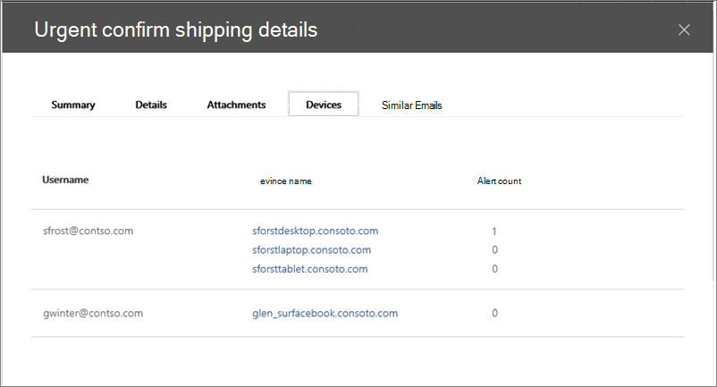
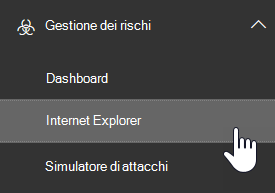
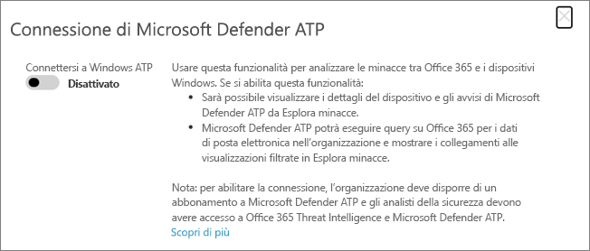

# Utilizzare Microsoft Defender per Office 365 insieme a Microsoft Defender per endpoint

[!INCLUDE [Microsoft 365 Defender rebranding](../includes/microsoft-defender-for-office.md)]

[Microsoft Defender per Office 365](office-365-atp.md) può essere configurato per l'utilizzo con [Microsoft Defender per endpoint](https://docs.microsoft.com/windows/security/threat-protection).

L'integrazione di Microsoft Defender per Office 365 con Microsoft Defender per endpoint può essere di aiuto per il monitoraggio del team delle operazioni di sicurezza e per intervenire rapidamente se i dispositivi degli utenti sono a rischio. Ad esempio, una volta abilitata l'integrazione, il team delle operazioni di sicurezza sarà in grado di visualizzare i dispositivi potenzialmente interessati da un messaggio di posta elettronica rilevato, nonché il numero di avvisi recenti generati per i dispositivi in Microsoft Defender per endpoint.

Nell'immagine seguente viene illustrato l'aspetto della scheda **dispositivi** con Microsoft Defender for endpoint Integration abilitato:

In questo esempio, è possibile vedere che i destinatari del messaggio di posta elettronica rilevato hanno quattro dispositivi e uno ha un avviso. Se si fa clic sul collegamento di un dispositivo, viene aperta la relativa pagina nel centro protezione Microsoft Defender ( <https://securitycenter.windows.com> ).

> [!TIP]
> Per **[ulteriori informazioni, vedere Microsoft Defender Security Center](https://docs.microsoft.com/windows/security/threat-protection/microsoft-defender-atp/use)** (denominato anche Microsoft Defender for endpoint Portal).

## Requisiti

- L'organizzazione deve disporre di Microsoft Defender per Office 365 (o Office 365 E5) e Microsoft Defender per endpoint.

- È necessario essere un amministratore globale o disporre di un ruolo di amministratore della sicurezza, ad esempio amministratore della sicurezza, assegnato nel [Centro sicurezza & Compliance](https://protection.office.com). (Vedere [Permissions in the Security & Compliance Center](permissions-in-the-security-and-compliance-center.md))

- È necessario disporre dell'accesso sia all' [esploratore (o ai rilevamenti in tempo reale)](threat-explorer.md) nel centro sicurezza & compliance e al Centro protezione Microsoft Defender.

## Per integrare Microsoft Defender per Office 365 con Microsoft Defender per endpoint

L'integrazione di Microsoft Defender per Office 365 con Microsoft Defender per endpoint è configurata utilizzando il Centro sicurezza & compliance e il Centro sicurezza Microsoft Defender.

1. Come amministratore globale o amministratore della sicurezza, accedere a <https://protection.office.com> e accedere. (Questo porta al centro sicurezza & conformità di Office 365).

2. Nel riquadro di spostamento, scegliere **gestione minacce** \> .

   

3. Nell'angolo in alto a destra dello schermo, scegliere **Defender per le impostazioni dell'endpoint (impostazioni MDE)**.

4. Nella finestra di dialogo Microsoft Defender per la connessione all'endpoint, abilitare la **connessione a Microsoft Defender per endpoint**.

   

5. Accedere a Microsoft Defender Security Center ( <https://securitycenter.windows.com> ).

6. Nella barra di spostamento, scegliere **Impostazioni**. Quindi, in **generale**, scegliere **funzionalità avanzate**.

7. Scorrere verso il basso fino a **Office 365 Threat Intelligence Connection** e quindi accendere la connessione.

   

## Articoli correlati

[Analisi delle minacce e funzionalità di risposta in Office 365](office-365-ti.md)

[Microsoft Defender per Office 365](office-365-atp.md)

[Microsoft Defender ATP](https://docs.microsoft.com/windows/security/threat-protection)
