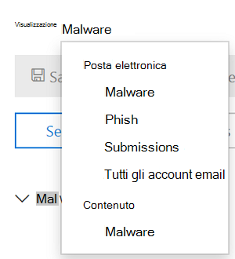

# Esaminare e correggere i messaggi di posta elettronica dannosi recapitati in Office 365Investigate and remediate malicious email that was delivered in Office 365

[Office 365 Advanced Threat Protection](office-365-atp.md) consente di analizzare le attività che inseriscono i rischi per l'organizzazione e di intervenire per proteggere l'organizzazione.[Office 365 Advanced Threat Protection](office-365-atp.md) enables you to investigate activities that put people in your organization at risk, and to take action to protect your organization. Ad esempio, se si fa parte del team di sicurezza dell'organizzazione, è possibile trovare e analizzare i messaggi di posta elettronica sospetti che sono stati recapitati.For example, if you are part of your organization's security team, you can find and investigate suspicious email messages that were delivered. A tale scopo, è possibile utilizzare [Esplora minacce (o rilevamenti in tempo reale)](threat-explorer.md).You can do this by using [Threat Explorer (or real-time detections)](threat-explorer.md).
  
## Prima di iniziare...Before you begin...

Verificare che vengano soddisfatti i seguenti requisiti:Make sure that the following requirements are met:
  
- L'organizzazione dispone di [Office 365 Advanced Threat Protection](office-365-atp.md) e le [licenze vengono assegnate agli utenti](../../admin/manage/assign-licenses-to-users.md).Your organization has [Office 365 Advanced Threat Protection](office-365-atp.md) and [licenses are assigned to users](../../admin/manage/assign-licenses-to-users.md).
    
- la [registrazione di controllo](../../compliance/turn-audit-log-search-on-or-off.md) è attivata per l'organizzazione.[audit logging](../../compliance/turn-audit-log-search-on-or-off.md) is turned on for your organization. 
    
- L'organizzazione dispone di criteri definiti per la protezione da posta indesiderata, anti-malware, anti-phishing e così via.Your organization has policies defined for anti-spam, anti-malware, anti-phishing, and so on. Vedere [protezione dalle minacce in Office 365](protect-against-threats.md).See [Protect against threats in Office 365](protect-against-threats.md).
    
- Si è un amministratore globale oppure è stato assegnato il ruolo di amministratore della sicurezza o di ricerca ed eliminazione nel centro sicurezza e &amp; conformità.You are a global administrator, or you have either the Security Administrator or the Search and Purge role assigned in the Security &amp; Compliance Center. Vedere [Permissions in the Security &amp; Compliance Center](permissions-in-the-security-and-compliance-center.md).See [Permissions in the Security &amp; Compliance Center](permissions-in-the-security-and-compliance-center.md). Per alcune azioni, è necessario disporre anche di un nuovo ruolo di anteprima assegnato.For some actions, you must also have a new Preview role assigned. 

#### Autorizzazioni per il ruolo di anteprimaPreview role permissions

Per eseguire determinate azioni, ad esempio la visualizzazione delle intestazioni dei messaggi o il download del contenuto del messaggio di posta elettronica, è necessario un nuovo ruolo denominato *Anteprima* aggiunto a un altro gruppo di ruoli appropriato.To perform certain actions, such as viewing message headers or downloading email message content, you must have a new role called *Preview* added to another appropriate role group. La tabella seguente consente di chiarire i ruoli e le autorizzazioni necessari.The following table clarifies required roles and permissions.

|AttivitàActivity  |Gruppo di ruoloRole group |Ruolo di anteprima necessario?Preview role needed?  |
|---------|---------|---------|
|Utilizzo di Esplora minacce (e rilevamenti in tempo reale) per l'analisi delle minacceUse Threat Explorer (and real-time detections) to analyze threats     |Amministratore globaleGlobal Administrator   Amministratore della sicurezzaSecurity Administrator   Ruolo con autorizzazioni di lettura per la sicurezzaSecurity Reader     | NoNo   |
|Utilizzare Esplora minacce (e rilevamenti in tempo reale) per visualizzare le intestazioni dei messaggi di posta elettronica così come l'anteprima e il download dei messaggi di posta elettronica in quarantenaUse Threat Explorer (and real-time detections) to view headers for email messages as well as preview and download quarantined email messages    |Amministratore globaleGlobal Administrator   Amministratore della sicurezzaSecurity Administrator  Ruolo con autorizzazioni di lettura per la sicurezzaSecurity Reader   |       NoNo  |
|Utilizzare Esplora minacce per visualizzare le intestazioni e scaricare i messaggi di posta elettronica recapitati alle cassette postaliUse Threat Explorer to view headers and download email messages delivered to mailboxes     |Amministratore globaleGlobal Administrator  Amministratore della sicurezzaSecurity Administrator   Ruolo con autorizzazioni di lettura per la sicurezzaSecurity Reader   AnteprimaPreview   |   SìYes      |

> [!NOTE]
> L' *Anteprima* è un ruolo e non un gruppo di ruoli. il ruolo di anteprima deve essere aggiunto a un gruppo di ruoli esistente per Office 365.*Preview* is a role and not a role group; the Preview role must be added to an existing role group for Office 365. Al ruolo di amministratore globale viene assegnato l'interfaccia di amministrazione di Microsoft 365 ( [https://admin.microsoft.com](https://admin.microsoft.com) ) e i ruoli amministratore sicurezza e lettore di sicurezza sono assegnati nel centro sicurezza & Compliance ( [https://protection.office.com](https://protection.office.com) ).The Global Administrator role is assigned the Microsoft 365 admin center ([https://admin.microsoft.com](https://admin.microsoft.com)), and the Security Administrator and Security Reader roles are assigned in the Security & Compliance Center ([https://protection.office.com](https://protection.office.com)). Per ulteriori informazioni sui ruoli e sulle autorizzazioni, vedere [Permissions in the Security & Compliance Center](permissions-in-the-security-and-compliance-center.md).To learn more about roles and permissions, see [Permissions in the Security & Compliance Center](permissions-in-the-security-and-compliance-center.md).

## Individuare ed eliminare messaggi di posta elettronica sospetti recapitatiFind and delete suspicious email that was delivered

Threat Explorer è un potente report che può servire a molteplici scopi, ad esempio la ricerca e l'eliminazione dei messaggi, l'identificazione dell'indirizzo IP di un mittente di posta elettronica dannoso o l'avvio di un incidente per ulteriori indagini.Threat Explorer is a powerful report that can serve multiple purposes, such as finding and deleting messages, identifying the IP address of a malicious email sender, or starting an incident for further investigation. La procedura seguente si concentra sull'utilizzo di Esplora risorse per individuare ed eliminare messaggi di posta elettronica dannosi dalle cassette postali del destinatario.The following procedure focuses on using Explorer to find and delete malicious email from recipient's mailboxes.

> [!NOTE]
> Le ricerche predefinite in Esplora risorse non includono attualmente gli elementi zapping.Default searches in Explorer don't currently include Zapped items.  Questo vale per tutte le visualizzazioni, ad esempio le visualizzazioni di malware o phishing.This applies to all views, for example malware or phish views. Per includere gli elementi zapped, è necessario aggiungere un'azione di recapito ' impostato su Includi ' rimosso da ZAP '.To include Zapped items you need to add a 'Delivery action' set to include 'Removed by ZAP'. Se si includono tutte le opzioni, verranno visualizzati tutti i risultati dell'azione di recapito, compresi gli elementi zapped.If you include all options, you'll see all delivery action results, including Zapped items.

1. **Passare a Esplora minacce**: accedere a [https://protection.office.com](https://protection.office.com) e accedere con l'account aziendale o dell'Istituto di istruzione per Office 365.**Navigate to Threat Explorer**: Go to [https://protection.office.com](https://protection.office.com) and sign in using your work or school account for Office 365. Questo porta al centro sicurezza e &amp; conformità.This takes you to the Security &amp; Compliance Center.

2. Nella barra di avvio veloce di spostamento a sinistra, scegliere **gestione minacce** \> **Explorer**.In the left navigation quick-launch, choose **Threat management** \> **Explorer**.

    

    <!-- You may notice the new **Special actions** column. This feature is aimed at telling admins the outcome of processing an email. The **Special actions** column can be accessed in the same place as **Delivery action** and **Delivery location**. Special actions might be updated at the end of Threat Explorer's email timeline, which is a new feature aimed at making the hunting experience better for admins.-->

3. **Visualizzazioni in Esplora minacce**: scegliere **tutti i messaggi di posta elettronica**dal menu **Visualizza** .**Views in Threat Explorer**: In the **View** menu, choose **All email**.

    

    La visualizzazione *malware* è attualmente l'impostazione predefinita e acquisisce i messaggi di posta elettronica in cui viene rilevata una minaccia di malware.The *Malware* view is currently the default, and captures emails where a malware threat is detected. La visualizzazione *phishing* funziona nello stesso modo, per phishing.The *Phish* view operates in the same way, for Phish.

    Tuttavia, *tutti* i messaggi di posta elettronica visualizzano ogni messaggio ricevuto dall'organizzazione, se le minacce sono state rilevate o meno.However, *All email* view lists every mail received by the organization, whether threats were detected or not. Come si può immaginare, si tratta di un sacco di dati, che è il motivo per cui questa visualizzazione Mostra un segnaposto che richiede l'applicazione di un filtro.As you can imagine, this is a lot of data, which is why this view shows a placeholder that asks a filter be applied. Questa visualizzazione è disponibile solo per i clienti ATP P2.(This view is only available for ATP P2 customers.)

    Visualizzazione *invii* Visualizza tutti i messaggi inviati dall'amministratore o dall'utente che sono stati segnalati a Microsoft.*Submissions* view shows up all mails submitted by admin or user that were reported to Microsoft.

4. **Ricerca e filtro in Esplora minacce**: i filtri vengono visualizzati nella parte superiore della pagina nella barra di ricerca per consentire agli amministratori di eseguire le proprie indagini.**Search and filter in Threat Explorer**: Filters appear at the top of the page in the search bar to help admins in their investigations. Si noti che è possibile applicare più filtri contemporaneamente e che più valori separati da virgola sono stati aggiunti a un filtro per limitare la ricerca.Notice that multiple filters can be applied at the same time, and multiple comma-separated values added to a filter to narrow down the search. Attenzione:Remember:
    - I filtri eseguono una corrispondenza esatta per la maggior parte delle condizioni del filtro.Filters do exact matching on most filter conditions.
    - Il filtro soggetto utilizza una query CONTAINs.Subject filter uses a CONTAINS query.
    - I filtri URL funzionano con o senza protocolli (es.URL filters work with or without protocols (ex. https).https).
    - Il dominio URL, il percorso URL e i filtri per il dominio e il percorso URL non richiedono il filtro di un protocollo.URL domain, URL path, and URL domain and path filters don't require a protocol to filter.
    - È necessario fare clic sull'icona di aggiornamento ogni volta che si modificano i valori del filtro per ottenere i risultati rilevanti.You must click the Refresh icon every time you change the filter values to get relevant results.

5. **Filtri avanzati**: con questi filtri è possibile creare query complesse e filtrare il set di dati.**Advanced filters**: With these filters, you can build complex queries and filter your data set. Se si fa clic su *filtri avanzati* , verrà aperto un riquadro a comparsa con opzioni.Clicking on *Advanced Filters* opens a flyout with options.

   Il filtro avanzato è una grande aggiunta alle funzionalità di ricerca.Advanced filtering is a great addition to search capabilities. **Non** è stato introdotto un filtro booleano nel dominio del *destinatario*, del *mittente* e del *mittente* per consentire agli amministratori di eseguire indagini escludendo i valori.A boolean **NOT** filter has been introduced on *Recipient*, *Sender* and *Sender domain* to allow admins to investigate by excluding values. Questa opzione viene visualizzata sotto il parametro Selection *contiene None of*.This option appears under selection parameter *Contains none of*. **Non** consente agli amministratori di escludere le cassette postali di avviso, le cassette postali di risposta predefinite dalle proprie indagini ed è utile per i casi in cui gli amministratori cercano un oggetto specifico (Subject = "attention") in cui il destinatario può essere impostato su *none de defaultMail \@ contoso.com*.**NOT** will let admins exclude alert mailboxes, default reply mailboxes from their investigations, and is useful for cases where admins search for a specific subject (subject="Attention") where the Recipient can be set to *none of defaultMail\@contoso.com*. Si tratta di una ricerca di valore esatta.This is an exact value search.

   

   Il *filtraggio per ore* consentirà di eseguire il drill-down rapido del team di sicurezza dell'organizzazione.*Filtering by hours* will help your organization's security team drill down quickly. La durata di tempo consentita più breve è di 30 minuti.The shortest allowed time duration is 30 minutes. Se è possibile restringere l'azione sospetta tramite la tempistica (ad esempio, è successo 3 ore fa), questo limiterà il contesto e consentirà di individuare il problema.If you can narrow the suspicious action by time-frame (e.g. it happened 3 hours ago), this will limit the context and help pinpoint the problem.

  

6. **Campi in Esplora minacce**: Esplora minacce espone molte più informazioni di posta elettronica correlate alla sicurezza, ad esempio l' *azione di recapito*, la *posizione di recapito*, l' *azione speciale*, la *direzionalità*, le *sostituzioni*e la *minaccia URL*.**Fields in threat explorer**: Threat Explorer exposes a lot more security-related mail information such as *Delivery action*, *Delivery location*, *Special action*, *Directionality*, *Overrides*, and *URL threat*. Consente inoltre al team di sicurezza dell'organizzazione di analizzare con maggiore certezza.It also allows your organization's security team to investigate with a higher certainty. 

    *Azione di recapito* è l'azione intrapresa su un messaggio di posta elettronica a causa di criteri o rilevamenti esistenti.*Delivery action* is the action taken on an email due to existing policies or detections. Ecco le possibili azioni che un messaggio di posta elettronica può eseguire:Here are the possible actions an email can take:
    - **Recapitato** : la posta elettronica è stata recapitata alla posta in arrivo o alla cartella di un utente e l'utente può accedervi direttamente.**Delivered** – email was delivered to inbox or folder of a user and the user can directly access it.
    - Posta **indesiderata (** recapitata a junk) – la e-mail è stata inviata alla cartella posta indesiderata o alla cartella eliminata dell'utente e l'utente ha accesso ai messaggi di posta elettronica nella cartella posta indesiderata o eliminato.**Junked** (Delivered to junk)– email was sent to either user's junk folder or deleted folder, and the user has access to email messages in their Junk or Deleted folder.
    - **Bloccato** : tutti i messaggi di posta elettronica in quarantena, che hanno avuto esito negativo o sono stati eliminati.**Blocked** – any email messages that are quarantined, that failed, or were dropped. (Questo è completamente inaccessibile dall'utente).(This is completely inaccessible by the user.)
    - **Sostituito** : tutti i messaggi di posta elettronica in cui gli allegati dannosi sono stati sostituiti dai file. txt che lo stato**Replaced** – any email where malicious attachments are replaced by .txt files that state the attachment was malicious

    **Percorso di recapito**: il filtro percorso di recapito è disponibile per aiutare gli amministratori a capire dove si è conclusa la posta dannosa sospetta e quali azioni sono state intraprese su di esso.**Delivery location**: The Delivery location filter is available in order to help admins understand where suspected malicious mail ended-up and what actions were taken on it. I dati risultanti possono essere esportati in un foglio di calcolo.The resulting data can be exported to spreadsheet. I possibili percorsi di recapito sono:Possible delivery locations are:
    - **Posta in arrivo o cartella** : l'indirizzo di posta elettronica si trova nella cartella posta in arrivo o in una specifica, in base alle regole di posta elettronica.**Inbox or folder** – The email is in the Inbox or a specific folder, according to your email rules.
    - **On-Prem o External** -la cassetta postale non esiste nel cloud ma è in locale.**On-prem or external** – The mailbox doesn't exist in the Cloud but is on-premises.
    - **Cartella posta indesiderata** : la posta elettronica si trova nella cartella della cassetta postale di un utente.**Junk folder** – The email is in a user's Junk mail folder.
    - **Cartella Posta eliminata** – l'e-mail si trova nella cartella degli elementi eliminati di un utente.**Deleted items folder** – The email is in a user's Deleted items folder.
    - **Quarantine** : la posta elettronica in quarantena e non nella cassetta postale di un utente.**Quarantine** – The email in quarantine, and not in a user's mailbox.
    - **Failed** : la posta elettronica non è riuscita a raggiungere la cassetta postale.**Failed** – The email failed to reach the mailbox.
    - **Eliminato** : il messaggio di posta elettronica è stato perso da qualche parte nel flusso di posta.**Dropped** – The email was lost somewhere in the mail flow.

    **Direzionalità**: questa opzione consente al team di operazioni di sicurezza di filtrare in base alla ' direzione ' da cui proviene un messaggio o che è in corso.**Directionality**: This option allows your security operations team to filter by the 'direction' a mail comes from, or is going. I valori di direzionalità sono in *ingresso* *, in uscita e* *intra-org* (corrispondente alla posta proveniente dall'esterno dell'organizzazione, che viene inviata dall'organizzazione o che viene inviata internamente all'org, rispettivamente).Directionality values are *Inbound*, *Outbound*, and *Intra-org* (corresponding to mail coming into your org from outside, being sent out of your org, or being sent internally to your org, respectively). Queste informazioni consentono ai team di operazioni di sicurezza di spoofing e rappresentazione a campione, in quanto mancata corrispondenza tra il valore di direzionalità (es.This information can help security operations teams spot spoofing and impersonation, because a mismatch between the Directionality value (ex. In *ingresso*), e il dominio del mittente (che *sembra* essere un dominio interno) sarà evidente!*Inbound*), and the domain of the sender (which *appears* to be an internal domain) will be evident! Il valore di direzionalità è separato e può essere diverso da, la traccia dei messaggi.The Directionality value is separate, and can differ from, the Message Trace. I risultati possono essere esportati in foglio di calcolo.Results can be exported to spreadsheet.

    **Sostituzioni**: questo filtro prende le informazioni visualizzate nella scheda Dettagli della posta e la utilizza per esporre i criteri dell'organizzazione, o degli utenti, per consentire e bloccare i messaggi di posta *elettronica.***Overrides**: This filter takes information that appears on the mail's details tab and uses it to expose where organizational, or user policies, for allowing and blocking mails have been *overridden*. La cosa più importante di questo filtro è che aiuta il team di sicurezza dell'organizzazione a vedere quanti messaggi di posta elettronica sospetti sono stati recapitati a causa della configurazione.The most important thing about this filter is that it helps your organization's security team see how many suspicious emails were delivered due to configuration. In questo modo è possibile modificare le possibilità e i blocchi in base alle esigenze.This gives them an opportunity to modify allows and blocks as needed. Questo set di risultati di questo filtro può essere esportato in un foglio di calcolo.This result set of this filter can be exported to spreadsheet.

|Sostituzioni di Esplora minacceThreat Explorer Overrides  | Cosa significanoWhat they mean  |
|---------|---------|
|Consentito dai criteri orgAllowed by Org Policy     |   La posta elettronica è stata consentita nella cassetta postale come indicato dal criterio dell'organizzazione.Mail was allowed into the mailbox as directed by the organization policy.       |
|Bloccati dai criteri orgBlocked by Org policy      |  La posta elettronica è stata bloccata dal recapito alla cassetta postale, come indicato dal criterio dell'organizzazione.Mail was blocked from delivery to the mailbox as directed by the organization policy.    |
|Estensione di file bloccata da criteri orgFile extension blocked by Org Policy     | Il file è stato bloccato dal recapito alla cassetta postale, come indicato dal criterio dell'organizzazione.File was blocked from delivery to the mailbox as directed by the organization policy.        |
|Consentito dai criteri utenteAllowed by User Policy     | La posta elettronica è stata consentita nella cassetta postale come indicato dal criterio utente.Mail was allowed into the mailbox as directed by the user policy.        |
|Bloccati dai criteri utenteBlocked by User Policy     | La posta elettronica è stata bloccata dal recapito alla cassetta postale, come indicato dal criterio utente.Mail was blocked from delivery to the mailbox as directed by the user policy.        |

**Threat URL**: il campo di rischio URL è stato incluso nella scheda *Dettagli* di un messaggio di posta elettronica per indicare la minaccia presentata da un URL.**URL threat**: The URL threat field has been included on the *details* tab of an email to indicate the threat presented by a URL. Le minacce presentate da un URL possono includere *malware*, *phishing*o *posta indesiderata*e un URL *senza* minacce direbbe *nessuno* nella sezione minacce.Threats presented by a URL can include *Malware*, *Phish*, or *Spam*, and a URL with *no threat* will say *None* in the threats section.

7. **Visualizzazione sequenza temporale della posta elettronica**: il team delle operazioni di sicurezza potrebbe essere necessario immergersi nei dettagli della posta elettronica per approfondire ulteriormente.**Email timeline view**: Your security operations team might need to deep-dive into email details to investigate further. La sequenza temporale della posta elettronica consente agli amministratori di visualizzare le azioni eseguite su un messaggio di posta elettronica dal recapito al post-recapito.The email timeline allows admins to view actions taken on an email from delivery to post-delivery. Per visualizzare una cronologia della posta elettronica, fare clic sull'oggetto di un messaggio di posta elettronica, quindi fare clic su sequenza temporale della posta elettronica.To view an email timeline, click on the subject of an email message, and then click Email timeline. (Viene visualizzato tra le altre intestazioni del pannello come riepilogo o dettagli). Questi risultati possono essere esportati in un foglio di calcolo.(It appears among other headings on the panel like Summary or Details.) These results can be exported to spreadsheet.

    La sequenza temporale della posta elettronica verrà aperta a una tabella che Visualizza tutti gli eventi di recapito e post-recapito per la posta elettronica.Email timeline will open to a table that shows all delivery and post-delivery events for the email. Se non ci sono altre azioni sul messaggio di posta elettronica, dovrebbe essere visualizzato un singolo evento per il recapito originale che indica un risultato, ad esempio *bloccato*, con un verdetto come *phishing*.If there are no further actions on the email, you should see a single event for the original delivery that states a result, such as *Blocked*, with a verdict like *Phish*. Gli amministratori possono esportare l'intera sequenza temporale della posta elettronica, inclusi tutti i dettagli sulla scheda e la posta elettronica (ad esempio, oggetto, mittente, destinatario, rete e ID messaggio).Admins can export the entire email timeline, including all details on the tab and email (such as, Subject, Sender, Recipient, Network, and Message ID). La sequenza temporale della posta elettronica riduce la randomizzazione perché è necessario meno tempo per controllare posizioni diverse per cercare di comprendere gli eventi accaduti dopo l'arrivo del messaggio di posta elettronica.The email timeline cuts down on randomization because there is less time spent checking different locations to try to understand events that happened since the email arrived. Quando più eventi si verificano in un messaggio di posta elettronica o vicino allo stesso tempo, tali eventi vengono visualizzati in una visualizzazione sequenza temporale.When multiple events happen at, or close to, the same time on an email, those events show up in a timeline view.

8. **Anteprima/download**: Threat Explorer fornisce al team di operazioni di sicurezza i dettagli necessari per esaminare la posta elettronica sospetta.**Preview / download**: Threat Explorer gives your security operations team the details they need to investigate suspicious email. Il team delle operazioni di sicurezza può:Your security operations team can either:

    - [Controllare l'azione e il percorso di recapito](#check-the-delivery-action-and-location).[Check the delivery action and location](#check-the-delivery-action-and-location).

    - [Visualizzare la sequenza temporale del messaggio di posta elettronica](#view-the-timeline-of-your-email).[View the timeline of your email](#view-the-timeline-of-your-email).

    ##### Controllare l'azione e il percorso di recapitoCheck the delivery action and location

    In [Esplora minacce (e rilevamenti in tempo reale)](threat-explorer.md), ora sono presenti le colonne dell' **azione** di recapito e del **percorso** di recapito anziché la precedente colonna **stato di recapito** .In [Threat Explorer (and real-time detections)](threat-explorer.md), you now have **Delivery Action** and **Delivery Location** columns instead of the former **Delivery Status** column. Questo comporta un'immagine più completa della posizione in cui i messaggi di posta elettronica atterrano.This results in a more complete picture of where your email messages land. Parte dell'obiettivo di questa modifica consiste nell'agevolare le indagini per i team delle operazioni di sicurezza, ma il risultato finale è la conoscenza del percorso dei messaggi di posta elettronica problematici.Part of the goal of this change is to make investigations easier for security operations teams, but the net result is knowing the location of problem email messages at a glance.

    Lo stato di recapito è ora suddiviso in due colonne:Delivery Status is now broken out into two columns:

    - **Azione di recapito** -qual è lo stato di questo messaggio di posta elettronica?**Delivery action** - What is the status of this email?

    - **Percorso di recapito** -dove è stato instradato il messaggio di posta elettronica come risultato?**Delivery location** - Where was this email routed as a result?

    Azione di recapito è l'azione intrapresa su un messaggio di posta elettronica a causa di criteri o rilevamenti esistenti.Delivery action is the action taken on an email due to existing policies or detections. Ecco le possibili azioni che un messaggio di posta elettronica può eseguire:Here are the possible actions an email can take:

    - **Recapitato** : la posta elettronica è stata recapitata alla posta in arrivo o alla cartella di un utente e l'utente può accedervi direttamente.**Delivered** – email was delivered to inbox or folder of a user and the user can directly access it.

    - **Junked** – la posta elettronica è stata inviata alla cartella posta indesiderata o alla cartella eliminata dell'utente e l'utente ha accesso ai messaggi di posta elettronica nella cartella posta indesiderata o eliminata.**Junked** – email was sent to either user's junk folder or deleted folder, and the user has access to email messages in their Junk or Deleted folder.

    - **Bloccato** : tutti i messaggi di posta elettronica in quarantena, che hanno avuto esito negativo o sono stati eliminati.**Blocked** – any email messages that are quarantined, that failed, or were dropped. (Questo è completamente inaccessibile dall'utente).(This is completely inaccessible by the user.)

    - **Sostituito** – qualsiasi messaggio di posta elettronica in cui gli allegati dannosi sono stati sostituiti dai file. txt che affermano che l'allegato è dannoso**Replaced** – any email where malicious attachments are replaced by .txt files that state the attachment was malicious.
 
    Il percorso di recapito consente di visualizzare i risultati dei criteri e i rilevamenti eseguiti dopo il recapito.Delivery location shows the results of policies and detections that run post-delivery. È collegato a un'azione di recapito.It's linked to a Delivery Action. Questo campo è stato aggiunto per fornire informazioni dettagliate sull'azione intrapresa quando viene trovata una posta elettronica problematica.This field was added to give insight into the action taken when a problem mail is found. Di seguito sono riportati i possibili valori del percorso di recapito:Here are the possible values of delivery location:

    - **Posta in arrivo o cartella** – il messaggio di posta elettronica si trova nella cartella posta in arrivo o in una directory (secondo le regole di posta elettronica).**Inbox or folder** – The email is in the inbox or a folder (according to your email rules).

    - **On-Prem o External** -la cassetta postale non esiste sul cloud ma è in locale.**On-prem or external** – The mailbox doesn't exist on cloud but is on-premises.

    - **Cartella posta indesiderata** : la posta elettronica si trova nella cartella posta indesiderata di un utente.**Junk folder** – The email is in a user's Junk folder.

    - **Cartella Posta eliminata** – l'e-mail si trova nella cartella degli elementi eliminati di un utente.**Deleted items folder** – The email is in a user's Deleted items folder.

    - **Quarantine** : la posta elettronica in quarantena e non nella cassetta postale di un utente.**Quarantine** – The email in quarantine, and not in a user's mailbox.

    - **Failed** : la posta elettronica non è riuscita a raggiungere la cassetta postale.**Failed** – The email failed to reach the mailbox.

    - **Eliminato** : il messaggio di posta elettronica viene perso da qualche parte nel flusso di posta.**Dropped** – The email gets lost somewhere in the mail flow.

     ##### Visualizzare la sequenza temporale del messaggio di posta elettronicaView the timeline of your email
  
     La **sequenza temporale della posta elettronica** è un campo in Esplora minacce che facilita la ricerca per il team delle operazioni di sicurezza.**Email Timeline** is a field in Threat Explorer that makes hunting easier for your security operations team. Quando più eventi si verificano alla stessa ora o in prossimità di un messaggio di posta elettronica, tali eventi vengono visualizzati in una visualizzazione sequenza temporale.When multiple events happen at or close to the same time on an email, those events show up in a timeline view. Alcuni eventi che si verificano dopo il recapito al messaggio di posta elettronica vengono acquisiti nella colonna **azioni speciali** .Some events that happen post-delivery to email are captured in the **Special actions** column. La combinazione di informazioni dalla sequenza temporale di un messaggio di posta elettronica con le azioni speciali eseguite dopo il recapito consente agli amministratori di esaminare i criteri e la gestione delle minacce (ad esempio la posizione in cui è stata instradata la posta elettronica e, in alcuni casi, la valutazione finale).Combining information from the timeline of an email message with any special actions that were taken post-delivery gives admins insight into policies and threat handling (such as where the mail was routed, and, in some cases, what the final assessment was).

<!-- Reference material

1. **Navigate to Threat Explorer**: Go to [https://protection.office.com](https://protection.office.com) and sign in using your work or school account for Office 365. This takes you to the Security &amp; Compliance Center. 

2. In the left navigation quick-launch, choose **Threat management** \> **Explorer**.

3. Click on the subject of an email message, and then click **Email timeline**. (It appears among other headings on the panel like **Summary** or **Details**.)

    Once you've opened the email timeline, you should see a table that tells you the post-delivery events for that mail. In the case of no further events for the email, you should see a single event for the original delivery that states a result like **Blocked** with a verdict like **Phish**. The tab also has the option to export the entire email timeline, and this exports all the details on the tab and details on the email (things like Subject, Sender, Recipient, Network, and Message ID).

    The email timeline cuts down on randomization because there is less time spent checking different locations to try to understand events that happened since the email arrived. When multiple events happen at, or close to, the same time on an email, those events show up in a timeline view. 
    
    Some events that happen post-delivery to your mail are captured in the **Special actions** column. Combining the information from the email timeline along with special actions taken on email post-delivery gives admins insight into how their policies work, where the email was finally routed, and, in some cases, what the final assessment was. 

4. In the **View** menu, choose **All email**.

    
  
    Notice the labels that appear in the report, such as **Delivered**, **Unknown**, or **Delivered to junk**.

    
    
    (Depending on the actions that were taken on email messages for your organization, you might see other labels, such as **Blocked** or **Replaced**.)
    
5. In the report, choose **Delivered** to view only email messages that ended up in users' inboxes.

    
  
6. Below the chart, review the **Email** list below the chart.

    
  
7. In the list, choose an item to view more details about that email message. For example, you can click the subject line to view information about the sender, recipients, attachments, and other similar email messages.

    
  
8. After viewing information about email messages, select one or more items in the list to activate **+ Actions**.
    
9. Use the **+ Actions** list to apply an action, such as **Move to deleted** items. This deletes the selected messages from the recipients' mailboxes.

    

## Dealing with suspicious email messages

Malicious attackers might be sending mail to people in your organization in an attempt to phish their credentials and gain access to your corporate secrets. To help prevent this, you use the threat protection services in Office 365, including [Exchange Online Protection](exchange-online-protection-overview.md) and [Advanced Threat Protection](office-365-atp.md). However, it occasionally happens that an attacker sends email that contains a link (URL) that only later points to malicious content (such as malware). Or, you might realize too late that someone in your organization has been compromised, and while they were compromised, an attacker used their account to send email to other people in your organization. As part of dealing with either of these scenarios, you can remove suspicious email messages from user inboxes. To do that, you can use [Threat Explorer](threat-explorer.md).

## Finding re-routed email messages after actions are taken

Threat Explorer provides your security operations team with the details they need to investigate suspicious email. Your security operations team can:

- [View the email headers and download the email body](#view-the-email-headers-and-download-the-email-body) 

- [Check the delivery action and location](#check-the-delivery-action-and-location)

- [View the timeline of your email](#view-the-timeline-of-your-email)

### View the email headers and download the email body

The ability to preview email headers and download the body of an email body are powerful capabilities in Threat Explorer. Appropriate [permissions](permissions-in-the-security-and-compliance-center.md) must be assigned. See [Preview role permissions](#preview-role-permissions).

To access your message header and email download options, follow these steps: 

1. Go to [https://protection.office.com](https://protection.office.com) and sign in using your work or school account for Office 365. This takes you to the Security &amp; Compliance Center. 
    
2. In the left navigation, choose **Threat management** \> **Explorer**.

3. Click on a subject in the Threat Explorer table. 

    This opens the flyout, where both header preview and email download links are positioned.

    

> [!IMPORTANT]
> This capability doesn't show up for email messages that were never found in a user's mailbox, which can happen if an email was dropped or its delivery failed. In cases where email messages were deleted from users' mailboxes, admins see a "Mail not found" error message.
-->

## Argomenti correlatiRelated topics

[Office 365 Advanced Threat ProtectionOffice 365 Advanced Threat Protection](office-365-ti.md)
  
[Protezione dalle minacce in Office 365Protect against threats in Office 365](protect-against-threats.md)
  
[Visualizzare i report per Office 365 Advanced Threat ProtectionView reports for Office 365 Advanced Threat Protection](view-reports-for-atp.md)
