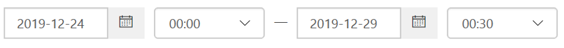

# Analizzare la posta elettronica dannosa recapitata in Office 365

[!INCLUDE [Microsoft 365 Defender rebranding](../includes/microsoft-defender-for-office.md)]

**Si applica a**

- [Microsoft Defender per Office 365 piano 1 e piano 2](office-365-atp.md)
- [Microsoft 365 Defender](../mtp/microsoft-threat-protection.md)

[Microsoft Defender per Office 365](office-365-atp.md) consente di analizzare le attività che mettono a rischio le persone nell'organizzazione e di intervenire per proteggere l'organizzazione. Ad esempio, se si fa parte del team di sicurezza dell'organizzazione, è possibile individuare e analizzare i messaggi di posta elettronica sospetti recapitati. A tale scopo, puoi usare [Esplora minacce (o](threat-explorer.md)rilevamenti in tempo reale).

> [!NOTE]
> Passare all'articolo sulla correzione [qui.](remediate-malicious-email-delivered-office-365.md)

## Prima di iniziare

Verificare che vengano soddisfatti i seguenti requisiti:

- L'organizzazione dispone [di Microsoft Defender per Office 365](office-365-atp.md) e le licenze vengono assegnate agli [utenti.](../../admin/manage/assign-licenses-to-users.md)

- [la registrazione di](../../compliance/turn-audit-log-search-on-or-off.md) controllo è attivata per l'organizzazione.

- L'organizzazione dispone di criteri definiti per la protezione da posta indesiderata, antimalware, anti-phishing e così via. Vedere [Proteggere dalle minacce in Office 365.](protect-against-threats.md)

- Si è un amministratore globale o si dispone del ruolo Amministratore della sicurezza o Ricerca ed eliminazione nel Centro sicurezza & conformità. Vedere [Autorizzazioni nel Centro sicurezza & conformità.](permissions-in-the-security-and-compliance-center.md) Per alcune azioni, è inoltre necessario disporre di un nuovo ruolo Anteprima assegnato.

### Autorizzazioni per il ruolo anteprima

Per eseguire determinate azioni, ad esempio la visualizzazione delle intestazioni dei messaggi  o il download del contenuto dei messaggi di posta elettronica, è necessario disporre di un nuovo ruolo denominato Anteprima aggiunto a un altro gruppo di ruoli appropriato. Nella tabella seguente vengono chiariti i ruoli e le autorizzazioni necessari.

****

|Attività|Gruppo di ruolo|Ruolo di anteprima necessario?|
|---|---|---|
|Usare Esplora minacce (e rilevamenti in tempo reale) per analizzare le minacce |Amministratore globale 
 Amministratore della sicurezza 
 Ruolo con autorizzazioni di lettura per la sicurezza|No|
|Usare Esplora minacce (e rilevamenti in tempo reale) per visualizzare le intestazioni dei messaggi di posta elettronica, nonché visualizzare in anteprima e scaricare i messaggi di posta elettronica in quarantena|Amministratore globale 
 Amministratore della sicurezza 
 Ruolo con autorizzazioni di lettura per la sicurezza|No|
|Usare Esplora minacce per visualizzare le intestazioni, visualizzare in anteprima la posta elettronica (solo nella pagina dell'entità di posta elettronica) e scaricare i messaggi di posta elettronica recapitati alle cassette postali|Amministratore globale 
 Amministratore della sicurezza 
 Ruolo con autorizzazioni di lettura per la sicurezza 
 Anteprima|Sì|
|

> [!NOTE]
> *L'anteprima* è un ruolo e non un gruppo di ruoli; Il ruolo Anteprima deve essere aggiunto a un gruppo di ruoli esistente per Office 365 (all'indirizzo [https://protection.office.com](https://protection.office.com) ). Passare a **Autorizzazioni** e quindi modificare un gruppo di ruoli esistente o aggiungere un nuovo gruppo di ruoli con il ruolo **Anteprima** assegnato.
> Al ruolo Amministratore globale viene assegnata l'interfaccia di amministrazione di Microsoft 365 ( ) e i ruoli Amministratore della sicurezza e Lettore sicurezza vengono assegnati nel Centro <https://admin.microsoft.com> sicurezza & conformità ( <https://protection.office.com> ). Per ulteriori informazioni sui ruoli e sulle autorizzazioni, vedere [Autorizzazioni nel Centro sicurezza & conformità.](permissions-in-the-security-and-compliance-center.md)

Comprendiamo che l'anteprima e il download della posta elettronica sono attività sensibili, pertanto il controllo è abilitato per queste attività. Una volta che un amministratore esegue queste attività nei messaggi di posta elettronica, i log di controllo vengono generati per la stessa operazione e possono essere visibili nel Centro sicurezza & e conformità di Office 365 ( [https://protection.office.com](https://protection.office.com) ). Passare alla **ricerca nel** log di  >  **controllo di** ricerca e filtrare in base al nome dell'amministratore nella sezione Ricerca. I risultati filtrati mostreranno l'attività **AdminMailAccess.** Selezionare una riga per visualizzare i dettagli nella sezione **Ulteriori informazioni** sulla posta elettronica in anteprima o scaricata.

## Trovare messaggi di posta elettronica sospetti recapitati

Esplora minacce è un potente report che può servire a più scopi, come trovare ed eliminare messaggi, identificare l'indirizzo IP di un mittente di posta elettronica dannoso o avviare un evento imprevisto per ulteriori indagini. La procedura seguente è incentrata sull'utilizzo di Esplora risorse per trovare ed eliminare messaggi di posta elettronica dannosi dalle cassette postali del destinatario.

> [!NOTE]
> Le ricerche predefinite in Esplora risorse non includono attualmente gli elementi zapped.  Questo vale per tutte le visualizzazioni, ad esempio malware o phish views. Per includere gli elementi zapped, è necessario aggiungere un'azione **di** recapito impostata per includere **Rimosso da ZAP.** Se si includono tutte le opzioni, verranno visualizzati tutti i risultati dell'azione di recapito, inclusi gli elementi zapped.

1. **Passare a Esplora minacce:** accedere con l'account aziendale o dell'istituto di <https://protection.office.com> istruzione per Office 365. Questo consente di accedere al Centro sicurezza & conformità.

2. In the left navigation quick-launch, choose **Threat management** \> **Explorer.**

    

    È possibile notare la nuova **colonna Azioni** speciali. Questa funzionalità ha lo scopo di dire agli amministratori il risultato dell'elaborazione di un messaggio di posta elettronica. È **possibile accedere alla** colonna Azioni speciali nella stessa posizione dell'azione di **recapito** e della posizione **di recapito.** Le azioni speciali potrebbero essere aggiornate alla fine della sequenza temporale della posta elettronica di Esplora minacce, una nuova funzionalità volta a migliorare l'esperienza di ricerca per gli amministratori.

3. **Visualizzazioni in Esplora minacce:** scegliere Tutti i messaggi **di** posta elettronica dal menu **Visualizza.**

    

    La *visualizzazione Malware* è attualmente l'impostazione predefinita e acquisisce i messaggi di posta elettronica in cui viene rilevata una minaccia malware. La *vista di phish* funziona allo stesso modo, per Phish.

    Tuttavia, *nella visualizzazione Tutti i messaggi* di posta elettronica sono elencati tutti i messaggi ricevuti dall'organizzazione, indipendentemente dal fatto che siano state rilevate o meno minacce. Come puoi immaginare, si tratta di una grande quantità di dati, motivo per cui questa visualizzazione mostra un segnaposto che richiede l'applicazione di un filtro. Questa visualizzazione è disponibile solo per i clienti di Defender per Office 365 P2.

    *La visualizzazione* Invii mostra tutti i messaggi inviati dall'amministratore o dall'utente segnalati a Microsoft.

4. **Ricerca e filtro in Esplora** minacce: i filtri vengono visualizzati nella parte superiore della pagina nella barra di ricerca per aiutare gli amministratori nelle indagini. Si noti che è possibile applicare più filtri contemporaneamente e più valori delimitati da virgole aggiunti a un filtro per restringere la ricerca. Attenzione:

    - I filtri corrispondono esattamente alla maggior parte delle condizioni di filtro.
    - Il filtro dell'oggetto utilizza una query CONTAINS.
    - I filtri URL funzionano con o senza protocolli (ad esempio https).
    - I filtri dominio URL, percorso URL e dominio URL e percorso non richiedono un protocollo per il filtro.
    - È necessario fare clic sull'icona Aggiorna ogni volta che si modificano i valori del filtro per ottenere risultati pertinenti.

5. **Filtri avanzati:** con questi filtri è possibile creare query complesse e filtrare il set di dati. Facendo clic *su Filtri avanzati* si apre un riquadro a comparsa con opzioni.

   Il filtro avanzato è un'ottima aggiunta alle funzionalità di ricerca. Nel dominio **destinatario,** mittente  e  mittente è stato introdotto un filtro NOT booleano per consentire agli amministratori di analizzare escludendo i valori.  Questa opzione viene visualizzata sotto il parametro *di selezione Contiene nessuno di*. **NOT** consente agli amministratori di escludere le cassette postali di avviso, le cassette postali di risposta predefinite dalle indagini ed è utile per i casi in cui gli amministratori ricercano un oggetto specifico (subject="Attention") in cui il destinatario può essere impostato su nessuno dei valori *di defaultMail \@ contoso.com*. Si tratta di una ricerca con un valore esatto.

   

   *L'applicazione di filtri* in base alle ore consente al team di sicurezza dell'organizzazione di eseguire rapidamente il drill-down. La durata minima consentita è di 30 minuti. Se è possibile restringere l'azione sospetta in base all'intervallo di tempo (ad esempio, si è verificato 3 ore prima), questo limiterà il contesto e aiuterà a individuare il problema.

   

6. **Campi in Esplora** minacce: Esplora minacce espone molte più informazioni relative alla sicurezza della posta, ad esempio l'azione di *recapito,* il percorso di *recapito,* l'azione *speciale,* la direzionalità, le sostituzioni e la minaccia *url.* Consente inoltre al team di sicurezza dell'organizzazione di indagare con maggiore certezza.

    *L'azione* di recapito è l'azione eseguita su un messaggio di posta elettronica a causa di criteri o rilevamenti esistenti. Ecco le possibili azioni che un messaggio di posta elettronica può eseguire:

    - **Recapitato:** la posta elettronica è stata recapitata nella posta in arrivo o nella cartella di un utente e l'utente può accedervi direttamente.
    - **Posta indesiderata** (recapitata alla posta indesiderata): la posta elettronica è stata inviata alla cartella Posta indesiderata o eliminata dell'utente e l'utente ha accesso ai messaggi di posta elettronica nella cartella Posta indesiderata o Eliminata.
    - **Bloccato:** tutti i messaggi di posta elettronica messi in quarantena, non riusciti o eliminati. Questa operazione è completamente inaccessibile dall'utente.
    - **Sostituito:** qualsiasi messaggio di posta elettronica in cui gli allegati dannosi vengono sostituiti da file txt che specificano che l'allegato era dannoso

    **Posizione di recapito**: il filtro percorso di recapito è disponibile per consentire agli amministratori di capire dove si è conclusa la posta dannosa sospetta e quali azioni sono state eseguite su di esso. I dati risultanti possono essere esportati in un foglio di calcolo. I percorsi di recapito possibili sono:

    - **Posta in arrivo o cartella:** il messaggio di posta elettronica si trova nella cartella Posta in arrivo o in una cartella specifica, in base alle regole di posta elettronica.
    - **Locale o esterno:** la cassetta postale non esiste nel cloud ma è locale.
    - **Cartella Posta indesiderata:** la posta elettronica si trova nella cartella Posta indesiderata di un utente.
    - **Cartella Posta eliminata:** il messaggio di posta elettronica si trova nella cartella Posta eliminata di un utente.
    - **Quarantena:** la posta elettronica in quarantena e non nella cassetta postale di un utente.
    - **Failed:** il messaggio di posta elettronica non è riuscito a raggiungere la cassetta postale.
    - **Eliminato:** il messaggio di posta elettronica è stato perso da qualche parte nel flusso di posta.

    **Direzionalità:** questa opzione consente al team delle operazioni di sicurezza di filtrare in base alla "direzione" da cui proviene o sta per partire un messaggio di posta elettronica. I valori di direzionalità sono *Inbound,* *Outbound* e *Intra-org* (corrispondenti alla posta proveniente dall'esterno dell'organizzazione, inviata all'esterno dell'organizzazione o inviata internamente all'organizzazione, rispettivamente). Queste informazioni possono aiutare i team delle operazioni di sicurezza a individuare lo spoofing e la rappresentazione, perché una mancata corrispondenza tra il valore Directionality (ad esempio. *Inbound*) e il dominio del mittente *(che* sembra essere un dominio interno) sarà evidente! Il valore directionality è separato e può differire dalla traccia dei messaggi. I risultati possono essere esportati in un foglio di calcolo.

    **Sostituzioni:** questo filtro accetta le informazioni visualizzate nella scheda dei dettagli della posta elettronica e le usa per esporre dove sono stati ignorati i criteri dell'organizzazione o degli utenti per consentire e bloccare i messaggi di *posta* elettronica. La cosa più importante di questo filtro è che consente al team di sicurezza dell'organizzazione di vedere quanti messaggi di posta elettronica sospetti sono stati recapitati a causa della configurazione. Ciò offre loro la possibilità di modificare gli elementi di autorizzazioni e blocchi in base alle esigenze. Questo set di risultati di questo filtro può essere esportato in un foglio di calcolo.

    ****

    |Sostituzioni di Esplora minacce|Cosa significano|
    |---|---|
    |Consentito dai criteri dell'organizzazione|La posta è stata consentita nella cassetta postale come indicato dal criterio dell'organizzazione.|
    |Bloccato dai criteri dell'organizzazione|Il recapito della posta alla cassetta postale è stato bloccato come indicato dai criteri dell'organizzazione.|
    |Estensione di file bloccata dai criteri dell'organizzazione|Il recapito del file alla cassetta postale è stato bloccato come indicato dai criteri dell'organizzazione.|
    |Consentito dai criteri utente|La posta è stata consentita nella cassetta postale come indicato dal criterio utente.|
    |Bloccato dai criteri utente|Il recapito della posta alla cassetta postale è stato bloccato come indicato dai criteri utente.|
    |

    **Minaccia URL:** il campo relativo alla  minaccia URL è stato incluso nella scheda dei dettagli di un messaggio di posta elettronica per indicare la minaccia presentata da un URL. Le minacce presentate da un URL possono includere *malware,*  virus o posta indesiderata e un URL senza minacce dirà *Nessuno* nella sezione relativa alle minacce.

7. **Visualizzazione della sequenza temporale della posta** elettronica: il team delle operazioni di sicurezza potrebbe dover approfondire i dettagli della posta elettronica per analizzare ulteriormente. La sequenza temporale della posta elettronica consente agli amministratori di visualizzare le azioni eseguite su un messaggio di posta elettronica dal recapito al post-recapito. Per visualizzare una sequenza temporale di posta elettronica, fare clic sull'oggetto di un messaggio di posta elettronica, quindi fare clic su Sequenza temporale e-mail. Viene visualizzata tra le altre intestazioni del pannello, ad esempio Riepilogo o Dettagli. Questi risultati possono essere esportati in un foglio di calcolo.

    La sequenza temporale della posta elettronica verrà aperta in una tabella che mostra tutti gli eventi di recapito e post-recapito per il messaggio di posta elettronica. Se non sono disponibili ulteriori azioni sul messaggio di posta elettronica, verrà visualizzato un singolo evento per il recapito originale che indica un risultato, ad esempio *Bloccato,* con un verdetto come *Phish.* Gli amministratori possono esportare l'intera sequenza temporale della posta elettronica, inclusi tutti i dettagli nella scheda e nella posta elettronica (ad esempio, Oggetto, Mittente, Destinatario, Rete e ID messaggio). La sequenza temporale della posta elettronica riduce la casualità perché c'è meno tempo impiegato per controllare posizioni diverse per cercare di comprendere gli eventi che si sono verificati dall'arrivo del messaggio di posta elettronica. Quando si verificano più eventi contemporaneamente o quasi in un messaggio di posta elettronica, tali eventi vengono visualizzati in una visualizzazione sequenza temporale.

8. **Anteprima/download:** Threat Explorer fornisce al team delle operazioni di sicurezza i dettagli necessari per analizzare i messaggi di posta elettronica sospetti. Il team delle operazioni di sicurezza può:

    - [Controllare l'azione di recapito e la posizione.](#check-the-delivery-action-and-location)

    - [Visualizzare la sequenza temporale del messaggio di posta elettronica.](#view-the-timeline-of-your-email)

### Controllare l'azione di recapito e la posizione

In [Esplora minacce (e rilevamenti](threat-explorer.md)in tempo  reale)  sono ora disponibili colonne Azione di recapito e Posizione di recapito anziché la precedente colonna **Stato** recapito. Ciò consente di ottenere un quadro più completo della posizione dei messaggi di posta elettronica. Parte dell'obiettivo di questa modifica è semplificare le indagini per i team delle operazioni di sicurezza, ma il risultato finale è conoscere rapidamente la posizione dei messaggi di posta elettronica problematici.

Lo stato del recapito è ora suddiviso in due colonne:

- **Azione di recapito** - Qual è lo stato di questo messaggio di posta elettronica?

- **Posizione di recapito-** Dove è stato instradato questo messaggio di posta elettronica?

L'azione di recapito è l'azione eseguita su un messaggio di posta elettronica a causa di criteri o rilevamenti esistenti. Ecco le possibili azioni che un messaggio di posta elettronica può eseguire:

- **Recapitato:** la posta elettronica è stata recapitata nella posta in arrivo o nella cartella di un utente e l'utente può accedervi direttamente.

- **Posta indesiderata:** la posta elettronica è stata inviata alla cartella Posta indesiderata o eliminata dell'utente e l'utente ha accesso ai messaggi di posta elettronica nella cartella Posta indesiderata o Eliminata.

- **Bloccato:** tutti i messaggi di posta elettronica messi in quarantena, non riusciti o eliminati. Questa operazione è completamente inaccessibile dall'utente.

- **Sostituito:** qualsiasi messaggio di posta elettronica in cui allegati dannosi vengono sostituiti da file txt che specificano che l'allegato era dannoso.

Il percorso di recapito mostra i risultati dei criteri e dei rilevamenti eseguiti dopo il recapito. È collegato a un'azione di recapito. Questo campo è stato aggiunto per fornire informazioni dettagliate sull'azione eseguita quando viene trovato un messaggio di posta elettronica problematico. Ecco i valori possibili della posizione di recapito:

- **Posta in arrivo o cartella:** il messaggio di posta elettronica si trova nella cartella Posta in arrivo o in una cartella (in base alle regole di posta elettronica).

- **Locale o esterno:** la cassetta postale non esiste nel cloud ma è locale.

- **Cartella Posta indesiderata:** la posta elettronica si trova nella cartella Posta indesiderata di un utente.

- **Cartella Posta eliminata:** il messaggio di posta elettronica si trova nella cartella Posta eliminata di un utente.

- **Quarantena:** la posta elettronica in quarantena e non nella cassetta postale di un utente.

- **Failed:** il messaggio di posta elettronica non è riuscito a raggiungere la cassetta postale.

- **Eliminato:** il messaggio di posta elettronica viene perso da qualche parte nel flusso di posta.

### Visualizzare la sequenza temporale del messaggio di posta elettronica

**Sequenza temporale della** posta elettronica è un campo di Esplora minacce che facilita la ricerca per il team delle operazioni di sicurezza. Quando si verificano più eventi contemporaneamente o contemporaneamente in un messaggio di posta elettronica, tali eventi vengono visualizzati in una visualizzazione sequenza temporale. Alcuni eventi che si verificano dopo il recapito alla posta elettronica vengono acquisiti nella **colonna Azioni** speciali. La combinazione delle informazioni della sequenza temporale di un messaggio di posta elettronica con eventuali azioni speciali intraprese dopo il recapito offre agli amministratori informazioni dettagliate sui criteri e sulla gestione delle minacce (ad esempio, dove è stata instradata la posta e, in alcuni casi, qual è stata la valutazione finale).

> [!IMPORTANT]
> Passare a un argomento di correzione [qui.](remediate-malicious-email-delivered-office-365.md)

## Argomenti correlati

[Correggere i messaggi di posta elettronica dannosi recapitati in Office 365](remediate-malicious-email-delivered-office-365.md)

[Microsoft Defender per Office 365](office-365-ti.md)

[Proteggere dalle minacce in Office 365](protect-against-threats.md)

[Visualizzare i report per Defender per Office 365](view-reports-for-atp.md)
