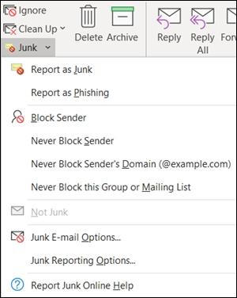

# <a name="install-and-use-the-junk-email-reporting-add-in-for-microsoft-outlook"></a><span data-ttu-id="4e32e-103">Installare e utilizzare il componente aggiuntivo per la segnalazione della posta indesiderata per Microsoft Outlook</span><span class="sxs-lookup"><span data-stu-id="4e32e-103">Install and use the Junk Email Reporting add-in for Microsoft Outlook</span></span>

[!INCLUDE [Microsoft 365 Defender rebranding](../includes/microsoft-defender-for-office.md)]


> [!NOTE]
> <span data-ttu-id="4e32e-104">Se attualmente non si utilizza il componente aggiuntivo per la segnalazione della posta indesiderata, è consigliabile utilizzare il [componente aggiuntivo per i messaggi di report](enable-the-report-message-add-in.md) .</span><span class="sxs-lookup"><span data-stu-id="4e32e-104">If you aren't currently using the Junk E-mail Reporting add-in, we recommend the [Report Message add-in](enable-the-report-message-add-in.md) instead.</span></span> <span data-ttu-id="4e32e-105">Per altre informazioni, vedere [Segnalazione di messaggi e file a Microsoft](report-junk-email-messages-to-microsoft.md).</span><span class="sxs-lookup"><span data-stu-id="4e32e-105">For more information, see [Report messages and files to Microsoft](report-junk-email-messages-to-microsoft.md).</span></span>

<span data-ttu-id="4e32e-106">Il componente aggiuntivo per la segnalazione della posta indesiderata per Microsoft Outlook consente agli utenti di inviare falsi positivi (buona posta elettronica contrassegnata come posta indesiderata), falsi negativi (posta elettronica non consentita) e messaggi di phishing a Microsoft.</span><span class="sxs-lookup"><span data-stu-id="4e32e-106">The Junk Email Reporting Add-in for Microsoft Outlook allows users to submit false positives (good email marked as spam), false negatives (bad email allowed) and phishing messages to Microsoft.</span></span> <span data-ttu-id="4e32e-107">Se l'organizzazione non utilizza Exchange Online Protection (ad esempio, Exchange locale o servizi di posta elettronica diversi da Exchange Online), l'invio del rapporto di posta indesiderata non influirà sul filtro della posta indesiderata.</span><span class="sxs-lookup"><span data-stu-id="4e32e-107">If your organization doesn't use Exchange Online Protection (for example, on-premises Exchange or email services other than Exchange Online), your junk email report submission will not affect your spam filtering.</span></span>

<span data-ttu-id="4e32e-108">In questo argomento viene descritto come installare e utilizzare il componente aggiuntivo per la segnalazione della posta indesiderata.</span><span class="sxs-lookup"><span data-stu-id="4e32e-108">This topic explains how to install and use the Junk Email Reporting add-in.</span></span>

## <a name="what-do-you-need-to-know-before-you-begin"></a><span data-ttu-id="4e32e-109">Che cosa è necessario sapere prima di iniziare</span><span class="sxs-lookup"><span data-stu-id="4e32e-109">What do you need to know before you begin?</span></span>

- <span data-ttu-id="4e32e-110">Per installare il componente aggiuntivo per la segnalazione della posta indesiderata, vedere la sezione [installazione del componente aggiuntivo per la segnalazione della posta indesiderata](#install-the-junk-email-reporting-add-in) più avanti in questo argomento.</span><span class="sxs-lookup"><span data-stu-id="4e32e-110">To install the Junk Email Reporting add-in, see the [Install the Junk Email Reporting add-in](#install-the-junk-email-reporting-add-in) section later in this topic.</span></span>

- <span data-ttu-id="4e32e-111">Il componente aggiuntivo per la segnalazione della posta indesiderata è compatibile con le seguenti versioni di Outlook:</span><span class="sxs-lookup"><span data-stu-id="4e32e-111">The Junk Email Reporting add-in works with the following versions of Outlook:</span></span>

  - <span data-ttu-id="4e32e-112">Outlook 2013 o versioni successive</span><span class="sxs-lookup"><span data-stu-id="4e32e-112">Outlook 2013 or later</span></span>
  - <span data-ttu-id="4e32e-113">Outlook incluso con Microsoft 365 Apps for Enterprise</span><span class="sxs-lookup"><span data-stu-id="4e32e-113">Outlook included with Microsoft 365 Apps for enterprise</span></span>

- <span data-ttu-id="4e32e-114">Per ulteriori informazioni sul reporting dei messaggi a Microsoft, vedere [segnalare i messaggi e i file a Microsoft](report-junk-email-messages-to-microsoft.md).</span><span class="sxs-lookup"><span data-stu-id="4e32e-114">For more information about reporting messages to Microsoft, see [Report messages and files to Microsoft](report-junk-email-messages-to-microsoft.md).</span></span>

## <a name="use-the-junk-email-reporting-add-in-to-report-spam-and-phishing-messages"></a><span data-ttu-id="4e32e-115">Utilizzare il componente aggiuntivo per la segnalazione della posta indesiderata per segnalare messaggi di posta indesiderata e phishing</span><span class="sxs-lookup"><span data-stu-id="4e32e-115">Use the Junk Email Reporting add-in to report spam and phishing messages</span></span>

1. <span data-ttu-id="4e32e-116">Per i messaggi nella cartella posta in arrivo o in altre cartelle di posta elettronica, ad eccezione della posta indesiderata, utilizzare uno dei metodi seguenti per segnalare messaggi di posta indesiderata</span><span class="sxs-lookup"><span data-stu-id="4e32e-116">For messages in the Inbox or any other email folder except Junk Email, use any of the following methods to report spam and phishing messages:</span></span>

   - <span data-ttu-id="4e32e-117">Selezionare il messaggio o aprire il messaggio.</span><span class="sxs-lookup"><span data-stu-id="4e32e-117">Select the message or open the message.</span></span> <span data-ttu-id="4e32e-118">Nella scheda **Home** o **Message** della barra multifunzione fare clic su **posta indesiderata** e quindi selezionare **segnala come posta indesiderata** o **segnala come phishing**.</span><span class="sxs-lookup"><span data-stu-id="4e32e-118">In the **Home** or **Message** tab in the ribbon, click **Junk**, and then select **Report as Junk** or **Report as Phishing**.</span></span>

     

   - <span data-ttu-id="4e32e-120">Fare clic con il pulsante destro del mouse sul messaggio, selezionare **indesiderato** e quindi selezionare **segnala come posta indesiderata** o **segnala come phishing**.</span><span class="sxs-lookup"><span data-stu-id="4e32e-120">Right-click on the message, select **Junk**, and then select **Report as Junk** or **Report as Phishing**.</span></span>

     

   - <span data-ttu-id="4e32e-122">Selezionare più messaggi, fare clic con il pulsante destro del mouse e quindi scegliere **segnala come posta indesiderata** o **segnala come phishing**.</span><span class="sxs-lookup"><span data-stu-id="4e32e-122">Select multiple messages, right-click, and then select **Report as Junk** or **Report as Phishing**.</span></span>

     

2. <span data-ttu-id="4e32e-124">Nella finestra di dialogo che viene visualizzata, leggere le informazioni e fare clic su **segnala**.</span><span class="sxs-lookup"><span data-stu-id="4e32e-124">In the dialog that appears, read the information and click **Report**.</span></span> <span data-ttu-id="4e32e-125">Se si cambia idea, fare clic su **non segnalare**.</span><span class="sxs-lookup"><span data-stu-id="4e32e-125">If you change your mind, click **Don't Report**.</span></span>

   

   

3. <span data-ttu-id="4e32e-128">I messaggi selezionati verranno inviati a Microsoft per l'analisi e:</span><span class="sxs-lookup"><span data-stu-id="4e32e-128">The selected messages will be sent to Microsoft for analysis and:</span></span>

   - <span data-ttu-id="4e32e-129">Spostata nella cartella posta indesiderata se è stata segnalata come posta indesiderata.</span><span class="sxs-lookup"><span data-stu-id="4e32e-129">Moved to the Junk Email folder if it was reported as spam.</span></span>
   - <span data-ttu-id="4e32e-130">Eliminato se è stato segnalato come phishing.</span><span class="sxs-lookup"><span data-stu-id="4e32e-130">Deleted if it was reported as phishing.</span></span>

   <span data-ttu-id="4e32e-131">Per verificare che i messaggi siano stati inviati, aprire la cartella **Posta inviata** per visualizzare i messaggi inviati.</span><span class="sxs-lookup"><span data-stu-id="4e32e-131">To confirm that the messages have been submitted, open your **Sent Items** folder to view the submitted messages.</span></span>

## <a name="use-the-junk-email-reporting-add-in-to-report-non-spam-and-phishing-messages-from-the-junk-email-folder"></a><span data-ttu-id="4e32e-132">Utilizzare il componente aggiuntivo per la segnalazione della posta indesiderata per segnalare messaggi non di posta indesiderata e di phishing dalla cartella posta indesiderata</span><span class="sxs-lookup"><span data-stu-id="4e32e-132">Use the Junk Email Reporting add-in to report non-spam and phishing messages from the Junk Email folder</span></span>

1. <span data-ttu-id="4e32e-133">Nella cartella posta indesiderata, utilizzare uno dei metodi seguenti per segnalare messaggi di posta indesiderata falsi positivi o di phishing:</span><span class="sxs-lookup"><span data-stu-id="4e32e-133">In the Junk Email folder, use any of the following methods to report spam false positives or phishing messages:</span></span>

   - <span data-ttu-id="4e32e-134">Selezionare il messaggio o aprire il messaggio.</span><span class="sxs-lookup"><span data-stu-id="4e32e-134">Select the message or open the message.</span></span> <span data-ttu-id="4e32e-135">Nella scheda **Home** o **Message** della barra multifunzione fare clic su **non indesiderata** e quindi selezionare **segnala come non indesiderato** o **segnala come phishing**.</span><span class="sxs-lookup"><span data-stu-id="4e32e-135">In the **Home** or **Message** tab in the ribbon, click **Not Junk**, and then select **Report as Not Junk** or **Report as Phishing**.</span></span>

     

   - <span data-ttu-id="4e32e-137">Fai clic con il pulsante destro del mouse sul messaggio, fai clic su **posta indesiderata** e quindi seleziona **segnala come non indesiderato** o **segnala come phishing**.</span><span class="sxs-lookup"><span data-stu-id="4e32e-137">Right-click on the message, click **Junk**, and then select **Report as Not Junk** or **Report as Phishing**.</span></span>

     

   - <span data-ttu-id="4e32e-139">Seleziona più messaggi, fai clic con il pulsante destro del mouse e quindi seleziona **segnala come non indesiderato** o **segnala come phishing**.</span><span class="sxs-lookup"><span data-stu-id="4e32e-139">Select multiple messages, right-click, and then select **Report as Not Junk** or **Report as Phishing**.</span></span>

     

2. <span data-ttu-id="4e32e-141">Nella finestra di dialogo che viene visualizzata, leggere le informazioni e fare clic su **segnala**.</span><span class="sxs-lookup"><span data-stu-id="4e32e-141">In the dialog that appears, read the information and click **Report**.</span></span> <span data-ttu-id="4e32e-142">Se si cambia idea, fare clic su **non segnalare**.</span><span class="sxs-lookup"><span data-stu-id="4e32e-142">If you change your mind, click **Don't Report**.</span></span>

   

   

3. <span data-ttu-id="4e32e-145">I messaggi selezionati verranno inviati a Microsoft per l'analisi e:</span><span class="sxs-lookup"><span data-stu-id="4e32e-145">The selected messages will be sent to Microsoft for analysis and:</span></span>

   - <span data-ttu-id="4e32e-146">Spostata nella cartella posta indesiderata se è stata segnalata come posta indesiderata.</span><span class="sxs-lookup"><span data-stu-id="4e32e-146">Moved to the Junk Email folder if it was reported as spam.</span></span>
   - <span data-ttu-id="4e32e-147">Eliminato se è stato segnalato come phishing.</span><span class="sxs-lookup"><span data-stu-id="4e32e-147">Deleted if it was reported as phishing.</span></span>

   <span data-ttu-id="4e32e-148">Per verificare che i messaggi siano stati inviati, aprire la cartella **Posta inviata** per visualizzare i messaggi inviati.</span><span class="sxs-lookup"><span data-stu-id="4e32e-148">To confirm that the messages have been submitted, open your **Sent Items** folder to view the submitted messages.</span></span>

## <a name="install-the-junk-email-reporting-add-in"></a><span data-ttu-id="4e32e-149">Installare il componente aggiuntivo per la segnalazione della posta indesiderata</span><span class="sxs-lookup"><span data-stu-id="4e32e-149">Install the Junk Email Reporting add-in</span></span>

- <span data-ttu-id="4e32e-150">È necessario disporre dei privilegi di amministratore nel computer in cui si sta installando il componente aggiuntivo.</span><span class="sxs-lookup"><span data-stu-id="4e32e-150">You need to have administrator privileges on the computer where you're installing the add-in.</span></span>

- <span data-ttu-id="4e32e-151">Andare a <https://www.microsoft.com/download/details.aspx?id=18275> e scaricare il file. msi appropriato per la versione di Office in un percorso facile da trovare:</span><span class="sxs-lookup"><span data-stu-id="4e32e-151">Go to <https://www.microsoft.com/download/details.aspx?id=18275> and download the appropriate .msi file for your version of Office to a location that's easy to find:</span></span>

  - <span data-ttu-id="4e32e-152">**32 bit**: `Junk Reporting Add-in for Office 2007, 2010, 2013, and 2016 (32-bit).msi`</span><span class="sxs-lookup"><span data-stu-id="4e32e-152">**32-bit**: `Junk Reporting Add-in for Office 2007, 2010, 2013, and 2016 (32-bit).msi`</span></span>
  - <span data-ttu-id="4e32e-153">**64 bit**: `Junk Reporting Add-in for Office 2007, 2010, 2013, and 2016 (64-bit).msi`</span><span class="sxs-lookup"><span data-stu-id="4e32e-153">**64-bit**: `Junk Reporting Add-in for Office 2007, 2010, 2013, and 2016 (64-bit).msi`</span></span>

- <span data-ttu-id="4e32e-154">Per Outlook 2013 o versione successiva, l'unico prerequisito è Microsoft .NET Framework 2,0.</span><span class="sxs-lookup"><span data-stu-id="4e32e-154">For Outlook 2013 or later, the only prerequisite is the Microsoft .NET Framework 2.0.</span></span> <span data-ttu-id="4e32e-155">In Windows 10 non è possibile installare .NET Framework 2,0 da un download.</span><span class="sxs-lookup"><span data-stu-id="4e32e-155">In Windows 10, you don't install the .NET Framework 2.0 from a download.</span></span>

### <a name="install-the-junk-email-reporting-add-in-using-the-setup-wizard"></a><span data-ttu-id="4e32e-156">Installazione del componente aggiuntivo per la segnalazione della posta indesiderata tramite l'installazione guidata</span><span class="sxs-lookup"><span data-stu-id="4e32e-156">Install the Junk Email Reporting Add-in using the Setup wizard</span></span>

1. <span data-ttu-id="4e32e-157">Chiudere Outlook nel proprio computer.</span><span class="sxs-lookup"><span data-stu-id="4e32e-157">On your computer, close Outlook.</span></span>

2. <span data-ttu-id="4e32e-158">In Windows 10, verificare che .NET Framework 2,0 sia abilitato.</span><span class="sxs-lookup"><span data-stu-id="4e32e-158">In Windows 10, verify the .NET Framework 2.0 is enabled.</span></span> <span data-ttu-id="4e32e-159">Per istruzioni, vedere [Enable the .NET Framework 3,5 in Control Panel](https://docs.microsoft.com/dotnet/framework/install/dotnet-35-windows-10#enable-the-net-framework-35-in-control-panel).</span><span class="sxs-lookup"><span data-stu-id="4e32e-159">For instructions, see [Enable the .NET Framework 3.5 in Control Panel](https://docs.microsoft.com/dotnet/framework/install/dotnet-35-windows-10#enable-the-net-framework-35-in-control-panel).</span></span>

3. <span data-ttu-id="4e32e-160">Individuare il file con estensione msi scaricato e fare doppio clic su di esso.</span><span class="sxs-lookup"><span data-stu-id="4e32e-160">Locate the .msi file you downloaded and double-click on it.</span></span>

4. <span data-ttu-id="4e32e-161">Nella pagina **Installazione del componente aggiuntivo per la segnalazione della posta indesiderata** fare clic su **Avanti**.</span><span class="sxs-lookup"><span data-stu-id="4e32e-161">On the **Welcome to Microsoft Junk Email Reporting Add-in Setup** page, click **Next**.</span></span>

5. <span data-ttu-id="4e32e-162">Esaminare il contratto di licenza, fare clic su **Accetto i termini del contratto di licenza** se si accettano i termini e quindi fare clic su **Avanti**.</span><span class="sxs-lookup"><span data-stu-id="4e32e-162">Review the license agreement, click **I accept the terms in the License Agreement** if you agree to the terms, and then click **Next**.</span></span>

6. <span data-ttu-id="4e32e-163">Al termine della procedura guidata, fare clic su **Fine**.</span><span class="sxs-lookup"><span data-stu-id="4e32e-163">When the wizard is complete, click **Finish**.</span></span>

<span data-ttu-id="4e32e-164">Avviare Outlook.</span><span class="sxs-lookup"><span data-stu-id="4e32e-164">Start Outlook.</span></span>

<span data-ttu-id="4e32e-p109">Cerare il pulsante **Posta indesiderata** sulla barra multifunzione di Outlook. A questo punto sarà possibile segnalare i messaggi di posta indesiderata a Microsoft, selezionandoli nella Posta in arrivo e facendo clic sul pulsante **Segnala posta indesiderata**.</span><span class="sxs-lookup"><span data-stu-id="4e32e-p109">Look for the **Junk** button on your Outlook ribbon. You can now report junk email messages to Microsoft by selecting the junk email messages in your Inbox and clicking the **Report Junk** button.</span></span>

<span data-ttu-id="4e32e-p110">Scegliere la freccia in giù accanto a **Posta indesiderata** per visualizzare altre opzioni, ad esempio **Segnala come phishing** per segnalare tentativi di phishing a Microsoft. Nella cartella della posta indesiderata, è inoltre possibile selezionare **Segnala come attendibile** se un messaggio di posta elettronica è stato identificato erroneamente come posta indesiderata.</span><span class="sxs-lookup"><span data-stu-id="4e32e-p110">Choose the down arrow next to **Junk** for more options such as **Report as Phishing** if you want to report phishing scam emails to Microsoft. In your junk mail folder, you can also select, **Report not junk** if an email was incorrectly identified as junk mail.</span></span>

### <a name="install-the-junk-email-reporting-add-in-using-silent-mode"></a><span data-ttu-id="4e32e-169">Installazione del componente aggiuntivo di report di posta indesiderata in modalità invisibile</span><span class="sxs-lookup"><span data-stu-id="4e32e-169">Install the Junk Email Reporting Add-In using Silent Mode</span></span>

1. <span data-ttu-id="4e32e-170">Chiudere Outlook nel proprio computer.</span><span class="sxs-lookup"><span data-stu-id="4e32e-170">On your computer, close Outlook.</span></span>

2. <span data-ttu-id="4e32e-171">In Windows 10, installare .NET Framework 2,0 eseguendo il comando riportato di seguito:</span><span class="sxs-lookup"><span data-stu-id="4e32e-171">In Windows 10, install the .NET Framework 2.0 by running the following command:</span></span>

   ```dos
   DISM /Online /Enable-Feature /FeatureName:NetFx3 /All
   ```

3. <span data-ttu-id="4e32e-172">Per installare il componente aggiuntivo senza interazione dell'utente, aprire un prompt dei comandi e utilizzare la sintassi seguente:</span><span class="sxs-lookup"><span data-stu-id="4e32e-172">To install the add-in without any user interaction, open a Command Prompt and use the following syntax:</span></span>

   ```dos
   msiexec /qn /i "<PathToMSIFile>\<MSIFile>" [MaxMessageSelection=<1-50>] [BccEmailAddress="<EmailAddress1>; <EmailAddress2>"...]
   ```

   - <span data-ttu-id="4e32e-173">`MaxMessageSelection` Specifica il numero massimo di messaggi che è possibile selezionare per un singolo invio.</span><span class="sxs-lookup"><span data-stu-id="4e32e-173">`MaxMessageSelection` specifies the maximum number of messages that you can select for a single submission.</span></span> <span data-ttu-id="4e32e-174">I valori validi sono compresi tra 1 e 50.</span><span class="sxs-lookup"><span data-stu-id="4e32e-174">Valid values are from 1 to 50.</span></span> <span data-ttu-id="4e32e-175">Il valore predefinito è 15.</span><span class="sxs-lookup"><span data-stu-id="4e32e-175">The default value is 15.</span></span>

   - <span data-ttu-id="4e32e-176">`BccEmailAddress` Specifica i destinatari Ccn aggiuntivi che riceveranno una copia di tutti gli invii degli utenti.</span><span class="sxs-lookup"><span data-stu-id="4e32e-176">`BccEmailAddress` specifies additional Bcc recipients who will receive a copy of all user submissions.</span></span> <span data-ttu-id="4e32e-177">Il valore predefinito è vuoto (nessun destinatario Ccn aggiuntivo).</span><span class="sxs-lookup"><span data-stu-id="4e32e-177">The default value is blank (no additional Bcc recipients).</span></span>

   <span data-ttu-id="4e32e-178">In questo esempio viene installata la versione a 64 bit del componente aggiuntivo dal percorso specificato con le impostazioni predefinite.</span><span class="sxs-lookup"><span data-stu-id="4e32e-178">This example installs the 64-bit version of the add-in from the specified path with the default settings.</span></span>

   ```dos
   msiexec /qn /i "C:\Downloads\Junk Reporting Add-in for Office 2007, 2010, 2013, and 2016 (64-bit).msi"
   ```

   <span data-ttu-id="4e32e-179">In questo esempio viene installata la versione a 32 bit del componente aggiuntivo dal percorso specificato con le seguenti impostazioni aggiuntive:</span><span class="sxs-lookup"><span data-stu-id="4e32e-179">This example installs the 32-bit version of the add-in from the specified path with the following additional settings:</span></span>

   - <span data-ttu-id="4e32e-180">Un massimo di 20 messaggi può essere selezionato in un singolo invio.</span><span class="sxs-lookup"><span data-stu-id="4e32e-180">Up to 20 messages can be selected in a single submission.</span></span>
   - <span data-ttu-id="4e32e-181">junkreports@contoso.com e hollyd@treyresearch.net ricevono copie BCC di tutti gli invii.</span><span class="sxs-lookup"><span data-stu-id="4e32e-181">junkreports@contoso.com and hollyd@treyresearch.net receive Bcc copies of all submissions.</span></span>

   ```dos
   msiexec /qn /i "C:\Downloads\Junk Reporting Add-in for Office 2007, 2010, 2013, and 2016 (32-bit).msi" MaxMessageSelection=20 BccEmailAddress="junkreports@contoso.com; hollyd@treyresearch.net"
   ```

### <a name="how-do-you-know-this-worked"></a><span data-ttu-id="4e32e-182">Come verificare se l'operazione ha avuto esito positivo</span><span class="sxs-lookup"><span data-stu-id="4e32e-182">How do you know this worked?</span></span>

<span data-ttu-id="4e32e-183">Per verificare che il componente aggiuntivo per la segnalazione della posta indesiderata sia stato installato correttamente, eseguire una delle operazioni seguenti in Outlook:</span><span class="sxs-lookup"><span data-stu-id="4e32e-183">To verify that you've successfully installed the Junk Email Reporting Add-in, do the any of the following steps in Outlook:</span></span>

- <span data-ttu-id="4e32e-184">Selezionare il messaggio o aprire il messaggio.</span><span class="sxs-lookup"><span data-stu-id="4e32e-184">Select the message or open the message.</span></span> <span data-ttu-id="4e32e-185">Nella scheda **Home** o **Message** della barra multifunzione fare clic su **posta indesiderata** e verificare che siano disponibili le opzioni seguenti:</span><span class="sxs-lookup"><span data-stu-id="4e32e-185">In the **Home** or **Message** tab in the ribbon, click **Junk**, and verify that the following options are available:</span></span>

  - <span data-ttu-id="4e32e-186">**Segnala come posta indesiderata**</span><span class="sxs-lookup"><span data-stu-id="4e32e-186">**Report as Junk**</span></span>
  - <span data-ttu-id="4e32e-187">**Segnala come phishing**</span><span class="sxs-lookup"><span data-stu-id="4e32e-187">**Report as Phishing**</span></span>
  - <span data-ttu-id="4e32e-188">**Opzioni di segnalazione della posta indesiderata**</span><span class="sxs-lookup"><span data-stu-id="4e32e-188">**Junk Reporting Options**</span></span>
  - <span data-ttu-id="4e32e-189">**Segnalare la Guida in linea di indesiderata**</span><span class="sxs-lookup"><span data-stu-id="4e32e-189">**Report Junk Online Help**</span></span>

  

- <span data-ttu-id="4e32e-191">Fare clic con il pulsante destro del mouse sul messaggio, selezionare **indesiderato** e verificare che siano disponibili le opzioni seguenti:</span><span class="sxs-lookup"><span data-stu-id="4e32e-191">Right-click on the message, select **Junk**, and verify that the following options are available:</span></span>

  - <span data-ttu-id="4e32e-192">**Segnala come posta indesiderata**</span><span class="sxs-lookup"><span data-stu-id="4e32e-192">**Report as Junk**</span></span>
  - <span data-ttu-id="4e32e-193">**Segnala come phishing**</span><span class="sxs-lookup"><span data-stu-id="4e32e-193">**Report as Phishing**</span></span>
  - <span data-ttu-id="4e32e-194">**Opzioni di segnalazione della posta indesiderata**</span><span class="sxs-lookup"><span data-stu-id="4e32e-194">**Junk Reporting Options**</span></span>
  - <span data-ttu-id="4e32e-195">**Segnalare la Guida in linea di indesiderata**</span><span class="sxs-lookup"><span data-stu-id="4e32e-195">**Report Junk Online Help**</span></span>

  

- <span data-ttu-id="4e32e-197">Selezionare più messaggi, fare clic con il pulsante destro del mouse e verificare che siano disponibili le opzioni seguenti:</span><span class="sxs-lookup"><span data-stu-id="4e32e-197">Select multiple messages, right click, and verify that the following options are available:</span></span>

  - <span data-ttu-id="4e32e-198">**Segnala come posta indesiderata**</span><span class="sxs-lookup"><span data-stu-id="4e32e-198">**Report as Junk**</span></span>
  - <span data-ttu-id="4e32e-199">**Segnala come phishing**</span><span class="sxs-lookup"><span data-stu-id="4e32e-199">**Report as Phishing**</span></span>

  

- <span data-ttu-id="4e32e-201">Eseguire le azioni precedenti nella cartella **posta indesiderata** e verificare che le opzioni precedenti per i report di **posta** indesiderata **non siano indesiderate**.</span><span class="sxs-lookup"><span data-stu-id="4e32e-201">Do the previous actions in the **Junk Email** folder and verify the previous **Junk** reporting options are now **Not Junk**.</span></span>

  

  

  

## <a name="uninstall-the-junk-email-reporting-add-in"></a><span data-ttu-id="4e32e-205">Disinstallazione del componente aggiuntivo per la segnalazione della posta indesiderata</span><span class="sxs-lookup"><span data-stu-id="4e32e-205">Uninstall the Junk Email Reporting Add-in</span></span>

<span data-ttu-id="4e32e-206">Dopo aver chiuso Outlook, utilizzare una delle procedure seguenti per disinstallare il componente aggiuntivo per la segnalazione della posta indesiderata:</span><span class="sxs-lookup"><span data-stu-id="4e32e-206">After you close Outlook, use any of the following procedures to uninstall the Junk Email Reporting Add-in:</span></span>

- <span data-ttu-id="4e32e-207">**Pannello di controllo**: premere il tasto Windows + R. Nella finestra di dialogo **Esegui** che viene visualizzata, immettere `control appwiz.cpl` e quindi fare clic su **OK**.</span><span class="sxs-lookup"><span data-stu-id="4e32e-207">**Control Panel**: Press the Windows key + R. In the **Run** dialog that opens, enter `control appwiz.cpl` and then click **OK**.</span></span>

  <span data-ttu-id="4e32e-208">Individuare e selezionare il **componente aggiuntivo per la segnalazione della posta indesiderata di Microsoft** nell'elenco e quindi fare clic su **Disinstalla**.</span><span class="sxs-lookup"><span data-stu-id="4e32e-208">Find and select **Microsoft Junk Email Reporting Add-in** in the list, and then click **Uninstall**.</span></span>

- <span data-ttu-id="4e32e-209">**Pacchetto di Windows Installer**: trovare o scaricare il file. msi appropriato e fare doppio clic su di esso.</span><span class="sxs-lookup"><span data-stu-id="4e32e-209">**Windows Installer package**: Find or download the appropriate .msi file, and double-click on it.</span></span>

  - <span data-ttu-id="4e32e-210">**32 bit**: `Junk Reporting Add-in for Office 2007, 2010, 2013, and 2016 (32-bit).msi`</span><span class="sxs-lookup"><span data-stu-id="4e32e-210">**32-bit**: `Junk Reporting Add-in for Office 2007, 2010, 2013, and 2016 (32-bit).msi`</span></span>

  - <span data-ttu-id="4e32e-211">**64 bit**: `Junk Reporting Add-in for Office 2007, 2010, 2013, and 2016 (64-bit).msi`</span><span class="sxs-lookup"><span data-stu-id="4e32e-211">**64-bit**: `Junk Reporting Add-in for Office 2007, 2010, 2013, and 2016 (64-bit).msi`</span></span>

  <span data-ttu-id="4e32e-212">Nella finestra di dialogo visualizzata, selezionare **Rimuovi componente aggiuntivo per la segnalazione della posta indesiderata di Microsoft per Outlook** e quindi fare clic su **Avanti**.</span><span class="sxs-lookup"><span data-stu-id="4e32e-212">In the dialog that appears, select **Remove Microsoft Junk Email Reporting Add-in for Outlook** and then click **Next**.</span></span>

- <span data-ttu-id="4e32e-213">**Modalità invisibile all'utente**: trovare o scaricare il file. msi appropriato.</span><span class="sxs-lookup"><span data-stu-id="4e32e-213">**Silent Mode**: Find or download the appropriate .msi file.</span></span> <span data-ttu-id="4e32e-214">In una finestra del prompt dei comandi, sostituire \<PathToFile\> con il percorso del file con estensione msi ed eseguire uno dei seguenti comandi:</span><span class="sxs-lookup"><span data-stu-id="4e32e-214">In a Command Prompt window, replace \<PathToFile\> with the location of the .msi file, and run one of the following commands:</span></span>

  - <span data-ttu-id="4e32e-215">**32 bit**:</span><span class="sxs-lookup"><span data-stu-id="4e32e-215">**32-bit**:</span></span>

    ```dos
    msiexec /x "<PathToFile>\Junk Reporting Add-in for Office 2007, 2010, 2013, and 2016 (32-bit).msi" /qn MSIRESTARTMANAGERCONTROL="DisableShutdown"
    ```

  - <span data-ttu-id="4e32e-216">**64 bit**:</span><span class="sxs-lookup"><span data-stu-id="4e32e-216">**64-bit**:</span></span>

    ```dos
    msiexec /x "<PathToFile>\Junk Reporting Add-in for Office 2007, 2010, 2013, and 2016 (64-bit).msi" /qn MSIRESTARTMANAGERCONTROL="DisableShutdown"
    ```

<span data-ttu-id="4e32e-217">Quando si apre Outlook dopo la disinstallazione, la posta indesiderata, non la posta indesiderata e le opzioni di phishing devono essere scomparse.</span><span class="sxs-lookup"><span data-stu-id="4e32e-217">When you open Outlook after the uninstall, the junk, not junk, and phishing reporting options should be gone.</span></span>

## <a name="troubleshooting-the-junk-email-reporting-add-in"></a><span data-ttu-id="4e32e-218">Risoluzione dei problemi relativi al componente aggiuntivo per la segnalazione della posta indesiderata</span><span class="sxs-lookup"><span data-stu-id="4e32e-218">Troubleshooting the Junk Email Reporting add-in</span></span>

<span data-ttu-id="4e32e-219">In alcuni casi, potrebbe verificarsi un problema con Outlook dopo l'aggiunta del componente aggiuntivo per la segnalazione della posta indesiderata.</span><span class="sxs-lookup"><span data-stu-id="4e32e-219">Occasionally, you might experience trouble with Outlook after adding the Junk Email Reporting Add-In.</span></span> <span data-ttu-id="4e32e-220">In questa sezione vengono descritti i problemi che potrebbero verificarsi, insieme ai suggerimenti per risolvere questi problemi.</span><span class="sxs-lookup"><span data-stu-id="4e32e-220">This section describes problems that you might encounter, along with tips for resolving these issues.</span></span>

### <a name="troubleshooting-for-users"></a><span data-ttu-id="4e32e-221">Risoluzione dei problemi per gli utenti</span><span class="sxs-lookup"><span data-stu-id="4e32e-221">Troubleshooting for users</span></span>

<span data-ttu-id="4e32e-222">È possibile riscontrare uno o più dei problemi seguenti:</span><span class="sxs-lookup"><span data-stu-id="4e32e-222">You experience one or more of the following problems:</span></span>

- <span data-ttu-id="4e32e-223">Non accade nulla quando si fa clic su **Segnala posta indesiderata**</span><span class="sxs-lookup"><span data-stu-id="4e32e-223">Nothing happens when you click **Report Junk**</span></span>
- <span data-ttu-id="4e32e-224">Outlook si blocca dopo la selezione di un messaggio di posta elettronica</span><span class="sxs-lookup"><span data-stu-id="4e32e-224">Outlook stops responding after you select an email message</span></span>
- <span data-ttu-id="4e32e-225">La posta indesiderata segnalata non viene recapitata perché "non recapitabile"</span><span class="sxs-lookup"><span data-stu-id="4e32e-225">Reported junk mail cannot be delivered due to an "undeliverable" reply</span></span>

<span data-ttu-id="4e32e-226">Per risolvere il problema, eseguire le operazioni seguenti:</span><span class="sxs-lookup"><span data-stu-id="4e32e-226">To fix this problem, do the following steps:</span></span>

1. <span data-ttu-id="4e32e-227">Chiudere e riavviare Outlook.</span><span class="sxs-lookup"><span data-stu-id="4e32e-227">Close and restart Outlook.</span></span>
2. <span data-ttu-id="4e32e-228">Creare e inviare un messaggio di prova e verificare che il destinatario abbia ricevuto il messaggio.</span><span class="sxs-lookup"><span data-stu-id="4e32e-228">Create and send a test message, and verify that the recipient received the message.</span></span>
3. <span data-ttu-id="4e32e-229">Se il problema persiste, contattare l'amministratore.</span><span class="sxs-lookup"><span data-stu-id="4e32e-229">If the problem persists, contact your admin.</span></span>

<span data-ttu-id="4e32e-230">Per gli altri metodi che è possibile utilizzare per inviare messaggi a Microsoft, vedere [segnalare i messaggi e i file a Microsoft](report-junk-email-messages-to-microsoft.md).</span><span class="sxs-lookup"><span data-stu-id="4e32e-230">For other methods that you can use to submit messages to Microsoft, see [Report messages and files to Microsoft](report-junk-email-messages-to-microsoft.md).</span></span>

### <a name="troubleshooting-for-admins"></a><span data-ttu-id="4e32e-231">Risoluzione dei problemi per gli amministratori</span><span class="sxs-lookup"><span data-stu-id="4e32e-231">Troubleshooting for admins</span></span>

#### <a name="problem-an-error-message-continually-appears-that-asks-users-to-contact-their-system-administrator"></a><span data-ttu-id="4e32e-232">Problema: viene visualizzato continuamente un messaggio di errore che chiede agli utenti di contattare l'amministratore di sistema</span><span class="sxs-lookup"><span data-stu-id="4e32e-232">Problem: An error message continually appears that asks users to contact their system administrator</span></span>

1. <span data-ttu-id="4e32e-233">Verificare o impostare la `LoggingLevel` chiave del registro di sistema sul valore "verbose":</span><span class="sxs-lookup"><span data-stu-id="4e32e-233">Verify or set the `LoggingLevel` registry key to the value "Verbose":</span></span>

   - <span data-ttu-id="4e32e-234">**Outlook a 32 bit su Windows a 32 bit**:</span><span class="sxs-lookup"><span data-stu-id="4e32e-234">**32-bit Outlook on 32-bit Windows**:</span></span>

     ```text
     Windows Registry Editor Version 5.00

     [HKEY_LOCAL_MACHINE\Software\Microsoft\Junk Email Reporting\Addins]
     "LoggingLevel"="Verbose"
     ```

   - <span data-ttu-id="4e32e-235">**Outlook a 32 bit su Windows a 64 bit**:</span><span class="sxs-lookup"><span data-stu-id="4e32e-235">**32-bit Outlook on 64-bit Windows**:</span></span>

     ```text
     Windows Registry Editor Version 5.00

     [HKEY_LOCAL_MACHINE\Software\Wow6432Node\Microsoft\Junk Email Reporting\Addins]
     "LoggingLevel"="Verbose"
     ```

   - <span data-ttu-id="4e32e-236">**Outlook a 64 bit**:</span><span class="sxs-lookup"><span data-stu-id="4e32e-236">**64-bit Outlook**:</span></span>

     ```text
     Windows Registry Editor Version 5.00

     [HKEY_LOCAL_MACHINE\Software\Microsoft\Junk E-mail Reporting\Addins]
     "LoggingLevel"="Verbose"
     ```

2. <span data-ttu-id="4e32e-237">Riavviare Outlook e chiedere agli utenti di riferire quando visualizzano il messaggio di errore.</span><span class="sxs-lookup"><span data-stu-id="4e32e-237">Restart Outlook and ask users to report back when they see the error message.</span></span>

3. <span data-ttu-id="4e32e-238">Raccogliere i registri nei percorsi seguenti:</span><span class="sxs-lookup"><span data-stu-id="4e32e-238">Collect the log information found at the following location:</span></span>

   `%LOCALAPPDATA%\Microsoft\Junk Email Reporting Add-in\SpamReporterAddinLog.txt`

4. <span data-ttu-id="4e32e-239">Contattare il supporto tecnico di Exchange Online Protection per fornire i registri.</span><span class="sxs-lookup"><span data-stu-id="4e32e-239">Contact Exchange Online Protection Technical Support and provide them with the log information.</span></span>

#### <a name="problem-users-selected-not-to-receive-a-confirmation-prompt-when-they-report-messages-and-now-they-want-the-prompt-back"></a><span data-ttu-id="4e32e-240">Problema: gli utenti hanno scelto di non ricevere una richiesta di conferma quando segnalano i messaggi e ora richiedano il prompt.</span><span class="sxs-lookup"><span data-stu-id="4e32e-240">Problem: Users selected not to receive a confirmation prompt when they report messages, and now they want the prompt back</span></span>

1. <span data-ttu-id="4e32e-241">Creare la `ConfirmReportJunk` chiave del registro di sistema con il valore "true":</span><span class="sxs-lookup"><span data-stu-id="4e32e-241">Create the `ConfirmReportJunk`registry key with the value "True":</span></span>

   ```text
   Windows Registry Editor Version 5.00

   HKEY_CURRENT_USER\Software\Microsoft\Junk E-mail Reporting\Preferences]
   "ConfirmReportJunk"="True"
   ```

2. <span data-ttu-id="4e32e-242">Riavviare Outlook.</span><span class="sxs-lookup"><span data-stu-id="4e32e-242">Restart Outlook.</span></span>
