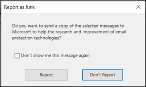

# <a name="install-and-use-the-junk-email-reporting-add-in-for-microsoft-outlook"></a>Installare e utilizzare il componente aggiuntivo per la segnalazione della posta indesiderata per Microsoft Outlook

[!INCLUDE [Microsoft 365 Defender rebranding](../includes/microsoft-defender-for-office.md)]


> [!NOTE]
> Se attualmente non si utilizza il componente aggiuntivo per la segnalazione della posta indesiderata, è consigliabile utilizzare il [componente aggiuntivo per i messaggi di report](enable-the-report-message-add-in.md) . Per altre informazioni, vedere [Segnalazione di messaggi e file a Microsoft](report-junk-email-messages-to-microsoft.md).

Il componente aggiuntivo per la segnalazione della posta indesiderata per Microsoft Outlook consente agli utenti di inviare falsi positivi (buona posta elettronica contrassegnata come posta indesiderata), falsi negativi (posta elettronica non consentita) e messaggi di phishing a Microsoft. Se l'organizzazione non utilizza Exchange Online Protection (ad esempio, Exchange locale o servizi di posta elettronica diversi da Exchange Online), l'invio del rapporto di posta indesiderata non influirà sul filtro della posta indesiderata.

In questo argomento viene descritto come installare e utilizzare il componente aggiuntivo per la segnalazione della posta indesiderata.

## <a name="what-do-you-need-to-know-before-you-begin"></a>Che cosa è necessario sapere prima di iniziare

- Per installare il componente aggiuntivo per la segnalazione della posta indesiderata, vedere la sezione [installazione del componente aggiuntivo per la segnalazione della posta indesiderata](#install-the-junk-email-reporting-add-in) più avanti in questo argomento.

- Il componente aggiuntivo per la segnalazione della posta indesiderata è compatibile con le seguenti versioni di Outlook:

  - Outlook 2013 o versioni successive
  - Outlook incluso con Microsoft 365 Apps for Enterprise

- Per ulteriori informazioni sul reporting dei messaggi a Microsoft, vedere [segnalare i messaggi e i file a Microsoft](report-junk-email-messages-to-microsoft.md).

## <a name="use-the-junk-email-reporting-add-in-to-report-spam-and-phishing-messages"></a>Utilizzare il componente aggiuntivo per la segnalazione della posta indesiderata per segnalare messaggi di posta indesiderata e phishing

1. Per i messaggi nella cartella posta in arrivo o in altre cartelle di posta elettronica, ad eccezione della posta indesiderata, utilizzare uno dei metodi seguenti per segnalare messaggi di posta indesiderata

   - Selezionare il messaggio o aprire il messaggio. Nella scheda **Home** o **Message** della barra multifunzione fare clic su **posta indesiderata**e quindi selezionare **segnala come posta indesiderata** o **segnala come phishing**.

     

   - Fare clic con il pulsante destro del mouse sul messaggio, selezionare **indesiderato**e quindi selezionare **segnala come posta indesiderata** o **segnala come phishing**.

     

   - Selezionare più messaggi, fare clic con il pulsante destro del mouse e quindi scegliere **segnala come posta indesiderata** o **segnala come phishing**.

     

2. Nella finestra di dialogo che viene visualizzata, leggere le informazioni e fare clic su **segnala**. Se si cambia idea, fare clic su **non segnalare**.

   

   

3. I messaggi selezionati verranno inviati a Microsoft per l'analisi e:

   - Spostata nella cartella posta indesiderata se è stata segnalata come posta indesiderata.
   - Eliminato se è stato segnalato come phishing.
   
   Per verificare che i messaggi siano stati inviati, aprire la cartella **Posta inviata** per visualizzare i messaggi inviati.

## <a name="use-the-junk-email-reporting-add-in-to-report-non-spam-and-phishing-messages-from-the-junk-email-folder"></a>Utilizzare il componente aggiuntivo per la segnalazione della posta indesiderata per segnalare messaggi non di posta indesiderata e di phishing dalla cartella posta indesiderata

1. Nella cartella posta indesiderata, utilizzare uno dei metodi seguenti per segnalare messaggi di posta indesiderata falsi positivi o di phishing:

   - Selezionare il messaggio o aprire il messaggio. Nella scheda **Home** o **Message** della barra multifunzione fare clic su **non indesiderata**e quindi selezionare **segnala come non indesiderato** o **segnala come phishing**.

     

   - Fai clic con il pulsante destro del mouse sul messaggio, fai clic su **posta indesiderata**e quindi seleziona **segnala come non indesiderato** o **segnala come phishing**.

     

   - Seleziona più messaggi, fai clic con il pulsante destro del mouse e quindi seleziona **segnala come non indesiderato** o **segnala come phishing**.

     

2. Nella finestra di dialogo che viene visualizzata, leggere le informazioni e fare clic su **segnala**. Se si cambia idea, fare clic su **non segnalare**.

   

   

3. I messaggi selezionati verranno inviati a Microsoft per l'analisi e:

   - Spostata nella cartella posta indesiderata se è stata segnalata come posta indesiderata.
   - Eliminato se è stato segnalato come phishing.

   Per verificare che i messaggi siano stati inviati, aprire la cartella **Posta inviata** per visualizzare i messaggi inviati.

## <a name="install-the-junk-email-reporting-add-in"></a>Installare il componente aggiuntivo per la segnalazione della posta indesiderata

- È necessario disporre dei privilegi di amministratore nel computer in cui si sta installando il componente aggiuntivo.

- Andare a <https://www.microsoft.com/download/details.aspx?id=18275> e scaricare il file. msi appropriato per la versione di Office in un percorso facile da trovare:

  - **32 bit**: `Junk Reporting Add-in for Office 2007, 2010, 2013, and 2016 (32-bit).msi`
  - **64 bit**: `Junk Reporting Add-in for Office 2007, 2010, 2013, and 2016 (64-bit).msi`

- Per Outlook 2013 o versione successiva, l'unico prerequisito è Microsoft .NET Framework 2,0. In Windows 10 non è possibile installare .NET Framework 2,0 da un download.

### <a name="install-the-junk-email-reporting-add-in-using-the-setup-wizard"></a>Installazione del componente aggiuntivo per la segnalazione della posta indesiderata tramite l'installazione guidata

1. Chiudere Outlook nel proprio computer.

2. In Windows 10, verificare che .NET Framework 2,0 sia abilitato. Per istruzioni, vedere [Enable the .NET Framework 3,5 in Control Panel](https://docs.microsoft.com/dotnet/framework/install/dotnet-35-windows-10#enable-the-net-framework-35-in-control-panel).

3. Individuare il file con estensione msi scaricato e fare doppio clic su di esso.

4. Nella pagina **Installazione del componente aggiuntivo per la segnalazione della posta indesiderata** fare clic su **Avanti**.

5. Esaminare il contratto di licenza, fare clic su **Accetto i termini del contratto di licenza** se si accettano i termini e quindi fare clic su **Avanti**.

6. Al termine della procedura guidata, fare clic su **Fine**.

Avviare Outlook.

Cerare il pulsante **Posta indesiderata** sulla barra multifunzione di Outlook. A questo punto sarà possibile segnalare i messaggi di posta indesiderata a Microsoft, selezionandoli nella Posta in arrivo e facendo clic sul pulsante **Segnala posta indesiderata**.

Scegliere la freccia in giù accanto a **Posta indesiderata** per visualizzare altre opzioni, ad esempio **Segnala come phishing** per segnalare tentativi di phishing a Microsoft. Nella cartella della posta indesiderata, è inoltre possibile selezionare **Segnala come attendibile** se un messaggio di posta elettronica è stato identificato erroneamente come posta indesiderata.

### <a name="install-the-junk-email-reporting-add-in-using-silent-mode"></a>Installazione del componente aggiuntivo di report di posta indesiderata in modalità invisibile

1. Chiudere Outlook nel proprio computer.

2. In Windows 10, installare .NET Framework 2,0 eseguendo il comando riportato di seguito:

   ```dos
   DISM /Online /Enable-Feature /FeatureName:NetFx3 /All
   ```

3. Per installare il componente aggiuntivo senza interazione dell'utente, aprire un prompt dei comandi e utilizzare la sintassi seguente:

   ```dos
   msiexec /qn /i "<PathToMSIFile>\<MSIFile>" [MaxMessageSelection=<1-50>] [BccEmailAddress="<EmailAddress1>; <EmailAddress2>"...]
   ```

   - `MaxMessageSelection` Specifica il numero massimo di messaggi che è possibile selezionare per un singolo invio. I valori validi sono compresi tra 1 e 50. Il valore predefinito è 15.

   - `BccEmailAddress` Specifica i destinatari Ccn aggiuntivi che riceveranno una copia di tutti gli invii degli utenti. Il valore predefinito è vuoto (nessun destinatario Ccn aggiuntivo).

   In questo esempio viene installata la versione a 64 bit del componente aggiuntivo dal percorso specificato con le impostazioni predefinite.

   ```dos
   msiexec /qn /i "C:\Downloads\Junk Reporting Add-in for Office 2007, 2010, 2013, and 2016 (64-bit).msi"
   ```

   In questo esempio viene installata la versione a 32 bit del componente aggiuntivo dal percorso specificato con le seguenti impostazioni aggiuntive:

   - Un massimo di 20 messaggi può essere selezionato in un singolo invio.
   - junkreports@contoso.com e hollyd@treyresearch.net ricevono copie BCC di tutti gli invii.

   ```dos
   msiexec /qn /i "C:\Downloads\Junk Reporting Add-in for Office 2007, 2010, 2013, and 2016 (32-bit).msi" MaxMessageSelection=20 BccEmailAddress="junkreports@contoso.com; hollyd@treyresearch.net"
   ```

### <a name="how-do-you-know-this-worked"></a>Come verificare se l'operazione ha avuto esito positivo

Per verificare che il componente aggiuntivo per la segnalazione della posta indesiderata sia stato installato correttamente, eseguire una delle operazioni seguenti in Outlook:

- Selezionare il messaggio o aprire il messaggio. Nella scheda **Home** o **Message** della barra multifunzione fare clic su **posta indesiderata**e verificare che siano disponibili le opzioni seguenti:

  - **Segnala come posta indesiderata**
  - **Segnala come phishing**
  - **Opzioni di segnalazione della posta indesiderata**
  - **Segnalare la Guida in linea di indesiderata**

  

- Fare clic con il pulsante destro del mouse sul messaggio, selezionare **indesiderato**e verificare che siano disponibili le opzioni seguenti:

  - **Segnala come posta indesiderata**
  - **Segnala come phishing**
  - **Opzioni di segnalazione della posta indesiderata**
  - **Segnalare la Guida in linea di indesiderata**

  

- Selezionare più messaggi, fare clic con il pulsante destro del mouse e verificare che siano disponibili le opzioni seguenti:

  - **Segnala come posta indesiderata**
  - **Segnala come phishing**

  

- Eseguire le azioni precedenti nella cartella **posta indesiderata** e verificare che le opzioni precedenti per i report di **posta** indesiderata **non siano indesiderate**.

  

  

  

## <a name="uninstall-the-junk-email-reporting-add-in"></a>Disinstallazione del componente aggiuntivo per la segnalazione della posta indesiderata

Dopo aver chiuso Outlook, utilizzare una delle procedure seguenti per disinstallare il componente aggiuntivo per la segnalazione della posta indesiderata:

- **Pannello di controllo**: premere il tasto Windows + R. Nella finestra di dialogo **Esegui** che viene visualizzata, immettere `control appwiz.cpl` e quindi fare clic su **OK**.

  Individuare e selezionare il **componente aggiuntivo per la segnalazione della posta indesiderata di Microsoft** nell'elenco e quindi fare clic su **Disinstalla**.

- **Pacchetto di Windows Installer**: trovare o scaricare il file. msi appropriato e fare doppio clic su di esso.

  - **32 bit**: `Junk Reporting Add-in for Office 2007, 2010, 2013, and 2016 (32-bit).msi`

  - **64 bit**: `Junk Reporting Add-in for Office 2007, 2010, 2013, and 2016 (64-bit).msi`

  Nella finestra di dialogo visualizzata, selezionare **Rimuovi componente aggiuntivo per la segnalazione della posta indesiderata di Microsoft per Outlook** e quindi fare clic su **Avanti**.

- **Modalità invisibile all'utente**: trovare o scaricare il file. msi appropriato. In una finestra del prompt dei comandi, sostituire \<PathToFile\> con il percorso del file con estensione msi ed eseguire uno dei seguenti comandi:

  - **32 bit**:

    ```dos
    msiexec /x "<PathToFile>\Junk Reporting Add-in for Office 2007, 2010, 2013, and 2016 (32-bit).msi" /qn MSIRESTARTMANAGERCONTROL="DisableShutdown"
    ```

  - **64 bit**:

    ```dos
    msiexec /x "<PathToFile>\Junk Reporting Add-in for Office 2007, 2010, 2013, and 2016 (64-bit).msi" /qn MSIRESTARTMANAGERCONTROL="DisableShutdown"
    ```

Quando si apre Outlook dopo la disinstallazione, la posta indesiderata, non la posta indesiderata e le opzioni di phishing devono essere scomparse.

## <a name="troubleshooting-the-junk-email-reporting-add-in"></a>Risoluzione dei problemi relativi al componente aggiuntivo per la segnalazione della posta indesiderata

In alcuni casi, potrebbe verificarsi un problema con Outlook dopo l'aggiunta del componente aggiuntivo per la segnalazione della posta indesiderata. In questa sezione vengono descritti i problemi che potrebbero verificarsi, insieme ai suggerimenti per risolvere questi problemi.

### <a name="troubleshooting-for-users"></a>Risoluzione dei problemi per gli utenti

È possibile riscontrare uno o più dei problemi seguenti:

- Non accade nulla quando si fa clic su **Segnala posta indesiderata**
- Outlook si blocca dopo la selezione di un messaggio di posta elettronica
- La posta indesiderata segnalata non viene recapitata perché "non recapitabile"

Per risolvere il problema, eseguire le operazioni seguenti:

1. Chiudere e riavviare Outlook.
2. Creare e inviare un messaggio di prova e verificare che il destinatario abbia ricevuto il messaggio.
3. Se il problema persiste, contattare l'amministratore.

Per gli altri metodi che è possibile utilizzare per inviare messaggi a Microsoft, vedere [segnalare i messaggi e i file a Microsoft](report-junk-email-messages-to-microsoft.md).

### <a name="troubleshooting-for-admins"></a>Risoluzione dei problemi per gli amministratori

#### <a name="problem-an-error-message-continually-appears-that-asks-users-to-contact-their-system-administrator"></a>Problema: viene visualizzato continuamente un messaggio di errore che chiede agli utenti di contattare l'amministratore di sistema

1. Verificare o impostare la `LoggingLevel` chiave del registro di sistema sul valore "verbose":

   - **Outlook a 32 bit su Windows a 32 bit**:

     ```text
     Windows Registry Editor Version 5.00

     [HKEY_LOCAL_MACHINE\Software\Microsoft\Junk Email Reporting\Addins]
     "LoggingLevel"="Verbose"
     ```

   - **Outlook a 32 bit su Windows a 64 bit**:

     ```text
     Windows Registry Editor Version 5.00

     [HKEY_LOCAL_MACHINE\Software\Wow6432Node\Microsoft\Junk Email Reporting\Addins]
     "LoggingLevel"="Verbose"
     ```

   - **Outlook a 64 bit**:

     ```text
     Windows Registry Editor Version 5.00

     [HKEY_LOCAL_MACHINE\Software\Microsoft\Junk E-mail Reporting\Addins]
     "LoggingLevel"="Verbose"
     ```

2. Riavviare Outlook e chiedere agli utenti di riferire quando visualizzano il messaggio di errore.

3. Raccogliere i registri nei percorsi seguenti:

   `%LOCALAPPDATA%\Microsoft\Junk Email Reporting Add-in\SpamReporterAddinLog.txt`

4. Contattare il supporto tecnico di Exchange Online Protection per fornire i registri.

#### <a name="problem-users-selected-not-to-receive-a-confirmation-prompt-when-they-report-messages-and-now-they-want-the-prompt-back"></a>Problema: gli utenti hanno scelto di non ricevere una richiesta di conferma quando segnalano i messaggi e ora richiedano il prompt.

1. Creare la `ConfirmReportJunk` chiave del registro di sistema con il valore "true":

   ```text
   Windows Registry Editor Version 5.00

   HKEY_CURRENT_USER\Software\Microsoft\Junk E-mail Reporting\Preferences]
   "ConfirmReportJunk"="True"
   ```

2. Riavviare Outlook.
