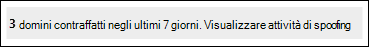

# <a name="spoof-intelligence-insight-in-eop"></a>Informazioni di intelligence di spoofing in EOP

[!INCLUDE [Microsoft 365 Defender rebranding](../includes/microsoft-defender-for-office.md)]

**Si applica a**
- [Exchange Online Protection](exchange-online-protection-overview.md)
- [Microsoft Defender per Office 365 piano 1 e piano 2](defender-for-office-365.md)
- [Microsoft 365 Defender](../defender/microsoft-365-defender.md)

> [!NOTE]
> Le funzionalità descritte in questo articolo sono disponibili in Anteprima, sono soggette a modifiche e non sono disponibili in tutte le organizzazioni. Se l'organizzazione non dispone delle funzionalità descritte in questo articolo, vedere l'esperienza di gestione dello spoofing precedente in [Manage spoofed senders using the spoof intelligence policy and spoof intelligence insight in EOP](walkthrough-spoof-intelligence-insight.md).

Nelle Microsoft 365 con cassette postali in Exchange Online o in organizzazioni di Exchange Online Protection (EOP) autonome senza cassette postali Exchange Online, i messaggi di posta elettronica in ingresso vengono protetti automaticamente da spoofing. EOP usa **l'intelligence spoofing** come parte della difesa generale dell'organizzazione contro il phishing. Per ulteriori informazioni, vedere [Protezione anti-spoofing in EOP.](anti-spoofing-protection.md)

Quando un mittente effettua lo spoofing di un indirizzo di posta elettronica, sembra essere un utente in uno dei domini dell'organizzazione o un utente in un dominio esterno che invia posta elettronica all'organizzazione. Gli utenti malintenzionati che effettuano lo spoofing dei mittenti per inviare posta indesiderata o phishing devono essere bloccati. Esistono tuttavia scenari in cui i mittenti legittimi effettuano lo spoofing. Ad esempio:

- Scenari legittimi per lo spoofing dei domini interni:
  - I mittenti di terze parti usano il dominio per inviare posta in blocco ai dipendenti per sondaggi aziendali.
  - Una società esterna genera e invia annunci pubblicitari o aggiornamenti dei prodotti per tuo conto.
  - Un assistente deve regolarmente inviare messaggi di posta elettronica a un'altra persona all'interno dell'organizzazione.
  - Un'applicazione interna invia notifiche tramite posta elettronica.

- Scenari legittimi per lo spoofing di domini esterni:
  - Il mittente si trova in una lista di distribuzione (nota anche come lista di discussione) e la lista di distribuzione inoltra la posta elettronica dal mittente originale a tutti i partecipanti della lista di distribuzione.
  - Una società esterna invia messaggi di posta elettronica per conto di un'altra società (ad esempio, un report automatizzato o una società software-as-a-service).

È possibile utilizzare le informazioni di **spoof intelligence** nel portale di Microsoft 365 Defender per identificare rapidamente i mittenti contraffatti che inviano legittimamente messaggi di posta elettronica non autenticati (messaggi provenienti da domini che non superano i controlli SPF, DKIM o DMARC) e consentire manualmente tali mittenti.

Consentendo ai mittenti noti di inviare messaggi falsificati da posizioni note, è possibile ridurre i falsi positivi (buona posta elettronica contrassegnata come non buona). Monitorando i mittenti falsificati consentiti, si fornisce un ulteriore livello di sicurezza per impedire l'arrivo di messaggi non sicuri nell'organizzazione.

Analogamente, è possibile esaminare i mittenti falsificati consentiti dall'intelligence di spoofing e bloccare manualmente tali mittenti dalle informazioni di spoof intelligence.

Il resto di questo articolo spiega come usare le informazioni di spoof intelligence nel portale di Microsoft 365 Defender e in PowerShell (Exchange Online PowerShell per le organizzazioni Microsoft 365 con cassette postali in Exchange Online; PowerShell EOP autonomo per le organizzazioni senza cassette postali di Exchange Online).

> [!NOTE]
>
> - Solo i mittenti falsificati rilevati dalla spoof intelligence vengono visualizzati nell'analisi di spoof intelligence. Quando si sostituisce il verdetto consenti o blocca nelle informazioni dettagliate, il mittente falsificato diventa una voce di autorizzazione o blocco manuale che viene visualizzata solo nella scheda **Spoofing** nell'elenco tenant consentiti/bloccati. È inoltre possibile creare manualmente voci consentite o bloccate per i mittenti contraffatti prima che siano rilevate dall'intelligence di spoofing. Per altre informazioni, vedere [Gestire il tenant Elenco consentiti/blcocati in EOP](tenant-allow-block-list.md).
>
> - Le informazioni di spoof intelligence e la scheda **Spoofing** nell'elenco Tenant Allow/Block sostituiscono le funzionalità del criterio di spoof intelligence disponibile nella pagina dei criteri di protezione da posta indesiderata nel Centro sicurezza & conformità.
>
>- L'analisi di spoof intelligence mostra 7 giorni di dati. Il cmdlet **Get-SpoofIntelligenceInsight** mostra dati per 30 giorni.

## <a name="what-do-you-need-to-know-before-you-begin"></a>Che cosa è necessario sapere prima di iniziare?

- Per aprire il portale di Microsoft 365 Defender, andare alla pagina <https://security.microsoft.com/>. Per passare direttamente alla pagina **Anti-phishing,** utilizzare <https://security.microsoft.com/antiphishing> . Per passare direttamente alla pagina **Spoof intelligence insight,** utilizzare <https://security.microsoft.com/spoofintelligence> .

- Per informazioni su come connettersi a PowerShell per Exchange Online, vedere [Connettersi a PowerShell per Exchange Online](/powershell/exchange/connect-to-exchange-online-powershell). Per connettersi a PowerShell di EOP autonomo, vedere [Connettersi a PowerShell per Exchange Online Protection](/powershell/exchange/connect-to-exchange-online-protection-powershell).

- Prima di eseguire le procedure descritte in questo articolo, occorre disporre delle autorizzazioni in **Exchange Online**:
  - Per modificare i criteri di spoof intelligence o abilitare o disabilitare l'intelligence spoofing, è necessario essere membri dei gruppi di ruoli **Gestione** organizzazione o **Amministratore** sicurezza.
  - Per l'accesso in sola lettura al criterio di spoof intelligence, è necessario essere membri dei gruppi di ruoli **Lettore** globale o **Lettore** di sicurezza.

  Per altre informazioni, vedere [Autorizzazioni in Exchange Online](/exchange/permissions-exo/permissions-exo).

  > [!NOTE]
  > - L'aggiunta di utenti al ruolo di Azure Active Directory corrispondente nell'interfaccia di amministrazione di Microsoft 365 fornisce agli utenti le autorizzazioni necessarie _e_ le autorizzazioni per altre funzionalità di Microsoft 365. Per altre informazioni, vedere [Informazioni sui ruoli di amministratore](../../admin/add-users/about-admin-roles.md).
  > - Anche il gruppo di ruoli di **Gestione organizzazione sola visualizzazione** in [Exchange Online](/Exchange/permissions-exo/permissions-exo#role-groups) offre inoltre l'accesso di sola lettura a tale funzionalità.

- Abiliti e disabiliti l'intelligence di spoofing nei criteri anti-phishing in EOP e Microsoft Defender per Office 365. L'intelligence di spoofing è abilitata per impostazione predefinita. Per ulteriori informazioni, vedere [Configure anti-phishing policies in EOP](configure-anti-phishing-policies-eop.md) o [Configure anti-phishing policies in Microsoft Defender for Office 365](configure-mdo-anti-phishing-policies.md).

- Per le impostazioni consigliate per spoof intelligence, vedere [Impostazioni dei criteri anti-phishing EOP.](recommended-settings-for-eop-and-office365-atp.md#eop-anti-phishing-policy-settings)

## <a name="open-the-spoof-intelligence-insight-in-the-microsoft-365-defender-portal"></a>Aprire l'analisi di spoof intelligence nel Microsoft 365 Defender portale

1. Nel portale Microsoft 365 Defender, andare a Email **& Collaboration** Policies & \> **Rules Threat** \> **policies** page \> **Tenant Allow/Block Lists**.

2. Nella pagina **Tenant Allow/Block Lists,** l'analisi di spoof intelligence è simile alla seguente:

   

   L'analisi ha due modalità:

   - **Modalità di analisi**: se l'intelligence di spoofing è abilitata, le informazioni dettagliate mostrano quanti messaggi sono stati rilevati dall'intelligence di spoofing negli ultimi sette giorni.
   - **What if mode**: Se l'intelligence di spoofing  è disabilitata, le informazioni dettagliate mostrano quanti messaggi sarebbero stati rilevati da spoof intelligence negli ultimi sette giorni.

Per visualizzare informazioni sui rilevamenti di spoof intelligence, fare clic su **Visualizza attività di spoofing** nell'analisi di spoofing intelligence.

### <a name="view-information-about-spoofed-messages"></a>Visualizzare informazioni sui messaggi falsificati

> [!NOTE]
> Tenere presente che in questa pagina vengono visualizzati solo i mittenti contraffatti rilevati dall'intelligence di spoofing. Quando si sostituisce il verdetto consenti o blocca nelle informazioni dettagliate, il mittente falsificato diventa una voce di autorizzazione o blocco manuale che viene visualizzata solo nella scheda **Spoofing** nell'elenco tenant consentiti/bloccati.

Nella pagina **Spoof intelligence insight** visualizzata dopo aver fatto clic su Visualizza attività di spoofing nell'analisi di **spoofing** intelligence, la pagina contiene le informazioni seguenti:

- **Utente contraffatto:** dominio **dell'utente** contraffatto visualizzato nella  casella Da nei client di posta elettronica. L'indirizzo mittente è anche noto come `5322.From` indirizzo.
- **Infrastruttura di invio**: nota anche come _infrastruttura_. L'infrastruttura di invio sarà uno dei valori seguenti:
  - Dominio trovato in una ricerca DNS inversa (record PTR) dell'indirizzo IP del server di posta elettronica di origine.
  - Se l'indirizzo IP di origine non ha un record PTR, l'infrastruttura di invio viene identificata come \<source IP\> /24 (ad esempio, 192.168.100.100/24).
- **Numero messaggi**: numero di messaggi dalla combinazione del dominio contraffatto e dell'infrastruttura di invio all'organizzazione negli ultimi 7 giorni. 
- **Last seen**: Data dell'ultima ricezione di un messaggio dall'infrastruttura di invio contenente il dominio contraffatto.
- **Tipo spoof**: uno dei valori seguenti:
  - **Interno**: il mittente contraffatto si trova in un dominio appartenente all'organizzazione (un [dominio accettato).](/exchange/mail-flow-best-practices/manage-accepted-domains/manage-accepted-domains)
  - **Esterno:** il mittente contraffatto si trova in un dominio esterno.
- **Action**: questo valore è **Allowed** o **Blocked**:
  - **Consentito**: il dominio non ha superato i controlli di autenticazione esplicita della posta elettronica [SPF,](how-office-365-uses-spf-to-prevent-spoofing.md) [DKIM](use-dkim-to-validate-outbound-email.md)e [DMARC.](use-dmarc-to-validate-email.md) Tuttavia, il dominio ha superato i controlli impliciti di autenticazione della posta elettronica ([autenticazione composita](email-validation-and-authentication.md#composite-authentication)). Di conseguenza, non è stata eseguita alcuna azione anti-spoofing sul messaggio.
  - **Bloccato**: i messaggi provenienti dalla  combinazione del dominio contraffatto e dell'infrastruttura di invio sono contrassegnati come non valida da spoof intelligence. L'azione eseguita sui messaggi falsificati è controllata dal criterio anti-phishing predefinito o dai criteri anti-phishing personalizzati (il valore predefinito è Sposta messaggio nella cartella Posta **indesiderata).** Per ulteriori informazioni, vedere [Configure anti-phishing policies in Microsoft Defender for Office 365](configure-mdo-anti-phishing-policies.md).

È possibile fare clic su intestazioni di colonna selezionate per ordinare i risultati.

Per filtrare i risultati, sono disponibili le opzioni seguenti:

- Fare clic **sul pulsante** Filtro. Nel riquadro **a** comparsa Filtro visualizzato è possibile filtrare i risultati in base a:
  - **Tipo spoofing**
  - **Azione**
- Utilizzare la **casella Di** ricerca per immettere un elenco delimitato da virgole di valori di dominio falsificati o per inviare valori dell'infrastruttura per filtrare i risultati.

### <a name="view-details-about-spoofed-messages"></a>Visualizzare i dettagli sui messaggi falsificati

Quando si seleziona una voce dall'elenco, viene visualizzato un riquadro a comparsa dei dettagli contenente le informazioni e le caratteristiche seguenti:

- **Consenti** spoofing o Blocca da **spoofing**: selezionare uno di questi valori per ignorare il verdetto originale di spoof intelligence e spostare la voce dall'analisi di spoof intelligence all'elenco consenti/blocca tenant come voce di autorizzazione o blocco per lo spoofing.
- Perché l'abbiamo preso.
- Cosa è necessario fare.
- Riepilogo del dominio che include la maggior parte delle stesse informazioni dalla pagina principale di spoof intelligence.
- WhoIs i dati sul mittente.
- Un collegamento per aprire [Esplora](threat-explorer.md) minacce per visualizzare ulteriori dettagli sul mittente (Microsoft Defender per Office 365).
- Messaggi simili che abbiamo visto nel tenant dallo stesso mittente.

### <a name="about-allowed-spoofed-senders"></a>Informazioni sui mittenti falsificati consentiti

Un mittente contraffatto consentito nell'analisi di spoofing intelligence  o un mittente spoofing bloccato modificato  manualmente in Consenti spoofing consente solo i messaggi provenienti dalla combinazione del dominio contraffatto e dell'infrastruttura di invio. Non consente la posta elettronica dal dominio contraffatto da alcuna origine, né consente la posta elettronica dall'infrastruttura di invio per qualsiasi dominio.

Ad esempio, al mittente contraffatto seguente è consentito effettuare lo spoofing:

- **Dominio**: gmail.com
- **Infrastruttura**: tms.mx.com

Solo la posta elettronica di tale coppia dominio/infrastruttura di invio sarà autorizzata a effettuare lo spoofing. Altri mittenti che tentano di eseguire lo spoofing gmail.com non sono automaticamente consentiti. I messaggi provenienti da mittenti in altri domini che hanno origine da tms.mx.com vengono ancora controllati da informazioni di spoofing e potrebbero essere bloccati.

## <a name="use-the-spoof-intelligence-insight-in-exchange-online-powershell-or-standalone-eop-powershell"></a>Usare le informazioni dettagliate sulla spoof intelligence in PowerShell Exchange Online PowerShell O PowerShell EOP autonomo

In PowerShell, si utilizza il cmdlet **Get-SpoofIntelligenceInsight** per visualizzare i mittenti falsificati consentiti e bloccati rilevati dalla spoof intelligence.  Per consentire o bloccare manualmente i mittenti contraffatti, è necessario utilizzare il cmdlet **New-TenantAllowBlockListSpoofItems.** Per ulteriori informazioni, vedere [Use PowerShell to configure the Tenant Allow/Block List](tenant-allow-block-list.md#use-exchange-online-powershell-or-standalone-eop-powershell-to-configure-the-tenant-allowblock-list).

Per visualizzare le informazioni nell'analisi di spoofing intelligence, eseguire il comando seguente:

```powershell
Get-SpoofIntelligenceInsight
```

Per informazioni dettagliate sulla sintassi e sui parametri, [vedere Get-SpoofIntelligenceInsight](/powershell/module/exchange/get-spoofintelligenceinsight).

## <a name="other-ways-to-manage-spoofing-and-phishing"></a>Altri modi per gestire spoofing e phishing

Essere diligenti sulla protezione da spoofing e phishing. Ecco i modi correlati per controllare i mittenti che stanno effettuando lo spoofing del dominio e impedire loro di danneggiare l'organizzazione:

- Controllare il **report spoofing della posta**. È possibile utilizzare questo report spesso per visualizzare e gestire i mittenti falsificati. Per informazioni, vedere [Spoof Detections report](view-email-security-reports.md#spoof-detections-report).

- Esaminare la configurazione di Sender Policy Framework (SPF). Per una rapida introduzione a SPF e le istruzioni di configurazione, vedere [Configurare SPF in Microsoft 365 per prevenire lo spoofing](set-up-spf-in-office-365-to-help-prevent-spoofing.md). Per informazioni più dettagliate su come Office 365 utilizza SPF oppure per risolvere i problemi o per eseguire distribuzioni non standard (ad esempio, le distribuzioni ibride), iniziare da [How Office 365 uses Sender Policy Framework (SPF) to prevent spoofing](how-office-365-uses-spf-to-prevent-spoofing.md).

- Esaminare la configurazione DKIM (DomainKeys Identified Mail). È consigliabile utilizzare DKIM oltre a SPF e DMARC per impedire agli utenti malintenzionati di inviare messaggi che sembrano provenienti dal dominio. DKIM consente di aggiungere una firma digitale nell'intestazione dei messaggi di posta elettronica. Per informazioni, vedere [Use DKIM to validate outbound email sent from your custom domain in Office 365](use-dkim-to-validate-outbound-email.md).

- Esaminare la configurazione DMARC (Domain-based Message Authentication, Reporting, and Conformance). L'implementazione di DMARC con SPF e DKIM fornisce un'ulteriore protezione dallo spoofing e dal phishing. DMARC consente ai sistemi di posta di ricezione di determinare cosa fare con i messaggi inviati dal dominio che non supera i controlli SPF o DKIM. Per informazioni, vedere [Utilizzare DMARC per convalidare la posta elettronica in Office 365](use-dmarc-to-validate-email.md).
