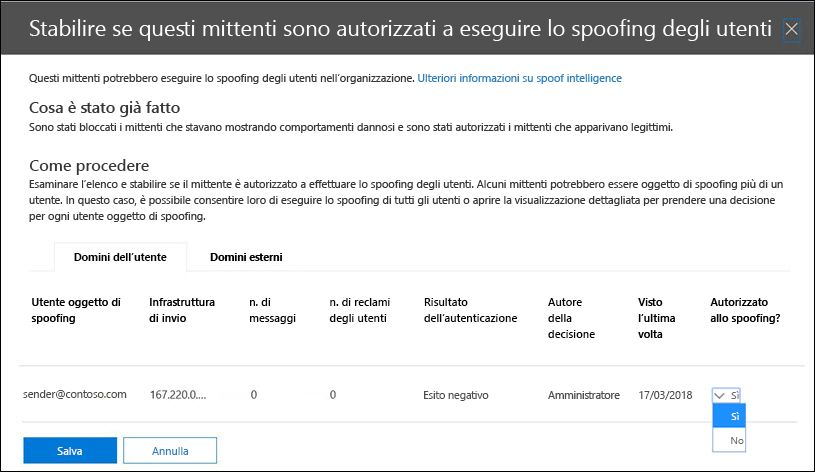

# <a name="configure-spoof-intelligence-in-eop"></a><span data-ttu-id="8bab4-103">Configurare l'intelligence spoof in EOP</span><span class="sxs-lookup"><span data-stu-id="8bab4-103">Configure spoof intelligence in EOP</span></span>

[!INCLUDE [Microsoft 365 Defender rebranding](../includes/microsoft-defender-for-office.md)]


<span data-ttu-id="8bab4-104">In Microsoft 365 organizzazioni con cassette postali in Exchange Online o in organizzazioni di Exchange Online Protection (EOP) senza cassette postali di Exchange Online, i messaggi di posta elettronica in ingresso vengono automaticamente protetti da spoofing da EOP a ottobre 2018.</span><span class="sxs-lookup"><span data-stu-id="8bab4-104">In Microsoft 365 organizations with mailboxes in Exchange Online or standalone Exchange Online Protection (EOP) organizations without Exchange Online mailboxes, inbound email messages are automatically protected against spoofing by EOP as of October 2018.</span></span> <span data-ttu-id="8bab4-105">EOP utilizza l'intelligence spoof come parte della difesa complessiva dell'organizzazione dal phishing.</span><span class="sxs-lookup"><span data-stu-id="8bab4-105">EOP uses spoof intelligence as part of your organization's overall defense against phishing.</span></span> <span data-ttu-id="8bab4-106">Per ulteriori informazioni, vedere [protezione anti-spoofing in EOP](anti-spoofing-protection.md).</span><span class="sxs-lookup"><span data-stu-id="8bab4-106">For more information, see [Anti-spoofing protection in EOP](anti-spoofing-protection.md).</span></span>

<span data-ttu-id="8bab4-107">Quando un mittente falsifica un indirizzo di posta elettronica, sembra essere un utente in uno dei domini dell'organizzazione o un utente in un dominio esterno che invia messaggi di posta elettronica all'organizzazione.</span><span class="sxs-lookup"><span data-stu-id="8bab4-107">When a sender spoofs an email address, they appear to be a user in one of your organization's domains, or a user in an external domain that sends email to your organization.</span></span> <span data-ttu-id="8bab4-108">I pirati informatici che falsificano i mittenti per inviare posta indesiderata o phishing devono essere bloccati.</span><span class="sxs-lookup"><span data-stu-id="8bab4-108">Attackers who spoof senders to send spam or phishing email need to be blocked.</span></span> <span data-ttu-id="8bab4-109">Tuttavia, esistono scenari in cui i mittenti legittimi eseguono lo spoofing.</span><span class="sxs-lookup"><span data-stu-id="8bab4-109">But there are scenarios where legitimate senders are spoofing.</span></span> <span data-ttu-id="8bab4-110">Ad esempio:</span><span class="sxs-lookup"><span data-stu-id="8bab4-110">For example:</span></span>

- <span data-ttu-id="8bab4-111">Scenari legittimi per lo spoofing dei domini interni:</span><span class="sxs-lookup"><span data-stu-id="8bab4-111">Legitimate scenarios for spoofing internal domains:</span></span>

  - <span data-ttu-id="8bab4-112">I mittenti di terze parti utilizzano il dominio per inviare messaggi di posta elettronica in blocco ai propri dipendenti per i sondaggi dell'azienda.</span><span class="sxs-lookup"><span data-stu-id="8bab4-112">Third-party senders use your domain to send bulk mail to your own employees for company polls.</span></span>
  - <span data-ttu-id="8bab4-113">Una società esterna genera e invia gli aggiornamenti pubblicitari o di prodotto per conto dell'utente.</span><span class="sxs-lookup"><span data-stu-id="8bab4-113">An external company generates and sends advertising or product updates on your behalf.</span></span>
  - <span data-ttu-id="8bab4-114">Un assistente deve regolarmente inviare messaggi di posta elettronica per un'altra persona all'interno dell'organizzazione.</span><span class="sxs-lookup"><span data-stu-id="8bab4-114">An assistant regularly needs to send email for another person within your organization.</span></span>
  - <span data-ttu-id="8bab4-115">Un'applicazione interna Invia notifiche tramite posta elettronica.</span><span class="sxs-lookup"><span data-stu-id="8bab4-115">An internal application sends email notifications.</span></span>

- <span data-ttu-id="8bab4-116">Scenari legittimi per lo spoofing dei domini esterni:</span><span class="sxs-lookup"><span data-stu-id="8bab4-116">Legitimate scenarios for spoofing external domains:</span></span>

  - <span data-ttu-id="8bab4-117">Il mittente è presente in una mailing list (noto anche come elenco di discussione) e la mailing list inoltra la posta elettronica dal mittente originale a tutti i partecipanti nella mailing list.</span><span class="sxs-lookup"><span data-stu-id="8bab4-117">The sender is on a mailing list (also known as a discussion list), and the mailing list relays email from the original sender to all the participants on the mailing list.</span></span>
  - <span data-ttu-id="8bab4-118">Una società esterna invia messaggi di posta elettronica per conto di un'altra società (ad esempio, un report automatizzato o un'azienda software-as-a-Service).</span><span class="sxs-lookup"><span data-stu-id="8bab4-118">An external company sends email on behalf of another company (for example, an automated report or a software-as-a-service company).</span></span>

<span data-ttu-id="8bab4-119">L'intelligenza contraffatta e, in particolare, il criterio di intelligence spoof predefinito (e solo), aiuta a garantire che la posta elettronica contraffatta inviata da mittenti legittimi non venga interferita nei filtri per la posta indesiderata di EOP o nei sistemi di posta elettronica esterni, proteggendo gli utenti da attacchi di posta indesiderata</span><span class="sxs-lookup"><span data-stu-id="8bab4-119">Spoof intelligence, and specifically the default (and only) spoof intelligence policy, helps ensure that the spoofed email sent by legitimate senders doesn't get caught up in EOP spam filters or external email systems, while protecting your users from spam or phishing attacks.</span></span>

<span data-ttu-id="8bab4-120">È possibile gestire l'intelligence spoof nel centro sicurezza & Compliance o in PowerShell (Exchange Online PowerShell per Microsoft 365 organizzazioni con cassette postali in Exchange Online, standalone EOP PowerShell per organizzazioni senza cassette postali di Exchange Online).</span><span class="sxs-lookup"><span data-stu-id="8bab4-120">You can manage spoof intelligence in the Security & Compliance Center, or in PowerShell (Exchange Online PowerShell for Microsoft 365 organizations with mailboxes in Exchange Online; standalone EOP PowerShell for organizations without Exchange Online mailboxes).</span></span>

## <a name="what-do-you-need-to-know-before-you-begin"></a><span data-ttu-id="8bab4-121">Che cosa è necessario sapere prima di iniziare</span><span class="sxs-lookup"><span data-stu-id="8bab4-121">What do you need to know before you begin?</span></span>

- <span data-ttu-id="8bab4-122">Aprire il Centro sicurezza e conformità in <https://protection.office.com/>.</span><span class="sxs-lookup"><span data-stu-id="8bab4-122">You open the Security & Compliance Center at <https://protection.office.com/>.</span></span> <span data-ttu-id="8bab4-123">Per passare direttamente alla pagina **Impostazioni di filtro della posta indesiderata**, usare <https://protection.office.com/antispam>.</span><span class="sxs-lookup"><span data-stu-id="8bab4-123">To go directly to the **Anti-spam settings** page, use <https://protection.office.com/antispam>.</span></span> <span data-ttu-id="8bab4-124">Per passare direttamente alla pagina **anti-phishing** , utilizzare <https://protection.office.com/antiphishing> .</span><span class="sxs-lookup"><span data-stu-id="8bab4-124">To go directly to the **Anti-phishing** page, use <https://protection.office.com/antiphishing>.</span></span>

- <span data-ttu-id="8bab4-125">Per informazioni su come connettersi a PowerShell per Exchange Online, vedere [Connettersi a PowerShell per Exchange Online](https://docs.microsoft.com/powershell/exchange/connect-to-exchange-online-powershell).</span><span class="sxs-lookup"><span data-stu-id="8bab4-125">To connect to Exchange Online PowerShell, see [Connect to Exchange Online PowerShell](https://docs.microsoft.com/powershell/exchange/connect-to-exchange-online-powershell).</span></span> <span data-ttu-id="8bab4-126">Per connettersi a PowerShell di EOP autonomo, vedere [Connettersi a PowerShell per Exchange Online Protection](https://docs.microsoft.com/powershell/exchange/connect-to-exchange-online-protection-powershell).</span><span class="sxs-lookup"><span data-stu-id="8bab4-126">To connect to standalone EOP PowerShell, see [Connect to Exchange Online Protection PowerShell](https://docs.microsoft.com/powershell/exchange/connect-to-exchange-online-protection-powershell).</span></span>

- <span data-ttu-id="8bab4-127">Prima di poter eseguire le procedure descritte in questo articolo, è necessario disporre delle autorizzazioni per il Centro sicurezza & Compliance:</span><span class="sxs-lookup"><span data-stu-id="8bab4-127">You need to be assigned permissions in the Security & Compliance Center before you can do the procedures in this article:</span></span>
  - <span data-ttu-id="8bab4-128">Per modificare il criterio di intelligence di spoofing o abilitare o disabilitare l'intelligence di spoofing, è necessario essere membri dei gruppi di ruoli **Gestione organizzazione** o **amministratore sicurezza** .</span><span class="sxs-lookup"><span data-stu-id="8bab4-128">To modify the spoof intelligence policy or enable or disable spoof intelligence, you need to be a member of the **Organization Management** or **Security Administrator** role groups.</span></span>
  - <span data-ttu-id="8bab4-129">Per l'accesso in sola lettura ai criteri di intelligence spoof, è necessario essere membri dei gruppi di ruoli **lettore globale** o lettore di **sicurezza** .</span><span class="sxs-lookup"><span data-stu-id="8bab4-129">For read-only access to the spoof intelligence policy, you need to be a member of the **Global Reader** or **Security Reader** role groups.</span></span>

  <span data-ttu-id="8bab4-130">Per altre informazioni, vedere [Autorizzazioni nel Centro sicurezza e conformità](permissions-in-the-security-and-compliance-center.md).</span><span class="sxs-lookup"><span data-stu-id="8bab4-130">For more information, see [Permissions in the Security & Compliance Center](permissions-in-the-security-and-compliance-center.md).</span></span>

  <span data-ttu-id="8bab4-131">**Note**:</span><span class="sxs-lookup"><span data-stu-id="8bab4-131">**Notes**:</span></span>

  - <span data-ttu-id="8bab4-132">L'aggiunta di utenti al ruolo di Azure Active Directory corrispondente nell'interfaccia di amministrazione di Microsoft 365 fornisce agli utenti le autorizzazioni necessarie per il Centro sicurezza & Compliance _e_ le autorizzazioni per altre funzionalità di Microsoft 365.</span><span class="sxs-lookup"><span data-stu-id="8bab4-132">Adding users to the corresponding Azure Active Directory role in the Microsoft 365 admin center gives users the required permissions in the Security & Compliance Center _and_ permissions for other features in Microsoft 365.</span></span> <span data-ttu-id="8bab4-133">Per altre informazioni, vedere [Informazioni sui ruoli di amministratore](https://docs.microsoft.com/microsoft-365/admin/add-users/about-admin-roles).</span><span class="sxs-lookup"><span data-stu-id="8bab4-133">For more information, see [About admin roles](https://docs.microsoft.com/microsoft-365/admin/add-users/about-admin-roles).</span></span>
  - <span data-ttu-id="8bab4-134">Il gruppo di ruoli di **gestione dell'organizzazione di sola visualizzazione** in [Exchange Online](https://docs.microsoft.com/Exchange/permissions-exo/permissions-exo#role-groups) fornisce anche l'accesso in sola lettura alla funzionalità.</span><span class="sxs-lookup"><span data-stu-id="8bab4-134">The **View-Only Organization Management** role group in [Exchange Online](https://docs.microsoft.com/Exchange/permissions-exo/permissions-exo#role-groups) also gives read-only access to the feature.</span></span>

- <span data-ttu-id="8bab4-135">Per le impostazioni consigliate per l'intelligence di spoofing, vedere [EOP default anti-phishing Policy Settings](recommended-settings-for-eop-and-office365-atp.md#eop-default-anti-phishing-policy-settings).</span><span class="sxs-lookup"><span data-stu-id="8bab4-135">For our recommended settings for spoof intelligence, see [EOP default anti-phishing policy settings](recommended-settings-for-eop-and-office365-atp.md#eop-default-anti-phishing-policy-settings).</span></span>

## <a name="use-the-security--compliance-center-to-manage-spoofed-senders"></a><span data-ttu-id="8bab4-136">Utilizzare il Centro sicurezza & conformità per gestire i mittenti falsificati</span><span class="sxs-lookup"><span data-stu-id="8bab4-136">Use the Security & Compliance Center to manage spoofed senders</span></span>

> [!NOTE]
> <span data-ttu-id="8bab4-137">Se si dispone di un abbonamento a Microsoft 365 Enterprise E5 o se è stato acquistato un componente aggiuntivo Microsoft Defender per Office 365, è possibile gestire anche i mittenti che eseguono lo spoofing del dominio tramite l' [Insight di intelligence di spoofing](walkthrough-spoof-intelligence-insight.md).</span><span class="sxs-lookup"><span data-stu-id="8bab4-137">If you have an Microsoft 365 Enterprise E5 subscription or have separately purchased a Microsoft Defender for Office 365 add-on, you can also manage senders who are spoofing your domain through the [Spoof Intelligence insight](walkthrough-spoof-intelligence-insight.md).</span></span>

1. <span data-ttu-id="8bab4-138">Nel Centro sicurezza e conformità, andare a **Gestione delle minacce** \> **Criteri** \> **Filtro della posta indesiderata**.</span><span class="sxs-lookup"><span data-stu-id="8bab4-138">In the Security & Compliance Center, go to **Threat management** \> **Policy** \> **Anti-spam**.</span></span>

2. <span data-ttu-id="8bab4-139">Nella pagina impostazioni di protezione da **posta indesiderata** , fare clic su  per espandere il **criterio di intelligence spoof**.</span><span class="sxs-lookup"><span data-stu-id="8bab4-139">On the **Anti-spam settings** page, click  to expand **Spoof intelligence policy**.</span></span>

   

3. <span data-ttu-id="8bab4-141">Eseguire una delle selezioni seguenti:</span><span class="sxs-lookup"><span data-stu-id="8bab4-141">Make one of the following selections:</span></span>

   - <span data-ttu-id="8bab4-142">**Esaminare i nuovi mittenti**</span><span class="sxs-lookup"><span data-stu-id="8bab4-142">**Review new senders**</span></span>
   - <span data-ttu-id="8bab4-143">**Visualizza I mittenti già recensiti**</span><span class="sxs-lookup"><span data-stu-id="8bab4-143">**Show me senders I already reviewed**</span></span>

4. <span data-ttu-id="8bab4-144">Nel **decidere se questi mittenti sono autorizzati a falsificare il riquadro a comparsa degli utenti** visualizzato, selezionare una delle seguenti schede:</span><span class="sxs-lookup"><span data-stu-id="8bab4-144">In the **Decide if these senders are allowed to spoof your users** flyout that appears, select one of the following tabs:</span></span>

   - <span data-ttu-id="8bab4-145">**Domini: i** mittenti che eseguono lo spoofing degli utenti nei domini interni.</span><span class="sxs-lookup"><span data-stu-id="8bab4-145">**Your Domains**: Senders spoofing users in your internal domains.</span></span>
   - <span data-ttu-id="8bab4-146">**Domini esterni**: mittenti che eseguono lo spoofing degli utenti nei domini esterni.</span><span class="sxs-lookup"><span data-stu-id="8bab4-146">**External Domains**: Senders spoofing users in external domains.</span></span>

5. <span data-ttu-id="8bab4-147">Fare clic su  nella colonna **consentito di falsificazione?** .</span><span class="sxs-lookup"><span data-stu-id="8bab4-147">Click  in the **Allowed to spoof?** column.</span></span> <span data-ttu-id="8bab4-148">Scegliere **Sì** per consentire il mittente contraffatto oppure scegliere **No** per contrassegnare il messaggio come falsificato.</span><span class="sxs-lookup"><span data-stu-id="8bab4-148">Choose **Yes** to allow the spoofed sender, or choose **No** to mark the message as spoofed.</span></span> <span data-ttu-id="8bab4-149">L'azione è controllata dal criterio anti-phishing predefinito o dai criteri di anti-phishing personalizzati (il valore predefinito è **spostamento messaggio nella cartella posta indesiderata**).</span><span class="sxs-lookup"><span data-stu-id="8bab4-149">The action is controlled by the default anti-phishing policy or custom anti-phishing policies (the default value is **Move message to Junk Email folder**).</span></span> <span data-ttu-id="8bab4-150">Per ulteriori informazioni, vedere [spoofing Settings in anti-phishing Policies](set-up-anti-phishing-policies.md#spoof-settings).</span><span class="sxs-lookup"><span data-stu-id="8bab4-150">For more information, see [Spoof settings in anti-phishing policies](set-up-anti-phishing-policies.md#spoof-settings).</span></span>

   

   <span data-ttu-id="8bab4-152">Le colonne e i valori visualizzati sono illustrati nell'elenco seguente:</span><span class="sxs-lookup"><span data-stu-id="8bab4-152">The columns and values that you see are explained in the following list:</span></span>

   - <span data-ttu-id="8bab4-153">**Utente contraffatto**: l'account utente contraffatto.</span><span class="sxs-lookup"><span data-stu-id="8bab4-153">**Spoofed user**: The user account that's being spoofed.</span></span> <span data-ttu-id="8bab4-154">Si tratta del mittente del messaggio nell'indirizzo from (noto anche come `5322.From` indirizzo) visualizzato nei client di posta elettronica.</span><span class="sxs-lookup"><span data-stu-id="8bab4-154">This is the message sender in the From address (also known as the `5322.From` address) that's shown in email clients.</span></span> <span data-ttu-id="8bab4-155">La validità di questo indirizzo non è controllata da SPF.</span><span class="sxs-lookup"><span data-stu-id="8bab4-155">The validity of this address is not checked by SPF.</span></span>

     - <span data-ttu-id="8bab4-156">Nella scheda **domini** , il valore contiene un singolo indirizzo di posta elettronica o se il server di posta elettronica di origine falsifica più account utente, ne contiene **più di uno**.</span><span class="sxs-lookup"><span data-stu-id="8bab4-156">On the **Your Domains** tab, the value contains a single email address, or if the source email server is spoofing multiple user accounts, it contains **More than one**.</span></span>

     - <span data-ttu-id="8bab4-157">Nella scheda **domini esterni** , il valore contiene il dominio dell'utente contraffatto, non l'indirizzo di posta elettronica completo.</span><span class="sxs-lookup"><span data-stu-id="8bab4-157">On the **External Domains** tab, the value contains the domain of the spoofed user, not the full email address.</span></span>

   - <span data-ttu-id="8bab4-158">**Infrastruttura di invio**: il dominio trovato in una ricerca DNS inversa (record PTR) dell'indirizzo IP del server di posta elettronica di origine o l'indirizzo IP se l'origine non ha un record PTR.</span><span class="sxs-lookup"><span data-stu-id="8bab4-158">**Sending Infrastructure**: The domain found in a reverse DNS lookup (PTR record) of the source email server's IP address, or the IP address if the source has no PTR record.</span></span>

     <span data-ttu-id="8bab4-159">Per ulteriori informazioni sulle origini dei messaggi e sui mittenti di messaggi, vedere [una panoramica degli standard per i messaggi di posta elettronica](how-office-365-validates-the-from-address.md#an-overview-of-email-message-standards).</span><span class="sxs-lookup"><span data-stu-id="8bab4-159">For more information about message sources and message senders, see [An overview of email message standards](how-office-365-validates-the-from-address.md#an-overview-of-email-message-standards).</span></span>

   - <span data-ttu-id="8bab4-160">**# dei messaggi**: il numero di messaggi dall'infrastruttura di invio all'organizzazione che contengono il mittente o i mittenti falsificati specificati negli ultimi 30 giorni.</span><span class="sxs-lookup"><span data-stu-id="8bab4-160">**# of messages**: The number of messages from the sending infrastructure to your organization that contain the specified spoofed sender or senders within the last 30 days.</span></span>

   - <span data-ttu-id="8bab4-161">**# dei reclami degli** utenti: denunce presentate dagli utenti nei confronti del mittente negli ultimi 30 giorni.</span><span class="sxs-lookup"><span data-stu-id="8bab4-161">**# of user complaints**: Complaints filed by your users against this sender within the last 30 days.</span></span> <span data-ttu-id="8bab4-162">I reclami sono di solito sotto forma di invii di posta indesiderata a Microsoft.</span><span class="sxs-lookup"><span data-stu-id="8bab4-162">Complaints are usually in the form of junk submissions to Microsoft.</span></span>

   - <span data-ttu-id="8bab4-163">**Risultato dell'autenticazione**: uno dei seguenti valori:</span><span class="sxs-lookup"><span data-stu-id="8bab4-163">**Authentication result**: One of the following values:</span></span>

      - <span data-ttu-id="8bab4-164">**Superato**: il mittente ha superato i controlli di autenticazione della posta elettronica del mittente (SPF o DKIM).</span><span class="sxs-lookup"><span data-stu-id="8bab4-164">**Passed**: The sender passed sender email authentication checks (SPF or DKIM).</span></span>
      - <span data-ttu-id="8bab4-165">**Errore**: il mittente ha superato i controlli di autenticazione del mittente EOP.</span><span class="sxs-lookup"><span data-stu-id="8bab4-165">**Failed**: The sender failed EOP sender authentication checks.</span></span>
      - <span data-ttu-id="8bab4-166">**Unknown**: il risultato di questi controlli non è noto.</span><span class="sxs-lookup"><span data-stu-id="8bab4-166">**Unknown**: The result of these checks isn't known.</span></span>

   - <span data-ttu-id="8bab4-167">**Decision set by**: indica chi ha determinato se l'infrastruttura di invio è consentita per la falsificazione dell'utente:</span><span class="sxs-lookup"><span data-stu-id="8bab4-167">**Decision set by**: Shows who determined if the sending infrastructure is allowed to spoof the user:</span></span>

       - <span data-ttu-id="8bab4-168">**Criteri di intelligence spoof** (automatici)</span><span class="sxs-lookup"><span data-stu-id="8bab4-168">**Spoof intelligence policy** (automatic)</span></span>
       - <span data-ttu-id="8bab4-169">**Amministratore** (manuale)</span><span class="sxs-lookup"><span data-stu-id="8bab4-169">**Admin** (manual)</span></span>

   - <span data-ttu-id="8bab4-170">**Ultimo** aggiornamento: l'ultima data in cui un messaggio è stato ricevuto dall'infrastruttura di invio che contiene l'utente falsificato.</span><span class="sxs-lookup"><span data-stu-id="8bab4-170">**Last seen**: The last date when a message was received from the sending infrastructure that contains the spoofed user.</span></span>

   - <span data-ttu-id="8bab4-171">**Consentita la falsificazione?**: i valori visualizzati qui sono:</span><span class="sxs-lookup"><span data-stu-id="8bab4-171">**Allowed to spoof?**: The values that you see here are:</span></span>

     - <span data-ttu-id="8bab4-172">**Yes**: i messaggi provenienti dalla combinazione di utenti falsificati e dell'infrastruttura di invio sono consentiti e non vengono considerati come posta elettronica contraffatta.</span><span class="sxs-lookup"><span data-stu-id="8bab4-172">**Yes**: Messages from the combination of spoofed user and sending infrastructure are allowed and not treated as spoofed email.</span></span>

     - <span data-ttu-id="8bab4-173">**No**: i messaggi provenienti dalla combinazione di utenti falsificati e dell'infrastruttura di invio sono contrassegnati come falsificati.</span><span class="sxs-lookup"><span data-stu-id="8bab4-173">**No**: Messages from the combination of spoofed user and sending infrastructure are marked as spoofed.</span></span> <span data-ttu-id="8bab4-174">L'azione è controllata dal criterio anti-phishing predefinito o dai criteri di anti-phishing personalizzati (il valore predefinito è **spostamento messaggio nella cartella posta indesiderata**).</span><span class="sxs-lookup"><span data-stu-id="8bab4-174">The action is controlled by the default anti-phishing policy or custom anti-phishing policies (the default value is **Move message to Junk Email folder**).</span></span> <span data-ttu-id="8bab4-175">Per ulteriori informazioni, vedere la sezione successiva.</span><span class="sxs-lookup"><span data-stu-id="8bab4-175">See the next section for more information.</span></span>

     - <span data-ttu-id="8bab4-176">**Alcuni utenti** (solo **la scheda domini** ): un'infrastruttura di invio è spoofing di più utenti, in cui alcuni utenti falsificati sono consentiti e altri no.</span><span class="sxs-lookup"><span data-stu-id="8bab4-176">**Some users** (**Your Domains** tab only): A sending infrastructure is spoofing multiple users, where some spoofed users are allowed and others are not.</span></span> <span data-ttu-id="8bab4-177">Utilizzare la scheda **Dettagli** per visualizzare gli indirizzi specifici.</span><span class="sxs-lookup"><span data-stu-id="8bab4-177">Use the **Detailed** tab to see the specific addresses.</span></span>

6. <span data-ttu-id="8bab4-178">Nella parte inferiore della pagina fare clic su **Salva**.</span><span class="sxs-lookup"><span data-stu-id="8bab4-178">At the bottom of the page, click **Save**.</span></span>

## <a name="use-powershell-to-manage-spoofed-senders"></a><span data-ttu-id="8bab4-179">Utilizzo di PowerShell per gestire i mittenti falsificati</span><span class="sxs-lookup"><span data-stu-id="8bab4-179">Use PowerShell to manage spoofed senders</span></span>

<span data-ttu-id="8bab4-180">Per visualizzare i mittenti consentiti e bloccati in Intelligence spoof, utilizzare la sintassi seguente:</span><span class="sxs-lookup"><span data-stu-id="8bab4-180">To view allowed and blocked senders in spoof intelligence, use the following syntax:</span></span>

```powershell
Get-PhishFilterPolicy [-AllowedToSpoof <Yes | No | Partial>] [-ConfidenceLevel <Low | High>] [-DecisionBy <Admin | SpoofProtection>] [-Detailed] [-SpoofType <Internal | External>]
```

<span data-ttu-id="8bab4-181">In questo esempio vengono restituite informazioni dettagliate su tutti i mittenti autorizzati a eseguire la falsificazione degli utenti nei domini.</span><span class="sxs-lookup"><span data-stu-id="8bab4-181">This example returns detailed information about all senders that are allowed to spoof users in your domains.</span></span>

```powershell
Get-PhishFilterPolicy -AllowedToSpoof Yes -Detailed -SpoofType Internal
```

<span data-ttu-id="8bab4-182">Per informazioni dettagliate sulla sintassi e sui parametri, vedere [Get-PhishFilterPolicy](https://docs.microsoft.com/powershell/module/exchange/get-phishfilterpolicy).</span><span class="sxs-lookup"><span data-stu-id="8bab4-182">For detailed syntax and parameter information, see [Get-PhishFilterPolicy](https://docs.microsoft.com/powershell/module/exchange/get-phishfilterpolicy).</span></span>

<span data-ttu-id="8bab4-183">Per configurare i mittenti consentiti e bloccati in Intelligence contraffatta, attenersi alla seguente procedura:</span><span class="sxs-lookup"><span data-stu-id="8bab4-183">To configure allowed and blocked senders in spoof intelligence, follow these steps:</span></span>

1. <span data-ttu-id="8bab4-184">Acquisire l'elenco corrente dei mittenti falsificati rilevati scrivendo l'output del cmdlet **Get-PhishFilterPolicy** in un file CSV:</span><span class="sxs-lookup"><span data-stu-id="8bab4-184">Capture the current list of detected spoofed senders by writing the output of the **Get-PhishFilterPolicy** cmdlet to a CSV file:</span></span>

   ```powershell
   Get-PhishFilterPolicy -Detailed | Export-CSV "C:\My Documents\Spoofed Senders.csv"
   ```

2. <span data-ttu-id="8bab4-185">Modificare il file CSV per aggiungere o modificare i valori di **SpoofedUser** (indirizzo di posta elettronica) e **AllowedToSpoof** (Sì o no).</span><span class="sxs-lookup"><span data-stu-id="8bab4-185">Edit the CSV file to add or modify the **SpoofedUser** (email address) and **AllowedToSpoof** (Yes or No) values.</span></span> <span data-ttu-id="8bab4-186">Salvare il file, leggere il file e archiviarlo come variabile denominato `$UpdateSpoofedSenders` :</span><span class="sxs-lookup"><span data-stu-id="8bab4-186">Save the file, read the file, and store the contents as a variable named `$UpdateSpoofedSenders`:</span></span>

   ```powershell
   $UpdateSpoofedSenders = Get-Content -Raw "C:\My Documents\Spoofed Senders.csv"
   ```

3. <span data-ttu-id="8bab4-187">Utilizzare la `$UpdateSpoofedSenders` variabile per configurare il criterio di intelligence di spoofing:</span><span class="sxs-lookup"><span data-stu-id="8bab4-187">Use the `$UpdateSpoofedSenders` variable to configure the spoof intelligence policy:</span></span>

   ```powershell
   Set-PhishFilterPolicy -Identity Default -SpoofAllowBlockList $UpdateSpoofedSenders
   ```

<span data-ttu-id="8bab4-188">Per informazioni dettagliate sulla sintassi e sui parametri, vedere [set-PhishFilterPolicy](https://docs.microsoft.com/powershell/module/exchange/set-phishfilterpolicy).</span><span class="sxs-lookup"><span data-stu-id="8bab4-188">For detailed syntax and parameter information, see [Set-PhishFilterPolicy](https://docs.microsoft.com/powershell/module/exchange/set-phishfilterpolicy).</span></span>

## <a name="use-the-security--compliance-center-to-configure-spoof-intelligence"></a><span data-ttu-id="8bab4-189">Utilizzare il Centro sicurezza & Compliance per configurare l'intelligence spoof</span><span class="sxs-lookup"><span data-stu-id="8bab4-189">Use the Security & Compliance Center to configure spoof intelligence</span></span>

<span data-ttu-id="8bab4-190">Le opzioni di configurazione per l'intelligence spoof sono descritte in [Impostazioni spoof nei criteri di anti-phishing](set-up-anti-phishing-policies.md#spoof-settings).</span><span class="sxs-lookup"><span data-stu-id="8bab4-190">The configuration options for spoof intelligence are described in [Spoof settings in anti-phishing policies](set-up-anti-phishing-policies.md#spoof-settings).</span></span>

<span data-ttu-id="8bab4-191">È possibile configurare le impostazioni di intelligence di spoofing nei criteri di anti-phishing predefiniti e anche in criteri personalizzati.</span><span class="sxs-lookup"><span data-stu-id="8bab4-191">You can configure spoof intelligence settings in the default anti-phishing policy, and also in custom policies.</span></span> <span data-ttu-id="8bab4-192">Per istruzioni in base all'abbonamento, vedere uno dei seguenti argomenti:</span><span class="sxs-lookup"><span data-stu-id="8bab4-192">For instructions based on your subscription, see one of the following topics:</span></span>

- <span data-ttu-id="8bab4-193">[Configurare i criteri di anti-phishing in EOP](configure-anti-phishing-policies-eop.md).</span><span class="sxs-lookup"><span data-stu-id="8bab4-193">[Configure anti-phishing policies in EOP](configure-anti-phishing-policies-eop.md).</span></span>

- <span data-ttu-id="8bab4-194">[Configurazione dei criteri anti-phishing in Microsoft Defender per Office 365](configure-atp-anti-phishing-policies.md).</span><span class="sxs-lookup"><span data-stu-id="8bab4-194">[Configure anti-phishing policies in Microsoft Defender for Office 365](configure-atp-anti-phishing-policies.md).</span></span>

## <a name="how-do-you-know-these-procedures-worked"></a><span data-ttu-id="8bab4-195">Come verificare se queste procedure hanno avuto esito positivo?</span><span class="sxs-lookup"><span data-stu-id="8bab4-195">How do you know these procedures worked?</span></span>

<span data-ttu-id="8bab4-196">Per verificare di aver configurato l'intelligence spoof con i mittenti autorizzati e non autorizzati allo spoofing e di aver configurato le impostazioni di intelligence di spoofing, utilizzare una delle seguenti operazioni:</span><span class="sxs-lookup"><span data-stu-id="8bab4-196">To verify that you've configured spoof intelligence with senders who are allowed and not allowed to spoof, and that you've configured the spoof intelligence settings, use any of the following steps:</span></span>

- <span data-ttu-id="8bab4-197">Nel centro sicurezza & conformità, accedere a criteri di **gestione delle minacce** protezione da \> **Policy** \> **posta indesiderata** \> Espandi criteri di **Intelligence spoof** \> selezionare **Mostra me mittenti già Recensito** \> selezionare la scheda **domini** o **domini esterni** e verificare il valore **consentito per la falsificazione** del mittente.</span><span class="sxs-lookup"><span data-stu-id="8bab4-197">In the Security & Compliance Center, go to **Threat management** \> **Policy** \> **Anti-spam** \> expand **Spoof intelligence policy** \> select **Show me senders I already reviewed** \> select the **Your Domains** or **External Domains** tab, and verify the **Allowed to spoof?** value for the sender.</span></span>

- <span data-ttu-id="8bab4-198">In PowerShell, eseguire i seguenti comandi per visualizzare i mittenti consentiti e non consentiti per la falsificazione:</span><span class="sxs-lookup"><span data-stu-id="8bab4-198">In PowerShell, run the following commands to view the senders who are allowed and not allowed to spoof:</span></span>

  ```powershell
  Get-PhishFilterPolicy -AllowedToSpoof Yes -SpoofType Internal
  Get-PhishFilterPolicy -AllowedToSpoof No -SpoofType Internal
  Get-PhishFilterPolicy -AllowedToSpoof Yes -SpoofType External
  Get-PhishFilterPolicy -AllowedToSpoof No -SpoofType External
  ```

- <span data-ttu-id="8bab4-199">In PowerShell, eseguire il comando riportato di seguito per esportare l'elenco di tutti i mittenti falsificati in un file CSV:</span><span class="sxs-lookup"><span data-stu-id="8bab4-199">In PowerShell, run the following command to export the list of all spoofed senders to a CSV file:</span></span>

   ```powershell
   Get-PhishFilterPolicy -Detailed | Export-CSV "C:\My Documents\Spoofed Senders.csv"
   ```

- <span data-ttu-id="8bab4-200">Nel centro sicurezza & conformità, accedere a criteri di **gestione delle minacce** \> **Policy** \> **anti-phishing** o **ATP anti-phishing**, quindi eseguire una delle operazioni seguenti:  </span><span class="sxs-lookup"><span data-stu-id="8bab4-200">In the Security & Compliance Center, go to **Threat management** \> **Policy**  \> **Anti-phishing**  or **ATP anti-phishing**, and do either of the following steps:</span></span>

  - <span data-ttu-id="8bab4-201">Selezionare un criterio dall'elenco.</span><span class="sxs-lookup"><span data-stu-id="8bab4-201">Select a policy from the list.</span></span> <span data-ttu-id="8bab4-202">Nel riquadro a comparsa visualizzato, verificare i valori nella sezione **spoofing** .</span><span class="sxs-lookup"><span data-stu-id="8bab4-202">In the flyout that appears, verify the values in the **Spoof** section.</span></span>
  - <span data-ttu-id="8bab4-203">Fare clic su **criteri predefiniti**.</span><span class="sxs-lookup"><span data-stu-id="8bab4-203">Click **Default policy**.</span></span> <span data-ttu-id="8bab4-204">Nel riquadro a comparsa visualizzato, verificare i valori nella sezione **spoofing** .</span><span class="sxs-lookup"><span data-stu-id="8bab4-204">In the flyout that appears, verify the values in the **Spoof** section.</span></span>

- <span data-ttu-id="8bab4-205">In Exchange Online PowerShell, sostituire \<Name\> con Office365 antiphishing default o il nome di un criterio personalizzato ed eseguire il seguente comando per verificare le impostazioni:</span><span class="sxs-lookup"><span data-stu-id="8bab4-205">In Exchange Online PowerShell, replace \<Name\> with Office365 AntiPhish Default or the name of a custom policy, and run the following command to verify the settings:</span></span>

  ```PowerShell
  Get-AntiPhishPolicy -Identity "<Name>" | Format-List EnableAntiSpoofEnforcement,EnableUnauthenticatedSender,AuthenticationFailAction
  ```

## <a name="other-ways-to-manage-spoofing-and-phishing"></a><span data-ttu-id="8bab4-206">Altre modalità di gestione dello spoofing e del phishing</span><span class="sxs-lookup"><span data-stu-id="8bab4-206">Other ways to manage spoofing and phishing</span></span>

<span data-ttu-id="8bab4-207">Essere diligenti sullo spoofing e la protezione da phishing.</span><span class="sxs-lookup"><span data-stu-id="8bab4-207">Be diligent about spoofing and phishing protection.</span></span> <span data-ttu-id="8bab4-208">Di seguito sono riportati alcuni modi per verificare se i mittenti eseguono lo spoofing del dominio e impediscono loro di danneggiare l'organizzazione:</span><span class="sxs-lookup"><span data-stu-id="8bab4-208">Here are related ways to check on senders spoofing your domain and help prevent them from damaging your organization:</span></span>

- <span data-ttu-id="8bab4-209">Controllare il **report di posta contraffatta**.</span><span class="sxs-lookup"><span data-stu-id="8bab4-209">Check the **Spoof Mail Report**.</span></span> <span data-ttu-id="8bab4-210">È possibile utilizzare questo rapporto spesso per visualizzare e facilitare la gestione dei mittenti falsificati.</span><span class="sxs-lookup"><span data-stu-id="8bab4-210">You can use this report often to view and help manage spoofed senders.</span></span> <span data-ttu-id="8bab4-211">Per informazioni, vedere [spoofing detections report](view-email-security-reports.md#spoof-detections-report).</span><span class="sxs-lookup"><span data-stu-id="8bab4-211">For information, see [Spoof Detections report](view-email-security-reports.md#spoof-detections-report).</span></span>

- <span data-ttu-id="8bab4-212">Esaminare la configurazione di Sender Policy Framework (SPF).</span><span class="sxs-lookup"><span data-stu-id="8bab4-212">Review your Sender Policy Framework (SPF) configuration.</span></span> <span data-ttu-id="8bab4-213">Per una rapida introduzione a SPF e le istruzioni di configurazione, vedere [Configurare SPF in Microsoft 365 per prevenire lo spoofing](set-up-spf-in-office-365-to-help-prevent-spoofing.md).</span><span class="sxs-lookup"><span data-stu-id="8bab4-213">For a quick introduction to SPF and to get it configured quickly, see [Set up SPF in Microsoft 365 to help prevent spoofing](set-up-spf-in-office-365-to-help-prevent-spoofing.md).</span></span> <span data-ttu-id="8bab4-214">Per informazioni più dettagliate su come Office 365 utilizza SPF oppure per risolvere i problemi o per eseguire distribuzioni non standard (ad esempio, le distribuzioni ibride), iniziare da [How Office 365 uses Sender Policy Framework (SPF) to prevent spoofing](how-office-365-uses-spf-to-prevent-spoofing.md).</span><span class="sxs-lookup"><span data-stu-id="8bab4-214">For a more in-depth understanding of how Office 365 uses SPF, or for troubleshooting or non-standard deployments such as hybrid deployments, start with [How Office 365 uses Sender Policy Framework (SPF) to prevent spoofing](how-office-365-uses-spf-to-prevent-spoofing.md).</span></span>

- <span data-ttu-id="8bab4-215">Esaminare la configurazione della posta DomainKeys (DKIM) identificata.</span><span class="sxs-lookup"><span data-stu-id="8bab4-215">Review your DomainKeys Identified Mail (DKIM) configuration.</span></span> <span data-ttu-id="8bab4-216">È consigliabile utilizzare DKIM oltre a SPF e DMARC per impedire agli aggressori di inviare messaggi che sembrano provenienti dal proprio dominio.</span><span class="sxs-lookup"><span data-stu-id="8bab4-216">You should use DKIM in addition to SPF and DMARC to help prevent attackers from sending messages that look like they are coming from your domain.</span></span> <span data-ttu-id="8bab4-217">DKIM consente di aggiungere una firma digitale nell'intestazione dei messaggi di posta elettronica.</span><span class="sxs-lookup"><span data-stu-id="8bab4-217">DKIM lets you add a digital signature to email messages in the message header.</span></span> <span data-ttu-id="8bab4-218">Per ulteriori informazioni, vedere [utilizzare DKIM per convalidare la posta elettronica in uscita inviata dal dominio personalizzato in Office 365](use-dkim-to-validate-outbound-email.md).</span><span class="sxs-lookup"><span data-stu-id="8bab4-218">For information, see [Use DKIM to validate outbound email sent from your custom domain in Office 365](use-dkim-to-validate-outbound-email.md).</span></span>

- <span data-ttu-id="8bab4-219">Esaminare la configurazione dell'autenticazione dei messaggi basata sul dominio, della creazione di report e della conformità (DMARC).</span><span class="sxs-lookup"><span data-stu-id="8bab4-219">Review your Domain-based Message Authentication, Reporting, and Conformance (DMARC) configuration.</span></span> <span data-ttu-id="8bab4-220">L'implementazione di DMARC con SPF e DKIM fornisce un'ulteriore protezione dallo spoofing e dal phishing.</span><span class="sxs-lookup"><span data-stu-id="8bab4-220">Implementing DMARC with SPF and DKIM provides additional protection against spoofing and phishing email.</span></span> <span data-ttu-id="8bab4-221">DMARC consente ai sistemi di posta di ricezione di determinare cosa fare con i messaggi inviati dal dominio che non supera i controlli SPF o DKIM.</span><span class="sxs-lookup"><span data-stu-id="8bab4-221">DMARC helps receiving mail systems determine what to do with messages sent from your domain that fail SPF or DKIM checks.</span></span> <span data-ttu-id="8bab4-222">Per informazioni, vedere [utilizzare DMARC per convalidare la posta elettronica in Office 365](use-dmarc-to-validate-email.md).</span><span class="sxs-lookup"><span data-stu-id="8bab4-222">For information, see [Use DMARC to validate email in Office 365](use-dmarc-to-validate-email.md).</span></span>
